# dbt (Data Build Tool) — Comprehensive Notes

> **Last Updated:** May 2026
> **Scope:** Fundamentals, Architecture, Core Concepts, Optimization, Debugging, Interview Q&A

---

## 📑 Index

1. [What is dbt?](#1-what-is-dbt)
2. [dbt Architecture Overview](#2-dbt-architecture-overview)
3. [dbt Core vs dbt Cloud](#3-dbt-core-vs-dbt-cloud)
4. [dbt Project Structure](#4-dbt-project-structure)
5. [Models](#5-models)
   - 5.1 [Materializations](#51-materializations)
   - 5.2 [Model Configuration](#52-model-configuration)
   - 5.3 [Ref Function](#53-ref-function)
6. [Sources](#6-sources)
7. [Seeds](#7-seeds)
8. [Snapshots (SCD Type 2)](#8-snapshots-scd-type-2)
9. [Tests](#9-tests)
   - 9.1 [Generic Tests](#91-generic-tests)
   - 9.2 [Singular Tests](#92-singular-tests)
   - 9.3 [Custom Generic Tests](#93-custom-generic-tests)
10. [Macros & Jinja Templating](#10-macros--jinja-templating)
11. [Packages](#11-packages)
12. [Hooks & Operations](#12-hooks--operations)
13. [Exposures](#13-exposures)
14. [Metrics Layer](#14-metrics-layer)
15. [DAG & Lineage Graph](#15-dag--lineage-graph)
16. [Incremental Models (Deep Dive)](#16-incremental-models-deep-dive)
17. [dbt Execution Flow](#17-dbt-execution-flow)
18. [Environments & Profiles](#18-environments--profiles)
19. [Optimization Techniques](#19-optimization-techniques)
20. [Debugging in dbt](#20-debugging-in-dbt)
21. [Best Practices](#21-best-practices)
22. [Interview Questions & Answers](#22-interview-questions--answers)

---

## 1. What is dbt?

**dbt (Data Build Tool)** is an open-source transformation framework that enables data analysts and engineers to transform data in their warehouse using **SQL** (and Python) following **software engineering best practices** such as modularity, version control, testing, and documentation.

> "dbt is the T in ELT." — It does **not** handle Extract or Load; it only transforms data that already exists in your data warehouse.

### Key Value Propositions

| Feature | Description |
|---|---|
| **SQL-first** | Write transformations in SQL; dbt compiles and runs them |
| **Modularity** | Break transformations into reusable models with `ref()` |
| **Testing** | Built-in data quality tests (unique, not_null, accepted_values, relationships) |
| **Documentation** | Auto-generate docs with lineage graphs |
| **Version Control** | Everything in Git — models, tests, docs |
| **DRY principle** | Macros and Jinja eliminate repetition |
| **Incremental loads** | Only process new/changed data, not full refresh |

### What dbt Is NOT

- NOT an orchestrator (use Airflow, Prefect, dbt Cloud Scheduler)
- NOT a data extraction or loading tool (use Fivetran, Stitch, Airbyte)
- NOT a query engine (it compiles SQL and runs it in your warehouse)

---

## 2. dbt Architecture Overview

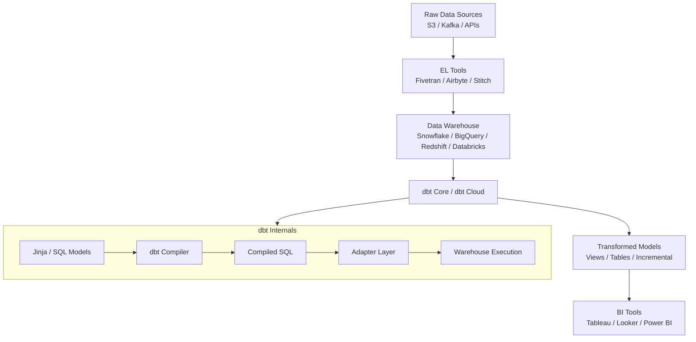

### dbt Component Breakdown

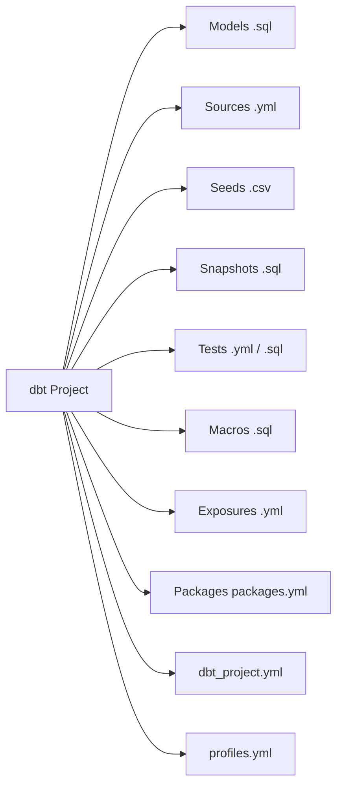

### How dbt Executes

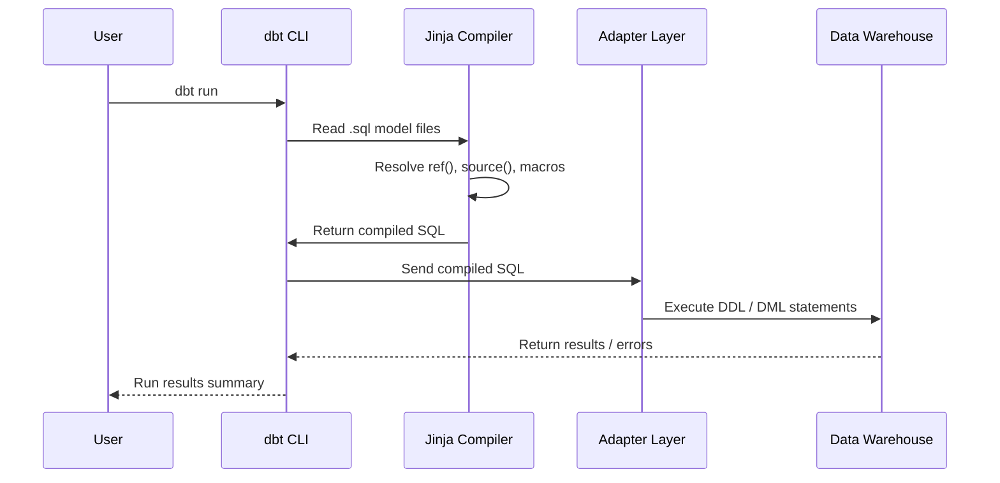

---

## 3. dbt Core vs dbt Cloud

| Feature | dbt Core | dbt Cloud |
|---|---|---|
| **Type** | Open-source CLI | Managed SaaS platform |
| **Cost** | Free | Paid (Developer tier free) |
| **Scheduling** | External (Airflow etc.) | Built-in Scheduler |
| **IDE** | Your own editor / VS Code | Cloud IDE (browser-based) |
| **CI/CD** | Manual setup | Built-in CI/CD |
| **Docs hosting** | Self-hosted | Hosted automatically |
| **Metadata API** | Not available | Available (Discovery API) |
| **Semantic Layer** | Limited | Full support |
| **SSO / RBAC** | Not available | Available (Enterprise) |

---

## 4. dbt Project Structure

```
my_dbt_project/
├── dbt_project.yml          # Project configuration
├── profiles.yml             # Connection config (usually ~/.dbt/profiles.yml)
├── packages.yml             # External package dependencies
├── models/
│   ├── staging/             # 1:1 mapping from raw source tables
│   │   ├── stg_orders.sql
│   │   ├── stg_customers.sql
│   │   └── _stg__sources.yml  # Source definitions + staging tests
│   ├── intermediate/        # Business logic transformations
│   │   └── int_orders_enriched.sql
│   └── marts/               # Final analytics-ready models
│       ├── finance/
│       │   └── fct_revenue.sql
│       └── core/
│           ├── dim_customers.sql
│           └── fct_orders.sql
├── seeds/
│   └── country_codes.csv
├── snapshots/
│   └── orders_snapshot.sql
├── tests/
│   └── assert_positive_revenue.sql
├── macros/
│   └── generate_surrogate_key.sql
├── analyses/                # Ad-hoc SQL queries (not materialized)
│   └── revenue_analysis.sql
└── docs/
    └── overview.md
```

### dbt_project.yml

```yaml
name: 'my_dbt_project'
version: '1.0.0'
config-version: 2

profile: 'default'

model-paths: ["models"]
analysis-paths: ["analyses"]
test-paths: ["tests"]
seed-paths: ["seeds"]
macro-paths: ["macros"]
snapshot-paths: ["snapshots"]

target-path: "target"
clean-targets: ["target", "dbt_packages"]

models:
  my_dbt_project:
    staging:
      +materialized: view
      +schema: staging
    intermediate:
      +materialized: ephemeral
    marts:
      +materialized: table
      finance:
        +tags: ['finance', 'daily']
```

### profiles.yml

```yaml
default:
  target: dev
  outputs:
    dev:
      type: snowflake
      account: xy12345.us-east-1
      user: "{{ env_var('DBT_USER') }}"
      password: "{{ env_var('DBT_PASSWORD') }}"
      role: TRANSFORMER
      database: DEV_DB
      warehouse: COMPUTE_WH
      schema: dbt_dev
      threads: 4
    prod:
      type: snowflake
      account: xy12345.us-east-1
      user: "{{ env_var('DBT_USER') }}"
      password: "{{ env_var('DBT_PASSWORD') }}"
      role: TRANSFORMER
      database: PROD_DB
      warehouse: COMPUTE_WH_LARGE
      schema: analytics
      threads: 16
```

---

## 5. Models

A **model** is a single `.sql` file in the `models/` directory. It is a `SELECT` statement — dbt wraps it in a `CREATE TABLE AS` or `CREATE VIEW AS` DDL automatically.

### Example Model

```sql
-- models/staging/stg_orders.sql

with source as (
    select * from {{ source('raw', 'orders') }}
),

renamed as (
    select
        id              as order_id,
        user_id         as customer_id,
        status          as order_status,
        created_at      as ordered_at,
        amount          as order_amount_usd
    from source
    where status != 'cancelled'
)

select * from renamed
```

---

### 5.1 Materializations

Materialization determines **how dbt builds the model** in the warehouse.

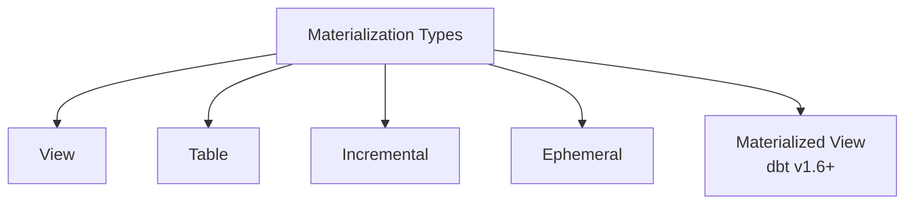

| Materialization | Description | When to Use |
|---|---|---|
| **view** | Creates a SQL view | Lightweight transformations, frequently changing logic |
| **table** | Creates a physical table (full refresh) | Medium datasets, when performance > freshness |
| **incremental** | Appends/merges only new rows | Large datasets, event/log tables |
| **ephemeral** | CTE injected at compile time, no object in warehouse | Intermediate reusable logic, avoid polluting schema |
| **materialized view** | Warehouse-native materialized view | Databases that support it (Snowflake, BigQuery, Redshift) |

#### View

```sql
-- models/staging/stg_customers.sql
-- dbt_project.yml sets staging as view by default

select
    customer_id,
    first_name,
    last_name,
    email
from {{ source('raw', 'customers') }}
```

#### Table

```sql
-- models/marts/dim_customers.sql
{{ config(materialized='table') }}

select
    c.customer_id,
    c.first_name || ' ' || c.last_name as full_name,
    c.email,
    count(o.order_id) as total_orders
from {{ ref('stg_customers') }} c
left join {{ ref('stg_orders') }} o using (customer_id)
group by 1, 2, 3
```

#### Incremental

```sql
-- models/marts/fct_events.sql
{{ config(
    materialized='incremental',
    unique_key='event_id',
    incremental_strategy='merge'
) }}

select
    event_id,
    user_id,
    event_type,
    created_at
from {{ source('raw', 'events') }}


  where created_at > (select max(created_at) from {{ this }})

```

#### Ephemeral

```sql
-- models/intermediate/int_orders_enriched.sql
{{ config(materialized='ephemeral') }}

select
    o.order_id,
    o.customer_id,
    o.order_amount_usd,
    c.full_name as customer_name
from {{ ref('stg_orders') }} o
join {{ ref('stg_customers') }} c using (customer_id)
```

> Ephemeral models are inlined as CTEs when referenced. No table/view is created.

---

### 5.2 Model Configuration

Configuration can be set at three levels (most specific wins):

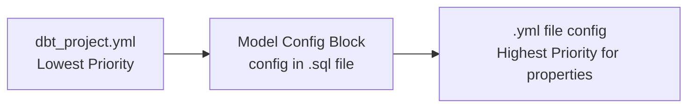

**Config block in SQL:**

```sql
{{ config(
    materialized='incremental',
    schema='finance',
    alias='fact_revenue',
    unique_key='revenue_id',
    tags=['finance', 'daily'],
    post_hook="grant select on {{ this }} to role REPORTER",
    cluster_by=['transaction_date'],   -- Snowflake clustering
    partition_by={                     -- BigQuery partitioning
        'field': 'transaction_date',
        'data_type': 'date'
    }
) }}
```

---

### 5.3 Ref Function

`{{ ref('model_name') }}` is the cornerstone of dbt. It:

1. **Builds the DAG** — tells dbt about dependencies
2. **Resolves schema** dynamically based on target environment
3. **Ensures correct build order** during `dbt run`

```sql
-- Without ref (bad - hardcoded schema)
select * from dev_schema.stg_orders

-- With ref (good - environment-aware)
select * from {{ ref('stg_orders') }}
-- Compiles to: select * from "DEV_DB"."dbt_dev"."stg_orders"
```

---

## 6. Sources

**Sources** declare raw tables that dbt reads from but doesn't own (loaded by EL tools).

```yaml
# models/staging/_sources.yml
version: 2

sources:
  - name: raw
    database: RAW_DB
    schema: public
    loader: fivetran
    freshness:
      warn_after: {count: 12, period: hour}
      error_after: {count: 24, period: hour}
    loaded_at_field: _fivetran_synced

    tables:
      - name: orders
        description: "Raw orders from the transactional database"
        freshness:
          warn_after: {count: 6, period: hour}
        columns:
          - name: id
            description: "Primary key"
            tests:
              - unique
              - not_null
          - name: status
            tests:
              - accepted_values:
                  values: ['placed', 'shipped', 'completed', 'cancelled']

      - name: customers
        description: "Raw customer records"
```

**Usage in SQL:**

```sql
select * from {{ source('raw', 'orders') }}
-- Compiles to: select * from "RAW_DB"."public"."orders"
```

**Source freshness check:**

```bash
dbt source freshness
```

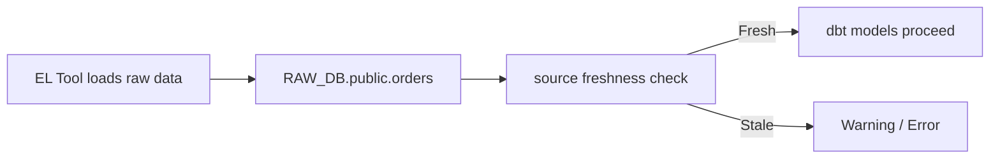

---

## 7. Seeds

**Seeds** are CSV files that dbt loads into the warehouse as tables. Useful for static reference/lookup data.

```
seeds/
└── country_codes.csv
```

```csv
country_code,country_name,region
US,United States,North America
GB,United Kingdom,Europe
IN,India,Asia
DE,Germany,Europe
```

**Configuration:**

```yaml
# dbt_project.yml
seeds:
  my_dbt_project:
    country_codes:
      +column_types:
        country_code: varchar(2)
      +schema: reference
```

**Run seeds:**

```bash
dbt seed
dbt seed --select country_codes   # specific seed
```

**Reference in models:**

```sql
select
    o.order_id,
    c.country_name
from {{ ref('stg_orders') }} o
join {{ ref('country_codes') }} c on o.country_code = c.country_code
```

---

## 8. Snapshots (SCD Type 2)

Snapshots capture **slowly changing dimension (SCD Type 2)** history — tracking row changes over time.

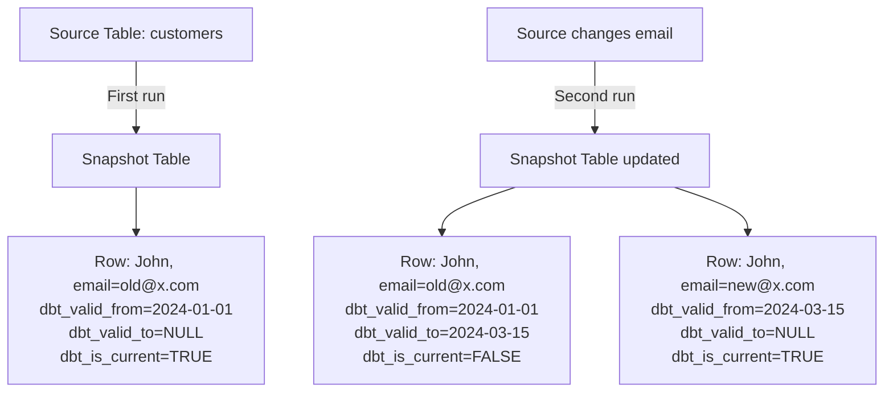

### Snapshot File

```sql
-- snapshots/customers_snapshot.sql


{{
    config(
        target_schema='snapshots',
        unique_key='customer_id',
        strategy='timestamp',       -- or 'check'
        updated_at='updated_at',
        invalidate_hard_deletes=True
    )
}}

select
    customer_id,
    email,
    first_name,
    last_name,
    phone,
    updated_at
from {{ source('raw', 'customers') }}


```

### Snapshot Strategies

| Strategy | How it works | Use Case |
|---|---|---|
| **timestamp** | Compares `updated_at` column to detect changes | Source has reliable updated_at |
| **check** | Checks specified columns for any changes | Source has no updated_at; check specific cols |

**Check strategy example:**

```sql

{{
    config(
        target_schema='snapshots',
        unique_key='order_id',
        strategy='check',
        check_cols=['status', 'amount']   -- or check_cols='all'
    )
}}
select * from {{ source('raw', 'orders') }}

```

**Run snapshots:**

```bash
dbt snapshot
dbt snapshot --select customers_snapshot
```

### dbt-generated Snapshot Columns

| Column | Description |
|---|---|
| `dbt_scd_id` | Unique ID for each snapshot record |
| `dbt_updated_at` | When the snapshot row was last updated |
| `dbt_valid_from` | When this version of the row became active |
| `dbt_valid_to` | When this version was superseded (NULL = current) |

---

## 9. Tests

dbt tests validate data quality. They run as SQL queries — a test **passes** if the query returns 0 rows.

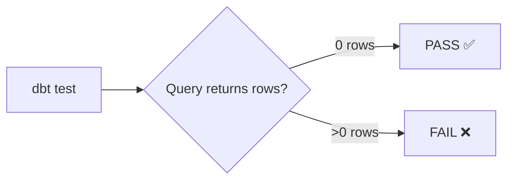

---

### 9.1 Generic Tests

Defined in `.yml` files, applied to columns/models.

```yaml
# models/staging/_stg_models.yml
version: 2

models:
  - name: stg_orders
    description: "Staged orders"
    columns:
      - name: order_id
        description: "Primary key"
        tests:
          - unique
          - not_null
      - name: customer_id
        tests:
          - not_null
          - relationships:
              to: ref('stg_customers')
              field: customer_id
      - name: order_status
        tests:
          - accepted_values:
              values: ['placed', 'shipped', 'completed', 'returned']
              quote: true
      - name: order_amount_usd
        tests:
          - not_null
          - dbt_utils.expression_is_true:
              expression: ">= 0"
```

**Built-in Generic Tests:**

| Test | Description |
|---|---|
| `unique` | All values in column are distinct |
| `not_null` | No NULL values in column |
| `accepted_values` | Values are within a defined list |
| `relationships` | Foreign key integrity check |

---

### 9.2 Singular Tests

Custom SQL queries in the `tests/` directory.

```sql
-- tests/assert_positive_revenue.sql
-- Fails if any revenue is negative

select
    order_id,
    order_amount_usd
from {{ ref('fct_orders') }}
where order_amount_usd < 0
```

```sql
-- tests/assert_orders_have_customers.sql
-- All orders must have a matching customer

select
    o.order_id
from {{ ref('fct_orders') }} o
left join {{ ref('dim_customers') }} c using (customer_id)
where c.customer_id is null
```

---

### 9.3 Custom Generic Tests

Create reusable parameterized tests as macros.

```sql
-- macros/test_not_negative.sql


select
    {{ column_name }}
from {{ model }}
where {{ column_name }} < 0


```

Usage in `.yml`:

```yaml
columns:
  - name: order_amount_usd
    tests:
      - not_negative
```

**Run tests:**

```bash
dbt test                              # all tests
dbt test --select stg_orders          # tests for one model
dbt test --select source:raw          # tests for a source
dbt test --select tag:finance         # tests by tag
dbt test --store-failures             # save failures to a table
```

---

## 10. Macros & Jinja Templating

**Macros** are reusable Jinja2 functions defined in `.sql` files under `macros/`.

### Jinja Basics

| Syntax | Purpose |
|---|---|
| `{{ expression }}` | Output a value |
| `` | Control flow (if, for, set) |
| `{# comment #}` | Comment (not rendered) |

### Built-in dbt Variables & Functions

```sql
-- Environment variables
{{ env_var('MY_ENV_VAR') }}
{{ env_var('MY_ENV_VAR', 'default_value') }}

-- dbt variables (set in dbt_project.yml or CLI)
{{ var('start_date', '2024-01-01') }}

-- Target info
{{ target.name }}          -- 'dev' or 'prod'
{{ target.schema }}        -- 'dbt_dev' or 'analytics'
{{ target.database }}
{{ target.type }}          -- 'snowflake', 'bigquery', etc.

-- This model's relation
{{ this }}                 -- full relation name
{{ this.schema }}
{{ this.name }}
```

### Custom Macro Examples

**Surrogate Key:**

```sql
-- macros/generate_surrogate_key.sql

    {{ dbt_utils.generate_surrogate_key(field_list) }}

```

**Date Spine:**

```sql
-- macros/cents_to_dollars.sql

    round(1.0 * {{ column_name }} / 100, {{ decimal_places }})

```

Usage:

```sql
select
    order_id,
    {{ cents_to_dollars('amount_cents') }} as amount_usd
from {{ ref('stg_orders') }}
```

**Conditional Logic:**

```sql
-- macros/is_weekend.sql

    case
        when dayofweek({{ date_column }}) in (1, 7) then true
        else false
    end

```

**Dynamic SQL with Jinja:**

```sql


select
    order_id,
    
    sum(case when payment_method = '{{ method }}' then amount else 0 end) as {{ method }}_amount
    ,
    
from {{ ref('stg_payments') }}
group by 1
```

**Calling macros that execute SQL:**

```sql

    
        select distinct {{ column }}
        from {{ table }}
        order by {{ column }}
    

    
    
        
    
        
    

    {{ return(values) }}

```

---

## 11. Packages

dbt packages are reusable collections of macros, models, and tests.

```yaml
# packages.yml
packages:
  - package: dbt-labs/dbt_utils
    version: 1.1.1
  - package: calogica/dbt_expectations
    version: 0.10.1
  - package: dbt-labs/codegen
    version: 0.12.1
  - git: "https://github.com/my-org/my-dbt-package.git"
    revision: main
```

```bash
dbt deps   # install packages to dbt_packages/
```

### Popular Packages

| Package | Purpose |
|---|---|
| **dbt_utils** | Utility macros: surrogate_key, date_spine, pivot, union_relations |
| **dbt_expectations** | 50+ data quality tests inspired by Great Expectations |
| **codegen** | Auto-generate model/source YAML from warehouse metadata |
| **audit_helper** | Compare model outputs between runs/environments |
| **dbt_date** | Date manipulation utilities |
| **elementary** | Data observability and anomaly detection |

### dbt_utils Examples

```sql
-- Surrogate key
select
    {{ dbt_utils.generate_surrogate_key(['order_id', 'line_item_id']) }} as unique_id,
    order_id,
    line_item_id
from {{ ref('stg_order_items') }}
```

```sql
-- Union all tables matching a pattern
{{ dbt_utils.union_relations(
    relations=[ref('orders_2023'), ref('orders_2024'), ref('orders_2025')]
) }}
```

```sql
-- Date spine (generate a row for each date)
{{ dbt_utils.date_spine(
    datepart="day",
    start_date="cast('2024-01-01' as date)",
    end_date="cast('2025-01-01' as date)"
) }}
```

---

## 12. Hooks & Operations

**Hooks** run SQL before or after model execution.

| Hook | Trigger |
|---|---|
| `pre-hook` | Before model runs |
| `post-hook` | After model runs |
| `on-run-start` | Before the entire `dbt run` |
| `on-run-end` | After the entire `dbt run` |

### Hook Examples

```sql
-- In model config block
{{ config(
    pre_hook="alter session set query_tag = 'dbt_run'",
    post_hook=[
        "grant select on {{ this }} to role REPORTER",
        "call update_audit_log('{{ this.name }}', current_timestamp())"
    ]
) }}
```

```yaml
# dbt_project.yml - global hooks
on-run-start:
  - "{{ create_audit_log_table() }}"

on-run-end:
  - "{{ notify_slack('dbt run complete') }}"

models:
  my_dbt_project:
    marts:
      +post-hook: "grant select on {{ this }} to role REPORTER"
```

### Operations

One-off macros run with `dbt run-operation`:

```sql
-- macros/drop_old_relations.sql

    
        select table_name
        from information_schema.tables
        where table_schema = '{{ schema_name }}'
        and created < current_date - {{ days_old }}
    

    
    
        
        {{ log("Dropped: " ~ table[0], info=True) }}
    

```

```bash
dbt run-operation drop_old_relations --args '{"schema_name": "dbt_dev", "days_old": 7}'
```

---

## 13. Exposures

**Exposures** document downstream consumers of dbt models (dashboards, notebooks, ML models).

```yaml
# models/exposures.yml
version: 2

exposures:
  - name: weekly_revenue_dashboard
    type: dashboard          # dashboard, notebook, analysis, ml, application
    maturity: high           # low, medium, high
    url: https://bi-tool.company.com/dashboards/42
    description: >
      Weekly revenue KPIs for the Finance team.

    depends_on:
      - ref('fct_revenue')
      - ref('dim_customers')

    owner:
      name: Finance Analytics Team
      email: analytics@company.com

    tags: ['finance', 'executive']
```

Exposures appear in `dbt docs` lineage graph, showing **impact analysis** — which dashboards will break if a model changes.

---

## 14. Metrics Layer

dbt Metrics (Semantic Layer in dbt v1.6+) defines business metrics in code.

```yaml
# models/metrics.yml (dbt v1.6+ uses semantic models)
semantic_models:
  - name: orders
    model: ref('fct_orders')
    entities:
      - name: order
        type: primary
        expr: order_id
      - name: customer
        type: foreign
        expr: customer_id
    dimensions:
      - name: order_date
        type: time
        type_params:
          time_granularity: day
      - name: order_status
        type: categorical
    measures:
      - name: order_total
        agg: sum
        expr: order_amount_usd
      - name: order_count
        agg: count
        expr: order_id

metrics:
  - name: revenue
    label: Total Revenue
    type: simple
    type_params:
      measure: order_total

  - name: average_order_value
    label: Average Order Value
    type: ratio
    type_params:
      numerator: revenue
      denominator: order_count
```

---

## 15. DAG & Lineage Graph

dbt builds a **Directed Acyclic Graph (DAG)** from `ref()` and `source()` calls to determine execution order.

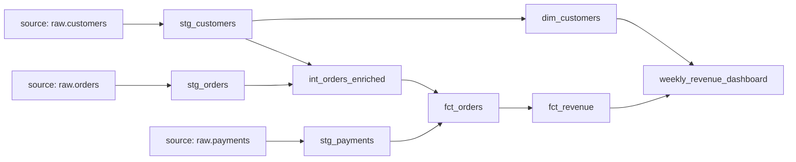

### Node Selection Syntax

```bash
# Select specific model
dbt run --select stg_orders

# Select model and all upstream (dependencies)
dbt run --select +fct_orders

# Select model and all downstream (dependents)
dbt run --select fct_orders+

# Select both upstream and downstream
dbt run --select +fct_orders+

# Select all models in a folder
dbt run --select models/marts/

# Select by tag
dbt run --select tag:finance

# Select by materialization
dbt run --select config.materialized:incremental

# Exclude models
dbt run --select marts/ --exclude fct_orders

# Select changed models (CI use case)
dbt run --select state:modified+   # modified + downstream

# Wildcard
dbt run --select stg_*
```

### Graph Operations

```bash
dbt ls                          # list all models
dbt ls --select +fct_orders     # list model + ancestors
dbt ls --output json            # machine-readable output
```

---

## 16. Incremental Models (Deep Dive)

Incremental models process only **new or changed rows**, avoiding full table scans.

### Incremental Strategies

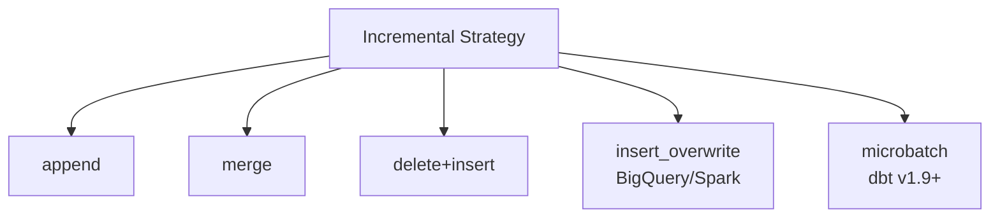

| Strategy | Behaviour | Best For |
|---|---|---|
| `append` | Only INSERT new rows | Immutable event streams (no updates) |
| `merge` | MERGE (upsert) based on unique_key | Mutable records with updates |
| `delete+insert` | DELETE matching rows, then INSERT | When MERGE is slow (Redshift) |
| `insert_overwrite` | Overwrite entire partitions | Partitioned tables (BigQuery, Spark) |

### Detailed Incremental Model

```sql
{{ config(
    materialized='incremental',
    unique_key='order_id',
    incremental_strategy='merge',
    on_schema_change='sync_all_columns',  -- handle new columns
    partition_by={
        'field': 'ordered_at',
        'data_type': 'timestamp',
        'granularity': 'day'
    }
) }}

with source as (
    select * from {{ source('raw', 'orders') }}
),

transformed as (
    select
        order_id,
        customer_id,
        order_status,
        order_amount_usd,
        ordered_at
    from source
)

select * from transformed


    -- Only process rows newer than the latest row in the current table
    where ordered_at > (
        select coalesce(max(ordered_at), '1900-01-01'::timestamp)
        from {{ this }}
    )

```

### on_schema_change Behaviour

| Value | Behaviour |
|---|---|
| `ignore` (default) | New columns in SQL ignored; existing schema unchanged |
| `fail` | Error if schema changes detected |
| `append_new_columns` | New columns added to table |
| `sync_all_columns` | Adds new columns, removes deleted columns |

### Full Refresh

Force a complete rebuild of an incremental model:

```bash
dbt run --select fct_events --full-refresh
```

---

## 17. dbt Execution Flow

```mermaid
flowchart TD
    A[dbt run] --> B[Parse dbt_project.yml\n& profiles.yml]
    B --> C[Discover all .sql / .yml files]
    C --> D[Build DAG from ref() / source()]
    D --> E[Resolve node selection\n--select filters]
    E --> F[Topological sort of DAG]
    F --> G[Jinja compilation\nResolve macros, ref, source]
    G --> H[Generate compiled SQL\nstored in target/compiled/]
    H --> I[Execute SQL in warehouse\nrespect --threads]
    I --> J[Write run artifacts\ntarget/run_results.json\ntarget/manifest.json]
    J --> K[Display results summary]
```

### Key Artifacts in `target/`

| File | Purpose |
|---|---|
| `manifest.json` | Full graph: all models, tests, sources, metadata |
| `run_results.json` | Results of the most recent invocation |
| `catalog.json` | Column-level metadata (generated by `dbt docs generate`) |
| `compiled/` | Compiled SQL before execution |
| `run/` | Runnable SQL with DDL wrappers |

---

## 18. Environments & Profiles

### Multi-Environment Setup

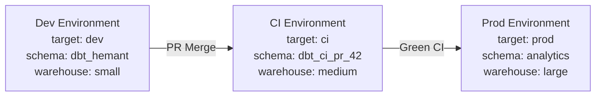

### Custom Schema Resolution

By default dbt creates schemas like `dbt_dev_staging`. Override with a macro:

```sql
-- macros/generate_schema_name.sql

    
    
        {{ default_schema }}
    
        {{ custom_schema_name | trim }}   -- use exact schema name in prod
    

```

---

## 19. Optimization Techniques

### 19.1 Incremental Processing

Always prefer incremental over full-refresh for large tables:

```sql
{{ config(materialized='incremental', unique_key='id') }}

select * from {{ source('raw', 'events') }}

    where event_timestamp > (select max(event_timestamp) from {{ this }})

```

### 19.2 Partitioning & Clustering

**BigQuery:**

```sql
{{ config(
    materialized='table',
    partition_by={
        'field': 'order_date',
        'data_type': 'date',
        'granularity': 'month'
    },
    cluster_by=['region', 'customer_segment']
) }}
```

**Snowflake:**

```sql
{{ config(
    materialized='table',
    cluster_by=['order_date', 'region']
) }}
```

### 19.3 Minimize Shuffles & Full Scans

- Push filters (`WHERE`) as early as possible in CTEs
- Use ephemeral models for intermediate logic to avoid writing unnecessary tables
- Use `source_filter` patterns to filter raw sources at ingestion boundary

```sql
-- Good: filter early in staging layer
with source as (
    select * from {{ source('raw', 'events') }}
    where event_date >= '2024-01-01'   -- push-down filter
)
```

### 19.4 Optimize Joins

- Use `ref()` correctly to allow the optimizer to see the full dependency
- Prefer smaller tables on the right side of joins
- Avoid `select *` in models; select only needed columns

### 19.5 Thread Parallelism

```yaml
# profiles.yml
dev:
  threads: 4    # models without dependencies run in parallel
prod:
  threads: 16   # increase for production
```

### 19.6 Use Ephemeral for Logic Reuse

Instead of materializing every intermediate step:

```sql
-- models/intermediate/int_customer_orders.sql
{{ config(materialized='ephemeral') }}

select
    customer_id,
    count(*) as order_count,
    sum(amount) as lifetime_value
from {{ ref('stg_orders') }}
group by 1
```

This compiles as a CTE in downstream models — no warehouse write.

### 19.7 Model Scoping with Tags & Selection

Only run what changed in CI/CD:

```bash
# In CI: only run models that changed compared to production state
dbt run --select state:modified+ --state ./prod-artifacts
dbt test --select state:modified+ --state ./prod-artifacts
```

### 19.8 Avoid Row-by-Row Processing

Never use cursors or row-level processing. Always write **set-based SQL**.

```sql
-- Bad: repeated queries per row (anti-pattern in SQL)

-- Good: set-based transformation
select
    customer_id,
    sum(case when year(order_date) = 2024 then amount else 0 end) as revenue_2024,
    sum(case when year(order_date) = 2023 then amount else 0 end) as revenue_2023
from {{ ref('stg_orders') }}
group by 1
```

### 19.9 Use Warehouse-Native Features

| Technique | Snowflake | BigQuery | Redshift |
|---|---|---|---|
| Clustering | `cluster_by` config | `cluster_by` | `sortkey` / `distkey` |
| Partitioning | Time-travel clustering | `partition_by` | `diststyle` |
| Materialized View | Supported (dbt v1.6+) | Supported | Supported |
| Result caching | Automatic | Automatic | Automatic |

### 19.10 dbt Slim CI

```bash
# Step 1: Download production manifest
# Step 2: Run only modified + downstream in CI

dbt run \
  --select state:modified+ \
  --state s3://my-bucket/prod-artifacts/ \
  --defer \
  --favor-state
```

`--defer` makes unselected models resolve to their production versions, avoiding rebuilding the entire DAG in CI.

---

## 20. Debugging in dbt

### 20.1 Compile Without Running

Inspect generated SQL without hitting the warehouse:

```bash
dbt compile
dbt compile --select fct_orders
```

Compiled SQL written to `target/compiled/my_project/models/fct_orders.sql`.

### 20.2 dbt Debug

Check project configuration and warehouse connectivity:

```bash
dbt debug
```

Output:

```
Using profiles.yml file at /Users/user/.dbt/profiles.yml
Using dbt_project.yml file at /path/to/project/dbt_project.yml

Configuration:
  profiles.yml file [OK found and valid]
  dbt_project.yml file [OK found and valid]

Required dependencies:
  - git [OK found]

Connection:
  account: xy12345.us-east-1
  user: dbt_user
  role: TRANSFORMER
  database: DEV_DB
  warehouse: COMPUTE_WH
  schema: dbt_dev
  Connection test: [OK connection ok]
```

### 20.3 Using `{{ log() }}` in Macros

```sql

    {{ log("Starting macro execution", info=True) }}
    
    {{ log("Row count: " ~ result.columns[0].values()[0], info=True) }}

```

Run with verbose output:

```bash
dbt run-operation my_macro --log-level debug
```

### 20.4 Store Test Failures

```bash
dbt test --store-failures
```

Failed rows are saved to a table in `dbt_test__audit` schema for investigation.

```sql
-- Investigate failures
select * from dbt_test__audit.not_null_stg_orders_order_id;
```

### 20.5 target/ Directory Investigation

```bash
# Read compiled SQL
cat target/compiled/my_project/models/marts/fct_orders.sql

# Read run SQL (with DDL)
cat target/run/my_project/models/marts/fct_orders.sql

# Parse run results
cat target/run_results.json | python3 -m json.tool | grep -A3 '"status"'
```

### 20.6 Common Errors & Fixes

| Error | Cause | Fix |
|---|---|---|
| `Compilation Error: Unknown macro` | Macro not found / typo | Check macro name, run `dbt deps` |
| `Database Error: relation does not exist` | `ref()` points to model not yet built | Run upstream models first / check DAG |
| `Snowflake: SQL compilation error` | Invalid SQL syntax | `dbt compile` and inspect the SQL |
| `Cycles detected` | Circular `ref()` dependency | Review DAG, eliminate cycle |
| `Schema "X" does not exist` | Target schema not created | Add `create schema if not exists` in `on-run-start` hook |
| `Incremental model schema mismatch` | New columns added | Set `on_schema_change='sync_all_columns'` |
| `dbt source freshness error` | Data not loaded on time | Check EL pipeline, adjust freshness thresholds |

### 20.7 Using dbt Retry

```bash
# Retry only failed/errored models from last run
dbt retry
```

### 20.8 Profile Debugging

```bash
# List all available profiles
dbt debug --profiles-dir /path/to/custom/dir

# Override target
dbt run --target prod

# Override variables
dbt run --vars '{"start_date": "2024-01-01", "env": "dev"}'
```

### 20.9 Verbose Logging

```bash
dbt run --log-level debug      # most verbose
dbt run --log-level info       # standard
dbt run --log-format json      # machine-parseable logs for monitoring
```

---

## 21. Best Practices

### Naming Conventions

| Layer | Prefix | Example |
|---|---|---|
| Staging | `stg_` | `stg_orders`, `stg_customers` |
| Intermediate | `int_` | `int_orders_enriched` |
| Fact tables | `fct_` | `fct_orders`, `fct_revenue` |
| Dimension tables | `dim_` | `dim_customers`, `dim_products` |
| Snapshots | `_snapshot` suffix | `orders_snapshot` |
| Seeds | descriptive | `country_codes`, `payment_methods` |

### Folder Architecture (Medallion / Layered)

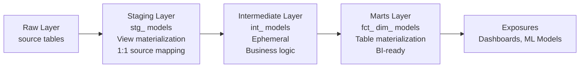

### Testing Best Practices

- Every source column that's a primary key → `unique` + `not_null`
- Every foreign key → `relationships` test
- Status/type columns → `accepted_values`
- Business rules → singular tests
- Run tests in CI on every PR

### Documentation Best Practices

```yaml
models:
  - name: fct_orders
    description: |
      One record per order. Includes all orders placed since 2020-01-01.
      Excludes test orders (flagged by the `is_test_order` field in raw).
    columns:
      - name: order_id
        description: "Surrogate key: sha256 hash of source order_id"
      - name: order_amount_usd
        description: "Total order value in USD, inclusive of taxes and discounts"
```

### CI/CD Pipeline (GitHub Actions)

```yaml
# .github/workflows/dbt_ci.yml
name: dbt CI

on:
  pull_request:
    branches: [main]

jobs:
  dbt-ci:
    runs-on: ubuntu-latest
    steps:
      - uses: actions/checkout@v3

      - name: Install dbt
        run: pip install dbt-snowflake==1.7.0

      - name: Download prod manifest
        run: aws s3 cp s3://my-bucket/prod/manifest.json ./prod-artifacts/manifest.json

      - name: dbt deps
        run: dbt deps

      - name: dbt build (slim CI)
        env:
          DBT_USER: ${{ secrets.DBT_USER }}
          DBT_PASSWORD: ${{ secrets.DBT_PASSWORD }}
        run: |
          dbt build \
            --select state:modified+ \
            --state ./prod-artifacts \
            --defer \
            --favor-state \
            --target ci
```

---

## 22. Interview Questions & Answers

### Fundamentals

**Q1. What is dbt and what problem does it solve?**

> dbt is a transformation tool that lets data teams write modular SQL transformations with software engineering practices (version control, testing, documentation). It solves the problem of unmaintainable, monolithic SQL scripts by introducing modularity via `ref()`, automated testing, and auto-generated lineage documentation.

**Q2. What is the difference between `ref()` and `source()`?**

> `ref('model_name')` is used to reference another dbt model; it builds the DAG and resolves to the correct schema per environment. `source('source_name', 'table_name')` is used to reference raw/external tables loaded by EL tools; it enables source freshness checks and keeps raw table references centralized.

**Q3. Explain the four materialization types.**

> - **view**: Creates a SQL view. Lightweight, no storage cost, re-executed every query.
> - **table**: Creates a physical table. Full refresh every `dbt run`.
> - **incremental**: Appends or merges only new/changed rows. Efficient for large tables.
> - **ephemeral**: No object created in warehouse; compiled as a CTE in downstream models.

**Q4. What is lazy evaluation / is there lazy evaluation in dbt?**

> dbt itself does not have lazy evaluation like Spark. SQL models execute eagerly when `dbt run` is called. However, ephemeral models act similarly to lazy evaluation — they're not materialized until a downstream model references them, at which point they become inlined CTEs.

**Q5. What is the DAG in dbt?**

> The Directed Acyclic Graph (DAG) is dbt's dependency graph built from `ref()` and `source()` calls. It determines the execution order of models and enables impact analysis. "Directed" means dependencies have a direction (A depends on B), "Acyclic" means there are no circular dependencies.

---

### Incremental Models

**Q6. How does an incremental model know which rows to process?**

> The `` block filters source data to only include new rows (typically `where created_at > max(created_at) from {{ this }}`). `is_incremental()` returns `True` when the model's target table already exists AND `--full-refresh` flag is not set.

**Q7. What is `unique_key` in incremental models?**

> `unique_key` tells dbt which column(s) identify a unique record. When specified with `merge` strategy, dbt does an UPSERT — updating existing records and inserting new ones. Without `unique_key`, only `append` is possible.

**Q8. What is `on_schema_change` and when would you use it?**

> `on_schema_change` controls behavior when the SQL model adds/removes columns. Options: `ignore` (default), `fail`, `append_new_columns`, `sync_all_columns`. Use `sync_all_columns` when your model evolves frequently and you want the table schema to always match the SQL.

**Q9. What is the difference between `merge` and `delete+insert` strategies?**

> `merge` uses the SQL MERGE statement (upsert). `delete+insert` first deletes rows matching `unique_key` then inserts all rows from the model. `delete+insert` is useful for Redshift which doesn't support MERGE natively, or when MERGE is slow due to distributed nature.

---

### Testing

**Q10. How do dbt tests work internally?**

> Each test compiles to a SQL query that returns rows representing failures. dbt runs the query and if it returns 0 rows, the test passes. If >0 rows are returned, it fails. Generic tests use Jinja macros in `dbt/include/global_project/macros/generic_tests/`.

**Q11. What is the difference between generic and singular tests?**

> Generic tests are parameterized, reusable, defined in `.yml` files (e.g., `unique`, `not_null`). Singular tests are specific SQL files in `tests/` directory that check a business rule. Singular tests are more flexible but not reusable.

**Q12. How would you test referential integrity between two tables?**

```yaml
- name: customer_id
  tests:
    - relationships:
        to: ref('dim_customers')
        field: customer_id
```

---

### Architecture & Optimization

**Q13. How does dbt handle parallelism?**

> dbt builds a topological sort of the DAG and runs independent models in parallel up to the `threads` limit defined in `profiles.yml`. Models that have dependencies must wait for their parents to complete.

**Q14. What is Slim CI and why is it important?**

> Slim CI uses `dbt run --select state:modified+ --state ./prod-artifacts --defer` to run only models that have changed (and their downstream dependencies). `--defer` resolves unselected upstream models to their production versions. This dramatically reduces CI run time from hours to minutes.

**Q15. How would you optimize a slow dbt model?**

> 1. Convert from `table` to `incremental` if it's a large, append-only dataset.
> 2. Add partitioning/clustering configuration.
> 3. Push filters as early as possible in CTEs.
> 4. Select only needed columns instead of `select *`.
> 5. Increase thread count for parallel execution.
> 6. Convert frequently joined small intermediate models to `ephemeral`.
> 7. Use warehouse-native query result caching.

**Q16. What is the difference between dbt Core and dbt Cloud?**

> dbt Core is open-source CLI with no orchestration or UI. dbt Cloud is a managed platform adding: browser-based IDE, built-in scheduler, CI/CD, hosted docs, Semantic Layer, Discovery API, and enterprise features (SSO, RBAC). dbt Cloud runs dbt Core under the hood.

---

### Snapshots

**Q17. What problem do dbt snapshots solve?**

> Snapshots implement Slowly Changing Dimensions (SCD Type 2) — capturing historical versions of rows as they change. Without snapshots, updates to source records would overwrite history. Snapshots maintain `dbt_valid_from` and `dbt_valid_to` columns to track when each version was active.

**Q18. What are the two snapshot strategies?**

> `timestamp` — compares the `updated_at` column; if it changed, creates a new version.
> `check` — compares specified columns for any value change; creates a new version if any differ. Use `check` when the source has no reliable `updated_at`.

---

### Macros & Jinja

**Q19. What is `is_incremental()` and how does it evaluate?**

> `is_incremental()` is a dbt macro that returns `True` when:
> 1. The model is configured as `incremental`
> 2. The target table already exists in the warehouse
> 3. `--full-refresh` flag is NOT passed
>
> It returns `False` on first run (table doesn't exist) or when `--full-refresh` is used.

**Q20. What is the `execute` variable in macros?**

> During the parse phase, dbt compiles Jinja without actually running SQL. `execute` is `False` during parse and `True` during execution. Use it to guard `run_query()` calls:
```sql

    

```

---

### Advanced

**Q21. How would you implement multi-tenancy in dbt?**

> Use `var()` to parameterize tenant ID and filter all models:
```sql

    where tenant_id = '{{ var("tenant_id") }}'

```
Or use separate schemas/databases per tenant configured in profiles.

**Q22. How do you handle sensitive PII data in dbt?**

> 1. Apply column masking at the source level using warehouse features (Snowflake Dynamic Data Masking, BigQuery column-level security).
> 2. Use dbt-based masking macros in staging models.
> 3. Apply `post-hook` grants to restrict access per role.
> 4. Never put raw PII in seeds (they're in version control).

**Q23. What is the `meta` field in dbt and how can it be used?**

> `meta` is a free-form dictionary for custom metadata attached to any dbt node:
```yaml
- name: order_amount_usd
  meta:
    owner: finance-team
    pii: false
    data_type: currency
    sla: "refreshed daily by 8 AM UTC"
```
It's exposed in `manifest.json` and can be consumed by metadata tools (Atlan, DataHub, Monte Carlo).

**Q24. Explain the difference between `dbt run`, `dbt build`, and `dbt compile`.**

| Command | What it does |
|---|---|
| `dbt compile` | Resolves Jinja, generates SQL in `target/compiled/`. No warehouse execution. |
| `dbt run` | Compiles + executes models in the warehouse. Does NOT run tests. |
| `dbt test` | Runs test queries. Does NOT build models. |
| `dbt build` | Runs models + tests + seeds + snapshots in DAG order, interleaving tests. |
| `dbt seed` | Loads CSV files to warehouse as tables. |
| `dbt snapshot` | Runs snapshot files to capture SCD2 history. |

**Q25. How does dbt resolve schema names across environments?**

> dbt uses the `generate_schema_name` macro. By default, it produces `<target_schema>_<custom_schema>` in dev (e.g., `dbt_dev_staging`). In prod, you override it to use exact schema names (`staging`, `marts`) by customizing the macro in your project.

---

*End of dbt Comprehensive Notes*
