# Complete dbt (Data Build Tool) Handbook

> **A comprehensive guide covering dbt fundamentals, advanced features, best practices, and interview preparation**
> 
> **Version**: 2.0  
> **Last Updated**: May 2, 2026  
> **Project**: Airbnb Analytics with dbt & Snowflake

---

## 📑 Table of Contents

### [Part 1: Fundamentals](#part-1-fundamentals)
1. [Introduction to dbt](#1-introduction-to-dbt)
   - [1.1 What is dbt?](#11-what-is-dbt)
   - [1.2 ELT vs ETL](#12-elt-vs-etl)
   - [1.3 dbt Adapters](#13-dbt-adapters)
   - [1.4 dbt Project Structure](#14-dbt-project-structure)

2. [Configuration & Setup](#2-configuration--setup)
   - [2.1 dbt_project.yml Configuration](#21-dbt_projectyml-configuration)
   - [2.2 profiles.yml and Connections](#22-profilesyml-and-connections)
   - [2.3 Threads and Parallelism](#23-threads-and-parallelism)
   - [2.4 File Types Overview](#24-file-types-overview)

3. [Version Control with Git](#3-version-control-with-git)
   - [3.1 Essential Git Commands](#31-essential-git-commands)
   - [3.2 Git Workflow for dbt](#32-git-workflow-for-dbt)
   - [3.3 Managing Secrets and Credentials](#33-managing-secrets-and-credentials)
   - [3.4 .gitignore Best Practices](#34-gitignore-best-practices)

### [Part 2: Data Loading & Sources](#part-2-data-loading--sources)
4. [Data Loading](#4-data-loading)
   - [4.1 Snowflake Storage Integration](#41-snowflake-storage-integration)
   - [4.2 Loading from S3 to Snowflake](#42-loading-from-s3-to-snowflake)
   - [4.3 Different File Formats](#43-different-file-formats)

5. [dbt Sources](#5-dbt-sources)
   - [5.1 Understanding Sources](#51-understanding-sources)
   - [5.2 Source Configuration](#52-source-configuration)
   - [5.3 Source Freshness](#53-source-freshness)
   - [5.4 Source Testing](#54-source-testing)

### [Part 3: Models & Materializations](#part-3-models--materializations)
6. [dbt Models](#6-dbt-models)
   - [6.1 What are Models?](#61-what-are-models)
   - [6.2 Model File Structure](#62-model-file-structure)
   - [6.3 Property Files (schema.yml)](#63-property-files-schemayml)
   - [6.4 ref() Function](#64-ref-function)

7. [Materializations](#7-materializations)
   - [7.1 View Materialization](#71-view-materialization)
   - [7.2 Table Materialization](#72-table-materialization)
   - [7.3 Incremental Materialization](#73-incremental-materialization)
   - [7.4 Ephemeral Materialization](#74-ephemeral-materialization)
   - [7.5 Choosing the Right Materialization](#75-choosing-the-right-materialization)

8. [Incremental Models](#8-incremental-models)
   - [8.1 Understanding Incremental Loading](#81-understanding-incremental-loading)
   - [8.2 Incremental Strategies](#82-incremental-strategies)
   - [8.3 Upsert Operations](#83-upsert-operations)
   - [8.4 Handling Schema Changes](#84-handling-schema-changes)
   - [8.5 Adding Audit Timestamps](#85-adding-audit-timestamps)

### [Part 4: Jinja & Macros](#part-4-jinja--macros)
9. [Jinja Templating](#9-jinja-templating)
   - [9.1 Jinja Basics](#91-jinja-basics)
   - [9.2 Common Jinja Functions](#92-common-jinja-functions)
   - [9.3 Expressions vs Statements](#93-expressions-vs-statements)
   - [9.4 Type Conversions](#94-type-conversions)

10. [Custom Macros](#10-custom-macros)
    - [10.1 Creating Macros](#101-creating-macros)
    - [10.2 Production-Level Examples](#102-production-level-examples)
    - [10.3 Macro Best Practices](#103-macro-best-practices)
    - [10.4 Environment-Based Logic](#104-environment-based-logic)

### [Part 5: Advanced Features](#part-5-advanced-features)
11. [Snapshots (SCD Type 2)](#11-snapshots-scd-type-2)
    - [11.1 Understanding Snapshots](#111-understanding-snapshots)
    - [11.2 Snapshot Strategies](#112-snapshot-strategies)
    - [11.3 Metadata-Driven Snapshots](#113-metadata-driven-snapshots)
    - [11.4 Querying Snapshots](#114-querying-snapshots)

12. [Seeds](#12-seeds)
    - [12.1 What are Seeds?](#121-what-are-seeds)
    - [12.2 Seed Configuration](#122-seed-configuration)
    - [12.3 When to Use Seeds](#123-when-to-use-seeds)

13. [dbt-utils Package](#13-dbt-utils-package)
    - [13.1 Installation](#131-installation)
    - [13.2 Common Macros](#132-common-macros)
    - [13.3 dbt-utils Tests](#133-dbt-utils-tests)

14. [Metadata-Driven Pipelines](#14-metadata-driven-pipelines)
    - [14.1 Concept Overview](#141-concept-overview)
    - [14.2 Implementation Patterns](#142-implementation-patterns)
    - [14.3 Benefits and Trade-offs](#143-benefits-and-trade-offs)

### [Part 6: Testing & Quality](#part-6-testing--quality)
15. [Testing in dbt](#15-testing-in-dbt)
    - [15.1 Test Types](#151-test-types)
    - [15.2 Generic Tests](#152-generic-tests)
    - [15.3 Singular Tests](#153-singular-tests)
    - [15.4 Tags in Tests](#154-tags-in-tests)

### [Part 7: dbt Commands](#part-7-dbt-commands)
16. [Core Commands](#16-core-commands)
    - [16.1 dbt run](#161-dbt-run)
    - [16.2 dbt compile](#162-dbt-compile)
    - [16.3 dbt test](#163-dbt-test)
    - [16.4 dbt snapshot](#164-dbt-snapshot)
    - [16.5 dbt seed](#165-dbt-seed)
    - [16.6 Model Selection](#166-model-selection)

### [Part 8: Interview Preparation](#part-8-interview-preparation)
17. [Interview Questions & Answers](#17-interview-questions--answers)
    - [17.1 Fundamental Concepts](#171-fundamental-concepts)
    - [17.2 Advanced Topics](#172-advanced-topics)
    - [17.3 Real-World Scenarios](#173-real-world-scenarios)
    - [17.4 Common Cross-Questions](#174-common-cross-questions)

---

# Part 1: Fundamentals

## 1. Introduction to dbt

### 1.1 What is dbt?

**dbt (Data Build Tool)** is an open-source transformation framework that enables data professionals to transform data in their cloud data warehouse using SQL and software engineering best practices.

#### Key Concepts

dbt is the **"T" (Transform)** in the **ELT** paradigm:

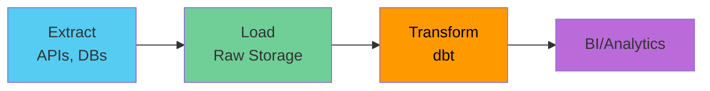

#### Core Features

| Feature | Description | Benefit |
|---------|-------------|---------|
| **SQL + Jinja** | Standard SQL enhanced with templating | Dynamic, reusable code |
| **DAG Management** | Auto-generated dependency graph | Correct execution order |
| **Testing** | Built-in data quality assertions | Catch issues early |
| **Documentation** | Auto-generated data catalog | Self-service analytics |
| **Version Control** | Git-native workflows | Collaboration & CI/CD |

#### The dbt Philosophy

1. **SELECT statements only** - dbt uses SELECT to define transformations
2. **Modularity** - Break complex logic into small, testable models
3. **DRY principle** - Don't Repeat Yourself using macros and refs
4. **Built for analysts** - SQL-first approach, no Python required (though supported)
5. **Environment separation** - Dev and prod environments

#### Simple Example

```sql
-- models/staging/stg_customers.sql
WITH source AS (
    SELECT * FROM {{ source('raw', 'customers') }}
),

cleaned AS (
    SELECT
        customer_id,
        UPPER(TRIM(name)) AS customer_name,
        LOWER(email) AS email,
        created_at
    FROM source
    WHERE customer_id IS NOT NULL
        AND email IS NOT NULL
)

SELECT * FROM cleaned
```

**What dbt does:**
1. Compiles the Jinja `{{ source() }}` to actual table name
2. Creates a view or table called `stg_customers`
3. Tracks dependencies automatically
4. Enables testing on the output

---

### 1.2 ELT vs ETL

#### ETL (Traditional Approach)

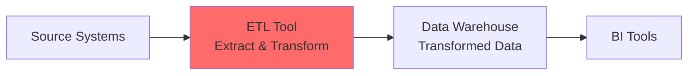

**Characteristics:**
- Transformation happens **before** loading
- Requires specialized ETL tools (Informatica, Talend)
- Transformations run on intermediate servers
- Harder to debug and maintain

#### ELT (Modern Approach with dbt)

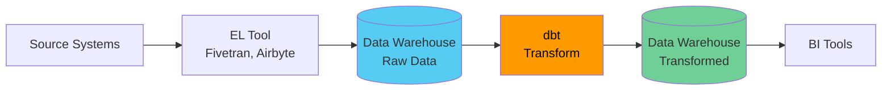

**Characteristics:**
- Load raw data **first**, transform **later**
- Leverage warehouse compute power
- SQL-based transformations
- Full data lineage and version control

#### Comparison

| Aspect | ETL | ELT |
|--------|-----|-----|
| **When transforms run** | Before loading | After loading |
| **Where transforms run** | ETL server | Data warehouse |
| **Primary language** | Tool-specific | SQL |
| **Flexibility** | Limited | High |
| **Version control** | Difficult | Easy (Git) |
| **Debugging** | Hard | Easy (query warehouse directly) |
| **Cost** | High (specialized tools) | Lower (commodity warehouse) |

---

### 1.3 dbt Adapters

**dbt adapters** are plugins that enable dbt Core to connect to specific data platforms.

#### Why Adapters?

Different databases have different:
- SQL dialects
- Connection protocols
- DDL/DML syntax
- Features and capabilities

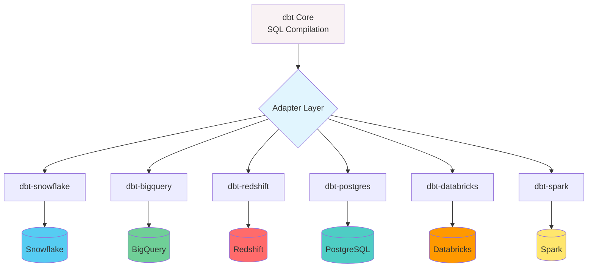

#### Installation

```bash
# Snowflake
pip install dbt-snowflake

# BigQuery
pip install dbt-bigquery

# Redshift
pip install dbt-redshift

# PostgreSQL
pip install dbt-postgres

# Multiple adapters
pip install dbt-snowflake dbt-postgres
```

#### Configuration Example (Snowflake)

```yaml
# ~/.dbt/profiles.yml
airbnb_project:
  target: dev
  outputs:
    dev:
      type: snowflake
      account: xy12345.us-east-1
      user: dbt_user
      password: "{{ env_var('DBT_PASSWORD') }}"
      role: TRANSFORMER
      database: ANALYTICS_DEV
      warehouse: TRANSFORMING
      schema: dbt_{{ env_var('USER') }}
      threads: 4
      
    prod:
      type: snowflake
      account: xy12345.us-east-1
      user: dbt_prod
      password: "{{ env_var('DBT_PROD_PASSWORD') }}"
      role: TRANSFORMER
      database: ANALYTICS_PROD
      warehouse: TRANSFORMING_LARGE
      schema: analytics
      threads: 8
```

#### Adapter-Specific Features

**Snowflake:**
- Transient tables
- Clustering
- Time Travel
- Zero-copy cloning

**BigQuery:**
- Partitioning
- Clustering
- Table expiration
- Cost-based optimization

**Redshift:**
- Distribution keys
- Sort keys
- Compression encoding

---

### 1.4 dbt Project Structure

#### Standard Directory Layout

```
my-dbt-project/
├── dbt_project.yml          # Project configuration
├── profiles.yml             # Connection profiles (keep in ~/.dbt/)
├── packages.yml             # dbt package dependencies
├── .gitignore              # Git ignore patterns
│
├── models/                  # SQL transformation files
│   ├── staging/            # Stage 1: Source cleaning
│   │   ├── sources.yml
│   │   ├── stg_customers.sql
│   │   └── stg_orders.sql
│   │
│   ├── intermediate/       # Stage 2: Business logic
│   │   └── int_customer_orders.sql
│   │
│   └── marts/              # Stage 3: Final models
│       ├── core/
│       │   ├── dim_customers.sql
│       │   └── fct_orders.sql
│       └── marketing/
│           └── customer_ltv.sql
│
├── tests/                   # Singular tests
│   └── assert_positive_revenue.sql
│
├── macros/                  # Reusable SQL functions
│   ├── generate_schema_name.sql
│   └── custom_functions.sql
│
├── seeds/                   # CSV files to load
│   └── country_codes.csv
│
├── snapshots/              # SCD Type 2 tracking
│   └── customers_snapshot.sql
│
├── analyses/               # Ad-hoc queries (not built)
│   └── weekly_metrics.sql
│
├── docs/                   # Project documentation
│   └── overview.md
│
└── target/                 # Compiled SQL (gitignored)
    ├── compiled/
    ├── run/
    └── manifest.json
```

#### Medallion Architecture (Bronze/Silver/Gold)

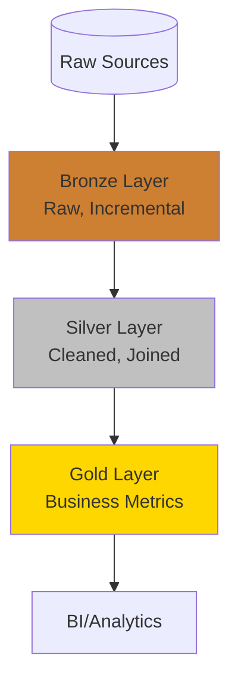

```
models/
├── bronze/              # Minimal transformations
│   ├── bronze_listings.sql
│   └── bronze_bookings.sql
│
├── silver/              # Cleaned, conformed
│   ├── silver_listings.sql
│   └── silver_bookings.sql
│
└── gold/                # Business-ready
    ├── dim_properties.sql
    └── fct_bookings.sql
```

---

## 2. Configuration & Setup

### 2.1 dbt_project.yml Configuration

The **dbt_project.yml** is the primary configuration file for your dbt project.

#### Complete Example

```yaml
name: 'airbnb_analytics'
version: '1.0.0'
config-version: 2

# Profile to use (references profiles.yml)
profile: 'airbnb_analytics'

# Directories
model-paths: ["models"]
analysis-paths: ["analyses"]
test-paths: ["tests"]
seed-paths: ["seeds"]
macro-paths: ["macros"]
snapshot-paths: ["snapshots"]
docs-paths: ["docs"]
asset-paths: ["assets"]

# Cleanup targets
clean-targets:
  - "target"
  - "dbt_packages"
  - "logs"

# Global project variables
vars:
  start_date: '2023-01-01'
  min_price: 0
  max_price: 10000

# Model configurations
models:
  airbnb_analytics:
    # Project-wide defaults
    +materialized: view
    +persist_docs:
      relation: true
      columns: true
    
    # Staging models
    staging:
      +materialized: view
      +schema: staging
      +tags: ["staging", "hourly"]
      +docs:
        node_color: "#56CCF2"
    
    # Bronze layer
    bronze:
      +materialized: incremental
      +on_schema_change: 'append_new_columns'
      +schema: bronze
      +tags: ["bronze", "incremental"]
      +unique_key: id
      
      # Specific model override
      bronze_bookings:
        +unique_key: booking_id
    
    # Silver layer
    silver:
      +materialized: table
      +schema: silver
      +tags: ["silver", "daily"]
    
    # Gold layer
    gold:
      +materialized: table
      +schema: gold
      +tags: ["gold", "business"]

# Seed configurations
seeds:
  airbnb_analytics:
    +schema: seeds
    +quote_columns: false
    
    # Specific seed configuration
    country_codes:
      +column_types:
        country_code: varchar(2)
        country_name: varchar(100)

# Snapshot configurations
snapshots:
  airbnb_analytics:
    +target_schema: snapshots
    +unique_key: id
    +strategy: timestamp
    +updated_at: updated_at

# Test configurations
tests:
  airbnb_analytics:
    +store_failures: true
    +schema: test_failures
```

#### Configuration Hierarchy

```mermaid
graph TD
    A[dbt Defaults] --> B[dbt_project.yml<br>Project Level]
    B --> C[dbt_project.yml<br>Directory Level]
    C --> D[dbt_project.yml<br>Model Level]
    D --> E[Model Config Block<br>{{ config() }}]
    E --> F[CLI Flags<br>--vars, --full-refresh]
    
    style F fill:#4CAF50,color:#fff
    style A fill:#F44336,color:#fff
    
    linkStyle 0,1,2,3,4 stroke:#666,stroke-width:2px
```

**Priority**: CLI Flags > Model Config > Directory Config > Project Config > dbt Defaults

---

### 2.2 profiles.yml and Connections

**profiles.yml** stores connection details for your data warehouse.

#### Location

```bash
# Default location (RECOMMENDED)
~/.dbt/profiles.yml

# Can also be specified with env var
export DBT_PROFILES_DIR=/path/to/profiles/directory
```

#### Complete Example (Snowflake)

```yaml
airbnb_analytics:
  target: dev
  outputs:
    dev:
      type: snowflake
      account: "{{ env_var('DBT_SNOWFLAKE_ACCOUNT') }}"
      user: "{{ env_var('DBT_USER') }}"
      password: "{{ env_var('DBT_PASSWORD') }}"
      role: TRANSFORMER
      database: ANALYTICS_DEV
      warehouse: TRANSFORMING
      schema: "dbt_{{ env_var('USER') }}"
      threads: 4
      client_session_keep_alive: False
      query_tag: dbt_dev
      
    prod:
      type: snowflake
      account: "{{ env_var('DBT_SNOWFLAKE_ACCOUNT') }}"
      user: "{{ env_var('DBT_PROD_USER') }}"
      password: "{{ env_var('DBT_PROD_PASSWORD') }}"
      role: TRANSFORMER_PROD
      database: ANALYTICS_PROD
      warehouse: TRANSFORMING_LARGE
      schema: analytics
      threads: 8
      client_session_keep_alive: True
      query_tag: dbt_prod
      
    ci:
      type: snowflake
      account: "{{ env_var('DBT_SNOWFLAKE_ACCOUNT') }}"
      user: "{{ env_var('DBT_CI_USER') }}"
      password: "{{ env_var('DBT_CI_PASSWORD') }}"
      role: TRANSFORMER_CI
      database: ANALYTICS_CI
      warehouse: TRANSFORMING
      schema: "dbt_ci_{{ env_var('GITHUB_RUN_ID', 'local') }}"
      threads: 4
      query_tag: dbt_ci
```

#### Environment Variables Setup

```bash
# .env file (add to .gitignore!)
export DBT_SNOWFLAKE_ACCOUNT="xy12345.us-east-1"
export DBT_USER="my_username"
export DBT_PASSWORD="my_secure_password"

# Load environment variables
source .env

# Run dbt
dbt run
```

#### Testing Connection

```bash
# Debug connection
dbt debug

# Expected output:
# Configuration:
#   profiles.yml file [OK found and valid]
#   dbt_project.yml file [OK found and valid]
#
# Required dependencies:
#  - git [OK found]
#
# Connection:
#   account: xy12345.us-east-1
#   user: my_username
#   database: ANALYTICS_DEV
#   schema: dbt_user
#   warehouse: TRANSFORMING
#   role: TRANSFORMER
#   Connection test: [OK connection ok]
```

---

### 2.3 Threads and Parallelism

**Threads** control how many concurrent database connections dbt can use.

#### How It Works

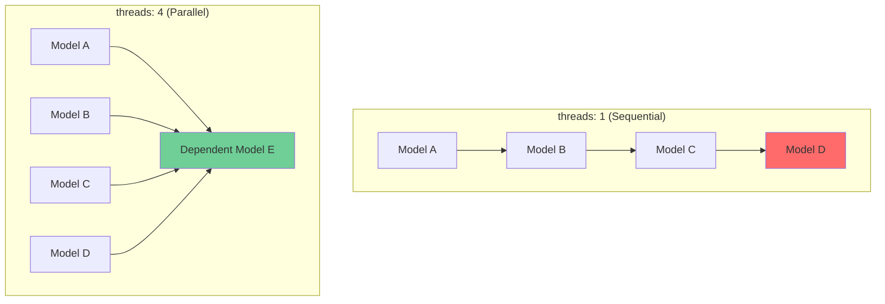

#### Configuration

```yaml
# profiles.yml
my_project:
  outputs:
    dev:
      type: snowflake
      threads: 4    # Use 4 concurrent connections
      # ... other settings
```

#### Command-Line Override

```bash
# Use 8 threads for this run
dbt run --threads 8

# Use 1 thread (sequential execution, good for debugging)
dbt run --threads 1
```

#### Best Practices

| Project Size | Recommended Threads | Reasoning |
|--------------|-------------------|-----------|
| Small (< 50 models) | 1-4 | Limited parallelism opportunity |
| Medium (50-200 models) | 4-8 | Good balance |
| Large (200-500 models) | 8-16 | High parallelism benefit |
| Very Large (500+ models) | 12-32 | Maximize warehouse utilization |

**Considerations:**
- Don't exceed your warehouse's concurrent query limit
- More threads = more warehouse compute usage = higher cost
- Wide DAGs benefit more from parallelism than deep DAGs
- Thread count should match warehouse size

---

### 2.4 File Types Overview

#### Model File (.sql)

```sql
-- models/marts/dim_customers.sql
{{ config(
    materialized='table',
    schema='core'
) }}

WITH customers AS (
    SELECT * FROM {{ ref('stg_customers') }}
),

orders AS (
    SELECT * FROM {{ ref('fct_orders') }}
),

customer_orders AS (
    SELECT
        c.customer_id,
        c.customer_name,
        COUNT(o.order_id) AS lifetime_orders,
        SUM(o.order_amount) AS lifetime_value
    FROM customers c
    LEFT JOIN orders o ON c.customer_id = o.customer_id
    GROUP BY 1, 2
)

SELECT * FROM customer_orders
```

#### Property File (schema.yml)

```yaml
version: 2

models:
  - name: dim_customers
    description: "Customer dimension table with lifetime metrics"
    columns:
      - name: customer_id
        description: "Primary key"
        tests:
          - unique
          - not_null
      
      - name: customer_name
        description: "Customer full name"
        tests:
          - not_null
      
      - name: lifetime_orders
        description: "Total number of orders"
        tests:
          - not_null
          - dbt_utils.accepted_range:
              min_value: 0
      
      - name: lifetime_value
        description: "Total revenue from customer"
        tests:
          - not_null
          - dbt_utils.accepted_range:
              min_value: 0
              max_value: 1000000
```

#### Macro File (.sql in macros/)

```sql
-- macros/cents_to_dollars.sql

    ({{ column_name }} / 100)::numeric(16, {{ scale }})

```

#### Snapshot File (.sql in snapshots/)

```sql
-- snapshots/customers_snapshot.sql


{{
    config(
      target_schema='snapshots',
      unique_key='customer_id',
      strategy='timestamp',
      updated_at='updated_at'
    )
}}

SELECT * FROM {{ source('raw', 'customers') }}


```

---

## 3. Version Control with Git

### 3.1 Essential Git Commands

#### Core Workflow

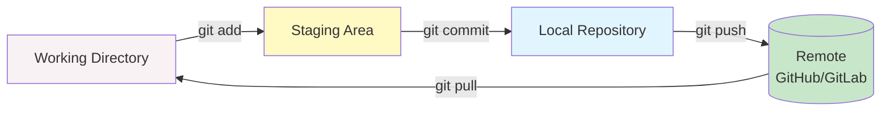

#### Essential Commands

| Command | Purpose | Example |
|---------|---------|---------|
| `git clone` | Copy repository | `git clone https://github.com/org/dbt-project.git` |
| `git status` | Check file status | `git status` |
| `git add` | Stage changes | `git add models/` |
| `git commit` | Save changes | `git commit -m "feat: add dim_customers"` |
| `git push` | Upload to remote | `git push origin feature/dim-customers` |
| `git pull` | Download from remote | `git pull origin main` |
| `git checkout` | Switch/create branch | `git checkout -b feature/new-model` |
| `git merge` | Merge branches | `git merge feature/new-model` |
| `git log` | View history | `git log --oneline --graph` |
| `git diff` | Show changes | `git diff models/dim_customers.sql` |

---

### 3.2 Git Workflow for dbt

#### Feature Branch Workflow

```bash
# 1. Clone repository
git clone https://github.com/company/dbt-analytics.git
cd dbt-analytics

# 2. Create feature branch
git checkout -b feature/add-customer-lifetime-value

# 3. Make changes
# ... develop your models ...

# 4. Test locally
dbt run --models +dim_customers
dbt test --models dim_customers

# 5. Stage and commit
git add models/marts/dim_customers.sql
git add models/marts/schema.yml
git commit -m "feat: add customer lifetime value dimension

- Add dim_customers with lifetime metrics
- Include unique and not_null tests
- Add column documentation"

# 6. Push to remote
git push origin feature/add-customer-lifetime-value

# 7. Create Pull Request on GitHub
# ... code review process ...

# 8. After merge, clean up
git checkout main
git pull origin main
git branch -d feature/add-customer-lifetime-value
```

#### Commit Message Convention

```bash
# Format: <type>(<scope>): <subject>

# Types:
feat:     # New feature/model
fix:      # Bug fix
refactor: # Code restructuring
docs:     # Documentation
test:     # Adding tests
perf:     # Performance improvement
chore:    # Maintenance tasks

# Examples:
git commit -m "feat(marts): add customer LTV model"
git commit -m "fix(staging): correct date conversion in stg_orders"
git commit -m "refactor(bronze): optimize incremental logic"
git commit -m "docs: add architecture diagram to README"
git commit -m "test: add relationship tests for fact tables"
git commit -m "perf(gold): add clustering keys to large tables"
```

---

### 3.3 Managing Secrets and Credentials

#### The Problem: Exposed Secrets

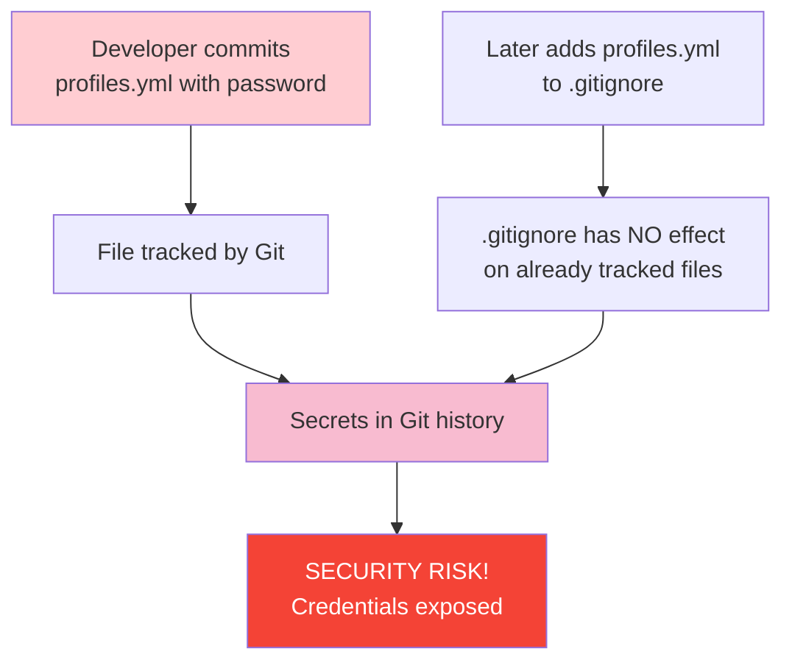

**Root Cause**: `.gitignore` only prevents **new, untracked files** from being added. If you committed `profiles.yml` before adding it to `.gitignore`, it remains in Git history forever.

#### Solution 1: Remove from Tracking (Future Protection)

```bash
# 1. Remove file from Git index (keeps local file)
git rm --cached profiles.yml

# 2. Ensure .gitignore includes it
echo "profiles.yml" >> .gitignore

# 3. Commit the removal
git add .gitignore
git commit -m "chore: remove profiles.yml from version control"

# 4. Push
git push origin main
```

#### Solution 2: Already Pushed? Rewrite History

```bash
# WARNING: This rewrites history. Coordinate with team!

# 1. IMMEDIATELY rotate all exposed credentials

# 2. Remove from entire Git history
git filter-branch --force --index-filter \
  'git rm --cached --ignore-unmatch profiles.yml' \
  --prune-empty -- --all

# 3. Force push (dangerous - requires team coordination)
git push --force origin main

# 4. All team members must re-clone or reset
git pull --rebase
```

#### Better: Use Environment Variables

```yaml
# ~/.dbt/profiles.yml (NOT in project directory!)
my_project:
  target: dev
  outputs:
    dev:
      type: snowflake
      account: "{{ env_var('DBT_SNOWFLAKE_ACCOUNT') }}"
      user: "{{ env_var('DBT_USER') }}"
      password: "{{ env_var('DBT_PASSWORD') }}"
      role: "{{ env_var('DBT_ROLE') }}"
      database: ANALYTICS
      warehouse: TRANSFORMING
      schema: "dbt_{{ env_var('USER') }}"
```

```bash
# .env (add to .gitignore!)
export DBT_SNOWFLAKE_ACCOUNT="xy12345.us-east-1"
export DBT_USER="analytics_user"
export DBT_PASSWORD="super_secret_password"
export DBT_ROLE="TRANSFORMER"

# Load before running dbt
source .env
dbt run
```

---

### 3.4 .gitignore Best Practices

#### Recommended .gitignore for dbt Projects

```gitignore
# dbt artifacts
target/
dbt_packages/
logs/
dbt_modules/

# Python
*.pyc
__pycache__/
*.py[cod]
*$py.class
venv/
.venv/
env/
ENV/
.Python

# Credentials (CRITICAL!)
profiles.yml
*.env
.env
.env.*
!.env.example

# OS files
.DS_Store
.DS_Store?
._*
.Spotlight-V100
.Trashes
ehthumbs.db
Thumbs.db

# IDE
.vscode/
.idea/
*.swp
*.swo
*~
.project
.settings/
*.sublime-project
*.sublime-workspace

# Logs
*.log
npm-debug.log*
yarn-debug.log*
yarn-error.log*

# Testing
.coverage
htmlcov/
.pytest_cache/
.tox/

# Documentation builds
site/
```

#### Safe Example Environment File

```bash
# .env.example (safe to commit)
# Copy to .env and fill in actual values

export DBT_SNOWFLAKE_ACCOUNT="your_account.region"
export DBT_USER="your_username"
export DBT_PASSWORD="your_password"
export DBT_ROLE="your_role"
export DBT_DATABASE="your_database"
export DBT_WAREHOUSE="your_warehouse"
```

---

# Part 2: Data Loading & Sources

## 4. Data Loading

### 4.1 Snowflake Storage Integration

**Storage Integration** creates a trust relationship between Snowflake and cloud storage (AWS S3, Azure Blob, GCS) without exposing credentials.

#### Architecture

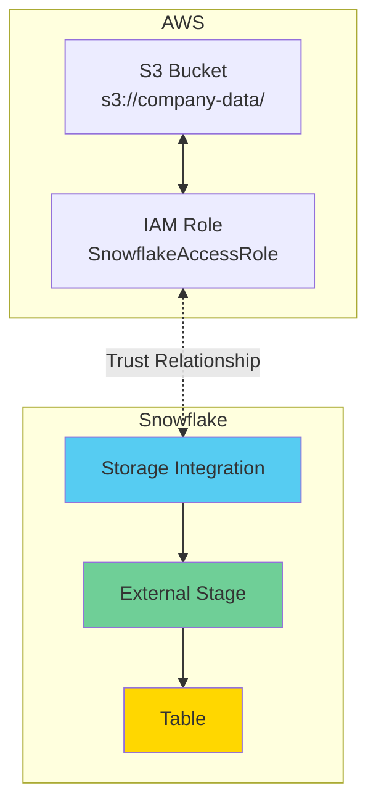

#### Benefits

| Benefit | Description |
|---------|-------------|
| **Security** | No credentials stored in Snowflake |
| **Centralized** | Single integration for multiple stages |
| **Auditable** | AWS CloudTrail tracks access |
| **Scalable** | Supports large data volumes |

---

### 4.2 Loading from S3 to Snowflake

#### Step-by-Step Implementation

**Step 1: Create Storage Integration**

```sql
-- Create integration
CREATE OR REPLACE STORAGE INTEGRATION s3_airbnb_integration
  TYPE = EXTERNAL_STAGE
  STORAGE_PROVIDER = 'S3'
  STORAGE_AWS_ROLE_ARN = 'arn:aws:iam::123456789012:role/SnowflakeAccessRole'
  ENABLED = TRUE
  STORAGE_ALLOWED_LOCATIONS = ('s3://company-data/airbnb/*');

-- Retrieve IAM user ARN and External ID for AWS trust policy
DESC STORAGE INTEGRATION s3_airbnb_integration;
```

**Step 2: Configure AWS IAM (in AWS Console)**

Trust Policy:
```json
{
  "Version": "2012-10-17",
  "Statement": [
    {
      "Effect": "Allow",
      "Principal": {
        "AWS": "arn:aws:iam::123456789012:user/xyz-abc"
      },
      "Action": "sts:AssumeRole",
      "Condition": {
        "StringEquals": {
          "sts:ExternalId": "SNOWFLAKE_EXTERNAL_ID"
        }
      }
    }
  ]
}
```

Permissions Policy:
```json
{
  "Version": "2012-10-17",
  "Statement": [
    {
      "Effect": "Allow",
      "Action": [
        "s3:GetObject",
        "s3:GetObjectVersion",
        "s3:ListBucket",
        "s3:GetBucketLocation"
      ],
      "Resource": [
        "arn:aws:s3:::company-data/airbnb/*",
        "arn:aws:s3:::company-data"
      ]
    }
  ]
}
```

**Step 3: Grant Permissions in Snowflake**

```sql
-- Grant usage on integration
GRANT USAGE ON INTEGRATION s3_airbnb_integration TO ROLE TRANSFORMER;

-- Grant create stage permission
GRANT CREATE STAGE ON SCHEMA raw.airbnb TO ROLE TRANSFORMER;
```

**Step 4: Create External Stage**

```sql
-- Create stage for CSV files
CREATE OR REPLACE STAGE raw.airbnb.s3_csv_stage
  STORAGE_INTEGRATION = s3_airbnb_integration
  URL = 's3://company-data/airbnb/csv/'
  FILE_FORMAT = (
    TYPE = CSV
    FIELD_DELIMITER = ','
    SKIP_HEADER = 1
    NULL_IF = ('NULL', 'null', '', '\\N')
    EMPTY_FIELD_AS_NULL = TRUE
    FIELD_OPTIONALLY_ENCLOSED_BY = '"'
    COMPRESSION = AUTO
    ERROR_ON_COLUMN_COUNT_MISMATCH = FALSE
  );

-- Verify stage can see files
LIST @raw.airbnb.s3_csv_stage;
```

**Step 5: Load Data**

```sql
-- Create target table
CREATE OR REPLACE TABLE raw.airbnb.listings (
    id INTEGER,
    name VARCHAR(500),
    host_id INTEGER,
    host_name VARCHAR(200),
    neighbourhood VARCHAR(100),
    latitude FLOAT,
    longitude FLOAT,
    room_type VARCHAR(50),
    price DECIMAL(10,2),
    minimum_nights INTEGER,
    number_of_reviews INTEGER,
    last_review_date DATE,
    reviews_per_month FLOAT,
    availability_365 INTEGER,
    created_at TIMESTAMP,
    updated_at TIMESTAMP
);

-- Initial load
COPY INTO raw.airbnb.listings
FROM @raw.airbnb.s3_csv_stage/listings.csv
FILE_FORMAT = (TYPE = CSV SKIP_HEADER = 1)
ON_ERROR = 'CONTINUE'
FORCE = TRUE;

-- Check load results
SELECT *
FROM TABLE(INFORMATION_SCHEMA.COPY_HISTORY(
    TABLE_NAME => 'LISTINGS',
    START_TIME => DATEADD(HOUR, -1, CURRENT_TIMESTAMP())
))
ORDER BY LAST_LOAD_TIME DESC;
```

---

### 4.3 Different File Formats

#### CSV Files

```sql
CREATE STAGE raw.airbnb.csv_stage
  STORAGE_INTEGRATION = s3_airbnb_integration
  URL = 's3://company-data/csv/'
  FILE_FORMAT = (
    TYPE = CSV
    FIELD_DELIMITER = ','
    SKIP_HEADER = 1
    NULL_IF = ('NULL', 'null')
    COMPRESSION = GZIP
  );

COPY INTO raw.airbnb.listings
FROM @raw.airbnb.csv_stage
PATTERN = '.*listings.*\\.csv\\.gz'
ON_ERROR = 'SKIP_FILE_5%';  -- Skip file if >5% rows fail
```

#### JSON Files

```sql
CREATE STAGE raw.airbnb.json_stage
  STORAGE_INTEGRATION = s3_airbnb_integration
  URL = 's3://company-data/json/'
  FILE_FORMAT = (
    TYPE = JSON
    COMPRESSION = AUTO
    STRIP_OUTER_ARRAY = TRUE
  );

-- Load JSON (auto-map columns)
COPY INTO raw.airbnb.reviews
FROM @raw.airbnb.json_stage
FILE_FORMAT = (TYPE = JSON)
MATCH_BY_COLUMN_NAME = CASE_INSENSITIVE;

-- Load JSON (manual parsing)
COPY INTO raw.airbnb.reviews_raw (raw_data)
FROM (
    SELECT $1
    FROM @raw.airbnb.json_stage
)
FILE_FORMAT = (TYPE = JSON);
```

#### Parquet Files

```sql
CREATE STAGE raw.airbnb.parquet_stage
  STORAGE_INTEGRATION = s3_airbnb_integration
  URL = 's3://company-data/parquet/'
  FILE_FORMAT = (
    TYPE = PARQUET
    COMPRESSION = SNAPPY
  );

COPY INTO raw.airbnb.bookings
FROM @raw.airbnb.parquet_stage
FILE_FORMAT = (TYPE = PARQUET)
MATCH_BY_COLUMN_NAME = CASE_SENSITIVE;
```

#### Avro Files

```sql
CREATE STAGE raw.airbnb.avro_stage
  STORAGE_INTEGRATION = s3_airbnb_integration
  URL = 's3://company-data/avro/'
  FILE_FORMAT = (TYPE = AVRO);

COPY INTO raw.airbnb.events
FROM @raw.airbnb.avro_stage
FILE_FORMAT = (TYPE = AVRO);
```

---

## 5. dbt Sources

### 5.1 Understanding Sources

**dbt sources** document and test the raw data tables that exist in your warehouse before dbt transformations.

#### Why Use Sources?

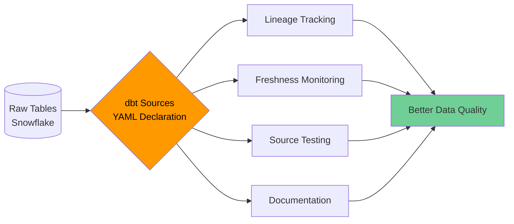

| Benefit | Description |
|---------|-------------|
| **Lineage** | Track where data comes from |
| **Abstraction** | Reference tables without hardcoding names |
| **Testing** | Validate source data quality |
| **Freshness** | Monitor data staleness |
| **Documentation** | Auto-generated catalog |
| **Environment Management** | Different sources for dev/prod |

---

### 5.2 Source Configuration

#### Basic Source Declaration

```yaml
# models/sources/airbnb_sources.yml
version: 2

sources:
  - name: airbnb_raw
    description: "Raw Airbnb data loaded from S3"
    database: raw
    schema: airbnb
    
    tables:
      - name: listings
        description: "Raw property listings"
      
      - name: reviews
        description: "Customer reviews"
      
      - name: bookings
        description: "Booking transactions"
```

#### Using in Models

```sql
-- models/staging/stg_listings.sql
SELECT
    id,
    name,
    host_id,
    price
FROM {{ source('airbnb_raw', 'listings') }}
WHERE id IS NOT NULL
```

#### Advanced Configuration with Tests

```yaml
version: 2

sources:
  - name: airbnb_raw
    description: "Raw Airbnb data loaded from S3 via Snowflake stages"
    database: raw
    schema: airbnb
    
    # Source-level freshness
    loaded_at_field: updated_at
    freshness:
      warn_after: {count: 24, period: hour}
      error_after: {count: 48, period: hour}
    
    tables:
      - name: listings
        description: "Property listings with one row per listing"
        columns:
          - name: id
            description: "Primary key for listings"
            tests:
              - unique
              - not_null
          
          - name: host_id
            description: "Foreign key to hosts"
            tests:
              - not_null
              - relationships:
                  to: source('airbnb_raw', 'hosts')
                  field: id
          
          - name: price
            description: "Nightly price in USD"
            tests:
              - not_null
              - dbt_utils.accepted_range:
                  min_value: 0
                  max_value: 50000
          
          - name: name
            description: "Listing title"
            tests:
              - not_null
              - dbt_utils.not_empty_string
      
      - name: reviews
        description: "Customer reviews"
        # Override source-level freshness
        freshness:
          warn_after: {count: 6, period: hour}
          error_after: {count: 12, period: hour}
        columns:
          - name: id
            tests:
              - unique
              - not_null
          
          - name: listing_id
            tests:
              - not_null
              - relationships:
                  to: source('airbnb_raw', 'listings')
                  field: id
      
      - name: bookings
        description: "Booking transactions"
        loaded_at_field: created_at
        freshness:
          warn_after: {count: 1, period: hour}
          error_after: {count: 3, period: hour}
```

---

### 5.3 Source Freshness

Source freshness monitors how recently your source data was updated.

#### Configuration

```yaml
sources:
  - name: raw_events
    loaded_at_field: event_timestamp
    freshness:
      warn_after: {count: 6, period: hour}
      error_after: {count: 12, period: hour}
    
    tables:
      - name: pageviews
        # Inherits source-level freshness
      
      - name: purchases
        # Override for critical table
        freshness:
          warn_after: {count: 1, period: hour}
          error_after: {count: 2, period: hour}
      
      - name: user_sessions
        # Disable freshness
        freshness: null
```

#### Running Freshness Checks

```bash
# Check all sources
dbt source freshness

# Check specific source
dbt source freshness --select source:airbnb_raw

# Output to JSON for CI/CD
dbt source freshness --output target/freshness.json

# Treat warnings as errors
dbt source freshness --warn-error
```

#### Example Output

```
12:34:56  Running with dbt=1.5.0
12:34:56  Found 15 models, 42 tests, 3 snapshots, 0 analyses, 0 macros, 0 operations, 3 seeds, 3 sources
12:34:56  
12:34:56  Concurrency: 4 threads (target='dev')
12:34:56  
12:34:56  Completed with 1 warning:
12:34:56  
12:34:56  Warnings:
12:34:56    WARN freshness of raw.airbnb.bookings (WARN 2 hours old, expected < 1 hour)
```

---

### 5.4 Source Testing

#### Test Types for Sources

```yaml
sources:
  - name: airbnb_raw
    tables:
      - name: listings
        columns:
          - name: id
            tests:
              # Generic tests
              - unique
              - not_null
              - dbt_utils.not_constant
              - dbt_utils.not_empty_string
          
          - name: host_id
            tests:
              - not_null
              - relationships:
                  to: source('airbnb_raw', 'hosts')
                  field: id
                  severity: warn  # Don't fail, just warn
          
          - name: price
            tests:
              - not_null
              - dbt_utils.accepted_range:
                  min_value: 0
                  max_value: 100000
                  inclusive: true
          
          - name: room_type
            tests:
              - accepted_values:
                  values: ['Entire home/apt', 'Private room', 'Shared room', 'Hotel room']
                  quote: true
          
          - name: created_at
            tests:
              - not_null
              - dbt_utils.expression_is_true:
                  expression: ">= '2008-01-01'"
                  config:
                    where: "created_at IS NOT NULL"
```

#### Running Source Tests

```bash
# Test all sources
dbt test --select source:*

# Test specific source
dbt test --select source:airbnb_raw

# Test specific source table
dbt test --select source:airbnb_raw.listings
```

---

# Part 3: Models & Materializations

## 6. dbt Models

### 6.1 What are Models?

A **dbt model** is a SELECT statement that defines a transformation in your data warehouse.

#### Key Characteristics

- **One model = One SELECT statement**
- **Defined in .sql files** in the models/ directory
- **Creates a table or view** in your warehouse
- **Uses ref() and source()** for dependencies
- **Can be tested** for data quality

#### Simple Example

```sql
-- models/staging/stg_customers.sql
WITH source AS (
    SELECT * FROM {{ source('raw', 'customers') }}
),

cleaned AS (
    SELECT
        customer_id,
        UPPER(TRIM(first_name)) AS first_name,
        UPPER(TRIM(last_name)) AS last_name,
        LOWER(email) AS email,
        created_at,
        updated_at
    FROM source
    WHERE customer_id IS NOT NULL
        AND email IS NOT NULL
)

SELECT * FROM cleaned
```

**What dbt does:**
1. Compiles `{{ source('raw', 'customers') }}` to actual table
2. Creates a view (default) called `stg_customers`
3. Adds to dependency graph
4. Makes available for testing

---

### 6.2 Model File Structure

#### Layered Architecture

```
models/
├── staging/               # Layer 1: Light transformations
│   ├── sources.yml       # Source declarations
│   ├── stg_customers.sql
│   ├── stg_orders.sql
│   └── stg_payments.sql
│
├── intermediate/         # Layer 2: Business logic
│   ├── int_orders_pivoted.sql
│   └── int_customer_order_history.sql
│
└── marts/                # Layer 3: Business-facing
    ├── core/
    │   ├── dim_customers.sql
    │   ├── dim_products.sql
    │   └── fct_orders.sql
    │
    └── marketing/
        ├── customer_ltv.sql
        └── cohort_analysis.sql
```

#### Medallion Architecture (Bronze/Silver/Gold)

```
models/
├── bronze/               # Raw, minimal processing
│   ├── bronze_listings.sql
│   ├── bronze_reviews.sql
│   └── bronze_bookings.sql
│
├── silver/               # Cleaned, conformed
│   ├── silver_listings.sql
│   ├── silver_reviews.sql
│   └── silver_bookings.sql
│
└── gold/                 # Aggregated, business metrics
    ├── dim_properties.sql
    ├── dim_hosts.sql
    └── fct_bookings.sql
```

---

### 6.3 Property Files (schema.yml)

Property files define metadata, tests, and documentation for models.

#### Complete Example

```yaml
# models/marts/schema.yml
version: 2

models:
  - name: dim_customers
    description: "Customer dimension with lifetime value metrics"
    meta:
      owner: "analytics@company.com"
      priority: "high"
    
    config:
      materialized: table
      tags: ["daily", "core"]
    
    columns:
      - name: customer_id
        description: "Primary key for customers"
        tests:
          - unique
          - not_null
      
      - name: customer_name
        description: "Full customer name"
        tests:
          - not_null
          - dbt_utils.not_empty_string
      
      - name: email
        description: "Customer email address"
        tests:
          - not_null
          - unique
          - dbt_utils.not_empty_string
      
      - name: first_order_date
        description: "Date of customer's first order"
        tests:
          - not_null
      
      - name: most_recent_order_date
        description: "Date of customer's most recent order"
        tests:
          - not_null
          - dbt_utils.expression_is_true:
              expression: ">= first_order_date"
      
      - name: lifetime_orders
        description: "Total number of orders"
        tests:
          - not_null
          - dbt_utils.accepted_range:
              min_value: 0
              severity: warn
      
      - name: lifetime_value
        description: "Total revenue from customer (USD)"
        tests:
          - not_null
          - dbt_utils.accepted_range:
              min_value: 0
              max_value: 1000000
  
  - name: fct_orders
    description: "Order fact table with one row per order"
    config:
      materialized: incremental
      unique_key: order_id
      on_schema_change: 'append_new_columns'
    
    columns:
      - name: order_id
        description: "Primary key"
        tests:
          - unique
          - not_null
      
      - name: customer_id
        description: "Foreign key to dim_customers"
        tests:
          - not_null
          - relationships:
              to: ref('dim_customers')
              field: customer_id
      
      - name: order_date
        description: "Date order was placed"
        tests:
          - not_null
      
      - name: order_total
        description: "Total order amount"
        tests:
          - not_null
          - dbt_utils.accepted_range:
              min_value: 0
```

---

### 6.4 ref() Function

The **ref()** function references another dbt model, creating dependencies.

#### Why Use ref()?

1. **Automatic dependency resolution** - dbt builds DAG
2. **Environment-aware** - Adapts to dev/prod schemas
3. **Refactoring-safe** - Rename models without breaking references
4. **Documentation** - Auto-generates lineage

#### Syntax

```sql
-- Reference a model
SELECT * FROM {{ ref('stg_customers') }}

-- Reference with multiple arguments (for packages)
SELECT * FROM {{ ref('package_name', 'model_name') }}
```

#### Complete Example

```sql
-- models/marts/fct_orders.sql
WITH orders AS (
    SELECT * FROM {{ ref('stg_orders') }}
),

customers AS (
    SELECT * FROM {{ ref('stg_customers') }}
),

payments AS (
    SELECT * FROM {{ ref('stg_payments') }}
),

order_payments AS (
    SELECT
        order_id,
        SUM(amount) AS total_amount
    FROM payments
    WHERE status = 'success'
    GROUP BY 1
),

final AS (
    SELECT
        o.order_id,
        o.customer_id,
        c.customer_name,
        o.order_date,
        COALESCE(op.total_amount, 0) AS order_total
    FROM orders o
    LEFT JOIN customers c ON o.customer_id = c.customer_id
    LEFT JOIN order_payments op ON o.order_id = op.order_id
)

SELECT * FROM final
```

#### Dependency Graph

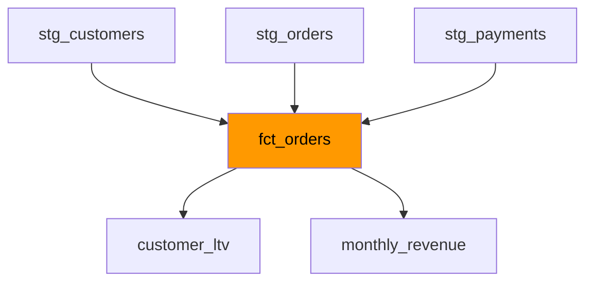

---

## 7. Materializations

### 7.1 View Materialization

Creates a **database view** that runs the query each time it's queried.

#### Configuration

```sql
-- Method 1: In dbt_project.yml
models:
  my_project:
    staging:
      +materialized: view

-- Method 2: In model file
{{ config(materialized='view') }}

SELECT * FROM {{ source('raw', 'customers') }}
```

#### Characteristics

| Aspect | Description |
|--------|-------------|
| **Storage** | No data stored, only SQL definition |
| **Performance** | Slower queries (computed each time) |
| **Freshness** | Always current |
| **Use Case** | Small tables, rarely queried, or when freshness critical |
| **Cost** | Low storage, higher compute |

#### Example

```sql
-- models/staging/stg_orders.sql
{{ config(
    materialized='view',
    tags=['staging']
) }}

SELECT
    order_id,
    customer_id,
    order_date,
    status,
    CAST(created_at AS TIMESTAMP) AS created_at,
    CAST(updated_at AS TIMESTAMP) AS updated_at
FROM {{ source('raw', 'orders') }}
WHERE order_id IS NOT NULL
```

**Generated SQL:**
```sql
CREATE OR REPLACE VIEW analytics.staging.stg_orders AS
SELECT
    order_id,
    customer_id,
    order_date,
    status,
    CAST(created_at AS TIMESTAMP) AS created_at,
    CAST(updated_at AS TIMESTAMP) AS updated_at
FROM raw.ecommerce.orders
WHERE order_id IS NOT NULL;
```

---

### 7.2 Table Materialization

Creates a physical **table** with data stored on disk.

#### Configuration

```sql
{{ config(materialized='table') }}

SELECT
    customer_id,
    COUNT(*) AS lifetime_orders,
    SUM(order_total) AS lifetime_value
FROM {{ ref('fct_orders') }}
GROUP BY 1
```

#### Characteristics

| Aspect | Description |
|--------|-------------|
| **Storage** | Data fully stored |
| **Performance** | Fast queries |
| **Freshness** | Only current as of last dbt run |
| **Use Case** | Large tables, frequently queried |
| **Cost** | Higher storage, lower compute |

#### Example

```sql
-- models/marts/dim_customers.sql
{{ config(
    materialized='table',
    cluster_by=['customer_id'],  -- Snowflake-specific
    tags=['daily', 'core']
) }}

WITH customers AS (
    SELECT * FROM {{ ref('stg_customers') }}
),

orders AS (
    SELECT * FROM {{ ref('fct_orders') }}
),

customer_orders AS (
    SELECT
        customer_id,
        MIN(order_date) AS first_order_date,
        MAX(order_date) AS most_recent_order_date,
        COUNT(DISTINCT order_id) AS lifetime_orders,
        SUM(order_total) AS lifetime_value
    FROM orders
    GROUP BY 1
),

final AS (
    SELECT
        c.customer_id,
        c.customer_name,
        c.email,
        co.first_order_date,
        co.most_recent_order_date,
        COALESCE(co.lifetime_orders, 0) AS lifetime_orders,
        COALESCE(co.lifetime_value, 0) AS lifetime_value
    FROM customers c
    LEFT JOIN customer_orders co USING (customer_id)
)

SELECT * FROM final
```

**Generated SQL:**
```sql
CREATE OR REPLACE TABLE analytics.core.dim_customers
CLUSTER BY (customer_id) AS
-- ... SELECT statement ...
```

---

### 7.3 Incremental Materialization

Builds a table **incrementally**, only processing new or changed rows.

#### Configuration

```sql
{{ config(
    materialized='incremental',
    unique_key='order_id',
    on_schema_change='append_new_columns'
) }}

SELECT
    order_id,
    customer_id,
    order_date,
    order_total,
    updated_at
FROM {{ source('raw', 'orders') }}


    -- Only process new/updated rows
    WHERE updated_at > (SELECT MAX(updated_at) FROM {{ this }})

```

#### Characteristics

| Aspect | Description |
|--------|-------------|
| **Storage** | Only new data added |
| **Performance** | Fast incremental runs |
| **Complexity** | Requires incremental logic |
| **Use Case** | Large, append-only or slowly changing tables |
| **Cost** | Optimal for large datasets |

#### Full Example

```sql
-- models/bronze/bronze_bookings.sql
{{ config(
    materialized='incremental',
    unique_key='booking_id',
    incremental_strategy='merge',
    on_schema_change='append_new_columns',
    tags=['bronze', 'hourly']
) }}

SELECT
    booking_id,
    listing_id,
    guest_id,
    check_in_date,
    check_out_date,
    booking_amount,
    status,
    created_at,
    updated_at,
    CURRENT_TIMESTAMP() AS dbt_loaded_at
FROM {{ source('staging', 'bookings') }}
WHERE booking_id IS NOT NULL


    -- Only new or updated bookings
    AND updated_at > (SELECT COALESCE(MAX(updated_at), '1900-01-01'::TIMESTAMP) FROM {{ this }})

```

---

### 7.4 Ephemeral Materialization

Does **not create** a database object; inlined as CTE in dependent models.

#### Configuration

```sql
{{ config(materialized='ephemeral') }}

SELECT
    order_id,
    customer_id,
    CASE
        WHEN order_total >= 1000 THEN 'high_value'
        WHEN order_total >= 100 THEN 'medium_value'
        ELSE 'low_value'
    END AS customer_segment
FROM {{ ref('stg_orders') }}
```

#### Characteristics

| Aspect | Description |
|--------|-------------|
| **Storage** | None (no object created) |
| **Performance** | Depends on complexity |
| **Visibility** | Not queryable directly |
| **Use Case** | Intermediate logic, shared CTEs |
| **Cost** | Lowest storage |

#### Example

```sql
-- models/intermediate/int_order_segments.sql (ephemeral)
{{ config(materialized='ephemeral') }}

SELECT
    order_id,
    customer_id,
    order_total,
    CASE
        WHEN order_total >= 1000 THEN 'high'
        WHEN order_total >= 100 THEN 'medium'
        ELSE 'low'
    END AS value_segment
FROM {{ ref('stg_orders') }}
```

```sql
-- models/marts/customer_segments.sql (uses ephemeral)
{{ config(materialized='table') }}

SELECT
    customer_id,
    COUNT(CASE WHEN value_segment = 'high' THEN 1 END) AS high_value_orders,
    COUNT(CASE WHEN value_segment = 'medium' THEN 1 END) AS medium_value_orders,
    COUNT(CASE WHEN value_segment = 'low' THEN 1 END) AS low_value_orders
FROM {{ ref('int_order_segments') }}
GROUP BY 1
```

**Compiled SQL** (int_order_segments is inlined):
```sql
CREATE TABLE analytics.marts.customer_segments AS
WITH int_order_segments AS (
    SELECT
        order_id,
        customer_id,
        order_total,
        CASE
            WHEN order_total >= 1000 THEN 'high'
            WHEN order_total >= 100 THEN 'medium'
            ELSE 'low'
        END AS value_segment
    FROM analytics.staging.stg_orders
)
SELECT
    customer_id,
    COUNT(CASE WHEN value_segment = 'high' THEN 1 END) AS high_value_orders,
    COUNT(CASE WHEN value_segment = 'medium' THEN 1 END) AS medium_value_orders,
    COUNT(CASE WHEN value_segment = 'low' THEN 1 END) AS low_value_orders
FROM int_order_segments
GROUP BY 1;
```

---

### 7.5 Choosing the Right Materialization

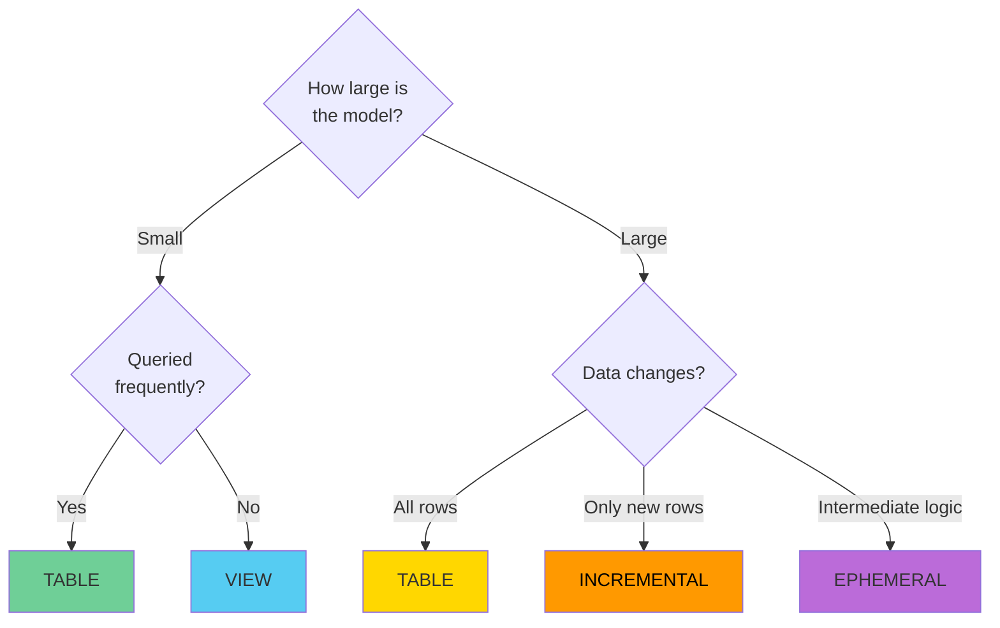

#### Decision Matrix

| Scenario | Materialization | Reason |
|----------|----------------|--------|
| Small staging table | VIEW | Low query cost, always fresh |
| Large fact table, all history needed | TABLE | Fast queries, manageable size |
| Large fact table, append-only | INCREMENTAL | Efficient processing |
| Intermediate transformation logic | EPHEMERAL | No storage needed |
| Frequently queried metrics | TABLE | Performance |
| Real-time dashboard | VIEW | Freshness |
| Daily batch ETL | TABLE/INCREMENTAL | Depends on size |

---

## 8. Incremental Models

### 8.1 Understanding Incremental Loading

Incremental models only process **new or changed rows** instead of rebuilding the entire table.

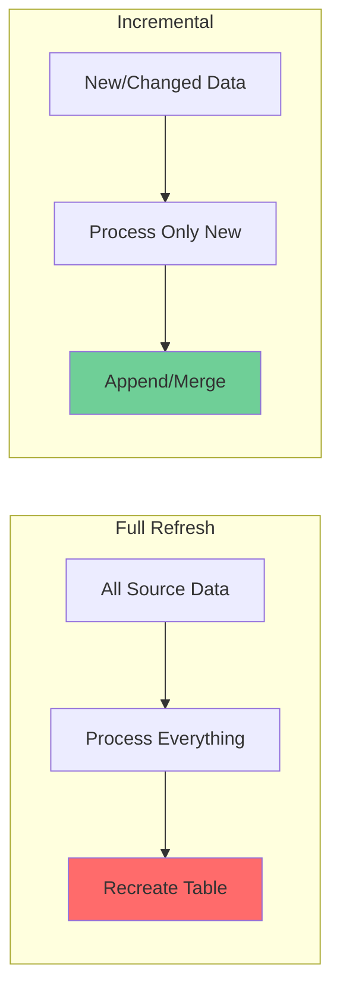

#### Benefits

- ⚡ **Faster runs** - Process only new data
- 💰 **Lower costs** - Less compute usage
- 🔄 **More frequent updates** - Can run hourly vs daily
- 📈 **Scalability** - Works with billions of rows

---

### 8.2 Incremental Strategies

#### 1. Append Strategy

Simply inserts new rows without checking for duplicates.

```sql
{{ config(
    materialized='incremental',
    incremental_strategy='append'
) }}

SELECT
    event_id,
    user_id,
    event_type,
    event_timestamp
FROM {{ source('raw', 'events') }}


    WHERE event_timestamp > (
        SELECT MAX(event_timestamp)
        FROM {{ this }}
    )

```

**Use when:**
- Data is append-only (events, logs)
- No updates to historical records
- Unique key not needed

---

#### 2. Merge Strategy (Upsert)

Updates existing rows and inserts new ones based on `unique_key`.

```sql
{{ config(
    materialized='incremental',
    unique_key='booking_id',
    incremental_strategy='merge'
) }}

SELECT
    booking_id,
    listing_id,
    guest_id,
    status,
    booking_amount,
    updated_at
FROM {{ source('raw', 'bookings') }}


    WHERE updated_at > (
        SELECT COALESCE(MAX(updated_at), '1900-01-01'::TIMESTAMP)
        FROM {{ this }}
    )

```

**Generated SQL (Snowflake):**
```sql
MERGE INTO analytics.bronze.bronze_bookings target
USING (
    -- incremental query
) source
ON target.booking_id = source.booking_id
WHEN MATCHED THEN
    UPDATE SET *
WHEN NOT MATCHED THEN
    INSERT *
```

**Use when:**
- Records can be updated
- Need to maintain latest state
- Have a reliable unique key

---

#### 3. Delete+Insert Strategy

Deletes matching rows, then inserts new ones.

```sql
{{ config(
    materialized='incremental',
    unique_key='date',
    incremental_strategy='delete+insert'
) }}

SELECT
    DATE_TRUNC('day', order_date) AS date,
    COUNT(*) AS num_orders,
    SUM(order_total) AS total_revenue
FROM {{ ref('fct_orders') }}
WHERE order_date >= CURRENT_DATE - 7


    AND date >= (SELECT MAX(date) - 7 FROM {{ this }})


GROUP BY 1
```

**Use when:**
- Merge not supported on adapter
- Need to reprocess entire partitions
- Working with aggregated data

---

### 8.3 Upsert Operations

**Upsert** = UPDATE + INSERT in one operation.

#### Full Example

```sql
-- models/silver/silver_bookings.sql
{{ config(
    materialized='incremental',
    unique_key='booking_id',
    incremental_strategy='merge',
    on_schema_change='append_new_columns',
    cluster_by=['booking_date'],
    tags=['silver', 'hourly']
) }}

WITH source AS (
    SELECT * FROM {{ ref('bronze_bookings') }}
),

transformed AS (
    SELECT
        booking_id,
        listing_id,
        guest_id,
        CAST(check_in_date AS DATE) AS check_in_date,
        CAST(check_out_date AS DATE) AS check_out_date,
        DATEDIFF('day', check_in_date, check_out_date) AS nights,
        booking_amount,
        UPPER(TRIM(status)) AS status,
        created_at,
        updated_at,
        CURRENT_TIMESTAMP() AS dbt_updated_at
    FROM source
    WHERE booking_id IS NOT NULL
)

SELECT * FROM transformed


    WHERE updated_at > (
        SELECT COALESCE(MAX(updated_at), '1900-01-01'::TIMESTAMP)
        FROM {{ this }}
    )
    OR booking_id IN (
        -- Handle late-arriving updates
        SELECT DISTINCT booking_id
        FROM {{ ref('bronze_bookings_updates') }}
        WHERE update_flag = TRUE
    )

```

---

### 8.4 Handling Schema Changes

When you add new columns to an incremental model, dbt can handle it automatically.

#### Configuration

```yaml
# dbt_project.yml
models:
  my_project:
    bronze:
      +materialized: incremental
      +on_schema_change: 'append_new_columns'  # or 'fail', 'ignore', 'sync_all_columns'
```

```sql
{{ config(
    materialized='incremental',
    on_schema_change='append_new_columns'
) }}
```

#### Options

| Option | Behavior |
|--------|----------|
| **fail** | Fail run if schema changes detected (default) |
| **ignore** | Keep existing schema, ignore new columns |
| **append_new_columns** | Add new columns to existing table |
| **sync_all_columns** | Add new, remove deleted columns |

#### Example: Adding a Column

```sql
-- Initial model
{{ config(
    materialized='incremental',
    unique_key='id',
    on_schema_change='append_new_columns'
) }}

SELECT
    id,
    name,
    price,
    updated_at
FROM {{ source('raw', 'listings') }}


    WHERE updated_at > (SELECT MAX(updated_at) FROM {{ this }})

```

```sql
-- After adding new column
{{ config(
    materialized='incremental',
    unique_key='id',
    on_schema_change='append_new_columns'
) }}

SELECT
    id,
    name,
    price,
    host_name,  -- NEW COLUMN
    updated_at
FROM {{ source('raw', 'listings') }}


    WHERE updated_at > (SELECT MAX(updated_at) FROM {{ this }})

```

**What happens:**
1. dbt detects new column `host_name`
2. Runs `ALTER TABLE ... ADD COLUMN host_name VARCHAR`
3. Continues with incremental load
4. New column populated for new rows, NULL for existing rows

---

### 8.5 Adding Audit Timestamps

Track when records were processed by dbt.

#### Patterns

**1. Simple dbt timestamp:**

```sql
SELECT
    *,
    CURRENT_TIMESTAMP() AS dbt_loaded_at
FROM {{ source('raw', 'bookings') }}
```

**2. Separate insert vs update timestamps:**

```sql
{{ config(
    materialized='incremental',
    unique_key='id'
) }}

SELECT
    id,
    name,
    price,
    
        dbt_inserted_at,  -- Preserve original
        CURRENT_TIMESTAMP() AS dbt_updated_at
    
        CURRENT_TIMESTAMP() AS dbt_inserted_at,
        CURRENT_TIMESTAMP() AS dbt_updated_at
    
FROM {{ source('raw', 'listings') }}
```

**3. Using invocation_id for debugging:**

```sql
SELECT
    *,
    '{{ invocation_id }}' AS dbt_invocation_id,
    '{{ run_started_at }}' AS dbt_run_started_at,
    CURRENT_TIMESTAMP() AS dbt_loaded_at
FROM {{ source('raw', 'bookings') }}
```

**4. Full audit columns:**

```sql
SELECT
    booking_id,
    -- ... business columns ...
    
    -- Audit columns
    '{{ invocation_id }}' AS dbt_invocation_id,
    '{{ run_started_at }}' AS dbt_run_started_at,
    CURRENT_TIMESTAMP() AS dbt_loaded_at,
    '{{ target.name }}' AS dbt_target,
    '{{ target.schema }}' AS dbt_schema,
    '{{ this }}' AS dbt_model_name
FROM {{ source('raw', 'bookings') }}
```

---

# Part 4: Jinja & Macros

## 9. Jinja Templating

### 9.1 Jinja Basics

**Jinja** is a templating language that makes SQL dynamic and reusable.

#### Core Syntax

| Syntax | Purpose | Example |
|--------|---------|---------|
| `{{ }}` | **Expressions** - Output values | `{{ ref('stg_orders') }}` |
| `` | **Statements** - Control flow | `` |
| `{# #}` | **Comments** - Not in output | `{# This is a comment #}` |

#### Simple Example

```sql
{# This query processes orders #}

SELECT
    order_id,
    customer_id,
    
        actual_amount  {# Production uses actual #}
    
        estimated_amount  {# Dev uses estimates #}
     AS order_amount,
    order_date
FROM {{ ref('stg_orders') }}
WHERE order_date >= '{{ var("start_date") }}'
```

---

### 9.2 Common Jinja Functions

#### 1. ref() - Reference Models

```sql
SELECT * FROM {{ ref('stg_customers') }}

-- With explicit model name
SELECT * FROM {{ ref('my_project', 'stg_customers') }}
```

#### 2. source() - Reference Source Tables

```sql
SELECT * FROM {{ source('raw', 'customers') }}
```

#### 3. config() - Set Model Configuration

```sql
{{ config(
    materialized='table',
    schema='marts',
    tags=['daily', 'core']
) }}

SELECT * FROM {{ ref('stg_orders') }}
```

#### 4. var() - Use Variables

```sql
-- In model
SELECT * FROM {{ ref('orders') }}
WHERE order_date >= '{{ var("start_date") }}'
  AND status IN {{ var("valid_statuses") }}

-- Run with:
dbt run --vars '{start_date: "2024-01-01", valid_statuses: ["completed", "shipped"]}'
```

#### 5. this - Reference Current Model

```sql
{{ config(materialized='incremental') }}

SELECT * FROM {{ source('raw', 'events') }}


    WHERE event_time > (SELECT MAX(event_time) FROM {{ this }})

```

#### 6. target - Access Connection Info

```sql
SELECT
    *,
    '{{ target.name }}' AS environment,  -- 'dev' or 'prod'
    '{{ target.schema }}' AS schema_name,
    '{{ target.database }}' AS database_name
FROM {{ ref('customers') }}
```

#### 7. is_incremental() - Check Incremental Mode

```sql
{{ config(materialized='incremental') }}

SELECT * FROM {{ source('raw', 'orders') }}


    -- This only runs on incremental builds
    WHERE updated_at > (SELECT MAX(updated_at) FROM {{ this }})

```

#### 8. invocation_id & run_started_at - Audit Info

```sql
SELECT
    *,
    '{{ invocation_id }}' AS dbt_run_id,
    '{{ run_started_at }}' AS dbt_run_time
FROM {{ source('raw', 'bookings') }}
```

---

### 9.3 Expressions vs Statements

#### Expressions {{ }}

Output values - anything between `{{ }}` gets evaluated and inserted into SQL.

```sql
-- Variables
SELECT {{ var('column_name') }}

-- Functions
FROM {{ ref('model_name') }}

-- Calculations
LIMIT {{ var('limit', 100) }}

-- String concatenation
WHERE name = '{{ var('prefix') }}_customer'
```

#### Statements 

Control flow - logic that controls what SQL gets generated.

```sql
-- If/else

    FROM prod_table

    FROM dev_table


-- For loops
SELECT
    
        {{ col }},
    
FROM customers

-- Set variables

SELECT {{ columns | join(', ') }}
```

#### Control Structures

**If/Elif/Else:**
```sql

    SELECT * FROM prod.customers

    SELECT * FROM dev.customers LIMIT 1000

    SELECT * FROM test.customers LIMIT 100

```

**For Loops:**
```sql


SELECT
    order_id,
    
        SUM(CASE WHEN payment_method = '{{ method }}' THEN amount ELSE 0 END) AS {{ method }}_amount
        ,
    
FROM payments
GROUP BY 1
```

---

### 9.4 Type Conversions

#### int Filter

```sql
-- Convert to integer

{{ num + 50 }}  -- Results in 150

-- With default for non-numeric
  -- Results in 0
```

#### float Filter

```sql

{{ price * 1.1 }}  -- Results in 109.989
```

#### string Filter

```sql

WHERE name = '{{ count }}'
```

#### Example: Safe Type Conversion Macro

```sql

    COALESCE(
        TRY_CAST({{ column }} AS INTEGER),
        {{ default }}
    )


-- Usage:
SELECT
    {{ safe_cast_to_int('price', 0) }} AS price_int
FROM listings
```

---

## 10. Custom Macros

### 10.1 Creating Macros

Macros are reusable Jinja functions stored in `macros/` directory.

#### Simple Macro

```sql
-- macros/cents_to_dollars.sql

    ({{ column_name }} / 100.0)::DECIMAL(16, {{ decimal_places }})


-- Usage in model:
SELECT
    order_id,
    {{ cents_to_dollars('amount_cents') }} AS amount_dollars,
    {{ cents_to_dollars('tax_cents', 4) }} AS tax_dollars
FROM orders
```

#### Macro with Logic

```sql
-- macros/categorize_value.sql

    CASE
        WHEN {{ column }} < {{ low_threshold }} THEN 'low'
        WHEN {{ column }} < {{ high_threshold }} THEN 'medium'
        ELSE 'high'
    END


-- Usage:
SELECT
    customer_id,
    {{ categorize_value('lifetime_value', 100, 1000) }} AS customer_segment
FROM customers
```

---

### 10.2 Production-Level Examples

#### 1. Dynamic Schema Generation

```sql
-- macros/generate_schema_name.sql

    
    
    
        {{ default_schema }}
    
    
        {{ custom_schema_name | trim }}
    
    
        {{ default_schema }}_{{ custom_schema_name | trim }}
    
    

```

**Result:**
- **Dev**: `dbt_user_staging`, `dbt_user_marts`
- **Prod**: `staging`, `marts`

---

#### 2. Surrogate Key Generation

```sql
-- macros/generate_surrogate_key.sql

    
        
    
    
    
    
        
    
    
    
        MD5({{ fields | join(" || '|' || ") }})
    
        TO_HEX(MD5(CONCAT({{ fields | join(", '|', ") }})))
    
        MD5(CONCAT({{ fields | join(", '|', ") }}))
    


-- Usage:
SELECT
    {{ generate_surrogate_key(['order_id', 'line_item']) }} AS order_line_key,
    order_id,
    line_item,
    product_name
FROM order_details
```

---

#### 3. Union Multiple Sources

```sql
-- macros/union_tables.sql

    
    
        
    
    
    {{ dbt_utils.union_relations(
        relations=table_models,
        column_override=column_override,
        include=['id', 'name', 'created_at']
    ) }}


-- Usage:
{{ union_tables(
    ['customers_us', 'customers_eu', 'customers_asia'],
    column_override={'name': 'customer_name'}
) }}
```

---

#### 4. Date Spine Generation

```sql
-- macros/generate_date_spine.sql

    
        
    
        
    
    
    WITH date_spine AS (
        {{ dbt_utils.date_spine(
            datepart="day",
            start_date="'" ~ start_date ~ "'",
            end_date=end_date
        ) }}
    )
    SELECT
        date_day,
        EXTRACT(YEAR FROM date_day) AS year,
        EXTRACT(MONTH FROM date_day) AS month,
        EXTRACT(DAY FROM date_day) AS day,
        DAYNAME(date_day) AS day_name,
        CASE WHEN DAYOFWEEK(date_day) IN (0, 6) THEN TRUE ELSE FALSE END AS is_weekend
    FROM date_spine

```

---

#### 5. Adapter-Specific SQL

```sql
-- macros/safe_divide.sql

    
        DIV0({{ numerator }}, {{ denominator }})
    
        SAFE_DIVIDE({{ numerator }}, {{ denominator }})
    
        CASE
            WHEN {{ denominator }} = 0 THEN NULL
            ELSE ({{ numerator }}::FLOAT / {{ denominator }}::FLOAT)
        END
    
        ({{ numerator }} / NULLIF({{ denominator }}, 0))
    


-- Usage:
SELECT
    customer_id,
    {{ safe_divide('total_revenue', 'total_orders') }} AS avg_order_value
FROM customer_metrics
```

---

### 10.3 Macro Best Practices

#### 1. Documentation

```sql

    {#
    Converts a column from cents to dollars.
    
    Args:
        column_name (str): Name of the column containing cents
        decimal_places (int): Number of decimal places (default: 2)
    
    Returns:
        SQL expression casting cents to dollars
    
    Example:
        {{ cents_to_dollars('amount_cents') }}
        {{ cents_to_dollars('tax_cents', 4) }}
    #}
    
    ({{ column_name }} / 100.0)::DECIMAL(16, {{ decimal_places }})

```

#### 2. Error Handling

```sql

    
    
    
    
        {{ exceptions.raise_compiler_error(
            "Column '" ~ column_name ~ "' not found in " ~ model ~ 
            ". Available columns: " ~ column_names | join(', ')
        ) }}
    

```

#### 3. DRY Principles

```sql
-- Instead of repeating logic:
SELECT
    CASE WHEN total > 1000 THEN 'high' WHEN total > 100 THEN 'medium' ELSE 'low' END AS segment1,
    CASE WHEN total > 1000 THEN 'high' WHEN total > 100 THEN 'medium' ELSE 'low' END AS segment2
FROM orders

-- Use a macro:

    CASE
        WHEN {{ column }} > 1000 THEN 'high'
        WHEN {{ column }} > 100 THEN 'medium'
        ELSE 'low'
    END


SELECT
    {{ value_segment('total') }} AS segment1,
    {{ value_segment('subtotal') }} AS segment2
FROM orders
```

---

### 10.4 Environment-Based Logic

```sql
-- macros/get_table_suffix.sql

    
        ''
    
        '_dev'
    
        '_' ~ target.name
    


-- Usage:
SELECT * FROM raw.customers{{ get_table_suffix() }}
```

```sql
-- Environment-specific sampling

    
        LIMIT {{ limit }}
    


SELECT * FROM {{ ref('large_fact_table') }}
{{ apply_dev_sample(5000) }}
```

---

# Part 5: Advanced Features

## 11. Snapshots (SCD Type 2)

### 11.1 Understanding Snapshots

**Snapshots** capture historical changes to dimension tables, implementing **Slowly Changing Dimension Type 2** (SCD Type 2).

#### What are Slowly Changing Dimensions?

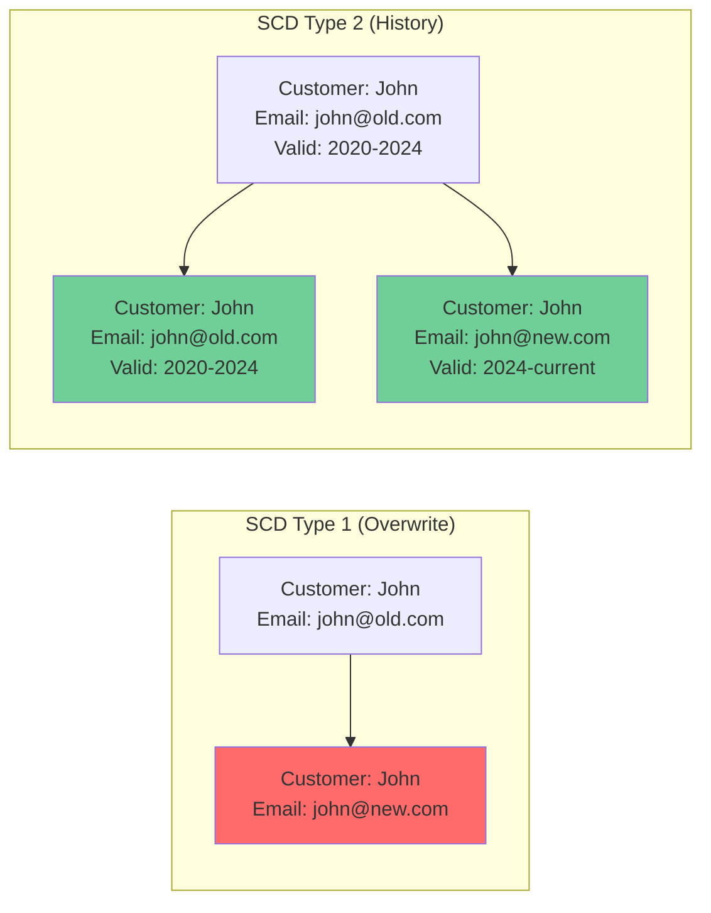

| Type | Behavior | Use Case |
|------|----------|----------|
| **Type 1** | Overwrite old values | Don't need history |
| **Type 2** | Keep full history | Need audit trail |
| **Type 3** | Keep limited history | Only last N changes |

---

### 11.2 Snapshot Strategies

#### Timestamp Strategy

Uses a timestamp column to detect changes.

```sql
-- snapshots/customers_snapshot.sql


{{
    config(
      target_schema='snapshots',
      unique_key='customer_id',
      strategy='timestamp',
      updated_at='updated_at'
    )
}}

SELECT * FROM {{ source('raw', 'customers') }}


```

**How it works:**
1. dbt compares `updated_at` timestamp with previous snapshot
2. If timestamp changed, creates new version of row
3. Expires old version by setting `dbt_valid_to`

#### Check Strategy

Compares column values (via hashing) to detect changes.

```sql


{{
    config(
      target_schema='snapshots',
      unique_key='order_id',
      strategy='check',
      check_cols=['status', 'total_amount', 'shipping_address']
    )
}}

SELECT * FROM {{ source('raw', 'orders') }}


```

**Or check all columns:**

```sql
{{
    config(
      strategy='check',
      check_cols='all'
    )
}}
```

---

#### Output Columns

Snapshot tables include these meta columns:

| Column | Description |
|--------|-------------|
| `dbt_scd_id` | Unique ID for each version |
| `dbt_updated_at` | When snapshot was taken |
| `dbt_valid_from` | When this version became valid |
| `dbt_valid_to` | When this version was superseded (NULL = current) |

#### Example Output

```sql
-- Original source data
customer_id | name  | email           | updated_at
1          | John  | john@old.com    | 2024-01-01
1          | John  | john@new.com    | 2024-03-15  -- Email changed

-- After snapshot
customer_id | name  | email        | updated_at  | dbt_valid_from | dbt_valid_to
1          | John  | john@old.com | 2024-01-01  | 2024-01-01    | 2024-03-15
1          | John  | john@new.com | 2024-03-15  | 2024-03-15    | NULL
```

---

### 11.3 Metadata-Driven Snapshots

Create snapshots dynamically from metadata.

#### Metadata Configuration

```yaml
# snapshots_config.yml
snapshots:
  - name: customers_snapshot
    source_name: raw
    source_table: customers
    unique_key: customer_id
    strategy: timestamp
    updated_at_column: updated_at
    
  - name: hosts_snapshot
    source_name: raw
    source_table: hosts
    unique_key: host_id
    strategy: check
    check_cols: ['name', 'email', 'phone', 'address']
    
  - name: listings_snapshot
    source_name: raw
    source_table: listings
    unique_key: listing_id
    strategy: timestamp
    updated_at_column: updated_at
```

#### Generic Macro

```sql
-- macros/generate_snapshot.sql

    
    
    
        
    
        
    
    
    {{ config(**strategy_config) }}
    
    SELECT * FROM {{ source(config.source_name, config.source_table) }}

```

#### Snapshot Files

```sql
-- snapshots/customers_snapshot.sql



    {{ generate_snapshot_from_config(cfg) }}

```

---

### 11.4 Querying Snapshots

#### Get Current State

```sql
SELECT
    customer_id,
    name,
    email
FROM {{ ref('customers_snapshot') }}
WHERE dbt_valid_to IS NULL  -- Current records only
```

#### Get Historical State (Point-in-Time)

```sql
-- What did customer #123 look like on 2024-01-15?
SELECT
    customer_id,
    name,
    email,
    address
FROM {{ ref('customers_snapshot') }}
WHERE customer_id = 123
  AND dbt_valid_from <= '2024-01-15'
  AND (dbt_valid_to IS NULL OR dbt_valid_to > '2024-01-15')
```

#### Analyze Change History

```sql
-- How many times has each customer been updated?
SELECT
    customer_id,
    name,
    COUNT(*) - 1 AS num_changes,
    MIN(dbt_valid_from) AS first_seen,
    MAX(COALESCE(dbt_valid_to, CURRENT_TIMESTAMP)) AS last_changed
FROM {{ ref('customers_snapshot') }}
GROUP BY 1, 2
HAVING COUNT(*) > 1
ORDER BY num_changes DESC
```

#### Find Changes Between Dates

```sql
-- What changed for customer #123 between Jan and Feb 2024?
WITH jan_state AS (
    SELECT *
    FROM {{ ref('customers_snapshot') }}
    WHERE customer_id = 123
      AND dbt_valid_from <= '2024-01-31'
      AND (dbt_valid_to IS NULL OR dbt_valid_to > '2024-01-31')
),

feb_state AS (
    SELECT *
    FROM {{ ref('customers_snapshot') }}
    WHERE customer_id = 123
      AND dbt_valid_from <= '2024-02-29'
      AND (dbt_valid_to IS NULL OR dbt_valid_to > '2024-02-29')
)

SELECT
    jan_state.name AS name_jan,
    feb_state.name AS name_feb,
    jan_state.email AS email_jan,
    feb_state.email AS email_feb
FROM jan_state
FULL OUTER JOIN feb_state ON jan_state.customer_id = feb_state.customer_id
```

---

## 12. Seeds

### 12.1 What are Seeds?

**Seeds** are CSV files in your `seeds/` directory that dbt loads into your warehouse as tables.

#### Use Cases

✅ **Good for:**
- Country/state/region mappings
- Product categories
- Status code lookups
- Test data
- Small reference tables (< 1000 rows)

❌ **Bad for:**
- Large datasets (use sources instead)
- Frequently changing data
- Production data loads (use EL tools)

---

### 12.2 Seed Configuration

#### Basic Seed

```csv
# seeds/country_codes.csv
country_code,country_name,region
US,United States,North America
GB,United Kingdom,Europe
IN,India,Asia
BR,Brazil,South America
```

```bash
# Load seed
dbt seed

# Load specific seed
dbt seed --select country_codes
```

#### Using in Models

```sql
SELECT
    o.order_id,
    o.country_code,
    c.country_name,
    c.region
FROM {{ ref('orders') }} o
LEFT JOIN {{ ref('country_codes') }} c
    ON o.country_code = c.country_code
```

---

### 12.3 Advanced Configuration

```yaml
# dbt_project.yml
seeds:
  my_project:
    +schema: seeds
    +quote_columns: false
    
    country_codes:
      +column_types:
        country_code: varchar(2)
        country_name: varchar(100)
        region: varchar(50)
    
    product_categories:
      +enabled: true
      +quote_columns: true
      +column_types:
        category_id: integer
        category_name: varchar(200)
```

#### Property File for Seeds

```yaml
# seeds/schema.yml
version: 2

seeds:
  - name: country_codes
    description: "ISO country code mappings"
    columns:
      - name: country_code
        description: "ISO 3166-1 alpha-2 code"
        tests:
          - unique
          - not_null
      
      - name: country_name
        description: "Official country name"
        tests:
          - not_null
```

---

## 13. dbt-utils Package

### 13.1 Installation

```yaml
# packages.yml
packages:
  - package: dbt-labs/dbt_utils
    version: 1.1.1
```

```bash
# Install packages
dbt deps
```

---

### 13.2 Common Macros

#### surrogate_key()

```sql
SELECT
    {{ dbt_utils.surrogate_key(['order_id', 'line_item']) }} AS order_line_key,
    order_id,
    line_item
FROM order_details
```

#### star()

```sql
SELECT
    {{ dbt_utils.star(ref('stg_customers'), except=['internal_notes', 'test_flag']) }},
    CURRENT_TIMESTAMP AS loaded_at
FROM {{ ref('stg_customers') }}
```

#### union_relations()

```sql
{{ dbt_utils.union_relations(
    relations=[
        source('raw', 'orders_2023'),
        source('raw', 'orders_2024')
    ],
    exclude=['internal_id']
) }}
```

#### generate_series()

```sql
-- Generate numbers 1-100
SELECT {{ dbt_utils.generate_series(1, 100) }} AS num
```

#### group_by()

```sql
SELECT
    customer_id,
    order_date,
    status,
    COUNT(*) AS order_count
FROM orders
{{ dbt_utils.group_by(3) }}  -- Group by first 3 columns
```

#### pivot()

```sql
{{ dbt_utils.pivot(
    column='payment_method',
    values=dbt_utils.get_column_values(ref('payments'), 'payment_method'),
    agg='sum',
    then_value='amount'
) }}
```

---

### 13.3 dbt-utils Tests

```yaml
models:
  - name: dim_customers
    columns:
      - name: customer_id
        tests:
          - dbt_utils.not_null_proportion:
              at_least: 0.95
          
          - dbt_utils.cardinality_equality:
              field: customer_id
              to: ref('stg_customers')
      
      - name: email
        tests:
          - dbt_utils.not_empty_string
          - dbt_utils.not_constant
      
      - name: lifetime_value
        tests:
          - dbt_utils.accepted_range:
              min_value: 0
              max_value: 1000000
              inclusive: true
      
      - name: created_date
        tests:
          - dbt_utils.expression_is_true:
              expression: ">= '2020-01-01'"
```

---

## 14. Metadata-Driven Pipelines

### 14.1 Concept Overview

**Metadata-driven pipelines** use configuration files (YAML, JSON) to define transformation logic instead of hardcoding each model.

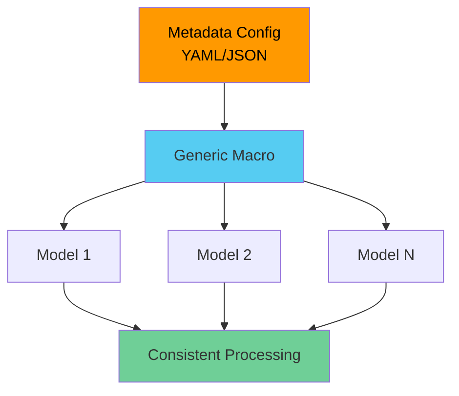

#### Benefits

| Benefit | Description |
|---------|-------------|
| **Scalability** | Add 100 models by adding 100 YAML lines |
| **Consistency** | All models follow same pattern |
| **Maintainability** | Update logic in one place |
| **Lower barrier** | Non-technical users can add models |
| **DRY** | Don't repeat yourself |

---

### 14.2 Implementation Patterns

#### Pattern 1: YAML Configuration

```yaml
# models_config.yml
bronze_models:
  - name: bronze_listings
    source: staging
    source_table: listings
    incremental_column: updated_at
    unique_key: listing_id
    exclude_columns: [internal_id, test_flag]
    
  - name: bronze_reviews
    source: staging
    source_table: reviews
    incremental_column: created_at
    unique_key: review_id
    exclude_columns: []
    
  - name: bronze_bookings
    source: staging
    source_table: bookings
    incremental_column: updated_at
    unique_key: booking_id
    exclude_columns: [internal_notes]
```

#### Pattern 2: Generic Macro

```sql
-- macros/generate_bronze_model.sql

    {{ config(
        materialized='incremental',
        unique_key=config.unique_key,
        on_schema_change='append_new_columns'
    ) }}
    
    SELECT
        {{ dbt_utils.star(
            from=source(config.source, config.source_table),
            except=config.exclude_columns
        ) }},
        CURRENT_TIMESTAMP() AS dbt_loaded_at
    FROM {{ source(config.source, config.source_table) }}
    
    
        WHERE {{ config.incremental_column }} >= (
            SELECT COALESCE(MAX({{ config.incremental_column }}), '1900-01-01'::TIMESTAMP)
            FROM {{ this }}
        )
    

```

#### Pattern 3: Model Files

```sql
-- models/bronze/bronze_listings.sql


{{ generate_bronze_model(cfg) }}
```

---

### 14.3 Benefits and Trade-offs

#### Benefits ✅

- **Rapid scaling**: Add 100 tables in 10 minutes
- **Consistency**: Every model follows same pattern
- **Easy maintenance**: Fix bug once, affects all models
- **Self-service**: Analysts can add models via YAML
- **Documentation as code**: Metadata serves as documentation

#### Trade-offs ⚠️

- **Complexity**: Harder to debug abstracted logic
- **Flexibility**: Difficult for edge cases/custom logic
- **Learning curve**: Team needs to understand the pattern
- **Over-engineering**: Can be overkill for small projects

#### When to Use

✅ **Use metadata-driven when:**
- Many similar tables (50+ models)
- Standard transformation patterns
- Team needs self-service capability
- Consistency is critical

❌ **Don't use when:**
- Few models (< 20)
- Lots of custom logic needed
- Team prefers explicit code
- Debugging complexity outweighs benefits

---

# Part 6: Testing & Quality

## 15. Testing in dbt

### 15.1 Test Types

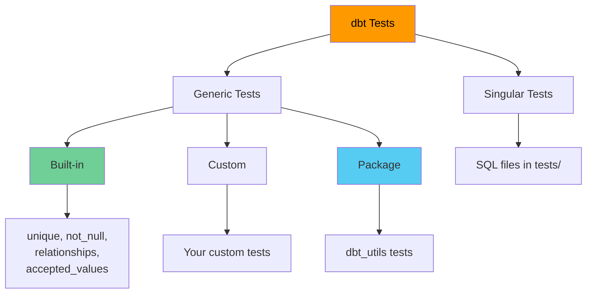

---

### 15.2 Generic Tests

Reusable tests defined in YAML.

```yaml
models:
  - name: dim_customers
    columns:
      - name: customer_id
        tests:
          - unique
          - not_null
      
      - name: email
        tests:
          - unique:
              config:
                severity: warn
          - not_null
      
      - name: customer_segment
        tests:
          - accepted_values:
              values: ['high', 'medium', 'low']
              quote: false
      
      - name: parent_customer_id
        tests:
          - relationships:
              to: ref('dim_customers')
              field: customer_id
              config:
                where: "parent_customer_id IS NOT NULL"
```

---

### 15.3 Singular Tests

Custom SQL tests in `tests/` directory.

```sql
-- tests/assert_positive_revenue.sql
SELECT
    order_id,
    order_total
FROM {{ ref('fct_orders') }}
WHERE order_total <= 0
```

If query returns rows, test fails.

```sql
-- tests/assert_all_bookings_have_listings.sql
WITH bookings_without_listings AS (
    SELECT
        b.booking_id,
        b.listing_id
    FROM {{ ref('fct_bookings') }} b
    LEFT JOIN {{ ref('dim_listings') }} l ON b.listing_id = l.listing_id
    WHERE l.listing_id IS NULL
)

SELECT * FROM bookings_without_listings
```

---

### 15.4 Tags in Tests

Organize and run tests selectively.

```yaml
models:
  - name: dim_customers
    columns:
      - name: customer_id
        tests:
          - unique:
              tags: ['critical', 'primary_key']
          - not_null:
              tags: ['critical', 'primary_key']
      
      - name: email
        tests:
          - unique:
              tags: ['email', 'medium_priority']
      
      - name: lifetime_value
        tests:
          - dbt_utils.accepted_range:
              min_value: 0
              max_value: 10000000
              tags: ['business_logic', 'low_priority']
```

```bash
# Run all critical tests
dbt test --select tag:critical

# Run all tests on specific model
dbt test --select dim_customers

# Run tests but skip low priority
dbt test --exclude tag:low_priority
```

---

# Part 7: dbt Commands

## 16. Core Commands

### 16.1 dbt run

Executes models and materializes them in the warehouse.

```bash
# Run all models
dbt run

# Run specific model
dbt run --models dim_customers

# Run model and upstream dependencies
dbt run --models +dim_customers

# Run model and downstream dependents
dbt run --models dim_customers+

# Run full lineage
dbt run --models +dim_customers+

# Run with selector
dbt run --select tag:daily

# Full refresh (rebuild incremental from scratch)
dbt run --full-refresh

# Run with threads
dbt run --threads 8

# Run specific target
dbt run --target prod
```

---

### 16.2 dbt compile

Compiles Jinja to SQL without executing.

```bash
# Compile all models
dbt compile

# Compile specific model
dbt compile --models dim_customers

# Output location
# target/compiled/my_project/models/marts/dim_customers.sql
```

---

### 16.3 dbt test

Runs data quality tests.

```bash
# Run all tests
dbt test

# Test specific model
dbt test --models dim_customers

# Test with tag
dbt test --select tag:critical

# Store failures
dbt test --store-failures

# Treat warnings as errors
dbt test --warn-error
```

---

### 16.4 dbt snapshot

Captures historical changes.

```bash
# Run all snapshots
dbt snapshot

# Run specific snapshot
dbt snapshot --select customers_snapshot

# Full refresh snapshot
dbt snapshot --full-refresh
```

---

### 16.5 dbt seed

Loads CSV files from `seeds/` directory.

```bash
# Load all seeds
dbt seed

# Load specific seed
dbt seed --select country_codes

# Full refresh seeds
dbt seed --full-refresh
```

---

### 16.6 Model Selection

#### Selection Syntax

```bash
# Specific model
--select model_name

# All models in directory
--select staging

# All models in directory and subdirectories
--select staging.*

# Model and dependencies
--select +model_name

# Model and dependents
--select model_name+

# Full lineage
--select +model_name+

# Multiple selections
--select model1 model2

# Exclude
--select +fct_orders --exclude staging

# By tag
--select tag:daily

# By source
--select source:raw_data

# Intersection
--select tag:daily,staging.*
```

---

# Part 8: Interview Preparation

## 17. Interview Questions & Answers

### 17.1 Fundamental Concepts

**Q: What is dbt and where does it fit in the data stack?**

A: dbt (Data Build Tool) is an open-source transformation framework that enables data teams to transform data in their warehouse using SQL and software engineering best practices. It's the "T" in ELT:
- **Extract**: Tools like Fivetran, Airbyte extract data from sources
- **Load**: Data loaded raw into warehouse (Snowflake, BigQuery, etc.)
- **Transform**: dbt transforms this raw data into analytics-ready tables

Key features:
- SQL-based transformations with Jinja templating
- Automatic dependency management (DAG)
- Built-in testing framework
- Auto-generated documentation
- Version control integration (Git)

---

**Q: What's the difference between ELT and ETL?**

A: 
- **ETL (Extract, Transform, Load)**: Transform happens before loading, on separate ETL servers, using specialized tools
- **ELT (Extract, Load, Transform)**: Load raw data first, transform in the warehouse using SQL

ELT advantages:
- Leverage warehouse compute power
- SQL-based (accessible to analysts)
- Easier debugging (query warehouse directly)
- Version control friendly
- Lower cost (commodity warehouse vs specialized ETL tools)

---

**Q: What are dbt materializations?**

A: Materializations determine how dbt models are built and stored:

1. **View**: Creates database view, no data stored, always current
2. **Table**: Creates physical table, data stored, faster queries
3. **Incremental**: Only processes new/changed rows, efficient for large tables
4. **Ephemeral**: Not materialized, inlined as CTE in dependent models

Choice depends on:
- Data size
- Query frequency
- Freshness requirements
- Storage costs

---

**Q: Explain the ref() and source() functions.**

A:
- **ref()**: References another dbt model
  - Creates dependency in DAG
  - Environment-aware (adapts to dev/prod schemas)
  - Example: `{{ ref('stg_customers') }}`

- **source()**: References raw data tables
  - Declared in YAML
  - Enables testing and freshness checks
  - Example: `{{ source('raw', 'customers') }}`

Key difference: ref() is for dbt-managed models, source() is for external raw tables.

---

### 17.2 Advanced Topics

**Q: How do incremental models work in dbt?**

A: Incremental models only process new or changed rows instead of rebuilding the entire table.

Configuration:
```sql
{{ config(
    materialized='incremental',
    unique_key='id',
    incremental_strategy='merge'
) }}

SELECT * FROM {{ source('raw', 'orders') }}


    WHERE updated_at > (SELECT MAX(updated_at) FROM {{ this }})

```

- **First run**: Builds full table
- **Subsequent runs**: Only processes rows matching WHERE clause
- **Strategies**: append, merge, delete+insert

Benefits:
- Faster execution
- Lower costs
- More frequent updates possible

---

**Q: What are snapshots and when would you use them?**

A: Snapshots implement SCD Type 2 (Slowly Changing Dimensions) to track historical changes.

Example:
```sql

{{
    config(
      target_schema='snapshots',
      unique_key='customer_id',
      strategy='timestamp',
      updated_at='updated_at'
    )
}}

SELECT * FROM {{ source('raw', 'customers') }}

```

Output includes:
- `dbt_valid_from`: When version became valid
- `dbt_valid_to`: When version expired (NULL = current)

Use cases:
- Compliance/audit requirements
- Temporal analysis ("what was customer's address in Jan 2024?")
- Tracking dimension changes over time

---

**Q: How do you handle schema changes in incremental models?**

A: Use `on_schema_change` configuration:

```sql
{{ config(
    materialized='incremental',
    on_schema_change='append_new_columns'
) }}
```

Options:
- **fail**: Fail run if schema changes (default)
- **ignore**: Keep existing schema, ignore new columns
- **append_new_columns**: Add new columns automatically
- **sync_all_columns**: Add new, remove deleted columns

Best practice: Use `append_new_columns` for production incremental models.

---

### 17.3 Real-World Scenarios

**Q: How would you optimize a slow dbt project with 500+ models?**

A:

1. **Increase parallelism**: `dbt run --threads 16`
2. **Use incremental models**: Convert large tables to incremental
3. **Optimize materializations**: Change rarely-queried tables from table to view
4. **Add clustering/partitioning**: Database-specific optimizations
5. **Simplify complex models**: Break into smaller, focused models
6. **Use ephemeral wisely**: For simple CTEs, not complex logic
7. **Selective runs**: Use tags and selectors to run only what's needed
8. **Monitor warehouse performance**: Check query execution plans

---

**Q: You committed secrets to Git. What do you do?**

A:

1. **Immediately rotate all exposed credentials** (most important!)
2. **Remove from Git index**:
   ```bash
   git rm --cached profiles.yml
   echo "profiles.yml" >> .gitignore
   git commit -m "Remove credentials"
   ```
3. **If already pushed, rewrite history** (coordinate with team):
   ```bash
   git filter-branch --force --index-filter \
     'git rm --cached --ignore-unmatch profiles.yml' \
     --prune-empty -- --all
   git push --force
   ```
4. **Use environment variables going forward**
5. **Audit logs** to check if credentials were accessed
6. **Post-mortem** to prevent future occurrences

---

### 17.4 Common Cross-Questions

**Security & Best Practices:**
- Why use storage integration vs direct credentials in Snowflake?
- How do you manage different environments (dev/prod)?
- What goes in .gitignore for dbt projects?
- How do you handle PII in dbt models?

**Performance:**
- How do you determine optimal thread count?
- When should you use table vs view vs incremental?
- How do you debug slow-running models?
- What's the impact of clustering/partitioning?

**Testing:**
- What's the difference between generic and singular tests?
- When would you use tags in tests?
- How do you test incremental models?
- What's source freshness and why is it important?

**Architecture:**
- What's the difference between bronze/silver/gold and staging/intermediate/marts?
- How do you structure a large dbt project?
- When should you use macros vs models?
- What's the difference between dbt Core and dbt Cloud?

---

## Conclusion

This comprehensive guide covers dbt from fundamentals to advanced features. Key takeaways:

✅ **dbt is the transformation layer** in modern data stacks  
✅ **SQL + Jinja** enables dynamic, reusable transformations  
✅ **Materializations** control how data is built and stored  
✅ **Incremental models** handle large-scale data efficiently  
✅ **Testing & documentation** are built-in, not afterthoughts  
✅ **Version control** enables collaboration and CI/CD  
✅ **Best practices** prevent common pitfalls

---

**Resources:**
- Official docs: https://docs.getdbt.com
- dbt Discourse: https://discourse.getdbt.com
- dbt Slack: https://www.getdbt.com/community
- dbt Learn: https://courses.getdbt.com

---

*Last updated: May 2, 2026*
