# Apache Iceberg — Comprehensive Notes

---

## Table of Contents

1. [What is Apache Iceberg?](#1-what-is-apache-iceberg)
2. [Why Was Iceberg Created? (Problems it Solves)](#2-why-was-iceberg-created)
3. [Iceberg Architecture & Internals](#3-iceberg-architecture--internals)
4. [Deep Dive — Technical Architecture & Components](#4-deep-dive--technical-architecture--components)
   - [4.1 The Three-Layer Stack](#41-the-three-layer-stack)
   - [4.2 Catalog Layer](#42-catalog-layer)
   - [4.3 Metadata Layer — Table Metadata File](#43-metadata-layer--table-metadata-file)
   - [4.4 Metadata Layer — Snapshots](#44-metadata-layer--snapshots)
   - [4.5 Metadata Layer — Manifest List](#45-metadata-layer--manifest-list)
   - [4.6 Metadata Layer — Manifest Files](#46-metadata-layer--manifest-files)
   - [4.7 Data Layer — Data Files & Delete Files](#47-data-layer--data-files--delete-files)
   - [4.8 Commit Protocol & Optimistic Concurrency](#48-commit-protocol--optimistic-concurrency)
   - [4.9 File Pruning — How Iceberg Skips Files](#49-file-pruning--how-iceberg-skips-files)
   - [4.10 Write Path (End-to-End)](#410-write-path-end-to-end)
   - [4.11 Read Path (End-to-End)](#411-read-path-end-to-end)
5. [Key Features of Iceberg](#5-key-features-of-iceberg)
6. [Apache Iceberg vs Delta Lake](#6-apache-iceberg-vs-delta-lake)
7. [Iceberg Table Format Spec](#7-iceberg-table-format-spec)
8. [Iceberg Catalogs](#8-iceberg-catalogs)
9. [Iceberg with PySpark — Code Examples](#9-iceberg-with-pyspark--code-examples)
10. [Time Travel & Snapshots](#10-time-travel--snapshots)
11. [Schema Evolution](#11-schema-evolution)
12. [Partition Evolution](#12-partition-evolution)
13. [Hidden Partitioning](#13-hidden-partitioning)
14. [Row-Level Operations (MERGE / UPDATE / DELETE)](#14-row-level-operations)
15. [Compaction & Maintenance](#15-compaction--maintenance)
16. [Interview Cross-Questions](#16-interview-cross-questions)

---

## 1. What is Apache Iceberg?

Apache Iceberg is an **open table format** for huge analytic datasets. It was originally created by Netflix and donated to the Apache Software Foundation in 2018.

> A **table format** defines how data files are organized, tracked, and accessed on storage (S3, ADLS, GCS, HDFS, etc.). It sits *above* file formats (Parquet, ORC, Avro) and *below* compute engines (Spark, Flink, Trino, Hive).

### One-liner definition:
> Apache Iceberg = **Open table format** that brings ACID transactions, schema evolution, partition evolution, time travel, and multi-engine interoperability to data lakes.

---

## 2. Why Was Iceberg Created?

### Problems with the traditional Hive table format:
| Problem | Description |
|---|---|
| **No ACID guarantees** | Multiple writers could corrupt data |
| **Directory-listing based** | Slow `LIST` calls on S3 for partition discovery |
| **No hidden partitioning** | Users had to write `WHERE year=2024 AND month=1` explicitly |
| **Schema evolution is fragile** | Renaming/reordering columns breaks queries |
| **No time travel** | Cannot query historical state of data |
| **Large metadata overhead** | All metadata stored in one metastore table |

Iceberg was designed to solve **all** of these problems.

---

## 3. Iceberg Architecture & Internals

### Layered Architecture

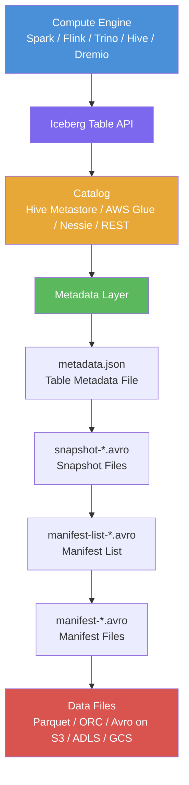

### File Hierarchy Explained

```
warehouse/
└── db/
    └── orders/                           ← Iceberg Table
        ├── metadata/
        │   ├── v1.metadata.json          ← Table metadata (current state)
        │   ├── v2.metadata.json          ← After first commit
        │   ├── snap-001-manifest-list.avro  ← Snapshot manifest list
        │   ├── manifest-abc.avro         ← Manifest file (list of data files)
        │   └── manifest-def.avro
        └── data/
            ├── part-00000.parquet        ← Actual data files
            └── part-00001.parquet
```

### Metadata Flow (How a Read Works)

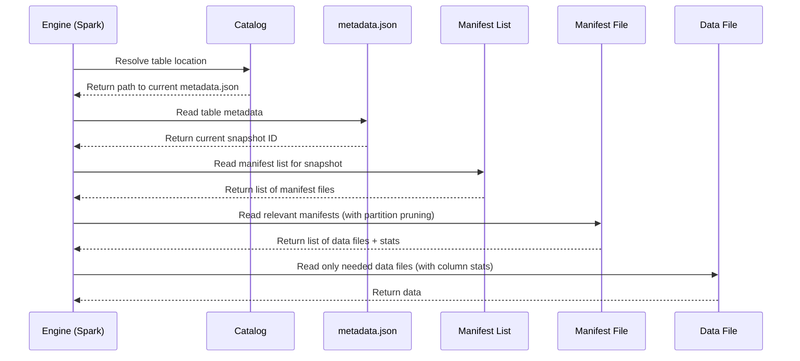

### Snapshot Lifecycle

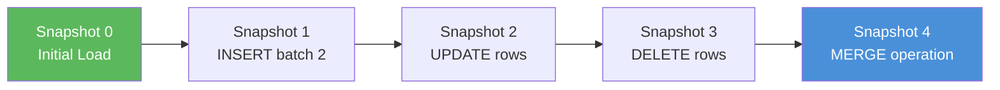

Every write (INSERT/UPDATE/DELETE/MERGE) creates a **new snapshot**. Old snapshots are retained until explicitly expired (enabling time travel).

---

## 4. Deep Dive — Technical Architecture & Components

---

### 4.1 The Three-Layer Stack

Apache Iceberg organizes its internals into **three distinct layers**, each with clear responsibilities:

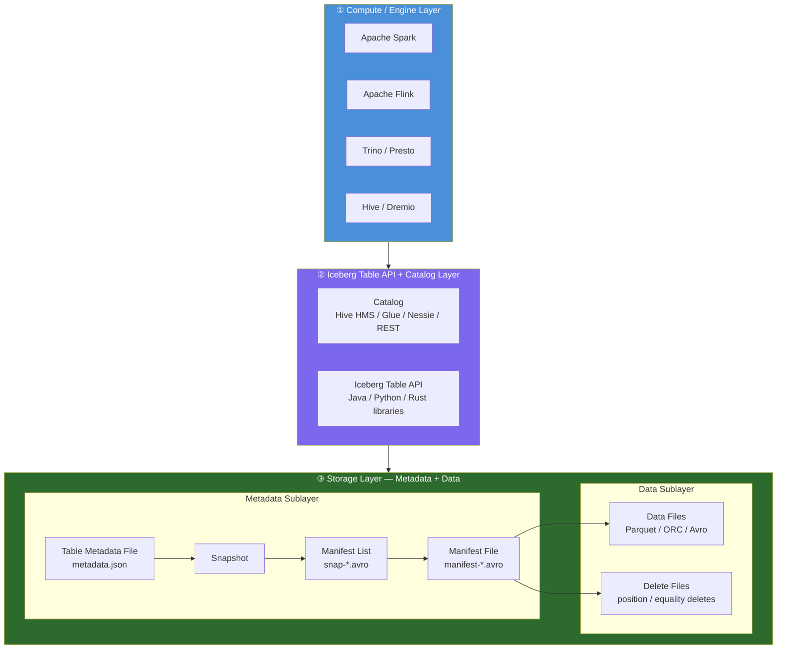

| Layer | Role | Files Involved |
|---|---|---|
| **Engine** | Executes queries; reads/writes via Iceberg API | — |
| **Catalog + API** | Resolves table location; manages commits | External service (HMS, Glue, REST) |
| **Metadata** | Tracks all table state — schema, partitions, snapshots, file stats | `.json`, `.avro` in `metadata/` |
| **Data** | Physical records | `.parquet`, `.orc`, `.avro` in `data/` |

---

### 4.2 Catalog Layer

The **Catalog** is the entry point for any table operation. It stores exactly **one pointer**: the path to the current `metadata.json` file for each table.

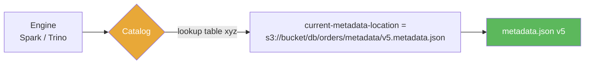

#### What a Catalog Stores

```
Catalog entry for table "db.orders":
  metadata-location = s3://bucket/db/orders/metadata/v5.metadata.json
```

That's it. The rest of the truth is **in the metadata files on object storage** — not in the catalog. This is why Iceberg is **catalog-agnostic**: any system that can store and atomically update a single string can be an Iceberg catalog.

#### Catalog Types

| Catalog | Storage Backend | Atomic Commit Mechanism | Notes |
|---|---|---|---|
| **Hive Metastore** | RDBMS (MySQL/PostgreSQL) | DB transaction | Most common on-prem |
| **AWS Glue** | DynamoDB-backed | Conditional put on version number | Cloud-native on AWS |
| **Project Nessie** | Custom store | Git-like commit protocol | Enables branching/tagging |
| **REST Catalog** | Any backend (S3, DB) | REST API with ETags | Open spec; Tabular, Snowflake |
| **JDBC Catalog** | Any JDBC DB | DB row update | Flexible, generic |
| **Hadoop Catalog** | HDFS / local FS | File rename (atomic on HDFS) | Dev/test only; not S3-safe |

#### Why Not S3 directly for atomic commits?

S3 has **no atomic rename** operation. So Iceberg uses the catalog (backed by a system that *does* support atomicity — a DB, DynamoDB, etc.) to atomically swap the metadata pointer. This is the key design insight.

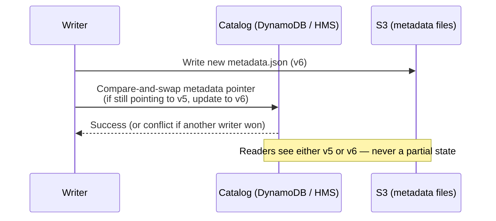

---

### 4.3 Metadata Layer — Table Metadata File

The **Table Metadata File** (`metadata.json`) is the central description of the table at a point in time.

#### Internal Structure of `metadata.json`

```json
{
  "format-version": 2,
  "table-uuid": "9c12d441-6f23-4e7a-b123-abc123def456",
  "location": "s3://bucket/db/orders",

  "last-sequence-number": 4,
  "last-updated-ms": 1704883200000,

  "schemas": [
    {
      "schema-id": 0,
      "fields": [
        { "id": 1, "name": "order_id",    "type": "long",   "required": true  },
        { "id": 2, "name": "customer_id", "type": "long",   "required": false },
        { "id": 3, "name": "amount",      "type": "double", "required": false },
        { "id": 4, "name": "order_date",  "type": "date",   "required": false }
      ]
    }
  ],
  "current-schema-id": 0,

  "partition-specs": [
    {
      "spec-id": 0,
      "fields": [
        { "source-id": 4, "field-id": 1000, "name": "order_date_day", "transform": "day" }
      ]
    }
  ],
  "default-spec-id": 0,

  "sort-orders": [
    { "order-id": 0, "fields": [] }
  ],
  "default-sort-order-id": 0,

  "snapshots": [
    {
      "snapshot-id": 5423876102973123,
      "parent-snapshot-id": null,
      "sequence-number": 1,
      "timestamp-ms": 1704880000000,
      "manifest-list": "s3://bucket/db/orders/metadata/snap-5423876102973123-1.avro",
      "summary": { "operation": "append", "added-data-files": "3" }
    },
    {
      "snapshot-id": 8823112345678901,
      "parent-snapshot-id": 5423876102973123,
      "sequence-number": 2,
      "timestamp-ms": 1704883200000,
      "manifest-list": "s3://bucket/db/orders/metadata/snap-8823112345678901-1.avro",
      "summary": { "operation": "overwrite", "added-data-files": "1", "deleted-data-files": "1" }
    }
  ],
  "current-snapshot-id": 8823112345678901,

  "snapshot-log": [
    { "timestamp-ms": 1704880000000, "snapshot-id": 5423876102973123 },
    { "timestamp-ms": 1704883200000, "snapshot-id": 8823112345678901 }
  ],

  "metadata-log": [
    { "timestamp-ms": 1704880000000, "metadata-file": "s3://bucket/.../v1.metadata.json" }
  ],

  "properties": {
    "write.delete.mode": "copy-on-write",
    "write.target-file-size-bytes": "134217728"
  }
}
```

#### Key Sections Explained

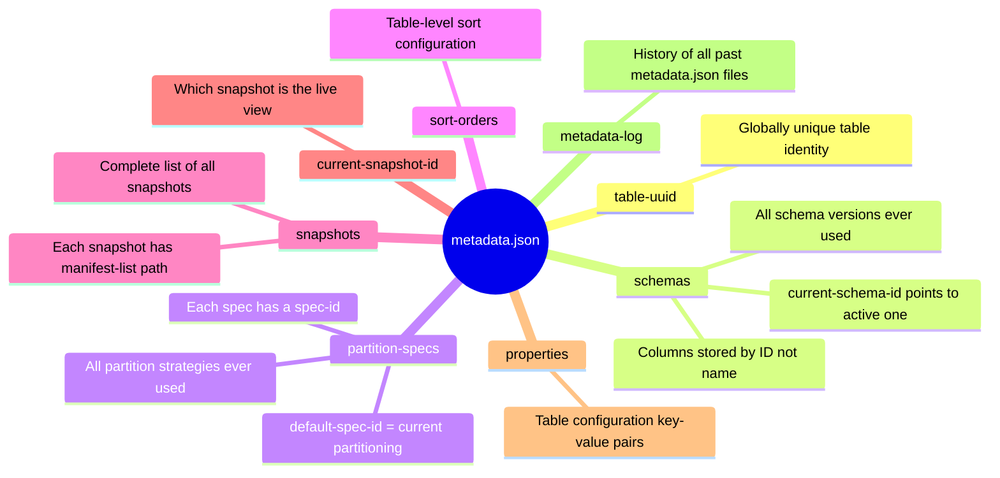

---

### 4.4 Metadata Layer — Snapshots

A **Snapshot** represents the state of the table after a single atomic operation (INSERT, UPDATE, DELETE, MERGE, compaction, etc.).

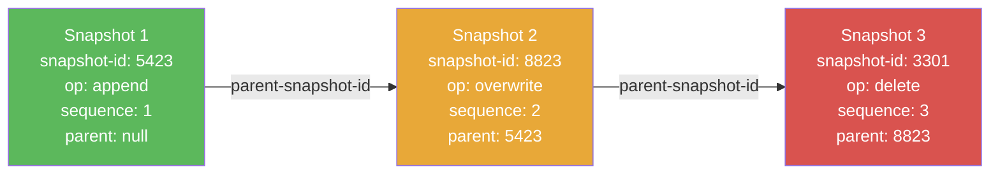

#### Snapshot Fields

| Field | Description |
|---|---|
| `snapshot-id` | Unique 64-bit integer ID |
| `parent-snapshot-id` | ID of previous snapshot (null for first) |
| `sequence-number` | Monotonically increasing write order |
| `timestamp-ms` | When the snapshot was committed |
| `manifest-list` | Path to the manifest list Avro file |
| `summary.operation` | `append`, `overwrite`, `delete`, `replace` |

#### Snapshot Operations

| Operation | Triggered By | Effect |
|---|---|---|
| `append` | INSERT | Adds new data files; no file deletion |
| `overwrite` | UPDATE / MERGE (CoW) | Adds new + marks old data files deleted |
| `delete` | DELETE | Marks data files or rows deleted |
| `replace` | Compaction | Replaces many small files with fewer large files |

---

### 4.5 Metadata Layer — Manifest List

Each snapshot points to exactly **one Manifest List** file (Avro format).

The Manifest List is an index of all **Manifest Files** that belong to a snapshot.

#### Internal Structure of Manifest List (Avro Schema)

```
Each row in the Manifest List Avro file:
┌─────────────────────────────────────────────────────────────┐
│ manifest_path        : string   (path to manifest file)     │
│ manifest_length      : long     (file size in bytes)        │
│ partition_spec_id    : int      (which partition spec)      │
│ content              : int      (0=data, 1=deletes)         │
│ sequence_number      : long     (write sequence number)     │
│ min_sequence_number  : long     (oldest seq number in manif)│
│ added_snapshot_id    : long     (snapshot that added this)  │
│ added_files_count    : int      (# data files added)        │
│ existing_files_count : int      (# data files unchanged)    │
│ deleted_files_count  : int      (# data files deleted)      │
│ added_rows_count     : long                                 │
│ existing_rows_count  : long                                 │
│ deleted_rows_count   : long                                 │
│ partitions           : list<partition_field_summary>        │
│   └── contains_null  : bool                                 │
│   └── contains_nan   : bool                                 │
│   └── lower_bound    : bytes    (min partition value)       │
│   └── upper_bound    : bytes    (max partition value)       │
└─────────────────────────────────────────────────────────────┘
```

#### Why the Manifest List Matters

The engine uses the Manifest List to do **partition-level pruning BEFORE opening any manifest file**:

```
Query: WHERE order_date BETWEEN '2024-01-01' AND '2024-01-31'
  → Scan Manifest List
  → For each manifest entry, check lower_bound/upper_bound of order_date partition
  → Skip manifests where upper_bound < '2024-01-01' or lower_bound > '2024-01-31'
  → Only open matching manifests
```

This avoids the S3 `LIST` problem of Hive — **no directory scanning needed**.

---

### 4.6 Metadata Layer — Manifest Files

A **Manifest File** (Avro) is a list of data files (or delete files) with rich statistics for each file.

#### Internal Structure of Manifest File

```
Each row in the Manifest File Avro:
┌──────────────────────────────────────────────────────────────────┐
│ status                : int   (0=EXISTING, 1=ADDED, 2=DELETED)   │
│ snapshot_id           : long  (snapshot that added/deleted this) │
│ sequence_number       : long                                     │
│ file_sequence_number  : long                                     │
│ data_file:                                                       │
│   content             : int   (0=DATA, 1=POSITION_DELETES,       │
│                                2=EQUALITY_DELETES)               │
│   file_path           : string                                   │
│   file_format         : string  (PARQUET / ORC / AVRO)          │
│   partition           : struct  (partition values for this file) │
│   record_count        : long    (total rows in file)            │
│   file_size_in_bytes  : long                                     │
│   column_sizes        : map<int, long>  (col_id → byte size)    │
│   value_counts        : map<int, long>  (col_id → row count)    │
│   null_value_counts   : map<int, long>  (col_id → null count)   │
│   nan_value_counts    : map<int, long>                           │
│   lower_bounds        : map<int, bytes> (col_id → min value)    │
│   upper_bounds        : map<int, bytes> (col_id → max value)    │
│   key_metadata        : bytes   (encryption metadata)           │
│   split_offsets       : list<long>  (byte offsets for splits)   │
│   equality_ids        : list<int>   (for equality delete files) │
│   sort_order_id       : int                                      │
└──────────────────────────────────────────────────────────────────┘
```

#### How Column Statistics Enable File Skipping

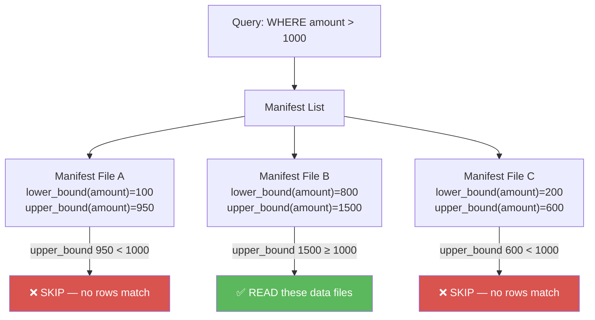

This is **predicate pushdown at the metadata level** — a unique Iceberg capability that Hive lacks entirely.

---

### 4.7 Data Layer — Data Files & Delete Files

#### Data Files

Physical files storing actual table rows in columnar format.

| Property | Details |
|---|---|
| **Formats** | Parquet (default), ORC, Avro |
| **Location** | `<table-location>/data/<partition>/` |
| **Naming** | UUID-based; no sequential numbering |
| **Immutable** | Data files are **never modified** after writing |
| **Partition info** | Partition values are stored in the manifest, not in the file path |

```
s3://bucket/db/orders/data/
  order_date_day=18637/               ← Hive-style (identity partition)
    part-00000-abc123.parquet
  order_date_day=18638/
    part-00000-def456.parquet

or (hidden partition, no path encoding):
  data/
    00000-0-abc123-00001.parquet      ← partition info in manifest only
```

#### Delete Files (Merge-on-Read)

When Iceberg uses **Merge-on-Read** mode, deletes and updates do not rewrite data files. Instead, they produce **Delete Files**.

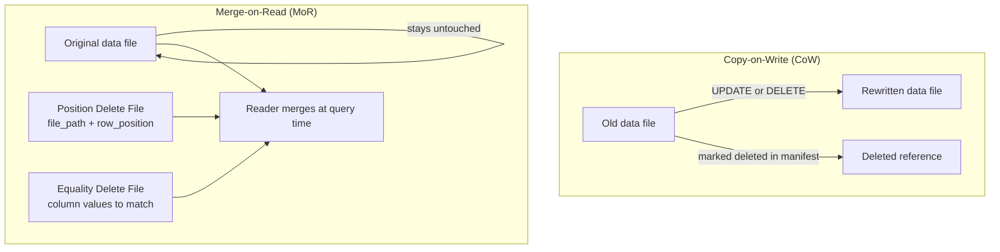

##### Position Delete File

Specifies exact rows to delete by file path + row position offset:

```
┌──────────────────────────────────────────────┐
│ file_path : "s3://bucket/.../part-00001.parq"│
│ pos       : 42    ← delete row at position 42│
│ row       : <optional full row for CDC>       │
└──────────────────────────────────────────────┘
```

##### Equality Delete File

Specifies rows to delete by matching column values (like a WHERE clause):

```
┌──────────────────────────────┐
│ order_id : 1001              │  ← delete all rows where order_id = 1001
│ status   : 'cancelled'       │  ← AND status = 'cancelled'
└──────────────────────────────┘
```

| Delete Type | Written By | Read Cost | Use Case |
|---|---|---|---|
| **Position Delete** | Spark (row-level DELETE) | Low — exact row lookup | Known row positions (e.g., CDC primary key updates) |
| **Equality Delete** | Flink streaming / CDC | Higher — scan to match | Value-based filtering; easier for streaming writes |

---

### 4.8 Commit Protocol & Optimistic Concurrency

Every write to an Iceberg table follows this atomic commit protocol:

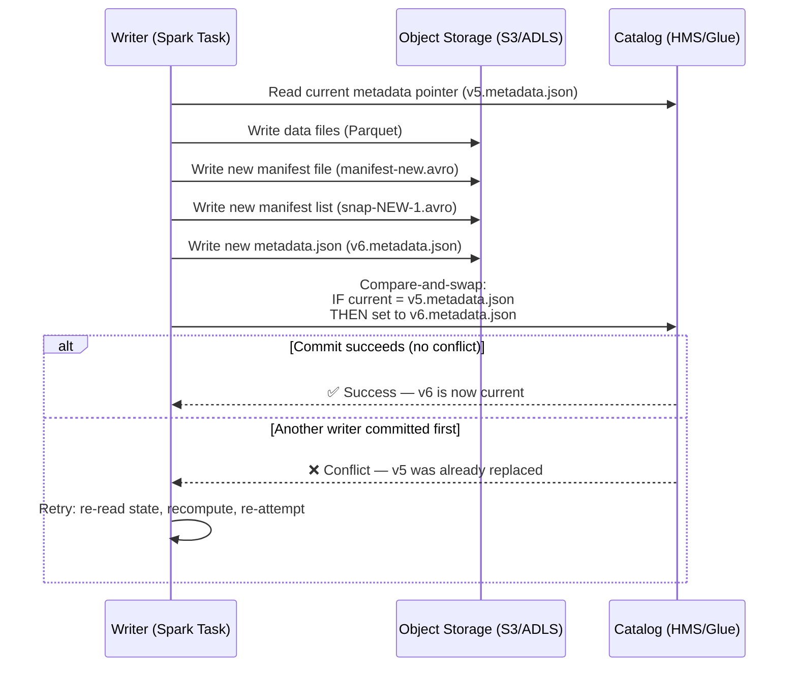

#### Conflict Resolution Rules

| Operation Type | Conflict Behavior |
|---|---|
| **Append** (INSERT) | Always succeeds — appends are non-conflicting |
| **Overwrite** (UPDATE, MERGE) | Fails if overlapping files were modified by another writer |
| **Delete** | Fails if deleted files were already replaced by another writer |
| **Schema change** | Serialized by catalog; only one can succeed |

This is **Optimistic Concurrency Control (OCC)**: assume no conflict, proceed, validate at commit time.

---

### 4.9 File Pruning — How Iceberg Skips Files

Iceberg has **three levels of file pruning**, applied in order from cheapest to most expensive:

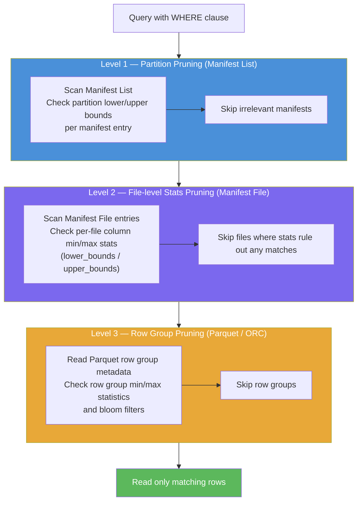

| Level | Where | Granularity | Cost |
|---|---|---|---|
| Partition pruning | Manifest List | Per manifest (group of files) | Very cheap — single Avro file scan |
| File stats pruning | Manifest File | Per data file | Cheap — Avro metadata read |
| Row group pruning | Parquet footer | Per row group (~128K rows) | Slightly more expensive — file header read |
| Row-level filtering | Parquet data | Per row | Actual I/O cost |

---

### 4.10 Write Path (End-to-End)

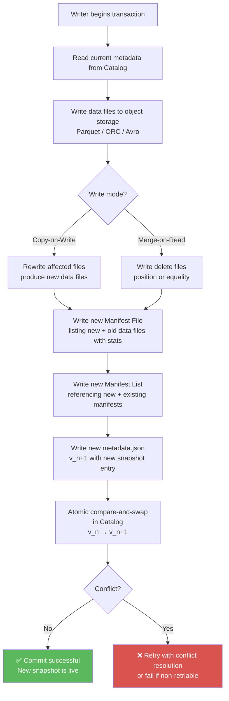

#### Files Created Per Write Operation (INSERT example)

```
BEFORE write:
  metadata/ v5.metadata.json
  data/     part-A.parquet, part-B.parquet

AFTER INSERT (3 new rows):
  metadata/
    v5.metadata.json            ← unchanged (old)
    v6.metadata.json            ← NEW: points to new snapshot
    snap-NEW-1.avro             ← NEW: manifest list
    manifest-NEW.avro           ← NEW: lists part-C.parquet
  data/
    part-A.parquet              ← unchanged
    part-B.parquet              ← unchanged
    part-C.parquet              ← NEW: new data
```

---

### 4.11 Read Path (End-to-End)

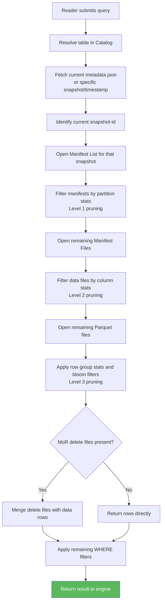

#### Full Component Interaction Map

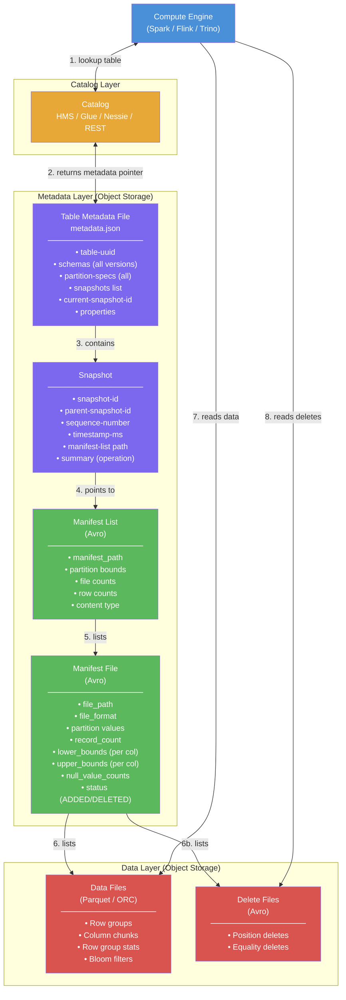

---

## 5. Key Features of Iceberg

| Feature | Description |
|---|---|
| **ACID Transactions** | Optimistic concurrency control; atomic commits via metadata swap |
| **Time Travel** | Query data at any historical snapshot or timestamp |
| **Schema Evolution** | Add, drop, rename, reorder, widen columns safely |
| **Partition Evolution** | Change partition strategy without rewriting data |
| **Hidden Partitioning** | Engine writes partition transforms; users query without knowing partitions |
| **Row-level Operations** | Native MERGE, UPDATE, DELETE (copy-on-write or merge-on-read) |
| **Multi-engine Support** | Spark, Flink, Trino, Hive, Dremio, Snowflake (Iceberg external tables) |
| **Column Statistics** | Min/max stats stored in manifest files → aggressive file skipping |
| **Branching & Tagging** | Git-like branches/tags on table snapshots (Project Nessie) |

---

## 6. Apache Iceberg vs Delta Lake

### High-Level Comparison

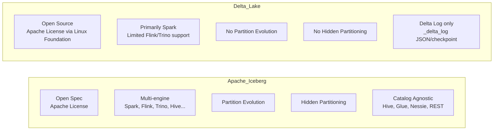

### Detailed Feature Comparison Table

| Feature | Apache Iceberg | Delta Lake |
|---|---|---|
| **Origin** | Netflix → Apache Foundation (2018) | Databricks → Linux Foundation (2019) |
| **License** | Apache 2.0 | Apache 2.0 |
| **Metadata Format** | Avro (manifest), JSON (table metadata) | JSON + Parquet checkpoint files |
| **ACID Transactions** | ✅ Yes | ✅ Yes |
| **Time Travel** | ✅ Snapshot-based | ✅ Version-based |
| **Schema Evolution** | ✅ Full (add/drop/rename/reorder/widen) | ✅ Partial (add/rename; drop is limited) |
| **Partition Evolution** | ✅ Yes (change strategy in-place) | ❌ No (must rewrite table) |
| **Hidden Partitioning** | ✅ Yes | ❌ No |
| **Multi-engine** | ✅ Spark, Flink, Trino, Hive, Dremio | ⚠️ Mainly Spark; Trino/Hive via connector |
| **Row-level Writes** | ✅ Copy-on-Write & Merge-on-Read | ✅ Copy-on-Write (default) |
| **Catalog** | Hive, Glue, Nessie, REST, JDBC | Delta Log (`_delta_log/`) |
| **Column Stats** | ✅ In manifest files | ✅ In `_delta_log` |
| **Branching/Tagging** | ✅ Via Project Nessie | ✅ Delta Table cloning |
| **Best With** | Open lake house / multi-engine | Databricks-centric workloads |
| **Cloud Native** | Any cloud / on-prem | Databricks / Azure / AWS |
| **Vacuum/Compaction** | `expire_snapshots`, `rewrite_data_files` | `VACUUM`, `OPTIMIZE` |
| **Z-Order** | ✅ Supported in Spark | ✅ Native OPTIMIZE ZORDER |

### When to Choose What?

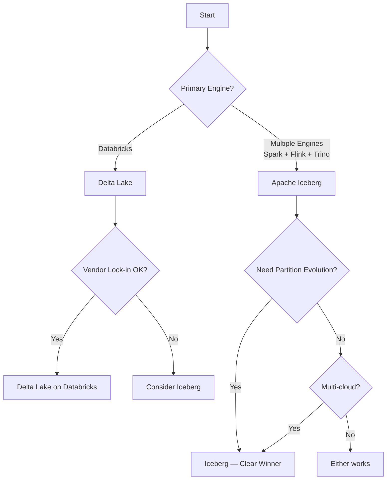

---

## 7. Iceberg Table Format Spec

### Write Modes

| Mode | Description | Best For |
|---|---|---|
| **Copy-on-Write (CoW)** | Rewrites entire data files on every update/delete | Read-heavy workloads |
| **Merge-on-Read (MoR)** | Writes delete files; merges on read | Write-heavy workloads |

### Manifest File Structure

Each manifest file (Avro) contains:
- Path to each data file
- Partition info for that file
- Row count
- **Column-level statistics**: null count, min value, max value, lower/upper bounds

This enables **partition pruning** and **predicate pushdown** without scanning actual data files.

---

## 8. Iceberg Catalogs

A catalog is responsible for tracking the **current metadata pointer** for each table.

| Catalog | Description |
|---|---|
| **Hive Metastore** | Stores location of `metadata.json` in HMS table properties |
| **AWS Glue** | Cloud-native; replaces HMS on AWS |
| **Project Nessie** | Git-like multi-table transactions; supports branching |
| **REST Catalog** | Spec-based REST API; used by Snowflake, Tabular, etc. |
| **JDBC Catalog** | Any JDBC-compatible DB (PostgreSQL, MySQL) |
| **Hadoop Catalog** | File-based; good for local/dev testing |

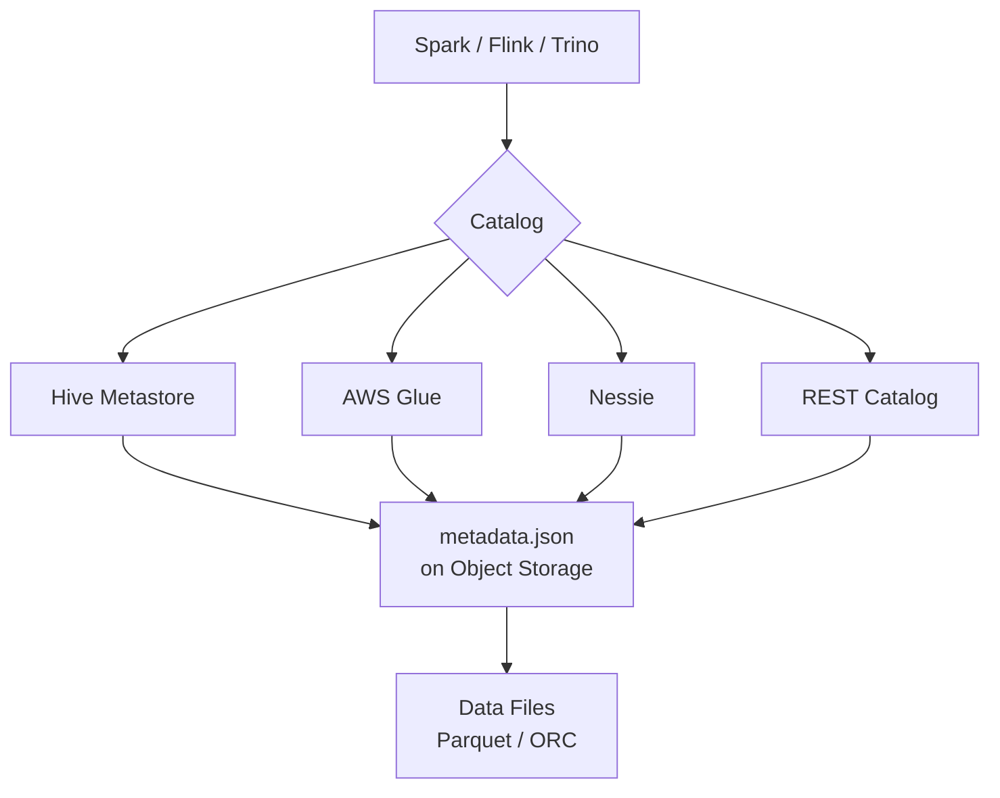

---

## 9. Iceberg with PySpark — Code Examples

### 8.1 Setup & Configuration

```python
from pyspark.sql import SparkSession

spark = SparkSession.builder \
    .appName("IcebergDemo") \
    .config("spark.sql.extensions", "org.apache.iceberg.spark.extensions.IcebergSparkSessionExtensions") \
    .config("spark.sql.catalog.spark_catalog", "org.apache.iceberg.spark.SparkSessionCatalog") \
    .config("spark.sql.catalog.spark_catalog.type", "hive") \
    .config("spark.sql.catalog.local", "org.apache.iceberg.spark.SparkCatalog") \
    .config("spark.sql.catalog.local.type", "hadoop") \
    .config("spark.sql.catalog.local.warehouse", "/tmp/iceberg-warehouse") \
    .getOrCreate()
```

### 8.2 Create an Iceberg Table

```python
spark.sql("""
    CREATE TABLE local.db.orders (
        order_id     BIGINT,
        customer_id  BIGINT,
        product      STRING,
        amount       DOUBLE,
        order_date   DATE,
        status       STRING
    )
    USING iceberg
    PARTITIONED BY (days(order_date))   -- Hidden partitioning: day transform
""")
```

### 8.3 Insert Data

```python
from pyspark.sql import Row
from datetime import date

data = [
    Row(order_id=1, customer_id=101, product="Laptop", amount=1200.0, order_date=date(2024, 1, 10), status="shipped"),
    Row(order_id=2, customer_id=102, product="Phone",  amount=800.0,  order_date=date(2024, 1, 11), status="pending"),
    Row(order_id=3, customer_id=103, product="Tablet", amount=500.0,  order_date=date(2024, 2, 5),  status="shipped"),
]

df = spark.createDataFrame(data)
df.writeTo("local.db.orders").append()
```

### 8.4 Query the Table

```python
# Simple select — no need to specify partition columns explicitly!
spark.sql("SELECT * FROM local.db.orders WHERE order_date BETWEEN '2024-01-01' AND '2024-01-31'").show()
```

### 8.5 UPDATE (row-level)

```python
spark.sql("""
    UPDATE local.db.orders
    SET status = 'delivered'
    WHERE order_id = 2
""")
```

### 8.6 DELETE (row-level)

```python
spark.sql("""
    DELETE FROM local.db.orders
    WHERE status = 'pending' AND order_date < '2024-02-01'
""")
```

### 8.7 MERGE INTO (Upsert)

```python
spark.sql("""
    MERGE INTO local.db.orders AS target
    USING (
        SELECT 4 AS order_id, 104 AS customer_id, 'Monitor' AS product,
               350.0 AS amount, DATE '2024-03-01' AS order_date, 'shipped' AS status
    ) AS source
    ON target.order_id = source.order_id
    WHEN MATCHED THEN
        UPDATE SET target.status = source.status
    WHEN NOT MATCHED THEN
        INSERT *
""")
```

### 8.8 Schema Evolution

```python
# Add a new column
spark.sql("ALTER TABLE local.db.orders ADD COLUMN discount DOUBLE")

# Rename a column
spark.sql("ALTER TABLE local.db.orders RENAME COLUMN discount TO discount_pct")

# Drop a column
spark.sql("ALTER TABLE local.db.orders DROP COLUMN discount_pct")
```

---

## 10. Time Travel & Snapshots

### List Snapshots

```python
spark.sql("SELECT * FROM local.db.orders.snapshots").show(truncate=False)
```

Output:
```
+-------------------+----------------+---------------+---------------------------+
|committed_at       |snapshot_id     |parent_id      |operation                  |
+-------------------+----------------+---------------+---------------------------+
|2024-01-10 10:00:00|5423876102973123|null           |append                     |
|2024-01-10 10:05:00|8823112345678901|5423876102973123|overwrite                 |
+-------------------+----------------+---------------+---------------------------+
```

### Query at a Specific Snapshot (Time Travel)

```python
# By snapshot ID
spark.read \
    .option("snapshot-id", "5423876102973123") \
    .table("local.db.orders") \
    .show()

# By timestamp
spark.read \
    .option("as-of-timestamp", "2024-01-10T10:00:00.000") \
    .table("local.db.orders") \
    .show()

# SQL syntax
spark.sql("""
    SELECT * FROM local.db.orders
    TIMESTAMP AS OF '2024-01-10 10:00:00'
""").show()

spark.sql("""
    SELECT * FROM local.db.orders
    VERSION AS OF 5423876102973123
""").show()
```

### Rollback to a Snapshot

```python
from pyspark.sql.functions import col

# Using stored procedure (Spark extensions)
spark.sql("CALL local.system.rollback_to_snapshot('db.orders', 5423876102973123)")
```

### Snapshot Lifecycle

```mermaid
timeline
    title Iceberg Snapshot Timeline
    section Jan 10 10:00
        Snapshot 1 : Initial INSERT (3 rows)
    section Jan 10 10:05
        Snapshot 2 : UPDATE order_id=2 status
    section Jan 10 10:10
        Snapshot 3 : DELETE pending orders
    section Jan 10 10:15
        Snapshot 4 : MERGE (upsert new order)
    section Maintenance
        expire_snapshots : Clean up snapshots older than 7 days
```

---

## 11. Schema Evolution

Iceberg tracks columns by **column ID** (not name). This makes evolution fully safe.

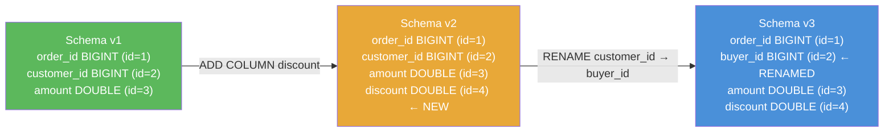

### Why is Iceberg schema evolution safe?

- Old files still refer to column ID=2 as `customer_id`; new code reads it as `buyer_id` — **no rewrite needed**
- Dropped columns are just marked invisible; data is NOT physically removed from old files
- Old readers ignore new columns (they get `null`)
- New readers return `null` for dropped columns from old files

---

## 12. Partition Evolution

### The Problem with Hive Partitioning
- You can't change partition strategy without rewriting the entire table
- Old queries break if the partition column changes

### How Iceberg Solves It

```python
# Table originally partitioned by MONTH
spark.sql("""
    CREATE TABLE local.db.orders (...)
    USING iceberg
    PARTITIONED BY (months(order_date))
""")

# After data grows, switch to DAY — no data rewrite!
spark.sql("""
    ALTER TABLE local.db.orders
    REPLACE PARTITION FIELD months(order_date)
    WITH days(order_date)
""")
```

Old data stays in month-based partitions. New data goes into day-based partitions. Queries work transparently across both.

### Partition Transforms Available

| Transform | Example | Description |
|---|---|---|
| `identity` | `PARTITIONED BY (status)` | Exact value |
| `year` | `PARTITIONED BY (year(order_date))` | Year of date column |
| `month` | `PARTITIONED BY (months(order_date))` | Year-Month |
| `day` | `PARTITIONED BY (days(order_date))` | Year-Month-Day |
| `hour` | `PARTITIONED BY (hours(event_time))` | Year-Month-Day-Hour |
| `bucket(N, col)` | `PARTITIONED BY (bucket(16, customer_id))` | Hash into N buckets |
| `truncate(W, col)` | `PARTITIONED BY (truncate(10, zip_code))` | First W characters |

---

## 13. Hidden Partitioning

With Hive, users must know and filter on partition columns explicitly:
```sql
-- Hive: MUST include partition filter
SELECT * FROM orders WHERE year = 2024 AND month = 1;

-- Forgetting the partition filter = FULL TABLE SCAN!
SELECT * FROM orders WHERE order_date = '2024-01-10';  -- ❌ Full scan in Hive
```

With Iceberg:
```sql
-- Iceberg: Just query naturally — partition pruning is automatic!
SELECT * FROM orders WHERE order_date = '2024-01-10';  -- ✅ Only reads Jan 10 files
```

The engine applies the **partition transform** to filter values and skips irrelevant files automatically.

---

## 14. Row-Level Operations

### Copy-on-Write (CoW) — Default

```mermaid
sequenceDiagram
    participant W as Writer
    participant M as Manifest
    participant D as Data Files

    W->>D: Read file containing row to update
    W->>D: Write NEW file with updated rows
    W->>M: Remove old file reference
    W->>M: Add new file reference
    Note over D: Old file becomes orphan (deleted on cleanup)
```

**Pros:** Fast reads (no merge needed)  
**Cons:** Slow writes (rewrites entire files)

### Merge-on-Read (MoR)

```mermaid
sequenceDiagram
    participant W as Writer
    participant M as Manifest
    participant DF as Data Files
    participant DEL as Delete Files

    W->>DEL: Write delete file (position/equality deletes)
    W->>M: Add delete file reference
    Note over DF: Original data files unchanged

    participant R as Reader
    R->>DF: Read data files
    R->>DEL: Read delete files
    R->>R: Merge: apply deletes on the fly
```

**Pros:** Fast writes (just appends delete files)  
**Cons:** Slightly slower reads (must merge delete files)

### Setting Write Mode

```python
# Copy on Write (default)
spark.sql("""
    CREATE TABLE local.db.orders (...)
    USING iceberg
    TBLPROPERTIES (
        'write.delete.mode' = 'copy-on-write',
        'write.update.mode' = 'copy-on-write',
        'write.merge.mode'  = 'copy-on-write'
    )
""")

# Merge on Read
spark.sql("""
    ALTER TABLE local.db.orders SET TBLPROPERTIES (
        'write.delete.mode' = 'merge-on-read',
        'write.update.mode' = 'merge-on-read',
        'write.merge.mode'  = 'merge-on-read'
    )
""")
```

---

## 15. Compaction & Maintenance

### Why Maintenance is Needed

- Streaming jobs produce many **small files** → slow reads
- Many UPDATE/DELETE operations create many **delete files** → read-time merge overhead
- Old snapshots accumulate → growing metadata

### Compaction (Rewrite Data Files)

```python
# Compact small files in a table
spark.sql("""
    CALL local.system.rewrite_data_files(
        table => 'db.orders',
        strategy => 'binpack',
        options => map(
            'target-file-size-bytes', '134217728'  -- 128 MB target
        )
    )
""")

# Compact with Z-Order sort
spark.sql("""
    CALL local.system.rewrite_data_files(
        table => 'db.orders',
        strategy => 'sort',
        sort_order => 'customer_id ASC NULLS LAST, order_date DESC'
    )
""")
```

### Expire Old Snapshots

```python
# Remove snapshots older than 7 days
spark.sql("""
    CALL local.system.expire_snapshots(
        table => 'db.orders',
        older_than => TIMESTAMP '2024-01-03 00:00:00.000',
        retain_last => 5
    )
""")
```

### Remove Orphan Files

```python
# Remove files not referenced by any snapshot
spark.sql("""
    CALL local.system.remove_orphan_files(table => 'db.orders')
""")
```

### Rewrite Manifests (Optimize Metadata)

```python
spark.sql("""
    CALL local.system.rewrite_manifests(table => 'db.orders')
""")
```

### Maintenance Strategy Overview

```mermaid
graph TD
    A[Iceberg Table] --> B{Issues?}
    B -->|Small files| C[rewrite_data_files<br/>binpack strategy]
    B -->|Many delete files MoR| D[rewrite_data_files<br/>to merge deletes]
    B -->|Old snapshots| E[expire_snapshots]
    B -->|Orphan files| F[remove_orphan_files]
    B -->|Slow metadata scans| G[rewrite_manifests]
    C & D & E & F & G --> H[Healthy Table ✅]
```

---

## 16. Interview Cross-Questions

### Conceptual Questions

| # | Question | Key Points in Answer |
|---|---|---|
| 1 | **What is Apache Iceberg and how is it different from a file format like Parquet?** | Iceberg is a *table format* (metadata layer); Parquet is a *file format* (physical storage). Iceberg tracks which Parquet files belong to a table, manages snapshots, schema, and partitions. |
| 2 | **Explain the Iceberg metadata hierarchy.** | metadata.json → Manifest List (per snapshot) → Manifest Files → Data Files. Each layer adds partition pruning and column stats. |
| 3 | **How does Iceberg ensure ACID transactions?** | Uses optimistic concurrency control. Writers create new metadata files; commit is an atomic swap of the metadata pointer in the catalog. Conflicting commits are detected and retried or failed. |
| 4 | **What is hidden partitioning in Iceberg?** | Users query columns naturally (e.g., `WHERE order_date = '2024-01-10'`); Iceberg applies transforms (day, month, bucket) automatically to prune files. No user-visible partition columns needed. |
| 5 | **What is partition evolution? Why is it significant?** | Ability to change partition strategy without rewriting data. Old data stays in old partition layout; new data uses new layout. Queries work seamlessly across both. Hive has no equivalent. |
| 6 | **What is the difference between Copy-on-Write and Merge-on-Read?** | CoW rewrites entire data files on every update/delete (fast reads, slow writes). MoR appends delete files and merges at read time (fast writes, slight read overhead). |
| 7 | **How does Iceberg schema evolution differ from Hive?** | Iceberg uses column IDs internally. Renaming/reordering does NOT break queries on old files. Hive relies on column position/name — renaming breaks things. |
| 8 | **How does time travel work in Iceberg?** | Every write creates a new snapshot. You can query any snapshot by ID or timestamp using `VERSION AS OF` or `TIMESTAMP AS OF`. |
| 9 | **What is the role of a catalog in Iceberg?** | The catalog stores the pointer to the current `metadata.json` for each table. It's the single source of truth for table location and enables atomic commits. |
| 10 | **Can multiple engines read an Iceberg table simultaneously?** | Yes. Because the table format is open and catalog-based, Spark, Flink, Trino, Hive can all read the same table. Writers coordinate via catalog commits. |

### Advanced / Deep-Dive Questions

| # | Question | Key Points in Answer |
|---|---|---|
| 11 | **How does Iceberg handle concurrent writes?** | Optimistic concurrency: each writer reads current snapshot, makes changes, tries to commit. If another writer committed in the meantime, the current writer detects conflict and may retry or fail (depending on operation type). |
| 12 | **What are equality deletes vs position deletes in Merge-on-Read?** | **Position deletes**: specify exact file + row offset to delete. **Equality deletes**: specify column values to match for deletion (like a predicate). Equality deletes are broader and can match across multiple files. |
| 13 | **How does Iceberg achieve file skipping?** | Manifest files store per-file column statistics (min, max, null count). The engine evaluates query predicates against these stats and skips files that cannot contain matching rows — without opening them. |
| 14 | **What happens during an `expire_snapshots` call?** | Snapshots older than the threshold are removed from the manifest list. Data files referenced ONLY by expired snapshots become orphans and are deleted. Files shared with live snapshots are retained. |
| 15 | **What is Project Nessie and how does it relate to Iceberg?** | Nessie is a catalog that gives Iceberg Git-like features: branches, tags, and multi-table transactions. You can create a branch, run ETL on it, and merge changes — similar to git branching for data. |
| 16 | **Iceberg vs Delta Lake — when would you choose each?** | Choose Iceberg for multi-engine environments, open standards, partition evolution, or non-Databricks clouds. Choose Delta Lake if deeply embedded in Databricks ecosystem for its tight integration and operational tooling. |
| 17 | **What is the overhead of Iceberg's metadata for very large tables?** | Manifest files can grow large for billion-file tables. Solutions: use `rewrite_manifests` to compact them, use manifest caching, and tune `commit.manifest.target-size-bytes`. |
| 18 | **How do you handle schema evolution when downstream consumers use a fixed schema?** | Use schema ID pinning or consume only specific snapshot IDs. Alternatively, use schema aliases or maintain backward-compatible evolution (only add nullable columns, never rename). |
| 19 | **What is Z-Order in Iceberg and how does it help?** | Z-Order interleaves multiple column sort keys into a space-filling curve, co-locating related data across dimensions. Improves query performance when filtering on multiple columns simultaneously (e.g., `customer_id AND order_date`). |
| 20 | **How do you migrate a Hive table to Iceberg?** | Use `CONVERT TO ICEBERG` (in-place, no data copy) or `CREATE TABLE ... AS SELECT` from Hive into Iceberg. In-place migration uses Iceberg's metadata-only migration procedure. |

### Scenario-Based Questions

| # | Scenario | What to Explain |
|---|---|---|
| 21 | *"Your streaming pipeline creates thousands of small files per hour. How do you handle this with Iceberg?"* | Use `rewrite_data_files` with `binpack` strategy in a scheduled maintenance job. In Flink, enable automatic small-file compaction. Set target file size to 128MB–512MB. |
| 22 | *"A data engineer accidentally deleted important rows. How do you recover?"* | Use time travel to find the snapshot before deletion (`SELECT * FROM orders SNAPSHOTS`), then `CALL system.rollback_to_snapshot(...)` or `INSERT INTO orders SELECT * FROM orders VERSION AS OF <snapshot_id>`. |
| 23 | *"You need to change your partition from monthly to daily without a maintenance window."* | Use `ALTER TABLE REPLACE PARTITION FIELD months(order_date) WITH days(order_date)`. Iceberg applies the new partition to new data while old data remains in month partitions. No downtime. |
| 24 | *"You have both Spark and Trino reading the same table. How does Iceberg coordinate this?"* | The catalog (e.g., Glue or Hive Metastore) is the single source of truth. Both engines resolve the table through the catalog to the same `metadata.json`. Reads are snapshot-isolated. Writes coordinate via atomic catalog commits. |

---

## Quick Reference Cheat Sheet

```
Iceberg Metadata Chain:
  Catalog
    └── metadata.json         (current table state, schema, snapshots list)
          └── manifest-list   (one per snapshot; lists manifest files)
                └── manifest  (lists data files + column stats)
                      └── data file (Parquet/ORC/Avro)

Key SQL Commands:
  CREATE TABLE ... USING iceberg PARTITIONED BY (days(ts))
  ALTER TABLE t ADD COLUMN c TYPE
  ALTER TABLE t RENAME COLUMN old TO new
  SELECT * FROM t TIMESTAMP AS OF '2024-01-01'
  SELECT * FROM t VERSION AS OF 12345
  CALL system.rollback_to_snapshot('db.t', snapshot_id)
  CALL system.rewrite_data_files(table => 'db.t', strategy => 'binpack')
  CALL system.expire_snapshots(table => 'db.t', older_than => TIMESTAMP '...')
  CALL system.remove_orphan_files(table => 'db.t')
  CALL system.rewrite_manifests(table => 'db.t')

Table Properties:
  'write.delete.mode' = 'copy-on-write' | 'merge-on-read'
  'write.update.mode' = 'copy-on-write' | 'merge-on-read'
  'write.merge.mode'  = 'copy-on-write' | 'merge-on-read'

Metadata Tables (append .metadata_table to table name):
  db.orders.snapshots
  db.orders.history
  db.orders.manifests
  db.orders.files
  db.orders.partitions
```
