# Apache Kafka — Complete Study Notes

> **Study approach:** This document grows as you learn. Diagrams, terminologies, Q&A, and cross-questions are all included.

---

## Table of Contents
1. [What is Kafka?](#1-what-is-kafka)
2. [Events in Kafka](#2-events-in-kafka)
3. [Core Architecture](#3-core-architecture)
4. [Key Terminologies](#4-key-terminologies)
   - [Broker](#31-broker)
   - [Topic](#32-topic)
   - [Partition](#33-partition)
   - [Offset](#34-offset)
   - [Producer](#35-producer)
   - [Consumer](#36-consumer)
   - [Consumer Group](#37-consumer-group)
   - [ZooKeeper / KRaft](#38-zookeeper--kraft)
   - [Replication & Leader/Follower](#39-replication--leaderfollower)
   - [ISR — In-Sync Replicas](#310-isr--in-sync-replicas)
   - [Log Segment & Retention](#311-log-segment--retention)
5. [Message Anatomy](#5-message-anatomy)
6. [Producer Deep Dive](#6-producer-deep-dive)
7. [Consumer Deep Dive](#7-consumer-deep-dive)
8. [Kafka Streams](#8-kafka-streams)
9. [Kafka Connect](#9-kafka-connect)
10. [Schema Registry](#10-schema-registry)
11. [Delivery Guarantees](#11-delivery-guarantees)
12. [Performance & Tuning](#12-performance--tuning)
13. [Common Interview Cross-Questions](#13-common-interview-cross-questions)

---

## 1. What is Kafka?

Apache Kafka is a **distributed, fault-tolerant, high-throughput event streaming platform**. Originally built at LinkedIn (2011), now an Apache top-level project.

| Property | Detail |
|---|---|
| Type | Distributed commit log / event broker |
| Core abstraction | Append-only, ordered, immutable log |
| Protocol | Custom binary TCP protocol |
| Storage | Disk-based (sequential I/O) |
| Use cases | Event streaming, CDC, log aggregation, real-time analytics, microservice decoupling |

### Why Kafka over traditional message queues?

| Feature | Traditional MQ (RabbitMQ/ActiveMQ) | Kafka |
|---|---|---|
| Message deletion | Deleted after consumption | Retained for configurable period |
| Replay | Not possible | Possible (seek to any offset) |
| Ordering | Per queue | Per partition |
| Throughput | Moderate | Very high (millions/sec) |
| Consumer model | Push | Pull |
| Scalability | Vertical | Horizontal (partitions) |

> **Cross Q:** *Why is Kafka pull-based instead of push-based?*
> Pull allows consumers to control their own pace, avoiding being overwhelmed. Consumers can also batch-fetch, improving throughput.

---

## 2. Events in Kafka

In Kafka's world, **everything is an event**. An event is a record of something that happened — a fact about the world at a point in time.

### What is an Event?

> An **event** (also called a *record* or *message*) is an immutable notification that something occurred. It is the atomic unit of data in Kafka.

Examples of real-world events:
- A user clicked a button → `{userId: 42, action: "click", page: "/checkout"}`
- A bank transfer completed → `{from: "A123", to: "B456", amount: 500.00}`
- A temperature sensor reading → `{sensorId: "T-07", temp: 36.5, unit: "C"}`
- A database row was updated (CDC) → `{table: "orders", op: "UPDATE", before: {...}, after: {...}}`

### Event vs Message vs Record

Kafka uses these terms interchangeably, but conceptually:

| Term | Context |
|---|---|
| **Event** | Domain/business perspective — something that happened |
| **Message** | Messaging systems perspective — unit of communication |
| **Record** | Kafka API perspective — what the `ProducerRecord` / `ConsumerRecord` objects represent |

### Anatomy of a Kafka Event

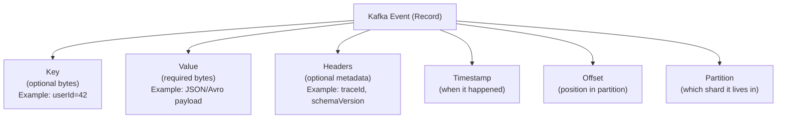

### Event Semantics: Two Interpretations

How you interpret events depends on your use case:

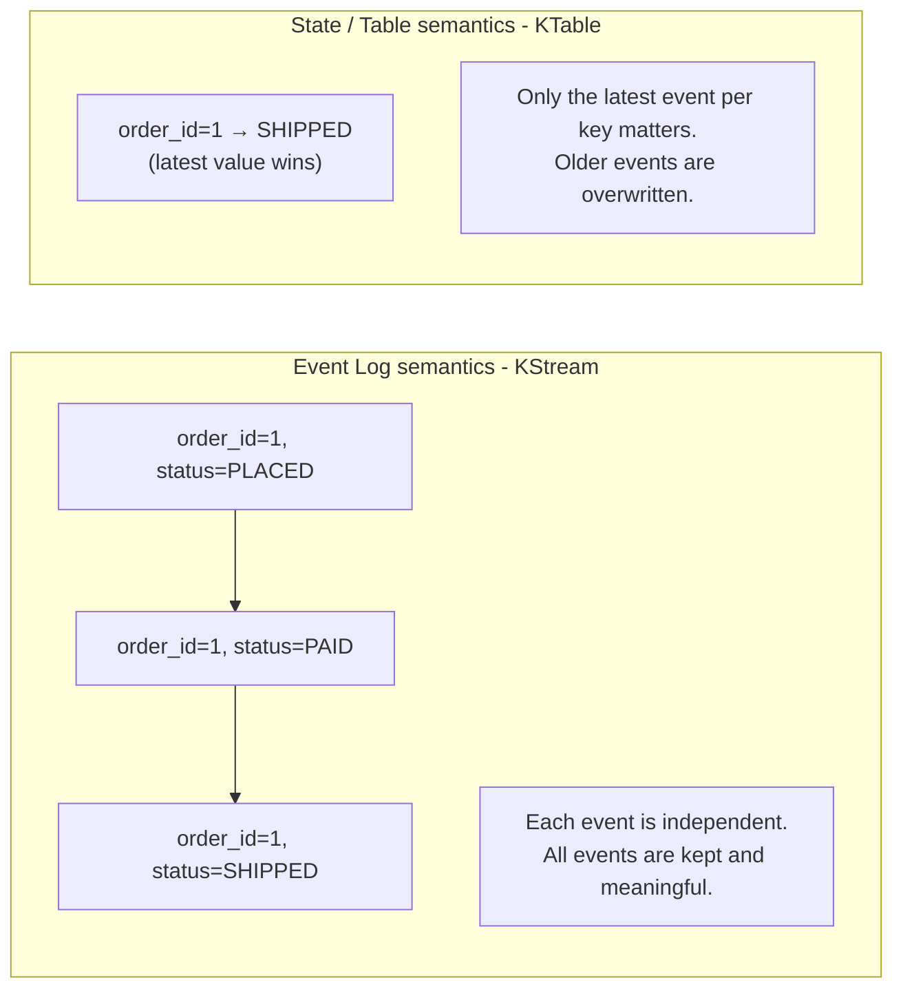

| Semantics | Kafka abstraction | Cleanup policy | Example |
|---|---|---|---|
| Event log | `KStream` | `delete` (time/size-based) | Clickstream, payments |
| State snapshot | `KTable` | `compact` (latest per key) | User profile, order status |

### Event Ordering

- Events within the **same partition** are **strictly ordered** by offset (time of arrival).
- Events **across partitions** have **no guaranteed order**.
- To enforce ordering for related events (e.g., all events for `userId=42`), use the **same key** — Kafka routes same-key events to the same partition.

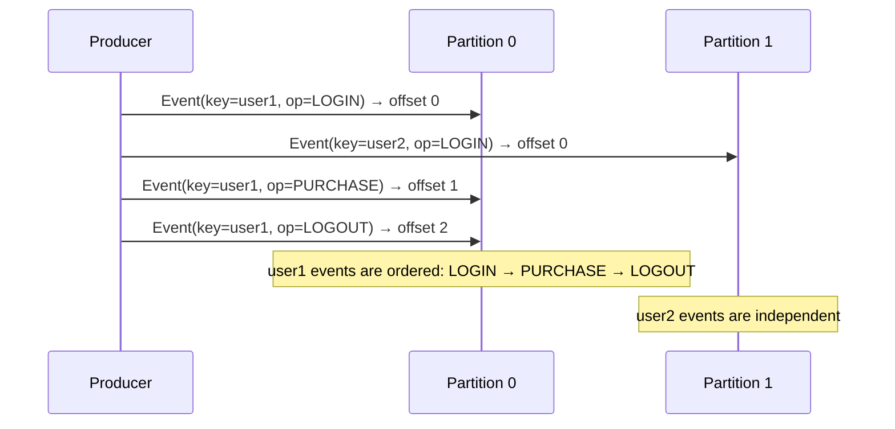

### Event Immutability

Once an event is written to Kafka, **it cannot be changed or deleted** (within the retention window). This is a core design principle:
- Enables **event sourcing** patterns
- Allows **replay** — re-processing history from any point
- Makes the log an **audit trail** by default

### Event Time vs Processing Time vs Ingestion Time

| Time type | Definition | Set by |
|---|---|---|
| **Event time** | When the event actually happened in the real world | Producer (application logic) |
| **Ingestion time** | When the broker received the event | Broker (`LogAppendTime`) |
| **Processing time** | When the consumer/stream processor processes it | Consumer |

Kafka brokers can be configured with `log.message.timestamp.type`:
- `CreateTime` (default) — uses the timestamp the producer sets
- `LogAppendTime` — overrides with broker receipt time

> **Why does this matter?** Out-of-order and late events are common in distributed systems. Kafka Streams windowing relies on event time to correctly bucket events even if they arrive late.

### Event-Driven Architecture Pattern

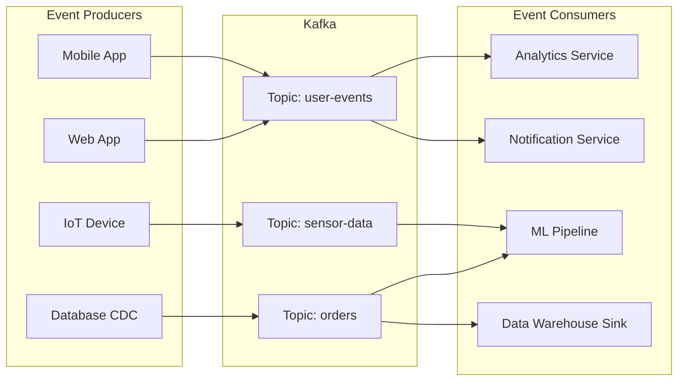

> **Cross Qs:**
> - *What is the difference between an event and a command?* → A **command** is a request for something to happen (imperative, "do this"). An **event** is a notification that something already happened (past tense, immutable fact). Kafka is designed for events, not commands.
> - *Can you update or delete an event in Kafka?* → Not directly. You either wait for retention to expire (delete policy) or publish a **tombstone** record (key with null value) which signals deletion in log-compacted topics.
> - *What is a tombstone event?* → A record with a non-null key and a **null value**. In compacted topics, it marks the key for deletion — the compaction cleaner will eventually remove all records for that key.
> - *What is event sourcing?* → A pattern where the state of a system is derived by replaying the sequence of events, rather than storing the current state directly. Kafka's immutable log makes it a natural event store.
> - *What is the difference between event streaming and batch processing?* → Batch processes a bounded dataset at scheduled intervals; event streaming processes an unbounded stream of events continuously as they arrive.
> - *What is a compaction tombstone and when is it cleaned up?* → A tombstone is cleaned up only after `delete.retention.ms` (default 24 hours) has passed since it was written, giving consumers time to observe the deletion.
> - *How do you handle late-arriving events?* → In Kafka Streams, use windowing with a **grace period** (`withGracePeriod(Duration)`) to allow late events to be included in the correct window before it closes.

---

## 3. Core Architecture

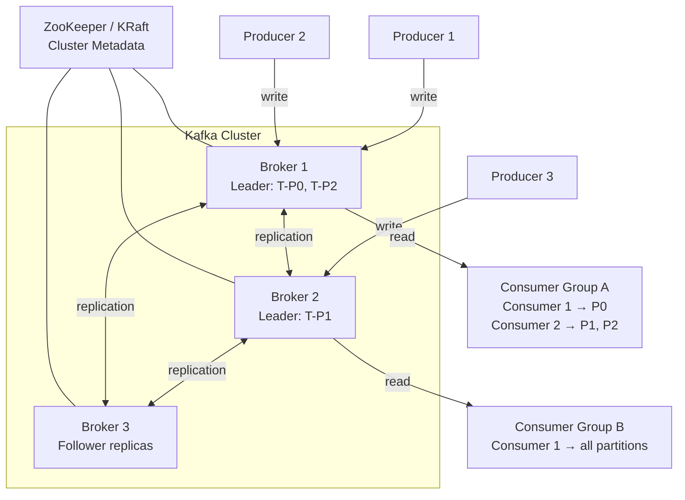

### High-level data flow

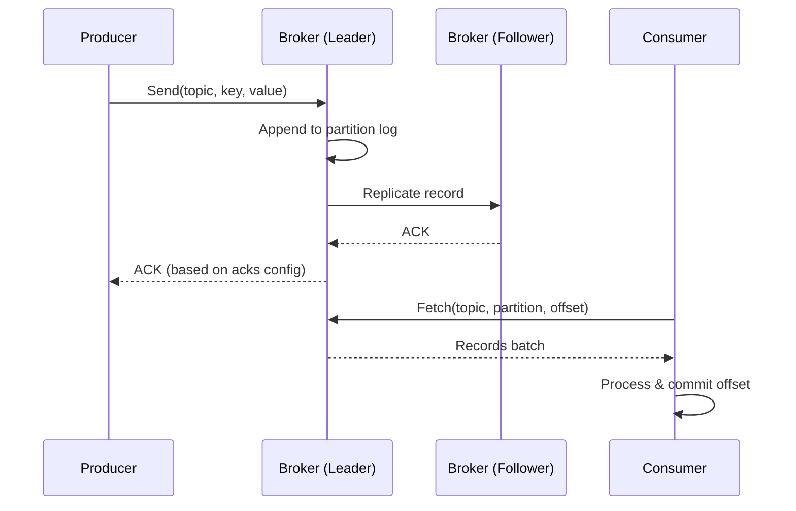

---

## 4. Key Terminologies

### 4.1 Broker

A **Broker** is a single Kafka server process. It:
- Stores messages on disk
- Serves read and write requests
- Manages partition leadership

A Kafka **cluster** is a group of brokers. One broker is elected **Controller** (manages partition leadership elections).

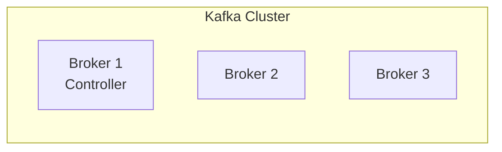

> **Cross Qs:**
> - *What happens if a broker goes down?* → Leader election occurs for partitions that broker was leading. Followers take over.
> - *What is the Controller broker?* → One broker elected to manage metadata: partition assignments, leader elections, broker join/leave events.
> - *Can a broker be both a leader and follower at the same time?* → Yes, for different partitions.

---

### 4.2 Topic

A **Topic** is a logical channel/category to which producers write and from which consumers read. Think of it as a named log.

- Topics are **multi-subscriber** (multiple consumer groups can read the same topic independently)
- Topics are **split into partitions** for parallelism
- Topics have a **retention policy** (time-based or size-based)

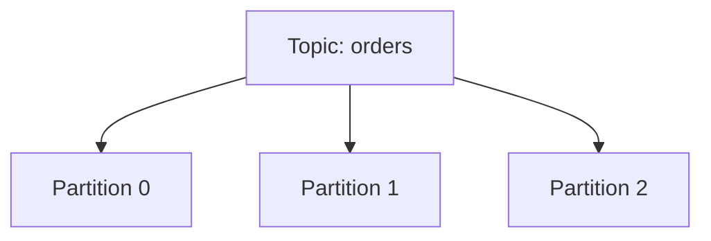

> **Cross Qs:**
> - *Can you delete a topic?* → Yes, if `delete.topic.enable=true` (default true in modern Kafka).
> - *Is a topic global across all brokers?* → Yes, its metadata is global, but its partitions are distributed across brokers.
> - *What is a compacted topic?* → Retention policy where only the **latest value per key** is kept. Used for state snapshots (e.g., Kafka Streams changelog topics).

---

### 4.3 Partition

A **Partition** is the fundamental unit of parallelism and ordering in Kafka.

- Messages within a partition are **strictly ordered** by offset
- A topic with N partitions can be consumed by up to N consumers in parallel (within a consumer group)
- Partitions are distributed across brokers
- Each partition has **one leader** and zero or more **follower replicas**

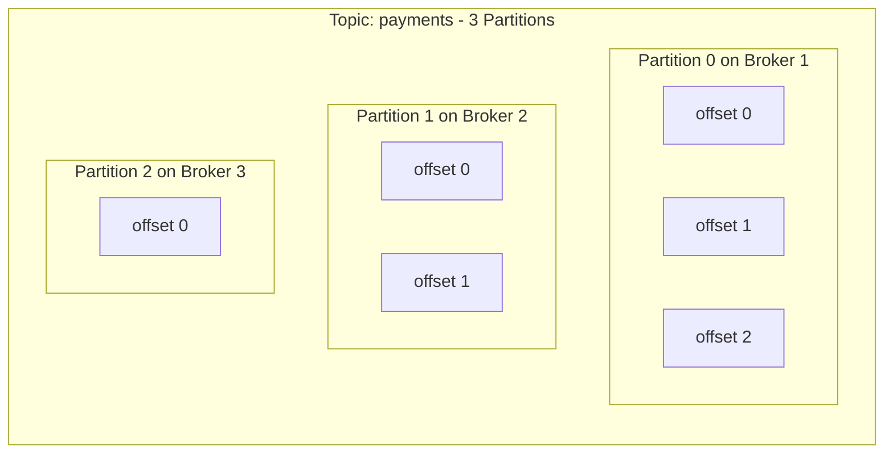

**Partition assignment for producers:**
- No key → Round-robin (or sticky partitioner)
- With key → `hash(key) % numPartitions` → same key always → same partition → ordering guaranteed per key

> **Cross Qs:**
> - *Can you increase partitions after topic creation?* → Yes, but existing key-based routing will change since `hash(key) % newNum` differs.
> - *Can you decrease partitions?* → **No**, Kafka does not support partition reduction.
> - *How many partitions should I choose?* → Rule of thumb: target throughput / single partition throughput. Also consider consumer parallelism needs.
> - *Is ordering guaranteed across partitions?* → **No**, only within a single partition.

---

### 4.4 Offset

An **Offset** is a unique, monotonically increasing integer that identifies each record within a partition.

- Offsets are **per-partition**, not global
- Offsets start at 0 and increment by 1
- Consumers track their position via offsets
- Offsets are stored in the `__consumer_offsets` internal topic

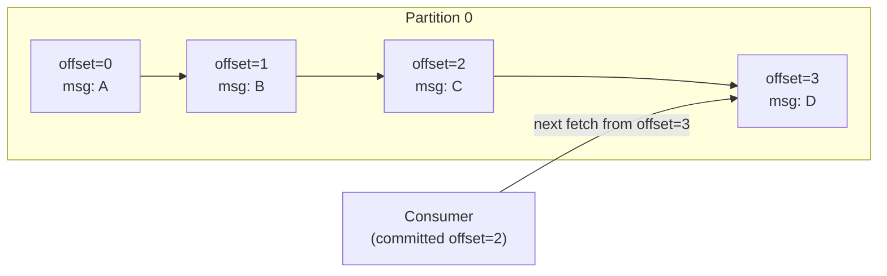

> **Cross Qs:**
> - *Where are consumer offsets stored?* → In the Kafka internal topic `__consumer_offsets`.
> - *What is the difference between current offset and committed offset?* → Current offset is where the consumer is currently reading; committed offset is the last successfully processed position that is checkpointed.
> - *What happens if a consumer restarts?* → It reads the committed offset from `__consumer_offsets` and resumes from there.
> - *Can you seek to a specific offset?* → Yes, using `consumer.seek(partition, offset)`.

---

### 4.5 Producer

A **Producer** is a client that publishes records to Kafka topics.

Key configurations:

| Config | Description | Default |
|---|---|---|
| `acks` | How many broker ACKs before considering write successful | `1` |
| `retries` | Number of retry attempts on failure | `2147483647` |
| `batch.size` | Max bytes in a batch before sending | `16384` (16 KB) |
| `linger.ms` | Time to wait to fill a batch | `0` |
| `compression.type` | none / gzip / snappy / lz4 / zstd | `none` |
| `max.in.flight.requests.per.connection` | Concurrent unacknowledged requests | `5` |
| `enable.idempotence` | Exactly-once producer delivery | `false` (set `true` for EOS) |
| `buffer.memory` | Total producer buffer memory | `33554432` (32 MB) |

**`acks` values explained:**

| acks | Meaning | Risk |
|---|---|---|
| `0` | Fire and forget | Data loss possible |
| `1` | Leader ACK only | Loss if leader fails before replication |
| `all` or `-1` | All ISR replicas must ACK | Safest, slower |

> **Cross Qs:**
> - *What is the difference between `batch.size` and `linger.ms`?* → `batch.size` triggers send when batch is full; `linger.ms` triggers send after a time delay even if batch isn't full. Both can trigger sending.
> - *What is a sticky partitioner?* → Instead of round-robin per message, it fills one partition's batch before moving to the next — reduces request count, improves batching efficiency.
> - *How does `max.in.flight.requests.per.connection=1` help ordering?* → Ensures only one batch is in flight at a time, preventing reordering on retries.
> - *Can you achieve exactly-once semantics in a producer?* → Yes, with `enable.idempotence=true` + `acks=all` + `transactional.id` set.

---

### 4.6 Consumer

A **Consumer** is a client that reads records from Kafka topics by pulling from brokers.

Key configurations:

| Config | Description |
|---|---|
| `group.id` | Consumer group identifier |
| `auto.offset.reset` | `earliest` / `latest` / `none` — what to do when no committed offset exists |
| `enable.auto.commit` | Auto-commit offsets periodically (default: `true`) |
| `auto.commit.interval.ms` | How often to auto-commit (default: `5000` ms) |
| `fetch.min.bytes` | Minimum bytes to fetch before returning | 
| `fetch.max.wait.ms` | Max wait for `fetch.min.bytes` to be met |
| `max.poll.records` | Max records returned in a single `poll()` call |
| `session.timeout.ms` | Time without heartbeat before consumer is considered dead |
| `heartbeat.interval.ms` | How often consumer sends heartbeat |
| `max.poll.interval.ms` | Max time between `poll()` calls before consumer is considered dead |

> **Cross Qs:**
> - *What is the difference between `session.timeout.ms` and `max.poll.interval.ms`?* → `session.timeout.ms` detects consumer crashes (heartbeat thread); `max.poll.interval.ms` detects consumers stuck in processing (poll thread). Both trigger rebalance if exceeded.
> - *What does `auto.offset.reset=earliest` vs `latest` mean?* → `earliest`: start from beginning of partition when no offset exists. `latest`: start from end (new messages only).
> - *What is the risk of `enable.auto.commit=true`?* → A consumer may auto-commit an offset before fully processing the message, leading to message loss if it crashes.

---

### 4.7 Consumer Group

A **Consumer Group** is a set of consumers that cooperate to consume a topic. Kafka ensures:
- Each partition is assigned to **exactly one consumer** within the group
- Multiple groups can consume the same topic **independently**

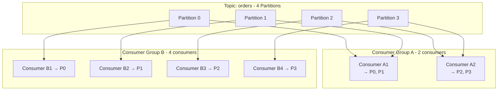

**Rebalancing** occurs when:
- A consumer joins or leaves the group
- A partition is added to the topic
- A consumer fails heartbeat / poll timeout

**Rebalance Protocols:**
| Protocol | Behavior |
|---|---|
| Eager (Stop-the-world) | All consumers release partitions, then re-assign |
| Cooperative (Incremental) | Only moved partitions are revoked; others continue processing |

> **Cross Qs:**
> - *What happens when there are more consumers than partitions?* → Extra consumers sit idle — they get no partitions.
> - *What happens when there are fewer consumers than partitions?* → Some consumers handle multiple partitions.
> - *What triggers a rebalance?* → Consumer join/leave, heartbeat/poll timeout, partition count change, subscription change.
> - *What is a Group Coordinator?* → A broker designated to manage consumer group membership and offset commits for a group.
> - *What is `partition.assignment.strategy`?* → Determines how partitions are assigned: `RangeAssignor`, `RoundRobinAssignor`, `StickyAssignor`, `CooperativeStickyAssignor`.

---

### 4.8 ZooKeeper / KRaft

**ZooKeeper** (legacy, Kafka < 3.x):
- Manages broker metadata, cluster membership, leader election
- Separate process/cluster alongside Kafka
- Pain point: operational complexity (two systems to manage)

**KRaft** (Kafka Raft Metadata mode, Kafka 3.3+ default):
- Kafka manages its own metadata using a Raft-based consensus protocol
- Eliminates ZooKeeper dependency
- Controller quorum (odd number of brokers or dedicated controller nodes) manages metadata

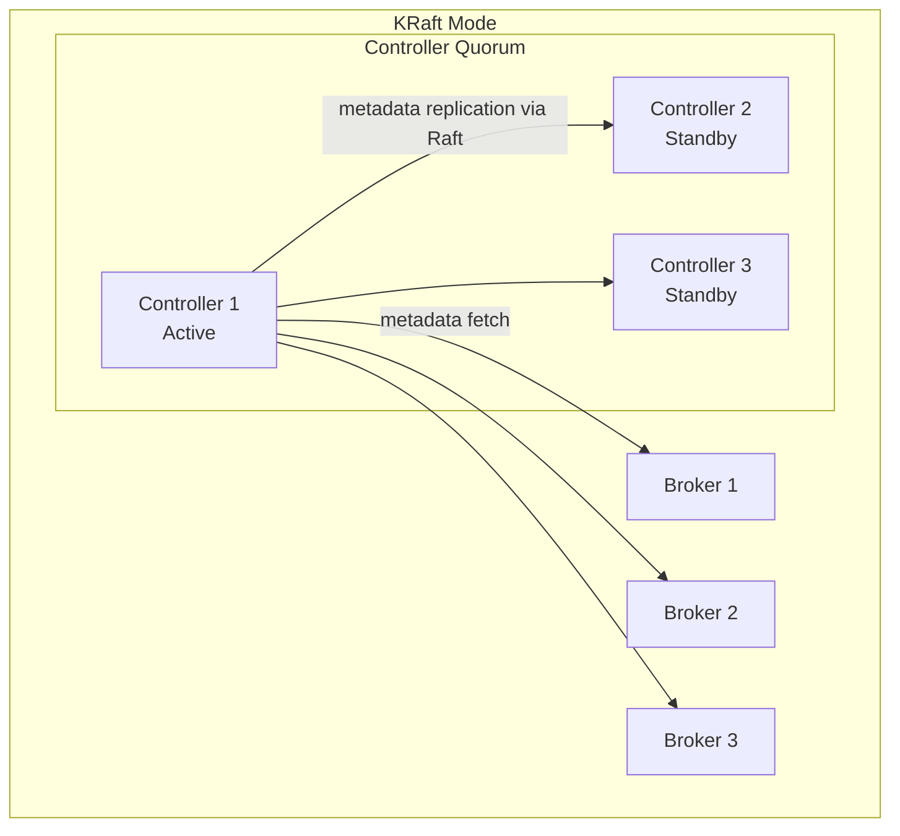

> **Cross Qs:**
> - *Why is ZooKeeper being removed?* → Operational complexity, scalability bottleneck (ZK stores all metadata in memory), separate failure domain.
> - *What is Raft?* → A consensus algorithm that ensures a majority of nodes agree on a value before it's committed — similar to Paxos but simpler to understand.
> - *Can ZooKeeper and KRaft clusters coexist?* → During migration, Kafka supports a bridge mode, but eventually all clusters migrate to KRaft.

---

### 4.9 Replication & Leader/Follower

Kafka replicates each partition across multiple brokers for fault tolerance.

| Term | Description |
|---|---|
| Replication Factor | Number of copies of each partition (including leader) |
| Leader | The broker that handles all reads and writes for a partition |
| Follower | Replicas that passively copy data from the leader |

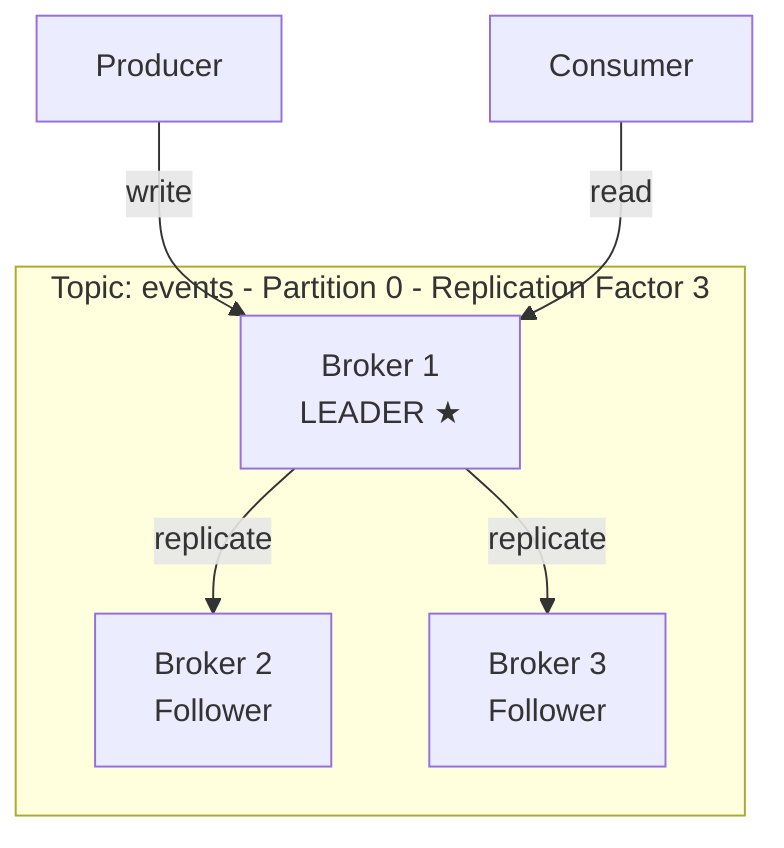

- All **reads and writes** go through the leader
- Followers only replicate from the leader
- If the leader fails, one eligible follower (in ISR) is elected as the new leader

> **Cross Qs:**
> - *Can consumers read from follower replicas?* → By default, no. With `replica.selector.class` set to `RackAwareReplicaSelector`, consumers can read from geographically nearby followers (Kafka 2.4+).
> - *What is `min.insync.replicas`?* → Minimum number of replicas that must acknowledge a write for it to be successful when `acks=all`. If fewer replicas are in sync, the broker returns `NotEnoughReplicasException`.
> - *What is the recommended replication factor for production?* → 3 is standard. Never use 1.

---

### 4.10 ISR — In-Sync Replicas

**ISR (In-Sync Replicas)** is the set of replicas that are fully caught up with the leader within `replica.lag.time.max.ms`.

- If a follower falls behind, it is removed from ISR
- When it catches up, it is added back to ISR
- Leader election only promotes ISR members (by default) to ensure no data loss

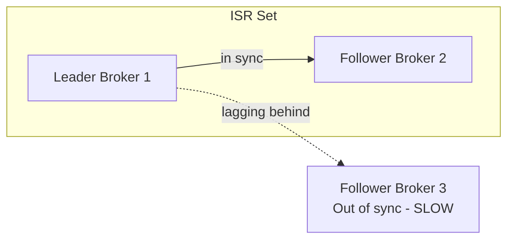

> **Cross Qs:**
> - *What is `replica.lag.time.max.ms`?* → Max time a follower can be behind the leader before being removed from ISR (default: 30 seconds).
> - *What is Unclean Leader Election?* → Allowing an out-of-ISR replica to become leader. Enabled via `unclean.leader.election.enable=true`. Risks data loss but improves availability.
> - *What happens when all ISR replicas are down?* → Producer with `acks=all` gets errors until an ISR comes back. Unclean leader election can allow a non-ISR replica to take over.

---

### 4.11 Log Segment & Retention

Kafka stores data in **log segments** — files on disk per partition.

| Config | Default | Description |
|---|---|---|
| `log.retention.hours` | 168 (7 days) | Time-based retention |
| `log.retention.bytes` | -1 (unlimited) | Size-based retention |
| `log.segment.bytes` | 1 GB | Max size of a single segment file before rolling |
| `log.segment.ms` | 7 days | Time before rolling a segment |
| `log.cleanup.policy` | `delete` | `delete` or `compact` |

**Log compaction** (cleanup.policy=compact):
- Keeps only the **last record per key**
- Useful for stateful topics (Kafka Streams state stores, CDC snapshots)
- A special background thread (Log Cleaner) runs compaction

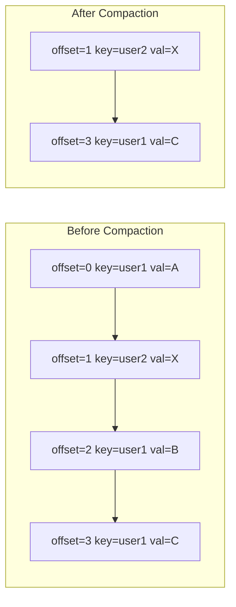

> **Cross Qs:**
> - *Can a topic have both `delete` and `compact` policies?* → Yes, `log.cleanup.policy=compact,delete` first compacts then deletes old segments.
> - *Are offsets reused after compaction?* → No. Offsets are permanent; compaction just removes intermediate records. The offset sequence has gaps.
> - *What is the "dirty ratio" in log compaction?* → Ratio of uncompacted (dirty) records to total. Compaction triggers when dirty ratio exceeds `min.cleanable.dirty.ratio`.

---

## 5. Message Anatomy

Each Kafka record (message) consists of:

| Field | Description |
|---|---|
| Key | Optional bytes. Used for partitioning and log compaction |
| Value | The payload — arbitrary bytes |
| Headers | Optional key-value metadata pairs |
| Timestamp | CreateTime (producer) or LogAppendTime (broker) |
| Offset | Assigned by broker upon append |
| Partition | Which partition the record belongs to |
| Topic | Topic name |

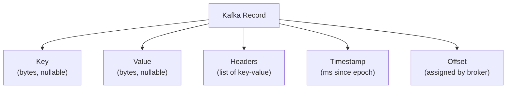

> **Cross Qs:**
> - *What happens when the key is null?* → Round-robin or sticky partitioner assigns partitions.
> - *Can Kafka messages be larger than 1 MB?* → Default `max.message.bytes` is 1 MB. Can be increased, but large messages hurt throughput. Better to use pointer pattern (store data in object store, send reference).
> - *What are Kafka headers used for?* → Metadata like tracing IDs, schema version, routing hints — without polluting the message value.

---

## 6. Producer Deep Dive

### Producer Lifecycle

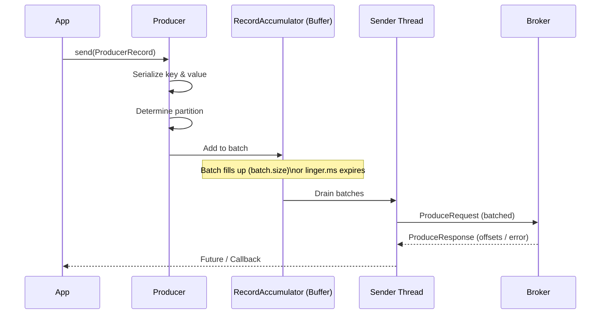

### Idempotent Producer

With `enable.idempotence=true`:
- Kafka assigns a **Producer ID (PID)** and **sequence number** to each batch
- Broker deduplicates retries using PID + sequence number
- Guarantees exactly-once delivery **within a single session**

### Transactional Producer

For exactly-once across multiple topics/partitions:
```
producer.initTransactions()
producer.beginTransaction()
producer.send(...)
producer.sendOffsetsToTransaction(offsets, consumerGroupId)
producer.commitTransaction()  // or abortTransaction()
```

> **Cross Qs:**
> - *What is the difference between idempotent and transactional producers?* → Idempotent prevents duplicate delivery to a single partition on retries; transactional allows atomic writes across multiple partitions and topics.
> - *What happens to a transaction if the producer crashes mid-transaction?* → The transaction times out (`transaction.timeout.ms`) and is aborted by the broker. Consumers with `isolation.level=read_committed` will not see the incomplete records.

---

## 7. Consumer Deep Dive

### Poll Loop

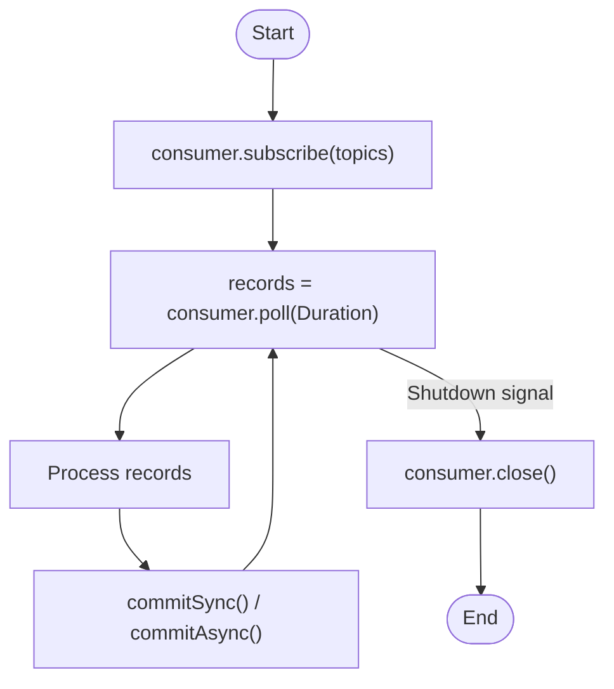

### Offset Commit Strategies

| Strategy | API | Risk | Use case |
|---|---|---|---|
| Auto commit | `enable.auto.commit=true` | At-least-once loss risk | Simple consumers |
| Manual sync commit | `commitSync()` | Blocks, slows throughput | High reliability |
| Manual async commit | `commitAsync()` | Non-blocking, can fail silently | High throughput |
| Per-record commit | `commitSync(Map<TopicPartition, OffsetAndMetadata>)` | Slowest | Exactly-once guarantees |

### Rebalance Listeners

```java
consumer.subscribe(topics, new ConsumerRebalanceListener() {
    onPartitionsRevoked(partitions)  // commit offsets before losing partitions
    onPartitionsAssigned(partitions) // reset state, seek offsets
});
```

> **Cross Qs:**
> - *What is the "at-least-once" trap with auto-commit?* → Consumer polls, processes records, but crashes before auto-commit fires. On restart, it re-reads and re-processes — delivering at-least-once.
> - *How do you achieve exactly-once in a consumer?* → Commit offset and business logic update atomically (e.g., in the same DB transaction), or use Kafka Streams with EOS enabled.
> - *What is a "zombie consumer"?* → A consumer that was kicked out of the group (poll timeout) but doesn't know it yet, and continues to process and commit — causing duplicate processing.

---

## 8. Kafka Streams

Kafka Streams is a **client-side library** (not a separate cluster) for building real-time stream processing applications.

| Feature | Detail |
|---|---|
| Library type | Embedded Java library |
| Input | Kafka topics |
| Output | Kafka topics |
| State | Local RocksDB + changelog topics |
| Exactly-once | Supported (EOS) |
| Scaling | Add more instances of the app |

### DSL Concepts

| Concept | Description |
|---|---|
| `KStream` | Unbounded stream of records (event log semantics) |
| `KTable` | Changelog stream — latest value per key (table semantics) |
| `GlobalKTable` | Like KTable but replicated to all instances (for joins without repartitioning) |
| `filter()` | Keep records matching predicate |
| `map()` | Transform each record |
| `groupByKey()` | Group by existing key |
| `aggregate()` | Stateful aggregation per key/window |
| `join()` | Join KStream with KStream/KTable/GlobalKTable |
| `windowing` | Tumbling, Hopping, Sliding, Session windows |

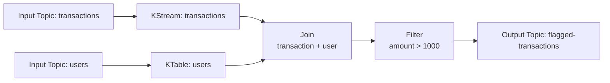

> **Cross Qs:**
> - *What is the difference between KStream and KTable?* → KStream is an event log (each record is independent); KTable is a materialized view (each new record for a key overwrites the previous).
> - *What is a state store in Kafka Streams?* → Local RocksDB storage for stateful operations (aggregations, joins). Backed by a changelog Kafka topic for fault tolerance.
> - *What happens when a Kafka Streams instance crashes?* → Partitions are reassigned to another instance; state is restored from the changelog topic.
> - *What is interactive queries in Kafka Streams?* → Ability to query local state stores directly via an API — turns Kafka Streams into a queryable distributed database.

---

## 9. Kafka Connect

Kafka Connect is a framework for **streaming data between Kafka and external systems** without writing custom code.

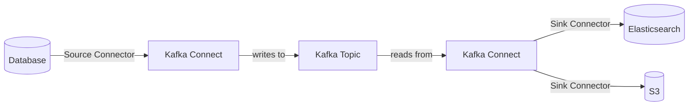

| Component | Description |
|---|---|
| Source Connector | Pulls data from external system into Kafka |
| Sink Connector | Pushes data from Kafka into external system |
| Worker | JVM process that runs connectors |
| Task | Unit of parallelism within a connector |
| Converter | Serializes/deserializes data (JSON, Avro, Protobuf) |
| Transforms (SMT) | Single Message Transforms — lightweight in-flight transformations |

> **Cross Qs:**
> - *What is the difference between a standalone and distributed Connect worker?* → Standalone: single process, config stored locally; Distributed: multiple workers, config stored in Kafka topics, fault-tolerant.
> - *What is Debezium?* → A popular open-source CDC (Change Data Capture) source connector that captures database changes (INSERT/UPDATE/DELETE) from MySQL, Postgres, Oracle etc. and streams them to Kafka.
> - *What are SMTs limited to?* → Simple stateless per-record transformations. For complex logic, use Kafka Streams or KSQL.

---

## 10. Schema Registry

Schema Registry is a **separate service** (usually Confluent) that stores Avro/Protobuf/JSON Schema definitions.

```mermaid
sequenceDiagram
    participant P as Producer
    participant SR as Schema Registry
    participant K as Kafka Broker
    participant C as Consumer

    P->>SR: Register schema / get schema ID
    SR-->>P: Schema ID
    P->>K: Send [magic byte | schema ID | avro bytes]
    C->>K: Fetch record
    K-->>C: [magic byte | schema ID | avro bytes]
    C->>SR: Fetch schema by ID
    SR-->>C: Schema
    C->>C: Deserialize with schema
```

**Compatibility modes:**
| Mode | Meaning |
|---|---|
| `BACKWARD` | New schema can read data written with old schema |
| `FORWARD` | Old schema can read data written with new schema |
| `FULL` | Both backward and forward compatible |
| `NONE` | No compatibility checks |

> **Cross Qs:**
> - *Why use Schema Registry instead of embedding schema in every message?* → Saves space (schema ID = 4 bytes vs. full schema), enforces contracts, enables schema evolution.
> - *What happens if a producer pushes an incompatible schema?* → Schema Registry rejects the schema registration, and the producer gets an error before any data is sent.

---

## 11. Delivery Guarantees

| Guarantee | Description | How |
|---|---|---|
| **At-most-once** | Messages may be lost, never duplicated | `acks=0`, no retries, auto-commit before processing |
| **At-least-once** | Messages never lost, may be duplicated | `acks=all`, retries enabled, commit after processing |
| **Exactly-once (EOS)** | Never lost, never duplicated | Idempotent producer + transactions + `read_committed` isolation |

```mermaid
graph TD
    EOS["Exactly-Once Semantics (EOS)"]
    EOS --> IP["Idempotent Producer\n(enable.idempotence=true)"]
    EOS --> TX["Transactions\n(transactional.id set)"]
    EOS --> RC["Consumer isolation.level\n= read_committed"]
    EOS --> KS["OR: Kafka Streams\n(processing.guarantee=exactly_once_v2)"]
```

> **Cross Qs:**
> - *Is exactly-once truly possible in distributed systems?* → Within Kafka's boundaries (producer → broker → consumer), yes. End-to-end (including external sinks) requires idempotent sinks or two-phase commit.
> - *What is `read_committed` vs `read_uncommitted`?* → `read_committed`: consumers only see records from committed transactions. `read_uncommitted` (default): consumers see all records including aborted ones.

---

## 12. Performance & Tuning

### Producer Tuning
| Goal | Config |
|---|---|
| Higher throughput | Increase `batch.size`, add `linger.ms=5–20`, enable compression |
| Lower latency | `linger.ms=0`, smaller batches |
| Reliability | `acks=all`, `enable.idempotence=true`, `min.insync.replicas=2` |

### Consumer Tuning
| Goal | Config |
|---|---|
| Higher throughput | Increase `fetch.min.bytes`, `max.poll.records` |
| Lower latency | `fetch.max.wait.ms=0`, smaller `fetch.min.bytes` |
| Avoid rebalance | Tune `session.timeout.ms`, `max.poll.interval.ms`, use `CooperativeStickyAssignor` |

### Broker Tuning
| Config | Recommendation |
|---|---|
| `num.partitions` | Higher for more parallelism |
| `log.flush.interval.messages` | OS page cache flush — leave to OS for best throughput |
| `replica.fetch.max.bytes` | Match with `message.max.bytes` |
| `num.replica.fetchers` | Increase for faster replication |

> **Cross Qs:**
> - *Why is Kafka so fast?* → Sequential disk I/O (append-only log), zero-copy transfer (`sendfile` syscall), batching, compression, page cache usage.
> - *What is zero-copy in Kafka?* → Data is transferred from disk to network via OS `sendfile()` — bypasses user-space, reducing CPU and memory overhead.
> - *What is page cache?* → OS-level memory caching of disk blocks. Kafka relies heavily on it — recent data is usually served from memory, not disk.

---

## 13. Common Interview Cross-Questions

### Architecture & Design
- How does Kafka differ from a traditional database?
- When would you choose Kafka over RabbitMQ? Over Kinesis?
- How do you handle schema evolution in Kafka?
- What is the role of the `__consumer_offsets` topic?
- How does Kafka handle backpressure?
- What is a "hot partition" and how do you fix it?

### Reliability & Consistency
- How do you guarantee no message loss in Kafka?
- Explain the CAP theorem implications for Kafka.
- What can cause duplicate message processing in Kafka?
- What is "split-brain" in Kafka and how is it prevented?

### Operations
- How do you monitor Kafka in production? (JMX metrics, consumer lag)
- What is consumer lag and how do you detect/fix it?
- How do you handle a broker failure gracefully?
- How do you migrate a topic to more partitions safely?
- What is preferred leader election?

### Kafka Streams / Advanced
- Explain the difference between stream processing and batch processing.
- How does Kafka Streams handle late-arriving data?
- What is a grace period in windowing?
- How do you do a join between two KStreams?
- What is KSQL / ksqlDB?

---

*Notes last updated: 2026-04-28*
