# Azure Data Factory (ADF) - Comprehensive Notes

## 1. What is Azure Data Factory?

Azure Data Factory (ADF) is a cloud-native data integration and orchestration service on Microsoft Azure used to build, schedule, and monitor ETL/ELT data pipelines.

In simple terms:
- ETL: Extract, Transform, Load (transform before loading).
- ELT: Extract, Load, Transform (load first, transform in target system such as Synapse/Spark/SQL).

ADF is not a traditional compute-heavy transformation engine by itself. It orchestrates data movement and execution across compute services (Azure Databricks, Synapse, SQL, HDInsight, etc.) and can do code-free transformations using Mapping Data Flows (Spark under the hood).

## 2. Why use ADF?

- Build data pipelines with low-code UI and JSON-backed artifacts.
- Connect to many on-prem and cloud sources using built-in connectors.
- Run scheduled, event-based, or tumbling-window workflows.
- Support hybrid integration using Self-hosted Integration Runtime (SHIR).
- Scale data movement and orchestration with managed service capabilities.
- Enterprise features: monitoring, CI/CD, parameterization, governance integration, security controls.

## 3. Core Architecture (High-Level)

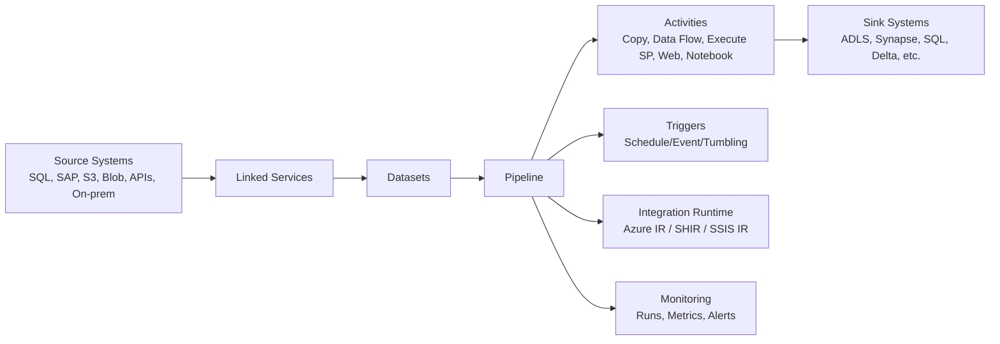

## 4. Important Terminologies and Definitions

## 4.1 Factory
- The top-level ADF resource in Azure.
- Contains all artifacts: pipelines, datasets, linked services, triggers, IRs, data flows.

## 4.2 Pipeline
- A logical grouping of activities that together perform a task.
- Example: ingest files from SFTP to ADLS, then run transformation, then load into SQL.

## 4.3 Activity
- A single step in a pipeline.
- Categories:
  - Data movement: `Copy Activity`
  - Data transformation: `Data Flow`, `Databricks`, `Stored Procedure`, `HDInsight`, etc.
  - Control activities: `If Condition`, `ForEach`, `Until`, `Wait`, `Set Variable`, `Web`, etc.

## 4.4 Dataset
- Named view/structure of data within a data store.
- Points to data location and schema-like metadata.
- Uses linked service for connection info.

## 4.5 Linked Service
- Connection definition to external resource.
- Similar to a connection string wrapper with authentication details.
- Example: Azure SQL linked service, ADLS Gen2 linked service, SFTP linked service.

## 4.6 Integration Runtime (IR)
- Compute infrastructure used by ADF to provide data integration capabilities.
- Types:
  - Azure Integration Runtime: managed by Microsoft, cloud data movement and external compute dispatch.
  - Self-hosted Integration Runtime: installed on VM/on-prem server for private network/on-prem connectivity.
  - Azure-SSIS Integration Runtime: managed cluster to run SSIS packages.

## 4.7 Trigger
- Mechanism to start pipeline execution.
- Types:
  - Schedule Trigger: cron/time-based.
  - Tumbling Window Trigger: fixed windows, stateful, dependency handling.
  - Event Trigger: event-driven (example: Blob file arrival via Event Grid).

## 4.8 Mapping Data Flow
- Visual transformation design in ADF (Spark-based execution).
- Useful for joins, derived columns, filters, aggregations, slowly changing dimension logic, schema drift handling.

## 4.9 Pipeline Parameters vs Variables
- Parameters:
  - Input values passed to pipeline at run time.
  - Immutable inside pipeline.
- Variables:
  - Mutable values during pipeline execution.
  - Useful for loop counters, states, dynamic control logic.

## 4.10 Expressions and Dynamic Content
- ADF uses expression language (e.g., `@pipeline().parameters.pDate`, `@utcNow()`, `@concat(...)`).
- Enables metadata-driven and reusable pipelines.

## 4.11 Debug Run vs Trigger Run
- Debug: ad-hoc test execution from authoring UI.
- Trigger run: production/scheduled/event-based execution.

## 4.12 ARM Templates / Git Mode
- ADF supports source-controlled development with Git integration.
- Publishing generates ARM templates (or modern deployment workflows) used in CI/CD pipelines.

## 5. End-to-End Lifecycle in ADF

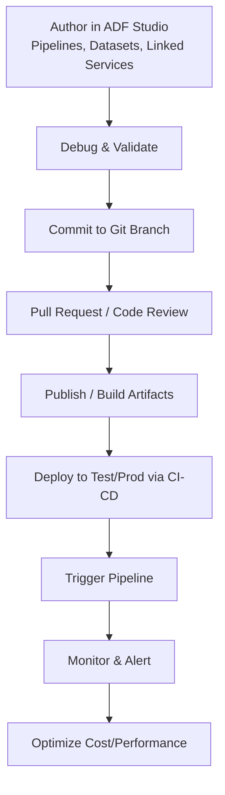

## 6. Core Building Blocks in Detail

## 6.1 Linked Services (Connection Layer)
- Store endpoint, auth type, and optional runtime specifics.
- Authentication options vary by connector:
  - Managed Identity (preferred for Azure-to-Azure).
  - Service Principal.
  - Account key/SAS/token.
  - Basic credentials (where required).
- Best practice: keep secrets in Azure Key Vault and reference them.

## 6.2 Datasets (Data Shape/Location Layer)
- Dataset usually references:
  - Linked service
  - File path/table name/query
  - Optional schema
  - Format settings (CSV, JSON, Parquet, Delta, Avro, etc.)

## 6.3 Pipelines and Activities (Execution Layer)
- Data Movement:
  - `Copy Activity` supports many connectors and format conversions.
- Transformation:
  - Mapping Data Flow
  - Execute Databricks Notebook/JAR/Python
  - Stored Procedure
  - Synapse notebook/script activity
- Orchestration/Control:
  - `Lookup`, `Get Metadata`, `ForEach`, `Until`, `If`, `Switch`, `Execute Pipeline`, `Web`, `Wait`, `Fail`

## 6.4 Integration Runtime (Compute/Connectivity Layer)
- Azure IR for cloud-native movement.
- SHIR for private network and on-prem access.
- SSIS IR for lift-and-shift SSIS workloads.

## 7. Control Flow Patterns You Must Know

## 7.1 Sequential Orchestration
- Run activities in order using success/dependency conditions.

## 7.2 Parallel Branching
- Multiple branches run concurrently to reduce total pipeline duration.

## 7.3 Metadata-Driven Pipelines
- Store source/target metadata in table/config file.
- Use `Lookup + ForEach + dynamic expressions` to process many entities with one generic pipeline.

## 7.4 Parent-Child Pipelines
- Parent pipeline calls child pipeline via `Execute Pipeline`.
- Reusable architecture for enterprise projects.

## 7.5 Incremental Loading
- Use watermark column (last modified date/id).
- Store last successful watermark; process only new/changed records.

## 7.6 SCD Handling
- Use Mapping Data Flow or SQL merge logic.
- SCD Type 1: overwrite changes.
- SCD Type 2: preserve history with effective dates/current flag.

## 8. Data Movement with Copy Activity

Key capabilities:
- Source to sink copy across heterogeneous systems.
- Supports partitioning and parallel copy for performance.
- Built-in type mapping and fault tolerance options.
- Binary copy for file-level migration.

Key settings to know:
- `Source` query/partition option
- `Sink` write behavior (insert/upsert if supported)
- `Staging` (for some connectors)
- `Fault tolerance` (skip incompatible rows/files)
- `Performance` options (DIUs, parallel copies)

## 9. Mapping Data Flows (Transformation)

Typical transformations:
- Source
- Select / Projection
- Derived Column
- Filter
- Join / Lookup / Exists
- Aggregate / Window
- Conditional Split
- Sink

Important concepts:
- Debug cluster and data preview.
- Schema drift support.
- Broadcast join optimization for small dimension tables.
- Partitioning strategy impacts performance.

## 10. Triggers and Scheduling Strategy

## 10.1 Schedule Trigger
- Time-based recurring schedule.

## 10.2 Tumbling Window Trigger
- Fixed-size contiguous windows.
- Supports dependency and backfill scenarios.

## 10.3 Event Trigger
- Runs on events such as blob file creation.
- Near real-time ingestion orchestration.

Backfill approach:
- Prefer parameterized pipelines.
- Run historical date ranges through loop or tumbling windows.

## 11. Monitoring, Alerting, and Troubleshooting

Monitor levels:
- Pipeline runs
- Activity runs
- Trigger runs
- Integration runtime health

Common failure categories:
- Authentication/authorization errors.
- Network/firewall/private endpoint issues.
- Schema/type mismatch.
- Timeout or throttling.
- Bad dynamic expression/path.

Troubleshooting checklist:
1. Identify exact failing activity and error code.
2. Validate linked service connectivity and credentials.
3. Check source/sink schema drift or datatype mismatch.
4. Review activity payload and dynamic expression output.
5. Verify IR capacity/network route.
6. Re-run with debug and narrowed test dataset.

## 12. Security and Governance

Security best practices:
- Use Managed Identity wherever possible.
- Store secrets in Azure Key Vault, not hardcoded in JSON.
- Apply least privilege RBAC.
- Restrict public access using private endpoints/VNet integration where required.

Governance practices:
- Naming conventions for all artifacts.
- Tag resources by environment, owner, and cost center.
- Use folders and modular pipelines for maintainability.
- Enable logging/diagnostics and retention policies.

## 13. CI/CD and Environment Promotion

Common approach:
1. Develop in Git branch.
2. Merge to collaboration branch.
3. Publish/build artifacts.
4. Deploy to higher environments with environment-specific parameters.

What to parameterize by environment:
- Linked service endpoints
- Database names
- File paths/container names
- Compute settings
- Feature flags

Tip:
- Use global parameters and ARM/Bicep/YAML variable substitution patterns consistently.

## 14. Performance and Cost Optimization

Performance:
- Use partitioned reads for large sources.
- Tune copy parallelism and DIUs.
- Push down queries/filters to source when possible.
- Choose efficient formats (Parquet/Delta) over raw CSV for analytics.
- Optimize data flow joins and partitioning.

Cost:
- Stop unused debug clusters.
- Use event-driven over over-frequent polling where possible.
- Consolidate small files to avoid file explosion.
- Balance trigger frequency and SLA requirements.
- Monitor activity-level cost contributors regularly.

## 15. ADF vs Other Azure/Fabric Options (Interview Favorite)

- ADF vs Synapse Pipelines:
  - Very similar orchestration experience; Synapse ties orchestration with analytics workspace features.
- ADF vs Databricks Jobs:
  - ADF excels in orchestration/connectors; Databricks excels in code-first data engineering and advanced Spark processing.
- ADF vs Fabric Data Factory experiences:
  - Fabric offers integrated SaaS analytics ecosystem; ADF remains core Azure PaaS orchestrator in many enterprises.

## 16. Real-World Design Patterns

## 16.1 Bronze-Silver-Gold Orchestration
- Bronze: raw ingestion.
- Silver: cleaned/conformed.
- Gold: curated serving layer.
- ADF orchestrates movement and transformations across layers.

## 16.2 CDC + Incremental Merge
- Capture changed rows via timestamp/version/watermark.
- Copy only deltas.
- Merge into target using stored procedure/Data Flow.

## 16.3 File Arrival Trigger + Validation
- Event trigger on landing zone.
- Validate file name/schema/record count.
- Move to quarantine on validation failure.

## 16.4 Metadata-Driven Multi-Table Ingestion
- Config table drives source query, sink path, load type, watermark.
- Single generic pipeline processes dozens/hundreds of tables.

## 17. Frequently Asked Interview Questions (With Crisp Answers)

## 17.1 Fundamentals
1. What is ADF?
	- Azure cloud service for data integration and workflow orchestration for ETL/ELT.

2. Difference between pipeline and activity?
	- Pipeline is a workflow container; activity is a single executable step.

3. What is linked service?
	- Connection information to a data store/compute service.

4. What is dataset?
	- Structured reference to data (table/file/path) used by activities.

5. What is Integration Runtime?
	- Runtime backbone enabling data movement, transformation dispatch, and connectivity.

## 17.2 Intermediate
6. Parameter vs variable in ADF?
	- Parameter is input and immutable at run time; variable is mutable during execution.

7. Schedule trigger vs tumbling window trigger?
	- Schedule is time-based recurrence; tumbling window is fixed stateful windows with dependency handling.

8. How do you load incrementally?
	- Track watermark (date/id), fetch only changed data, update watermark after success.

9. How to connect on-prem source to ADF?
	- Install Self-hosted IR in on-prem/private network and route connectors through it.

10. How do you secure secrets?
	- Store in Key Vault and reference from linked services.

## 17.3 Advanced/Scenario
11. How do you design reusable enterprise pipelines?
	- Metadata-driven design, parameterization, parent-child pipelines, standardized error handling.

12. How do you handle failures and reruns?
	- Use retry policies, idempotent writes, checkpoints/watermarks, and rerun from failed activity/window.

13. Copy Activity vs Mapping Data Flow?
	- Copy is for movement and light transformation; Data Flow is for Spark-based complex transformations.

14. How to optimize ADF performance?
	- Partition reads, tune parallelism/DIUs, pushdown filters, optimize sink formats, avoid unnecessary orchestration overhead.

15. How to implement CI/CD for ADF?
	- Git integration, publish/build artifacts, release pipeline with environment-specific parameter overrides.

## 17.4 Troubleshooting Questions
16. Pipeline succeeds but target data is missing. What checks?
	- Sink path/table mapping, pre/post copy scripts, filters, late-arriving data logic, overwrite settings.

17. Why would SHIR become bottlenecked?
	- Insufficient CPU/memory/network, too many concurrent jobs, poor scaling, network latency.

18. How to handle schema drift in file ingestion?
	- Enable schema drift in Data Flow, dynamic column mapping, schema validation rules, and quarantine flow.

19. How do you prevent duplicate loads?
	- Use natural/business keys + merge logic, idempotent processing, watermark checkpoints.

20. What logging/monitoring would you implement for production?
	- Central run logs, activity error details, custom business metrics, alerts, SLA dashboards.

## 18. Common Mistakes to Avoid

- Hardcoding environment values (paths/server names) in pipelines.
- Overusing one giant pipeline instead of modular reusable components.
- Missing retry/idempotency design.
- Ignoring SHIR capacity planning.
- Not implementing proper watermark management.
- Weak naming conventions and poor folder organization.

## 19. Naming Convention Example

- Pipelines: `pl_<domain>_<process>_<frequency>`
- Datasets: `ds_<source_or_sink>_<entity>_<format>`
- Linked services: `ls_<system>_<auth_type>`
- Triggers: `tr_<pipeline>_<type>`
- Data flows: `df_<domain>_<purpose>`

Example:
- `pl_sales_orders_incremental_daily`
- `ls_sqlserver_mi`
- `ds_adls_orders_parquet`

## 20. Quick Revision Sheet

- ADF = orchestration + data movement + managed integration.
- Core artifacts = Pipeline, Activity, Dataset, Linked Service, Trigger, IR.
- IR types = Azure IR, SHIR, SSIS IR.
- Must-know patterns = incremental load, metadata-driven, parent-child, event-driven.
- Security = Managed Identity + Key Vault + RBAC.
- Production readiness = CI/CD + monitoring + retries + idempotency + cost tuning.

## 21. Short Glossary (One-Liners)

- ETL: Transform before loading.
- ELT: Transform after loading.
- Orchestration: Coordinating multiple data tasks in sequence/parallel.
- Watermark: Last processed marker for incremental load.
- Idempotent: Re-run does not duplicate/corrupt data.
- Schema Drift: Source schema changes over time.
- Backfill: Loading historical data ranges.
- SLA: Expected pipeline completion/availability target.

## 22. Practice Exercise Ideas

1. Build a metadata-driven pipeline to ingest 5 SQL tables incrementally to ADLS.
2. Add event trigger for file arrival and validation + quarantine branch.
3. Implement parent-child pipeline framework with centralized error logging.
4. Add CI/CD with dev-test-prod parameterization.

## 23. Interview Closing Tips

- Explain trade-offs, not just definitions.
- Mention security and operational reliability in architecture answers.
- Show how you handle reruns, late-arriving data, and schema changes.
- Highlight measurable outcomes (cost savings, runtime reduction, reliability improvement).

## 24. In-Depth Topic Notes with Practical Examples

## 24.1 Copy Activity In Depth

When to use:
- Fast movement from source to sink.
- Light transformation only (column mapping, type conversion, flattening in specific connectors).

When not to use:
- Complex business rules (multi-join, dedup rules, advanced window logic). Use Mapping Data Flow, Databricks, or SQL transformations.

Performance levers:
- Parallel copy
- Data Integration Units (DIUs)
- Partition option at source
- Staged copy for certain sinks

Example scenario:
- Source: Azure SQL table with 500 million rows.
- Sink: ADLS Gen2 in Parquet.
- Approach: Partition source by date column, use parallel copies, write compressed parquet.

Example source query pattern:

```sql
SELECT *
FROM sales.orders
WHERE last_modified_utc >= @start_utc
  AND last_modified_utc < @end_utc;
```

Why this works:
- Reduces volume with predicate pushdown.
- Aligns with incremental load windows.

## 24.2 Dynamic Content and Expression Language In Depth

Common expressions:
- Current UTC: `@utcNow()`
- Parameter access: `@pipeline().parameters.pEntity`
- Build path: `@concat('bronze/', pipeline().parameters.pEntity, '/', formatDateTime(utcNow(),'yyyy/MM/dd'))`
- Null-safe fallback: `@coalesce(activity('Lookup_Config').output.firstRow.target_table, 'unknown_target')`

Example dynamic sink path:

```text
@concat('raw/', pipeline().parameters.pSourceSystem, '/', pipeline().parameters.pEntity, '/dt=', formatDateTime(pipeline().parameters.pProcessDate,'yyyy-MM-dd'), '/')
```

Practical tip:
- Use consistent date folder style in all pipelines to simplify downstream partition pruning.

## 24.3 Metadata-Driven Ingestion Framework (Enterprise Pattern)

## 24.4 If Condition Activity - Comprehensive Guide

### 24.4.1 Definition and Purpose

**If Condition Activity** is a control flow activity in Azure Data Factory that allows conditional branching in a pipeline based on the evaluation of a boolean expression. It works similar to an IF-ELSE statement in programming languages.

**Purpose:**
- Execute different sets of activities based on runtime conditions
- Implement business logic and decision-making in data pipelines
- Handle different scenarios dynamically (success/failure paths, data validation results, environment-specific logic)
- Create flexible, adaptive pipelines that respond to data characteristics or metadata

**Category:** Control Flow Activity

### 24.4.2 How It Works

The If Condition activity evaluates a boolean expression and:
- **If TRUE**: Executes activities in the `ifTrueActivities` branch
- **If FALSE**: Executes activities in the `ifFalseActivities` branch (optional)

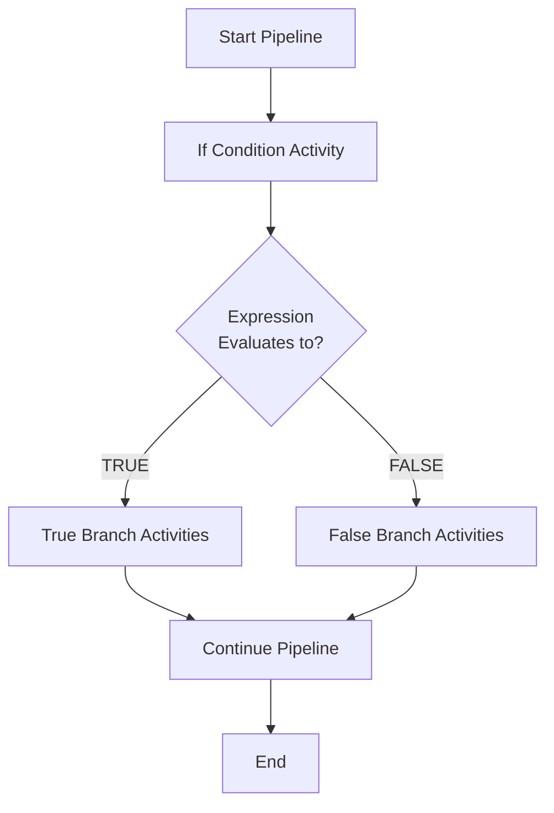

### 24.4.3 Configuration and Settings

**Key Configuration Elements:**

1. **Expression (Required):**
   - Must evaluate to boolean (true/false)
   - Uses ADF expression language
   - Can reference pipeline parameters, variables, activity outputs

2. **ifTrueActivities:**
   - Array of activities to execute when condition is TRUE
   - Can contain any valid ADF activities (Copy, Set Variable, Execute Pipeline, etc.)

3. **ifFalseActivities:**
   - Array of activities to execute when condition is FALSE
   - Optional (can be empty)

**Expression Examples:**

```javascript
// Simple parameter check
@equals(pipeline().parameters.pEnvironment, 'PROD')

// Check activity output
@equals(activity('Lookup_Config').output.firstRow.IsActive, 1)

// File count validation
@greater(activity('GetMetadata_Files').output.childItems.length(), 0)

// Date comparison
@greaterOrEquals(pipeline().parameters.pProcessDate, '2024-01-01')

// String contains check
@contains(pipeline().parameters.pFileName, 'customer')

// Complex condition with AND/OR
@and(
    equals(pipeline().parameters.pEnv, 'PROD'),
    greater(activity('GetFileCount').output.count, 0)
)

// NOT condition
@not(equals(variables('vIsProcessed'), true))
```

### 24.4.4 JSON Structure Example

```json
{
    "name": "If_FileExists",
    "type": "IfCondition",
    "dependsOn": [
        {
            "activity": "GetMetadata_CheckFile",
            "dependencyConditions": [
                "Succeeded"
            ]
        }
    ],
    "typeProperties": {
        "expression": {
            "value": "@activity('GetMetadata_CheckFile').output.exists",
            "type": "Expression"
        },
        "ifTrueActivities": [
            {
                "name": "Copy_ProcessFile",
                "type": "Copy",
                "inputs": [...],
                "outputs": [...]
            },
            {
                "name": "SetVariable_Success",
                "type": "SetVariable",
                "typeProperties": {
                    "variableName": "vStatus",
                    "value": "Completed"
                }
            }
        ],
        "ifFalseActivities": [
            {
                "name": "Web_SendAlert",
                "type": "WebActivity",
                "typeProperties": {
                    "url": "https://alert-endpoint.com",
                    "method": "POST",
                    "body": "File not found"
                }
            }
        ]
    }
}
```

### 24.4.5 Common Use Cases

**Use Case 1: Environment-Specific Processing**
- Condition: Check if environment is PROD vs DEV
- True: Use production connection strings and full data volume
- False: Use development/test connection strings and sample data

**Use Case 2: File Validation**
- Condition: Check if file exists and has records
- True: Process the file
- False: Send notification and skip processing

**Use Case 3: Incremental vs Full Load**
- Condition: Check watermark table for last run date
- True: Run incremental load
- False: Run full load (first-time execution)

**Use Case 4: Data Quality Check**
- Condition: Validate row count or schema
- True: Proceed with downstream processing
- False: Move file to quarantine and alert

**Use Case 5: Dynamic Sink Selection**
- Condition: Check data volume
- True (large volume): Write to partitioned Parquet
- False (small volume): Write to single CSV

**Use Case 6: Error Handling**
- Condition: Check previous activity success status
- True: Continue normal flow
- False: Execute recovery/cleanup activities

### 24.4.6 Practical Examples

**Example 1: Environment-Based Configuration**

```text
Pipeline Flow:
1. Get environment parameter
2. If Condition checks environment
3. If PROD: Use prod linked service
4. If DEV: Use dev linked service
```

Expression:
```javascript
@equals(pipeline().parameters.pEnvironment, 'PROD')
```

**Example 2: File Existence Check**

```text
Pipeline Flow:
1. Get Metadata - check if file exists
2. If Condition evaluates existence
3. If TRUE: Copy file to destination
4. If FALSE: Log error and send email alert
```

Expression:
```javascript
@activity('GetMetadata_SourceFile').output.exists
```

**Example 3: Row Count Validation**

```text
Pipeline Flow:
1. Lookup activity counts source rows
2. If Condition checks if count > 0
3. If TRUE: Proceed with Copy Activity
4. If FALSE: Set variable 'NoData' and skip copy
```

Expression:
```javascript
@greater(activity('Lookup_CountRows').output.firstRow.RowCount, 0)
```

**Example 4: Conditional Archiving**

```text
Pipeline Flow:
1. Get file last modified date via Get Metadata
2. If Condition checks if file is older than 30 days
3. If TRUE: Move to archive storage
4. If FALSE: Keep in active storage
```

Expression:
```javascript
@lessOrEquals(
    activity('GetMetadata_File').output.lastModified,
    addDays(utcNow(), -30)
)
```

### 24.4.7 Best Practices

1. **Keep Expressions Simple:**
   - Complex nested conditions are hard to debug
   - Consider using multiple If Condition activities for complex logic

2. **Use Descriptive Activity Names:**
   - `If_ValidFileExists` is better than `IfCondition1`
   - Helps in monitoring and troubleshooting

3. **Handle Both Branches:**
   - Even if False branch is empty, document why
   - Consider logging/notification in False branch

4. **Test Edge Cases:**
   - NULL values, empty strings, zero counts
   - Use `@coalesce()` for NULL handling

5. **Avoid Deep Nesting:**
   - If you need If inside If inside If, consider Switch activity or refactoring

6. **Use Variables for Readability:**
   - Set complex expressions in variables first
   - Then use simple variable check in If Condition

### 24.4.8 Limitations and Considerations

**Limitations:**
- Cannot return values directly (use Set Variable activity inside branches)
- No ELSE-IF construct (use Switch activity for multiple conditions)
- Expression must be boolean; cannot be NULL
- Limited to 40 activities per branch in UI (more in JSON)

**Performance Considerations:**
- If Condition itself is lightweight (minimal overhead)
- Performance depends on activities within branches
- Only the selected branch executes (other branch is skipped)

### 24.4.9 Debugging and Troubleshooting

**Common Issues:**

1. **Expression Evaluation Error**
   - Problem: Expression doesn't resolve to boolean
   - Solution: Test expression in Debug mode, check data types

2. **NULL Reference Errors**
   - Problem: Accessing property of NULL object
   - Solution: Use `@coalesce()` or check existence first

3. **Activity Not Found**
   - Problem: Referencing activity output before it executes
   - Solution: Check dependency chain with `dependsOn`

**Debugging Tips:**
- Use Set Variable activity to capture expression values
- Run in Debug mode and inspect activity outputs
- Add logging activities in both branches
- Check Monitor view for actual expression evaluation result

### 24.4.10 Interview Questions on If Condition Activity

**Q1: What is If Condition activity in ADF?**
**A:** If Condition is a control flow activity that enables conditional branching in pipelines by evaluating a boolean expression and executing different activity sets based on TRUE or FALSE result.

**Q2: Can you nest If Condition activities?**
**A:** Yes, you can nest If Condition activities within TRUE or FALSE branches, but it's generally better to use Switch activity or refactor logic for maintainability.

**Q3: What happens if the expression evaluates to NULL?**
**A:** The pipeline will fail because If Condition requires a boolean (true/false) value. Use `@coalesce()` or check for NULL explicitly.

**Q4: How do you handle multiple conditions (IF-ELSE-IF)?**
**A:** Use Switch activity for multiple mutually exclusive conditions, or chain multiple If Condition activities based on dependencies.

**Q5: Can you return values from If Condition activity?**
**A:** No, If Condition doesn't return values directly. Use Set Variable activity within TRUE/FALSE branches to store results.

**Q6: What's the difference between If Condition and Switch activity?**
**A:** If Condition handles binary (TRUE/FALSE) logic, while Switch activity handles multiple cases based on expression value (like CASE WHEN in SQL).

### 24.4.11 Scenario-Based Case Study: If Condition Activity

**Scenario:**
You're building a daily incremental pipeline that processes customer transaction files from SFTP. The requirement is:
- If file exists and has data → Process and archive
- If file doesn't exist → Send alert but don't fail pipeline
- If file exists but is empty → Log warning and skip processing

**Solution Design:**

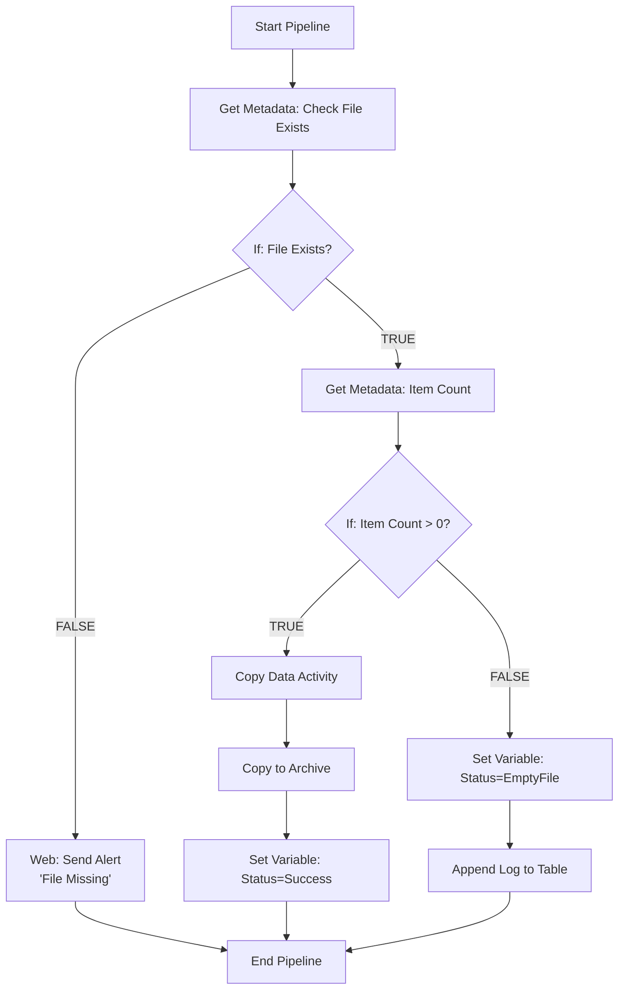

**Implementation:**

**Step 1: First If Condition (File Existence)**
```javascript
// Expression
@activity('GetMetadata_FileExists').output.exists

// True Branch: Get file item count
// False Branch: Send alert via Web activity
```

**Step 2: Second If Condition (Data Validation - nested in True branch)**
```javascript
// Expression
@greater(activity('GetMetadata_ItemCount').output.childItems.length(), 0)

// True Branch: Copy data + Archive
// False Branch: Log empty file warning
```

**Pipeline Parameters:**
- `pSourcePath`: SFTP file path
- `pFileName`: File name pattern
- `pProcessDate`: Business date for processing

**Variables:**
- `vProcessStatus`: Tracks pipeline outcome
- `vRecordCount`: Stores processed record count

**Benefits of This Design:**
1. **Graceful Handling:** Pipeline doesn't fail if file is missing
2. **Data Quality:** Validates file has content before processing
3. **Observability:** Different status codes for monitoring
4. **Idempotent:** Can rerun safely without duplicates
5. **Alerting:** Proactive notification on issues

**Expected Outcomes:**
- File exists with data → Status: Success, records processed
- File missing → Status: FileNotFound, alert sent
- File empty → Status: EmptyFile, warning logged

**Sample Interview Answer:**
"I implemented a robust file processing pipeline using nested If Condition activities. The first condition checks file existence to avoid failure on missing files. If the file exists, a second condition validates it has data before proceeding with costly Copy operations. Each path sets appropriate status variables and logs events, ensuring full observability. This pattern handles real-world scenarios gracefully without manual intervention."

---

## 24.5 For Each Activity - Comprehensive Guide

### 24.5.1 Definition and Purpose

**For Each Activity** is a control flow activity in Azure Data Factory that iterates over a collection (array) and executes a set of activities for each item in the collection. It works similar to a FOR loop or FOREACH loop in programming languages.

**Purpose:**
- Process multiple files, tables, or entities with a single pipeline definition
- Implement metadata-driven, dynamic, and parameterized pipelines
- Reduce pipeline duplication by iterating over configuration
- Enable parallel processing of independent items for performance optimization
- Build scalable, enterprise-grade data integration frameworks

**Category:** Control Flow Activity

### 24.5.2 How It Works

For Each activity takes an array as input and:
1. Iterates through each item in the array
2. Executes defined activities for each iteration
3. Can run iterations sequentially or in parallel
4. Passes current item value to activities via `@item()` expression

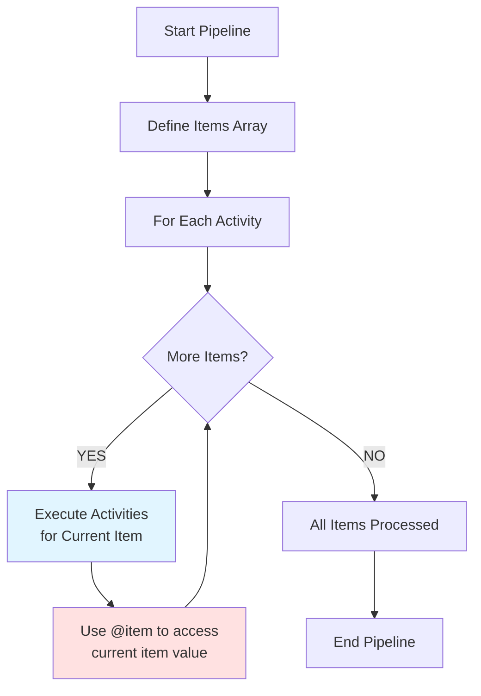

### 24.5.3 Configuration and Settings

**Key Configuration Elements:**

1. **Items (Required):**
   - Array to iterate over
   - Can be static or dynamic (from parameters, variables, activity outputs)
   - Must be valid JSON array

2. **Activities (Required):**
   - Set of activities to execute for each iteration
   - Can reference current item using `@item()` expression
   - Can include any ADF activities (Copy, Set Variable, Execute Pipeline, etc.)

3. **Sequential (Optional):**
   - `false` (default): Runs iterations in parallel
   - `true`: Runs iterations one at a time (sequential)

4. **Batch Count (Optional - when Sequential = false):**
   - Controls parallelism level
   - Default: 20
   - Range: 1 to 50
   - Determines how many iterations run concurrently

**Items Array Examples:**

```javascript
// Static array
["Sales", "Marketing", "Finance", "HR"]

// From pipeline parameter
@pipeline().parameters.pTableList

// From Lookup activity output
@activity('Lookup_ConfigTable').output.value

// From Get Metadata (file list)
@activity('GetMetadata_Folder').output.childItems

// Dynamic array from variable
@variables('vEntityList')

// Array of objects (complex items)
[
    {"table": "Customer", "schema": "dbo", "type": "incremental"},
    {"table": "Orders", "schema": "sales", "type": "full"}
]
```

**Accessing Current Item:**

```javascript
// Simple string item
@item()

// Object property access
@item().table
@item().schema
@item().watermarkColumn

// Use in dynamic expressions
@concat('SELECT * FROM ', item().schema, '.', item().table)

// Build file path
@concat('bronze/', item().entity, '/', formatDateTime(utcNow(),'yyyy/MM/dd'))
```

### 24.5.4 JSON Structure Example

```json
{
    "name": "ForEach_ProcessTables",
    "type": "ForEach",
    "dependsOn": [
        {
            "activity": "Lookup_GetTableList",
            "dependencyConditions": ["Succeeded"]
        }
    ],
    "typeProperties": {
        "items": {
            "value": "@activity('Lookup_GetTableList').output.value",
            "type": "Expression"
        },
        "isSequential": false,
        "batchCount": 10,
        "activities": [
            {
                "name": "Copy_TableData",
                "type": "Copy",
                "inputs": [
                    {
                        "referenceName": "ds_source_dynamic",
                        "type": "DatasetReference",
                        "parameters": {
                            "tableName": {
                                "value": "@item().TableName",
                                "type": "Expression"
                            }
                        }
                    }
                ],
                "outputs": [
                    {
                        "referenceName": "ds_sink_dynamic",
                        "type": "DatasetReference",
                        "parameters": {
                            "fileName": {
                                "value": "@concat(item().TableName, '.parquet')",
                                "type": "Expression"
                            }
                        }
                    }
                ]
            },
            {
                "name": "SetVariable_Status",
                "type": "SetVariable",
                "dependsOn": [
                    {
                        "activity": "Copy_TableData",
                        "dependencyConditions": ["Succeeded"]
                    }
                ],
                "typeProperties": {
                    "variableName": "vLastProcessedTable",
                    "value": {
                        "value": "@item().TableName",
                        "type": "Expression"
                    }
                }
            }
        ]
    }
}
```

### 24.5.5 Sequential vs Parallel Execution

**Sequential Mode (`isSequential: true`):**
- Items processed one at a time
- Order is guaranteed
- Slower overall execution
- Lower resource utilization
- Use when: order matters, resource constraints, dependencies between iterations

**Parallel Mode (`isSequential: false`):**
- Multiple items processed concurrently
- Order not guaranteed
- Faster overall execution (up to batch count limit)
- Higher resource utilization
- Use when: independent items, performance critical, scalable infrastructure

**Batch Count Impact:**

```text
Items: 100 tables
Batch Count: 20

Result: Maximum 20 tables processed simultaneously
- First 20 start immediately
- As each completes, next item starts
- Continues until all 100 are done

Total Time (approx):
Sequential: 100 items × 5 min/item = 500 minutes
Parallel (batch 20): (100 ÷ 20) × 5 min = 25 minutes
```

### 24.5.6 Common Use Cases

**Use Case 1: Metadata-Driven Multi-Table Ingestion**
- Store table configurations in SQL table or JSON
- Use Lookup to fetch table list
- For Each iterates and copies each table dynamically

**Use Case 2: File Processing from Folder**
- Get Metadata retrieves all files in folder
- For Each processes each file
- Moves processed files to archive

**Use Case 3: Multi-Environment Deployment**
- Define list of environments (DEV, TEST, PROD)
- For Each executes pipeline for each environment
- Uses environment-specific parameters

**Use Case 4: Partitioned Data Processing**
- Define date partitions (last 30 days)
- For Each processes each date partition
- Enables incremental backfill

**Use Case 5: Cross-System Orchestration**
- List of different source systems
- For Each connects to each system and extracts data
- Consolidates in central data lake

**Use Case 6: Dynamic Pipeline Execution**
- Configuration-driven child pipeline execution
- For Each calls Execute Pipeline activity
- Parent-child orchestration pattern

### 24.5.7 Practical Examples

**Example 1: Process Multiple Files**

```text
Pipeline Flow:
1. Get Metadata - list all files in folder
2. For Each file in childItems
3.   Copy file to destination
4.   Delete source file
```

Items Expression:
```javascript
@activity('GetMetadata_ListFiles').output.childItems
```

Item Usage in Copy Activity:
```javascript
// Source file name
@item().name

// Dynamic sink path
@concat('processed/', item().name)
```

**Example 2: Multi-Table Ingestion (Metadata-Driven)**

Configuration Table (SQL):
```sql
CREATE TABLE dbo.TableConfig (
    TableName NVARCHAR(100),
    SchemaName NVARCHAR(50),
    WatermarkColumn NVARCHAR(100),
    DestinationPath NVARCHAR(500)
);

INSERT INTO dbo.TableConfig VALUES
('Customer', 'dbo', 'ModifiedDate', 'bronze/customer'),
('Orders', 'sales', 'OrderDate', 'bronze/orders'),
('Products', 'production', 'UpdatedOn', 'bronze/products');
```

Pipeline Flow:
```text
1. Lookup - SELECT * FROM dbo.TableConfig
2. For Each item in Lookup output
3.   Copy Activity
      Source Query: SELECT * FROM @{item().SchemaName}.@{item().TableName}
      Sink Path: @{item().DestinationPath}
4.   Update watermark in control table
```

Items Expression:
```javascript
@activity('Lookup_TableConfig').output.value
```

Source Query Expression:
```javascript
@concat('SELECT * FROM ', item().SchemaName, '.', item().TableName, 
        ' WHERE ', item().WatermarkColumn, ' > ''', 
        pipeline().parameters.pLastWatermark, '''')
```

**Example 3: Process Date Range (Backfill)**

Define Array in Pipeline Parameter:
```json
[
    "2024-01-01",
    "2024-01-02",
    "2024-01-03",
    "2024-01-04",
    "2024-01-05"
]
```

Pipeline Flow:
```text
1. For Each date in parameter array
2.   Execute Pipeline 'pl_process_daily_data'
      Pass current date as parameter
3.   Log completion status
```

Item Usage:
```javascript
// Pass to child pipeline
@item()

// Build date-partitioned path
@concat('data/year=', formatDateTime(item(), 'yyyy'), 
        '/month=', formatDateTime(item(), 'MM'), 
        '/day=', formatDateTime(item(), 'dd'))
```

**Example 4: Complex Object Iteration**

Items Array (from Parameter):
```json
[
    {
        "entityName": "Customer",
        "sourceSystem": "CRM",
        "loadType": "incremental",
        "partitionColumn": "CreatedDate"
    },
    {
        "entityName": "Product",
        "sourceSystem": "ERP",
        "loadType": "full",
        "partitionColumn": null
    }
]
```

Access Properties:
```javascript
// Entity name
@item().entityName

// Load type
@item().loadType

// Conditional logic based on property
@if(equals(item().loadType, 'incremental'), 
    'incremental query', 
    'full load query')
```

### 24.5.8 Best Practices

1. **Use Parallel Execution When Possible:**
   - Set `isSequential: false` for independent items
   - Tune batch count based on infrastructure capacity

2. **Implement Proper Error Handling:**
   - For Each doesn't stop on single item failure by default
   - Use Try-Catch pattern with Execute Pipeline + If Condition
   - Log failures to control table for retry logic

3. **Monitor Batch Count:**
   - Don't exceed infrastructure limits
   - Monitor Integration Runtime capacity
   - Start conservative (batch 5-10) and tune upward

4. **Use Meaningful Item Values:**
   - Prefer objects over simple strings for complex scenarios
   - Include all necessary metadata in item definition

5. **Parameterize Datasets:**
   - Use dataset parameters to make them dynamic
   - Pass `@item()` values to dataset parameters

6. **Avoid Variable Writes in Parallel Mode:**
   - Variables are pipeline-scoped (race conditions)
   - If you need to aggregate, use sequential or separate logging pipeline

7. **Keep Iterations Independent:**
   - Don't rely on execution order in parallel mode
   - Each iteration should be self-contained

8. **Use Activity Logging:**
   - Add logging activities within For Each
   - Helps track progress and debug failures

### 24.5.9 Limitations and Considerations

**Limitations:**
- Maximum batch count: 50
- Cannot directly return aggregated results (use logging table pattern)
- Variable updates inside parallel For Each can cause race conditions
- No built-in retry for individual iterations (implement custom retry logic)
- Maximum 40 activities per For Each in UI (more in JSON)

**Performance Considerations:**
- Parallel execution provides significant speed improvement
- Integration Runtime capacity impacts parallel throughput
- Too high batch count can overwhelm target systems
- Monitor queue time and throttling

**Cost Considerations:**
- Activity executions multiply (100 items = 100× activity runs)
- Parallel execution increases DIU consumption
- Balance performance needs with cost constraints

### 24.5.10 Advanced Patterns

**Pattern 1: For Each with Retry Logic**

```text
Pipeline Flow:
1. For Each item
2.   Execute Pipeline 'pl_process_item'
3.   If pipeline fails
4.     Wait 5 minutes
5.     Retry up to 3 times
6.   Log final status
```

**Pattern 2: For Each with Conditional Processing**

```text
Pipeline Flow:
1. For Each item
2.   If Condition: Check item.loadType
3.     TRUE (incremental): Run incremental copy
4.     FALSE (full): Run full copy
5.   Update status table
```

**Pattern 3: Nested For Each (Use Sparingly)**

```text
Pipeline Flow:
1. For Each source system
2.   Lookup tables in system
3.   For Each table
4.     Copy table data
5.     Validate and log
```

**Pattern 4: For Each with Aggregation**

```text
Pipeline Flow:
1. For Each item
2.   Copy data
3.   Append row to audit table (via Stored Procedure)
4. After For Each completes
5.   Lookup summary from audit table
6.   Send completion report
```

### 24.5.11 Debugging and Troubleshooting

**Common Issues:**

1. **Items Expression Error**
   - Problem: Items doesn't evaluate to array
   - Solution: Check Lookup/Get Metadata output structure, use Debug mode

2. **Item Property Not Found**
   - Problem: `@item().PropertyName` fails
   - Solution: Verify array contains objects with expected properties

3. **Variable Race Condition**
   - Problem: Variable values inconsistent in parallel mode
   - Solution: Use sequential mode or logging table instead of variables

4. **Partial Failures**
   - Problem: Some items fail, others succeed, hard to track
   - Solution: Implement logging inside For Each, use audit table

5. **Performance Issues**
   - Problem: For Each takes too long
   - Solution: Enable parallel mode, tune batch count, optimize activities

**Debugging Tips:**
- Start with small item array (2-3 items) in Debug mode
- Check Monitor view for individual iteration details
- Add Set Variable or logging activities to inspect `@item()` values
- Use sequential mode for initial testing
- Verify dataset parameterization works correctly

### 24.5.12 Interview Questions on For Each Activity

**Q1: What is For Each activity in ADF?**
**A:** For Each is a control flow activity that iterates over an array and executes defined activities for each item, enabling dynamic and metadata-driven pipeline patterns.

**Q2: How do you access the current item in For Each loop?**
**A:** Use the `@item()` expression. For object arrays, access properties like `@item().propertyName`.

**Q3: What's the difference between sequential and parallel For Each?**
**A:** Sequential processes items one at a time in order; parallel processes multiple items concurrently (up to batch count), providing better performance but no guaranteed order.

**Q4: What's the default and maximum batch count?**
**A:** Default is 20, maximum is 50. Batch count controls how many iterations run in parallel.

**Q5: Can you update pipeline variables inside parallel For Each?**
**A:** Technically yes, but it's not recommended due to race conditions. Use sequential mode or write to external logging table instead.

**Q6: How do you handle errors in For Each iterations?**
**A:** Implement Try-Catch pattern using Execute Pipeline activity with If Condition to check success/failure, or use logging table to track iteration outcomes.

**Q7: What happens if one iteration fails in For Each?**
**A:** By default, For Each continues processing other items. The overall For Each activity status depends on all iterations completing.

**Q8: How do you get items array from external source?**
**A:** Use Lookup activity (for SQL queries) or Get Metadata activity (for file lists), then reference output in For Each items property.

**Q9: Can you nest For Each activities?**
**A:** Yes, but use with caution. Nested loops multiply execution count exponentially. Consider alternative patterns like flattening array or using Execute Pipeline.

**Q10: How do you optimize For Each performance?**
**A:** Enable parallel execution, tune batch count based on capacity, ensure iterations are independent, optimize activities within loop, monitor IR capacity.

### 24.5.13 Scenario-Based Case Study: For Each Activity

**Scenario:**
You work for a retail company that needs to ingest data from 50 different SQL Server tables daily into Azure Data Lake. Each table has different schemas, sizes, and watermark columns for incremental loading. The solution must be:
- Scalable (easy to add new tables)
- Performant (complete within 1-hour SLA)
- Maintainable (metadata-driven, not hardcoded)
- Observable (track success/failure per table)

**Solution Design: Metadata-Driven For Each Pattern**

**Step 1: Create Configuration Table**

```sql
CREATE TABLE dbo.IngestionConfig (
    ConfigID INT IDENTITY PRIMARY KEY,
    SourceSchema NVARCHAR(50),
    SourceTable NVARCHAR(100),
    WatermarkColumn NVARCHAR(100),
    DestinationPath NVARCHAR(500),
    LoadType NVARCHAR(20), -- 'Full' or 'Incremental'
    IsActive BIT,
    Priority INT -- For batching/ordering
);

INSERT INTO dbo.IngestionConfig VALUES
('sales', 'Orders', 'ModifiedDate', 'bronze/orders', 'Incremental', 1, 1),
('sales', 'OrderDetails', 'ModifiedDate', 'bronze/order_details', 'Incremental', 1, 1),
('production', 'Products', 'UpdatedDate', 'bronze/products', 'Incremental', 1, 2),
-- ... 47 more tables
```

**Step 2: Create Watermark Control Table**

```sql
CREATE TABLE dbo.WatermarkControl (
    TableName NVARCHAR(100) PRIMARY KEY,
    LastWatermark DATETIME,
    LastRunDate DATETIME,
    RowsCopied BIGINT
);
```

**Step 3: Pipeline Architecture**

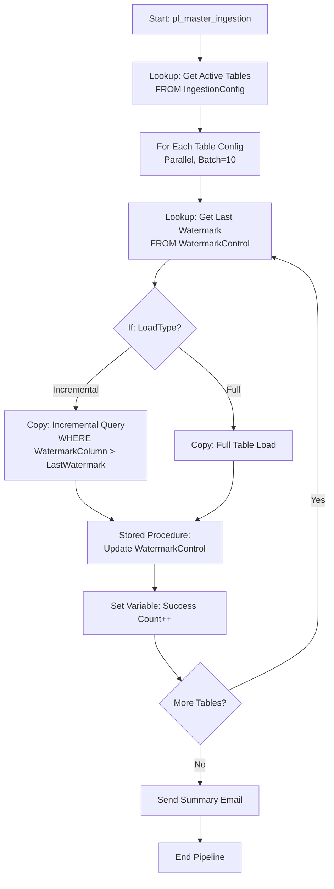

**Step 4: Implementation Details**

**Lookup Activity: Get Table List**
```sql
SELECT 
    SourceSchema,
    SourceTable,
    WatermarkColumn,
    DestinationPath,
    LoadType,
    Priority
FROM dbo.IngestionConfig
WHERE IsActive = 1
ORDER BY Priority;
```

**For Each Configuration:**
```json
{
    "items": "@activity('Lookup_GetTableList').output.value",
    "isSequential": false,
    "batchCount": 10
}
```

**Copy Activity Source Query (Incremental):**
```javascript
@concat(
    'SELECT * FROM ', item().SourceSchema, '.', item().SourceTable,
    ' WHERE ', item().WatermarkColumn, ' > ''',
    activity('Lookup_Watermark').output.firstRow.LastWatermark, ''' ',
    ' AND ', item().WatermarkColumn, ' <= ''',
    utcNow(), ''''
)
```

**Copy Activity Sink Path:**
```javascript
@concat(
    item().DestinationPath, 
    '/year=', formatDateTime(utcNow(), 'yyyy'),
    '/month=', formatDateTime(utcNow(), 'MM'),
    '/day=', formatDateTime(utcNow(), 'dd'),
    '/', item().SourceTable, '_',
    formatDateTime(utcNow(), 'yyyyMMddHHmmss'), '.parquet'
)
```

**Stored Procedure: Update Watermark**
```sql
CREATE PROCEDURE dbo.usp_UpdateWatermark
    @TableName NVARCHAR(100),
    @NewWatermark DATETIME,
    @RowsCopied BIGINT
AS
BEGIN
    MERGE dbo.WatermarkControl AS target
    USING (SELECT @TableName AS TableName) AS source
    ON target.TableName = source.TableName
    WHEN MATCHED THEN
        UPDATE SET 
            LastWatermark = @NewWatermark,
            LastRunDate = GETUTCDATE(),
            RowsCopied = @RowsCopied
    WHEN NOT MATCHED THEN
        INSERT (TableName, LastWatermark, LastRunDate, RowsCopied)
        VALUES (@TableName, @NewWatermark, GETUTCDATE(), @RowsCopied);
END;
```

**Step 5: Error Handling Enhancement**

Add within For Each:
```text
1. Try: Execute Pipeline 'pl_copy_single_table'
2. On Failure: 
   - Log error to ErrorLog table
   - Continue (don't fail entire pipeline)
3. On Success:
   - Update watermark
   - Increment success counter
```

**Step 6: Monitoring Dashboard**

Query for operational metrics:
```sql
-- Daily ingestion summary
SELECT 
    CAST(LastRunDate AS DATE) AS RunDate,
    COUNT(*) AS TablesProcessed,
    SUM(RowsCopied) AS TotalRows,
    MAX(LastRunDate) AS LastCompletedTime
FROM dbo.WatermarkControl
WHERE LastRunDate >= DATEADD(day, -7, GETUTCDATE())
GROUP BY CAST(LastRunDate AS DATE)
ORDER BY RunDate DESC;
```

**Benefits of This Solution:**

1. **Scalability:**
   - Add new table = 1 row insert in config table
   - No pipeline code changes needed
   - Supports hundreds of tables

2. **Performance:**
   - Parallel execution (batch 10)
   - Incremental loading reduces volume
   - Partition-aware writes to ADLS
   - SLA: 50 tables in ~30 minutes (assuming 5 min avg per table)

3. **Maintainability:**
   - Single pipeline definition
   - Configuration in SQL table (familiar to DBAs)
   - Easy to enable/disable tables
   - Clear separation of logic and config

4. **Observability:**
   - Watermark table tracks every run
   - Error logs for failures
   - Success counters
   - Enable ADF monitoring/alerts

5. **Reliability:**
   - Idempotent (rerun safe with watermarks)
   - Partial failure tolerance
   - Retry capability
   - Audit trail

**Sample Interview Answer:**

"I designed a metadata-driven ingestion framework using For Each activity to handle 50+ tables. The architecture uses a SQL configuration table storing source/sink mappings, watermark columns, and load types. A Lookup activity fetches active table configs, then For Each iterates with batch count 10 for parallel execution.

Inside the loop, each table is processed dynamically: Lookup retrieves last watermark, If Condition checks load type (full vs incremental), Copy activity uses dynamic source query and partitioned sink path, and finally a stored procedure updates watermark upon success.

This pattern achieves the 1-hour SLA, reduces duplicated pipeline code to zero, and makes adding new tables a configuration change rather than a development task. The watermark control table provides full observability and enables graceful reruns. The solution has been running in production for 6 months, processing over 2TB daily with 99.5% reliability."

---

## 24.6 Comparison: If Condition vs For Each vs Switch

| Aspect | If Condition | For Each | Switch |
|--------|-------------|----------|--------|
| **Purpose** | Binary decision (TRUE/FALSE) | Iterate over collection | Multiple cases based on value |
| **When to Use** | Simple yes/no branching | Process array of items | Multiple mutually exclusive conditions |
| **Expression Type** | Boolean | Array | String/Number |
| **Branches** | 2 (TRUE, FALSE) | N (one per item) | N + 1 (cases + default) |
| **Execution** | One branch only | All items (sequential or parallel) | One case only |
| **Typical Use Case** | Environment check, validation | File processing, multi-table load | Status-based routing |

**When to Choose:**
- **If Condition:** Binary decisions, simple validation gates
- **For Each:** Multiple similar items to process, metadata-driven patterns
- **Switch:** Multiple distinct logic paths based on status/type/category

Objective:
- One generic pipeline should ingest N tables with configuration-driven behavior.

Typical config table fields:
- source_system
- source_schema
- source_table
- load_type (full/incremental)
- watermark_column
- target_path
- is_active

Execution pattern:
1. `Lookup` active configs.
2. `ForEach` table config.
3. Build dynamic query/path using config.
4. Execute copy.
5. Update watermark log.

Mermaid view:

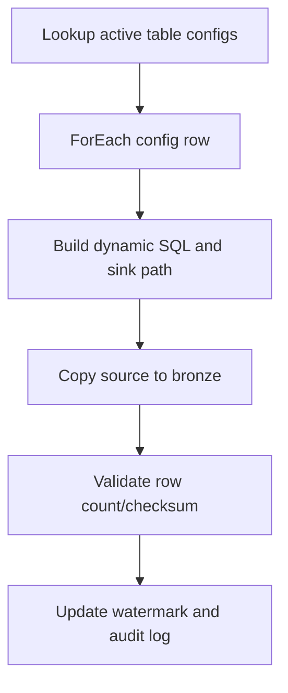

Interview value:
- Shows scalability mindset and reusable architecture design.

## 24.4 Incremental Load and Watermark Design

Core idea:
- Process only records with change marker greater than last successful marker.

Watermark tables (recommended):
- `etl_watermark_control`
  - entity_name
  - last_successful_watermark
  - last_run_utc
  - status

Pipeline steps:
1. Read last watermark from control table.
2. Query source using watermark filter.
3. Land to staging/bronze.
4. Merge/upsert to target.
5. Update control watermark only after successful commit.

Example source filter:

```sql
WHERE modified_utc > @last_watermark
  AND modified_utc <= @current_window_end
```

Important edge case:
- Late-arriving records with older timestamps.
- Mitigation: overlap window (reprocess last X minutes/hours) + deduplicate by business key + latest modified time.

## 24.5 Error Handling and Recovery Framework

Recommended model:
- Try-Catch-Finally style with activity dependencies.

Pattern:
1. Main processing branch.
2. On failure, route to logging activity.
3. Send notification (Logic App/Webhook/Email).
4. Mark run status in audit table.
5. Optional retry or dead-letter/quarantine path.

Mermaid view:

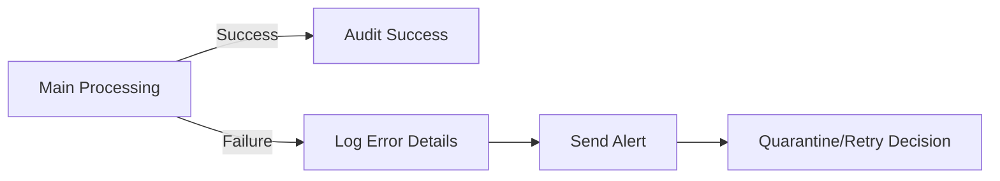

Must capture in logs:
- pipeline name
- activity name
- run id
- error code
- error message
- source entity
- process window

## 24.6 SCD Type 2 in ADF (Practical)

Target columns usually include:
- business_key
- attribute columns
- effective_from_utc
- effective_to_utc
- is_current
- hash_value (optional, for change detection)

Logic summary:
1. Compare incoming row hash/attributes with current row.
2. If changed, expire current row (`is_current=0`, set `effective_to_utc`).
3. Insert new row with `is_current=1` and new `effective_from_utc`.

Common pitfall:
- Duplicate current rows for same business key.
- Fix with unique filtered constraints or merge logic discipline.

## 24.7 SHIR (Self-Hosted IR) Deep Notes

Use SHIR when:
- Source/sink is in private network or on-prem.
- Direct cloud connectivity from Azure IR is not possible.

Best practices:
- Install on robust VM with monitored CPU/RAM/network.
- Prefer HA cluster mode with multiple SHIR nodes.
- Keep SHIR close to data source to reduce latency.
- Patch and rotate credentials regularly.

Common interview question:
- Why data loads are slow via SHIR?
  - Network throughput bottleneck.
  - Overloaded SHIR host.
  - Too many concurrent jobs.
  - Source query not optimized.

## 24.8 CI/CD Deep Notes (Branch to Production)

Recommended flow:
1. Feature branch development.
2. PR validation.
3. Publish/build artifact.
4. Release pipeline to test/prod.
5. Environment parameter override.

What should never be hardcoded:
- server names
- Key Vault URLs
- database names
- container paths
- trigger schedules (when env-specific)

Production promotion checklist:
- Trigger stop before deployment.
- Deploy artifacts.
- Validate linked services/datasets.
- Start triggers.
- Execute smoke test pipeline.

## 25. Scenario-Based Case Studies with Sample Answers

## 25.1 Case Study: Daily Incremental SQL to ADLS and Synapse

Scenario:
- A retail company needs daily incremental load from Azure SQL OLTP to ADLS bronze and then Synapse serving table.

Challenges:
- Large volume (100M+ rows).
- Strict SLA (finish before 6:00 AM).
- No duplicates allowed.

Solution design:
- Parameterized parent pipeline per entity.
- Watermark-based copy to ADLS parquet.
- Stored procedure merge to Synapse.
- Audit + alerting on failure.

Sample interview answer:
- I designed a metadata-driven ADF pipeline using watermark control. Each run reads last successful watermark, copies only changed records from Azure SQL to ADLS parquet with partitioned folders, then calls a Synapse merge procedure for idempotent upsert. The watermark is updated only after successful merge commit. I added retries, centralized audit logs, and alert hooks, which reduced runtime and improved rerun reliability.

## 25.2 Case Study: Event-Driven File Ingestion with Validation and Quarantine

Scenario:
- Vendor drops CSV files to Blob. Pipeline should run on arrival and reject malformed files.

Challenges:
- Irregular file delivery.
- Inconsistent schema from vendors.
- Need data quality gate before load.

Solution design:
- Event trigger on blob create.
- `Get Metadata` and schema checks.
- Valid files -> bronze path.
- Invalid files -> quarantine container + notification.

Sample interview answer:
- I used event-based triggering to avoid polling cost and latency. After file arrival, the pipeline validates naming pattern, size, and expected schema. Valid files continue to ingestion; invalid files are moved to a quarantine zone and an alert is sent with run id and file name. This gave near real-time orchestration while protecting downstream models.

## 25.3 Case Study: On-Prem SQL to Cloud Migration via SHIR

Scenario:
- Legacy on-prem SQL Server needs nightly extraction to Azure Data Lake.

Challenges:
- No direct public access.
- Network constraints.
- Security team requires private data movement.

Solution design:
- SHIR installed in DMZ/private network.
- Linked service via SHIR.
- Incremental extract by modified date.
- Compression and partitioning in sink.

Sample interview answer:
- I deployed Self-hosted IR in a high-availability setup to securely bridge on-prem SQL to Azure. I implemented incremental extraction using modified timestamps and wrote compressed parquet to reduce transfer cost and downstream query time. Throughput was tuned by balancing parallel copy and source DB load limits.

## 25.4 Case Study: Metadata-Driven Multi-Table Ingestion for 200 Tables

Scenario:
- Team must ingest 200 source tables with different load modes using minimal code duplication.

Challenges:
- Fast onboarding of new tables.
- Different full/incremental logic.
- Standardized monitoring.

Solution design:
- Control table defines table-specific behavior.
- Single generic child pipeline handles one table.
- Parent pipeline loops all active rows.

Sample interview answer:
- Instead of 200 separate pipelines, I built a metadata-driven framework where each table is a config row. Parent pipeline reads active configs and invokes child pipeline with dynamic parameters. This reduced maintenance drastically and made onboarding as simple as inserting a config record. Monitoring and error handling were standardized through shared logging components.

## 25.5 Case Study: SCD Type 2 Dimension Pipeline

Scenario:
- Need historical tracking for customer dimension in enterprise warehouse.

Challenges:
- Preserve history.
- Ensure one current record per business key.
- Handle late-arriving updates.

Solution design:
- Stage incoming dimension records.
- Detect changes by hash compare.
- Expire old row and insert new current row.
- Apply overlap window for late arrivals.

Sample interview answer:
- I implemented SCD Type 2 by comparing source and current dimension rows using hash-based change detection. For changed records, I expired existing current rows and inserted new versions with updated effective dates. I also used an overlap extraction window with dedup logic to safely process late-arriving updates.

## 25.6 Case Study: Pipeline Failures After Schema Drift

Scenario:
- Upstream team added columns unexpectedly; downstream pipeline failed.

Challenges:
- Frequent source schema changes.
- SLA risk due to nightly failures.

Solution design:
- Enable schema drift handling in Data Flow.
- Use flexible mapping patterns.
- Add schema contract check and alert when critical columns missing.

Sample interview answer:
- I separated optional and mandatory schema handling. The pipeline accepts additive changes through schema drift rules, but hard-fails when mandatory business columns are missing. This reduced avoidable failures while still preserving data contract integrity.

## 25.7 Case Study: Cost Reduction Initiative in ADF

Scenario:
- Monthly ADF cost increased significantly.

Challenges:
- Too many high-frequency triggers.
- Excess debug cluster usage.
- Small-file explosion in lake.

Solution design:
- Shift selected jobs to event triggers.
- Right-size trigger cadence by SLA tier.
- Introduce file compaction strategy.
- Turn off unused debug sessions and optimize Data Flow execution.

Sample interview answer:
- I profiled run history and identified top cost drivers: frequent polling, long-running debug sessions, and inefficient small-file writes. After moving candidate pipelines to event-driven execution, reducing trigger frequency where SLA allowed, and implementing compaction, we reduced cost while maintaining delivery timelines.

## 25.8 Case Study: End-to-End Orchestration for Medallion Architecture

Scenario:
- Build bronze-silver-gold orchestration for sales analytics.

Challenges:
- Multiple source systems.
- Need lineage and restartability.

Solution design:
- Bronze ingestion pipelines by source domain.
- Silver standardization pipelines with data quality checks.
- Gold serving pipelines for BI-ready outputs.
- Master orchestration pipeline for dependency management.

Mermaid architecture:

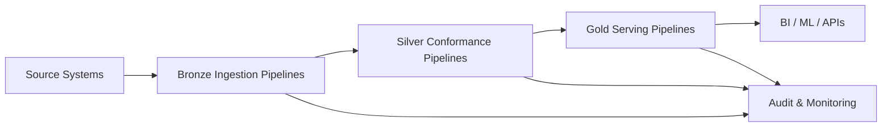

Sample interview answer:
- I implemented medallion orchestration with separate ADF pipeline layers and explicit dependencies. Bronze captures raw immutable data, Silver applies quality and standardization, and Gold builds curated business outputs. Centralized auditing and restart-safe design made operations stable and transparent for support teams.

## 26. Advanced Interview Drill: Scenario Question Bank

1. You need to reprocess 6 months of historical data quickly. How do you design backfill?
	- Use parameterized date windows, controlled parallelism, idempotent sink merge, and checkpointed progress to resume safely.

2. Your pipeline occasionally creates duplicates after retries. How do you fix it?
	- Ensure sink operation is idempotent (merge/upsert), use business key constraints, and avoid blind append in retry paths.

3. A source API has strict rate limits. How do you orchestrate ingestion?
	- Use Until/Wait with throttle-aware batching, control concurrency, and checkpoint continuation tokens.

4. You need near real-time processing but source sends irregular batches.
	- Prefer event trigger for arrival-based starts, combine with small micro-batch pattern and SLA-aware alerts.

5. How do you make ADF production support-friendly?
	- Standardized pipeline template, structured logging, runbook-ready error messages, alert routing, and replay strategy.

## 27. Example Answer Templates for Interviews

Use this structure for scenario responses:
1. Context: Briefly state system and business need.
2. Constraints: SLA, volume, security, compliance.
3. Design: ADF artifacts and processing pattern.
4. Reliability: retries, idempotency, monitoring, alerting.
5. Outcome: measurable improvement.

Template:
- We had [data source] feeding [target] under [SLA/volume/security constraints]. I designed a [metadata-driven/event-driven/incremental] ADF solution using [pipeline + activities + IR type]. To ensure reliability, I implemented [retry + watermark + idempotent merge + alerts]. This improved [runtime/cost/stability] and reduced [failures/manual effort].

## 28. Suggested Hands-On Mini Projects (Deep Practice)

1. Build a fully metadata-driven pipeline with full + incremental modes and audit table.
2. Implement event trigger ingestion with schema validation and quarantine path.
3. Implement SCD Type 2 dimension load with overlap window and dedup.
4. Add CI/CD deployment with environment-specific parameter overrides and smoke tests.
5. Create an operations dashboard from ADF run logs (success rate, average duration, top failures).

## 29. Mock Interview Round: 30 Advanced Scenario Questions with Ideal Spoken Answers

How to use this section:
1. Read one question.
2. Speak your answer in 2 to 3 minutes.
3. Compare with the sample answer for structure and depth.

## 29.1 Architecture and Design Scenarios

1. Question: You are asked to design an enterprise ingestion platform for 300 tables from mixed sources. How would you design it in ADF?
   Sample answer:
   - I would build a metadata-driven architecture with a control table that stores source, sink, load type, watermark column, and schedule attributes. A parent orchestration pipeline reads active config rows and invokes a reusable child pipeline for each table. The child pipeline applies dynamic source queries and sink paths, supports both full and incremental modes, and writes audit logs for every run. This design minimizes pipeline duplication, speeds onboarding for new entities, and gives centralized observability and governance.

2. Question: How do you decide between one large pipeline and many modular pipelines?
   Sample answer:
   - I prefer modular pipelines. One large pipeline becomes difficult to debug, test, and release safely. I usually split by functional boundaries such as ingestion, validation, transformation, and publish, then orchestrate them with a master pipeline. This improves reusability and blast-radius control because a change in one module is less likely to break the entire system.

3. Question: You need both batch and near-real-time ingestion. What ADF strategy would you use?
   Sample answer:
   - I use hybrid triggering. Event triggers handle near-real-time file arrivals, while schedule or tumbling-window triggers handle predictable batch loads. Both routes can call common child pipelines so business logic stays consistent. I also tag runs by mode for monitoring and SLA reporting.

4. Question: How would you design a multi-tenant ADF solution where each client has separate storage and keys?
   Sample answer:
   - I would store tenant configuration in metadata with tenant-specific endpoints, container paths, and Key Vault secret references. Pipelines accept tenant id as parameter, resolve tenant config at runtime, and dynamically route data to tenant-specific sinks. RBAC and secret isolation are applied per tenant, and logs include tenant id for support traceability.

5. Question: How do you ensure maintainability in a fast-growing ADF environment?
   Sample answer:
   - I enforce naming standards, folder conventions, reusable templates, and code review gates. I maintain a shared error-handling module and centralized audit schema. I also standardize parameter contracts across child pipelines so teams can compose pipelines without custom rewrites.

## 29.2 Incremental Loading and Data Correctness

6. Question: Explain your approach for robust incremental loading when source updates are frequent.
   Sample answer:
   - I use watermark-based extraction with a control table. Each run reads last successful watermark, extracts delta records, and updates watermark only after end-to-end success. I add overlap windows to catch late-arriving updates and use merge logic in sink to guarantee idempotency. This avoids misses and duplicates under retry conditions.

7. Question: How do you prevent duplicates during reruns?
   Sample answer:
   - I design sink writes as idempotent, usually with merge on business key plus last modified timestamp logic. Blind append is avoided for retriable workloads. I also persist run metadata and checkpoint windows so reruns can be deterministic rather than ad hoc.

8. Question: What if source has no reliable last modified column?
   Sample answer:
   - I evaluate alternatives such as change tracking, CDC, monotonically increasing keys, or periodic snapshot compare using hash keys. If none are available, I may run bounded full extracts and compute delta downstream with hash-based change detection. I clearly document trade-offs on latency and cost.

9. Question: How do you handle late-arriving data in daily pipelines?
   Sample answer:
   - I include a reprocessing overlap, for example last 24 hours, and then deduplicate in sink using business key and latest update timestamp. This catches delayed records without creating duplicates. I also monitor late-arrival rate to tune overlap duration.

10. Question: How would you validate completeness after incremental load?
	Sample answer:
	- I perform reconciliation checks such as source count vs landed count for the extraction window, optional control totals, and null checks on mandatory fields. For critical tables, I also use hash-based checksum comparisons on sampled partitions. Validation outcomes are written to audit tables and surfaced in alerts.

## 29.3 Performance and Cost Optimization

11. Question: A nightly pipeline misses SLA due to long copy duration. What do you tune first?
	Sample answer:
	- I first profile where time is spent: source read, network transfer, sink write, or orchestration overhead. Then I tune source partitioning, parallel copy, DIUs, and pushdown filtering. I also verify source-side indexing for extraction predicates. The goal is to optimize end-to-end path, not one setting in isolation.

12. Question: How do you optimize Mapping Data Flow performance?
	Sample answer:
	- I focus on partitioning strategy, reducing unnecessary shuffles, selecting broadcast joins where appropriate, pruning unused columns early, and choosing proper sink partitioning. I avoid over-wide transformations in one flow when modularization improves execution planning.

13. Question: ADF costs increased 40 percent in two months. How do you investigate?
	Sample answer:
	- I analyze cost contributors by activity type, trigger frequency, data flow cluster usage, and run volume trends. Common drivers are over-frequent schedules, small-file inefficiency, and long debug sessions. I then map each cost source to an optimization action and validate impact through before/after metrics.

14. Question: When do you prefer event triggers over schedule triggers?
	Sample answer:
	- I prefer event triggers when data arrival is irregular and latency matters. Schedule triggers are better for predictable cadences and controlled batch windows. Event-driven execution often reduces idle polling cost and improves freshness.

15. Question: How do you address small-file problems in data lake loads?
	Sample answer:
	- I reduce micro-batch frequency where possible, write with larger partitions, and add downstream compaction steps. Small-file control is important for query performance and metadata overhead. I tie file sizing strategy to expected analytics workload.

## 29.4 Reliability, Error Handling, and Operations

16. Question: Describe your production-grade error handling standard in ADF.
	Sample answer:
	- I use standardized try-catch-finally branching. Every pipeline writes structured audit events including run id, entity, window, and error details. Failure path sends alerts with actionable context and routes bad data to quarantine when needed. Recovery steps are documented in runbooks.

17. Question: How do you design a replay strategy for failed runs?
	Sample answer:
	- Replay must be deterministic. I store checkpoints and processing windows in control tables, then rerun by window or entity with idempotent sink logic. I avoid manual one-off reruns without metadata because they often create consistency issues.

18. Question: A pipeline fails intermittently due to API throttling. What is your fix?
	Sample answer:
	- I reduce concurrency, add exponential backoff pattern using control flow, and batch requests with rate-limit awareness. I also track response headers or token state where available. The objective is stable throughput rather than peak burst behavior.

19. Question: How do you monitor ADF effectively for support teams?
	Sample answer:
	- I combine native monitoring with custom audit tables and dashboards. Core metrics include success rate, duration percentile, retry count, late arrivals, and top failure reasons. Alerts are severity-based and include routing rules so the right team gets notified quickly.

20. Question: How do you reduce mean time to resolution for pipeline incidents?
	Sample answer:
	- I standardize logging fields, error taxonomy, and runbook mapping by error code category. Alerts include direct run links, impacted entity, and recommended first checks. This cuts triage time and reduces dependency on tribal knowledge.

## 29.5 Security, Governance, and Compliance

21. Question: How do you secure secrets and credentials in ADF?
	Sample answer:
	- I avoid embedding credentials in artifacts and store secrets in Key Vault. Linked services use managed identity or service principal with least privilege. Secret rotation and access audit are coordinated with platform security controls.

22. Question: What governance controls do you apply across ADF artifacts?
	Sample answer:
	- I apply naming standards, tagging, folder structures, and mandatory PR review with policy checks. Critical pipelines require ownership metadata and support tier definition. This improves discoverability, accountability, and operational consistency.

23. Question: How do you handle PII in ADF pipelines?
	Sample answer:
	- I classify data domains, restrict access through RBAC and network boundaries, and apply masking or tokenization where needed in transformation layers. I also avoid exposing sensitive fields in logs and alerts. Compliance requirements are captured as design constraints from the start.

24. Question: How do you design private connectivity for on-prem sources?
	Sample answer:
	- I use Self-hosted Integration Runtime deployed in secure network zones and avoid public exposure. Connectivity is validated through controlled firewall rules and monitored throughput. High availability is implemented with multiple SHIR nodes.

25. Question: What is your approach to environment separation and release governance?
	Sample answer:
	- I keep strict environment isolation for dev, test, and prod with parameterized artifacts. Deployments are automated with approvals and validation gates. Triggers are controlled during deployment, followed by smoke tests before full enablement.

## 29.6 CI/CD and Team Delivery

26. Question: Explain your ADF CI/CD process from feature branch to production.
	Sample answer:
	- Developers work in feature branches, raise PRs, and pass review plus validation checks. Build stage packages publish artifacts, and release stage deploys with environment-specific overrides. Post-deployment checks verify linked services, trigger states, and critical pipeline runs.

27. Question: How do you avoid deployment-time outages in ADF?
	Sample answer:
	- I use deployment windows, temporarily stop affected triggers, and sequence deployments to avoid partial state issues. I validate dependencies before enabling triggers again. For critical systems, I use canary runs and fallback plans.

28. Question: How do you manage breaking schema changes in source systems?
	Sample answer:
	- I establish data contracts and change notification process. Pipelines support additive schema drift where possible, but enforce mandatory column checks for critical fields. Breaking changes go through controlled rollout with backward compatibility windows.

29. Question: How do you onboard new teams to your ADF platform quickly?
	Sample answer:
	- I provide pipeline templates, metadata onboarding guides, naming standards, and a golden path for ingestion. Most onboarding becomes config-driven rather than custom development. This reduces lead time and keeps platform quality consistent.

30. Question: What outcomes do you highlight when presenting ADF project impact to leadership?
	Sample answer:
	- I report business outcomes: SLA adherence, failure reduction, data freshness improvement, and cost efficiency. I also show operational maturity metrics such as incident response time and deployment success rate. Leadership cares about reliability and measurable value, so I connect technical design to those outcomes.

## 30. Self-Evaluation Rubric for Your Spoken Answers

Score each answer from 1 to 5 for each criterion:
1. Clarity: Is the explanation easy to follow?
2. Structure: Did you cover context, constraints, design, reliability, and outcome?
3. Technical depth: Did you include specific ADF artifacts and patterns?
4. Practicality: Did you mention trade-offs and operations considerations?
5. Business impact: Did you quantify or qualify outcomes?

Target quality:
- 22 to 25 total: interview-ready.
- 18 to 21 total: strong but refine examples.
- Below 18: practice with concrete architecture and outcome statements.

---

# Azure Core Concepts - Detailed Notes

## 31. Azure Resource Groups - In-Depth Guide

## 31.1 What is an Azure Resource Group?

A Resource Group (RG) is a logical container in Azure that holds related resources for an Azure solution. It's a fundamental organizational unit in Azure Resource Manager (ARM).

Key characteristics:
- Every Azure resource must belong to exactly one resource group.
- A resource group cannot be nested inside another resource group.
- Resources in a resource group can be in different Azure regions.
- A resource group has its own location (metadata storage), but resources inside can be anywhere.
- Resource groups enable lifecycle management, access control, billing, and organization.

Think of it as a folder, but with powerful management capabilities attached.

## 31.2 Why Do Resource Groups Exist?

Azure Resource Groups solve multiple organizational and operational challenges:

1. Logical grouping: Group resources by application, environment, department, or project.
2. Lifecycle management: Deploy, update, or delete all resources together.
3. Access control: Apply RBAC at the resource group level.
4. Cost management: Track spending by resource group using tags and cost analysis.
5. Policy enforcement: Apply Azure policies to all resources in a group.
6. Consistent deployment: Use ARM templates or Bicep to deploy entire environments.

## 31.3 Resource Group Architecture and Hierarchy

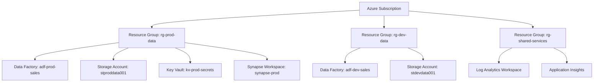

## 31.4 Resource Group Naming Conventions

Best practice naming pattern:
```
rg-<app-or-service>-<environment>-<region>-<instance>
```

Examples:
- `rg-salesplatform-prod-eastus-01`
- `rg-dataingestion-dev-westus-01`
- `rg-shared-networking-prod-centralus-01`

Abbreviated pattern for brevity:
```
rg-<workload>-<env>
```

Examples:
- `rg-sales-prod`
- `rg-analytics-dev`
- `rg-shared-test`

## 31.5 Resource Group Lifecycle and Scope

Lifecycle behavior:
- Creating a resource group: Fast metadata operation.
- Deleting a resource group: Deletes ALL resources inside it (irreversible).
- Moving resources: You can move resources between resource groups within same or different subscriptions (with some limitations).

Scope considerations:
- Resource groups are subscription-scoped.
- Resources from different regions can coexist in one resource group.
- Resource group location stores metadata; it doesn't restrict resource locations.

## 31.6 Organizing Strategies (Best Practices)

## Strategy 1: Environment-Based
Separate resource groups per environment.
- `rg-myapp-dev`
- `rg-myapp-test`
- `rg-myapp-prod`

Pros: Easy environment isolation, clear lifecycle management.
Cons: Can lead to many resource groups if you have many apps.

## Strategy 2: Application/Workload-Based
Group by application or workload.
- `rg-salesapp-prod`
- `rg-inventoryapp-prod`
- `rg-hrapp-prod`

Pros: Clear ownership, application-level cost tracking.
Cons: May require granular RBAC within resource group.

## Strategy 3: Lifecycle-Based
Group resources with similar lifecycles.
- `rg-persistent-infra` (databases, storage)
- `rg-compute-ephemeral` (VMs, App Services that change frequently)

Pros: Reduces accidental deletion risk for critical resources.
Cons: Can complicate deployment automation.

## Strategy 4: Hybrid Approach
Combine environment + application + resource type.
- `rg-sales-data-prod`
- `rg-sales-compute-prod`
- `rg-sales-network-prod`

Pros: Granular control, clear separation of concerns.
Cons: Higher management overhead.

## 31.7 Resource Group and RBAC (Role-Based Access Control)

RBAC inheritance model:
```
Subscription (Owner)
  └── Resource Group (Contributor)
        └── Individual Resource (Reader)
```

Common scenarios:
- Grant developers `Contributor` role on `rg-dev-*` resource groups.
- Grant operations team `Reader` role on `rg-prod-*` for monitoring.
- Grant specific service principal `Data Factory Contributor` on `rg-data-prod`.

Key RBAC roles for resource groups:
- Owner: Full control including RBAC management.
- Contributor: Manage all resources but cannot grant access.
- Reader: View resources only, no modifications.
- Custom roles: Tailored permissions for specific needs.

## 31.8 Resource Group Locks

Azure supports two types of locks at resource group level:
1. CanNotDelete: Can modify resources but cannot delete them.
2. ReadOnly: Cannot modify or delete resources.

Use cases:
- Protect production resource groups from accidental deletion.
- Prevent changes to compliance-critical infrastructure.
- Safeguard shared services resource groups.

Lock inheritance:
- Locks applied at resource group level apply to all resources inside.
- Even Owner cannot delete/modify locked resources without first removing lock.

## 31.9 Tagging and Cost Management

Tags are name-value pairs applied to resource groups and resources.

Common tag examples:
- `Environment: Production`
- `CostCenter: 12345`
- `Owner: DataTeam`
- `Project: SalesAnalytics`
- `Criticality: High`

Tag inheritance:
- Resource group tags DO NOT automatically inherit to resources.
- Use Azure Policy to enforce tagging or auto-apply tags.

Cost tracking:
- View costs grouped by resource group in Azure Cost Management.
- Combine with tags for multi-dimensional cost analysis.

## 31.10 Resource Group Deployment (ARM/Bicep)

Deploying with ARM template:
```json
{
  "$schema": "https://schema.management.azure.com/schemas/2019-04-01/deploymentTemplate.json#",
  "contentVersion": "1.0.0.0",
  "resources": [
    {
      "type": "Microsoft.Storage/storageAccounts",
      "apiVersion": "2021-09-01",
      "name": "stproddata001",
      "location": "eastus",
      "sku": {
        "name": "Standard_LRS"
      },
      "kind": "StorageV2"
    },
    {
      "type": "Microsoft.DataFactory/factories",
      "apiVersion": "2018-06-01",
      "name": "adf-prod-sales",
      "location": "eastus",
      "identity": {
        "type": "SystemAssigned"
      }
    }
  ]
}
```

Deploying with Bicep (modern declarative language):
```bicep
resource storageAccount 'Microsoft.Storage/storageAccounts@2021-09-01' = {
  name: 'stproddata001'
  location: 'eastus'
  sku: {
    name: 'Standard_LRS'
  }
  kind: 'StorageV2'
}

resource dataFactory 'Microsoft.DataFactory/factories@2018-06-01' = {
  name: 'adf-prod-sales'
  location: 'eastus'
  identity: {
    type: 'SystemAssigned'
  }
}
```

## 31.11 Moving Resources Between Resource Groups

When can you move resources?
- Most Azure resources support move operations.
- Some resources have restrictions (check Azure documentation per resource type).
- Source and target can be in different subscriptions (with proper permissions).

Move operation behavior:
- Source and target resource groups are locked during move.
- Resource IDs change after move.
- Dependent resources may need to be moved together.

Common restrictions:
- Some ADF components may have dependencies.
- Virtual Networks with peering may need special handling.
- Resources with managed identities may need permission reconfiguration.

## 31.12 Resource Group Deletion - Critical Warnings

When you delete a resource group:
- ALL resources inside are permanently deleted.
- There is a confirmation prompt, but no "undo" after confirmation.
- Deletion is asynchronous and may take time for large resource groups.
- Soft-delete features (like Key Vault soft-delete) may still apply to individual resources.

Best practices before deletion:
1. Export ARM template for backup/documentation.
2. Verify no critical data or resources.
3. Check dependencies from other resource groups.
4. Consider applying lock before deletion is allowed.
5. Validate in lower environment first if replicating action.

## 31.13 Resource Groups and Azure Policies

Azure Policy can enforce rules at resource group scope:
- Allowed resource types
- Allowed locations
- Required tags
- Naming conventions
- Security configurations

Example policy use cases:
- Deny creation of public storage accounts in `rg-prod-*`.
- Require `CostCenter` tag on all resources in resource group.
- Enforce resources to be created only in specific regions.

Policy inheritance:
- Policies at subscription level apply to all resource groups.
- Policies at resource group level apply to resources inside.

## 31.14 Resource Group Limits and Quotas

Key limits (as of 2026):
- Resource groups per subscription: 980
- Resources per resource group: 800 (for most resource types)
- Deployments per resource group: 800 deployment history entries

Best practices:
- Don't create too many resources in one resource group if you approach limits.
- Clean up old deployment history periodically.
- Split large workloads across multiple resource groups if needed.

## 31.15 Interview Questions on Resource Groups

1. What is an Azure Resource Group?
   - Logical container that holds related Azure resources for lifecycle management, access control, and organization.

2. Can a resource belong to multiple resource groups?
   - No. Each resource belongs to exactly one resource group.

3. Can resource groups be nested?
   - No. Resource groups cannot contain other resource groups.

4. What happens when you delete a resource group?
   - All resources inside are permanently deleted. The operation is irreversible.

5. Do resource group tags inherit to resources?
   - No. Tags must be applied separately to resources unless enforced by Azure Policy.

6. Can resources in a resource group be in different Azure regions?
   - Yes. Resource group location only determines where metadata is stored, not resource locations.

7. How do you prevent accidental deletion of a resource group?
   - Apply a `CanNotDelete` lock at the resource group level.

8. What is the benefit of organizing resources by resource group?
   - Simplified lifecycle management, centralized RBAC, cost tracking, policy enforcement, and consistent deployment.

9. Can you move a resource from one resource group to another?
   - Yes, most resources support move operations, though some have restrictions.

10. How does RBAC work with resource groups?
    - Permissions assigned at resource group level apply to all resources within, following Azure's RBAC inheritance model.

## 31.16 Real-World Resource Group Scenarios

Scenario 1: Data Engineering Platform
```
rg-data-prod-eastus
  ├── Azure Data Factory (orchestration)
  ├── Azure Data Lake Storage Gen2 (bronze/silver/gold)
  ├── Azure Synapse Analytics (serving layer)
  ├── Key Vault (secrets)
  └── Log Analytics Workspace (monitoring)
```

Benefits:
- Single deployment unit for entire platform.
- RBAC applied once for data engineering team.
- Cost tracking for full data platform.

Scenario 2: Multi-Environment Application
```
rg-webapp-dev
  ├── App Service (dev instance)
  └── SQL Database (dev)

rg-webapp-test
  ├── App Service (test instance)
  └── SQL Database (test)

rg-webapp-prod
  ├── App Service (prod instance)
  ├── SQL Database (prod)
  └── Application Insights
```

Benefits:
- Environment isolation.
- Separate RBAC per environment.
- Dev/test can be deleted and recreated easily.

Scenario 3: Shared Services Model
```
rg-shared-networking
  ├── Virtual Network (hub)
  └── Firewall

rg-shared-monitoring
  ├── Log Analytics Workspace (central)
  └── Application Insights

rg-sales-prod
  ├── Data Factory
  └── Storage Account
  (connects to shared networking and monitoring)
```

Benefits:
- Shared infrastructure managed centrally.
- Application resource groups stay focused.
- Reduces duplication of monitoring/network resources.

## 31.17 Common Mistakes to Avoid

1. Mixing environments in one resource group
   - Risk: Accidental deletion of prod when cleaning dev.

2. Creating too many single-resource resource groups
   - Problem: Management overhead increases unnecessarily.

3. Not using locks on critical resource groups
   - Risk: Accidental deletion of production resources.

4. Ignoring naming conventions
   - Problem: Hard to identify purpose and owner at scale.

5. Not tagging resource groups
   - Problem: Difficult cost tracking and governance.

6. Storing unrelated resources together
   - Problem: Coupling unrelated lifecycles and access patterns.

## 31.18 Resource Group CLI and PowerShell Commands

Azure CLI examples:
```bash
# Create a resource group
az group create --name rg-sales-prod --location eastus

# List all resource groups
az group list --output table

# Delete a resource group
az group delete --name rg-sales-dev --yes --no-wait

# Export resource group template
az group export --name rg-sales-prod --output json > template.json

# Apply lock
az lock create --name PreventDelete --lock-type CanNotDelete --resource-group rg-sales-prod

# Tag resource group
az group update --name rg-sales-prod --tags Environment=Production CostCenter=12345
```

Azure PowerShell examples:
```powershell
# Create resource group
New-AzResourceGroup -Name "rg-sales-prod" -Location "eastus"

# Get resource groups
Get-AzResourceGroup

# Delete resource group
Remove-AzResourceGroup -Name "rg-sales-dev" -Force

# Apply tag
Set-AzResourceGroup -Name "rg-sales-prod" -Tag @{Environment="Production"; Owner="DataTeam"}

# Create lock
New-AzResourceLock -LockName "PreventDelete" -LockLevel CanNotDelete -ResourceGroupName "rg-sales-prod"
```

## 31.19 Quick Reference Summary

Key takeaways:
- Resource groups are logical containers for Azure resources.
- Every resource belongs to exactly one resource group.
- Resource groups enable lifecycle, access, cost, and policy management.
- Deleting a resource group deletes all resources inside.
- Use locks to prevent accidental deletions.
- Apply consistent naming and tagging for governance.
- RBAC at resource group level applies to all contained resources.
- Resources can be in different regions than their resource group.

Best practices checklist:
- [ ] Use consistent naming convention
- [ ] Apply meaningful tags (Environment, Owner, CostCenter, Project)
- [ ] Implement RBAC at resource group level
- [ ] Apply locks on production resource groups
- [ ] Organize by lifecycle, environment, or workload
- [ ] Document resource group purpose and ownership
- [ ] Use ARM/Bicep templates for repeatable deployments
- [ ] Regularly review and clean up unused resource groups

## 32. Storage Account vs Blob Storage vs Azure Data Lake - Complete Guide

## 32.1 The Relationship Hierarchy (Understanding the Confusion)

This is one of the most confusing topics in Azure because these terms are **nested and overlapping**, not parallel alternatives.

The correct mental model:

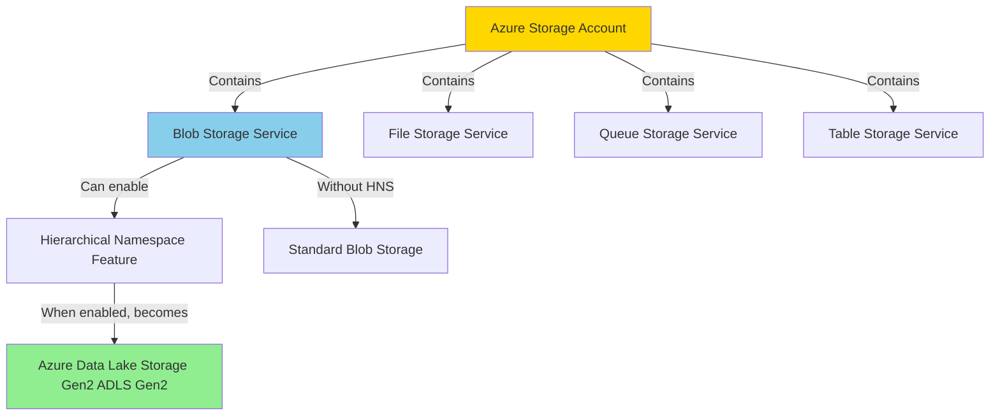

Key insight: **Azure Data Lake Storage Gen2 is not a separate product. It's Blob Storage with Hierarchical Namespace (HNS) enabled.**

## 32.2 Azure Storage Account - The Foundation

## What is it?
A Storage Account is the **top-level Azure resource** that provides a unique namespace for storing and accessing multiple types of data.

Think of it as a **container resource** that can host:
- Blob Storage (unstructured data: files, images, videos, logs, backups)
- File Storage (SMB file shares)
- Queue Storage (messaging)
- Table Storage (NoSQL key-value store)

## Key characteristics:
- Every storage account has a unique name globally across Azure (e.g., `mystorageaccount001`).
- Accessible via endpoints like: `https://mystorageaccount001.blob.core.windows.net`
- A Storage Account belongs to one resource group.
- Replication options: LRS, GRS, RA-GRS, ZRS, GZRS.
- Performance tiers: Standard (HDD) or Premium (SSD).
- Access tiers: Hot, Cool, Archive (for blob data).

## When to create a Storage Account:
- You need to store any type of data in Azure.
- Required before you can use Blob, File, Queue, or Table storage.

## 32.3 Blob Storage - A Service Inside Storage Account

## What is it?
Blob Storage is **one of the services** within a Storage Account, designed for storing massive amounts of **unstructured object data** (Binary Large Objects = BLOBs).

Think of it as: **Cloud file storage without a traditional folder hierarchy** (unless HNS is enabled).

## Blob Storage Structure:
```
Storage Account: mystorageaccount001
  └── Blob Service
        ├── Container: raw-data
        │     ├── file1.csv
        │     ├── file2.json
        │     └── images/photo.jpg  (virtual folder using "/" in blob name)
        ├── Container: processed-data
        │     └── output.parquet
        └── Container: backups
              └── backup_2026.zip
```

## Three types of blobs:
1. **Block Blobs**: Optimized for upload/download of large files (text, binary, media). Most common.
2. **Append Blobs**: Optimized for append operations (logs, streaming data).
3. **Page Blobs**: Optimized for random read/write (used by Azure VMs for disk storage).

## Key features:
- Containers are the top-level organizational unit inside Blob Service.
- No true folder hierarchy (flat namespace); folders are simulated using naming with "/".
- Access tiers: Hot, Cool, Archive for cost optimization.
- Versioning, soft delete, immutability policies, encryption.

## 32.4 Azure Data Lake Storage Gen2 (ADLS Gen2) - Blob + Big Data Power

## What is it?
ADLS Gen2 is **Blob Storage with Hierarchical Namespace (HNS) enabled**, adding true directory structure and big data optimizations.

Formula:
```
ADLS Gen2 = Blob Storage + Hierarchical Namespace + Big Data Optimizations
```

## Why ADLS Gen2 exists:
Standard Blob Storage uses a flat namespace where "folders" are just part of the blob name. For big data workloads with millions of files, this becomes:
- Slow (listing operations scan entire containers).
- Inefficient for analytics engines (Spark, Databricks, Synapse).
- No atomic directory operations (rename a folder = rename every blob individually).

ADLS Gen2 solves this with **true folders** that support:
- Fast directory operations (atomic rename, delete).
- POSIX-like permissions at folder/file level.
- Optimized for analytics workloads.

## Key differentiators from standard Blob Storage:

| Feature | Blob Storage (Standard) | ADLS Gen2 (HNS Enabled) |
|---------|------------------------|-------------------------|
| Folder structure | Simulated (flat namespace) | True directories (hierarchical) |
| Rename folder | Rename each blob individually | Atomic directory rename |
| Delete folder | Delete each blob | Atomic directory delete |
| Permissions | Container/blob level RBAC | POSIX ACLs at folder/file level |
| Performance for analytics | Moderate | Optimized for Spark/Databricks/Synapse |
| Big data ecosystem | Compatible but not optimized | Fully optimized |
| Pricing | Standard blob pricing | Same as blob + small premium for HNS operations |

## Real-world analogy:
- **Blob Storage**: Like storing files in a single giant folder where subfolder names are just part of filenames.
- **ADLS Gen2**: Like a proper file system with real folders, subfolders, and permissions.

## 32.5 How to Enable ADLS Gen2

When creating a Storage Account:
1. Choose **Performance**: Standard or Premium.
2. Choose **Account kind**: StorageV2 (general purpose v2).
3. **Enable Hierarchical Namespace**: Yes ✓

After creation:
- Cannot enable HNS on an existing storage account (must create new).
- Once enabled, cannot disable it.

## 32.6 Comparison Table - At a Glance

| Aspect | Storage Account | Blob Storage | ADLS Gen2 |
|--------|----------------|--------------|-----------|
| **What is it?** | Top-level Azure resource | Service inside Storage Account | Blob Storage with HNS enabled |
| **Purpose** | Container for storage services | Store unstructured object data | Store big data with true folders |
| **Structure** | Contains multiple services | Containers → Blobs | Containers → Directories → Files |
| **Folder support** | N/A (not a storage type) | Simulated (flat namespace) | True directories (hierarchical) |
| **Best for** | Foundation for all storage | General file/object storage | Analytics, big data, data lakes |
| **Use with ADF** | Cannot directly access | Yes (source/sink) | Yes (optimized source/sink) |
| **Use with Databricks** | N/A | Yes, but not optimized | Yes, fully optimized |
| **POSIX ACLs** | N/A | No | Yes |
| **Pricing model** | N/A (pricing at service level) | Per GB stored + operations | Per GB stored + operations + HNS overhead |

## 32.7 When to Use Which?

## Use Standard Blob Storage when:
- Simple file upload/download scenarios.
- Web content hosting (images, videos, static sites).
- Backups and archives.
- You don't need folder-level permissions.
- You're not running big data analytics workloads.

## Use ADLS Gen2 when:
- Building a data lake (bronze/silver/gold architecture).
- Running Spark, Databricks, Synapse analytics.
- Need folder-level access control (ACLs).
- Storing millions of files with directory structure.
- Atomic directory operations are important.
- Integrating with Azure Data Factory, Synapse, HDInsight.

## 32.8 Practical Example: Data Engineering Scenario

Scenario: You're building a data platform for sales analytics.

Storage design:
```
Storage Account: stadlsproddata001
  └── ADLS Gen2 Enabled: Yes
        ├── Container: bronze
        │     ├── sales/
        │     │   ├── 2026/
        │     │   │   ├── 04/
        │     │   │   │   ├── sales_20260426.csv
        │     │   │   │   └── sales_20260427.csv
        │     ├── customers/
        │     └── products/
        │
        ├── Container: silver
        │     ├── sales_cleaned/
        │     └── customer_master/
        │
        └── Container: gold
              ├── sales_summary/
              └── customer_360/
```

Why ADLS Gen2 here?
- True folder hierarchy for organized data layers.
- Folder-level ACLs (data engineers get access to bronze/silver, analysts only to gold).
- Optimized for Spark/Databricks transformations.
- Atomic folder operations for efficient data pipeline moves.

## 32.9 Storage Account Types and Tiers

## Account kinds:
1. **StorageV2 (General Purpose v2)**: Recommended. Supports all features.
2. **StorageV1 (General Purpose v1)**: Legacy, fewer features.
3. **BlobStorage**: Blob-only account, legacy, use StorageV2 instead.
4. **BlockBlobStorage**: Premium performance for block blobs.
5. **FileStorage**: Premium performance for file shares.

## Performance tiers:
- **Standard**: HDD-backed, lower cost, general use.
- **Premium**: SSD-backed, low latency, high throughput (for VMs, high-performance workloads).

## Access tiers (for blob data):
- **Hot**: Frequent access, higher storage cost, lower access cost.
- **Cool**: Infrequent access (30+ days), lower storage cost, higher access cost.
- **Archive**: Rare access (180+ days), lowest storage cost, highest access cost, retrieval latency in hours.

## 32.10 Storage Account Naming and Endpoints

Naming rules:
- 3 to 24 characters.
- Lowercase letters and numbers only.
- Must be globally unique across all Azure.

Endpoint patterns:
- Blob: `https://<account-name>.blob.core.windows.net`
- ADLS Gen2: `https://<account-name>.dfs.core.windows.net` (Data Lake File System endpoint)
- File: `https://<account-name>.file.core.windows.net`
- Queue: `https://<account-name>.queue.core.windows.net`
- Table: `https://<account-name>.table.core.windows.net`

**Important**: ADLS Gen2 uses the `.dfs.core.windows.net` endpoint for optimized access, but `.blob.core.windows.net` still works with reduced performance.

## 32.11 Security and Access Control

## Blob Storage (Standard):
- Account key (full access, not recommended for production).
- Shared Access Signature (SAS) tokens (time-limited, scoped access).
- Azure AD / Managed Identity (recommended).
- RBAC roles: Storage Blob Data Reader, Storage Blob Data Contributor, Storage Blob Data Owner.

## ADLS Gen2 (Enhanced):
- All Blob Storage security mechanisms.
- **POSIX ACLs**: Read (r), Write (w), Execute (x) permissions at folder/file level.
- Inherited ACLs for new files/folders.
- Access ACLs vs Default ACLs.

Example ACL scenario:
```
/bronze/sales/           → Data Engineers: rwx, Analysts: --x
/silver/sales_cleaned/   → Data Engineers: rwx, Analysts: r-x
/gold/sales_summary/     → Data Engineers: rwx, Analysts: rwx, Executives: r-x
```

## 32.12 Integration with Azure Data Factory

In ADF linked services and datasets:

For **Standard Blob Storage**:
- Linked Service type: Azure Blob Storage
- Authentication: Account key, SAS, Managed Identity, Service Principal
- Dataset: Points to container and blob path

For **ADLS Gen2**:
- Linked Service type: Azure Data Lake Storage Gen2
- Authentication: Managed Identity (preferred), Service Principal, Account key
- Dataset: Points to file system (container) and directory path
- Uses `.dfs.core.windows.net` endpoint for optimized performance

Best practice:
- Use ADLS Gen2 for all data lake scenarios with ADF.
- Use Managed Identity for authentication to avoid managing secrets.

## 32.13 Cost Considerations

Cost factors:
1. **Storage capacity** (per GB per month):
   - Hot tier: Higher cost
   - Cool tier: Lower cost
   - Archive tier: Lowest cost

2. **Operations** (per transaction):
   - Write operations
   - Read operations
   - List/directory operations
   - ADLS Gen2 HNS operations (small premium)

3. **Data transfer**:
   - Ingress (upload): Free
   - Egress (download): Charged after free tier

4. **Replication**:
   - LRS: Lowest cost
   - GRS/RA-GRS: Higher cost

Cost optimization tips:
- Use lifecycle policies to move data to Cool/Archive tiers.
- Choose right replication strategy (LRS for non-critical, GRS for critical).
- Minimize small-file proliferation (use compaction).
- Use ADLS Gen2 optimized endpoints for analytics workloads.

## 32.14 Common Confusion Clarified

**Q: Is ADLS Gen2 a different service from Blob Storage?**
A: No. It's Blob Storage with Hierarchical Namespace enabled. Same storage account, same underlying service.

**Q: Can I use both Blob and ADLS Gen2 in one storage account?**
A: When you enable HNS, the entire Blob service in that storage account becomes ADLS Gen2. All containers get hierarchical namespace. You cannot mix and match within one account.

**Q: What happened to ADLS Gen1?**
A: ADLS Gen1 was a separate service (Azure Data Lake Store) that is now retired/deprecated. Microsoft recommends migrating to ADLS Gen2, which has better performance, lower cost, and full Blob Storage compatibility.

**Q: Do I need ADLS Gen2 for ADF pipelines?**
A: Not always. Standard Blob Storage works fine for many scenarios. Use ADLS Gen2 when you need folder-level ACLs, atomic directory operations, or integration with big data analytics engines.

**Q: Can I convert a standard Blob Storage account to ADLS Gen2?**
A: No. You must create a new storage account with HNS enabled and migrate data.

## 32.15 Interview Questions and Answers

1. **What is the difference between Storage Account and Blob Storage?**
   - Storage Account is the top-level Azure resource that contains multiple services. Blob Storage is one of the services within a Storage Account, designed for unstructured object data.

2. **What is Azure Data Lake Storage Gen2?**
   - It's Blob Storage with Hierarchical Namespace enabled, providing true directory structure, POSIX ACLs, and optimizations for big data analytics.

3. **Can you enable Hierarchical Namespace on an existing storage account?**
   - No. HNS must be enabled during storage account creation. You cannot enable or disable it later.

4. **What is the main advantage of ADLS Gen2 over standard Blob Storage?**
   - True folder hierarchy with atomic directory operations, folder-level ACLs, and optimized performance for analytics engines like Spark, Databricks, and Synapse.

5. **What are the blob access tiers and when would you use each?**
   - Hot: frequent access, high storage cost, low access cost. Cool: infrequent access (30+ days), lower storage cost. Archive: rare access (180+ days), lowest storage cost but hours of retrieval latency.

6. **How do you secure ADLS Gen2 data?**
   - Use Managed Identity or Service Principal with RBAC roles (Storage Blob Data Contributor/Reader/Owner), apply POSIX ACLs at folder/file level, enable encryption at rest, use private endpoints.

7. **What endpoint does ADLS Gen2 use?**
   - Primary: `https://<account>.dfs.core.windows.net` for optimized access. Fallback: `https://<account>.blob.core.windows.net` with reduced performance.

8. **What are containers in Blob Storage?**
   - Top-level organizational units within the Blob service, similar to buckets in AWS S3. All blobs must reside in a container.

9. **How does folder structure work in standard Blob Storage?**
   - Folders are simulated using "/" in blob names (flat namespace). There are no true directories; it's a naming convention.

10. **What is the difference between LRS, GRS, and RA-GRS replication?**
    - LRS: 3 copies in one datacenter (lowest cost). GRS: 6 copies across two regions (higher cost, disaster recovery). RA-GRS: Same as GRS but secondary region is readable.

## 32.16 Real-World Architecture Example

Scenario: Enterprise data platform with mixed workloads

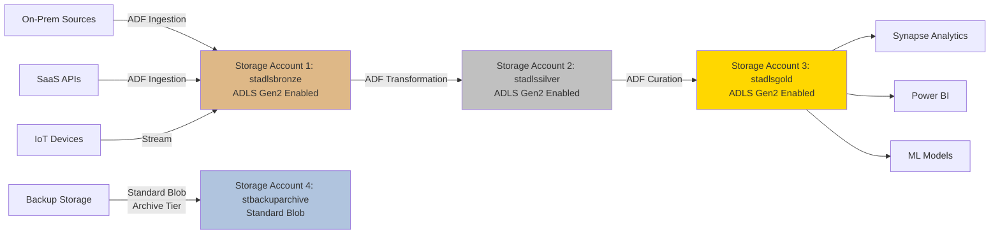

Design decisions:
- Bronze/Silver/Gold: ADLS Gen2 for analytics optimization
- Backups: Standard Blob with Archive tier for cost savings
- Separate storage accounts for layer isolation and access control
- All use Managed Identity for ADF access

## 32.17 Migration Path: Blob to ADLS Gen2

If you started with standard Blob Storage and now need ADLS Gen2:

Migration steps:
1. Create new storage account with HNS enabled.
2. Copy data using:
   - ADF Copy Activity
   - AzCopy with `--preserve-permissions` flag
   - Azure Storage Explorer
3. Update application/pipeline connection strings to new account.
4. Verify data integrity and permissions.
5. Cut over to new storage account.
6. Decommission old account after retention period.

Important:
- No in-place upgrade path.
- Plan for downtime or dual-write during cutover.
- Test ACL migration carefully.

## 32.18 Quick Decision Tree

```
Need to store data in Azure?
  └── Create Storage Account
        │
        ├── Simple file storage, backups, web content?
        │   └── Use Standard Blob Storage (no HNS)
        │
        ├── Building data lake with analytics workloads?
        │   └── Use ADLS Gen2 (enable HNS)
        │
        ├── Need SMB file shares?
        │   └── Use Azure Files service
        │
        └── Need messaging queues?
            └── Use Queue Storage service
```

## 32.19 Summary Cheat Sheet

| Component | Relationship | Key Feature | Best Use Case |
|-----------|-------------|-------------|---------------|
| **Storage Account** | Top-level resource | Contains all storage services | Foundation for any Azure storage |
| **Blob Storage** | Service inside Storage Account | Unstructured object storage | Files, images, backups, web content |
| **ADLS Gen2** | Blob Storage + HNS | True folders + big data optimizations | Data lakes, analytics, big data |

Remember:
- Storage Account is the **container**.
- Blob Storage is a **service** inside it.
- ADLS Gen2 is Blob Storage **with a feature enabled**.
- They are not three separate competing products; they are layers of the same stack.

## 33. Azure Storage Account Redundancy - Complete Guide

## 33.1 What is Storage Redundancy?

Storage redundancy refers to **how Azure replicates your data** to protect against hardware failures, datacenter outages, and regional disasters.

Core concept:
- Azure **always stores multiple copies** of your data.
- You choose the redundancy option based on availability needs, disaster recovery requirements, and cost.
- Redundancy ensures durability and availability even during failures.

Key question to answer: **Where and how many copies of my data exist?**

## 33.2 Why Redundancy Matters

Without redundancy:
- Single disk failure = data loss.
- Datacenter power outage = data unavailable.
- Regional disaster (fire, flood, earthquake) = permanent data loss.

With redundancy:
- Azure maintains multiple copies automatically.
- Transparent failover during hardware/datacenter issues.
- Data remains accessible even during outages.
- Durability guarantees (99.999999999% for GRS/GZRS).

## 33.3 The Six Redundancy Options

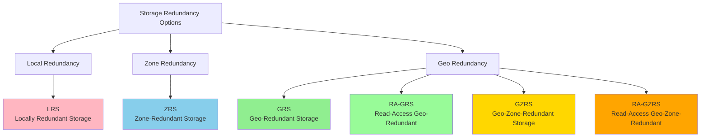

## 33.4 LRS - Locally Redundant Storage

## What is it?
The **lowest cost, most basic** redundancy option.

How it works:
- Creates **3 copies** of your data.
- All 3 copies are in a **single datacenter** in one region.
- Protects against server rack and disk failures.
- **Does NOT protect** against datacenter-level disasters.

Visual representation:
```
Azure Region: East US
  └── Datacenter A
        ├── Copy 1 (Rack 1)
        ├── Copy 2 (Rack 2)
        └── Copy 3 (Rack 3)
```

Durability: 99.999999999% (11 nines) over a year.

## When to use LRS:
- Non-critical data.
- Data that can be easily recreated.
- Cost is primary concern.
- Compliance requires data to stay in single datacenter.
- Dev/test environments.

## When NOT to use LRS:
- Production critical data.
- Cannot afford datacenter-level outage.
- Regulatory requirements for disaster recovery.

Cost: **Lowest**

## 33.5 ZRS - Zone-Redundant Storage

## What is it?
Mid-tier redundancy providing **availability zone protection**.

How it works:
- Creates **3 copies** of your data.
- Each copy is in a **different availability zone** within same region.
- Availability zones are separate physical locations with independent power, cooling, networking.
- Protects against datacenter-level failures.

Visual representation:
```
Azure Region: East US
  ├── Availability Zone 1
  │     └── Copy 1
  ├── Availability Zone 2
  │     └── Copy 2
  └── Availability Zone 3
        └── Copy 3
```

Durability: 99.9999999999% (12 nines) over a year.

## When to use ZRS:
- Production workloads requiring high availability.
- Need to protect against datacenter failures.
- Data must remain in same region for compliance.
- Business can tolerate regional disaster risk.

## When NOT to use ZRS:
- Need protection against regional disasters.
- Region doesn't support availability zones.

Cost: **Moderate** (higher than LRS, lower than geo-redundant)

Availability:
- Not all regions support ZRS.
- Check Azure documentation for ZRS-supported regions.

## 33.6 GRS - Geo-Redundant Storage

## What is it?
Provides **disaster recovery** by replicating across regions.

How it works:
- Creates **6 copies total**.
- **3 copies in primary region** (LRS style).
- **3 copies in secondary region** (hundreds of miles away, LRS style).
- Azure automatically chooses secondary region (region pairs).
- Secondary region data is **read-only** unless failover occurs.

Visual representation:
```
Primary Region: East US
  └── Datacenter A
        ├── Copy 1
        ├── Copy 2
        └── Copy 3

Secondary Region: West US (paired region)
  └── Datacenter B
        ├── Copy 4
        ├── Copy 5
        └── Copy 6
```

Durability: 99.99999999999999% (16 nines) over a year.

## Key characteristics:
- Replication to secondary is **asynchronous** (slight delay, typically < 15 min RPO).
- Secondary region is **not readable** by default (use RA-GRS for read access).
- Failover to secondary must be initiated by Microsoft or customer.

## When to use GRS:
- Critical production data.
- Disaster recovery requirement.
- Can tolerate slight replication lag (RPO in minutes).
- Don't need to read from secondary region.

Cost: **Higher** (roughly 2x LRS cost)

## 33.7 RA-GRS - Read-Access Geo-Redundant Storage

## What is it?
Same as GRS, but with **read access to secondary region**.

How it works:
- Identical to GRS (6 copies across two regions).
- Secondary region data is **readable** via separate endpoint.
- Can offload read traffic to secondary region.

Endpoints:
- Primary: `https://myaccount.blob.core.windows.net`
- Secondary: `https://myaccount-secondary.blob.core.windows.net`

Visual representation:
```
Primary Region: East US (Read/Write)
  └── 3 copies

Secondary Region: West US (Read Only)
  └── 3 copies (accessible via -secondary endpoint)
```

## When to use RA-GRS:
- Need geo-redundancy AND read scaling.
- Want to implement read-mostly applications with geographic distribution.
- Need to test disaster recovery procedures.
- Application can tolerate reading slightly stale data (due to async replication).

## Use cases:
- Global content delivery.
- Reporting/analytics that can run on secondary copy.
- Disaster recovery testing without failover.

Cost: **Slightly higher than GRS** (read operations on secondary are charged)

## 33.8 GZRS - Geo-Zone-Redundant Storage

## What is it?
The **highest availability and durability** option combining ZRS and GRS.

How it works:
- **Primary region**: 3 copies across 3 availability zones (ZRS).
- **Secondary region**: 3 copies in single datacenter (LRS).
- Total: **6 copies**.

Visual representation:
```
Primary Region: East US (Zone-Redundant)
  ├── Zone 1: Copy 1
  ├── Zone 2: Copy 2
  └── Zone 3: Copy 3

Secondary Region: West US (Locally Redundant)
  └── Datacenter B
        ├── Copy 4
        ├── Copy 5
        └── Copy 6
```

Durability: 99.99999999999999% (16 nines) over a year.

## When to use GZRS:
- Maximum availability and durability required.
- Mission-critical production workloads.
- Must survive both zone and regional failures.
- Can justify higher cost for best protection.

Cost: **Highest**

## 33.9 RA-GZRS - Read-Access Geo-Zone-Redundant Storage

## What is it?
GZRS with read access to secondary region.

How it works:
- Same as GZRS (zone-redundant primary, LRS secondary).
- Secondary region is readable via `-secondary` endpoint.

When to use RA-GZRS:
- Maximum protection + read scaling.
- Mission-critical applications with global user base.
- Need to test DR without disrupting production.

Cost: **Highest + read operation charges on secondary**

## 33.10 Comparison Table - All Redundancy Options

| Redundancy | Copies | Primary Region | Secondary Region | Read from Secondary | Durability (% nines) | Cost | Use Case |
|------------|--------|----------------|------------------|---------------------|----------------------|------|----------|
| **LRS** | 3 | Single datacenter | None | No | 11 nines | Lowest | Dev/test, non-critical |
| **ZRS** | 3 | 3 availability zones | None | No | 12 nines | Moderate | Production, zone protection |
| **GRS** | 6 | Single datacenter | Single datacenter (paired region) | No | 16 nines | High | DR requirement |
| **RA-GRS** | 6 | Single datacenter | Single datacenter (paired region) | **Yes** | 16 nines | High+ | DR + read scaling |
| **GZRS** | 6 | 3 availability zones | Single datacenter (paired region) | No | 16 nines | Highest | Mission-critical |
| **RA-GZRS** | 6 | 3 availability zones | Single datacenter (paired region) | **Yes** | 16 nines | Highest+ | Mission-critical + read scaling |

## 33.11 Azure Region Pairs for Geo-Redundancy

Azure uses predetermined region pairs for geo-redundant options:

Common region pairs:
- East US ↔ West US
- East US 2 ↔ Central US
- North Europe ↔ West Europe
- Southeast Asia ↔ East Asia
- UK South ↔ UK West

Key characteristics:
- Pairs are in same geography (for compliance).
- Physically separated by hundreds of miles.
- Updates/maintenance are staggered (one region at a time).
- Cannot manually choose secondary region.

## 33.12 RPO and RTO Explained

## RPO - Recovery Point Objective
How much data you can afford to lose (time-based).

For geo-redundant options:
- **Typical RPO**: < 15 minutes
- Asynchronous replication means slight delay to secondary region.
- In disaster, you may lose up to 15 minutes of most recent writes.

## RTO - Recovery Time Objective
How long until you're back online after disaster.

For geo-redundant options:
- **Typical RTO**: 1-2 hours (varies by failover complexity)
- Microsoft-managed failover: initiated by Azure when regional disaster confirmed.
- Customer-managed failover: you trigger failover to secondary region.

## 33.13 Failover Process for Geo-Redundant Storage

## Microsoft-managed failover:
- Azure detects catastrophic regional failure.
- Azure initiates failover automatically.
- Secondary region becomes new primary.
- DNS updates to point to new primary.
- No data loss beyond RPO window.

## Customer-managed failover (Account Failover):
- You initiate failover manually via Portal/CLI/PowerShell.
- Use when you need control over timing.
- Secondary becomes primary.
- **Original primary becomes secondary after recovery** (unless you fail back).

Failover considerations:
- Endpoints remain same (DNS-based).
- Applications reconnect automatically after brief interruption.
- Data written during failover window may be lost (check Last Sync Time).

## 33.14 Changing Redundancy Options

Can you change redundancy after account creation?

**Yes**, with some restrictions:

Supported changes:
- LRS ↔ GRS ↔ RA-GRS (can switch freely)
- ZRS ↔ GZRS ↔ RA-GZRS (can switch freely)
- LRS/GRS/RA-GRS → ZRS/GZRS/RA-GZRS (live migration or manual migration)

Not supported:
- Cannot directly change from LRS to ZRS in all regions (may require manual data copy).
- Premium storage accounts have limited redundancy change options.

How to change:
1. Azure Portal: Storage Account → Configuration → Replication
2. Azure CLI: `az storage account update --name <account> --sku <new-sku>`

Migration time: Can take hours to days depending on data volume.

## 33.15 Cost Impact Analysis

Relative cost multipliers (approximate):
- LRS: 1.0x (baseline)
- ZRS: 1.25x - 1.5x
- GRS: 2.0x
- RA-GRS: 2.0x + read operation charges
- GZRS: 2.5x
- RA-GZRS: 2.5x + read operation charges

Cost factors to consider:
- Storage capacity charges scale with redundancy.
- Cross-region replication bandwidth is free (included).
- Read operations on secondary region (RA-GRS/RA-GZRS) are charged.
- Higher redundancy = higher monthly cost but better protection.

## 33.16 Redundancy Decision Framework

Decision tree:
```
Is data critical?
  ├── No
  │   └── Can you recreate it easily?
  │       ├── Yes → LRS (lowest cost)
  │       └── No → ZRS or GRS
  │
  └── Yes
      └── Need disaster recovery?
          ├── No
          │   └── Need zone protection?
          │       ├── Yes → ZRS
          │       └── No → LRS (but reconsider!)
          │
          └── Yes
              └── Need read access to secondary?
                  ├── No
                  │   └── Need zone protection in primary?
                  │       ├── Yes → GZRS
                  │       └── No → GRS
                  │
                  └── Yes
                      └── Need zone protection in primary?
                          ├── Yes → RA-GZRS
                          └── No → RA-GRS
```

## 33.17 Real-World Examples

## Example 1: Dev/Test Environment
- **Choice**: LRS
- **Reason**: Low cost, data can be recreated, not critical
- **Risk accepted**: Datacenter failure could cause data loss

## Example 2: Production Data Lake (ADLS Gen2)
- **Choice**: ZRS or GZRS
- **Reason**: Critical data, high availability needed, compliance requires data in region
- **Protection**: Zone failures covered, regional disaster risk managed separately (backups)

## Example 3: Enterprise Backup Storage
- **Choice**: GRS with Archive tier
- **Reason**: Disaster recovery critical, read access not needed, cost optimization via Archive tier
- **Protection**: Regional disaster covered, long-term retention

## Example 4: Global Content Delivery
- **Choice**: RA-GRS or RA-GZRS
- **Reason**: Serve content from multiple regions, read scaling, disaster recovery
- **Benefit**: Users read from geographically closer region (primary or secondary)

## Example 5: Mission-Critical Financial Data
- **Choice**: GZRS or RA-GZRS
- **Reason**: Maximum protection required, regulatory compliance, zero-tolerance for data loss
- **Justification**: Cost is secondary to data safety

## 33.18 Redundancy and Consistency

Eventual consistency for geo-redundant options:
- Writes to primary region are immediately consistent.
- Replication to secondary region is **asynchronous**.
- Secondary region may lag by seconds to minutes.
- Applications reading from secondary (RA-GRS/RA-GZRS) must handle potential stale reads.

Consistency strategies:
- Check `Last Sync Time` property to know replication lag.
- Implement retry logic for read applications.
- Use primary for write-after-read scenarios.

## 33.19 Monitoring Redundancy Health

Key metrics to monitor:
- **Last Sync Time** (for geo-redundant): Time of last successful replication to secondary.
- **Availability**: Track successful request percentage.
- **Geo-Replication Status**: Healthy or degraded.

Alerts to configure:
- Last Sync Time exceeds threshold (e.g., > 30 minutes).
- Availability drops below SLA.
- Geo-replication lag alerts.

## 33.20 Interview Questions on Storage Redundancy

1. **What is the difference between LRS and ZRS?**
   - LRS stores 3 copies in one datacenter; ZRS stores 3 copies across 3 availability zones in the same region. ZRS protects against datacenter failures, LRS does not.

2. **How many copies of data does GRS maintain?**
   - 6 copies: 3 in primary region and 3 in secondary paired region.

3. **What is the difference between GRS and RA-GRS?**
   - Both maintain 6 copies across two regions. RA-GRS allows read access to the secondary region via `-secondary` endpoint; GRS does not.

4. **Can you read from secondary region in GRS?**
   - No. Secondary is only accessible after failover. Use RA-GRS for read access.

5. **What is RPO for geo-redundant storage?**
   - Typically < 15 minutes. Data is asynchronously replicated, so recent writes may be lost in regional disaster.

6. **Which redundancy option provides highest durability?**
   - GZRS and RA-GZRS provide 16 nines (99.99999999999999%) durability.

7. **Can you change redundancy after creating a storage account?**
   - Yes, most transitions are supported (e.g., LRS ↔ GRS, ZRS ↔ GZRS). Some may require manual migration.

8. **What is the cost difference between LRS and GRS?**
   - GRS is approximately 2x the cost of LRS because it maintains copies in two regions.

9. **When would you choose GZRS over GRS?**
   - When you need protection from both zone-level and region-level failures, for mission-critical workloads that justify the higher cost.

10. **What happens during a storage account failover?**
    - The secondary region becomes the new primary, DNS is updated, applications reconnect automatically. Data written during the RPO window may be lost.

## 33.21 Best Practices for Redundancy

1. **Match redundancy to criticality**
   - Dev/test: LRS
   - Production non-critical: ZRS
   - Production critical: GRS/GZRS

2. **Monitor Last Sync Time for geo-redundant**
   - Set alerts if replication lag exceeds acceptable RPO.

3. **Test failover procedures**
   - Use RA-GRS to test reading from secondary without actual failover.

4. **Document RPO/RTO requirements**
   - Choose redundancy that meets business continuity requirements.

5. **Consider compliance and data residency**
   - Some regulations require data to stay in specific region (use ZRS instead of GRS).

6. **Balance cost and protection**
   - Don't over-pay for redundancy you don't need.
   - Don't under-protect critical data to save cost.

7. **Review and adjust as workload changes**
   - Promote from LRS to GRS as data becomes more critical.
   - Demote from GRS to ZRS for cost savings when DR is no longer needed.

## 33.22 Quick Reference Cheat Sheet

**When you need...**
- Lowest cost, non-critical data → **LRS**
- Zone protection, stay in region → **ZRS**
- Disaster recovery, no read access to secondary → **GRS**
- Disaster recovery + read from secondary → **RA-GRS**
- Maximum protection, zone + geo → **GZRS**
- Maximum protection + read from secondary → **RA-GZRS**

**Remember:**
- More copies = higher cost = better protection
- Geo-redundant = protection from regional disaster
- Zone-redundant = protection from datacenter failure
- RA- prefix = Read Access to secondary region
- GZRS/RA-GZRS = best protection (and highest cost)

## 34. Linked Services and Datasets in Azure Data Factory - Deep Dive

## 34.1 The Relationship Between Linked Services and Datasets

Understanding the hierarchy is critical:

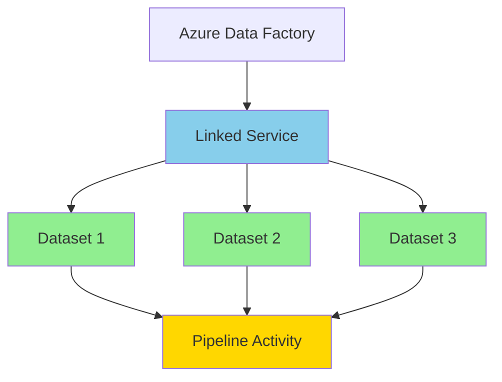

Mental model:
- **Linked Service** = Connection/authentication to a system
- **Dataset** = Pointer to specific data within that system
- **Activity** = Uses datasets to read/write data

Analogy:
- **Linked Service** = Your database connection string
- **Dataset** = A specific table or file path in that database
- **Activity** = The SQL query or operation you perform

## 34.2 What is a Linked Service?

## Definition:
A Linked Service is a **connection definition** that contains the information needed for ADF to connect to external data stores or compute services.

Think of it as: **A saved connection profile with authentication details.**

## Core purpose:
- Store connection endpoint/server information
- Store authentication credentials (or reference to Key Vault)
- Define connection properties (timeout, encryption, etc.)
- Can be reused across multiple datasets and pipelines

## Key characteristics:
- One linked service can be used by many datasets
- Immutable during pipeline execution (defined at design time)
- Can reference Azure Key Vault for secrets
- Supports integration runtime specification

## 34.3 Linked Service Components

Every linked service contains:

1. **Name**: Unique identifier within ADF (e.g., `ls_azuresql_prod`)

2. **Type**: Connector type (examples below)
   - Azure SQL Database
   - Azure Data Lake Storage Gen2
   - Azure Blob Storage
   - On-premises SQL Server
   - Salesforce
   - REST API
   - And 100+ other connectors

3. **Connection Properties**:
   - Server/endpoint URL
   - Database name (if applicable)
   - Account name (for storage)
   - Base URL (for REST APIs)

4. **Authentication**:
   - Managed Identity (recommended for Azure-to-Azure)
   - Service Principal
   - Account Key
   - SQL Authentication
   - OAuth
   - SAS Token
   - Anonymous (for public endpoints)

5. **Integration Runtime**:
   - Which IR to use for connection (Azure IR, SHIR, SSIS IR)

6. **Optional Settings**:
   - Connection timeout
   - Encryption settings
   - Additional properties

## 34.4 Linked Service Examples

## Example 1: Azure SQL Database Linked Service

JSON representation:
```json
{
    "name": "ls_azuresql_prod_sales",
    "type": "AzureSqlDatabase",
    "properties": {
        "typeProperties": {
            "connectionString": "Server=tcp:myserver.database.windows.net,1433;Database=SalesDB;",
            "authenticationType": "ManagedIdentity"
        },
        "connectVia": {
            "referenceName": "AutoResolveIntegrationRuntime",
            "type": "IntegrationRuntimeReference"
        }
    }
}
```

What this defines:
- Connection to specific Azure SQL server and database
- Uses Managed Identity (no password stored)
- Uses Azure IR for connection

## Example 2: ADLS Gen2 Linked Service

JSON representation:
```json
{
    "name": "ls_adlsgen2_datalake",
    "type": "AzureBlobFS",
    "properties": {
        "typeProperties": {
            "url": "https://stadlsprod001.dfs.core.windows.net",
            "authenticationType": "ManagedIdentity"
        },
        "connectVia": {
            "referenceName": "AutoResolveIntegrationRuntime",
            "type": "IntegrationRuntimeReference"
        }
    }
}
```

What this defines:
- Connection to ADLS Gen2 storage account
- Uses Managed Identity
- Uses Azure IR

## Example 3: On-Premises SQL Server Linked Service

JSON representation:
```json
{
    "name": "ls_onprem_sqlserver",
    "type": "SqlServer",
    "properties": {
        "typeProperties": {
            "connectionString": "Server=192.168.1.100;Database=LegacyDB;User ID=etluser;",
            "password": {
                "type": "AzureKeyVaultSecret",
                "store": {
                    "referenceName": "ls_keyvault",
                    "type": "LinkedServiceReference"
                },
                "secretName": "SqlServerPassword"
            }
        },
        "connectVia": {
            "referenceName": "OnPremSelfHostedIR",
            "type": "IntegrationRuntimeReference"
        }
    }
}
```

What this defines:
- Connection to on-premises SQL Server
- Uses SQL authentication with password from Key Vault
- Uses Self-hosted IR for private network access

## 34.5 What is a Dataset?

## Definition:
A Dataset is a **named reference to data** that you want to use in activities. It points to or references the specific data location within the system defined by a linked service.

Think of it as: **A pointer to a specific table, file, or path.**

## Core purpose:
- Define the structure/schema of data (optional)
- Specify exact location (table name, file path, container)
- Define format (CSV, JSON, Parquet, Avro, etc.)
- Can be parameterized for dynamic behavior

## Key characteristics:
- Must reference a linked service
- Can be used as source or sink in activities
- Can have schema defined or use schema inference
- Supports parameterization for reusability

## 34.6 Dataset Components

Every dataset contains:

1. **Name**: Unique identifier (e.g., `ds_azuresql_orders`)

2. **Linked Service Reference**: Points to which linked service to use

3. **Type**: Matches the linked service type
   - AzureSqlTable
   - DelimitedText
   - Parquet
   - Json
   - Binary
   - Avro
   - Excel
   - And many more

4. **Type Properties**: Specific to data location
   - Table name (for databases)
   - File path (for storage)
   - Container/folder structure
   - File name pattern

5. **Schema** (optional):
   - Column names and data types
   - Can be imported or manually defined
   - Can use schema drift (auto-detect)

6. **Parameters** (optional):
   - Make dataset dynamic
   - Pass values at runtime

7. **Format Settings**:
   - Delimiter (for CSV)
   - Compression (for files)
   - Encoding
   - Row/column delimiters

## 34.7 Dataset Examples

## Example 1: Azure SQL Table Dataset

JSON representation:
```json
{
    "name": "ds_azuresql_orders",
    "properties": {
        "linkedServiceName": {
            "referenceName": "ls_azuresql_prod_sales",
            "type": "LinkedServiceReference"
        },
        "type": "AzureSqlTable",
        "typeProperties": {
            "schema": "sales",
            "table": "orders"
        },
        "schema": [
            {
                "name": "order_id",
                "type": "int"
            },
            {
                "name": "customer_id",
                "type": "int"
            },
            {
                "name": "order_date",
                "type": "datetime"
            },
            {
                "name": "amount",
                "type": "decimal"
            }
        ]
    }
}
```

What this defines:
- Uses `ls_azuresql_prod_sales` linked service
- Points to `sales.orders` table
- Schema with 4 columns defined

## Example 2: ADLS Gen2 Parquet Dataset

JSON representation:
```json
{
    "name": "ds_adls_bronze_orders_parquet",
    "properties": {
        "linkedServiceName": {
            "referenceName": "ls_adlsgen2_datalake",
            "type": "LinkedServiceReference"
        },
        "type": "Parquet",
        "typeProperties": {
            "location": {
                "type": "AzureBlobFSLocation",
                "fileSystem": "bronze",
                "folderPath": "sales/orders/2026/04"
            },
            "compressionCodec": "snappy"
        }
    }
}
```

What this defines:
- Uses ADLS Gen2 linked service
- Points to specific folder path in `bronze` container
- Parquet format with Snappy compression

## Example 3: Parameterized CSV Dataset

JSON representation:
```json
{
    "name": "ds_adls_csv_parameterized",
    "properties": {
        "linkedServiceName": {
            "referenceName": "ls_adlsgen2_datalake",
            "type": "LinkedServiceReference"
        },
        "parameters": {
            "pContainer": {
                "type": "string"
            },
            "pFolderPath": {
                "type": "string"
            },
            "pFileName": {
                "type": "string"
            }
        },
        "type": "DelimitedText",
        "typeProperties": {
            "location": {
                "type": "AzureBlobFSLocation",
                "fileSystem": {
                    "value": "@dataset().pContainer",
                    "type": "Expression"
                },
                "folderPath": {
                    "value": "@dataset().pFolderPath",
                    "type": "Expression"
                },
                "fileName": {
                    "value": "@dataset().pFileName",
                    "type": "Expression"
                }
            },
            "columnDelimiter": ",",
            "escapeChar": "\\",
            "quoteChar": "\"",
            "firstRowAsHeader": true
        }
    }
}
```

What this defines:
- Accepts 3 parameters to make it reusable
- Dynamic file path based on runtime values
- CSV format with standard settings

## 34.8 Linked Service vs Dataset - Key Differences

| Aspect | Linked Service | Dataset |
|--------|---------------|---------|
| **Purpose** | Connection to a system | Reference to specific data |
| **Scope** | System-level (server, account) | Data-level (table, file, path) |
| **Authentication** | Contains credentials/auth info | No authentication |
| **Reusability** | Used by multiple datasets | Used by activities |
| **Analogy** | Database connection string | Table name in that database |
| **Example (SQL)** | Server + DB + credentials | Schema.Table name |
| **Example (Storage)** | Storage account + auth | Container + folder + file |
| **Parameterization** | Rare | Common |

## 34.9 How They Work Together in Pipelines

Complete flow visualization:

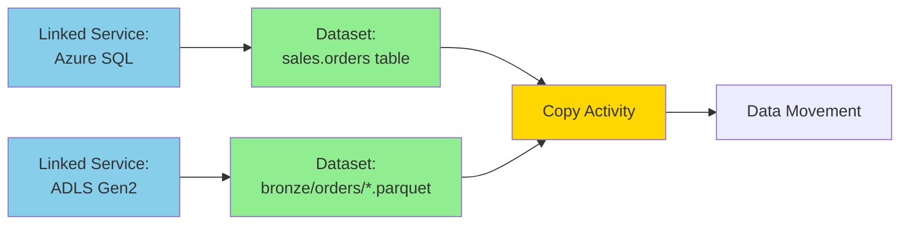

Scenario: Copy data from Azure SQL to ADLS Gen2

1. **Linked Service 1**: Defines connection to Azure SQL Database
2. **Dataset 1**: Points to `sales.orders` table using Linked Service 1
3. **Linked Service 2**: Defines connection to ADLS Gen2
4. **Dataset 2**: Points to `bronze/orders/` folder using Linked Service 2
5. **Copy Activity**: Uses Dataset 1 as source, Dataset 2 as sink

## 34.10 Parameterization for Reusability

## Why parameterize?

Instead of creating 100 datasets for 100 tables, create 1 parameterized dataset.

## Linked Service Parameters:

Rarely used, but possible for multi-tenant scenarios:
```json
{
    "name": "ls_sql_multitenant",
    "properties": {
        "parameters": {
            "pServerName": {
                "type": "string"
            },
            "pDatabaseName": {
                "type": "string"
            }
        },
        "typeProperties": {
            "connectionString": {
                "value": "Server=@{linkedService().pServerName};Database=@{linkedService().pDatabaseName};",
                "type": "Expression"
            }
        }
    }
}
```

## Dataset Parameters (Common):

```json
{
    "name": "ds_sql_generic",
    "properties": {
        "parameters": {
            "pSchemaName": {
                "type": "string"
            },
            "pTableName": {
                "type": "string"
            }
        },
        "typeProperties": {
            "schema": {
                "value": "@dataset().pSchemaName",
                "type": "Expression"
            },
            "table": {
                "value": "@dataset().pTableName",
                "type": "Expression"
            }
        }
    }
}
```

Usage in pipeline:
```json
{
    "name": "Copy Orders",
    "type": "Copy",
    "inputs": [
        {
            "referenceName": "ds_sql_generic",
            "type": "DatasetReference",
            "parameters": {
                "pSchemaName": "sales",
                "pTableName": "orders"
            }
        }
    ]
}
```

## 34.11 Best Practices

## Linked Service Best Practices:

1. **Use Managed Identity** where possible (Azure-to-Azure)
   - No credential management
   - Automatic rotation
   - Better security

2. **Store secrets in Key Vault**
   - Never hardcode passwords in linked services
   - Centralized secret management

3. **Naming conventions**
   - `ls_<system>_<environment>_<purpose>`
   - Example: `ls_azuresql_prod_sales`

4. **One linked service per environment**
   - Don't mix dev/test/prod in one linked service
   - Use parameters or separate linked services per environment

5. **Test connection** before saving
   - Always validate connectivity

6. **Document purpose**
   - Add descriptions to linked services
   - Note which pipelines use them

## Dataset Best Practices:

1. **Parameterize for reusability**
   - Use parameters for dynamic table/file names
   - Reduces dataset proliferation

2. **Define schema when possible**
   - Helps with validation
   - Improves performance (no inference needed)
   - Documents data structure

3. **Use meaningful names**
   - `ds_<source/sink>_<entity>_<format>`
   - Example: `ds_adls_orders_parquet`

4. **Organize by purpose**
   - Group in folders: sources, sinks, staging

5. **Include format details**
   - Specify delimiters, encoding, compression
   - Don't rely on auto-detection in production

## 34.12 Common Patterns and Use Cases

## Pattern 1: Metadata-Driven Ingestion

One parameterized dataset + config table:

Config table:
| source_schema | source_table | target_path |
|--------------|-------------|------------|
| sales | orders | bronze/sales/orders |
| sales | customers | bronze/sales/customers |
| hr | employees | bronze/hr/employees |

Generic dataset uses parameters passed from config loop.

## Pattern 2: Multi-Format Support

Different datasets for same data in different formats:
- `ds_orders_csv` (for raw ingestion)
- `ds_orders_parquet` (for optimized storage)
- `ds_orders_delta` (for ACID transactions)

All use same linked service, different format/location.

## Pattern 3: Environment Promotion

Use dataset/linked service parameters or global parameters for environment-specific values:
- Dev: `server-dev.database.windows.net`
- Test: `server-test.database.windows.net`
- Prod: `server-prod.database.windows.net`

## 34.13 Linked Service Authentication Methods

## 1. Managed Identity (Recommended)
- ADF has system or user-assigned identity
- Grant identity RBAC roles on target resources
- No credentials to manage

## 2. Service Principal
- Azure AD application registration
- Client ID + secret/certificate
- More control, requires secret management

## 3. Account Key
- Storage account access key
- Simple but less secure
- Store in Key Vault

## 4. SAS Token
- Shared Access Signature with scoped permissions
- Time-limited access
- Useful for third-party access

## 5. SQL Authentication
- Username + password for SQL databases
- Store password in Key Vault

## 6. OAuth/Token-based
- For SaaS connectors (Salesforce, Dynamics, etc.)
- Requires app registration and consent

## 34.14 Dataset Schema Handling

## Option 1: Define Schema
Explicitly list columns and types.

Pros:
- Type safety
- Documentation
- Better validation

Cons:
- Manual maintenance
- Schema drift issues

## Option 2: Schema Inference
Let ADF detect schema automatically.

Pros:
- Less maintenance
- Handles schema drift

Cons:
- Performance overhead (reads data to infer)
- Less validation

## Option 3: Schema Drift (Data Flow)
Enable schema drift in Mapping Data Flows.

Pros:
- Handles unexpected columns
- Flexible transformations

Cons:
- Requires careful mapping logic

## 34.15 Integration Runtime Consideration

Linked services specify which IR to use:

- **Azure IR**: Default, cloud-based, fully managed
  - Use for Azure-to-Azure
  - Public endpoints

- **Self-hosted IR**: On-prem or private network
  - Use for on-prem sources
  - Private endpoints
  - Requires VM/server setup

- **SSIS IR**: For SSIS package execution
  - Lift-and-shift SSIS workloads

## 34.16 Troubleshooting Common Issues

## Issue 1: "Cannot connect to linked service"
Checklist:
- Firewall rules allow ADF IP ranges
- Credentials are correct and not expired
- Managed Identity has proper RBAC roles
- Integration Runtime is running (for SHIR)

## Issue 2: "Dataset not found"
Checklist:
- Table/file actually exists
- Path/name is correct (case-sensitive for storage)
- Permissions allow read access
- Parameters are passed correctly

## Issue 3: "Schema mismatch"
Checklist:
- Source and sink schemas compatible
- Data types match or can be converted
- Column mappings are correct
- Schema drift settings

## Issue 4: "Authentication failed"
Checklist:
- Managed Identity enabled on ADF
- RBAC roles assigned correctly
- Key Vault secrets accessible
- Service Principal not expired

## 34.17 Interview Questions

1. **What is the difference between a Linked Service and a Dataset?**
   - Linked Service is a connection definition to a system; Dataset is a reference to specific data within that system using a Linked Service.

2. **Can one Linked Service be used by multiple Datasets?**
   - Yes. One Linked Service (e.g., to Azure SQL) can be referenced by many datasets pointing to different tables.

3. **What authentication method is recommended for Azure-to-Azure connections?**
   - Managed Identity, because it eliminates credential management and provides automatic rotation.

4. **How do you make a Dataset reusable for multiple tables?**
   - Use dataset parameters to pass table name, schema, or file path dynamically at runtime.

5. **Where should you store passwords for Linked Services?**
   - In Azure Key Vault, and reference the secret from the Linked Service.

6. **What is the purpose of Integration Runtime in a Linked Service?**
   - It defines the compute infrastructure used to establish the connection (Azure IR for cloud, SHIR for on-prem).

7. **Can you change a Linked Service while a pipeline is running?**
   - No. Linked Services are immutable during execution; changes require republishing and rerunning.

8. **What is schema drift in Datasets?**
   - The ability to handle source data with evolving/changing schema without explicitly defining columns.

9. **How many Linked Services should you create for dev, test, and prod?**
   - Separate Linked Services per environment for clear isolation, or use parameterization with environment-specific values.

10. **What dataset types are available in ADF?**
    - Many: AzureSqlTable, DelimitedText, Parquet, Json, Binary, Avro, Excel, Orc, and 100+ connector-specific types.

## 34.18 Real-World Example: Complete Setup

Scenario: Copy sales data from Azure SQL to ADLS Gen2 daily.

**Step 1: Create Linked Services**

```json
// Linked Service 1: Azure SQL
{
    "name": "ls_azuresql_prod",
    "type": "AzureSqlDatabase",
    "properties": {
        "typeProperties": {
            "connectionString": "Server=tcp:prodserver.database.windows.net,1433;Database=SalesDB;",
            "authenticationType": "ManagedIdentity"
        }
    }
}

// Linked Service 2: ADLS Gen2
{
    "name": "ls_adls_prod",
    "type": "AzureBlobFS",
    "properties": {
        "typeProperties": {
            "url": "https://prodlake.dfs.core.windows.net",
            "authenticationType": "ManagedIdentity"
        }
    }
}
```

**Step 2: Create Datasets**

```json
// Source Dataset: SQL Table
{
    "name": "ds_sql_sales_orders",
    "properties": {
        "linkedServiceName": {
            "referenceName": "ls_azuresql_prod",
            "type": "LinkedServiceReference"
        },
        "type": "AzureSqlTable",
        "typeProperties": {
            "schema": "sales",
            "table": "orders"
        }
    }
}

// Sink Dataset: Parquet File
{
    "name": "ds_adls_bronze_orders",
    "properties": {
        "linkedServiceName": {
            "referenceName": "ls_adls_prod",
            "type": "LinkedServiceReference"
        },
        "type": "Parquet",
        "typeProperties": {
            "location": {
                "type": "AzureBlobFSLocation",
                "fileSystem": "bronze",
                "folderPath": "sales/orders"
            }
        }
    }
}
```

**Step 3: Use in Copy Activity**

```json
{
    "name": "Copy Sales Orders",
    "type": "Copy",
    "inputs": [
        {
            "referenceName": "ds_sql_sales_orders",
            "type": "DatasetReference"
        }
    ],
    "outputs": [
        {
            "referenceName": "ds_adls_bronze_orders",
            "type": "DatasetReference"
        }
    ],
    "typeProperties": {
        "source": {
            "type": "AzureSqlSource"
        },
        "sink": {
            "type": "ParquetSink"
        }
    }
}
```

## 34.19 Summary and Quick Reference

**Linked Service:**
- **What**: Connection configuration
- **Contains**: Endpoint, authentication, IR
- **Example**: Connection to Azure SQL server
- **Reusability**: Used by multiple datasets

**Dataset:**
- **What**: Data location reference
- **Contains**: Table/file path, format, schema
- **Example**: Specific table in Azure SQL
- **Reusability**: Used by activities

**Together:**
- Linked Service defines **HOW** to connect
- Dataset defines **WHAT** to access
- Activity defines **WHAT TO DO** with the data

**Decision Matrix:**
- Need to change server/account? → Modify Linked Service
- Need to change table/file? → Modify Dataset
- Need to change operation? → Modify Activity

## 35. Azure Data Factory UI - Author, Monitor, and Manage Tabs

## 35.1 Overview of ADF Studio Interface

Azure Data Factory Studio is the web-based UI for building, managing, and monitoring data integration solutions. It has **three main tabs** that organize all ADF capabilities:

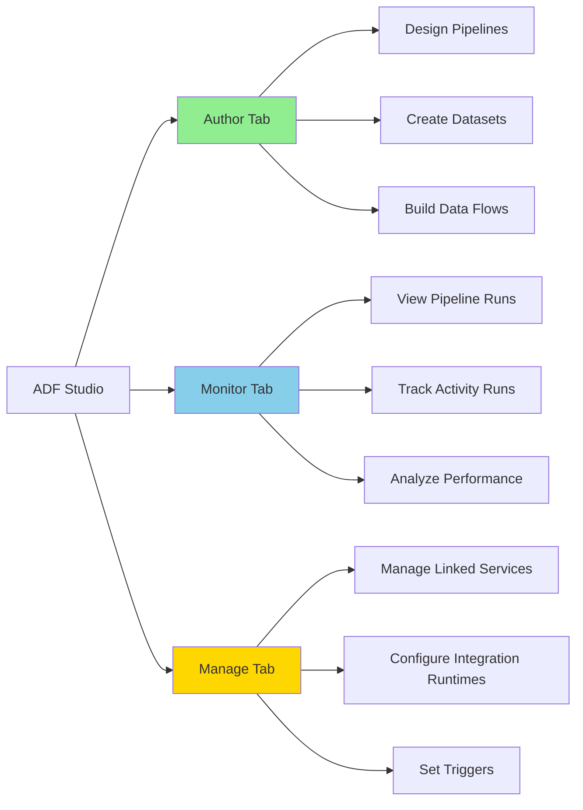

Think of it as:
- **Author** = Development environment (where you build)
- **Monitor** = Operations dashboard (where you track)
- **Manage** = Configuration center (where you configure infrastructure)

## 35.2 Author Tab - Development Environment

## Purpose:
The **Author** tab is where you **design and build** all data integration artifacts.

Think of it as: **Your IDE for data pipelines.**

## What you can do in Author tab:

### 1. Pipelines
- Create new pipelines
- Design workflow logic using drag-and-drop canvas
- Add activities (Copy, Data Flow, Lookup, ForEach, etc.)
- Configure activity dependencies and control flow
- Set pipeline parameters and variables
- Debug pipelines before publishing

### 2. Datasets
- Create dataset definitions
- Configure source/sink structures
- Define schema and format settings
- Add dataset parameters for reusability

### 3. Data Flows
- Build visual transformation logic
- Design complex ETL/ELT workflows
- Configure sources, transformations, and sinks
- Optimize performance settings
- Preview data during development

### 4. Power Query (Wrangling Data Flows)
- Interactive data preparation
- Excel-like experience for data cleansing
- Generate Power Query M code

### 5. Notebooks (if integrated with Synapse)
- Write Spark code
- Execute data transformations
- Integrate with pipelines

## Author Tab Structure:

```
Author Tab
├── Factory Resources (left panel)
│   ├── Pipelines
│   │   ├── pl_ingestion_daily
│   │   ├── pl_transformation
│   │   └── pl_master_orchestration
│   ├── Datasets
│   │   ├── ds_sql_orders
│   │   ├── ds_adls_bronze
│   │   └── ds_adls_silver
│   ├── Data flows
│   │   ├── df_clean_orders
│   │   └── df_aggregate_sales
│   └── Power Query
│       └── pq_customer_prep
│
├── Canvas (center panel)
│   └── Visual design area for selected artifact
│
└── Properties (right panel)
    ├── General settings
    ├── Parameters
    ├── Variables
    └── Activity-specific configurations
```

## Key Features in Author Tab:

### Debug Mode
- Run pipeline without publishing
- Set breakpoints
- View intermediate outputs
- Test with sample data
- Faster iteration during development

### Validate
- Check for configuration errors
- Validate expressions
- Ensure required fields are filled
- Pre-publish validation

### Publish
- Save changes to ADF service
- Generate ARM templates (if Git mode enabled)
- Make artifacts available for triggers

### Code View (JSON)
- View/edit raw JSON definitions
- Useful for advanced configurations
- Copy/paste artifact definitions
- Version control integration

## 35.3 Monitor Tab - Operations Dashboard

## Purpose:
The **Monitor** tab is where you **track, observe, and troubleshoot** pipeline executions.

Think of it as: **Your operations control center.**

## What you can do in Monitor tab:

### 1. Pipeline Runs
- View all pipeline executions (triggered and debug)
- Filter by status (Succeeded, Failed, In Progress, Cancelled)
- Filter by time range, pipeline name, trigger type
- See start time, end time, duration
- Drill into failed runs for error details

### 2. Activity Runs
- Drill down from pipeline run to see individual activities
- View activity-level status, duration, and output
- Access detailed error messages
- See data read/written metrics
- View activity input/output JSON

### 3. Trigger Runs
- View all trigger executions
- See which triggers fired and when
- Check trigger success/failure status
- Verify schedule accuracy

### 4. Integration Runtime Monitoring
- Monitor IR health and status
- View node information (for SHIR)
- Check capacity and utilization
- See active job counts

### 5. Data Flow Debug
- Monitor debug sessions
- Track debug cluster status
- View execution time and resource usage

### 6. Alerts and Metrics
- View configured alerts
- Check alert firing history
- Monitor key metrics (success rate, duration, failures)

## Monitor Tab Structure:

```
Monitor Tab
├── Pipeline runs (main view)
│   ├── Filters
│   │   ├── Status
│   │   ├── Pipeline name
│   │   ├── Trigger type
│   │   └── Time range
│   ├── Run list
│   │   ├── Run ID
│   │   ├── Pipeline name
│   │   ├── Status
│   │   ├── Start/End time
│   │   ├── Duration
│   │   └── Triggered by
│   └── Actions
│       ├── Rerun
│       ├── View details
│       └── Cancel (if running)
│
├── Activity runs (drill-down)
│   ├── Activity name
│   ├── Status
│   ├── Duration
│   ├── Input/Output
│   └── Error details
│
├── Trigger runs
│   └── Trigger execution history
│
└── Integration runtime
    └── IR health and metrics
```

## Key Features in Monitor Tab:

### Gantt View
- Visual timeline of activity execution
- See parallel vs sequential execution
- Identify bottlenecks
- Optimize pipeline performance

### Rerun Failed Activities
- Restart from failed activity (not from beginning)
- Save time on long pipelines
- Preserve partial success

### Consumption Report
- View DIU (Data Integration Units) usage
- Track cost per pipeline run
- Identify expensive operations

### Run Annotations
- Add custom tags to pipeline runs
- Easier filtering and organization
- Business context tracking

## 35.4 Manage Tab - Configuration Center

## Purpose:
The **Manage** tab is where you **configure infrastructure, connections, and runtime settings**.

Think of it as: **Your admin control panel.**

## What you can do in Manage tab:

### 1. Linked Services
- Create/edit connections to data sources
- Configure authentication methods
- Test connectivity
- Reference Key Vault secrets
- Specify Integration Runtime for each connection

### 2. Integration Runtimes
- Create and configure Azure IR, SHIR, SSIS IR
- Set up HA for Self-hosted IR
- Configure network and security settings
- Monitor IR health
- Update SHIR versions

### 3. Triggers
- Create schedule triggers
- Configure tumbling window triggers
- Set up event-based triggers (blob creation, etc.)
- Start/stop triggers
- View trigger associations with pipelines

### 4. Global Parameters
- Define factory-level parameters
- Configure environment-specific values
- Override in different environments (dev/test/prod)

### 5. Git Configuration
- Connect to Azure DevOps or GitHub
- Set collaboration branch
- Configure publish branch
- Define root folder
- Enable CI/CD workflows

### 6. Credentials
- Manage user-assigned managed identities
- Store and reference credentials

### 7. Parameterization Template
- Define ARM template parameter overrides
- Configure environment promotion logic

### 8. Security and Access Control (RBAC)
- Not directly in Manage tab, but accessed via Azure Portal
- Configure who can author/publish/monitor

## Manage Tab Structure:

```
Manage Tab
├── Linked services
│   ├── ls_azuresql_prod
│   ├── ls_adls_gen2
│   └── ls_onprem_sqlserver
│
├── Integration runtimes
│   ├── AutoResolveIntegrationRuntime (default Azure IR)
│   ├── SelfHostedIR-OnPrem
│   └── SSIS-IR-EU
│
├── Triggers
│   ├── tr_daily_schedule
│   ├── tr_hourly_tumbling
│   └── tr_blob_event
│
├── Global parameters
│   ├── param_environment
│   ├── param_storage_account
│   └── param_key_vault_url
│
├── Git configuration
│   └── Azure DevOps / GitHub settings
│
└── Credentials
    └── User-assigned managed identities
```

## Key Features in Manage Tab:

### Centralized Connection Management
- All linked services in one place
- Easy to update endpoints during environment promotion
- Test connections before use

### IR Health Monitoring
- Real-time status of integration runtimes
- Automatic updates for Azure IR
- Manual upgrade notifications for SHIR

### Trigger Control
- Start/stop triggers without deleting
- Pause during maintenance
- View which pipelines each trigger activates

### Global Parameters for CI/CD
- Environment-specific configuration
- No hardcoding in pipelines
- Easy override during deployment

## 35.5 Navigation Flow and Common Workflows

## Workflow 1: Creating a New Pipeline (Author → Monitor)

1. **Author Tab**: Create pipeline, add activities, configure settings
2. **Author Tab**: Debug pipeline to test logic
3. **Author Tab**: Publish pipeline to ADF service
4. **Manage Tab**: Create/start trigger to schedule execution
5. **Monitor Tab**: Verify pipeline runs successfully

## Workflow 2: Troubleshooting Failed Pipeline (Monitor → Author)

1. **Monitor Tab**: Notice failed pipeline run
2. **Monitor Tab**: Drill into activity runs to find failure
3. **Monitor Tab**: Review error message and output JSON
4. **Author Tab**: Open pipeline to fix issue
5. **Author Tab**: Debug with corrected logic
6. **Author Tab**: Publish fix
7. **Monitor Tab**: Rerun from failed activity

## Workflow 3: Adding New Data Source (Manage → Author)

1. **Manage Tab**: Create new linked service to data source
2. **Manage Tab**: Test connection
3. **Author Tab**: Create dataset using the linked service
4. **Author Tab**: Build pipeline using the dataset
5. **Author Tab**: Debug and publish

## Workflow 4: Environment Promotion (Manage → Author)

1. **Manage Tab**: Configure global parameters for environment
2. **Author Tab**: Develop using parameterized linked services/datasets
3. **Author Tab**: Publish to dev environment
4. **Manage Tab**: Export ARM template
5. **Deploy**: Use CI/CD to deploy to test/prod
6. **Manage Tab**: Override global parameters in target environment
7. **Monitor Tab**: Validate execution in new environment

## 35.6 Visual Comparison of the Three Tabs

| Aspect | Author Tab | Monitor Tab | Manage Tab |
|--------|-----------|-------------|------------|
| **Primary Role** | Development | Operations | Configuration |
| **Main Users** | Data Engineers, Developers | Operations, Support Teams | Platform Admins, DevOps |
| **Frequency of Use** | Daily (during dev) | Daily (for monitoring) | Occasional (initial setup, changes) |
| **Key Activities** | Build, design, test | Track, troubleshoot, analyze | Configure, connect, manage |
| **Artifacts Created** | Pipelines, Datasets, Data Flows | None (read-only) | Linked Services, Triggers, IRs |
| **Impact** | Logic and transformations | Observability | Infrastructure and connectivity |
| **When to Use** | Building new features | Checking production health | Setting up connections, triggers |
| **Analogy** | Code editor (VS Code) | Application monitoring (App Insights) | Server configuration (IIS admin) |

## 35.7 Permissions and Access Control

Different roles have different access to tabs:

### Data Factory Contributor
- **Author**: Full access (create, edit, debug, publish)
- **Monitor**: Full access (view all runs, rerun)
- **Manage**: Full access (create/edit linked services, triggers, IRs)

### Data Factory Operator
- **Author**: Limited/No access (cannot publish)
- **Monitor**: Full access (view runs, rerun)
- **Manage**: Limited access (view only, cannot create/edit)

### Reader
- **Author**: Read-only (view artifacts but cannot edit)
- **Monitor**: Read-only (view runs but cannot rerun)
- **Manage**: Read-only (view configurations)

Custom roles can be created for granular control.

## 35.8 Best Practices for Each Tab

## Author Tab Best Practices:

1. **Use Debug Mode extensively**
   - Test before publishing
   - Validate with small data samples
   - Catch errors early

2. **Organize with folders**
   - Group pipelines by domain/project
   - Use clear naming conventions
   - Keep related artifacts together

3. **Add descriptions**
   - Document pipeline purpose
   - Explain complex logic
   - Help team understand intent

4. **Validate before publishing**
   - Use built-in validation
   - Check for errors and warnings
   - Review JSON for mistakes

5. **Version control with Git**
   - Enable Git integration
   - Commit meaningful changes
   - Use feature branches for development

## Monitor Tab Best Practices:

1. **Set up alerts**
   - Alert on pipeline failures
   - Monitor SLA breaches
   - Track cost anomalies

2. **Regular health checks**
   - Review failed runs daily
   - Identify patterns in failures
   - Proactive issue resolution

3. **Use filters effectively**
   - Save common filter combinations
   - Filter by time windows for analysis
   - Focus on critical pipelines

4. **Document incident resolutions**
   - Note error codes and fixes
   - Build runbook knowledge
   - Share with team

5. **Analyze performance trends**
   - Track duration over time
   - Identify degrading performance
   - Optimize slow pipelines

## Manage Tab Best Practices:

1. **Use Managed Identity**
   - Avoid storing credentials
   - Enable for all Azure-to-Azure connections
   - Simplify credential management

2. **Store secrets in Key Vault**
   - Never hardcode passwords
   - Centralize secret management
   - Enable secret rotation

3. **Document linked services**
   - Add descriptions explaining purpose
   - Note which pipelines use them
   - Track ownership

4. **Test connections regularly**
   - Verify connectivity after changes
   - Check before production deployment
   - Validate firewall rules

5. **Use global parameters for environments**
   - Define once, override per environment
   - Reduce hardcoding
   - Simplify CI/CD

## 35.9 Common Tasks by Tab

## Author Tab - Common Tasks:
- Create new pipeline
- Add Copy Activity to move data
- Configure ForEach loop for metadata-driven ingestion
- Build Mapping Data Flow for transformations
- Set pipeline parameters for reusability
- Debug pipeline with test data
- Publish changes to ADF service
- Clone existing pipeline as template
- Import pipeline from JSON

## Monitor Tab - Common Tasks:
- Check if nightly batch completed successfully
- Investigate why a pipeline failed
- Rerun failed pipeline
- View data movement metrics (rows copied, MB transferred)
- Analyze pipeline duration trends
- Check trigger execution history
- Monitor Integration Runtime health
- Export run history for reporting
- Set up alert rules

## Manage Tab - Common Tasks:
- Add new linked service for data source
- Configure Self-hosted Integration Runtime
- Create daily schedule trigger
- Start/stop triggers for maintenance
- Update linked service credentials
- Configure global parameters for environment
- Set up Git integration
- Test linked service connectivity
- Create event trigger for blob arrival
- Configure user-assigned managed identity

## 35.10 UI Navigation Tips and Shortcuts

## Quick Navigation:
- **Ctrl + /** (Windows) or **Cmd + /** (Mac): Open command palette
- **Search bar**: Quickly find artifacts by name
- **Breadcrumbs**: Navigate back through opened artifacts
- **Recent items**: Access recently edited artifacts

## Efficiency Tips:
- **Clone artifacts**: Right-click to duplicate pipelines/datasets
- **Multi-select**: Select multiple items for batch operations
- **Drag and drop**: In pipeline canvas for quick activity addition
- **JSON view**: Use for advanced configurations and bulk edits
- **Code snippets**: Copy JSON from one artifact to reuse in another

## 35.11 Integration Between Tabs

The three tabs work together seamlessly:

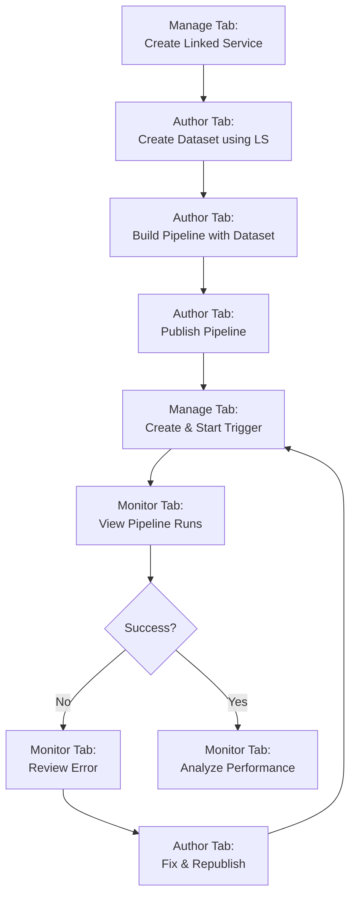

## 35.12 Interview Questions on ADF UI

1. **What are the three main tabs in Azure Data Factory Studio?**
   - Author, Monitor, and Manage tabs, used for development, operations, and configuration respectively.

2. **What is the primary purpose of the Author tab?**
   - To design and build data integration artifacts like pipelines, datasets, and data flows.

3. **How do you test a pipeline before publishing?**
   - Use Debug mode in the Author tab to run the pipeline without publishing changes.

4. **Where do you create triggers in ADF UI?**
   - In the Manage tab under Triggers section.

5. **How do you investigate a failed pipeline run?**
   - Go to Monitor tab, find the failed run, drill into activity runs, and review error details and output JSON.

6. **What is stored in the Manage tab?**
   - Linked services, integration runtimes, triggers, global parameters, Git configuration, and credentials.

7. **Can you rerun a failed pipeline from the middle?**
   - Yes, in the Monitor tab you can rerun from the failed activity instead of restarting the entire pipeline.

8. **Where do you configure Git integration?**
   - In the Manage tab under Git configuration section.

9. **What is the difference between Debug and Publish in Author tab?**
   - Debug runs the pipeline temporarily without saving; Publish saves changes to ADF service and makes them available for triggers.

10. **How do you monitor Integration Runtime health?**
    - In the Monitor tab, under Integration runtimes section, or in the Manage tab for configuration.

## 35.13 Real-World Usage Scenario

Scenario: Daily workflow of a data engineer managing production ADF.

**Morning (9:00 AM) - Monitor Tab:**
- Check overnight pipeline runs
- Verify all critical pipelines succeeded
- Investigate any failures
- Rerun failed pipelines if transient issues

**Mid-Morning (10:00 AM) - Author Tab:**
- Work on new feature request
- Create new pipeline for additional data source
- Debug with sample data
- Peer review with colleague

**Noon (12:00 PM) - Manage Tab:**
- Add new linked service for upcoming data source
- Test connectivity
- Update Self-hosted IR on VM

**Afternoon (2:00 PM) - Author Tab:**
- Continue development
- Optimize slow-running data flow
- Add error handling to existing pipeline
- Publish tested changes

**Late Afternoon (4:00 PM) - Manage Tab:**
- Create schedule trigger for new pipeline
- Configure to run after existing dependencies
- Start trigger

**End of Day (5:00 PM) - Monitor Tab:**
- Verify new trigger fired correctly
- Check all pipelines green before leaving
- Set up alert for overnight runs

## 35.14 Quick Reference Summary

**Author Tab:**
- **Icon**: Pencil/Edit icon
- **Purpose**: Build and design
- **Key artifacts**: Pipelines, Datasets, Data Flows
- **Main action**: Publish
- **Who uses**: Data Engineers, Developers

**Monitor Tab:**
- **Icon**: Chart/Dashboard icon
- **Purpose**: Track and troubleshoot
- **Key views**: Pipeline runs, Activity runs, Trigger runs
- **Main action**: Rerun, Analyze
- **Who uses**: Operations, Support, Data Engineers

**Manage Tab:**
- **Icon**: Settings/Gear icon
- **Purpose**: Configure infrastructure
- **Key artifacts**: Linked Services, Integration Runtimes, Triggers
- **Main action**: Create, Configure
- **Who uses**: Admins, Platform Engineers, DevOps

**Remember:**
- **Author** = Where you BUILD
- **Monitor** = Where you WATCH
- **Manage** = Where you CONFIGURE

## 36. Copy Data Activity in Azure Data Factory - Complete Guide

## 36.1 What is Copy Data Activity?

## Definition:
The **Copy Data activity** is the primary data movement activity in ADF that moves data from a **source** to a **sink** (destination) across heterogeneous data stores.

Think of it as: **The core data mover in Azure Data Factory.**

## Purpose:
- Move data between supported data stores (100+ connectors)
- Perform simple transformations during copy
- Handle large-scale data movement efficiently
- Support both cloud and on-premises sources/sinks
- Enable parallel data loading for performance

## Key characteristics:
- Most commonly used activity in ADF
- Supports both structured and unstructured data
- Can handle format conversion (CSV → Parquet, JSON → SQL, etc.)
- Built-in fault tolerance and retry mechanisms
- Performance optimization through parallelism and partitioning

## 36.2 Copy Data Architecture

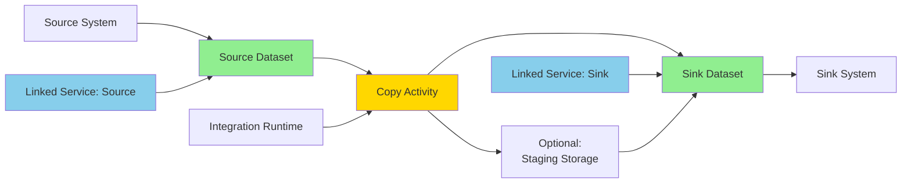

Components involved:
1. **Source Dataset**: Points to data to be copied
2. **Sink Dataset**: Points to destination location
3. **Source Linked Service**: Connection to source system
4. **Sink Linked Service**: Connection to sink system
5. **Integration Runtime**: Compute used for data movement
6. **Copy Activity**: Orchestrates the copy operation
7. **Staging Storage** (optional): Intermediate storage for performance

## 36.3 Copy Activity Configuration

Every Copy activity has these main sections:

### 1. Source
- **Dataset**: Which dataset to read from
- **Query/Filter**: SQL query, file pattern, or filter
- **Partition Options**: For parallel reading
- **Additional Properties**: Format-specific settings

### 2. Sink
- **Dataset**: Where to write data
- **Write Behavior**: Insert, upsert, merge, or replace
- **Pre/Post Scripts**: SQL to run before/after copy
- **Additional Properties**: Format-specific settings

### 3. Mapping
- **Column Mapping**: Source to sink column mapping
- **Data Type Conversion**: Automatic or manual type mapping
- **Schema Mapping**: Auto-detect or explicit mapping

### 4. Settings
- **Performance**: DIUs, parallel copies, staging
- **Fault Tolerance**: Skip incompatible rows/files
- **Data Validation**: Enable/disable validation
- **Logging**: Log copied files, skipped rows

## 36.4 Copy Activity JSON Structure

Basic structure:

```json
{
    "name": "CopyFromSqlToAdls",
    "type": "Copy",
    "dependsOn": [],
    "policy": {
        "timeout": "7.00:00:00",
        "retry": 2,
        "retryIntervalInSeconds": 30
    },
    "typeProperties": {
        "source": {
            "type": "AzureSqlSource",
            "sqlReaderQuery": "SELECT * FROM sales.orders WHERE order_date >= '2026-01-01'",
            "queryTimeout": "02:00:00",
            "partitionOption": "DynamicRange",
            "partitionSettings": {
                "partitionColumnName": "order_id",
                "partitionUpperBound": "1000000",
                "partitionLowerBound": "1"
            }
        },
        "sink": {
            "type": "ParquetSink",
            "storeSettings": {
                "type": "AzureBlobFSWriteSettings",
                "maxConcurrentConnections": 5
            },
            "formatSettings": {
                "type": "ParquetWriteSettings"
            }
        },
        "enableStaging": false,
        "parallelCopies": 4,
        "dataIntegrationUnits": 8,
        "enableSkipIncompatibleRow": true,
        "logSettings": {
            "enableCopyActivityLog": true,
            "copyActivityLogSettings": {
                "logLevel": "Warning",
                "enableReliableLogging": false
            }
        }
    },
    "inputs": [
        {
            "referenceName": "ds_azuresql_orders",
            "type": "DatasetReference"
        }
    ],
    "outputs": [
        {
            "referenceName": "ds_adls_bronze_orders_parquet",
            "type": "DatasetReference"
        }
    ]
}
```

## 36.5 Source Types and Options

## Common Source Types:

### 1. Azure SQL Source
```json
"source": {
    "type": "AzureSqlSource",
    "sqlReaderQuery": "SELECT * FROM schema.table WHERE modified_date > @{pipeline().parameters.lastRunDate}",
    "queryTimeout": "02:00:00",
    "partitionOption": "PhysicalPartitionsOfTable"
}
```

Options:
- Direct table read or custom query
- Stored procedure execution
- Partition-based reading for parallelism

### 2. Blob/ADLS Source
```json
"source": {
    "type": "DelimitedTextSource",
    "storeSettings": {
        "type": "AzureBlobFSReadSettings",
        "recursive": true,
        "wildcardFolderPath": "bronze/sales/*/2026",
        "wildcardFileName": "*.csv",
        "modifiedDatetimeStart": "2026-04-01T00:00:00Z",
        "modifiedDatetimeEnd": "2026-04-30T23:59:59Z"
    },
    "formatSettings": {
        "type": "DelimitedTextReadSettings",
        "skipLineCount": 1
    }
}
```

Options:
- Wildcard patterns for file selection
- Recursive folder traversal
- Modified date filtering
- Format-specific settings

### 3. REST API Source
```json
"source": {
    "type": "RestSource",
    "httpRequestTimeout": "00:01:40",
    "requestInterval": "00:00:01",
    "additionalHeaders": {
        "Authorization": "Bearer @{linkedService().token}"
    },
    "paginationRules": {
        "AbsoluteUrl": "$.nextLink"
    }
}
```

Options:
- Pagination handling
- Custom headers
- Request throttling

## 36.6 Sink Types and Write Behaviors

## Common Sink Types:

### 1. Azure SQL Sink
```json
"sink": {
    "type": "AzureSqlSink",
    "writeBehavior": "upsert",
    "upsertSettings": {
        "useTempDB": true,
        "keys": ["order_id"]
    },
    "sqlWriterStoredProcedureName": "sp_merge_orders",
    "sqlWriterTableType": "OrdersTableType",
    "preCopyScript": "TRUNCATE TABLE staging.orders",
    "tableOption": "autoCreate",
    "disableMetricsCollection": false
}
```

Write behaviors:
- **Insert**: Append rows (default)
- **Upsert**: Update if exists, insert if not
- **Stored Procedure**: Call custom merge logic
- **Pre/Post Scripts**: Run SQL before/after

### 2. Parquet/ADLS Sink
```json
"sink": {
    "type": "ParquetSink",
    "storeSettings": {
        "type": "AzureBlobFSWriteSettings",
        "maxConcurrentConnections": 10,
        "copyBehavior": "PreserveHierarchy"
    },
    "formatSettings": {
        "type": "ParquetWriteSettings",
        "maxRowsPerFile": 1000000,
        "fileNamePrefix": "orders_"
    }
}
```

Write behaviors:
- **PreserveHierarchy**: Maintain folder structure
- **FlattenHierarchy**: Flatten to single level
- **MergeFiles**: Combine into fewer files

### 3. Delta Lake Sink
```json
"sink": {
    "type": "AzureDatabricksDeltaLakeSink",
    "preCopyScript": "DELETE FROM table WHERE date = '2026-04-26'",
    "importSettings": {
        "type": "AzureDatabricksDeltaLakeImportCommand"
    }
}
```

## 36.7 Performance Optimization

## Key Performance Levers:

### 1. Data Integration Units (DIUs)
- Measure of compute power for copy activity
- Default: Auto (ADF determines optimal DIUs)
- Range: 2 to 256 DIUs
- Higher DIUs = faster copy (also higher cost)
- Most effective for cloud-to-cloud copies

**When to increase DIUs:**
- Large data volumes (GB to TB)
- Need to meet tight SLA
- Network is not the bottleneck

**Formula:**
```
Throughput ≈ DIUs × Parallel Copies × Source Read Speed
```

### 2. Parallel Copies
- Number of parallel threads to read/write
- Default: Auto-determined by ADF
- Can manually set (typically 2-32)
- Effective when source supports partitioning

**Best practice:**
```
Parallel Copies = Number of Source Partitions
```

### 3. Partition Options (Source)

For SQL sources:
- **None**: Single threaded read
- **Physical partitions**: Use table's existing partitions
- **Dynamic range**: ADF creates partitions based on column

Example configuration:
```json
"partitionOption": "DynamicRange",
"partitionSettings": {
    "partitionColumnName": "order_date",
    "partitionUpperBound": "2026-12-31",
    "partitionLowerBound": "2026-01-01",
    "partitionNames": null
}
```

For file sources:
- Use wildcard patterns to distribute files across threads
- Ensure files are roughly equal size

### 4. Staged Copy
Use intermediate blob storage for better performance:

```json
"enableStaging": true,
"stagingSettings": {
    "linkedServiceName": {
        "referenceName": "ls_staging_blob",
        "type": "LinkedServiceReference"
    },
    "path": "staging/temp",
    "enableCompression": true
}
```

**When to use staging:**
- Copying from on-prem to cloud (reduces SHIR load)
- Copying to Azure Synapse Analytics (uses PolyBase)
- Cross-region copies
- Format conversion with large data

### 5. Query Optimization
Push filters to source:

```sql
-- Good: Filter at source
SELECT * FROM orders WHERE order_date >= '2026-01-01'

-- Bad: Copy all, filter later
SELECT * FROM orders
```

## 36.8 Data Type Mapping

ADF automatically maps data types between source and sink:

| Source (SQL) | Sink (Parquet) | Notes |
|-------------|----------------|-------|
| INT | INT32 | Direct mapping |
| BIGINT | INT64 | Direct mapping |
| DECIMAL(18,2) | DECIMAL | Precision preserved |
| VARCHAR(MAX) | STRING | Character data |
| DATETIME | TIMESTAMP_MILLIS | Timezone considerations |
| BIT | BOOLEAN | True/False |
| VARBINARY | BINARY | Binary data |

Custom mapping example:
```json
"translator": {
    "type": "TabularTranslator",
    "mappings": [
        {
            "source": {
                "name": "order_id",
                "type": "Int32"
            },
            "sink": {
                "name": "orderId",
                "type": "Int64"
            }
        },
        {
            "source": {
                "name": "order_date",
                "type": "DateTime"
            },
            "sink": {
                "name": "orderTimestamp",
                "type": "String"
            }
        }
    ]
}
```

## 36.9 Fault Tolerance and Error Handling

## Skip Incompatible Rows
```json
"enableSkipIncompatibleRow": true,
"redirectIncompatibleRowSettings": {
    "linkedServiceName": {
        "referenceName": "ls_blob_errorlogs",
        "type": "LinkedServiceReference"
    },
    "path": "errors/copy-activity-logs"
}
```

What gets skipped:
- Schema mismatches (column count, type incompatibility)
- Data validation failures
- Constraint violations (if supported by sink)

## Logging
```json
"logSettings": {
    "enableCopyActivityLog": true,
    "copyActivityLogSettings": {
        "logLevel": "Info",
        "enableReliableLogging": true
    },
    "logLocationSettings": {
        "linkedServiceName": {
            "referenceName": "ls_blob_logs",
            "type": "LinkedServiceReference"
        },
        "path": "copy-logs/2026/04"
    }
}
```

Log levels:
- **Info**: Log all files/rows copied
- **Warning**: Log only errors and skipped items

## 36.10 Common Copy Patterns

## Pattern 1: Full Load
Copy entire table/dataset:

```json
"source": {
    "type": "AzureSqlSource",
    "sqlReaderQuery": "SELECT * FROM sales.orders"
}
```

Use cases:
- Initial data load
- Small reference tables
- Daily snapshot

## Pattern 2: Incremental Load (Watermark)
Copy only new/changed records:

```json
"source": {
    "type": "AzureSqlSource",
    "sqlReaderQuery": "SELECT * FROM sales.orders WHERE modified_date > '@{activity('LookupLastWatermark').output.firstRow.watermark}' AND modified_date <= '@{utcNow()}'"
}
```

Use cases:
- Daily delta loads
- Large tables
- Reduce data movement volume

## Pattern 3: Partitioned Copy
Parallel copy using partitions:

```json
"source": {
    "type": "AzureSqlSource",
    "partitionOption": "DynamicRange",
    "partitionSettings": {
        "partitionColumnName": "order_id",
        "partitionUpperBound": "10000000",
        "partitionLowerBound": "1"
    }
},
"parallelCopies": 8,
"dataIntegrationUnits": 16
```

Use cases:
- Very large tables (billions of rows)
- Need fast full load
- Source supports parallel reads

## Pattern 4: Binary Copy (File Migration)
Copy files as-is without parsing:

```json
"source": {
    "type": "BinarySource",
    "storeSettings": {
        "type": "AzureBlobStorageReadSettings",
        "recursive": true
    }
},
"sink": {
    "type": "BinarySink",
    "storeSettings": {
        "type": "AzureBlobFSWriteSettings",
        "copyBehavior": "PreserveHierarchy"
    }
}
```

Use cases:
- Cloud migration (copy files as-is)
- Backup scenarios
- Maximum performance (no parsing overhead)

## Pattern 5: Format Conversion
Convert data format during copy:

Source: CSV files
Sink: Parquet files

Benefits:
- Optimized storage (compression)
- Faster analytics queries
- Schema enforcement

## 36.11 Copy Activity Metrics and Output

After execution, Copy activity returns:

```json
{
    "dataRead": 524288000,           // Bytes read from source
    "dataWritten": 104857600,        // Bytes written to sink (compressed)
    "filesRead": 100,                // Number of files read
    "filesWritten": 10,              // Number of files written
    "rowsRead": 1000000,             // Rows read from source
    "rowsCopied": 995000,            // Rows successfully copied
    "rowsSkipped": 5000,             // Rows skipped due to errors
    "copyDuration": 120,             // Duration in seconds
    "throughput": 4096,              // KB/s
    "errors": [],                    // Error details if any
    "effectiveIntegrationRuntime": "AutoResolveIntegrationRuntime (East US)",
    "usedDataIntegrationUnits": 8,   // DIUs actually used
    "usedParallelCopies": 4,         // Parallel copies actually used
    "executionDetails": [
        {
            "source": {
                "type": "AzureSqlDatabase"
            },
            "sink": {
                "type": "AzureBlobFS"
            },
            "status": "Succeeded",
            "start": "2026-04-26T10:00:00Z",
            "duration": 120,
            "detailedDurations": {
                "queuingDuration": 2,
                "transferDuration": 118
            }
        }
    ]
}
```

Use these metrics to:
- Validate data volume
- Calculate cost
- Identify performance issues
- Track skipped rows

## 36.12 Best Practices

1. **Use partitioning for large tables**
   - Parallel reads significantly improve performance
   - Choose partition column with good distribution

2. **Push filters to source**
   - Filter in SQL query, not after copy
   - Reduces network transfer and processing

3. **Choose appropriate file format**
   - Parquet for analytics (columnar, compressed)
   - Delta for ACID transactions
   - CSV for interoperability

4. **Use staging for cross-region/complex copies**
   - Reduces load on SHIR
   - Enables PolyBase for Synapse
   - Better reliability

5. **Enable fault tolerance for large copies**
   - Skip incompatible rows
   - Log errors for investigation
   - Don't fail entire job for few bad rows

6. **Monitor DIU usage**
   - Start with auto, tune if needed
   - Higher DIU doesn't always mean faster
   - Network can be bottleneck

7. **Optimize file sizes**
   - Avoid many small files (metadata overhead)
   - Avoid single huge file (no parallelism)
   - Target 128MB - 1GB per file for analytics

8. **Use binary copy for migration**
   - When no transformation needed
   - Maximum throughput
   - Preserve exact file format

9. **Implement idempotent patterns**
   - Use upsert/merge for reruns
   - Avoid duplicate data on retries

10. **Log and monitor**
    - Enable copy activity logs
    - Track metrics over time
    - Set alerts for failures/slow runs

## 36.13 Common Issues and Troubleshooting

## Issue 1: Slow Copy Performance
**Symptoms**: Copy takes hours, low throughput

**Checklist:**
- [ ] Check DIU utilization (may be under-allocated)
- [ ] Verify parallel copies setting
- [ ] Check source query optimization (indexes, filters)
- [ ] Verify network bandwidth (especially for SHIR)
- [ ] Check if source is throttling reads
- [ ] Consider partitioning strategy
- [ ] Enable staging if cross-region

## Issue 2: Data Type Mismatch Errors
**Symptoms**: "Cannot convert from type X to type Y"

**Solutions:**
- Use explicit mapping with type conversion
- Adjust source query to cast types
- Enable skip incompatible rows for known issues
- Check for NULL handling

## Issue 3: Timeout Errors
**Symptoms**: Copy activity times out

**Solutions:**
- Increase timeout in policy settings
- Reduce data volume per copy (partition or incremental)
- Check source/sink availability
- Verify firewall rules
- Check SHIR resource capacity

## Issue 4: File Not Found
**Symptoms**: Source file doesn't exist

**Solutions:**
- Verify wildcard pattern matches actual files
- Check file path and container names (case-sensitive)
- Confirm modified date filters don't exclude all files
- Use Get Metadata activity to validate file existence first

## Issue 5: Authentication Failures
**Symptoms**: Cannot connect to source/sink

**Checklist:**
- [ ] Linked service credentials valid
- [ ] Managed Identity has proper RBAC roles
- [ ] Firewall allows ADF IP ranges
- [ ] Key Vault secrets accessible
- [ ] Service principal not expired

## 36.14 Interview Questions on Copy Data Activity

1. **What is the Copy Data activity in ADF?**
   - The primary data movement activity that copies data from source to sink across heterogeneous data stores with support for 100+ connectors.

2. **What are Data Integration Units (DIUs)?**
   - A measure of compute power allocated to the copy activity. Higher DIUs provide more resources for faster data movement.

3. **How can you improve Copy Activity performance?**
   - Increase DIUs, use parallel copies, enable source partitioning, use staging for complex scenarios, optimize source queries with filters, and choose efficient file formats.

4. **What is the difference between parallel copies and DIUs?**
   - DIUs control the compute power allocated; parallel copies control the number of concurrent threads. Both work together for optimal performance.

5. **When should you use staged copy?**
   - When copying from on-prem to cloud, copying to Azure Synapse (PolyBase), cross-region copies, or when doing format conversion with large volumes.

6. **What is fault tolerance in Copy Activity?**
   - The ability to skip incompatible rows and continue copying, with option to log skipped rows to a separate location for investigation.

7. **How do you implement incremental load with Copy Activity?**
   - Use watermark pattern: track last successful load timestamp, query only records modified after that timestamp, update watermark after successful copy.

8. **What is binary copy?**
   - Copying files as-is without parsing content, useful for migrations where maximum throughput and format preservation are needed.

9. **What write behaviors are available in SQL sinks?**
   - Insert (append), Upsert (merge), Stored Procedure (custom logic), and pre/post scripts for data preparation.

10. **How do you handle data type mismatches?**
    - Use explicit column mapping with type conversion, adjust source query to cast types, or enable skip incompatible rows for known issues.

## 36.15 Real-World Example: Complete Copy Activity

Scenario: Copy incremental sales data from Azure SQL to ADLS Gen2 in Parquet format

```json
{
    "name": "Copy_Incremental_Sales_SQL_to_ADLS",
    "type": "Copy",
    "dependsOn": [
        {
            "activity": "Lookup_Last_Watermark",
            "dependencyConditions": ["Succeeded"]
        }
    ],
    "policy": {
        "timeout": "0.12:00:00",
        "retry": 2,
        "retryIntervalInSeconds": 60
    },
    "userProperties": [
        {
            "name": "Source",
            "value": "sales.orders"
        },
        {
            "name": "Destination",
            "value": "bronze/sales/orders"
        }
    ],
    "typeProperties": {
        "source": {
            "type": "AzureSqlSource",
            "sqlReaderQuery": {
                "value": "SELECT order_id, customer_id, order_date, amount, status, modified_date FROM sales.orders WHERE modified_date > '@{activity('Lookup_Last_Watermark').output.firstRow.watermark}' AND modified_date <= '@{utcNow()}'",
                "type": "Expression"
            },
            "queryTimeout": "02:00:00",
            "partitionOption": "None"
        },
        "sink": {
            "type": "ParquetSink",
            "storeSettings": {
                "type": "AzureBlobFSWriteSettings",
                "maxConcurrentConnections": 5,
                "copyBehavior": "PreserveHierarchy"
            },
            "formatSettings": {
                "type": "ParquetWriteSettings",
                "maxRowsPerFile": 1000000,
                "fileNamePrefix": {
                    "value": "@concat('orders_', formatDateTime(utcNow(), 'yyyyMMddHHmmss'), '_')",
                    "type": "Expression"
                }
            }
        },
        "enableStaging": false,
        "parallelCopies": 4,
        "dataIntegrationUnits": 8,
        "enableSkipIncompatibleRow": true,
        "redirectIncompatibleRowSettings": {
            "linkedServiceName": {
                "referenceName": "ls_adls_errorlogs",
                "type": "LinkedServiceReference"
            },
            "path": "errors/sales-orders"
        },
        "logSettings": {
            "enableCopyActivityLog": true,
            "copyActivityLogSettings": {
                "logLevel": "Warning",
                "enableReliableLogging": false
            },
            "logLocationSettings": {
                "linkedServiceName": {
                    "referenceName": "ls_adls_copylogs",
                    "type": "LinkedServiceReference"
                },
                "path": "copy-logs/sales-orders"
            }
        },
        "translator": {
            "type": "TabularTranslator",
            "typeConversion": true,
            "typeConversionSettings": {
                "allowDataTruncation": false,
                "treatBooleanAsNumber": false
            }
        }
    },
    "inputs": [
        {
            "referenceName": "ds_azuresql_orders",
            "type": "DatasetReference"
        }
    ],
    "outputs": [
        {
            "referenceName": "ds_adls_bronze_orders_parquet",
            "type": "DatasetReference",
            "parameters": {
                "pFolderPath": {
                    "value": "@concat('sales/orders/dt=', formatDateTime(utcNow(), 'yyyy-MM-dd'))",
                    "type": "Expression"
                }
            }
        }
    ]
}
```

## 36.16 Quick Reference Summary

**Copy Data Activity:**
- **Purpose**: Move data from source to sink
- **Key components**: Source dataset, sink dataset, mapping, settings
- **Performance**: Controlled by DIUs, parallel copies, partitioning
- **Reliability**: Fault tolerance, retry, logging
- **Flexibility**: 100+ connectors, format conversion, data type mapping

**Performance Formula:**
```
Throughput = DIUs × Parallel Copies × Network Bandwidth × Source/Sink Performance
```

**When to use:**
- Data ingestion from any source
- Data migration between stores
- Format conversion (CSV → Parquet, JSON → SQL)
- Incremental or full loads
- Cross-cloud/hybrid data movement

**Remember:**
- Copy Activity = Data Mover (not transformer)
- For complex transformations, use Mapping Data Flow
- Optimize source queries before copying
- Monitor metrics to tune performance
- Enable fault tolerance for production workloads

## 37. Get Metadata Activity in Azure Data Factory - Complete Guide

## 37.1 What is Get Metadata Activity?

## Definition:
The **Get Metadata activity** retrieves metadata information about data stored in various data stores without actually reading the data itself.

Think of it as: **A lightweight inspection tool that checks file/folder properties before processing.**

## Purpose:
- Check if files/folders exist before processing
- Retrieve file properties (size, modified date, count)
- Validate data structure before pipeline execution
- Enable dynamic pipeline logic based on metadata
- Implement data quality checks and validation gates

## Key characteristics:
- Control flow activity (not data movement)
- Fast execution (doesn't read actual data content)
- Returns metadata as output for downstream activities
- Supports multiple data stores (ADLS, Blob, SQL, etc.)
- Essential for conditional pipeline logic

## 37.2 Get Metadata vs Other Activities

| Activity | Purpose | Reads Data | Use Case |
|----------|---------|-----------|----------|
| **Get Metadata** | Retrieve properties | No | Check file existence, size, count |
| **Lookup** | Retrieve data rows | Yes | Read config table, watermark values |
| **Copy** | Move data | Yes | Transfer data between stores |
| **Data Flow** | Transform data | Yes | Complex transformations |

**Key insight**: Get Metadata is faster than Lookup when you only need file/folder properties, not actual data.

## 37.3 Get Metadata Architecture

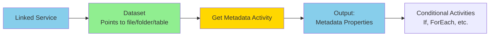

## 37.4 Supported Metadata Fields

## For File-based Data Stores (Blob, ADLS, FTP, etc.):

| Field Name | Description | Output Type | Example Value |
|------------|-------------|-------------|---------------|
| **exists** | Whether file/folder exists | Boolean | true |
| **itemName** | Name of file or folder | String | "sales_data.csv" |
| **itemType** | File or Folder | String | "File" |
| **size** | Size in bytes | Integer | 1048576 |
| **created** | Creation timestamp | DateTime | "2026-04-26T10:00:00Z" |
| **lastModified** | Last modified timestamp | DateTime | "2026-04-26T15:30:00Z" |
| **childItems** | List of files/folders inside | Array | ["file1.csv", "file2.csv"] |
| **contentMD5** | MD5 hash of file | String | "5d41402abc4b2a76b9719d911017c592" |
| **structure** | Schema/column structure | Array | Column names and types |

## For Database Data Stores (SQL, Cosmos DB, etc.):

| Field Name | Description | Output Type |
|------------|-------------|-------------|
| **exists** | Whether table exists | Boolean |
| **tableName** | Name of the table | String |
| **structure** | Column schema | Array |
| **columnCount** | Number of columns | Integer |

## 37.5 Get Metadata Activity Configuration

Basic JSON structure:

```json
{
    "name": "GetFileMetadata",
    "type": "GetMetadata",
    "dependsOn": [],
    "policy": {
        "timeout": "7.00:00:00",
        "retry": 0,
        "retryIntervalInSeconds": 30
    },
    "userProperties": [],
    "typeProperties": {
        "dataset": {
            "referenceName": "ds_adls_input_files",
            "type": "DatasetReference",
            "parameters": {
                "pFolderPath": {
                    "value": "@pipeline().parameters.inputFolder",
                    "type": "Expression"
                }
            }
        },
        "fieldList": [
            "exists",
            "itemName",
            "lastModified",
            "size",
            "childItems"
        ],
        "storeSettings": {
            "type": "AzureBlobFSReadSettings",
            "recursive": true,
            "enablePartitionDiscovery": false
        },
        "formatSettings": {
            "type": "DelimitedTextReadSettings"
        }
    }
}
```

## 37.6 Common Use Cases and Examples

## Use Case 1: Check if File Exists Before Processing

**Scenario**: Only run copy if source file exists

```json
{
    "name": "Check_File_Exists",
    "type": "GetMetadata",
    "typeProperties": {
        "dataset": {
            "referenceName": "ds_source_file",
            "type": "DatasetReference"
        },
        "fieldList": ["exists"]
    }
}
```

Followed by If Condition:
```json
{
    "name": "If_File_Exists",
    "type": "IfCondition",
    "dependsOn": [
        {
            "activity": "Check_File_Exists",
            "dependencyConditions": ["Succeeded"]
        }
    ],
    "typeProperties": {
        "expression": {
            "value": "@activity('Check_File_Exists').output.exists",
            "type": "Expression"
        },
        "ifTrueActivities": [
            {
                "name": "Copy_File",
                "type": "Copy",
                "...": "..."
            }
        ],
        "ifFalseActivities": [
            {
                "name": "Send_Alert_Missing_File",
                "type": "Web",
                "...": "..."
            }
        ]
    }
}
```

## Use Case 2: Get List of Files for ForEach Loop

**Scenario**: Process all CSV files in a folder

```json
{
    "name": "Get_File_List",
    "type": "GetMetadata",
    "typeProperties": {
        "dataset": {
            "referenceName": "ds_input_folder",
            "type": "DatasetReference"
        },
        "fieldList": ["childItems"],
        "storeSettings": {
            "type": "AzureBlobFSReadSettings",
            "recursive": false
        }
    }
}
```

Followed by Filter and ForEach:
```json
{
    "name": "Filter_CSV_Files",
    "type": "Filter",
    "dependsOn": [
        {
            "activity": "Get_File_List",
            "dependencyConditions": ["Succeeded"]
        }
    ],
    "typeProperties": {
        "items": {
            "value": "@activity('Get_File_List').output.childItems",
            "type": "Expression"
        },
        "condition": {
            "value": "@endswith(item().name, '.csv')",
            "type": "Expression"
        }
    }
},
{
    "name": "ForEach_CSV_File",
    "type": "ForEach",
    "dependsOn": [
        {
            "activity": "Filter_CSV_Files",
            "dependencyConditions": ["Succeeded"]
        }
    ],
    "typeProperties": {
        "items": {
            "value": "@activity('Filter_CSV_Files').output.value",
            "type": "Expression"
        },
        "activities": [
            {
                "name": "Process_File",
                "type": "Copy",
                "...": "..."
            }
        ]
    }
}
```

## Use Case 3: Validate File Size Before Processing

**Scenario**: Skip processing if file is empty or too small

```json
{
    "name": "Get_File_Size",
    "type": "GetMetadata",
    "typeProperties": {
        "dataset": {
            "referenceName": "ds_source_file",
            "type": "DatasetReference"
        },
        "fieldList": ["size", "itemName"]
    }
}
```

Followed by If Condition:
```json
{
    "name": "If_File_Valid_Size",
    "type": "IfCondition",
    "typeProperties": {
        "expression": {
            "value": "@greater(activity('Get_File_Size').output.size, 1024)",
            "type": "Expression"
        },
        "ifTrueActivities": [
            {
                "name": "Process_File",
                "type": "Copy"
            }
        ],
        "ifFalseActivities": [
            {
                "name": "Log_Empty_File",
                "type": "Web"
            }
        ]
    }
}
```

## Use Case 4: Check Last Modified Date for Incremental Processing

**Scenario**: Only process files modified today

```json
{
    "name": "Get_Last_Modified",
    "type": "GetMetadata",
    "typeProperties": {
        "dataset": {
            "referenceName": "ds_source_file",
            "type": "DatasetReference"
        },
        "fieldList": ["lastModified", "itemName"]
    }
}
```

Validation expression:
```javascript
@equals(
    formatDateTime(activity('Get_Last_Modified').output.lastModified, 'yyyy-MM-dd'),
    formatDateTime(utcNow(), 'yyyy-MM-dd')
)
```

## Use Case 5: Dynamic Schema Validation

**Scenario**: Verify file has expected columns before loading

```json
{
    "name": "Get_File_Structure",
    "type": "GetMetadata",
    "typeProperties": {
        "dataset": {
            "referenceName": "ds_csv_file",
            "type": "DatasetReference"
        },
        "fieldList": ["structure"],
        "storeSettings": {
            "type": "AzureBlobFSReadSettings"
        }
    }
}
```

Output structure example:
```json
{
    "structure": [
        {"name": "order_id", "type": "String"},
        {"name": "customer_id", "type": "String"},
        {"name": "order_date", "type": "String"},
        {"name": "amount", "type": "String"}
    ]
}
```

Validation (using Set Variable or If):
```javascript
@contains(
    string(activity('Get_File_Structure').output.structure),
    'order_id'
)
```

## Use Case 6: Count Files for Batch Processing

**Scenario**: Determine if folder has files before triggering downstream process

```json
{
    "name": "Get_Child_Items",
    "type": "GetMetadata",
    "typeProperties": {
        "dataset": {
            "referenceName": "ds_landing_folder",
            "type": "DatasetReference"
        },
        "fieldList": ["childItems"]
    }
}
```

Count files:
```javascript
@length(activity('Get_Child_Items').output.childItems)
```

## 37.7 Output Structure and Accessing Metadata

## Example Output:

When you request multiple fields:
```json
{
    "exists": true,
    "itemName": "sales_data_20260426.csv",
    "itemType": "File",
    "size": 10485760,
    "created": "2026-04-26T08:00:00Z",
    "lastModified": "2026-04-26T15:30:00Z",
    "childItems": null,
    "contentMD5": "098f6bcd4621d373cade4e832627b4f6"
}
```

## Accessing Output in Expressions:

Single field:
```javascript
@activity('GetFileMetadata').output.exists
@activity('GetFileMetadata').output.size
@activity('GetFileMetadata').output.itemName
```

Child items (array):
```javascript
@activity('GetFileMetadata').output.childItems
@activity('GetFileMetadata').output.childItems[0].name
@length(activity('GetFileMetadata').output.childItems)
```

Structure (array):
```javascript
@activity('GetFileMetadata').output.structure
@activity('GetFileMetadata').output.structure[0].name
```

## 37.8 Best Practices

1. **Request Only Needed Fields**
   - Don't request all metadata if you only need `exists`
   - Reduces execution time and improves performance
   - Example: `["exists"]` instead of `["exists", "size", "lastModified", "structure"]`

2. **Use for Validation Gates**
   - Check file existence before expensive operations
   - Validate file size to avoid processing empty files
   - Verify schema before loading to prevent downstream failures

3. **Combine with Control Flow**
   - Use with If Condition for branching logic
   - Use with ForEach for dynamic file processing
   - Use with Filter to select specific files

4. **Handle Missing Files Gracefully**
   - Always check `exists` before accessing other properties
   - Use If Condition to handle missing file scenario
   - Log missing files for troubleshooting

5. **Use for Dynamic Pipeline Logic**
   - Get file count to determine batch size
   - Get last modified date for incremental patterns
   - Get structure for schema drift handling

6. **Avoid Reading Large Structures Repeatedly**
   - Cache metadata in variables if used multiple times
   - Minimize calls to Get Metadata in loops

7. **Combine with Wildcard Patterns**
   - Use childItems with filter for pattern matching
   - More efficient than multiple Get Metadata calls

8. **Set Appropriate Timeouts**
   - Get Metadata is usually fast (seconds)
   - For large folders, may need longer timeout

9. **Use Recursive Setting Wisely**
   - `recursive: false` for single folder level (faster)
   - `recursive: true` for nested folder structures (slower)

10. **Document Expected Metadata**
    - Comment why you're checking certain fields
    - Document expected file naming patterns
    - Note validation thresholds (file size, date ranges)

## 37.9 Common Patterns

## Pattern 1: File Arrival Validation

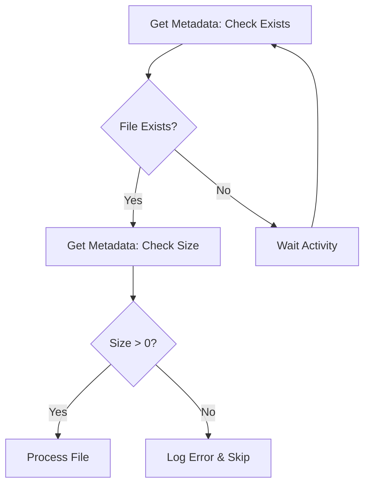

## Pattern 2: Dynamic Multi-File Processing

```mermaid
flowchart TD
    A[Get Metadata: Get childItems] --> B[Filter by Extension]
    B --> C[ForEach File]
    C --> D[Get Metadata: Individual File Properties]
    D --> E[Conditional Processing]
    E --> F[Copy/Transform]
```

## Pattern 3: Schema Validation Pipeline

```mermaid
flowchart TD
    A[Get Metadata: Get Structure] --> B[Set Variable: Expected Columns]
    B --> C{Schema Matches?}
    C -->|Yes| D[Process File]
    C -->|No| E[Move to Quarantine]
    E --> F[Send Alert]
```

## 37.10 Performance Considerations

## Execution Time:
- **Single file exists check**: < 1 second
- **Get childItems (100 files)**: 1-3 seconds
- **Get structure (large CSV)**: 2-5 seconds (reads sample rows)
- **Recursive folder scan (1000s of files)**: 5-30 seconds

## Optimization Tips:
- Use `exists` check before requesting expensive fields like `structure`
- Use `recursive: false` when you only need current folder
- Cache metadata in pipeline variables if used multiple times
- Use wildcard datasets instead of multiple Get Metadata calls

## Cost:
- Get Metadata is billed as pipeline activity execution
- Very cheap compared to Copy or Data Flow
- Count towards overall pipeline orchestration costs

## 37.11 Limitations and Considerations

1. **Structure Field Limitation**
   - For large files, only samples first rows to infer schema
   - May not detect all data types accurately
   - Better for validation than comprehensive schema discovery

2. **childItems Limitation**
   - Returns all items in folder (can be thousands)
   - Large lists can impact pipeline JSON size
   - Consider pagination or filtering at source if possible

3. **Timestamp Precision**
   - Timestamps are in UTC
   - May need timezone conversion in expressions

4. **Not for Data Validation**
   - Get Metadata doesn't read actual data content
   - For row counts, use Lookup with COUNT(*) query
   - For data quality checks, use Data Flow or Lookup

5. **Dataset Must Be Valid**
   - Get Metadata requires properly configured dataset
   - Cannot use for dynamic discovery without dataset template

## 37.12 Troubleshooting

## Issue 1: Get Metadata Returns Null
**Cause**: File/folder doesn't exist

**Solution:**
- Always request `exists` field first
- Use If Condition to check before accessing other fields
- Verify dataset path and parameters

## Issue 2: Structure Field Returns Empty
**Cause**: File format not supported or file is empty

**Solution:**
- Verify file format settings in dataset
- Check if file has header row (for CSV)
- Ensure file is not empty

## Issue 3: childItems Missing Files
**Cause**: `recursive` not set correctly

**Solution:**
- Set `recursive: true` to scan subfolders
- Set `recursive: false` for current folder only

## Issue 4: Timeout on Large Folders
**Cause**: Too many files/folders to scan

**Solution:**
- Increase timeout in policy settings
- Use more specific folder paths
- Consider alternative approach (event triggers)

## 37.13 Interview Questions on Get Metadata Activity

1. **What is the Get Metadata activity?**
   - An activity that retrieves metadata properties (exists, size, modified date, structure, etc.) about files, folders, or tables without reading the actual data.

2. **When would you use Get Metadata instead of Lookup?**
   - When you only need file/folder properties (existence, size, count, modified date) without needing to read actual data content. Get Metadata is faster and lighter.

3. **What metadata fields can you retrieve from a file?**
   - exists, itemName, itemType, size, created, lastModified, childItems, contentMD5, structure.

4. **How do you check if a file exists before processing?**
   - Use Get Metadata with fieldList: ["exists"], then use If Condition to check the output: `@activity('GetMetadata').output.exists`

5. **How do you get a list of all files in a folder?**
   - Use Get Metadata with fieldList: ["childItems"], which returns an array of all files and folders in the specified location.

6. **Can Get Metadata read the number of rows in a table?**
   - No. Get Metadata retrieves structural information (columns, schema) but not row counts. Use Lookup with `SELECT COUNT(*)` for row counts.

7. **What is the output format of Get Metadata?**
   - JSON object containing requested fields, accessed via `@activity('ActivityName').output.fieldName`

8. **How do you use Get Metadata in a ForEach loop?**
   - Get childItems array from Get Metadata, optionally filter it, then pass to ForEach items property.

9. **What's the difference between recursive true and false?**
   - recursive: true scans all subfolders; recursive: false scans only the current folder level.

10. **How do you validate file schema with Get Metadata?**
    - Request the `structure` field which returns column names and types, then validate against expected schema using expressions.

## 37.14 Real-World Example: Complete Validation Pipeline

Scenario: Validate file exists, has valid size, and expected schema before processing

```json
{
    "name": "pl_validate_and_process_file",
    "properties": {
        "activities": [
            {
                "name": "Check_File_Exists",
                "type": "GetMetadata",
                "typeProperties": {
                    "dataset": {
                        "referenceName": "ds_input_file",
                        "type": "DatasetReference",
                        "parameters": {
                            "fileName": "@pipeline().parameters.pFileName"
                        }
                    },
                    "fieldList": ["exists"]
                }
            },
            {
                "name": "If_File_Exists",
                "type": "IfCondition",
                "dependsOn": [
                    {
                        "activity": "Check_File_Exists",
                        "dependencyConditions": ["Succeeded"]
                    }
                ],
                "typeProperties": {
                    "expression": {
                        "value": "@activity('Check_File_Exists').output.exists",
                        "type": "Expression"
                    },
                    "ifTrueActivities": [
                        {
                            "name": "Get_File_Properties",
                            "type": "GetMetadata",
                            "typeProperties": {
                                "dataset": {
                                    "referenceName": "ds_input_file",
                                    "type": "DatasetReference",
                                    "parameters": {
                                        "fileName": "@pipeline().parameters.pFileName"
                                    }
                                },
                                "fieldList": [
                                    "size",
                                    "lastModified",
                                    "structure",
                                    "itemName"
                                ]
                            }
                        },
                        {
                            "name": "Set_File_Size",
                            "type": "SetVariable",
                            "dependsOn": [
                                {
                                    "activity": "Get_File_Properties",
                                    "dependencyConditions": ["Succeeded"]
                                }
                            ],
                            "typeProperties": {
                                "variableName": "vFileSize",
                                "value": {
                                    "value": "@string(activity('Get_File_Properties').output.size)",
                                    "type": "Expression"
                                }
                            }
                        },
                        {
                            "name": "Validate_File_Size",
                            "type": "IfCondition",
                            "dependsOn": [
                                {
                                    "activity": "Set_File_Size",
                                    "dependencyConditions": ["Succeeded"]
                                }
                            ],
                            "typeProperties": {
                                "expression": {
                                    "value": "@greater(activity('Get_File_Properties').output.size, 100)",
                                    "type": "Expression"
                                },
                                "ifTrueActivities": [
                                    {
                                        "name": "Validate_Schema",
                                        "type": "IfCondition",
                                        "typeProperties": {
                                            "expression": {
                                                "value": "@and(contains(string(activity('Get_File_Properties').output.structure), 'order_id'), contains(string(activity('Get_File_Properties').output.structure), 'customer_id'))",
                                                "type": "Expression"
                                            },
                                            "ifTrueActivities": [
                                                {
                                                    "name": "Copy_Valid_File",
                                                    "type": "Copy",
                                                    "inputs": [
                                                        {
                                                            "referenceName": "ds_input_file",
                                                            "type": "DatasetReference",
                                                            "parameters": {
                                                                "fileName": "@pipeline().parameters.pFileName"
                                                            }
                                                        }
                                                    ],
                                                    "outputs": [
                                                        {
                                                            "referenceName": "ds_output_parquet",
                                                            "type": "DatasetReference"
                                                        }
                                                    ]
                                                }
                                            ],
                                            "ifFalseActivities": [
                                                {
                                                    "name": "Move_To_Quarantine_Invalid_Schema",
                                                    "type": "Copy"
                                                }
                                            ]
                                        }
                                    }
                                ],
                                "ifFalseActivities": [
                                    {
                                        "name": "Log_Empty_File",
                                        "type": "Web"
                                    }
                                ]
                            }
                        }
                    ],
                    "ifFalseActivities": [
                        {
                            "name": "Send_Alert_Missing_File",
                            "type": "Web",
                            "typeProperties": {
                                "url": "https://alerts.company.com/webhook",
                                "method": "POST",
                                "body": {
                                    "message": "File not found",
                                    "fileName": "@pipeline().parameters.pFileName"
                                }
                            }
                        }
                    ]
                }
            }
        ],
        "parameters": {
            "pFileName": {
                "type": "string"
            }
        },
        "variables": {
            "vFileSize": {
                "type": "String"
            }
        }
    }
}
```

## 37.15 Quick Reference Summary

**Get Metadata Activity:**
- **Purpose**: Retrieve file/folder/table properties without reading data
- **Key use**: Validation, conditional logic, dynamic processing
- **Common fields**: exists, size, lastModified, childItems, structure
- **Fast execution**: Seconds, not minutes
- **Essential for**: File validation, dynamic ForEach, schema checks

**Common Expression Patterns:**
```javascript
// Check if exists
@activity('GetMetadata').output.exists

// Get file name
@activity('GetMetadata').output.itemName

// Get file size in MB
@div(activity('GetMetadata').output.size, 1048576)

// Get child items array
@activity('GetMetadata').output.childItems

// Count of files
@length(activity('GetMetadata').output.childItems)

// Check last modified today
@equals(formatDateTime(activity('GetMetadata').output.lastModified, 'yyyy-MM-dd'), formatDateTime(utcNow(), 'yyyy-MM-dd'))
```

**Remember:**
- Get Metadata = Property inspector (not data reader)
- Use before expensive operations for validation
- Essential for dynamic, metadata-driven pipelines
- Always check `exists` before accessing other properties
- Perfect companion to ForEach and If Condition activities


---

## 38. Expression Builder in Azure Data Factory - Complete Guide

### 38.1 What is the Expression Builder?

## Definition:
The **Expression Builder** is an interactive UI tool in ADF that helps you create dynamic expressions using ADF's expression language. It provides syntax assistance, function IntelliSense, and validation.

Think of it as: **A formula editor like Excel, but for data pipelines.**

## Purpose:
- Build dynamic values based on runtime conditions
- Access system variables, parameters, and activity outputs
- Perform calculations, string manipulations, and date operations
- Enable metadata-driven and parameterized pipelines
- Eliminate hardcoded values

## Where Expression Builder Appears:
- Pipeline parameters and variables
- Activity properties (any field with "Add dynamic content" option)
- Dataset parameters
- Linked service parameters
- Trigger parameters
- Data flow expressions

### 38.2 Expression Builder UI Components

```
┌─────────────────────────────────────────────────────┐
│ Expression Builder                                  │
├─────────────────────────────────────────────────────┤
│                                                     │
│  Expression Editor Box:                            │
│  ┌─────────────────────────────────────────────┐  │
│  │ @concat('bronze/', pipeline().parameters.   │  │
│  │ pEntity, '/', formatDateTime(utcNow(),     │  │
│  │ 'yyyy/MM/dd'))                               │  │
│  └─────────────────────────────────────────────┘  │
│                                                     │
│  Functions (left panel):                           │
│  ├─ String functions                               │
│  ├─ Collection functions                           │
│  ├─ Logical functions                              │
│  ├─ Conversion functions                           │
│  ├─ Math functions                                 │
│  ├─ Date functions                                 │
│  └─ System variables                               │
│                                                     │
│  System Variables (middle panel):                  │
│  ├─ @pipeline()                                    │
│  ├─ @activity()                                    │
│  ├─ @variables()                                   │
│  ├─ @item()                                        │
│  ├─ @trigger()                                     │
│  └─ @dataset()                                     │
│                                                     │
│  Parameters & Variables (right panel):             │
│  ├─ Pipeline parameters                            │
│  ├─ Pipeline variables                             │
│  └─ Activity outputs                               │
│                                                     │
│  ┌─────────────┐  ┌─────────────┐                 │
│  │   Validate   │  │     OK      │                 │
│  └─────────────┘  └─────────────┘                 │
└─────────────────────────────────────────────────────┘
```

### 38.3 Expression Language Fundamentals

## Basic Syntax:
All expressions start with `@`

```javascript
// Access pipeline parameter
@pipeline().parameters.pDate

// Access variable
@variables('vCounter')

// Call function
@utcNow()

// Combine multiple elements
@concat('Hello, ', pipeline().parameters.pName)
```

## Expression Structure:
```
@functionName(argument1, argument2, ...)
@systemVariable.property.subProperty
@nested(function(innerFunction()))
```

### 38.4 System Variables

## 1. Pipeline System Variables

| Variable | Description | Example Usage |
|----------|-------------|---------------|
| `@pipeline().Pipeline` | Current pipeline name | File naming, logging |
| `@pipeline().RunId` | Unique run identifier | Tracking, correlation |
| `@pipeline().TriggerType` | How pipeline was triggered | Conditional logic |
| `@pipeline().TriggerId` | Trigger identifier | Audit trails |
| `@pipeline().TriggerName` | Trigger name | Logging |
| `@pipeline().TriggerTime` | When trigger fired | Timestamps |
| `@pipeline().DataFactory` | ADF name | Cross-factory scenarios |
| `@pipeline().GroupId` | Trigger window group ID | Tumbling windows |
| `@pipeline().parameters.paramName` | Pipeline parameter value | Dynamic configuration |

**Examples:**
```javascript
// Get pipeline name
@pipeline().Pipeline
// Returns: "pl_ingestion_daily"

// Get run ID for correlation
@pipeline().RunId
// Returns: "a1b2c3d4-5678-90ab-cdef-1234567890ab"

// Get parameter value
@pipeline().parameters.pProcessDate
// Returns value passed at runtime, e.g., "2026-04-26"

// Build audit message
@concat('Pipeline ', pipeline().Pipeline, ' run ', pipeline().RunId, ' started at ', pipeline().TriggerTime)
```

## 2. Activity System Variables

| Variable | Description | When Available |
|----------|-------------|----------------|
| `@activity('ActivityName').output` | Activity output | After activity succeeds |
| `@activity('ActivityName').output.property` | Specific output property | After activity succeeds |
| `@activity('ActivityName').status` | Activity status | In dependsOn conditions |
| `@activity('ActivityName').error` | Error details | When activity fails |

**Examples:**
```javascript
// Get Lookup activity output
@activity('Lookup_Config').output.firstRow.tableName

// Get Copy activity rows copied
@activity('Copy_Data').output.rowsCopied

// Get Get Metadata output
@activity('GetMetadata_File').output.exists

// Build dynamic query using Lookup result
@concat('SELECT * FROM ', activity('Lookup_Config').output.firstRow.schema, '.', activity('Lookup_Config').output.firstRow.table)
```

## 3. Variable System Variables

| Variable | Description | Use Case |
|----------|-------------|----------|
| `@variables('variableName')` | Get variable value | Accessing pipeline variable |

**Examples:**
```javascript
// Get variable value
@variables('vLastWatermark')

// Use in condition
@greater(variables('vCounter'), 10)

// Append to string
@concat('Processing batch ', string(variables('vBatchNumber')))
```

## 4. Item Variable (ForEach/Filter)

| Variable | Description | Scope |
|----------|-------------|-------|
| `@item()` | Current item in iteration | Inside ForEach or Until loop |
| `@item().property` | Property of current object | When iterating over objects |

**Examples:**
```javascript
// Simple array item
@item()
// When items = ["Sales", "Marketing", "HR"]
// Returns: "Sales" (in first iteration)

// Object property
@item().tableName
// When items = [{"tableName": "orders", "schema": "sales"}]
// Returns: "orders"

// Use in path
@concat('bronze/', item().entity, '/', formatDateTime(utcNow(), 'yyyy/MM/dd'))
```

## 5. Trigger System Variables

| Variable | Description | Trigger Type |
|----------|-------------|--------------|
| `@trigger().scheduledTime` | Scheduled execution time | Schedule, Tumbling Window |
| `@trigger().startTime` | Actual start time | All triggers |
| `@trigger().outputs.windowStartTime` | Window start | Tumbling Window |
| `@trigger().outputs.windowEndTime` | Window end | Tumbling Window |
| `@trigger().outputs.body.folderPath` | Blob path | Event trigger |
| `@trigger().outputs.body.fileName` | File name | Event trigger |

**Examples:**
```javascript
// Get scheduled time for tumbling window
@trigger().outputs.windowStartTime
// Returns: "2026-04-26T00:00:00Z"

// Get file that triggered pipeline (event trigger)
@trigger().outputs.body.fileName
// Returns: "sales_20260426.csv"

// Build date partition from trigger
@formatDateTime(trigger().outputs.windowStartTime, 'yyyy/MM/dd')
```

## 6. Dataset System Variables

| Variable | Description | Use Case |
|----------|-------------|----------|
| `@dataset().parameterName` | Dataset parameter value | Inside dataset definition |

**Examples:**
```javascript
// In dataset file path property
@concat('bronze/', dataset().pContainer, '/', dataset().pFolder, '/', dataset().pFileName)
```

### 38.5 Common Functions by Category

## String Functions

| Function | Description | Example | Output |
|----------|-------------|---------|--------|
| `concat()` | Concatenate strings | `@concat('Hello', ' ', 'World')` | "Hello World" |
| `substring()` | Extract substring | `@substring('Hello World', 0, 5)` | "Hello" |
| `replace()` | Replace text | `@replace('Hello World', 'World', 'ADF')` | "Hello ADF" |
| `toLower()` | Convert to lowercase | `@toLower('HELLO')` | "hello" |
| `toUpper()` | Convert to uppercase | `@toUpper('hello')` | "HELLO" |
| `trim()` | Remove whitespace | `@trim('  hello  ')` | "hello" |
| `split()` | Split string to array | `@split('a,b,c', ',')` | ["a", "b", "c"] |
| `startsWith()` | Check if starts with | `@startsWith('hello', 'he')` | true |
| `endsWith()` | Check if ends with | `@endsWith('file.csv', '.csv')` | true |
| `indexOf()` | Find position | `@indexOf('hello', 'l')` | 2 |
| `length()` | Get string length | `@length('hello')` | 5 |

**Practical Examples:**
```javascript
// Build file path
@concat('bronze/', pipeline().parameters.pEntity, '/', formatDateTime(utcNow(), 'yyyy/MM/dd'), '/', toLower(pipeline().parameters.pEntity), '.parquet')
// Result: "bronze/Sales/2026/04/26/sales.parquet"

// Extract date from filename
@substring(item().name, 0, 10)
// Input: "2026-04-26_sales.csv"
// Result: "2026-04-26"

// Replace special characters
@replace(replace(pipeline().parameters.pTableName, '[', ''), ']', '')
// Input: "[dbo].[orders]"
// Result: "dbo.orders"
```

## Date/Time Functions

| Function | Description | Example | Output |
|----------|-------------|---------|--------|
| `utcNow()` | Current UTC time | `@utcNow()` | "2026-04-26T15:30:00.000Z" |
| `formatDateTime()` | Format date | `@formatDateTime(utcNow(), 'yyyy-MM-dd')` | "2026-04-26" |
| `addDays()` | Add days to date | `@addDays(utcNow(), -7)` | 7 days ago |
| `addHours()` | Add hours | `@addHours(utcNow(), 3)` | 3 hours from now |
| `addMinutes()` | Add minutes | `@addMinutes(utcNow(), 30)` | 30 minutes from now |
| `dayOfWeek()` | Get day of week | `@dayOfWeek(utcNow())` | 5 (Friday = 5) |
| `dayOfMonth()` | Get day of month | `@dayOfMonth(utcNow())` | 26 |
| `dayOfYear()` | Get day of year | `@dayOfYear(utcNow())` | 116 |
| `year()` | Get year | `@year(utcNow())` | 2026 |
| `month()` | Get month | `@month(utcNow())` | 4 |
| `startOfDay()` | Get start of day | `@startOfDay(utcNow())` | "2026-04-26T00:00:00Z" |
| `startOfMonth()` | Get start of month | `@startOfMonth(utcNow())` | "2026-04-01T00:00:00Z" |
| `ticks()` | Get ticks | `@ticks(utcNow())` | 638496822000000000 |
| `convertTimeZone()` | Convert timezone | `@convertTimeZone(utcNow(), 'UTC', 'Pacific Standard Time')` | Pacific time |

**Practical Examples:**
```javascript
// Create date partition path
@formatDateTime(utcNow(), 'yyyy/MM/dd')
// Result: "2026/04/26"

// Get yesterday for incremental load
@formatDateTime(addDays(utcNow(), -1), 'yyyy-MM-dd')
// Result: "2026-04-25"

// Create timestamp filename
@concat('sales_', formatDateTime(utcNow(), 'yyyyMMdd_HHmmss'), '.csv')
// Result: "sales_20260426_153000.csv"

// Start of current month for reporting
@formatDateTime(startOfMonth(utcNow()), 'yyyy-MM-dd')
// Result: "2026-04-01"

// Check if weekend
@or(equals(dayOfWeek(utcNow()), 0), equals(dayOfWeek(utcNow()), 6))
// Returns true if Sunday (0) or Saturday (6)

// Convert UTC to Eastern Time
@convertTimeZone(utcNow(), 'UTC', 'Eastern Standard Time')
```

## Logical Functions

| Function | Description | Example | Output |
|----------|-------------|---------|--------|
| `equals()` | Check equality | `@equals(1, 1)` | true |
| `not()` | Logical NOT | `@not(true)` | false |
| `and()` | Logical AND | `@and(true, true)` | true |
| `or()` | Logical OR | `@or(true, false)` | true |
| `if()` | Conditional | `@if(equals(1, 1), 'yes', 'no')` | "yes" |
| `greater()` | Greater than | `@greater(10, 5)` | true |
| `greaterOrEquals()` | Greater or equal | `@greaterOrEquals(10, 10)` | true |
| `less()` | Less than | `@less(5, 10)` | true |
| `lessOrEquals()` | Less or equal | `@lessOrEquals(5, 5)` | true |

**Practical Examples:**
```javascript
// Check environment
@equals(pipeline().parameters.pEnvironment, 'PROD')
// Returns: true or false

// Combined condition
@and(
    equals(pipeline().parameters.pEnv, 'PROD'),
    greater(activity('Lookup_Count').output.firstRow.count, 0)
)

// Ternary-like expression
@if(equals(pipeline().parameters.pLoadType, 'full'), 'SELECT * FROM table', 'SELECT * FROM table WHERE modified_date > watermark')

// Check file extension
@or(endsWith(item().name, '.csv'), endsWith(item().name, '.txt'))
```

## Collection Functions

| Function | Description | Example | Output |
|----------|-------------|---------|--------|
| `contains()` | Check if contains | `@contains(['a','b'], 'a')` | true |
| `length()` | Get array length | `@length(['a', 'b', 'c'])` | 3 |
| `first()` | Get first element | `@first(['a', 'b', 'c'])` | "a" |
| `last()` | Get last element | `@last(['a', 'b', 'c'])` | "c" |
| `join()` | Join array to string | `@join(['a', 'b', 'c'], ',')` | "a,b,c" |
| `skip()` | Skip elements | `@skip(['a', 'b', 'c'], 1)` | ["b", "c"] |
| `take()` | Take first N elements | `@take(['a', 'b', 'c'], 2)` | ["a", "b"] |
| `union()` | Combine arrays | `@union(['a'], ['b'])` | ["a", "b"] |
| `intersection()` | Common elements | `@intersection(['a','b'], ['b','c'])` | ["b"] |

**Practical Examples:**
```javascript
// Check if file list is empty
@greater(length(activity('GetMetadata').output.childItems), 0)

// Get first file name
@first(activity('GetMetadata').output.childItems).name

// Build comma-separated list
@join(activity('Lookup_Tables').output.value.tableName, ',')

// Check if specific table in list
@contains(string(activity('Lookup_Tables').output.value), 'orders')
```

## Conversion Functions

| Function | Description | Example | Output |
|----------|-------------|---------|--------|
| `string()` | Convert to string | `@string(123)` | "123" |
| `int()` | Convert to integer | `@int('123')` | 123 |
| `float()` | Convert to float | `@float('12.34')` | 12.34 |
| `bool()` | Convert to boolean | `@bool('true')` | true |
| `json()` | Parse JSON string | `@json('{"a":1}')` | Object |
| `base64()` | Encode to base64 | `@base64('hello')` | "aGVsbG8=" |
| `base64ToString()` | Decode base64 | `@base64ToString('aGVsbG8=')` | "hello" |
| `decodeUriComponent()` | Decode URI | `@decodeUriComponent('hello%20world')` | "hello world" |
| `encodeUriComponent()` | Encode URI | `@encodeUriComponent('hello world')` | "hello%20world" |

**Practical Examples:**
```javascript
// Convert parameter to integer for calculation
@div(int(pipeline().parameters.pRecordCount), 1000)

// Convert array to string for contains check
@contains(string(activity('Lookup_Config').output.value), 'orders')

// Encode file path with spaces
@encodeUriComponent(concat('folder name/file name.csv'))
// Result: "folder%20name/file%20name.csv"
```

## Math Functions

| Function | Description | Example | Output |
|----------|-------------|---------|--------|
| `add()` | Addition | `@add(5, 3)` | 8 |
| `sub()` | Subtraction | `@sub(10, 3)` | 7 |
| `mul()` | Multiplication | `@mul(5, 3)` | 15 |
| `div()` | Division | `@div(10, 2)` | 5 |
| `mod()` | Modulo | `@mod(10, 3)` | 1 |
| `max()` | Maximum value | `@max(5, 10, 3)` | 10 |
| `min()` | Minimum value | `@min(5, 10, 3)` | 3 |
| `range()` | Generate range | `@range(1, 3)` | [1, 2, 3] |
| `rand()` | Random integer | `@rand(1, 100)` | Random between 1-100 |

**Practical Examples:**
```javascript
// Calculate MB from bytes
@div(activity('GetMetadata').output.size, 1048576)

// Calculate percentage
@mul(div(variables('vProcessedCount'), variables('vTotalCount')), 100)

// Generate batch number
@add(mod(dayOfYear(utcNow()), 7), 1)
// Result: 1-7 based on day of year
```

## Other Useful Functions

| Function | Description | Example |
|----------|-------------|---------|
| `coalesce()` | Return first non-null value | `@coalesce(variables('vValue'), 'default')` |
| `guid()` | Generate GUID | `@guid()` |
| `newGuid()` | Generate new GUID (alias) | `@newGuid()` |
| `getPastTime()` | Get past time | `@getPastTime(7, 'Day')` |
| `getFutureTime()` | Get future time | `@getFutureTime(1, 'Hour')` |
| `uriComponent()` | Encode URI component | `@uriComponent('hello world')` |

**Practical Examples:**
```javascript
// Use default if variable not set
@coalesce(variables('vTableName'), 'default_table')

// Generate unique run identifier
@concat(pipeline().RunId, '_', guid())

// Get timestamp from week ago
@formatDateTime(getPastTime(7, 'Day'), 'yyyy-MM-dd HH:mm:ss')
```

### 38.6 Complex Expression Examples

## Example 1: Build Dynamic SQL Query with Multiple Conditions
```javascript
@concat(
    'SELECT * FROM ',
    pipeline().parameters.pSchema, '.', pipeline().parameters.pTable,
    ' WHERE ',
    if(
        equals(pipeline().parameters.pLoadType, 'incremental'),
        concat(pipeline().parameters.pWatermarkColumn, ' > ''', activity('Lookup_Watermark').output.firstRow.lastWatermark, ''' AND ', pipeline().parameters.pWatermarkColumn, ' <= ''', utcNow(), ''''),
        '1=1'
    ),
    if(
        not(equals(pipeline().parameters.pFilter, '')),
        concat(' AND ', pipeline().parameters.pFilter),
        ''
    )
)
```

Result (incremental with filter):
```sql
SELECT * FROM sales.orders WHERE modified_date > '2026-04-25T00:00:00Z' AND modified_date <= '2026-04-26T15:30:00Z' AND status = 'Active'
```

## Example 2: Create Hierarchical Date Folder Path
```javascript
@concat(
    'raw/',
    toLower(pipeline().parameters.pSourceSystem), '/',
    toLower(pipeline().parameters.pEntity), '/',
    'year=', year(pipeline().TriggerTime), '/',
    'month=', if(less(month(pipeline().TriggerTime), 10), concat('0', string(month(pipeline().TriggerTime))), string(month(pipeline().TriggerTime))), '/',
    'day=', if(less(dayOfMonth(pipeline().TriggerTime), 10), concat('0', string(dayOfMonth(pipeline().TriggerTime))), string(dayOfMonth(pipeline().TriggerTime))), '/',
    toLower(pipeline().parameters.pEntity), '_',
    formatDateTime(pipeline().TriggerTime, 'yyyyMMddHHmmss'),
    '.parquet'
)
```

Result:
```
raw/crm/customer/year=2026/month=04/day=26/customer_20260426153000.parquet
```

## Example 3: Conditional File Processing Logic
```javascript
@if(
    and(
        activity('GetMetadata_File').output.exists,
        greater(activity('GetMetadata_File').output.size, 1024),
        or(
            endsWith(toLower(activity('GetMetadata_File').output.itemName), '.csv'),
            endsWith(toLower(activity('GetMetadata_File').output.itemName), '.txt')
        ),
        greaterOrEquals(
            activity('GetMetadata_File').output.lastModified,
            addDays(utcNow(), -7)
        )
    ),
    'PROCESS',
    'SKIP'
)
```

Condition checks:
- File exists
- File size > 1KB
- File extension is CSV or TXT
- File modified within last 7 days

## Example 4: Dynamic Column Mapping
```javascript
@concat(
    '{"source":{"name":"', item().sourceColumn, '","type":"', item().sourceType, '"},',
    '"sink":{"name":"', item().sinkColumn, '","type":"', item().sinkType, '"}}'
)
```

## Example 5: Calculate Processing Window
```javascript
// Start of window
@startOfDay(addDays(utcNow(), -1))

// End of window
@addSeconds(startOfDay(utcNow()), -1)

// Use in filter
@concat(
    'WHERE created_date >= ''', formatDateTime(startOfDay(addDays(utcNow(), -1)), 'yyyy-MM-dd HH:mm:ss'), '''',
    ' AND created_date < ''', formatDateTime(startOfDay(utcNow()), 'yyyy-MM-dd HH:mm:ss'), ''''
)
```

Result:
```sql
WHERE created_date >= '2026-04-25 00:00:00' AND created_date < '2026-04-26 00:00:00'
```

### 38.7 Best Practices for Expressions

1. **Use Variables for Complex Expressions**
   - Set complex expressions in variables first
   - Reuse variables instead of duplicating logic
   - Improves readability and maintainability

   Example:
   ```javascript
   // Instead of repeating complex expression
   @concat('complex', 'expression', 'here')
   
   // Use Set Variable activity first
   Variable: vComplexPath
   Value: @concat('complex', 'expression', 'here')
   
   // Then reference variable
   @variables('vComplexPath')
   ```

2. **Format for Readability**
   - Break long expressions into multiple lines (in JSON)
   - Use meaningful parameter/variable names
   - Add comments in pipeline documentation

3. **Handle Nulls Gracefully**
   - Use `coalesce()` for default values
   - Check existence before accessing properties
   - Avoid null reference errors

   Example:
   ```javascript
   @coalesce(activity('Lookup').output.firstRow.tableName, 'default_table')
   ```

4. **Test Expressions in Debug Mode**
   - Use Debug mode to validate expressions
   - Check output in Monitor tab
   - Use Set Variable to inspect intermediate values

5. **Use String Interpolation Wisely**
   - Enclose string literals in single quotes inside expressions
   - Escape quotes when needed with double single quotes

   ```javascript
   @concat('SELECT * FROM table WHERE name = ''', pipeline().parameters.pName, '''')
   ```

6. **Optimize Performance**
   - Avoid complex expressions in tight loops
   - Cache repeated calculations in variables
   - Use appropriate data types (don't convert unnecessarily)

7. **Document Complex Logic**
   - Add descriptions to parameters/variables
   - Use meaningful names
   - Document expected format and values

8. **Validate Data Types**
   - Ensure type compatibility in functions
   - Use conversion functions explicitly
   - Handle type mismatches gracefully

9. **Use Constants for Magic Numbers**
   - Define magic numbers as pipeline parameters
   - Makes maintenance easier
   - Self-documenting

10. **Keep Expressions Maintainable**
    - Avoid deeply nested conditions
    - Split into multiple activities if too complex
    - Balance brevity with clarity

### 38.8 Common Mistakes and How to Avoid Them

## Mistake 1: Forgetting @ Symbol
```javascript
// Wrong
pipeline().parameters.pValue

// Correct
@pipeline().parameters.pValue
```

## Mistake 2: Incorrect Quote Escaping
```javascript
// Wrong - Single quote not escaped
@concat('WHERE name = '

, pipeline().parameters.pName, ''')

// Correct - Double single quotes
@concat('WHERE name = ''', pipeline().parameters.pName, '''')
```

## Mistake 3: Type Mismatch in Functions
```javascript
// Wrong - comparing string to number
@greater(pipeline().parameters.pCount, 100)
// If pCount is "100" (string)

// Correct - convert first
@greater(int(pipeline().parameters.pCount), 100)
```

## Mistake 4: Null Reference Error
```javascript
// Risky - will fail if activity failed or property doesn't exist
@activity('Lookup').output.firstRow.tableName

// Safer - check for null
@coalesce(activity('Lookup').output.firstRow.tableName, 'default')
```

## Mistake 5: Wrong Function Arguments
```javascript
// Wrong - formatDateTime needs date and format
@formatDateTime('2026-04-26')

// Correct
@formatDateTime('2026-04-26', 'yyyy-MM-dd')
```

### 38.9 Debugging Expressions

## Technique 1: Use Set Variable to Inspect
Create Set Variable activity to see expression output:

```json
{
    "name": "Debug_Expression",
    "type": "SetVariable",
    "typeProperties": {
        "variableName": "vDebug",
        "value": {
            "value": "@concat('Result: ', string(activity('Lookup').output))",
            "type": "Expression"
        }
    }
}
```

Then check the variable value in Monitor tab.

## Technique 2: Use String Conversion
Convert complex objects to string to inspect:

```javascript
@string(activity('Lookup').output)
```

## Technique 3: Test in Isolation
- Create test pipeline with just the expression
- Use Debug mode to validate
- Incrementally add complexity

## Technique 4: Check Expression Validation
- Expression Builder validates syntax
- Red underline indicates error
- Hover over error for details

### 38.10 Interview Questions on Expression Builder

1. **What is the Expression Builder in ADF?**
   - An interactive UI tool for creating dynamic expressions using ADF's expression language, providing syntax assistance, function IntelliSense, and validation.

2. **How do you access a pipeline parameter in an expression?**
   - `@pipeline().parameters.parameterName`

3. **What does the @ symbol signify?**
   - It indicates the start of an ADF expression that will be evaluated at runtime.

4. **How do you concatenate strings in ADF expressions?**
   - Use the `concat()` function: `@concat('Hello', ' ', 'World')`

5. **How do you get the current UTC timestamp?**
   - `@utcNow()`

6. **How do you access the output of a previous activity?**
   - `@activity('ActivityName').output.propertyName`

7. **What function would you use to provide a default value if a variable is null?**
   - `@coalesce(variables('vValue'), 'defaultValue')`

8. **How do you format a date in ADF expressions?**
   - `@formatDateTime(utcNow(), 'yyyy-MM-dd')`

9. **How do you access the current item in a ForEach loop?**
   - `@item()` for simple values or `@item().propertyName` for object properties

10. **What's the difference between `equals()` and `contains()`?**
    - `equals()` checks exact equality; `contains()` checks if a value/substring exists within a collection/string.

### 38.11 Quick Reference - Most Used Expressions

```javascript
// Get current timestamp
@utcNow()

// Format date
@formatDateTime(utcNow(), 'yyyy-MM-dd')

// Pipeline parameter
@pipeline().parameters.pParameterName

// Pipeline run ID
@pipeline().RunId

// Activity output
@activity('ActivityName').output.firstRow.columnName

// Variable
@variables('vVariableName')

// Current item in loop
@item()
@item().propertyName

// Concatenate strings
@concat('string1', 'string2', 'string3')

// Conditional logic
@if(equals(pipeline().parameters.pEnv, 'PROD'), 'value1', 'value2')

// Check if file exists
@activity('GetMetadata').output.exists

// Get yesterday's date
@formatDateTime(addDays(utcNow(), -1), 'yyyy-MM-dd')

// Convert to integer
@int(pipeline().parameters.pCount)

// Null-safe access
@coalesce(activity('Lookup').output.firstRow.value, 'default')

// String to lowercase
@toLower(pipeline().parameters.pTableName)

// Get array length
@length(activity('GetMetadata').output.childItems)

// Join array to string
@join(variables('vList'), ',')

// Check string ends with
@endsWith(item().name, '.csv')

// Replace text
@replace(pipeline().parameters.pPath, '\\', '/')

// Generate GUID
@guid()

// Get file size in MB
@div(activity('GetMetadata').output.size, 1048576)
```

---

## 39. Parameterized Pipelines in Azure Data Factory - Complete Guide

### 39.1 What are Parameterized Pipelines?

## Definition:
**Parameterized pipelines** are pipelines that accept input values (parameters) at runtime, making them dynamic, reusable, and configuration-driven instead of hardcoded.

Think of it as: **Functions with arguments - write once, use with different inputs.**

## Purpose:
- Eliminate code duplication (one pipeline for many scenarios)
- Enable metadata-driven architectures
- Support environment-specific configurations (dev/test/prod)
- Allow runtime customization without code changes
- Enable parent-child pipeline patterns

### 39.2 Parameters vs Variables vs Global Parameters

| Aspect | Pipeline Parameters | Pipeline Variables | Global Parameters |
|--------|---------------------|-------------------|-------------------|
| **Scope** | Single pipeline run | Single pipeline run | Entire Data Factory |
| **Set By** | Caller (trigger, parent pipeline, manual) | Activities within pipeline | Factory configuration |
| **Mutability** | Immutable (read-only) | Mutable (can change during execution) | Immutable (read-only) |
| **Use Case** | Pass inputs to pipeline | Store intermediate state, counters | Environment-specific values |
| **Access Pattern** | `@pipeline().parameters.pName` | `@variables('vName')` | `@pipeline().globalParameters.gpName` |
| **Definition Location** | Pipeline definition | Pipeline definition | Manage tab (factory level) |

### 39.3 Creating Pipeline Parameters

## In UI (Author Tab):
1. Select pipeline canvas (click empty area)
2. Go to Parameters tab in properties panel
3. Click "+ New"
4. Define:
   - **Name**: Parameter name (prefix with 'p' for clarity, e.g., `pTableName`)
   - **Type**: String, Int, Float, Bool, Array, Object
   - **Default Value**: Optional default if not provided by caller

## In JSON:
```json
{
    "name": "pl_generic_ingestion",
    "properties": {
        "parameters": {
            "pSourceTable": {
                "type": "string",
                "defaultValue": "orders"
            },
            "pTargetPath": {
                "type": "string"
            },
            "pLoadType": {
                "type": "string",
                "defaultValue": "incremental"
            },
            "pProcessDate": {
                "type": "string",
                "defaultValue": "@{formatDateTime(utcNow(), 'yyyy-MM-dd')}"
            },
            "pBatchSize": {
                "type": "int",
                "defaultValue": 1000
            },
            "pIsActive": {
                "type": "bool",
                "defaultValue": true
            },
            "pTableList": {
                "type": "array",
                "defaultValue": ["orders", "customers", "products"]
            }
        },
        "activities": [...]
    }
}
```

### 39.4 Parameter Types and Examples

## String Parameters
```json
"pTableName": {
    "type": "string",
    "defaultValue": "orders"
}
```

Usage:
```javascript
@pipeline().parameters.pTableName
@concat('SELECT * FROM ', pipeline().parameters.pTableName)
```

## Integer Parameters
```json
"pBatchSize": {
    "type": "int",
    "defaultValue": 1000
}
```

Usage:
```javascript
@pipeline().parameters.pBatchSize
@greater(pipeline().parameters.pBatchSize, 500)
```

## Boolean Parameters
```json
"pDebugMode": {
    "type": "bool",
    "defaultValue": false
}
```

Usage:
```javascript
@pipeline().parameters.pDebugMode
@if(pipeline().parameters.pDebugMode, 'debug', 'normal')
```

## Array Parameters
```json
"pTableList": {
    "type": "array",
    "defaultValue": ["orders", "customers", "products"]
}
```

Usage:
```javascript
// Pass to ForEach items
@pipeline().parameters.pTableList

// Get first item
@first(pipeline().parameters.pTableList)

// Get length
@length(pipeline().parameters.pTableList)
```

## Object Parameters
```json
"pConfig": {
    "type": "object",
    "defaultValue": {
        "schema": "sales",
        "table": "orders",
        "watermarkColumn": "modified_date"
    }
}
```

Usage:
```javascript
@pipeline().parameters.pConfig.schema
@pipeline().parameters.pConfig.table
@pipeline().parameters.pConfig.watermarkColumn
```

### 39.5 Passing Parameters to Pipelines

## Method 1: Manual Trigger (Debug/Run)
In Debug or Add Trigger → Trigger Now:
- UI prompts for parameter values
- Enter values in dialog
- Click OK to run

## Method 2: Schedule/Tumbling Window Trigger
```json
{
    "name": "tr_daily_ingestion",
    "properties": {
        "type": "ScheduleTrigger",
        "typeProperties": {
            "recurrence": {
                "frequency": "Day",
                "interval": 1,
                "startTime": "2026-04-26T00:00:00Z"
            }
        },
        "pipelines": [
            {
                "pipelineReference": {
                    "referenceName": "pl_generic_ingestion",
                    "type": "PipelineReference"
                },
                "parameters": {
                    "pSourceTable": "orders",
                    "pTargetPath": "bronze/sales/orders",
                    "pLoadType": "incremental",
                    "pProcessDate": "@formatDateTime(trigger().startTime, 'yyyy-MM-dd')"
                }
            }
        ]
    }
}
```

## Method 3: Execute Pipeline Activity (Parent-Child)
```json
{
    "name": "Execute_Child_Pipeline",
    "type": "ExecutePipeline",
    "typeProperties": {
        "pipeline": {
            "referenceName": "pl_child_ingestion",
            "type": "PipelineReference"
        },
        "parameters": {
            "pTableName": {
                "value": "@item().tableName",
                "type": "Expression"
            },
            "pSchema": {
                "value": "@item().schema",
                "type": "Expression"
            },
            "pProcessDate": {
                "value": "@pipeline().parameters.pProcessDate",
                "type": "Expression"
            }
        },
        "waitOnCompletion": true
    }
}
```

## Method 4: REST API Call
```bash
POST https://management.azure.com/subscriptions/{subscriptionId}/resourceGroups/{resourceGroupName}/providers/Microsoft.DataFactory/factories/{factoryName}/pipelines/{pipelineName}/createRun?api-version=2018-06-01

{
    "pSourceTable": "orders",
    "pTargetPath": "bronze/sales/orders",
    "pLoadType": "incremental"
}
```

### 39.6 Common Parameterization Patterns

## Pattern 1: Metadata-Driven Table Ingestion

**Concept**: One pipeline processes any table based on parameters

**Parameters:**
```json
{
    "pSchema": {"type": "string"},
    "pTableName": {"type": "string"},
    "pWatermarkColumn": {"type": "string"},
    "pTargetPath": {"type": "string"}
}
```

**Usage in Activities:**
```javascript
// Copy Activity Source Query
@concat(
    'SELECT * FROM ', 
    pipeline().parameters.pSchema, '.', pipeline().parameters.pTableName,
    ' WHERE ', pipeline().parameters.pWatermarkColumn, ' > ''', 
    activity('Lookup_Watermark').output.firstRow.lastWatermark, ''''
)

// Copy Activity Sink Path
@concat(
    pipeline().parameters.pTargetPath, '/',
    formatDateTime(utcNow(), 'yyyy/MM/dd'), '/',
    pipeline().parameters.pTableName, '.parquet'
)
```

**Caller (Parent Pipeline with ForEach):**
```json
{
    "name": "ForEach_Table",
    "type": "ForEach",
    "typeProperties": {
        "items": "@activity('Lookup_TableConfig').output.value",
        "activities": [
            {
                "name": "Execute_Generic_Pipeline",
                "type": "ExecutePipeline",
                "typeProperties": {
                    "pipeline": {
                        "referenceName": "pl_generic_table_ingestion",
                        "type": "PipelineReference"
                    },
                    "parameters": {
                        "pSchema": "@item().schema",
                        "pTableName": "@item().tableName",
                        "pWatermarkColumn": "@item().watermarkColumn",
                        "pTargetPath": "@item().targetPath"
                    }
                }
            }
        ]
    }
}
```

## Pattern 2: Environment-Specific Configuration

**Concept**: Use parameters to switch behavior by environment

**Parameters:**
```json
{
    "pEnvironment": {
        "type": "string",
        "defaultValue": "DEV"
    }
}
```

**Usage:**
```javascript
// Determine connection string based on environment
@if(
    equals(pipeline().parameters.pEnvironment, 'PROD'),
    'prod-connection-string',
    'dev-connection-string'
)

// Determine batch size
@if(
    equals(pipeline().parameters.pEnvironment, 'PROD'),
    10000,
    100
)

// Conditional logging
@if(
    equals(pipeline().parameters.pEnvironment, 'DEV'),
    'VERBOSE',
    'ERROR'
)
```

## Pattern 3: Date-Based Processing Windows

**Concept**: Pass date range parameters for backfill or incremental loads

**Parameters:**
```json
{
    "pStartDate": {
        "type": "string",
        "defaultValue": "@{formatDateTime(addDays(utcNow(), -1), 'yyyy-MM-dd')}"
    },
    "pEndDate": {
        "type": "string",
        "defaultValue": "@{formatDateTime(utcNow(), 'yyyy-MM-dd')}"
    }
}
```

**Usage:**
```javascript
// Build date filter
@concat(
    'WHERE order_date >= ''', pipeline().parameters.pStartDate, '''',
    ' AND order_date < ''', pipeline().parameters.pEndDate, ''''
)

// Build output path with date partition
@concat(
    'bronze/orders/',
    'year=', year(pipeline().parameters.pStartDate), '/',
    'month=', month(pipeline().parameters.pStartDate), '/',
    'day=', dayOfMonth(pipeline().parameters.pStartDate)
)
```

## Pattern 4: Configuration Object Parameter

**Concept**: Pass complex configuration as object

**Parameter:**
```json
{
    "pJobConfig": {
        "type": "object",
        "defaultValue": {
            "source": {
                "system": "ERP",
                "schema": "sales",
                "table": "orders"
            },
            "sink": {
                "container": "bronze",
                "path": "erp/sales/orders"
            },
            "options": {
                "loadType": "incremental",
                "parallelCopies": 4,
                "enableLogging": true
            }
        }
    }
}
```

**Usage:**
```javascript
// Access nested properties
@pipeline().parameters.pJobConfig.source.table
@pipeline().parameters.pJobConfig.sink.container
@pipeline().parameters.pJobConfig.options.loadType

// Use in activities
// Source query
@concat('SELECT * FROM ', pipeline().parameters.pJobConfig.source.schema, '.', pipeline().parameters.pJobConfig.source.table)

// Sink path
@concat(pipeline().parameters.pJobConfig.sink.container, '/', pipeline().parameters.pJobConfig.sink.path)

// Parallel copies
@pipeline().parameters.pJobConfig.options.parallelCopies
```

## Pattern 5: Dynamic Dataset Parameters

**Concept**: Pass parameters from pipeline to dataset

**Pipeline Parameter:**
```json
"pFolderPath": {
    "type": "string"
}
```

**Dataset Parameter:**
```json
{
    "name": "ds_adls_dynamic",
    "properties": {
        "parameters": {
            "pContainer": {"type": "string"},
            "pFolderPath": {"type": "string"},
            "pFileName": {"type": "string"}
        },
        "typeProperties": {
            "location": {
                "type": "AzureBlobFSLocation",
                "fileSystem": "@dataset().pContainer",
                "folderPath": "@dataset().pFolderPath",
                "fileName": "@dataset().pFileName"
            }
        }
    }
}
```

**Activity Using Dataset:**
```json
{
    "name": "Copy_With_Dynamic_Dataset",
    "type": "Copy",
    "inputs": [
        {
            "referenceName": "ds_adls_dynamic",
            "type": "DatasetReference",
            "parameters": {
                "pContainer": "bronze",
                "pFolderPath": {
                    "value": "@pipeline().parameters.pFolderPath",
                    "type": "Expression"
                },
                "pFileName": {
                    "value": "@concat(pipeline().parameters.pTableName, '.csv')",
                    "type": "Expression"
                }
            }
        }
    ]
}
```

### 39.7 Global Parameters

## What are Global Parameters?
Factory-level parameters available to ALL pipelines without explicitly passing them.

## When to Use:
- Environment-specific values (server names, storage accounts)
- Common configuration across many pipelines
- Simplify CI/CD (override per environment)

## Creating Global Parameters:
1. Go to **Manage** tab
2. Click **Global parameters**
3. Add parameters:
   - Name: `gpEnvironment`
   - Type: String
   - Value: `DEV`

## Accessing Global Parameters:
```javascript
@pipeline().globalParameters.gpEnvironment
@pipeline().globalParameters.gpStorageAccount
@pipeline().globalParameters.gpKeyVaultUrl
```

## Example Configuration:
```json
{
    "globalParameters": {
        "gpEnvironment": {
            "type": "string",
            "value": "DEV"
        },
        "gpStorageAccountName": {
            "type": "string",
            "value": "stdevdatalake001"
        },
        "gpDatabaseServer": {
            "type": "string",
            "value": "sqlserver-dev.database.windows.net"
        }
    }
}
```

## CI/CD Override:
During deployment to TEST/PROD, override values:

```json
// DEV
"gpEnvironment": "DEV",
"gpStorageAccountName": "stdevdatalake001"

// TEST
"gpEnvironment": "TEST",
"gpStorageAccountName": "sttestdatalake001"

// PROD
"gpEnvironment": "PROD",
"gpStorageAccountName": "stproddatalake001"
```

### 39.8 Best Practices for Parameterization

1. **Use Consistent Naming Conventions**
   - Prefix parameters: `p` (e.g., `pTableName`)
   - Prefix variables: `v` (e.g., `vCounter`)
   - Prefix global parameters: `gp` (e.g., `gpEnvironment`)
   - Use PascalCase or camelCase consistently

2. **Provide Meaningful Default Values**
   - Set sensible defaults for optional parameters
   - Use expressions for dynamic defaults (e.g., today's date)
   - Document what defaults represent

3. **Document Parameters**
   - Add descriptions in UI
   - Document expected formats
   - Note valid value ranges
   - Explain parameter purpose

4. **Use Appropriate Data Types**
   - Don't pass integers as strings unless necessary
   - Use boolean for true/false flags
   - Use arrays for lists
   - Use objects for complex config

5. **Validate Parameters Early**
   - Add validation activities at pipeline start
   - Check for required parameters
   - Validate formats (dates, paths)
   - Fail fast with clear error messages

6. **Limit Parameter Count**
   - Too many parameters = hard to maintain
   - Consider object parameter for complex config
   - Group related parameters

7. **Use Global Parameters for Environment Config**
   - Server names
   - Storage account names
   - Environment identifiers
   - Makes CI/CD easier

8. **Design for Reusability**
   - Generic child pipelines with parameters
   - One pipeline for many scenarios
   - Metadata-driven where possible

9. **Version Parameter Contracts**
   - Document breaking changes
   - Consider backward compatibility
   - Use versioned pipeline names if needed

10. **Test with Different Parameter Values**
    - Test edge cases
    - Test with null/empty values
    - Test with invalid values
    - Ensure error handling works

### 39.9 Real-World Example: Metadata-Driven Framework

**Scenario**: Ingest 50 SQL tables with one generic pipeline

**Step 1: Configuration Table**
```sql
CREATE TABLE dbo.IngestionConfig (
    ConfigID INT IDENTITY PRIMARY KEY,
    SourceSchema NVARCHAR(50),
    SourceTable NVARCHAR(100),
    WatermarkColumn NVARCHAR(100),
    TargetContainer NVARCHAR(100),
    TargetPath NVARCHAR(500),
    LoadType NVARCHAR(20), -- 'Full' or 'Incremental'
    IsActive BIT,
    ProcessingGroup INT
);

INSERT INTO dbo.IngestionConfig VALUES
('sales', 'orders', 'modified_date', 'bronze', 'sales/orders', 'Incremental', 1, 1),
('sales', 'customers', 'modified_date', 'bronze', 'sales/customers', 'Incremental', 1, 1),
('production', 'products', 'updated_date', 'bronze', 'production/products', 'Incremental', 1, 2);
```

**Step 2: Child Pipeline (Generic)**
Name: `pl_child_ingest_table`

Parameters:
```json
{
    "pSchema": {"type": "string"},
    "pTableName": {"type": "string"},
    "pWatermarkColumn": {"type": "string"},
    "pTargetContainer": {"type": "string"},
    "pTargetPath": {"type": "string"},
    "pLoadType": {"type": "string"},
    "pProcessDate": {"type": "string"}
}
```

Activities:
1. **Lookup**: Get last watermark
2. **Copy**: Extract data with dynamic query and sink
3. **Stored Procedure**: Update watermark

**Step 3: Parent Pipeline (Orchestrator)**
Name: `pl_master_ingestion`

Activities:
1. **Lookup**: Get active configs
   ```sql
   SELECT * FROM dbo.IngestionConfig WHERE IsActive = 1
   ```

2. **ForEach**: Iterate over configs
   ```json
   {
       "items": "@activity('Lookup_Configs').output.value",
       "isSequential": false,
       "batchCount": 5,
       "activities": [
           {
               "name": "Execute_Child_Pipeline",
               "type": "ExecutePipeline",
               "typeProperties": {
                   "pipeline": {
                       "referenceName": "pl_child_ingest_table",
                       "type": "PipelineReference"
                   },
                   "parameters": {
                       "pSchema": "@item().SourceSchema",
                       "pTableName": "@item().SourceTable",
                       "pWatermarkColumn": "@item().WatermarkColumn",
                       "pTargetContainer": "@item().TargetContainer",
                       "pTargetPath": "@item().TargetPath",
                       "pLoadType": "@item().LoadType",
                       "pProcessDate": "@pipeline().parameters.pProcessDate"
                   },
                   "waitOnCompletion": true
               }
           }
       ]
   }
   ```

**Benefits:**
- **1 child pipeline** handles 50 tables
- Add new table = 1 SQL INSERT (no pipeline changes)
- Easy to maintain and scale
- Consistent processing logic
- Environment promotion via global parameters

### 39.10 Interview Questions on Parameterized Pipelines

1. **What are pipeline parameters?**
   - Input values passed to a pipeline at runtime, making it dynamic and reusable for different scenarios without hardcoding values.

2. **What's the difference between parameters and variables?**
   - Parameters are immutable (read-only) input values set by the caller; variables are mutable and can be changed during pipeline execution.

3. **How do you access a pipeline parameter in an expression?**
   - `@pipeline().parameters.parameterName`

4. **What parameter types are supported?**
   - String, Int, Float, Bool, Array, and Object.

5. **How do you pass parameters to a child pipeline?**
   - Use Execute Pipeline activity and map parent pipeline values to child pipeline parameters in the parameters section.

6. **What are global parameters?**
   - Factory-level parameters accessible to all pipelines without explicit passing, useful for environment-specific configurations.

7. **Can you change a parameter value during pipeline execution?**
   - No, parameters are immutable. Use variables if you need mutable values.

8. **What's the benefit of default parameter values?**
   - Provides fallback values when caller doesn't specify, making parameters optional and pipelines more flexible.

9. **How do you pass an array to a ForEach activity?**
   - Pass pipeline parameter of type Array directly to ForEach items property: `@pipeline().parameters.pTableList`

10. **How do global parameters help with CI/CD?**
    - They centralize environment-specific values (server names, storage accounts) that can be overridden during deployment, eliminating hardcoded environment references in pipelines.

### 39.11 Quick Reference Summary

**Pipeline Parameters:**
- **Purpose**: Input values for dynamic pipelines
- **Set by**: Trigger, Execute Pipeline, Manual run
- **Access**: `@pipeline().parameters.pName`
- **Mutability**: Immutable (read-only)
- **Scope**: Single pipeline run

**Global Parameters:**
- **Purpose**: Factory-wide configuration values
- **Set by**: Factory configuration (Manage tab)
- **Access**: `@pipeline().globalParameters.gpName`
- **Mutability**: Immutable (read-only)
- **Scope**: All pipelines in factory

**Best Use Cases:**
- Metadata-driven ingestion: Replace hardcoded table names with parameters
- Environment promotion: Use global parameters for server/storage names
- Parent-child patterns: Pass context from orchestrator to workers
- Date-based processing: Pass date ranges for incremental/backfill
- Configuration objects: Complex settings as object parameters

**Remember:**
- Parameters = Inputs (immutable)
- Variables = State (mutable)
- Global Parameters = Factory config (immutable, factory-wide)
- Parameterization = Key to scalable, maintainable ADF

---

## 40. Mapping Data Flow in Azure Data Factory - Complete Guide

### 40.1 What is Mapping Data Flow?

## Definition:
**Mapping Data Flow** is a visually designed, code-free data transformation capability in ADF that runs on Apache Spark clusters behind the scenes.

Think of it as: **Visual ETL designer with Spark power underneath.**

## Purpose:
- Perform complex transformations without writing Spark/SQL code
- Handle joins, aggregations, lookups, pivots, unpivots
- Implement business logic visually
- Support schema drift (handle changing source schemas)
- Enable data quality and cleansing workflows
- Integrate seamlessly with ADF pipelines

## Key characteristics:
- **Spark-based**: Distributed processing for scalability
- **Visual designer**: Drag-and-drop transformation building
- **Schema inference**: Auto-detect column types
- **Debug mode**: Interactive data preview during development
- **Reusable**: Can be called from multiple pipelines
- **Performance optimization**: Partitioning, broadcast joins, caching

### 40.2 Data Flow vs Copy Activity

| Aspect | Copy Activity | Mapping Data Flow |
|--------|--------------|-------------------|
| **Purpose** | Data movement | Data transformation |
| **Complexity** | Simple transformations | Complex logic |
| **Use Case** | Copy, format conversion | Joins, aggregations, business rules |
| **Performance** | Optimized for transfer | Optimized for computation |
| **Code Required** | No | No (visual) |
| **Underlying Tech** | ADF runtime | Apache Spark |
| **Cost** | Lower (DIUs) | Higher (Spark cluster) |
| **Schema Changes** | Requires update | Schema drift support |
| **Best For** | Source → Sink movement | Multi-step transformations |

### 40.3 Data Flow Architecture

```mermaid
flowchart LR
    A[Source<br/>Dataset] --> B[Data Flow<br/>Visual Transformations]
    B --> C[Sink<br/>Dataset]
    
    D[Spark Cluster<br/>Behind the Scenes] -.executes.-> B
    
    E[Pipeline<br/>Data Flow Activity] --> B
    
    F[Debug Cluster<br/>Interactive Preview] -.development.-> B
    
    style B fill:#FFD700
    style D fill:#87CEEB
    style A fill:#90EE90
    style C fill:#90EE90
```

Components:
1. **Source**: Input dataset(s)
2. **Transformations**: Visual transformation steps
3. **Sink**: Output dataset(s)
4. **Spark Cluster**: Execution environment (Azure-managed)
5. **Pipeline Activity**: Calls data flow from pipeline
6. **Debug Cluster**: Interactive cluster for development

### 40.4 Creating a Data Flow

## In UI (Author Tab):
1. Click "+ New" → Data flow → Mapping Data Flow
2. Enable Data Flow Debug (starts Spark cluster for preview)
3. Add Source transformation
4. Add transformation steps
5. Add Sink transformation
6. Debug and validate
7. Publish

## Data Flow Canvas:
```
┌─────────────────────────────────────────────────────┐
│ Data Flow Canvas                                    │
├─────────────────────────────────────────────────────┤
│                                                     │
│  ┌──────────┐                                      │
│  │  Source  │                                      │
│  │ Orders   │                                      │
│  └────┬─────┘                                      │
│       │                                            │
│       ▼                                            │
│  ┌──────────┐        ┌──────────┐                 │
│  │  Filter  │        │  Source  │                 │
│  │ Active   │        │Customers │                 │
│  └────┬─────┘        └────┬─────┘                 │
│       │                   │                        │
│       └──────┬───────────┘                        │
│              ▼                                     │
│         ┌──────────┐                               │
│         │   Join   │                               │
│         │ Orders + │                               │
│         │Customers │                               │
│         └────┬─────┘                               │
│              ▼                                     │
│         ┌──────────┐                               │
│         │ Aggregate│                               │
│         │ Group By │                               │
│         └────┬─────┘                               │
│              ▼                                     │
│         ┌──────────┐                               │
│         │   Sink   │                               │
│         │ Output   │                               │
│         └──────────┘                               │
│                                                     │
└─────────────────────────────────────────────────────┘
```

### 40.5 Common Transformations

## 1. Source Transformation
Defines input dataset and settings.

**Configuration:**
- Dataset selection
- Schema projection
- Sampling (for development)
- Partitioning

**Example:**
```
Source Settings:
- Dataset: ds_sql_orders
- Sampling: First 1000 rows (for debug)
- Allow schema drift: Yes
```

## 2. Select Transformation
Rename, reorder, drop, or duplicate columns.

**Use Cases:**
- Rename columns to standard naming
- Drop unnecessary columns
- Reorder columns for output
- Duplicate columns for further transformation

**Example:**
```
Input columns: order_id, cust_id, order_dt, amt
Mapped to:
- OrderID = order_id
- CustomerID = cust_id
- OrderDate = order_dt
- Amount = amt
- (drop other columns)
```

## 3. Filter Transformation
Filter rows based on condition.

**Expression Examples:**
```javascript
// Keep only active records
equals(status, 'Active')

// Date range filter
and(greaterOrEquals(order_date, toDate('2026-01-01')), less(order_date, toDate('2026-12-31')))

// Amount threshold
greater(amount, 1000)

// Null check
not(isNull(customer_id))

// String pattern
contains(product_name, 'Widget')
```

## 4. Derived Column Transformation
Add new columns or modify existing ones using expressions.

**Examples:**
```javascript
// Create full name
concat(first_name, ' ', last_name)

// Calculate total with tax
multiply(amount, 1.08)

// Extract year from date
year(order_date)

// Conditional column
iif(greater(amount, 1000), 'High', 'Low')

// Cast data type
toInteger(string_column)

// Replace null
coalesce(middle_name, '')
```

## 5. Aggregate Transformation
Group by and aggregate data.

**Configuration:**
- **Group by**: Columns to group on
- **Aggregates**: Functions to apply

**Example:**
```
Group by: CustomerID, Year(OrderDate)

Aggregates:
- TotalOrders = count()
- TotalRevenue = sum(Amount)
- AvgOrderValue = avg(Amount)
- MaxOrderValue = max(Amount)
- FirstOrderDate = min(OrderDate)
```

Output:
| CustomerID | Year | TotalOrders | TotalRevenue | AvgOrderValue |
|-----------|------|-------------|--------------|---------------|
| 101 | 2026 | 15 | 15000.00 | 1000.00 |

## 6. Join Transformation
Combine rows from two sources.

**Join Types:**
- Inner join
- Left outer
- Right outer
- Full outer
- Cross join

**Configuration:**
```
Left stream: Orders
Right stream: Customers
Join type: Inner
Join condition: Orders.CustomerID == Customers.CustomerID
```

**Best Practice:**
- Use broadcast join for small dimension tables
- Choose appropriate join type
- Join on indexed columns when possible

## 7. Lookup Transformation
Similar to join but returns only first match.

**Use Case:**
- Enrich data with reference information
- Get single matching row from dimension table

**Example:**
```
Input stream: Orders
Lookup stream: Products
Lookup condition: Orders.ProductID == Products.ProductID

Result: Orders enriched with product name, category
```

## 8. Exists Transformation
Check for existence of matching rows (like SQL EXISTS).

**Example:**
```
Input stream: AllCustomers
Exists stream: OrdersLast30Days
Exists condition: AllCustomers.CustomerID == OrdersLast30Days.CustomerID
Exists type: Exists (or Doesn't exist)

Result: Customers who placed orders in last 30 days
```

## 9. Union Transformation
Combine multiple streams (like SQL UNION ALL).

**Example:**
```
Stream 1: Orders_USA
Stream 2: Orders_Europe
Stream 3: Orders_Asia

Result: All orders from all regions
```

## 10. Conditional Split Transformation
Route rows to different paths based on conditions.

**Example:**
```
Input: All Orders
Conditions:
- HighValue: amount > 1000
- MediumValue: amount > 100 and amount <= 1000
- LowValue: (default)

Result: Three separate streams for different processing
```

## 11. Sort Transformation
Order rows by column(s).

**Example:**
```
Sort by: OrderDate (descending), Amount (descending)
```

## 12. Rank Transformation
Assign rank/row number to rows.

**Configuration:**
- Partition by: Group columns
- Order by: Ranking order
- Rank type: Dense rank, Row number, Rank

**Example:**
```
Partition by: CustomerID
Order by: OrderDate (desc)
Rank type: Row number

Result: Each order gets rank within customer
```

Use case: Get top N orders per customer

## 13. Pivot Transformation
Convert rows to columns.

**Example:**
```
Input:
| CustomerID | Year | Revenue |
|-----------|------|---------|
| 101 | 2024 | 10000 |
| 101 | 2025 | 15000 |
| 102 | 2024 | 8000 |

Pivot settings:
- Group by: CustomerID
- Pivot key: Year
- Pivoted columns: Revenue

Output:
| CustomerID | 2024_Revenue | 2025_Revenue |
|-----------|--------------|--------------|
| 101 | 10000 | 15000 |
| 102 | 8000 | null |
```

## 14. Unpivot Transformation
Convert columns to rows (reverse of pivot).

**Example:**
```
Input:
| CustomerID | Jan_Sales | Feb_Sales | Mar_Sales |
|-----------|-----------|-----------|-----------|
| 101 | 1000 | 1500 | 2000 |

Unpivot settings:
- Ungroup by: CustomerID
- Unpivot columns: Jan_Sales, Feb_Sales, Mar_Sales
- Key column name: Month
- Value column name: Sales

Output:
| CustomerID | Month | Sales |
|-----------|--------|-------|
| 101 | Jan_Sales | 1000 |
| 101 | Feb_Sales | 1500 |
| 101 | Mar_Sales | 2000 |
```

## 15. Window Transformation
Perform window functions (running totals, moving averages).

**Example:**
```
Partition by: CustomerID
Order by: OrderDate
Window function: Running total of Amount

Result: Each row shows cumulative total for that customer
```

## 16. Alter Row Transformation
Mark rows for upsert, insert, update, or delete operations.

**Use Case:**
- Slowly Changing Dimension (SCD) Type 1
- Conditional insert/update logic

**Example:**
```
Conditions:
- Insert if: isNull(ExistingRow)
- Update if: not(isNull(ExistingRow)) and HashValue != ExistingHashValue
- Upsert if: always (for sinks that support it)
```

## 17. Sink Transformation
Define output destination and settings.

**Configuration:**
- Output dataset
- Write method (Insert, Upsert, Delete)
- Partition settings
- File naming
- Pre/post SQL scripts

**Example:**
```
Sink settings:
- Dataset: ds_adls_silver_orders_parquet
- Update method: Allow insert
- Partitioning: Hash on CustomerID (8 partitions)
- File name pattern: orders_{OrderDate}_{partitionId}.parquet
```

### 40.6 Schema Drift

## What is Schema Drift?
The ability to handle source schema changes without manually updating the data flow.

## When to Enable:
- Source schema changes frequently
- Columns are added/removed dynamically
- Working with semi-structured data (JSON, XML)

## Configuration:
```
Source settings:
- Allow schema drift: Yes
- Infer drifted column types: Yes
```

## Pattern Matching:
Use `$$` to reference drifted columns

Examples:
```javascript
// Select all columns starting with "sales_"
name matches /^sales_/

// Drop all columns ending with "_temp"
not(name matches /_temp$/)

// Select all integer columns
type matches 'integer'
```

## Use Case Example:
```
Source: Daily CSV files with varying columns
Goal: Store all columns without manual updates

Solution:
1. Enable schema drift
2. Use pattern matching in Select
3. Sink accepts drifted schema
```

### 40.7 Performance Optimization

## 1. Partitioning
Distribute data across workers for parallel processing.

**Partition Types:**
- **Source partition**: Use source partitioning when available
- **Round robin**: Distribute evenly
- **Hash**: Partition on specific column(s)
- **Dynamic range**: Partition on range of values
- **Fixed range**: Specify exact ranges
- **Key**: Partition on distinct values

**Best Practice:**
```
- Partition on columns used in joins/aggregations
- Use hash partitioning for large datasets
- Typical partition count: 2-4x number of cores
```

## 2. Broadcast Joins
Optimize joins when one side is small (< 100MB).

**Configuration:**
```
Join settings:
- Broadcast: Right (for small dimension table)
```

**Benefit:**
- Avoids shuffle (network transfer)
- Significantly faster for small tables

## 3. Caching
Cache intermediate results for reuse.

**When to Use:**
- Same data used multiple times in data flow
- Expensive computations

**Configuration:**
```
Transformation settings:
- Enable cache: Yes
```

## 4. Cluster Configuration
Choose appropriate cluster size.

**Cluster Tiers:**
- **General Purpose**: Balanced compute/memory
- **Memory Optimized**: More memory per core
- **Compute Optimized**: More cores

**Core Count:**
- Start with 8 cores for development
- Scale to 16-32+ for production

**Time-to-Live:**
- Longer TTL = less cluster startup time
- Shorter TTL = lower cost when idle

## 5. Reduce Data Early
Filter and select only needed columns early in flow.

**Anti-pattern:**
```
Source → Join → Join → Filter → Select needed columns
```

**Better:**
```
Source → Filter → Select needed columns → Join → Join
```

### 40.8 Calling Data Flow from Pipeline

## Data Flow Activity Configuration:

```json
{
    "name": "Transform_Orders",
    "type": "ExecuteDataFlow",
    "typeProperties": {
        "dataFlow": {
            "referenceName": "df_transform_orders",
            "type": "DataFlowReference",
            "parameters": {
                "pProcessDate": {
                    "value": "@pipeline().parameters.pProcessDate",
                    "type": "Expression"
                }
            }
        },
        "compute": {
            "coreCount": 16,
            "computeType": "General"
        },
        "traceLevel": "Fine",
        "runConcurrently": false
    }
}
```

**Settings:**
- **Data flow**: Which data flow to execute
- **Parameters**: Pass pipeline parameters to data flow
- **Compute**: Cluster size and type
- **Trace level**: Logging detail
- **Run concurrently**: Allow multiple data flows in parallel

### 40.9 Data Flow Parameters

Define parameters in data flow for dynamic behavior.

**Data Flow Parameter:**
```
Name: pProcessDate
Type: string
Default: "2026-04-26"
```

**Use in Expressions:**
```javascript
// Filter by parameter date
equals(OrderDate, toDate($pProcessDate))

// Build dynamic path
concat('output/', $pProcessDate, '/')
```

**Pass from Pipeline:**
```json
"parameters": {
    "pProcessDate": {
        "value": "@pipeline().parameters.pProcessDate",
        "type": "Expression"
    }
}
```

### 40.10 Best Practices

1. **Enable Debug Mode During Development**
   - Provides interactive data preview
   - Validates transformations quickly
   - Stop when not in use (costs money)

2. **Use Appropriate Data Types**
   - Cast data types explicitly
   - Avoid unnecessary conversions
   - Define schema for better performance

3. **Partition Large Datasets**
   - Use hash partitioning on join/group keys
   - Balance partition count (not too many, not too few)
   - Monitor partition distribution

4. **Broadcast Small Dimensions**
   - Mark small lookup tables for broadcast
   - Reduces shuffle overhead
   - Significant performance gain

5. **Cache Reused Data**
   - Enable caching for transformations used multiple times
   - Balance memory usage

6. **Filter and Select Early**
   - Reduce data volume as soon as possible
   - Drop unneeded columns
   - Push predicates to source when possible

7. **Use Appropriate Cluster Size**
   - Start small for development
   - Scale up for production volumes
   - Monitor cluster utilization

8. **Leverage Schema Drift for Flexibility**
   - Enable for variable schemas
   - Use pattern matching
   - Test thoroughly

9. **Optimize Sinks**
   - Use appropriate file formats (Parquet for analytics)
   - Partition output for query performance
   - Compress where applicable

10. **Monitor and Tune**
    - Review execution metrics
    - Identify bottlenecks (skew, large shuffles)
    - Iterate on performance

### 40.11 Real-World Example: Customer 360 View

**Scenario**: Create unified customer view from multiple sources

**Sources:**
1. CRM system (customer demographics)
2. Transactional database (orders)
3. Support system (tickets)

**Goal**: Combine into single customer 360 dataset

**Data Flow Design:**

```mermaid
flowchart TD
    A[Source: CRM<br/>Customers] --> D[Join:<br/>Customers + Orders]
    B[Source: Transactions<br/>Orders] --> C[Aggregate:<br/>Order Summary]
    C --> D
    E[Source: Support<br/>Tickets] --> F[Aggregate:<br/>Ticket Summary]
    F --> G[Join:<br/>Customer360 + Tickets]
    D --> G
    G --> H[Derived Column:<br/>Calculate Scores]
    H --> I[Sink:<br/>Customer360 Table]
```

**Transformations:**

1. **Aggregate Orders:**
   ```
   Group by: CustomerID
   Aggregates:
   - TotalOrders = count()
   - TotalSpent = sum(Amount)
   - AvgOrderValue = avg(Amount)
   - LastOrderDate = max(OrderDate)
   ```

2. **Aggregate Tickets:**
   ```
   Group by: CustomerID
   Aggregates:
   - TotalTickets = count()
   - OpenTickets = countIf(Status == 'Open')
   - AvgResolutionDays = avg(ResolutionDays)
   ```

3. **Join Customers + Orders:**
   ```
   Join type: Left outer
   Condition: Customers.CustomerID == OrderSummary.CustomerID
   ```

4. **Join + Tickets:**
   ```
   Join type: Left outer
   Condition: Customer360.CustomerID == TicketSummary.CustomerID
   ```

5. **Derived Columns:**
   ```javascript
   // Customer lifetime value score
   LTVScore = iif(isNull(TotalSpent), 0, divide(TotalSpent, 100))
   
   // Engagement score (orders - tickets)
   EngagementScore = subtract(coalesce(TotalOrders, 0), coalesce(TotalTickets, 0))
   
   // Days since last order
   DaysSinceLastOrder = dateDiff(LastOrderDate, currentDate(), 'day')
   
   // Customer tier
   Tier = iif(greaterOrEquals(TotalSpent, 10000), 'Platinum',
               iif(greaterOrEquals(TotalSpent, 5000), 'Gold',
                   iif(greaterOrEquals(TotalSpent, 1000), 'Silver', 'Bronze')))
   ```

6. **Sink to ADLS:**
   ```
   Format: Parquet
   Partition: Hash on Tier (4 partitions)
   Compression: Snappy
   ```

**Result:**
Unified customer dataset with enriched attributes for analytics and ML.

### 40.12 Interview Questions on Mapping Data Flow

1. **What is Mapping Data Flow in ADF?**
   - A visual, code-free transformation capability built on Apache Spark for designing complex ETL/ELT logic without writing code.

2. **When would you use Data Flow instead of Copy Activity?**
   - When you need complex transformations like joins, aggregations, conditional logic, or business rules that go beyond simple data movement.

3. **What is schema drift?**
   - The ability to handle changing source schemas (added/removed columns) automatically without manually updating the data flow.

4. **How does partitioning improve Data Flow performance?**
   - It distributes data across multiple workers for parallel processing, reducing overall execution time for large datasets.

5. **What is a broadcast join and when should you use it?**
   - A join optimization where a small table (< 100MB) is replicated to all worker nodes, avoiding shuffle and significantly improving performance.

6. **What transformation would you use to convert rows to columns?**
   - Pivot transformation.

7. **How do you pass parameters from a pipeline to a data flow?**
   - Define parameters in the data flow, then pass values from the pipeline's Data Flow activity parameters section.

8. **What is the difference between Join and Lookup transformations?**
   - Join returns all matching rows; Lookup returns only the first match (like LEFT JOIN with LIMIT 1).

9. **What is debug mode in Data Flow?**
   - An interactive development mode that spins up a Spark cluster allowing you to preview data and validate transformations in real-time.

10. **How do you implement SCD Type 2 in Data Flow?**
    - Use Exists transformation to detect changed rows, Alter Row to mark them for update/insert, and Sink with upsert capability.

### 40.13 Quick Reference Summary

**Mapping Data Flow:**
- **Purpose**: Visual ETL/ELT transformations
- **Underlying tech**: Apache Spark
- **Best for**: Complex business logic, joins, aggregations
- **Cost**: Higher than Copy Activity (Spark cluster)
- **Development**: Visual designer with Debug mode

**Common Transformations:**
- Source, Sink: Input/output
- Filter, Select: Row/column filtering
- Derived Column: Add/modify columns
- Join, Lookup, Exists: Combine data
- Aggregate: Group and summarize
- Conditional Split: Route to different paths
- Pivot, Unpivot: Reshape data
- Alter Row: Mark for upsert/insert/update/delete

**Performance Keys:**
- Partition large datasets
- Broadcast small dimensions
- Cache reused data
- Filter early
- Choose appropriate cluster size

**Remember:**
- Data Flow = Transformation powerhouse
- Copy Activity = Data movement specialist
- Use Data Flow when logic is complex
- Always enable Debug during development
- Optimize partitioning for performance


---

## 41. Schedule Trigger in Azure Data Factory - Complete Guide

### 41.1 What is a Schedule Trigger?

## Definition:
A **Schedule Trigger** is a time-based trigger that executes pipelines on a recurring schedule (daily, weekly, hourly, etc.) similar to a cron job.

Think of it as: **An alarm clock for your data pipelines.**

## Purpose:
- Automate pipeline execution at specific times
- Run recurring ETL/ELT jobs (daily ingestion, weekly reports)
- Support complex schedules (every 15 minutes, weekdays only, etc.)
- Enable time-based orchestration
- Replace manual pipeline execution

## Key characteristics:
- **Clock-based**: Executes based on wall-clock time
- **Recurring**: Supports intervals (minutes, hours, days, weeks, months)
- **Flexible**: Multiple schedules per pipeline, multiple pipelines per trigger
- **Timezone-aware**: Can specify timezone
- **Start/End dates**: Define validity window
- **Pass parameters**: Can pass values to pipeline at trigger time

### 41.2 Schedule Trigger vs Other Triggers

| Trigger Type | Activation | Use Case | Example |
|--------------|-----------|----------|---------|
| **Schedule** | Time-based (clock) | Regular batch jobs | Daily at 2 AM |
| **Tumbling Window** | Time-based (sliding windows) | Backfill historical data | Process each hour sequentially |
| **Event** | File/blob event | Process files as they arrive | New file in storage |
| **Storage Event** | Storage changes | React to storage operations | Blob created/deleted |
| **Custom Event** | Custom event grid | External system events | IoT device trigger |
| **Manual** | User initiated | On-demand execution | Debug, testing |

### 41.3 Schedule Trigger Components

```mermaid
flowchart LR
    A[Schedule Trigger] --> B[Recurrence Settings]
    A --> C[Time Zone]
    A --> D[Start/End Time]
    A --> E[Associated Pipelines]
    
    B --> F[Frequency:<br/>Minute/Hour/Day/Week/Month]
    B --> G[Interval:<br/>Every N units]
    B --> H[Advanced Schedule:<br/>Specific days/times]
    
    E --> I[Pipeline 1<br/>+ Parameters]
    E --> J[Pipeline 2<br/>+ Parameters]
    
    style A fill:#FFD700
    style E fill:#90EE90
```

### 41.4 Creating a Schedule Trigger

## In UI (Manage Tab):
1. Go to **Manage** tab
2. Click **Triggers**
3. Click **+ New**
4. Choose **Schedule**
5. Configure:
   - Name
   - Description
   - Recurrence (frequency, interval, schedule)
   - Start date/time
   - End date/time (optional)
   - Time zone
6. Add pipeline associations
7. Activate trigger

## In JSON:
```json
{
    "name": "tr_daily_ingestion",
    "properties": {
        "type": "ScheduleTrigger",
        "typeProperties": {
            "recurrence": {
                "frequency": "Day",
                "interval": 1,
                "startTime": "2026-04-26T02:00:00Z",
                "endTime": null,
                "timeZone": "UTC",
                "schedule": {
                    "minutes": [0],
                    "hours": [2]
                }
            }
        },
        "pipelines": [
            {
                "pipelineReference": {
                    "referenceName": "pl_daily_sales_ingestion",
                    "type": "PipelineReference"
                },
                "parameters": {
                    "pProcessDate": "@formatDateTime(trigger().scheduledTime, 'yyyy-MM-dd')",
                    "pEnvironment": "PROD"
                }
            }
        ]
    }
}
```

### 41.5 Recurrence Patterns

## 1. Simple Recurring Schedules

### Run Every N Minutes:
```json
{
    "recurrence": {
        "frequency": "Minute",
        "interval": 15,
        "startTime": "2026-04-26T00:00:00Z",
        "timeZone": "UTC"
    }
}
```
**Result**: Runs every 15 minutes

### Run Every N Hours:
```json
{
    "recurrence": {
        "frequency": "Hour",
        "interval": 6,
        "startTime": "2026-04-26T00:00:00Z",
        "timeZone": "UTC"
    }
}
```
**Result**: Runs every 6 hours (00:00, 06:00, 12:00, 18:00)

### Run Daily:
```json
{
    "recurrence": {
        "frequency": "Day",
        "interval": 1,
        "startTime": "2026-04-26T02:00:00Z",
        "timeZone": "UTC"
    }
}
```
**Result**: Runs once daily at 2:00 AM UTC

### Run Weekly:
```json
{
    "recurrence": {
        "frequency": "Week",
        "interval": 1,
        "startTime": "2026-04-27T00:00:00Z",
        "timeZone": "UTC",
        "schedule": {
            "weekDays": ["Monday"]
        }
    }
}
```
**Result**: Runs every Monday

### Run Monthly:
```json
{
    "recurrence": {
        "frequency": "Month",
        "interval": 1,
        "startTime": "2026-04-01T00:00:00Z",
        "timeZone": "UTC",
        "schedule": {
            "monthDays": [1]
        }
    }
}
```
**Result**: Runs on the 1st of every month

## 2. Advanced Schedules

### Run on Weekdays Only at Specific Time:
```json
{
    "recurrence": {
        "frequency": "Week",
        "interval": 1,
        "startTime": "2026-04-26T00:00:00Z",
        "timeZone": "Eastern Standard Time",
        "schedule": {
            "weekDays": ["Monday", "Tuesday", "Wednesday", "Thursday", "Friday"],
            "hours": [8],
            "minutes": [0]
        }
    }
}
```
**Result**: Runs Monday-Friday at 8:00 AM EST

### Run Multiple Times Per Day:
```json
{
    "recurrence": {
        "frequency": "Day",
        "interval": 1,
        "startTime": "2026-04-26T00:00:00Z",
        "timeZone": "UTC",
        "schedule": {
            "hours": [6, 12, 18],
            "minutes": [0]
        }
    }
}
```
**Result**: Runs daily at 6:00 AM, 12:00 PM, and 6:00 PM UTC

### Run Specific Days of Month:
```json
{
    "recurrence": {
        "frequency": "Month",
        "interval": 1,
        "startTime": "2026-04-01T00:00:00Z",
        "timeZone": "UTC",
        "schedule": {
            "monthDays": [1, 15],
            "hours": [0],
            "minutes": [0]
        }
    }
}
```
**Result**: Runs on 1st and 15th of every month at midnight

### Run Last Day of Month:
```json
{
    "recurrence": {
        "frequency": "Month",
        "interval": 1,
        "startTime": "2026-04-01T00:00:00Z",
        "timeZone": "UTC",
        "schedule": {
            "monthDays": [-1],
            "hours": [23],
            "minutes": [59]
        }
    }
}
```
**Result**: Runs on last day of every month at 11:59 PM

### Run Every Quarter:
```json
{
    "recurrence": {
        "frequency": "Month",
        "interval": 3,
        "startTime": "2026-01-01T00:00:00Z",
        "timeZone": "UTC",
        "schedule": {
            "monthDays": [1],
            "hours": [0],
            "minutes": [0]
        }
    }
}
```
**Result**: Runs first day of January, April, July, October

### 41.6 Time Zone Handling

## Supported Time Zones:
```javascript
// Examples of valid time zone values
"UTC"
"Eastern Standard Time"
"Pacific Standard Time"
"Central Standard Time"
"GMT Standard Time"
"India Standard Time"
"Tokyo Standard Time"
```

## Time Zone Example:
```json
{
    "recurrence": {
        "frequency": "Day",
        "interval": 1,
        "startTime": "2026-04-26T09:00:00",
        "timeZone": "Eastern Standard Time"
    }
}
```
**Result**: Runs at 9:00 AM EST daily (automatically adjusts for DST)

## Best Practice:
- Use UTC for consistency across regions
- Use local time zones for business-specific schedules (e.g., "start of business day")
- Remember Daylight Saving Time affects local time zones

### 41.7 Passing Parameters to Pipelines

## Static Parameters:
```json
{
    "pipelines": [
        {
            "pipelineReference": {
                "referenceName": "pl_ingestion",
                "type": "PipelineReference"
            },
            "parameters": {
                "pEnvironment": "PROD",
                "pBatchSize": 1000,
                "pNotifyOnFailure": true
            }
        }
    ]
}
```

## Dynamic Parameters Using Trigger Time:
```json
{
    "pipelines": [
        {
            "pipelineReference": {
                "referenceName": "pl_ingestion",
                "type": "PipelineReference"
            },
            "parameters": {
                "pProcessDate": "@formatDateTime(trigger().scheduledTime, 'yyyy-MM-dd')",
                "pYear": "@formatDateTime(trigger().scheduledTime, 'yyyy')",
                "pMonth": "@formatDateTime(trigger().scheduledTime, 'MM')",
                "pRunId": "@trigger().name"
            }
        }
    ]
}
```

**Available Trigger Variables:**
- `@trigger().scheduledTime`: The scheduled execution time
- `@trigger().startTime`: Actual start time of the trigger
- `@trigger().name`: Name of the trigger
- `@trigger().outputs`: Additional trigger metadata

## Example: Yesterday's Date for Daily Batch:
```json
{
    "parameters": {
        "pProcessDate": "@formatDateTime(addDays(trigger().scheduledTime, -1), 'yyyy-MM-dd')"
    }
}
```

### 41.8 Managing Schedule Triggers

## Activate/Deactivate Trigger:
1. **Activate**: Trigger must be published and activated to run
2. **Deactivate**: Stop trigger without deleting (can reactivate later)

## UI Operations:
- **Manage → Triggers**: View all triggers
- **Activate toggle**: Turn trigger on/off
- **Edit**: Modify schedule (requires deactivation first)
- **Delete**: Remove trigger permanently
- **Monitor**: View trigger run history

## JSON Operations:
```json
// Activate trigger
POST https://management.azure.com/.../triggers/{triggerName}/start?api-version=2018-06-01

// Deactivate trigger
POST https://management.azure.com/.../triggers/{triggerName}/stop?api-version=2018-06-01
```

### 41.9 Common Patterns and Use Cases

## Pattern 1: Daily Batch Processing
**Scenario**: Ingest yesterday's sales data every day at 2 AM

```json
{
    "name": "tr_daily_sales",
    "properties": {
        "type": "ScheduleTrigger",
        "typeProperties": {
            "recurrence": {
                "frequency": "Day",
                "interval": 1,
                "startTime": "2026-04-26T02:00:00Z",
                "timeZone": "UTC",
                "schedule": {
                    "hours": [2],
                    "minutes": [0]
                }
            }
        },
        "pipelines": [
            {
                "pipelineReference": {
                    "referenceName": "pl_ingest_sales",
                    "type": "PipelineReference"
                },
                "parameters": {
                    "pProcessDate": "@formatDateTime(addDays(trigger().scheduledTime, -1), 'yyyy-MM-dd')"
                }
            }
        ]
    }
}
```

## Pattern 2: Hourly Micro-Batch
**Scenario**: Process streaming data every hour

```json
{
    "name": "tr_hourly_streaming",
    "properties": {
        "type": "ScheduleTrigger",
        "typeProperties": {
            "recurrence": {
                "frequency": "Hour",
                "interval": 1,
                "startTime": "2026-04-26T00:00:00Z",
                "timeZone": "UTC"
            }
        },
        "pipelines": [
            {
                "pipelineReference": {
                    "referenceName": "pl_process_streaming_data",
                    "type": "PipelineReference"
                },
                "parameters": {
                    "pWindowStart": "@formatDateTime(addHours(trigger().scheduledTime, -1), 'yyyy-MM-dd HH:mm:ss')",
                    "pWindowEnd": "@formatDateTime(trigger().scheduledTime, 'yyyy-MM-dd HH:mm:ss')"
                }
            }
        ]
    }
}
```

## Pattern 3: Weekend-Only Reports
**Scenario**: Generate weekly reports every Sunday

```json
{
    "name": "tr_weekly_report",
    "properties": {
        "type": "ScheduleTrigger",
        "typeProperties": {
            "recurrence": {
                "frequency": "Week",
                "interval": 1,
                "startTime": "2026-04-27T00:00:00Z",
                "timeZone": "Eastern Standard Time",
                "schedule": {
                    "weekDays": ["Sunday"],
                    "hours": [8],
                    "minutes": [0]
                }
            }
        },
        "pipelines": [
            {
                "pipelineReference": {
                    "referenceName": "pl_weekly_report",
                    "type": "PipelineReference"
                },
                "parameters": {
                    "pReportWeek": "@formatDateTime(addDays(trigger().scheduledTime, -7), 'yyyy-ww')"
                }
            }
        ]
    }
}
```

## Pattern 4: Month-End Processing
**Scenario**: Run financial close on last day of month

```json
{
    "name": "tr_month_end",
    "properties": {
        "type": "ScheduleTrigger",
        "typeProperties": {
            "recurrence": {
                "frequency": "Month",
                "interval": 1,
                "startTime": "2026-04-01T00:00:00Z",
                "timeZone": "UTC",
                "schedule": {
                    "monthDays": [-1],
                    "hours": [0],
                    "minutes": [0]
                }
            }
        },
        "pipelines": [
            {
                "pipelineReference": {
                    "referenceName": "pl_financial_close",
                    "type": "PipelineReference"
                },
                "parameters": {
                    "pClosingMonth": "@formatDateTime(trigger().scheduledTime, 'yyyy-MM')"
                }
            }
        ]
    }
}
```

## Pattern 5: Multiple Pipelines, One Trigger
**Scenario**: Orchestrate multiple related pipelines at once

```json
{
    "name": "tr_orchestrated_batch",
    "properties": {
        "type": "ScheduleTrigger",
        "typeProperties": {
            "recurrence": {
                "frequency": "Day",
                "interval": 1,
                "startTime": "2026-04-26T00:00:00Z",
                "timeZone": "UTC"
            }
        },
        "pipelines": [
            {
                "pipelineReference": {
                    "referenceName": "pl_ingest_source1",
                    "type": "PipelineReference"
                },
                "parameters": {
                    "pProcessDate": "@formatDateTime(trigger().scheduledTime, 'yyyy-MM-dd')"
                }
            },
            {
                "pipelineReference": {
                    "referenceName": "pl_ingest_source2",
                    "type": "PipelineReference"
                },
                "parameters": {
                    "pProcessDate": "@formatDateTime(trigger().scheduledTime, 'yyyy-MM-dd')"
                }
            },
            {
                "pipelineReference": {
                    "referenceName": "pl_ingest_source3",
                    "type": "PipelineReference"
                },
                "parameters": {
                    "pProcessDate": "@formatDateTime(trigger().scheduledTime, 'yyyy-MM-dd')"
                }
            }
        ]
    }
}
```

**Note**: All pipelines run in parallel. For sequential execution, use a master pipeline with Execute Pipeline activities.

### 41.10 Best Practices

1. **Use Meaningful Trigger Names**
   - Prefix with `tr_` for clarity
   - Include frequency in name: `tr_daily_sales`, `tr_hourly_streaming`
   - Document purpose in description

2. **Set Appropriate Start Times**
   - Consider data availability (source system batch complete time)
   - Account for time zone differences
   - Avoid peak business hours if possible

3. **Define End Times for Limited Runs**
   - Use `endTime` for temporary schedules
   - Helps prevent forgotten triggers running indefinitely

4. **Choose Right Time Zone**
   - UTC for global consistency
   - Local time zones for business-specific schedules
   - Remember DST adjustments

5. **Pass Dynamic Parameters**
   - Use `trigger().scheduledTime` for date-based processing
   - Calculate processing windows (yesterday, last hour, etc.)
   - Avoid hardcoded dates in parameters

6. **Monitor Trigger Runs**
   - Check **Monitor → Trigger runs** regularly
   - Set up alerts for trigger failures
   - Review run history for patterns

7. **Handle Missed Runs**
   - Understand ADF doesn't backfill missed triggers by default
   - For backfill, use Tumbling Window trigger instead
   - Implement retry logic in pipelines

8. **Limit Trigger Count**
   - Don't create too many triggers (hard to manage)
   - Use master/orchestrator pipelines with parameters
   - One trigger can invoke multiple pipelines

9. **Test Before Activating**
   - Debug pipeline manually first
   - Test with representative data
   - Verify parameter values
   - Check time zone calculations

10. **Document Schedule Rationale**
    - Why this frequency?
    - Why this time?
    - Dependencies on upstream/downstream systems

### 41.11 Troubleshooting Schedule Triggers

## Issue 1: Trigger Didn't Fire
**Possible Causes:**
- Trigger not activated
- Start time in the future
- End time in the past
- Data Factory paused

**Solutions:**
- Verify trigger status: **Manage → Triggers → Check activated toggle**
- Check start/end times
- Review trigger run history in Monitor tab
- Ensure Data Factory not paused

## Issue 2: Trigger Fired at Wrong Time
**Possible Causes:**
- Time zone mismatch
- Schedule configuration error
- DST transition

**Solutions:**
- Verify `timeZone` setting
- Check `schedule` hours/minutes
- Test with simple schedule first
- Review actual trigger time in Monitor

## Issue 3: Pipeline Parameters Wrong
**Possible Causes:**
- Expression error in parameter value
- Wrong trigger variable used

**Solutions:**
- Test expressions in Debug mode
- Use `@trigger().scheduledTime` not `@utcNow()`
- Check parameter values in pipeline run details

## Issue 4: Trigger Running Multiple Times
**Possible Causes:**
- Multiple triggers associated with same pipeline
- Interval too short
- Overlapping schedules

**Solutions:**
- Review all triggers in **Manage → Triggers**
- Check trigger associations
- Verify interval settings
- Ensure pipelines complete before next trigger

## Issue 5: Missed Trigger Runs
**Cause**: ADF triggers don't backfill missed executions

**Solutions:**
- For backfill requirements, use **Tumbling Window Trigger**
- Manually trigger pipeline for missed runs
- Implement retry logic
- Monitor trigger health

### 41.12 Interview Questions on Schedule Trigger

1. **What is a Schedule Trigger in ADF?**
   - A time-based trigger that executes pipelines on a recurring schedule (hourly, daily, weekly, etc.) similar to a cron job.

2. **What's the difference between Schedule Trigger and Tumbling Window Trigger?**
   - Schedule Trigger is clock-based with no backfill; Tumbling Window Trigger processes sequential time windows and supports dependency chaining and backfill.

3. **Can one Schedule Trigger execute multiple pipelines?**
   - Yes, a single Schedule Trigger can be associated with multiple pipelines, and they will run in parallel.

4. **How do you pass the current date to a pipeline from a Schedule Trigger?**
   - Use `@formatDateTime(trigger().scheduledTime, 'yyyy-MM-dd')` in the pipeline parameters.

5. **What time zone does Schedule Trigger use by default?**
   - UTC, but you can specify any time zone using the `timeZone` property.

6. **Can you run a Schedule Trigger only on weekdays?**
   - Yes, use `frequency: "Week"` with `schedule.weekDays: ["Monday", "Tuesday", "Wednesday", "Thursday", "Friday"]`.

7. **What happens if a Schedule Trigger misses a run (e.g., ADF was paused)?**
   - ADF does not backfill missed runs for Schedule Triggers. The next run occurs at the next scheduled time.

8. **How do you run a pipeline on the last day of every month?**
   - Use `frequency: "Month"` with `schedule.monthDays: [-1]` (negative index for last day).

9. **Can you temporarily disable a Schedule Trigger without deleting it?**
   - Yes, deactivate the trigger using the toggle in the UI or the stop API call. You can reactivate it later.

10. **How do you run a pipeline multiple times per day at specific hours?**
    - Use `frequency: "Day"` with `schedule.hours: [6, 12, 18]` to run at 6 AM, 12 PM, and 6 PM.

### 41.13 Quick Reference Summary

**Schedule Trigger:**
- **Purpose**: Time-based pipeline automation
- **Frequency**: Minute, Hour, Day, Week, Month
- **Flexibility**: Simple intervals or complex schedules
- **Time zones**: UTC or any specified time zone
- **Parameters**: Can pass dynamic values using trigger variables
- **Multiple pipelines**: One trigger can invoke many pipelines

**Common Frequencies:**
```javascript
// Every 15 minutes
frequency: "Minute", interval: 15

// Every 6 hours
frequency: "Hour", interval: 6

// Daily at 2 AM
frequency: "Day", interval: 1, schedule: {hours: [2], minutes: [0]}

// Weekdays only
frequency: "Week", schedule: {weekDays: ["Monday", "Tuesday", "Wednesday", "Thursday", "Friday"]}

// First of month
frequency: "Month", schedule: {monthDays: [1]}

// Last of month
frequency: "Month", schedule: {monthDays: [-1]}
```

**Key Trigger Variables:**
```javascript
@trigger().scheduledTime  // Scheduled execution time
@trigger().startTime      // Actual start time
@trigger().name           // Trigger name
```

**Remember:**
- Schedule Trigger = Clock-based automation
- Activate trigger after publishing
- No automatic backfill for missed runs
- Use Tumbling Window for backfill scenarios
- Test schedules before production activation

---

## 42. Set Variable Activity in Azure Data Factory - Complete Guide

### 42.1 What is Set Variable Activity?

## Definition:
The **Set Variable activity** assigns a value to a pipeline variable during pipeline execution. Variables are mutable (can change), unlike parameters which are read-only.

Think of it as: **A variable assignment statement in programming: `variable = value`**

## Purpose:
- Store intermediate results for later use
- Implement counters and accumulators
- Build dynamic values across multiple activities
- Control flow logic (conditionals, loops)
- Cache computed values for reuse
- Track pipeline state and progress

## Key characteristics:
- **Mutable**: Can change variable value during execution
- **Scoped**: Variable exists only within single pipeline run
- **Typed**: Supports String, Bool, Array types
- **Sequential**: Executes in pipeline flow order
- **Expression-based**: Value can be dynamic expression

### 42.2 Variables vs Parameters

| Aspect | Pipeline Variables | Pipeline Parameters |
|--------|-------------------|---------------------|
| **Mutability** | Mutable (can change) | Immutable (read-only) |
| **Set By** | Set Variable activity | Caller (trigger, parent, user) |
| **When Set** | During pipeline execution | Before pipeline starts |
| **Purpose** | Store intermediate state | Accept input configuration |
| **Scope** | Single pipeline run | Single pipeline run |
| **Types** | String, Bool, Array | String, Int, Float, Bool, Array, Object |
| **Access** | `@variables('vName')` | `@pipeline().parameters.pName` |

### 42.3 Creating and Using Variables

## Step 1: Declare Variable in Pipeline

In **Pipeline → Variables** tab:
```json
{
    "name": "pl_example",
    "properties": {
        "variables": {
            "vCounter": {
                "type": "String",
                "defaultValue": "0"
            },
            "vProcessedFiles": {
                "type": "Array",
                "defaultValue": []
            },
            "vIsSuccess": {
                "type": "Bool",
                "defaultValue": false
            },
            "vLastWatermark": {
                "type": "String",
                "defaultValue": "2026-01-01"
            }
        }
    }
}
```

## Step 2: Set Variable Activity

```json
{
    "name": "Set_Counter",
    "type": "SetVariable",
    "typeProperties": {
        "variableName": "vCounter",
        "value": {
            "value": "@string(add(int(variables('vCounter')), 1))",
            "type": "Expression"
        }
    }
}
```

## Step 3: Use Variable in Downstream Activities

```javascript
// In If Condition
@greater(int(variables('vCounter')), 10)

// In expression
@concat('Processed ', variables('vCounter'), ' files')

// In another Set Variable
@variables('vCounter')
```

### 42.4 Variable Types and Examples

## String Variables

**Declaration:**
```json
"vTableName": {
    "type": "String",
    "defaultValue": ""
}
```

**Setting:**
```json
{
    "name": "Set_TableName",
    "type": "SetVariable",
    "typeProperties": {
        "variableName": "vTableName",
        "value": {
            "value": "@activity('Lookup_Config').output.firstRow.tableName",
            "type": "Expression"
        }
    }
}
```

**Using:**
```javascript
@variables('vTableName')
@concat('SELECT * FROM ', variables('vTableName'))
```

## Boolean Variables

**Declaration:**
```json
"vHasErrors": {
    "type": "Bool",
    "defaultValue": false
}
```

**Setting:**
```json
{
    "name": "Set_ErrorFlag",
    "type": "SetVariable",
    "typeProperties": {
        "variableName": "vHasErrors",
        "value": {
            "value": "@greater(activity('Copy_Data').output.errors.count, 0)",
            "type": "Expression"
        }
    }
}
```

**Using:**
```javascript
@variables('vHasErrors')
@if(variables('vHasErrors'), 'Send alert', 'Continue')
```

## Array Variables

**Declaration:**
```json
"vFileList": {
    "type": "Array",
    "defaultValue": []
}
```

**Setting (single value):**
```json
{
    "name": "Set_FileList",
    "type": "SetVariable",
    "typeProperties": {
        "variableName": "vFileList",
        "value": {
            "value": "@activity('GetMetadata_Folder').output.childItems",
            "type": "Expression"
        }
    }
}
```

**Note**: Array variables can only be set in their entirety, not appended to. For accumulation, use Append Variable activity instead.

### 42.5 Common Patterns and Use Cases

## Pattern 1: Counter/Accumulator

**Scenario**: Count processed items in ForEach loop

**Problem**: Can't use Set Variable inside ForEach to increment counter (concurrency issues)

**Solution**: Use Append Variable instead

```json
{
    "variables": {
        "vProcessedCount": {
            "type": "Array",
            "defaultValue": []
        }
    },
    "activities": [
        {
            "name": "ForEach_File",
            "type": "ForEach",
            "typeProperties": {
                "items": "@variables('vFileList')",
                "activities": [
                    {
                        "name": "Copy_File",
                        "type": "Copy",
                        "..." : "..."
                    },
                    {
                        "name": "Append_Counter",
                        "type": "AppendVariable",
                        "typeProperties": {
                            "variableName": "vProcessedCount",
                            "value": "1"
                        }
                    }
                ]
            }
        },
        {
            "name": "Set_FinalCount",
            "type": "SetVariable",
            "dependsOn": [{"activity": "ForEach_File", "dependencyConditions": ["Succeeded"]}],
            "typeProperties": {
                "variableName": "vTotalProcessed",
                "value": {
                    "value": "@string(length(variables('vProcessedCount')))",
                    "type": "Expression"
                }
            }
        }
    ]
}
```

## Pattern 2: Caching Lookup Results

**Scenario**: Avoid repeated Lookup calls

```json
{
    "variables": {
        "vConfigCache": {
            "type": "String",
            "defaultValue": ""
        }
    },
    "activities": [
        {
            "name": "Lookup_Config",
            "type": "Lookup",
            "typeProperties": {
                "source": {
                    "query": "SELECT * FROM config WHERE id = 1"
                }
            }
        },
        {
            "name": "Cache_Config",
            "type": "SetVariable",
            "dependsOn": [{"activity": "Lookup_Config", "dependencyConditions": ["Succeeded"]}],
            "typeProperties": {
                "variableName": "vConfigCache",
                "value": {
                    "value": "@string(activity('Lookup_Config').output.firstRow)",
                    "type": "Expression"
                }
            }
        }
    ]
}
```

**Using cached value:**
```javascript
@json(variables('vConfigCache')).tableName
```

## Pattern 3: Dynamic Path Building

**Scenario**: Build complex file path across multiple steps

```json
{
    "variables": {
        "vBasePath": {"type": "String", "defaultValue": ""},
        "vDatePath": {"type": "String", "defaultValue": ""},
        "vFullPath": {"type": "String", "defaultValue": ""}
    },
    "activities": [
        {
            "name": "Set_BasePath",
            "type": "SetVariable",
            "typeProperties": {
                "variableName": "vBasePath",
                "value": {
                    "value": "@concat('bronze/', pipeline().parameters.pSourceSystem)",
                    "type": "Expression"
                }
            }
        },
        {
            "name": "Set_DatePath",
            "type": "SetVariable",
            "dependsOn": [{"activity": "Set_BasePath", "dependencyConditions": ["Succeeded"]}],
            "typeProperties": {
                "variableName": "vDatePath",
                "value": {
                    "value": "@formatDateTime(utcNow(), 'yyyy/MM/dd')",
                    "type": "Expression"
                }
            }
        },
        {
            "name": "Set_FullPath",
            "type": "SetVariable",
            "dependsOn": [{"activity": "Set_DatePath", "dependencyConditions": ["Succeeded"]}],
            "typeProperties": {
                "variableName": "vFullPath",
                "value": {
                    "value": "@concat(variables('vBasePath'), '/', variables('vDatePath'), '/', pipeline().parameters.pEntity, '.parquet')",
                    "type": "Expression"
                }
            }
        }
    ]
}
```

**Result**: `vFullPath = "bronze/ERP/2026/04/26/orders.parquet"`

## Pattern 4: Error Flag for Conditional Logic

**Scenario**: Set flag on error, check later for notification

```json
{
    "variables": {
        "vHasErrors": {"type": "Bool", "defaultValue": false},
        "vErrorMessage": {"type": "String", "defaultValue": ""}
    },
    "activities": [
        {
            "name": "Copy_Data",
            "type": "Copy",
            "..." : "..."
        },
        {
            "name": "Set_ErrorFlag_OnFailure",
            "type": "SetVariable",
            "dependsOn": [{"activity": "Copy_Data", "dependencyConditions": ["Failed"]}],
            "typeProperties": {
                "variableName": "vHasErrors",
                "value": {
                    "value": true,
                    "type": "Expression"
                }
            }
        },
        {
            "name": "Set_ErrorMessage",
            "type": "SetVariable",
            "dependsOn": [{"activity": "Set_ErrorFlag_OnFailure", "dependencyConditions": ["Succeeded"]}],
            "typeProperties": {
                "variableName": "vErrorMessage",
                "value": {
                    "value": "@activity('Copy_Data').error.message",
                    "type": "Expression"
                }
            }
        },
        {
            "name": "If_Has_Errors",
            "type": "IfCondition",
            "dependsOn": [
                {"activity": "Copy_Data", "dependencyConditions": ["Succeeded", "Failed"]},
                {"activity": "Set_ErrorFlag_OnFailure", "dependencyConditions": ["Succeeded", "Skipped"]}
            ],
            "typeProperties": {
                "expression": {
                    "value": "@variables('vHasErrors')",
                    "type": "Expression"
                },
                "ifTrueActivities": [
                    {
                        "name": "Send_Alert",
                        "type": "WebActivity",
                        "..." : "..."
                    }
                ]
            }
        }
    ]
}
```

## Pattern 5: Conditional Default Value

**Scenario**: Set variable to activity output or default if activity fails

```json
{
    "variables": {
        "vWatermark": {"type": "String", "defaultValue": "1900-01-01"}
    },
    "activities": [
        {
            "name": "Lookup_Watermark",
            "type": "Lookup",
            "typeProperties": {
                "source": {"query": "SELECT MAX(modified_date) AS watermark FROM watermark_table"}
            }
        },
        {
            "name": "Set_Watermark_Success",
            "type": "SetVariable",
            "dependsOn": [{"activity": "Lookup_Watermark", "dependencyConditions": ["Succeeded"]}],
            "typeProperties": {
                "variableName": "vWatermark",
                "value": {
                    "value": "@activity('Lookup_Watermark').output.firstRow.watermark",
                    "type": "Expression"
                }
            }
        },
        {
            "name": "Set_Watermark_Default",
            "type": "SetVariable",
            "dependsOn": [{"activity": "Lookup_Watermark", "dependencyConditions": ["Failed"]}],
            "typeProperties": {
                "variableName": "vWatermark",
                "value": {
                    "value": "1900-01-01",
                    "type": "Expression"
                }
            }
        }
    ]
}
```

### 42.6 Limitations and Considerations

## Important Limitations:

1. **Cannot Set Variable Inside ForEach**
   - Set Variable executes sequentially
   - ForEach activities run in parallel
   - Causes concurrency conflicts
   - **Solution**: Use Append Variable inside ForEach instead

2. **No Increment Operator**
   - Must read, calculate, and set
   - Example: `@string(add(int(variables('vCounter')), 1))`
   - More verbose than `vCounter++`

3. **Type Restrictions**
   - Only String, Bool, Array
   - No Integer, Float, Object types
   - **Workaround**: Store numbers as strings, convert when needed

4. **Array Variables Not Appendable**
   - Set Variable replaces entire array
   - Cannot add single item
   - **Solution**: Use Append Variable activity

5. **Sequential Execution**
   - Set Variable activities execute one at a time
   - Can slow down pipeline if many variables
   - **Solution**: Minimize variable usage, use expressions instead

6. **Scope Limited to Single Pipeline**
   - Variables don't pass to child pipelines
   - Each pipeline has its own variables
   - **Solution**: Use pipeline parameters for child pipelines

## Performance Considerations:

```javascript
// Inefficient: Multiple Set Variable activities
Set vPart1 → Set vPart2 → Set vPart3 → Set vFinal

// Better: Single expression
Set vFinal = @concat(part1, part2, part3)
```

### 42.7 Set Variable vs Append Variable

| Aspect | Set Variable | Append Variable |
|--------|--------------|-----------------|
| **Purpose** | Assign/replace value | Add to array |
| **Variable Type** | String, Bool, Array | Array only |
| **Behavior** | Replaces entire value | Appends single item |
| **ForEach Safe** | No (concurrency issues) | Yes (thread-safe) |
| **Use Case** | Set scalar values | Build lists/counters |

**Append Variable Example:**
```json
{
    "name": "Append_ProcessedFile",
    "type": "AppendVariable",
    "typeProperties": {
        "variableName": "vProcessedFiles",
        "value": "@item().name"
    }
}
```

### 42.8 Best Practices

1. **Use Meaningful Variable Names**
   - Prefix with `v` to distinguish from parameters: `vCounter`, `vTableName`
   - Use descriptive names: `vLastWatermark` not `vLW`
   - Follow naming convention consistently

2. **Initialize with Default Values**
   - Always set `defaultValue` when declaring variables
   - Prevents null reference errors
   - Documents expected initial state

3. **Minimize Variable Usage**
   - Prefer expressions over variables when possible
   - Each Set Variable adds execution time
   - Use variables only when value is reused

4. **Document Purpose**
   - Add description to variable declarations
   - Comment complex expressions
   - Explain why variable is needed

5. **Handle Type Conversions Explicitly**
   - Always convert between string and numeric types
   - Use `int()`, `string()`, `bool()` functions
   - Don't rely on implicit conversion

6. **Use Append Variable in ForEach**
   - Never use Set Variable inside ForEach
   - Use Append Variable for thread-safe accumulation
   - Calculate final result after ForEach completes

7. **Cache Expensive Lookups**
   - Store Lookup results in variables
   - Reuse instead of repeating Lookup
   - Convert to string for storage: `@string(activity().output)`

8. **Avoid Deep Nesting**
   - Don't create complex variable dependencies
   - Keep variable logic simple
   - Consider splitting into multiple pipelines

9. **Test Variable Expressions**
   - Use Debug mode to verify values
   - Check variable values in Monitor tab
   - Use simple test pipeline for complex expressions

10. **Use Parameters for Input, Variables for State**
    - Parameters = Configuration from caller
    - Variables = Intermediate state during execution
    - Don't try to modify parameters (they're immutable)

### 42.9 Interview Questions on Set Variable Activity

1. **What is the Set Variable activity?**
   - An activity that assigns a value to a pipeline variable during execution, allowing you to store and modify intermediate state.

2. **What's the difference between a variable and a parameter?**
   - Variables are mutable (can change during execution); parameters are immutable (read-only inputs from caller).

3. **What variable types are supported?**
   - String, Bool, and Array.

4. **Why can't you use Set Variable inside a ForEach activity?**
   - ForEach activities run in parallel, but Set Variable executes sequentially, causing concurrency conflicts. Use Append Variable instead.

5. **How do you increment a counter variable?**
   - Read current value, add 1, convert back to string: `@string(add(int(variables('vCounter')), 1))`

6. **Can you store an integer in a variable?**
   - No, only String, Bool, and Array types are supported. Store integers as strings and convert when needed.

7. **How do you access a variable value in an expression?**
   - `@variables('variableName')`

8. **Can you pass variables to a child pipeline?**
   - No, variables are scoped to a single pipeline. Pass values as parameters to child pipelines.

9. **What's the difference between Set Variable and Append Variable?**
   - Set Variable replaces the entire value; Append Variable adds a single item to an array variable (and is ForEach-safe).

10. **When should you use variables instead of parameters?**
    - Use variables for intermediate state that changes during pipeline execution (counters, cached lookups, conditional flags). Use parameters for input configuration from the caller.

### 42.10 Quick Reference Summary

**Set Variable Activity:**
- **Purpose**: Assign value to pipeline variable
- **Variable Types**: String, Bool, Array
- **Mutability**: Variables can change; parameters cannot
- **Scope**: Single pipeline run
- **Access**: `@variables('vName')`

**Common Use Cases:**
- Counters and accumulators (with Append Variable in ForEach)
- Caching lookup results
- Building dynamic paths/queries across activities
- Conditional flags (error handling, success tracking)
- Storing intermediate calculations

**Key Limitations:**
- Cannot use inside ForEach (use Append Variable)
- No integer/float types (use string with conversion)
- Sequential execution (can impact performance)
- Cannot append to arrays (use Append Variable)

**Example Increment Counter:**
```javascript
// Read current value, add 1, set back
@string(add(int(variables('vCounter')), 1))
```

**Remember:**
- Variables = Mutable state
- Parameters = Immutable input
- Use Append Variable in ForEach
- Minimize variable usage for performance
- Always initialize with default values

---

## 43. Delete Activity in Azure Data Factory - Complete Guide

### 43.1 What is Delete Activity?

## Definition:
The **Delete activity** removes files, folders, or objects from supported data stores (Blob Storage, ADLS, FTP, S3, etc.) as part of pipeline execution.

Think of it as: **A programmatic file/folder deletion command in your pipeline.**

## Purpose:
- Clean up temporary/staging files after processing
- Archive or purge old data based on retention policies
- Remove processed files to prevent reprocessing
- Implement data lifecycle management
- Free up storage space
- Prepare folders for fresh data loads

## Key characteristics:
- **Destructive**: Permanently deletes data (use carefully!)
- **Pattern-based**: Can use wildcards to match multiple files
- **Recursive**: Can delete folders and all contents
- **Conditional**: Can be conditional based on file age, name, etc.
- **Logged**: Deletion is tracked in activity output

### 43.2 Delete Activity vs Other Activities

| Activity | Purpose | Data Operation | Use Case |
|----------|---------|----------------|----------|
| **Delete** | Remove files/folders | Permanent deletion | Cleanup, archival, retention |
| **Copy** | Transfer data | Read + Write | Move/copy data between stores |
| **Get Metadata** | Check file properties | Read metadata | Validation, conditional logic |
| **ForEach** | Iterate over items | None (control flow) | Process multiple files |

### 43.3 Delete Activity Configuration

## Basic JSON Structure:
```json
{
    "name": "Delete_OldFiles",
    "type": "Delete",
    "typeProperties": {
        "dataset": {
            "referenceName": "ds_adls_files",
            "type": "DatasetReference",
            "parameters": {
                "pFolderPath": "staging/temp"
            }
        },
        "enableLogging": true,
        "logStorageSettings": {
            "linkedServiceName": {
                "referenceName": "ls_adls_logs",
                "type": "LinkedServiceReference"
            },
            "path": "deletion-logs"
        },
        "recursive": true,
        "maxConcurrentConnections": 10,
        "retryCount": 3,
        "retryIntervalInSeconds": 30
    }
}
```

## Configuration Properties:

| Property | Description | Required | Default |
|----------|-------------|----------|---------|
| **dataset** | Dataset pointing to files/folder to delete | Yes | - |
| **recursive** | Delete folder and all contents | No | false |
| **maxConcurrentConnections** | Parallel deletion threads | No | 1 |
| **enableLogging** | Log deleted files | No | false |
| **logStorageSettings** | Where to store deletion logs | If logging enabled | - |
| **retryCount** | Number of retry attempts | No | 0 |
| **retryIntervalInSeconds** | Wait time between retries | No | 30 |

### 43.4 Supported Data Stores

## File-based Stores (Full Support):
- Azure Blob Storage
- Azure Data Lake Storage Gen1
- Azure Data Lake Storage Gen2
- Amazon S3
- FTP/SFTP
- File System (via Self-Hosted IR)
- Google Cloud Storage
- HDFS

## Limited Support:
- Azure Files
- HTTP (read-only, no delete)

## Not Supported:
- Database tables (use Stored Procedure or Script activities)
- Cosmos DB
- SQL databases

### 43.5 Common Use Cases and Patterns

## Pattern 1: Delete Single File

**Scenario**: Delete a specific file after processing

**Dataset (pointing to specific file):**
```json
{
    "name": "ds_specific_file",
    "properties": {
        "type": "DelimitedText",
        "linkedServiceName": {"referenceName": "ls_adls", "type": "LinkedServiceReference"},
        "parameters": {
            "pFileName": {"type": "string"}
        },
        "typeProperties": {
            "location": {
                "type": "AzureBlobFSLocation",
                "fileName": "@dataset().pFileName",
                "folderPath": "staging",
                "fileSystem": "bronze"
            }
        }
    }
}
```

**Delete Activity:**
```json
{
    "name": "Delete_ProcessedFile",
    "type": "Delete",
    "dependsOn": [
        {"activity": "Copy_To_Archive", "dependencyConditions": ["Succeeded"]}
    ],
    "typeProperties": {
        "dataset": {
            "referenceName": "ds_specific_file",
            "type": "DatasetReference",
            "parameters": {
                "pFileName": "@pipeline().parameters.pFileName"
            }
        },
        "enableLogging": true,
        "logStorageSettings": {
            "linkedServiceName": {"referenceName": "ls_adls_logs", "type": "LinkedServiceReference"},
            "path": "deletion-logs"
        }
    }
}
```

## Pattern 2: Delete All Files in Folder

**Scenario**: Clean up staging folder after batch processing

**Dataset (pointing to folder):**
```json
{
    "name": "ds_staging_folder",
    "properties": {
        "type": "Binary",
        "linkedServiceName": {"referenceName": "ls_adls", "type": "LinkedServiceReference"},
        "typeProperties": {
            "location": {
                "type": "AzureBlobFSLocation",
                "folderPath": "staging/daily-batch",
                "fileSystem": "bronze"
            }
        }
    }
}
```

**Delete Activity:**
```json
{
    "name": "Delete_Staging_Folder",
    "type": "Delete",
    "dependsOn": [
        {"activity": "Copy_To_Production", "dependencyConditions": ["Succeeded"]}
    ],
    "typeProperties": {
        "dataset": {
            "referenceName": "ds_staging_folder",
            "type": "DatasetReference"
        },
        "recursive": true,
        "maxConcurrentConnections": 20,
        "enableLogging": true,
        "logStorageSettings": {
            "linkedServiceName": {"referenceName": "ls_adls_logs", "type": "LinkedServiceReference"},
            "path": "deletion-logs/staging"
        }
    }
}
```

## Pattern 3: Delete Files Matching Wildcard Pattern

**Scenario**: Delete all CSV files older than processed date

**Dataset with wildcard:**
```json
{
    "name": "ds_csv_files",
    "properties": {
        "type": "DelimitedText",
        "linkedServiceName": {"referenceName": "ls_adls", "type": "LinkedServiceReference"},
        "typeProperties": {
            "location": {
                "type": "AzureBlobFSLocation",
                "fileName": "*.csv",
                "folderPath": "staging/input",
                "fileSystem": "bronze"
            }
        }
    }
}
```

**Delete Activity:**
```json
{
    "name": "Delete_CSV_Files",
    "type": "Delete",
    "typeProperties": {
        "dataset": {
            "referenceName": "ds_csv_files",
            "type": "DatasetReference"
        },
        "enableLogging": true,
        "logStorageSettings": {
            "linkedServiceName": {"referenceName": "ls_adls_logs", "type": "LinkedServiceReference"},
            "path": "deletion-logs/csv-cleanup"
        }
    }
}
```

## Pattern 4: Conditional Delete Based on File Age

**Scenario**: Delete files older than 7 days

**Pipeline Flow:**
```json
{
    "activities": [
        {
            "name": "GetMetadata_Folder",
            "type": "GetMetadata",
            "typeProperties": {
                "dataset": {"referenceName": "ds_temp_folder", "type": "DatasetReference"},
                "fieldList": ["childItems", "lastModified"]
            }
        },
        {
            "name": "Filter_OldFiles",
            "type": "Filter",
            "dependsOn": [{"activity": "GetMetadata_Folder", "dependencyConditions": ["Succeeded"]}],
            "typeProperties": {
                "items": "@activity('GetMetadata_Folder').output.childItems",
                "condition": {
                    "value": "@less(item().lastModified, addDays(utcNow(), -7))",
                    "type": "Expression"
                }
            }
        },
        {
            "name": "ForEach_OldFile",
            "type": "ForEach",
            "dependsOn": [{"activity": "Filter_OldFiles", "dependencyConditions": ["Succeeded"]}],
            "typeProperties": {
                "items": "@activity('Filter_OldFiles').output.value",
                "isSequential": false,
                "batchCount": 20,
                "activities": [
                    {
                        "name": "Delete_OldFile",
                        "type": "Delete",
                        "typeProperties": {
                            "dataset": {
                                "referenceName": "ds_dynamic_file",
                                "type": "DatasetReference",
                                "parameters": {
                                    "pFileName": "@item().name"
                                }
                            },
                            "enableLogging": true,
                            "logStorageSettings": {
                                "linkedServiceName": {"referenceName": "ls_adls_logs", "type": "LinkedServiceReference"},
                                "path": "deletion-logs/retention-policy"
                            }
                        }
                    }
                ]
            }
        }
    ]
}
```

## Pattern 5: Delete After Successful Copy (Archive Pattern)

**Scenario**: Copy files to archive, then delete from source

```json
{
    "activities": [
        {
            "name": "Copy_To_Archive",
            "type": "Copy",
            "typeProperties": {
                "source": {
                    "type": "DelimitedTextSource",
                    "storeSettings": {
                        "type": "AzureBlobFSReadSettings",
                        "recursive": true,
                        "wildcardFileName": "*.csv"
                    }
                },
                "sink": {
                    "type": "DelimitedTextSink",
                    "storeSettings": {
                        "type": "AzureBlobFSWriteSettings"
                    }
                }
            },
            "inputs": [{"referenceName": "ds_source", "type": "DatasetReference"}],
            "outputs": [{"referenceName": "ds_archive", "type": "DatasetReference"}]
        },
        {
            "name": "Delete_Source_Files",
            "type": "Delete",
            "dependsOn": [
                {"activity": "Copy_To_Archive", "dependencyConditions": ["Succeeded"]}
            ],
            "typeProperties": {
                "dataset": {
                    "referenceName": "ds_source",
                    "type": "DatasetReference"
                },
                "recursive": true,
                "enableLogging": true,
                "logStorageSettings": {
                    "linkedServiceName": {"referenceName": "ls_adls_logs", "type": "LinkedServiceReference"},
                    "path": "deletion-logs/archive-cleanup"
                }
            }
        }
    ]
}
```

## Pattern 6: Daily Cleanup Job

**Scenario**: Scheduled cleanup of temporary files every night

**Pipeline with Schedule Trigger:**
```json
{
    "name": "pl_daily_cleanup",
    "properties": {
        "activities": [
            {
                "name": "Delete_Temp_Files",
                "type": "Delete",
                "typeProperties": {
                    "dataset": {
                        "referenceName": "ds_temp_folder",
                        "type": "DatasetReference"
                    },
                    "recursive": true,
                    "maxConcurrentConnections": 50,
                    "enableLogging": true,
                    "logStorageSettings": {
                        "linkedServiceName": {"referenceName": "ls_adls_logs", "type": "LinkedServiceReference"},
                        "path": "@concat('deletion-logs/daily-cleanup/', formatDateTime(utcNow(), 'yyyy/MM/dd'))"
                    }
                }
            }
        ]
    }
}
```

**Schedule Trigger:**
```json
{
    "name": "tr_daily_cleanup",
    "properties": {
        "type": "ScheduleTrigger",
        "typeProperties": {
            "recurrence": {
                "frequency": "Day",
                "interval": 1,
                "startTime": "2026-04-26T00:00:00Z",
                "timeZone": "UTC",
                "schedule": {
                    "hours": [1],
                    "minutes": [0]
                }
            }
        },
        "pipelines": [
            {
                "pipelineReference": {
                    "referenceName": "pl_daily_cleanup",
                    "type": "PipelineReference"
                }
            }
        ]
    }
}
```

### 43.6 Delete Activity Output

## Output Structure:
```json
{
    "filesDeleted": 15,
    "dataDeleted": 524288000,
    "logPath": "deletion-logs/staging/2026-04-26T10-30-00-000Z.csv"
}
```

## Output Properties:

| Property | Description | Type |
|----------|-------------|------|
| **filesDeleted** | Number of files deleted | Integer |
| **dataDeleted** | Total bytes deleted | Integer |
| **logPath** | Path to deletion log file | String |

## Accessing Output:
```javascript
// Get count of deleted files
@activity('Delete_OldFiles').output.filesDeleted

// Get bytes deleted
@activity('Delete_OldFiles').output.dataDeleted

// Get MB deleted
@div(activity('Delete_OldFiles').output.dataDeleted, 1048576)

// Check if any files were deleted
@greater(activity('Delete_OldFiles').output.filesDeleted, 0)
```

### 43.7 Deletion Logging

## Enable Logging:
```json
{
    "enableLogging": true,
    "logStorageSettings": {
        "linkedServiceName": {
            "referenceName": "ls_adls_logs",
            "type": "LinkedServiceReference"
        },
        "path": "deletion-logs/staging-cleanup"
    }
}
```

## Log File Format:
```csv
Timestamp,FilePath,Size,DeletionStatus
2026-04-26T10:30:15.123Z,bronze/staging/file1.csv,1048576,Success
2026-04-26T10:30:15.456Z,bronze/staging/file2.csv,2097152,Success
2026-04-26T10:30:15.789Z,bronze/staging/file3.csv,512000,Success
```

## Why Enable Logging:
- **Audit trail**: Know exactly what was deleted and when
- **Compliance**: Meet regulatory requirements
- **Troubleshooting**: Debug unexpected deletions
- **Rollback**: Identify files to restore from backup
- **Monitoring**: Track data lifecycle

### 43.8 Best Practices

1. **Always Enable Logging**
   - Critical for audit and compliance
   - Helps troubleshoot issues
   - Minimal performance impact
   - Store logs in dedicated location

2. **Use Dependency Conditions**
   - Only delete after successful processing
   - Example: Delete staging files only if copy succeeded
   - Prevents data loss from failed operations

3. **Test with Non-Recursive First**
   - Start with `recursive: false` to test
   - Verify correct files are targeted
   - Then enable `recursive: true` for full cleanup

4. **Use Wildcards Carefully**
   - Test wildcard patterns with Get Metadata first
   - Avoid overly broad patterns like `*.*`
   - Be specific: `sales_*.csv` not `*.csv`

5. **Implement Retention Policies**
   - Don't delete immediately after processing
   - Keep files for grace period (e.g., 7 days)
   - Use Get Metadata + Filter to check file age

6. **Set Appropriate Concurrency**
   - Use `maxConcurrentConnections` for large folders
   - Balance speed vs. resource usage
   - Typical values: 10-50 for large cleanups

7. **Add Retry Logic**
   - Set `retryCount` for transient failures
   - Use `retryIntervalInSeconds` to avoid throttling
   - Important for large-scale deletions

8. **Document Deletion Logic**
   - Add comments explaining why files are deleted
   - Document retention policies
   - Note any exceptions or special cases

9. **Use Parameterized Paths**
   - Make folder paths dynamic with parameters
   - Easier to promote across environments
   - More flexible for different scenarios

10. **Soft Delete Where Possible**
    - Consider moving files instead of deleting
    - Use Copy + Delete for archive pattern
    - Keep deleted files for recovery period

### 43.9 Safety Considerations

## Danger: Delete is Permanent!

⚠️ **Critical Warnings:**
- Deleted files cannot be recovered (unless versioning enabled on storage)
- No confirmation prompt in ADF
- Wildcards can match more files than expected
- Recursive delete removes entire folder trees

## Safety Checklist:

- [ ] **Test with Get Metadata first**
  - Verify which files match your pattern
  - Check file count before deleting

- [ ] **Enable logging**
  - Always know what was deleted
  - Critical for audit and recovery

- [ ] **Use dependency conditions**
  - Only delete after successful processing
  - Don't delete source files if copy failed

- [ ] **Implement backups**
  - Archive to another location first
  - Enable soft delete on storage account
  - Use blob versioning for critical data

- [ ] **Use specific patterns**
  - Avoid broad wildcards
  - Be explicit about file types and names

- [ ] **Test in DEV first**
  - Never test delete logic in production
  - Use representative test data

- [ ] **Document retention policies**
  - Clear business rules for deletion
  - Approval for production deletions

- [ ] **Set up alerts**
  - Monitor deletion activity
  - Alert on unexpected deletion volumes

## Storage Account Protection:

### Enable Soft Delete (Azure Blob/ADLS):
```bash
# Enable soft delete with 7-day retention
az storage account blob-service-properties update \
    --account-name mystorageaccount \
    --enable-delete-retention true \
    --delete-retention-days 7
```

### Enable Versioning:
```bash
# Enable blob versioning
az storage account blob-service-properties update \
    --account-name mystorageaccount \
    --enable-versioning true
```

### 43.10 Troubleshooting Delete Activity

## Issue 1: Delete Activity Fails with "File Not Found"

**Cause**: File/folder doesn't exist or path is incorrect

**Solutions:**
- Use Get Metadata to check existence first
- Verify dataset path parameters
- Check for typos in folder/file names
- Use wildcard if exact name unknown

## Issue 2: Permission Denied

**Cause**: ADF doesn't have delete permissions

**Solutions:**
- Grant "Storage Blob Data Contributor" role to ADF Managed Identity
- Verify Linked Service authentication
- Check firewall rules on storage account
- Ensure Private Endpoint configured if needed

## Issue 3: Some Files Not Deleted

**Cause**: Concurrency issues or locked files

**Solutions:**
- Increase `maxConcurrentConnections`
- Add retry logic
- Check if files are locked by another process
- Review deletion logs for specific failures

## Issue 4: Delete Too Slow

**Cause**: Low concurrency or network throttling

**Solutions:**
- Increase `maxConcurrentConnections` (try 20-50)
- Use Self-Hosted IR if on-premises files
- Check for storage account throttling
- Consider batch deletion (delete folder, not individual files)

## Issue 5: Accidentally Deleted Wrong Files

**Cause**: Incorrect wildcard pattern or folder path

**Prevention:**
- Always test with Get Metadata first
- Enable soft delete on storage account
- Use Copy to archive before Delete
- Review deletion logs immediately

**Recovery:**
- Restore from soft delete (if enabled within retention period)
- Restore from backup
- Check blob versioning
- Contact support if critical

### 43.11 Interview Questions on Delete Activity

1. **What is the Delete activity in ADF?**
   - An activity that removes files, folders, or objects from supported data stores like Blob Storage, ADLS, S3, etc.

2. **What data stores support the Delete activity?**
   - File-based stores like Azure Blob, ADLS Gen1/Gen2, Amazon S3, FTP, SFTP, File System, Google Cloud Storage, and HDFS.

3. **Can Delete activity remove database tables?**
   - No, Delete activity is for file-based stores only. Use Stored Procedure or Script activities for database operations.

4. **What does the `recursive` property do?**
   - When true, it deletes the folder and all its contents recursively. When false, it only deletes files in the specified folder (not subfolders).

5. **How do you prevent accidental deletions?**
   - Enable logging, use Get Metadata to verify files first, implement dependency conditions, enable soft delete on storage, test in DEV, use specific patterns not broad wildcards.

6. **What information is available in the Delete activity output?**
   - `filesDeleted` (count), `dataDeleted` (bytes), and `logPath` (location of deletion log file).

7. **Can you delete files based on age?**
   - Yes, use Get Metadata to get file list with lastModified, Filter activity to find old files, then ForEach with Delete for each old file.

8. **What's the purpose of `maxConcurrentConnections`?**
   - It controls how many files can be deleted in parallel, improving performance for large-scale deletions.

9. **How do you implement a safe archive-then-delete pattern?**
   - Use Copy activity to move files to archive location, then use Delete activity with dependency condition on Copy success.

10. **Why is logging important for Delete activity?**
    - Provides audit trail, helps troubleshooting, meets compliance requirements, enables recovery planning, and tracks data lifecycle.

### 43.12 Quick Reference Summary

**Delete Activity:**
- **Purpose**: Remove files/folders from storage
- **Supported**: Blob, ADLS, S3, FTP, File System, etc.
- **Not Supported**: Database tables (use Stored Procedure)
- **Logging**: Always enable for audit trail
- **Recursive**: Delete folder and all contents

**Common Patterns:**
```javascript
// Single file
fileName: "sales_2026-04-26.csv"

// Wildcard pattern
fileName: "*.csv"

// Entire folder
recursive: true

// Conditional (file age)
GetMetadata → Filter → ForEach → Delete
```

**Safety Checklist:**
- ✅ Enable logging
- ✅ Test with Get Metadata first
- ✅ Use dependency conditions
- ✅ Enable soft delete on storage
- ✅ Archive before delete
- ✅ Use specific patterns
- ✅ Test in DEV environment

**Output Properties:**
```javascript
@activity('Delete').output.filesDeleted  // Count of deleted files
@activity('Delete').output.dataDeleted   // Bytes deleted
@activity('Delete').output.logPath       // Path to log file
```

**Remember:**
- Delete is permanent (unless soft delete enabled)
- Always enable logging for audit trail
- Test patterns with Get Metadata first
- Use dependency conditions for safety
- Implement retention policies, not immediate deletion

