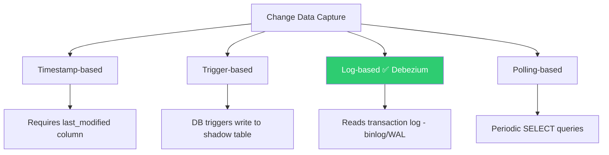
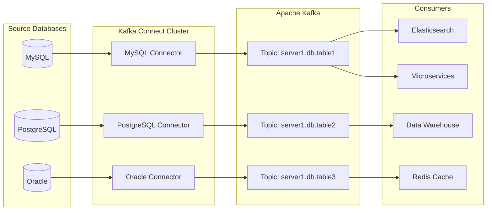
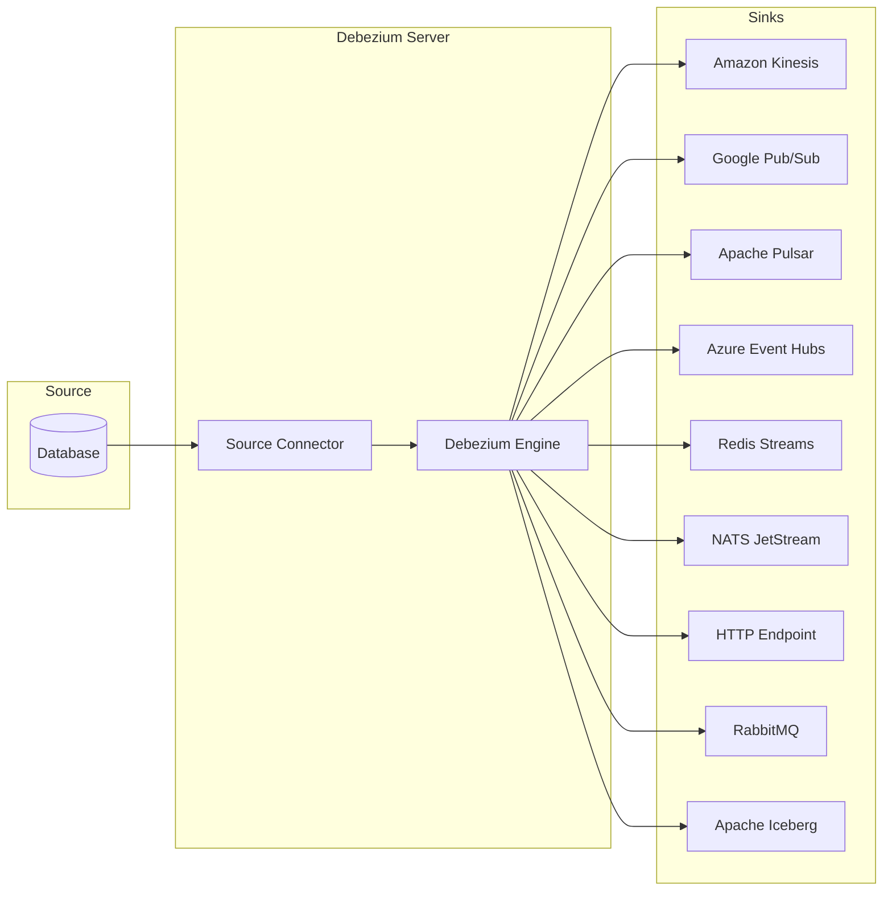
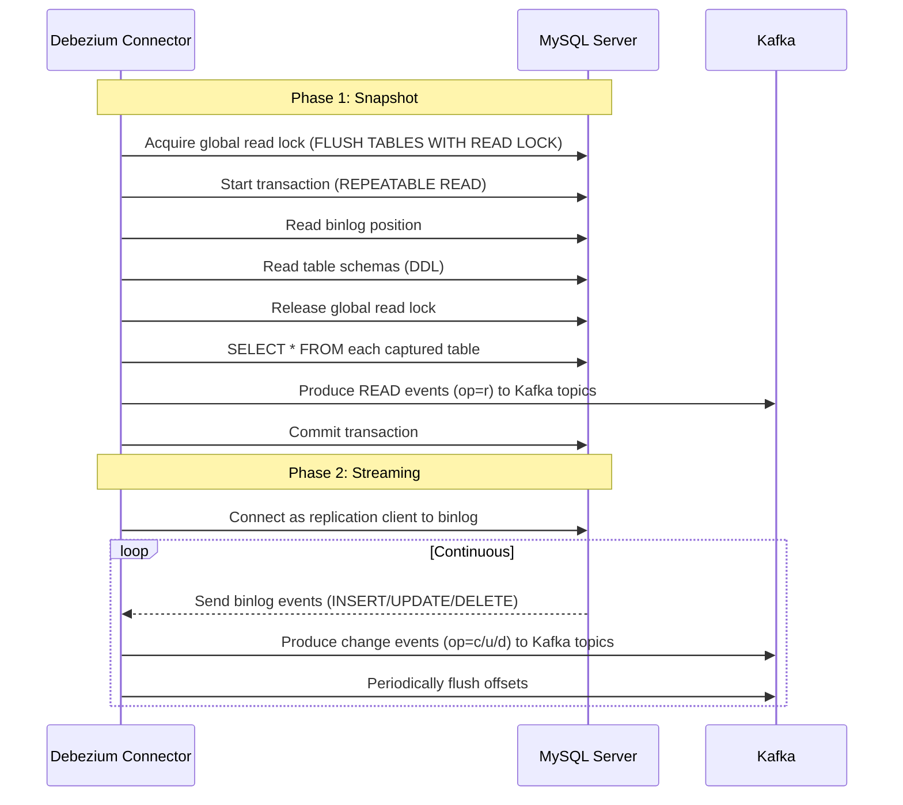
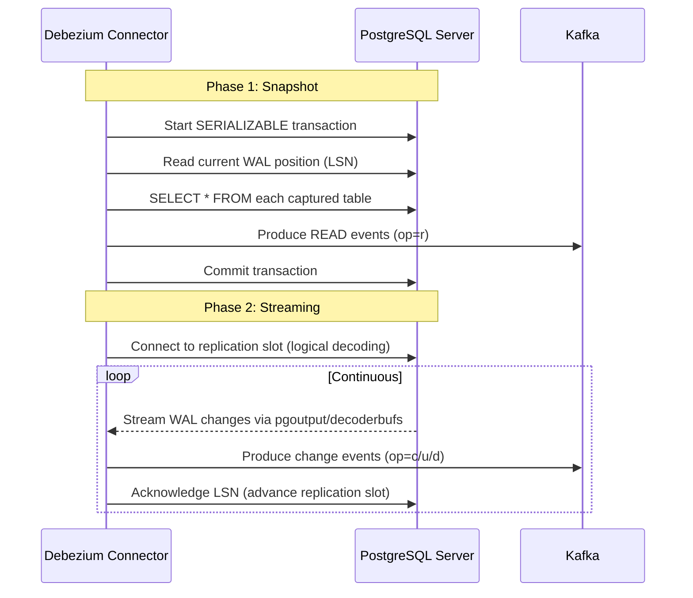
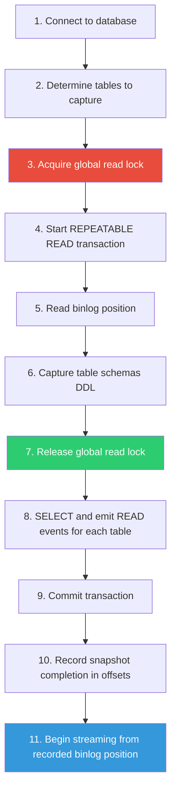
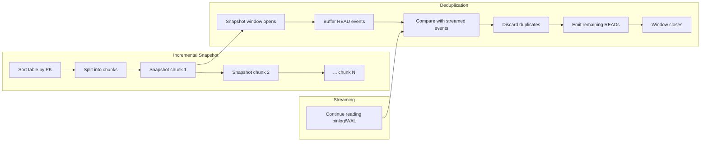
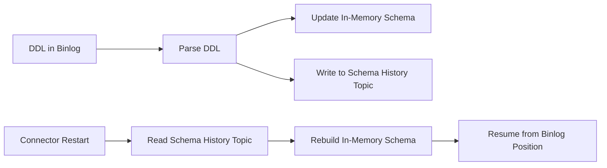
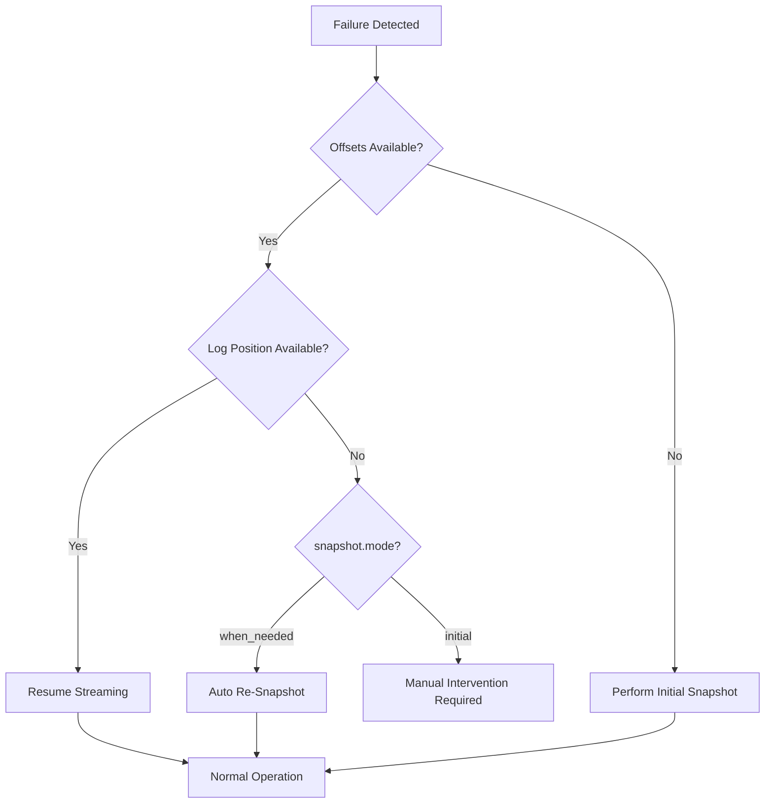

# Debezium — Comprehensive Notes for Data Engineers

---

## Table of Contents

1. [What is Debezium?](#1-what-is-debezium)
2. [Change Data Capture (CDC) — The Foundation](#2-change-data-capture-cdc--the-foundation)
3. [Architecture & Deployment Models](#3-architecture--deployment-models)
4. [Supported Connectors](#4-supported-connectors)
5. [Core Concepts & Terminologies](#5-core-concepts--terminologies)
6. [How Debezium Works — Deep Dive](#6-how-debezium-works--deep-dive)
7. [Setup & Configuration — MySQL](#7-setup--configuration--mysql)
8. [Setup & Configuration — PostgreSQL](#8-setup--configuration--postgresql)
9. [Debezium Server (Non-Kafka Deployments)](#9-debezium-server-non-kafka-deployments)
10. [Data Change Events — Structure](#10-data-change-events--structure)
11. [Snapshot Modes](#11-snapshot-modes)
12. [Incremental Snapshots](#12-incremental-snapshots)
13. [Single Message Transformations (SMTs)](#13-single-message-transformations-smts)
14. [Schema Evolution & Schema History](#14-schema-evolution--schema-history)
15. [Monitoring & Metrics](#15-monitoring--metrics)
16. [Fault Tolerance & Recovery](#16-fault-tolerance--recovery)
17. [Docker Quick Start Tutorial](#17-docker-quick-start-tutorial)
18. [Cloud Deployments](#18-cloud-deployments)
19. [Best Practices](#19-best-practices)
20. [Interview Questions & Answers](#20-interview-questions--answers)
21. [Scenario-Based Questions](#21-scenario-based-questions)

---

## 1. What is Debezium?

**Debezium** is an open-source, distributed platform for **Change Data Capture (CDC)**. It captures row-level changes in databases and streams them as event records to **Apache Kafka** topics in real-time.

### Key Characteristics

| Feature | Description |
|---------|-------------|
| **Open Source** | Apache 2.0 licensed, maintained by Red Hat |
| **Log-Based CDC** | Reads database transaction logs (binlog, WAL, redo log) |
| **Exactly-Once Semantics** | Under normal operation, every change is delivered exactly once |
| **At-Least-Once Delivery** | During fault recovery, duplicates are possible |
| **Schema-Aware** | Tracks schema changes and evolves event schemas |
| **Low Latency** | Sub-second change propagation |
| **Fault Tolerant** | Resumes from where it left off after crashes |

### Why Debezium over Traditional ETL?

| Traditional ETL / Polling | Debezium (Log-based CDC) |
|---------------------------|--------------------------|
| Periodic batch queries | Real-time streaming |
| Misses intermediate changes | Captures every row-level change |
| Adds load on source DB | Minimal impact — reads transaction log |
| Cannot detect deletes easily | Captures INSERT, UPDATE, DELETE, TRUNCATE |
| Requires timestamp/flag columns | No schema changes needed on source |
| High latency (minutes-hours) | Low latency (milliseconds-seconds) |

---

## 2. Change Data Capture (CDC) — The Foundation

CDC is a set of patterns used to identify and capture changes made to data in a database. Debezium specifically uses **log-based CDC**.

### Types of CDC



### Why Log-Based CDC is Superior

- **No schema modifications** required on the source database
- **Captures all changes** including deletes
- **No performance overhead** on the database (reads the already-written log)
- **Preserves ordering** of operations
- **Captures DDL changes** (schema evolution)

---

## 3. Architecture & Deployment Models

### 3.1 Deployment via Kafka Connect (Recommended for Kafka)



**Key Points:**
- Debezium connectors are deployed as **Kafka Connect source connectors**
- Each connector monitors one database and produces events to Kafka topics
- Kafka Connect manages connector lifecycle, offset tracking, and fault tolerance
- Sink connectors (Elasticsearch, JDBC, etc.) consume from Kafka topics

### 3.2 Debezium Server (Non-Kafka Deployments)



### 3.3 Debezium Embedded Engine (Library Mode)

- Embed Debezium as a Java library directly in your application
- No Kafka or Kafka Connect required
- Useful for streaming to custom destinations or in-app consumption
- Used with `DebeziumEngine` API

### Deployment Comparison

| Feature | Kafka Connect | Debezium Server | Embedded Engine |
|---------|--------------|-----------------|-----------------|
| Requires Kafka | ✅ Yes | ❌ No | ❌ No |
| Managed Offsets | Kafka topics | File/Redis/JDBC | Custom |
| Fault Tolerance | Distributed | Single instance | App-managed |
| Scalability | Horizontal | Single instance | App-dependent |
| Use Case | Production CDC pipelines | Non-Kafka messaging | Custom applications |

---

## 4. Supported Connectors

| Connector | Database | Log Mechanism | Status |
|-----------|----------|---------------|--------|
| MySQL | MySQL 5.7+ / 8.x | Binary Log (binlog) | Stable |
| MariaDB | MariaDB 10.x+ | Binary Log | Stable |
| PostgreSQL | PostgreSQL 10+ | WAL (Write-Ahead Log) via Logical Decoding | Stable |
| MongoDB | MongoDB 3.6+ | Oplog / Change Streams | Stable |
| SQL Server | SQL Server 2016+ | Change Data Capture (CT) | Stable |
| Oracle | Oracle 11g+ | LogMiner / XStream | Stable |
| Db2 | IBM Db2 11.5+ | ASN Capture | Stable |
| Cassandra | Apache Cassandra 3.x/4.x | Commit Log | Stable |
| Vitess | Vitess | VStream gRPC | Incubating |
| Spanner | Google Cloud Spanner | Change Streams | Stable |
| Informix | IBM Informix | Change Data Capture | Incubating |

---

## 5. Core Concepts & Terminologies

### Essential Terminology

| Term | Definition |
|------|-----------|
| **Connector** | A Kafka Connect plugin that monitors a specific database |
| **Task** | The unit of work within a connector (Debezium uses exactly 1 task) |
| **Topic Prefix** | Namespace for all Kafka topics created by a connector instance |
| **Snapshot** | Initial consistent copy of existing data before streaming begins |
| **Streaming** | Continuous reading of the transaction log after snapshot completes |
| **Offset** | Position marker in the transaction log (binlog position, LSN, SCN) |
| **Schema History** | Internal Kafka topic storing DDL history (MySQL, SQL Server, Oracle) |
| **Schema Change Topic** | Optional public topic publishing schema change events |
| **Tombstone Event** | Event with null value after DELETE, enables Kafka log compaction |
| **Heartbeat** | Periodic messages to track connector liveness and advance offsets |
| **Signal Table** | Database table used to send commands (signals) to the connector |
| **Signaling** | Mechanism to trigger ad-hoc operations (snapshots, log position changes) |
| **SMT** | Single Message Transform — lightweight per-message modification |
| **Envelope** | The overall structure wrapping `before`, `after`, `source`, `op` fields |
| **GTID** | Global Transaction ID — globally unique transaction identifier in MySQL |
| **LSN** | Log Sequence Number — position in PostgreSQL WAL |
| **WAL** | Write-Ahead Log — PostgreSQL's transaction log |
| **Binlog** | Binary Log — MySQL's transaction log |
| **Replication Slot** | PostgreSQL mechanism ensuring WAL retention for a consumer |
| **Logical Decoding** | PostgreSQL feature to extract changes from WAL in a user-friendly format |
| **Publication** | PostgreSQL object defining which tables participate in logical replication |
| **Replica Identity** | PostgreSQL table setting controlling what data is in UPDATE/DELETE events |

### Event Operation Types

| Code | Operation | Description |
|------|-----------|-------------|
| `c` | CREATE | A row was inserted |
| `u` | UPDATE | A row was updated |
| `d` | DELETE | A row was deleted |
| `r` | READ | A row was read during snapshot |
| `t` | TRUNCATE | A table was truncated |
| `m` | MESSAGE | A logical decoding message (PostgreSQL only) |

---

## 6. How Debezium Works — Deep Dive

### 6.1 MySQL Connector Workflow



**MySQL Key Mechanisms:**
- Uses **binlog** (binary log) — must be set to `ROW` format
- Connector acts as a **MySQL replication client** (like a replica)
- Requires `REPLICATION SLAVE`, `REPLICATION CLIENT`, `SELECT` privileges
- **Schema History Topic**: Internal Kafka topic storing all DDL changes
- Supports: Standalone, Primary-Replica, HA Clusters, Multi-Primary, Hosted (RDS/Aurora)

### 6.2 PostgreSQL Connector Workflow



**PostgreSQL Key Mechanisms:**
- Uses **Logical Decoding** via WAL (Write-Ahead Log)
- Requires a **logical replication slot** and **publication**
- Output plugins: `pgoutput` (built-in for PG 10+), `decoderbufs` (Protobuf)
- **Replica Identity** controls what columns appear in UPDATE/DELETE events
  - `DEFAULT`: Only primary key columns in `before`
  - `FULL`: All columns in `before`
  - `NOTHING`: No columns in `before`
  - `INDEX`: Columns from a specified index

### 6.3 Topic Naming Convention

```
<topic.prefix>.<databaseName>.<tableName>     # MySQL
<topic.prefix>.<schemaName>.<tableName>        # PostgreSQL
```

**Example:**
```
fulfillment.inventory.orders       # MySQL
fulfillment.public.customers       # PostgreSQL
```

---

## 7. Setup & Configuration — MySQL

### 7.1 Prerequisites: MySQL Server Configuration

```sql
-- 1. Enable binlog (in my.cnf / mysql.cnf)
[mysqld]
server-id         = 223344
log_bin           = mysql-bin
binlog_format     = ROW
binlog_row_image  = FULL
binlog_expire_logs_seconds = 864000

-- 2. Enable GTIDs (recommended)
gtid_mode = ON
enforce_gtid_consistency = ON

-- 3. Create Debezium user
CREATE USER 'debezium'@'%' IDENTIFIED BY 'dbz_password';

GRANT SELECT, RELOAD, SHOW DATABASES, REPLICATION SLAVE, REPLICATION CLIENT
ON *.* TO 'debezium'@'%';

FLUSH PRIVILEGES;
```

### 7.2 Connector Configuration (JSON)

```json
{
  "name": "inventory-connector",
  "config": {
    "connector.class": "io.debezium.connector.mysql.MySqlConnector",
    "tasks.max": "1",
    "database.hostname": "mysql-server",
    "database.port": "3306",
    "database.user": "debezium",
    "database.password": "dbz_password",
    "database.server.id": "184054",
    "topic.prefix": "dbserver1",
    "database.include.list": "inventory",
    "table.include.list": "inventory.customers,inventory.orders",
    "schema.history.internal.kafka.bootstrap.servers": "kafka:9092",
    "schema.history.internal.kafka.topic": "schema-changes.inventory",
    "include.schema.changes": "true",
    "snapshot.mode": "initial",
    "snapshot.locking.mode": "minimal",
    "tombstones.on.delete": "true",
    "decimal.handling.mode": "double",
    "time.precision.mode": "adaptive_time_microseconds",
    "binary.handling.mode": "base64",
    "heartbeat.interval.ms": "10000",
    "signal.data.collection": "inventory.debezium_signal"
  }
}
```

### 7.3 Deploy Connector via REST API

```bash
# Register connector
curl -i -X POST -H "Accept:application/json" -H "Content-Type:application/json" \
  http://localhost:8083/connectors/ -d @mysql-connector.json

# Check connector status
curl -s http://localhost:8083/connectors/inventory-connector/status | jq .

# List all connectors
curl -s http://localhost:8083/connectors/ | jq .

# Pause connector
curl -X PUT http://localhost:8083/connectors/inventory-connector/pause

# Resume connector
curl -X PUT http://localhost:8083/connectors/inventory-connector/resume

# Delete connector
curl -X DELETE http://localhost:8083/connectors/inventory-connector

# Restart connector
curl -X POST http://localhost:8083/connectors/inventory-connector/restart
```

### 7.4 Key MySQL Configuration Properties

| Property | Default | Description |
|----------|---------|-------------|
| `connector.class` | — | Must be `io.debezium.connector.mysql.MySqlConnector` |
| `database.hostname` | — | MySQL server address |
| `database.port` | `3306` | MySQL port |
| `database.user` | — | User with replication privileges |
| `database.server.id` | — | Unique numeric ID (acts as replica) |
| `topic.prefix` | — | Namespace for all topics |
| `database.include.list` | (all) | Regex list of databases to capture |
| `table.include.list` | (all) | Regex list of tables to capture |
| `column.include.list` | (all) | Regex list of columns to include |
| `column.exclude.list` | (none) | Regex list of columns to exclude |
| `snapshot.mode` | `initial` | When to take snapshots |
| `snapshot.locking.mode` | `minimal` | Lock strategy during snapshot |
| `schema.history.internal.kafka.topic` | — | Internal topic for DDL history |
| `include.schema.changes` | `true` | Publish DDL events to schema change topic |
| `include.query` | `false` | Include SQL query in events |
| `tombstones.on.delete` | `true` | Emit tombstone after delete events |
| `decimal.handling.mode` | `precise` | How to handle DECIMAL/NUMERIC |
| `time.precision.mode` | `adaptive_time_microseconds` | How to handle temporal types |
| `binary.handling.mode` | `bytes` | How to handle binary columns |
| `heartbeat.interval.ms` | `0` | Heartbeat frequency (0 = disabled) |
| `signal.data.collection` | — | Table for signaling (ad-hoc snapshots) |
| `max.batch.size` | `2048` | Max events per batch |
| `max.queue.size` | `8192` | Max events in internal queue |
| `poll.interval.ms` | `500` | Polling interval for new events |
| `connect.timeout.ms` | `30000` | Connection timeout |
| `gtid.source.includes` | — | Filter by GTID source UUIDs |
| `message.key.columns` | — | Override message keys |
| `column.mask.with.length.chars` | — | Mask sensitive columns with `*` |
| `column.mask.hash.SHA-256.with.salt.*` | — | Hash sensitive columns |
| `column.truncate.to.length.chars` | — | Truncate long column values |
| `skipped.operations` | `t` | Skip certain operation types |
| `provide.transaction.metadata` | `false` | Emit transaction boundary events |

---

## 8. Setup & Configuration — PostgreSQL

### 8.1 Prerequisites: PostgreSQL Server Configuration

```sql
-- 1. postgresql.conf settings
wal_level = logical
max_wal_senders = 4
max_replication_slots = 4

-- 2. Create replication user
CREATE ROLE debezium WITH REPLICATION LOGIN PASSWORD 'dbz_password';

-- 3. Grant permissions
GRANT SELECT ON ALL TABLES IN SCHEMA public TO debezium;

-- 4. pg_hba.conf — allow replication
-- host  replication  debezium  0.0.0.0/0  md5

-- 5. Create publication (optional, Debezium can auto-create)
CREATE PUBLICATION dbz_publication FOR ALL TABLES;

-- 6. Set REPLICA IDENTITY for tables (recommended: FULL)
ALTER TABLE customers REPLICA IDENTITY FULL;
```

### 8.2 Connector Configuration (JSON)

```json
{
  "name": "postgres-connector",
  "config": {
    "connector.class": "io.debezium.connector.postgresql.PostgresConnector",
    "tasks.max": "1",
    "database.hostname": "postgres-server",
    "database.port": "5432",
    "database.user": "debezium",
    "database.password": "dbz_password",
    "database.dbname": "mydb",
    "topic.prefix": "pgserver1",
    "schema.include.list": "public",
    "table.include.list": "public.customers,public.orders",
    "plugin.name": "pgoutput",
    "slot.name": "debezium_slot",
    "publication.name": "dbz_publication",
    "publication.autocreate.mode": "filtered",
    "snapshot.mode": "initial",
    "tombstones.on.delete": "true",
    "decimal.handling.mode": "double",
    "heartbeat.interval.ms": "10000",
    "replica.identity.autoset.values": "public.customers:FULL,public.orders:FULL"
  }
}
```

### 8.3 Key PostgreSQL-Specific Properties

| Property | Default | Description |
|----------|---------|-------------|
| `plugin.name` | `decoderbufs` | Logical decoding plugin (`pgoutput` recommended for PG 10+) |
| `slot.name` | `debezium` | Name of the replication slot |
| `slot.drop.on.stop` | `false` | Drop slot when connector stops (testing only!) |
| `publication.name` | `dbz_publication` | PostgreSQL publication name |
| `publication.autocreate.mode` | `all_tables` | How Debezium creates publications |
| `replica.identity.autoset.values` | — | Auto-set REPLICA IDENTITY per table |
| `schema.include.list` | (all) | Schemas to capture |
| `schema.exclude.list` | — | Schemas to exclude |
| `hstore.handling.mode` | `json` | How to handle HSTORE columns |
| `interval.handling.mode` | `numeric` | How to handle INTERVAL columns |
| `status.update.interval.ms` | `10000` | Replication status update frequency |
| `flush.lsn.source` | — | Deprecated; use `lsn.flush.mode` |
| `lsn.flush.mode` | `connector` | How LSNs are flushed to the replication slot |
| `schema.refresh.mode` | `columns_diff` | When to refresh in-memory schema |
| `snapshot.isolation.mode` | `serializable` | Transaction isolation during snapshot |

---

## 9. Debezium Server (Non-Kafka Deployments)

Debezium Server is a standalone, ready-to-use application for streaming CDC events to non-Kafka sinks.

### Installation

```bash
# Download and extract
wget https://repo1.maven.org/maven2/io/debezium/debezium-server-dist/3.5.1.Final/debezium-server-dist-3.5.1.Final.tar.gz
tar -xzf debezium-server-dist-3.5.1.Final.tar.gz
cd debezium-server
```

### Configuration (`config/application.properties`)

```properties
# Source (PostgreSQL example)
debezium.source.connector.class=io.debezium.connector.postgresql.PostgresConnector
debezium.source.database.hostname=localhost
debezium.source.database.port=5432
debezium.source.database.user=postgres
debezium.source.database.password=postgres
debezium.source.database.dbname=postgres
debezium.source.topic.prefix=tutorial
debezium.source.schema.include.list=inventory
debezium.source.plugin.name=pgoutput

# Offset storage (file-based)
debezium.source.offset.storage=org.apache.kafka.connect.storage.FileOffsetBackingStore
debezium.source.offset.storage.file.filename=data/offsets.dat
debezium.source.offset.flush.interval.ms=0

# Sink (Amazon Kinesis example)
debezium.sink.type=kinesis
debezium.sink.kinesis.region=us-east-1

# Format
debezium.format.value=json
debezium.format.key=json
```

### Supported Sinks

| Sink | Config Value | Description |
|------|-------------|-------------|
| Amazon Kinesis | `kinesis` | AWS streaming service |
| Google Cloud Pub/Sub | `pubsub` | GCP messaging |
| Google Cloud Pub/Sub Lite | `pubsublite` | Cost-effective Pub/Sub |
| Apache Pulsar | `pulsar` | Distributed messaging |
| Azure Event Hubs | `eventhubs` | Azure event ingestion |
| Redis Streams | `redis` | In-memory streaming |
| NATS JetStream | `nats-jetstream` | NATS persistent messaging |
| NATS Streaming | `nats-streaming` | NATS streaming (legacy) |
| Apache Kafka | `kafka` | Standard Kafka |
| HTTP Client | `http` | HTTP endpoints / Knative |
| RabbitMQ | `rabbitmq` | AMQP messaging |
| RabbitMQ Streams | `rabbitmqstream` | RabbitMQ native streams |
| Infinispan | `infinispan` | In-memory data grid |
| Apache RocketMQ | `rocketmq` | Distributed messaging |
| Pravega | `pravega` | Dell streaming storage |
| Apache Iceberg | `iceberg` | Table format for data lakes |
| Milvus | `milvus` | Vector database |
| Qdrant | `qdrant` | Vector database |

### Offset Storage Options

| Storage | Class |
|---------|-------|
| File | `org.apache.kafka.connect.storage.FileOffsetBackingStore` |
| In-Memory | `org.apache.kafka.connect.storage.MemoryOffsetBackingStore` |
| JDBC Database | `io.debezium.storage.jdbc.offset.JdbcOffsetBackingStore` |
| Redis | `io.debezium.storage.redis.offset.RedisOffsetBackingStore` |
| Apache Iceberg | `io.debezium.server.iceberg.offset.IcebergOffsetBackingStore` |

---

## 10. Data Change Events — Structure

### Event Envelope Structure

Every Debezium change event has two parts: **key** and **value**. Both have a `schema` and `payload`.

```json
{
  "schema": { ... },       // Key schema
  "payload": { "id": 1004 } // Key payload (primary key)
}
```

```json
{
  "schema": { ... },       // Value schema (Envelope definition)
  "payload": {
    "before": { ... },     // Row state BEFORE the change (null for INSERT)
    "after":  { ... },     // Row state AFTER the change (null for DELETE)
    "source": {            // Source metadata
      "version": "3.5.1.Final",
      "connector": "mysql",
      "name": "dbserver1",
      "ts_ms": 1559033904863,
      "snapshot": false,
      "db": "inventory",
      "table": "customers",
      "server_id": 223344,
      "file": "mysql-bin.000003",
      "pos": 154,
      "row": 0,
      "gtid": null,
      "thread": 3,
      "query": null
    },
    "op": "c",              // Operation type: c/u/d/r/t
    "ts_ms": 1559033904961, // Debezium processing timestamp
    "transaction": null     // Transaction metadata (if enabled)
  }
}
```

### Event Examples

#### CREATE Event (`op: "c"`)
```json
{
  "before": null,
  "after": {
    "id": 1004,
    "first_name": "Anne",
    "last_name": "Kretchmar",
    "email": "annek@noanswer.org"
  },
  "op": "c"
}
```

#### UPDATE Event (`op: "u"`)
```json
{
  "before": {
    "id": 1004,
    "first_name": "Anne",
    "last_name": "Kretchmar",
    "email": "annek@noanswer.org"
  },
  "after": {
    "id": 1004,
    "first_name": "Anne Marie",
    "last_name": "Kretchmar",
    "email": "annek@noanswer.org"
  },
  "op": "u"
}
```

#### DELETE Event (`op: "d"`)
```json
{
  "before": {
    "id": 1004,
    "first_name": "Anne Marie",
    "last_name": "Kretchmar",
    "email": "annek@noanswer.org"
  },
  "after": null,
  "op": "d"
}
```

#### Tombstone Event (follows DELETE)
```json
{
  "schema": null,
  "payload": null
}
```
> Tombstone events enable Kafka log compaction to remove all events for a deleted key.

#### TRUNCATE Event (`op: "t"`)
```json
{
  "before": null,
  "after": null,
  "op": "t"
}
```

---

## 11. Snapshot Modes

### MySQL Snapshot Modes

| Mode | Behavior |
|------|----------|
| `initial` (default) | Full snapshot on first start, then streaming |
| `initial_only` | Full snapshot only, no streaming after |
| `always` | Full snapshot on every restart |
| `no_data` (was `schema_only`) | Capture schema only, skip data |
| `never` | No snapshot, start streaming immediately |
| `when_needed` | Snapshot if offsets are missing or binlog unavailable |
| `recovery` | Rebuild schema history topic from source tables |
| `configuration_based` | Control via `snapshot.mode.configuration.based.*` properties |
| `custom` | Provide custom `Snapshotter` implementation |

### PostgreSQL Snapshot Modes

| Mode | Behavior |
|------|----------|
| `initial` (default) | Full snapshot on first start |
| `initial_only` | Snapshot only, then stop |
| `always` | Full snapshot on every restart |
| `no_data` (was `never`) | Stream from current WAL position |
| `when_needed` | Snapshot if offsets missing or unavailable |
| `configuration_based` | Control via properties |
| `custom` | Custom implementation |

### Snapshot Workflow (MySQL with Global Read Lock)



---

## 12. Incremental Snapshots

Incremental snapshots allow you to **re-snapshot tables on-the-fly** without stopping the connector or blocking streaming.

### How It Works



### Key Characteristics:
- Runs **concurrently** with streaming
- Processes tables in **chunks** (default: 1024 rows per chunk)
- Uses a **snapshot window** for deduplication
- Requires a **signaling table** in the database

### Triggering via Signal Table

```sql
-- Create signal table
CREATE TABLE debezium_signal (
  id VARCHAR(42) PRIMARY KEY,
  type VARCHAR(32) NOT NULL,
  data VARCHAR(2048) NULL
);

-- Trigger incremental snapshot
INSERT INTO debezium_signal (id, type, data)
VALUES (
  'ad-hoc-1',
  'execute-snapshot',
  '{"data-collections": ["inventory.customers", "inventory.orders"], "type": "incremental"}'
);

-- Trigger with filter condition
INSERT INTO debezium_signal (id, type, data)
VALUES (
  'ad-hoc-2',
  'execute-snapshot',
  '{"data-collections": ["inventory.products"], "type": "incremental", "additional-conditions": [{"data-collection": "inventory.products", "filter": "color=''blue''"}]}'
);

-- Stop incremental snapshot
INSERT INTO debezium_signal (id, type, data)
VALUES (
  'stop-1',
  'stop-snapshot',
  '{"data-collections": ["inventory.customers"], "type": "incremental"}'
);
```

### Triggering via Kafka Signal Topic

```json
// Key: <topic.prefix>
// Value:
{
  "type": "execute-snapshot",
  "data": {
    "data-collections": ["inventory.customers"],
    "type": "INCREMENTAL"
  }
}
```

### Blocking Snapshots

Unlike incremental, **blocking snapshots** pause streaming, take a full snapshot, then resume:
- Useful for adding large tables quickly
- Triggered the same way as incremental but with `"type": "blocking"`

---

## 13. Single Message Transformations (SMTs)

Debezium provides several built-in SMTs for transforming events before they reach Kafka:

| SMT | Purpose |
|-----|---------|
| **Topic Routing** | Re-route events to different topics based on regex |
| **Content-Based Routing** | Route based on event content |
| **New Record State Extraction** | Flatten the event to just `after` values (for sink connectors) |
| **Outbox Event Router** | Implement the transactional outbox pattern |
| **Message Filtering** | Filter events based on content (requires scripting) |
| **HeaderToValue** | Copy headers into the record value |
| **Partition Routing** | Route to specific partitions based on payload fields |
| **Timezone Converter** | Convert timestamps to a specific timezone |
| **ReadToInsertEvent** | Convert snapshot `READ` (op=r) events to `CREATE` (op=c) |

### Example: Flatten events for a JDBC sink

```json
{
  "transforms": "unwrap",
  "transforms.unwrap.type": "io.debezium.transforms.ExtractNewRecordState",
  "transforms.unwrap.drop.tombstones": "false",
  "transforms.unwrap.delete.handling.mode": "rewrite",
  "transforms.unwrap.add.fields": "op,table,source.ts_ms"
}
```

### Example: Route events to different topics

```json
{
  "transforms": "route",
  "transforms.route.type": "io.debezium.transforms.ByLogicalTableRouter",
  "transforms.route.topic.regex": "(.*)\\.(.*)\\.(.*)",
  "transforms.route.topic.replacement": "$1_all_events"
}
```

---

## 14. Schema Evolution & Schema History

### MySQL Schema History

- MySQL includes **DDL statements** in the binlog alongside data changes
- Debezium parses DDL and maintains an **in-memory schema representation**
- All DDL is written to the **schema history topic** (internal Kafka topic)
- On restart, Debezium replays DDL from the schema history topic to rebuild schemas



**Important Rules:**
- Schema history topic must have **exactly 1 partition**
- **Never** delete the schema history topic unless doing a `recovery` snapshot
- Set `schema.history.internal.store.only.captured.tables.ddl = false` to capture all table schemas

### PostgreSQL Schema Handling

- PostgreSQL connector uses **JDBC metadata** (not a schema history topic)
- Schema is read at connector start and refreshed when changes are detected
- `schema.refresh.mode` controls when in-memory schema is refreshed
- **Replica Identity** determines what data appears in UPDATE/DELETE events

---

## 15. Monitoring & Metrics

### JMX MBean Naming

```
debezium.<connector>:type=connector-metrics,context=<context>,server=<topic.prefix>
```

| Context | Description |
|---------|-------------|
| `snapshot` | Metrics during snapshot operations |
| `streaming` | Metrics during streaming |
| `schema-history` | Schema history metrics (MySQL, SQL Server) |

### Key Snapshot Metrics

| Metric | Type | Description |
|--------|------|-------------|
| `SnapshotRunning` | boolean | Whether snapshot is in progress |
| `SnapshotCompleted` | boolean | Whether snapshot finished |
| `RemainingTableCount` | int | Tables remaining to snapshot |
| `RowsScanned` | Map | Rows scanned per table |
| `TotalTableCount` | int | Total tables being captured |
| `SnapshotDurationInSeconds` | long | Duration of snapshot |

### Key Streaming Metrics

| Metric | Type | Description |
|--------|------|-------------|
| `Connected` | boolean | Is connector connected to database |
| `MilliSecondsBehindSource` | long | Lag between DB change and connector processing |
| `TotalNumberOfEventsSeen` | long | Total change events processed |
| `TotalNumberOfCreateEventsSeen` | long | Total INSERT events |
| `TotalNumberOfUpdateEventsSeen` | long | Total UPDATE events |
| `TotalNumberOfDeleteEventsSeen` | long | Total DELETE events |
| `NumberOfEventsFiltered` | long | Events filtered by include/exclude rules |
| `QueueRemainingCapacity` | int | Space left in internal queue |
| `LastEvent` | string | Last event processed |
| `NumberOfCommittedTransactions` | long | Committed transactions |
| `CapturedTables` | string[] | List of captured tables |

### Custom MBean Tags

```json
{
  "custom.metric.tags": "env=production,team=data-platform"
}
```

This appends tags to the MBean name, making it resilient to topic prefix changes.

---

## 16. Fault Tolerance & Recovery

### What Happens When Things Go Wrong

| Failure Scenario | Behavior |
|------------------|----------|
| **Invalid configuration** | Connector fails to start, logs error |
| **Database unavailable** | Connector fails, must be restarted when DB is back |
| **Kafka Connect stops gracefully** | Flushes events, records offsets, tasks restart on other nodes |
| **Kafka Connect crashes** | Tasks restart on other nodes, may produce some duplicate events |
| **Kafka unavailable** | Connector pauses, resumes when Kafka is back |
| **Connector stopped for a long time** | Resumes from recorded offset if transaction log still available |
| **Transaction log purged** | Connector fails; must re-snapshot (`when_needed` mode helps) |
| **PostgreSQL replication slot deleted** | Data loss! Never delete replication slots in production |

### Recovery Strategies



### Identifying Duplicate Events

Each event's `source` block contains:
- `file` + `pos` (MySQL binlog position)
- `lsn` (PostgreSQL WAL position)
- `gtid` (MySQL Global Transaction ID)
- `txId` (PostgreSQL transaction ID)
- `ts_ms` (database timestamp)

Consumers can use these fields to detect and deduplicate events.

---

## 17. Docker Quick Start Tutorial

### Start Infrastructure

```bash
# 1. Start Kafka (KRaft mode)
docker run -it --rm -p 9092:9092 --name kafka --hostname kafka \
  -e CLUSTER_ID=my-unique-cluster-id \
  -e NODE_ID=1 \
  -e NODE_ROLE=combined \
  -e KAFKA_CONTROLLER_QUORUM_VOTERS=1@kafka:9093 \
  -e KAFKA_LISTENERS=PLAINTEXT://kafka:9092,CONTROLLER://kafka:9093 \
  -e KAFKA_ADVERTISED_LISTENERS=PLAINTEXT://kafka:9092 \
  quay.io/debezium/kafka:3.5

# 2. Start MySQL with sample data
docker run -it --rm --name mysql -p 3306:3306 \
  -e MYSQL_ROOT_PASSWORD=debezium \
  -e MYSQL_USER=mysqluser \
  -e MYSQL_PASSWORD=mysqlpw \
  quay.io/debezium/example-mysql:3.5

# 3. Start Kafka Connect with Debezium
docker run -it --rm --name connect -p 8083:8083 \
  -e GROUP_ID=1 \
  -e CONFIG_STORAGE_TOPIC=my_connect_configs \
  -e OFFSET_STORAGE_TOPIC=my_connect_offsets \
  -e STATUS_STORAGE_TOPIC=my_connect_statuses \
  --link kafka:kafka --link mysql:mysql \
  quay.io/debezium/connect:3.5

# 4. Register connector
curl -i -X POST -H "Accept:application/json" -H "Content-Type:application/json" \
  localhost:8083/connectors/ -d '{
    "name": "inventory-connector",
    "config": {
      "connector.class": "io.debezium.connector.mysql.MySqlConnector",
      "tasks.max": "1",
      "database.hostname": "mysql",
      "database.port": "3306",
      "database.user": "debezium",
      "database.password": "dbz",
      "database.server.id": "184054",
      "topic.prefix": "dbserver1",
      "database.include.list": "inventory",
      "schema.history.internal.kafka.bootstrap.servers": "kafka:9092",
      "schema.history.internal.kafka.topic": "schemahistory.inventory"
    }
  }'

# 5. Watch events
docker run -it --rm --link kafka:kafka \
  quay.io/debezium/kafka:3.5 watch-topic -a -k dbserver1.inventory.customers
```

---

## 18. Cloud Deployments

### PostgreSQL on Amazon RDS

```properties
# Required RDS parameter group changes
rds.logical_replication = 1          # Automatically sets wal_level = logical

# Debezium connector config
plugin.name = pgoutput
# User must have rds_replication role
# GRANT rds_replication TO debezium_user;
```

### PostgreSQL on Azure Database

```bash
# Set replication support
az postgres server configuration set \
  --resource-group mygroup --server-name myserver \
  --name azure.replication_support --value logical

az postgres server restart --resource-group mygroup --name myserver
```

### PostgreSQL on Google Cloud SQL

```properties
# Set flag: cloudsql.logical_decoding = on
# Automatically sets wal_level = logical

# User must have REPLICATION attribute
CREATE USER replication_user WITH REPLICATION IN ROLE cloudsqlsuperuser LOGIN PASSWORD 'secret';

# Debezium config
plugin.name = pgoutput
```

### MySQL on Amazon RDS / Aurora

- Enable automated backups (required for binlog)
- Global read locks not available → Debezium uses table-level locks
- Use `snapshot.locking.mode = none` for Aurora

---

## 19. Best Practices

### Configuration Best Practices

1. **Enable heartbeats** (`heartbeat.interval.ms > 0`) — especially for low-traffic databases to prevent WAL/binlog growth
2. **Use `pgoutput`** for PostgreSQL 10+ — no additional plugins needed
3. **Set `REPLICA IDENTITY FULL`** for PostgreSQL tables — ensures UPDATE/DELETE events have full `before` data
4. **Use GTIDs for MySQL** — simplifies failover and replication
5. **Never drop replication slots** in PostgreSQL production
6. **Set `schema.history.internal.store.only.captured.tables.ddl = false`** — safer for future table additions
7. **Use `snapshot.mode = when_needed`** for self-healing on binlog/WAL gaps
8. **Mask sensitive columns** using `column.mask.with.length.chars` or `column.mask.hash`

### Performance Best Practices

1. **Tune `max.batch.size`** (default 2048) and **`max.queue.size`** (default 8192) based on throughput
2. **Use Avro + Schema Registry** instead of JSON to reduce message size significantly
3. **Set `snapshot.fetch.size`** appropriately for large tables
4. **Use `incremental.snapshot.chunk.size`** to control memory usage during incremental snapshots
5. **Enable parallel snapshots** with `snapshot.max.threads` > 1 (incubating feature)
6. **Set `poll.interval.ms`** lower for lower latency (e.g., 100ms)

### Operational Best Practices

1. **Monitor JMX metrics** — especially `MilliSecondsBehindSource` and `QueueRemainingCapacity`
2. **Set up alerts** for `Connected = false` and rising lag
3. **Use unique `slot.name`** per connector instance (PostgreSQL)
4. **Use unique `database.server.id`** per connector (MySQL)
5. **Test snapshot recovery** before going to production
6. **Plan for schema evolution** — test DDL changes with Debezium running

---

## 20. Interview Questions & Answers

### Basic Questions

**Q1: What is Debezium and what problem does it solve?**
> Debezium is an open-source platform for Change Data Capture (CDC). It monitors databases and captures row-level changes (INSERT, UPDATE, DELETE) from the transaction log, streaming them as events to Kafka topics. It solves the problem of keeping downstream systems synchronized with source databases in real-time without impacting database performance.

**Q2: How does Debezium differ from traditional CDC approaches like triggers or polling?**
> Debezium uses **log-based CDC**, reading the database's transaction log (binlog/WAL). Unlike triggers, it doesn't add overhead to write operations. Unlike polling, it captures every change including intermediate states and deletes, with sub-second latency and no need for timestamp columns.

**Q3: What databases does Debezium support?**
> MySQL, MariaDB, PostgreSQL, MongoDB, SQL Server, Oracle, Db2, Cassandra, Vitess (incubating), Spanner, and Informix (incubating).

**Q4: Explain the structure of a Debezium change event.**
> Each event has a **key** (primary key of changed row) and **value**. The value contains:
> - `before`: Row state before the change (null for INSERT)
> - `after`: Row state after the change (null for DELETE)
> - `source`: Metadata (connector, database, table, binlog position, timestamp)
> - `op`: Operation type (c=create, u=update, d=delete, r=read, t=truncate)
> - `ts_ms`: Debezium processing timestamp

**Q5: What is a tombstone event in Debezium?**
> A tombstone is an event with the same key as the deleted row but a **null value**. It's emitted after a DELETE event. Tombstone events enable Kafka's **log compaction** feature to fully remove all events for that key, reclaiming storage space.

**Q6: What is the difference between `snapshot.mode=initial` and `snapshot.mode=no_data`?**
> - `initial`: Takes a full snapshot of data + schema on first start, then streams changes
> - `no_data` (formerly `schema_only`): Captures only the schema, skips data. Only new changes after connector start are captured. Use when you don't need historical data.

**Q7: What is the role of the schema history topic?**
> For MySQL/SQL Server/Oracle connectors, the schema history topic stores all DDL statements. When the connector restarts, it replays these DDL statements to rebuild the in-memory schema representation, ensuring it can correctly interpret binlog events that were recorded when a different schema was in effect.

### Intermediate Questions

**Q8: How does Debezium handle schema changes (DDL)?**
> When Debezium encounters a DDL statement in the transaction log, it:
> 1. Parses the DDL statement
> 2. Updates its in-memory schema representation
> 3. Records the DDL in the schema history topic
> 4. Subsequent events use the new schema
>
> The event schema in Kafka evolves accordingly. Consumers using a schema registry with backward compatibility can handle these changes gracefully.

**Q9: What is an incremental snapshot and when would you use it?**
> An incremental snapshot re-reads table data **without stopping streaming**. It processes tables in chunks, running concurrently with normal change capture. Use it when:
> - You need to add a new table to an already-running connector
> - Kafka topics were deleted and need rebuilding
> - Data corruption occurred
> - You need to refresh specific table data

**Q10: Explain REPLICA IDENTITY in PostgreSQL and its impact on Debezium.**
> REPLICA IDENTITY controls what data appears in the `before` field of UPDATE/DELETE events:
> - `DEFAULT`: Only primary key columns (limited `before` data)
> - `FULL`: All columns (complete `before` data — recommended for Debezium)
> - `NOTHING`: No columns (no `before` data at all)
> - `INDEX`: Columns from a specified unique index
>
> Without `FULL`, consumers can't see the old values of non-key columns in UPDATE events.

**Q11: What happens if the MySQL binlog or PostgreSQL WAL is purged while Debezium is stopped?**
> If the transaction log no longer contains the position where Debezium last stopped, the connector **fails with an error**. Solutions:
> 1. Set `snapshot.mode = when_needed` — connector automatically re-snapshots
> 2. Manually trigger a new initial snapshot
> 3. Increase log retention (`binlog_expire_logs_seconds` for MySQL, `wal_keep_size` for PostgreSQL)

**Q12: How does Debezium guarantee ordering of events?**
> - Events for a single table are written to a single Kafka topic partition (by default, partitioned by primary key)
> - Within a partition, ordering is guaranteed
> - Across tables/partitions, ordering is not guaranteed
> - Transaction metadata (`provide.transaction.metadata = true`) can help correlate events from the same transaction

**Q13: What is the difference between Debezium Server and Kafka Connect deployment?**
> - **Kafka Connect**: Requires Kafka infrastructure, distributed fault tolerance, horizontally scalable, managed offsets in Kafka topics
> - **Debezium Server**: Standalone application, no Kafka required, supports non-Kafka sinks (Kinesis, Pub/Sub, Pulsar, etc.), single-instance, file/Redis/JDBC offset storage

**Q14: How do you handle sensitive data in Debezium events?**
> - `column.mask.with.length.chars`: Replace values with asterisks of specified length
> - `column.mask.hash.SHA-256.with.salt.<salt>`: Replace with hashed pseudonyms (preserves referential integrity)
> - `column.exclude.list`: Completely exclude columns from events
> - `column.truncate.to.length.chars`: Truncate long values
> - External: Use SMTs or stream processing for complex anonymization

**Q15: What are Debezium heartbeat events and why are they important?**
> Heartbeats are periodic messages sent to `__debezium-heartbeat.<topic.prefix>` topic. They're important because:
> 1. They allow the connector to **advance its offset** even when captured tables have no changes
> 2. Prevent **WAL/binlog growth** on PostgreSQL when changes occur on non-captured tables
> 3. Enable **monitoring** of connector liveness
> 4. Essential when the captured database has low traffic but the server has high traffic on other databases

### Advanced Questions

**Q16: How does Debezium's incremental snapshot achieve consistency without stopping streaming?**
> It uses a **snapshot window** mechanism:
> 1. Opens a window, reads a chunk of rows (READ events) into a buffer
> 2. Continues processing streamed events from the transaction log
> 3. Compares primary keys: if a streamed event matches a buffered READ, the READ is discarded (streamed event is newer)
> 4. After the window closes, remaining buffered READs are emitted
> 5. This deduplication ensures exactly-once semantics for snapshot data

**Q17: Explain the difference between `lsn.flush.mode` options in PostgreSQL connector.**
> - `connector` (default): Debezium flushes LSN after each event; JDBC driver keep-alive doesn't flush
> - `connector_and_driver`: Both Debezium and JDBC driver can flush LSNs. The driver flushes during keep-alive when connector has no pending LSN. This helps advance the slot for unmonitored WAL activity (VACUUM, CHECKPOINT), preventing unbounded WAL growth
> - `manual`: Flushing is managed externally by your application

**Q18: How would you set up Debezium for multiple connectors on the same PostgreSQL database?**
> Each connector needs:
> 1. A **unique replication slot** (`slot.name`): Each slot can only be used by one connector
> 2. A **unique publication** (`publication.name`): Unless connectors monitor the same tables
> 3. A **unique `topic.prefix`**: To avoid topic name collisions
> 4. A **unique consumer group**: In Kafka Connect distributed mode
>
> ⚠️ Never let two connectors share a replication slot — it causes data loss because a slot emits each change only once.

**Q19: What is the signaling table and what operations can it trigger?**
> The signaling table is a database table that connectors monitor for commands:
> - `execute-snapshot`: Trigger incremental or blocking snapshots
> - `stop-snapshot`: Stop an in-progress incremental snapshot
> - `set-binlog-position` (MySQL): Change the binlog reading position
> - Signals can also be sent via **Kafka signaling topics**, **JMX**, or **file channels**

**Q20: How does Debezium handle TOAST columns in PostgreSQL?**
> PostgreSQL uses TOAST (The Oversized-Attribute Storage Technique) for values > 8KB. If a TOAST column is not changed in an UPDATE:
> - With `REPLICA IDENTITY DEFAULT`: The unchanged TOAST value is **not included** in the event; Debezium uses a placeholder (`__debezium_unavailable_value`)
> - With `REPLICA IDENTITY FULL`: TOAST values are always included
> - Configure `unavailable.value.placeholder` to set the placeholder value
> - Set `schema.refresh.mode = columns_diff_exclude_unchanged_toast` for performance with frequently updated tables that have TOAST data

---

## 21. Scenario-Based Questions

**Scenario 1: You need to add a new table to an already-running Debezium connector. How do you do it?**

> **Answer:**
> 1. Update `table.include.list` in the connector configuration to add the new table
> 2. Restart or update the connector (PUT to Kafka Connect REST API)
> 3. Trigger an **incremental snapshot** for the new table via the signaling table:
>    ```sql
>    INSERT INTO debezium_signal (id, type, data)
>    VALUES ('add-table-1', 'execute-snapshot',
>    '{"data-collections": ["inventory.new_table"], "type": "incremental"}');
>    ```
> 4. The connector captures existing data via snapshot and new changes via streaming simultaneously

---

**Scenario 2: Your PostgreSQL WAL is growing indefinitely. What could be causing this?**

> **Answer:** Common causes:
> 1. **Low-traffic captured database** on a server with high-traffic databases — the connector can't advance the LSN because no events are being produced. **Fix**: Enable heartbeats with `heartbeat.interval.ms` and `heartbeat.action.query`
> 2. **Replication slot not being consumed** — connector is stopped or stuck. **Fix**: Restart the connector or drop and recreate the slot (with caution)
> 3. **Long-running transactions** blocking WAL recycling. **Fix**: Identify and terminate long transactions
> 4. **Multiple databases on same server** where Debezium captures from a low-activity database. **Fix**: Use heartbeat action query to periodically write to the captured database

---

**Scenario 3: After a connector restart, you notice duplicate events in Kafka. Why and how to handle?**

> **Answer:**
> - Debezium provides **at-least-once** delivery during recovery. The connector restarts from the last committed offset, and some events processed before the crash may not have had their offsets flushed.
> - **Handling:**
>   1. Make consumers **idempotent** (use primary keys for upserts)
>   2. Use the `source` metadata (`file`, `pos`, `lsn`, `gtid`) to detect duplicates
>   3. Increase `offset.flush.interval.ms` for more frequent offset commits (trades throughput for fewer duplicates)
>   4. Use transaction metadata and event ordering to detect replays

---

**Scenario 4: Your MySQL schema history topic is corrupted. How do you recover?**

> **Answer:**
> 1. Stop the connector
> 2. Delete the corrupted schema history topic
> 3. Set `snapshot.mode = recovery` in the connector configuration
> 4. Restart the connector
> 5. The connector rebuilds the schema history from the current database schema
> 6. ⚠️ **Warning**: Do NOT use `recovery` mode if schema changes occurred after the last connector shutdown — those intermediate schemas will be lost
> 7. After recovery, revert `snapshot.mode` back to `initial` or `no_data`

---

**Scenario 5: You need to stream CDC events to both Kafka and Amazon S3. How would you design this?**

> **Answer:** Two approaches:
> 1. **Kafka-centric** (recommended):
>    - Deploy Debezium via Kafka Connect → Events go to Kafka topics
>    - Use a Kafka Connect **S3 Sink Connector** to write from Kafka to S3
>    - Benefits: Kafka acts as a buffer, decouples producers from consumers
> 2. **Debezium Server + Kafka**:
>    - Use Debezium Server with Kafka sink for one path
>    - Use another Debezium Server instance with the Iceberg sink writing to S3
>    - ⚠️ Requires separate replication slots

---

**Scenario 6: A primary key UPDATE happens on a table. What events does Debezium produce?**

> **Answer:** Debezium produces **three events**:
> 1. A **DELETE** event with the old key (with header `__debezium.newkey` containing the new key)
> 2. A **Tombstone** event with the old key (null value)
> 3. A **CREATE** event with the new key (with header `__debezium.oldkey` containing the old key)
>
> This ensures proper handling in Kafka topics that are partitioned by key, since the event needs to go to different partitions.

---

**Scenario 7: You're running Debezium in production and the source database needs to be upgraded (e.g., PostgreSQL 14 → 16). What steps do you follow?**

> **Answer:**
> 1. Temporarily stop write operations or put apps in read-only mode
> 2. Wait for Debezium to consume all remaining WAL entries
> 3. Verify the connector has caught up (check `MilliSecondsBehindSource` metric)
> 4. Gracefully stop the connector
> 5. Drop the replication slot (it won't survive the upgrade anyway)
> 6. Perform the PostgreSQL upgrade
> 7. Create a new replication slot and publication on the upgraded database
> 8. Optionally clear connector offsets
> 9. Update connector config with new slot name, set `snapshot.mode = no_data`
> 10. Restart the connector
> 11. Optionally trigger an incremental snapshot to catch any missed changes

---

**Scenario 8: How would you implement the Outbox Pattern with Debezium?**

> **Answer:**
> The Outbox Pattern solves the problem of reliably publishing events when you need to update a database and send a message atomically:
> 1. Create an `outbox` table in the database with columns: `id`, `aggregate_type`, `aggregate_id`, `type`, `payload`
> 2. Application writes business data AND an outbox record in the **same transaction**
> 3. Debezium captures the outbox table changes
> 4. Use the **Outbox Event Router SMT** (`io.debezium.transforms.outbox.EventRouter`) to:
>    - Route events to topic based on `aggregate_type`
>    - Use `aggregate_id` as the event key
>    - Extract `payload` as the event value
>    - Delete the outbox record after capture (or let it accumulate)

---

**Scenario 9: You notice the Debezium connector is lagging behind by several hours. How do you diagnose and fix?**

> **Answer:** Diagnosis steps:
> 1. Check `MilliSecondsBehindSource` JMX metric — confirms lag
> 2. Check `QueueRemainingCapacity` — if 0, the internal queue is full
> 3. Check Kafka producer metrics — if slow, Kafka is the bottleneck
> 4. Check database for large transactions or heavy DDL operations
>
> Fixes:
> - Increase `max.batch.size` and `max.queue.size` for higher throughput
> - Increase Kafka partition count for parallel consumption
> - Use `snapshot.fetch.size` to tune snapshot read performance
> - Check for long-running transactions blocking binlog reading
> - Ensure Kafka brokers are healthy and not overloaded
> - Consider `skipped.operations` to skip unnecessary event types
> - Scale Kafka Connect workers if CPU-bound

---

**Scenario 10: How do you handle Debezium in a blue-green deployment of the source database?**

> **Answer:**
> 1. Both blue and green databases should have binlog/WAL enabled
> 2. Before switching:
>    - Ensure the green database has a replication slot configured
>    - Ensure Debezium user exists with proper privileges on green
> 3. During switch:
>    - Stop the connector
>    - Update connector config: `database.hostname`, `database.port`, etc.
>    - Set `snapshot.mode = initial` if green is a fresh copy, or `no_data` if it's a replica in sync
>    - Start the connector
> 4. Verify events are flowing from the green database
> 5. Monitor for duplicates or gaps during the transition

---

## Quick Reference Card

```
┌─────────────────────────────────────────────────────────────┐
│                    DEBEZIUM QUICK REFERENCE                  │
├─────────────────────────────────────────────────────────────┤
│ Topic Naming:  <prefix>.<database>.<table>  (MySQL)         │
│                <prefix>.<schema>.<table>    (PostgreSQL)     │
│                                                             │
│ Event ops:     c=CREATE  u=UPDATE  d=DELETE  r=READ  t=TRUNC│
│                                                             │
│ MySQL needs:   binlog_format=ROW, binlog_row_image=FULL     │
│ PG needs:      wal_level=logical, replication slot          │
│                                                             │
│ REST API:      POST /connectors     (create)                │
│                GET  /connectors     (list)                   │
│                GET  /connectors/{n}/status                   │
│                PUT  /connectors/{n}/config                   │
│                PUT  /connectors/{n}/pause                    │
│                PUT  /connectors/{n}/resume                   │
│                POST /connectors/{n}/restart                  │
│                DELETE /connectors/{n}                        │
│                                                             │
│ Key Properties:                                             │
│   topic.prefix, database.include.list, table.include.list   │
│   snapshot.mode, schema.history.internal.kafka.topic         │
│   heartbeat.interval.ms, signal.data.collection             │
└─────────────────────────────────────────────────────────────┘
```
