# Kafka Connect — Comprehensive Notes

## Table of Contents

1. [What is Kafka Connect?](#1-what-is-kafka-connect)
2. [Architecture Overview](#2-architecture-overview)
3. [Key Concepts & Terminologies](#3-key-concepts--terminologies)
4. [Connectors — Source vs Sink](#4-connectors--source-vs-sink)
5. [Tasks & Parallelism](#5-tasks--parallelism)
6. [Workers — Standalone vs Distributed](#6-workers--standalone-vs-distributed)
7. [Converters & Serialization](#7-converters--serialization)
8. [Single Message Transforms (SMTs)](#8-single-message-transforms-smts)
9. [Dead Letter Queue (DLQ)](#9-dead-letter-queue-dlq)
10. [Connect Internal Topics](#10-connect-internal-topics)
11. [REST API Reference](#11-rest-api-reference)
12. [Configuration Details](#12-configuration-details)
13. [Setup Guide — Standalone Mode](#13-setup-guide--standalone-mode)
14. [Setup Guide — Distributed Mode](#14-setup-guide--distributed-mode)
15. [Docker Compose Setup](#15-docker-compose-setup)
16. [Schema Registry Integration](#16-schema-registry-integration)
17. [ConfigProvider & Secret Management](#17-configprovider--secret-management)
18. [Auto Topic Creation for Source Connectors](#18-auto-topic-creation-for-source-connectors)
19. [Monitoring & Metrics](#19-monitoring--metrics)
20. [Error Handling & Fault Tolerance](#20-error-handling--fault-tolerance)
21. [Security Configuration](#21-security-configuration)
22. [Connect vs Kafka Streams vs Producer/Consumer API](#22-connect-vs-kafka-streams-vs-producerconsumer-api)
23. [Best Practices](#23-best-practices)
24. [Popular Connectors Reference](#24-popular-connectors-reference)
25. [Interview Questions & Answers](#25-interview-questions--answers)
26. [Scenario-Based Questions](#26-scenario-based-questions)

---

## 1. What is Kafka Connect?

**Kafka Connect** is a free, open-source component of Apache Kafka that serves as a **centralized data hub** for simple data integration between databases, key-value stores, search indexes, file systems, and other data systems.

### Key Benefits

| Benefit | Description |
|---------|-------------|
| **Data-centric pipeline** | Uses meaningful data abstractions to pull/push data to Kafka |
| **Flexibility & Scalability** | Runs standalone on a single node or distributed across an org |
| **Reusability & Extensibility** | Leverages pre-built connectors or extend with custom ones |
| **Fault tolerance** | Built-in offset tracking, task rebalancing, and exactly-once support |
| **Low operational overhead** | Declarative JSON/properties configs — no custom code needed |
| **Schema evolution** | Integrates with Schema Registry for Avro/Protobuf/JSON Schema |

### How It Fits in the Ecosystem

```
┌─────────────┐     ┌────────────────┐     ┌─────────────────┐
│  Source      │     │   Kafka        │     │  Sink           │
│  Systems     │────▶│   Cluster      │────▶│  Systems        │
│  (DB, Files, │     │   (Topics)     │     │  (ES, HDFS,     │
│   APIs)      │     │                │     │   S3, DB)       │
└─────────────┘     └────────────────┘     └─────────────────┘
       ▲                                           │
       │           Kafka Connect                   │
       └────── Source Connectors ──────────────────┘
                   Sink Connectors
```

---

## 2. Architecture Overview

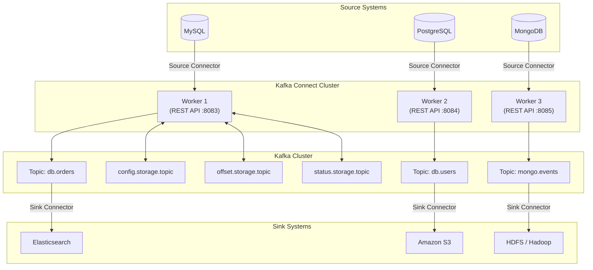

### Data Flow — Source Connector

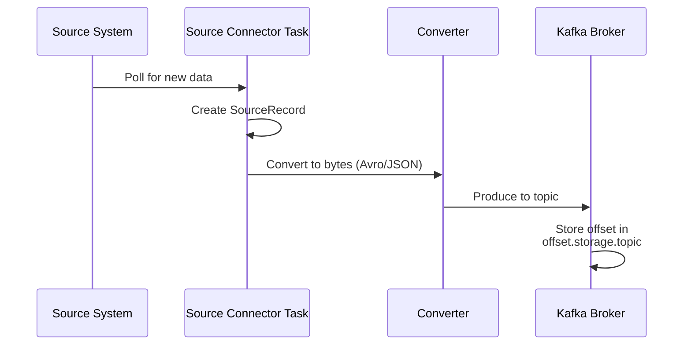

### Data Flow — Sink Connector

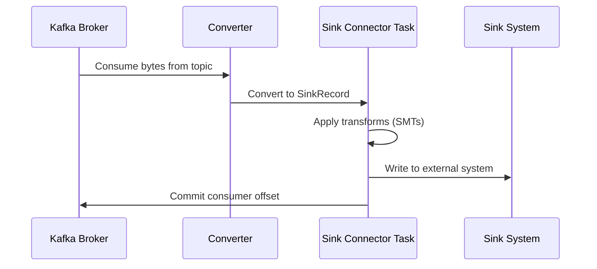

---

## 3. Key Concepts & Terminologies

| Term | Definition |
|------|-----------|
| **Connector** | A logical job managing the copying of data between Kafka and another system. Two types: Source & Sink |
| **Connector Plugin** | The set of JAR files containing the connector implementation |
| **Task** | The actual unit of work. A connector breaks its job into multiple tasks for parallelism |
| **Worker** | The JVM process that runs connectors and tasks. Can be standalone or distributed |
| **Converter** | Translates data between Connect's internal format and the serialization format in Kafka (Avro, JSON, Protobuf) |
| **Transform (SMT)** | Single Message Transforms — lightweight per-message modifications |
| **Predicate** | A condition used with SMTs to conditionally apply transforms |
| **Dead Letter Queue (DLQ)** | A topic where records that failed processing are routed (sink connectors only) |
| **Offset** | Tracks the position of data that has been read/written. Source offsets are connector-specific; sink offsets are Kafka consumer offsets |
| **Connect Cluster** | A group of distributed workers sharing the same `group.id` |
| **Connector Instance** | A running instance of a connector configuration |
| **Rebalance** | The process of redistributing connectors and tasks across available workers |
| **Plugin Path** | Directory where connector JARs are placed (`plugin.path` worker config) |
| **Config Provider** | Mechanism to externalize secrets in connector configurations |
| **Internal Topics** | Kafka topics used by Connect to store configs, offsets, and statuses |
| **Exactly-Once Semantics (EOS)** | Guarantee that each record is delivered exactly once (available for source connectors) |

---

## 4. Connectors — Source vs Sink

### Source Connectors

Source connectors **ingest data from external systems into Kafka topics**.

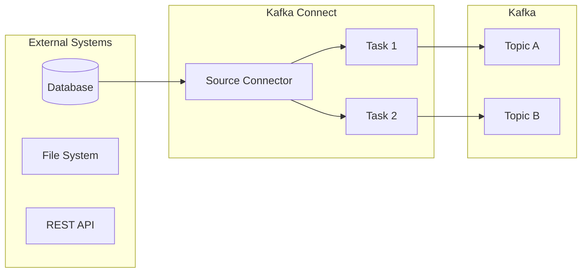

**Popular Source Connectors:**

| Connector | Use Case |
|-----------|----------|
| `JdbcSourceConnector` | Stream table data from any JDBC-compatible database |
| `DebeziumMySqlConnector` | CDC from MySQL via binlog |
| `DebeziumPostgresConnector` | CDC from PostgreSQL via WAL |
| `FileStreamSourceConnector` | Read lines from a file (dev/test only) |
| `MongoDbSource` | Stream changes from MongoDB |
| `S3SourceConnector` | Read files from S3 |
| `DatagenConnector` | Generate mock/test data |

### Sink Connectors

Sink connectors **deliver data from Kafka topics to external systems**.

**Popular Sink Connectors:**

| Connector | Use Case |
|-----------|----------|
| `ElasticsearchSinkConnector` | Index data into Elasticsearch |
| `HdfsSinkConnector` | Write to HDFS for offline analysis |
| `S3SinkConnector` | Store data in Amazon S3 |
| `JdbcSinkConnector` | Write records to a database |
| `GcsSinkConnector` | Store data in Google Cloud Storage |
| `BigQuerySinkConnector` | Load data into BigQuery |
| `FileStreamSinkConnector` | Write to a local file (dev/test only) |

### Connector Configuration Example — JDBC Source

```json
{
  "name": "jdbc-source-connector",
  "config": {
    "connector.class": "io.confluent.connect.jdbc.JdbcSourceConnector",
    "connection.url": "jdbc:mysql://localhost:3306/mydb",
    "connection.user": "root",
    "connection.password": "password",
    "table.whitelist": "orders,customers",
    "mode": "incrementing",
    "incrementing.column.name": "id",
    "topic.prefix": "mysql-",
    "tasks.max": "2",
    "poll.interval.ms": "5000"
  }
}
```

### Connector Configuration Example — Elasticsearch Sink

```json
{
  "name": "elasticsearch-sink",
  "config": {
    "connector.class": "io.confluent.connect.elasticsearch.ElasticsearchSinkConnector",
    "topics": "mysql-orders",
    "connection.url": "http://elasticsearch:9200",
    "type.name": "_doc",
    "key.ignore": "true",
    "schema.ignore": "true",
    "tasks.max": "1"
  }
}
```

---

## 5. Tasks & Parallelism

### How Tasks Work

- Each **connector instance** coordinates a set of **tasks** that perform the actual data copying
- Tasks have **no state** stored within them — state is stored in Kafka internal topics
- Tasks can be started, stopped, or restarted at any time
- The number of tasks is controlled by `tasks.max` configuration

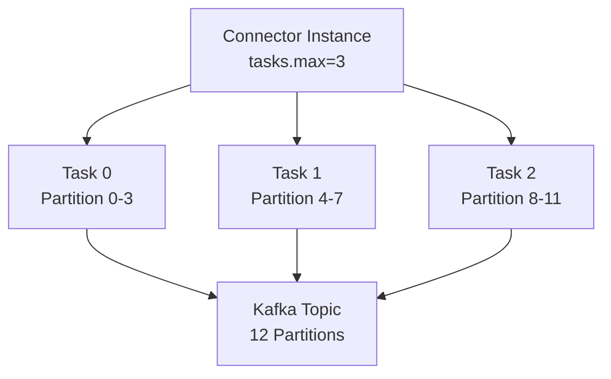

### Task Rebalancing

Task rebalancing happens when:
1. A new connector is submitted to the cluster
2. A connector increases or decreases the number of tasks
3. A connector's configuration changes
4. A worker fails (tasks redistribute to active workers)

> **Important:** When a **task fails**, no rebalance is triggered. Failed tasks must be restarted manually via the REST API.

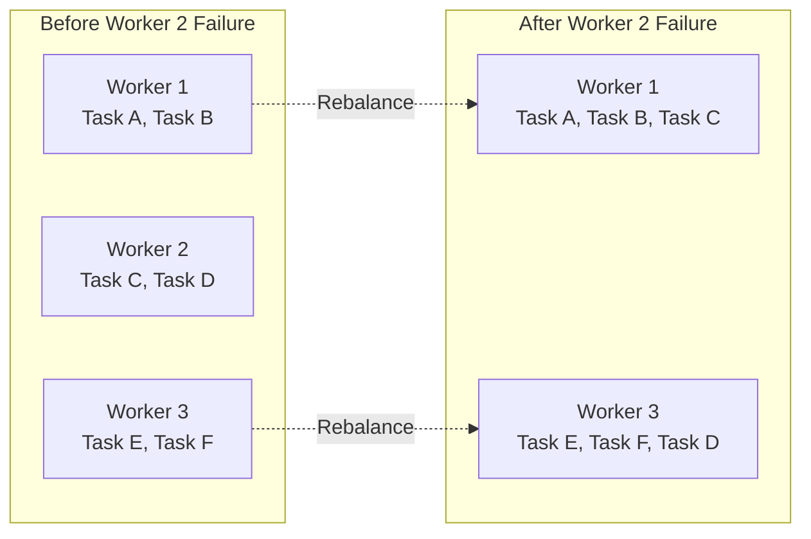

---

## 6. Workers — Standalone vs Distributed

### Comparison Table

| Feature | Standalone Mode | Distributed Mode |
|---------|----------------|-----------------|
| **Processes** | Single process | Multiple processes |
| **Scalability** | Limited to single node | Horizontally scalable |
| **Fault Tolerance** | None (single point of failure) | Automatic failover |
| **Offset Storage** | Local file system | Kafka topics |
| **Config Storage** | File-based | Kafka topics |
| **Connector Deployment** | Command-line properties files | REST API |
| **Use Case** | Development, testing, log collection | Production environments |
| **Command** | `connect-standalone` | `connect-distributed` |

### Standalone Mode

```bash
# Launch standalone worker
bin/connect-standalone worker.properties connector1.properties [connector2.properties ...]
```

**Key standalone config properties:**
```properties
# worker.properties for standalone mode
bootstrap.servers=localhost:9092
key.converter=org.apache.kafka.connect.json.JsonConverter
value.converter=org.apache.kafka.connect.json.JsonConverter
key.converter.schemas.enable=false
value.converter.schemas.enable=false

# Offset storage (local file)
offset.storage.file.filename=/tmp/connect.offsets

# REST API
listeners=http://localhost:8083

# Plugin path
plugin.path=/usr/local/share/kafka/plugins
```

### Distributed Mode

```bash
# Launch distributed worker
bin/connect-distributed worker.properties
```

**Key distributed config properties:**
```properties
# worker.properties for distributed mode
bootstrap.servers=broker1:9092,broker2:9092,broker3:9092

# Group ID — all workers with same group.id form a cluster
group.id=connect-cluster

# Internal topics (must be same across all workers in cluster)
config.storage.topic=connect-configs
config.storage.replication.factor=3

offset.storage.topic=connect-offsets
offset.storage.replication.factor=3
offset.storage.partitions=25

status.storage.topic=connect-status
status.storage.replication.factor=3
status.storage.partitions=5

# Converters
key.converter=io.confluent.connect.avro.AvroConverter
key.converter.schema.registry.url=http://schema-registry:8081
value.converter=io.confluent.connect.avro.AvroConverter
value.converter.schema.registry.url=http://schema-registry:8081

# REST API
listeners=http://0.0.0.0:8083
rest.advertised.host.name=connect-worker-1
rest.advertised.port=8083

# Plugin path
plugin.path=/usr/local/share/kafka/plugins,/usr/share/confluent-hub-components
```

### Worker Architecture Diagram

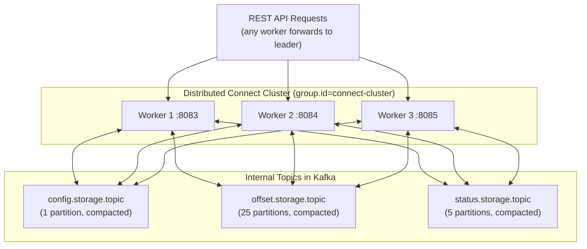

---

## 7. Converters & Serialization

Converters handle the translation between Connect's internal data format and the serialization format used in Kafka topics.

### Available Converters

| Converter Class | Format | Schema Registry? | Use Case |
|----------------|--------|------------------|----------|
| `io.confluent.connect.avro.AvroConverter` | Avro | Yes | Production — best schema evolution |
| `io.confluent.connect.protobuf.ProtobufConverter` | Protobuf | Yes | gRPC-based systems |
| `io.confluent.connect.json.JsonSchemaConverter` | JSON Schema | Yes | JSON with schema validation |
| `org.apache.kafka.connect.json.JsonConverter` | JSON | No | Simple JSON (structured data) |
| `org.apache.kafka.connect.storage.StringConverter` | String | No | Simple string format |
| `org.apache.kafka.connect.converters.ByteArrayConverter` | Raw Bytes | No | Pass-through, no conversion |
| `org.apache.kafka.connect.converters.DoubleConverter` | Double | No | Primitive FLOAT64 |
| `org.apache.kafka.connect.converters.LongConverter` | Long | No | Primitive INT64 |

### Converter Data Flow

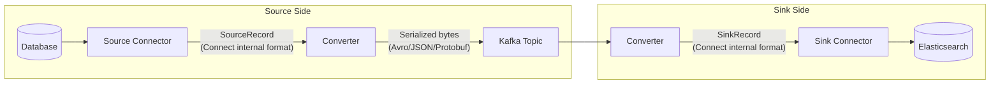

### Configuration Examples

**Avro with Schema Registry:**
```properties
key.converter=io.confluent.connect.avro.AvroConverter
key.converter.schema.registry.url=http://schema-registry:8081
value.converter=io.confluent.connect.avro.AvroConverter
value.converter.schema.registry.url=http://schema-registry:8081
```

**JSON without Schema Registry:**
```properties
key.converter=org.apache.kafka.connect.json.JsonConverter
value.converter=org.apache.kafka.connect.json.JsonConverter
key.converter.schemas.enable=false
value.converter.schemas.enable=false
```

**String key + Avro value:**
```properties
key.converter=org.apache.kafka.connect.storage.StringConverter
value.converter=io.confluent.connect.avro.AvroConverter
value.converter.schema.registry.url=http://schema-registry:8081
```

> **Important:** Converters can be defined at the **worker level** (default for all connectors) or **overridden per connector**. If overriding in a connector, you must provide **all** converter properties — worker-level converter properties are NOT inherited.

---

## 8. Single Message Transforms (SMTs)

SMTs are lightweight, per-message transformations applied inline as data flows through Connect.

### Available Built-in SMTs

| SMT | Description |
|-----|-------------|
| **Cast** | Cast fields or entire key/value to a specific type |
| **Drop** | Set key or value to null |
| **DropHeaders** | Remove one or more headers |
| **ExtractField** | Extract a single field from a Struct or Map |
| **ExtractTopic** | Replace topic name from key/value field |
| **Filter** | Drop all records (used with Predicate) |
| **Flatten** | Flatten nested structures with configurable delimiter |
| **HeaderFrom** | Move/copy fields to record headers |
| **HoistField** | Wrap data in a single-field Struct or Map |
| **InsertField** | Insert fields from record metadata or static values |
| **InsertHeader** | Add a literal value as a header |
| **MaskField** | Mask fields with null values (PII protection) |
| **RegexRouter** | Modify topic name using regex |
| **ReplaceField** | Include/exclude/rename fields |
| **SetSchemaMetadata** | Set schema name or version |
| **TimestampConverter** | Convert between timestamp formats |
| **TimestampRouter** | Route to topic based on timestamp |
| **TombstoneHandler** | Manage tombstone (null-value) records |
| **ValueToKey** | Build key from subset of value fields |

### SMT Configuration Example

```json
{
  "name": "jdbc-source-with-transforms",
  "config": {
    "connector.class": "io.confluent.connect.jdbc.JdbcSourceConnector",
    "connection.url": "jdbc:mysql://localhost:3306/mydb",
    "topics": "raw-orders",
    "tasks.max": "1",

    "transforms": "addTimestamp,maskSSN,routeTopic",

    "transforms.addTimestamp.type": "org.apache.kafka.connect.transforms.InsertField$Value",
    "transforms.addTimestamp.timestamp.field": "event_timestamp",

    "transforms.maskSSN.type": "org.apache.kafka.connect.transforms.MaskField$Value",
    "transforms.maskSSN.fields": "ssn,credit_card",

    "transforms.routeTopic.type": "org.apache.kafka.connect.transforms.RegexRouter",
    "transforms.routeTopic.regex": "(.*)",
    "transforms.routeTopic.replacement": "prod-$1"
  }
}
```

### SMT with Predicates (Conditional Transforms)

```json
{
  "transforms": "dropNulls",
  "transforms.dropNulls.type": "org.apache.kafka.connect.transforms.Filter",
  "transforms.dropNulls.predicate": "isNullValue",
  "transforms.dropNulls.negate": "false",

  "predicates": "isNullValue",
  "predicates.isNullValue.type": "org.apache.kafka.connect.transforms.predicates.RecordIsTombstone"
}
```

### SMT Processing Pipeline

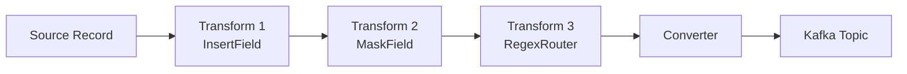

---

## 9. Dead Letter Queue (DLQ)

DLQs are **only applicable for sink connectors**. They route records that cannot be processed to a separate topic for later analysis.

### Error Tolerance Modes

| Mode | Behavior |
|------|----------|
| `errors.tolerance=none` (default) | Task fails immediately on any error |
| `errors.tolerance=all` | All errors are silently ignored, processing continues |

### DLQ Configuration

```json
{
  "name": "elasticsearch-sink",
  "config": {
    "connector.class": "io.confluent.connect.elasticsearch.ElasticsearchSinkConnector",
    "topics": "orders",
    "connection.url": "http://elasticsearch:9200",
    "tasks.max": "1",

    "errors.tolerance": "all",
    "errors.deadletterqueue.topic.name": "dlq-elasticsearch-sink",
    "errors.deadletterqueue.topic.replication.factor": 3,
    "errors.deadletterqueue.context.headers.enable": true,
    "errors.log.enable": true,
    "errors.log.include.messages": true
  }
}
```

### DLQ Flow

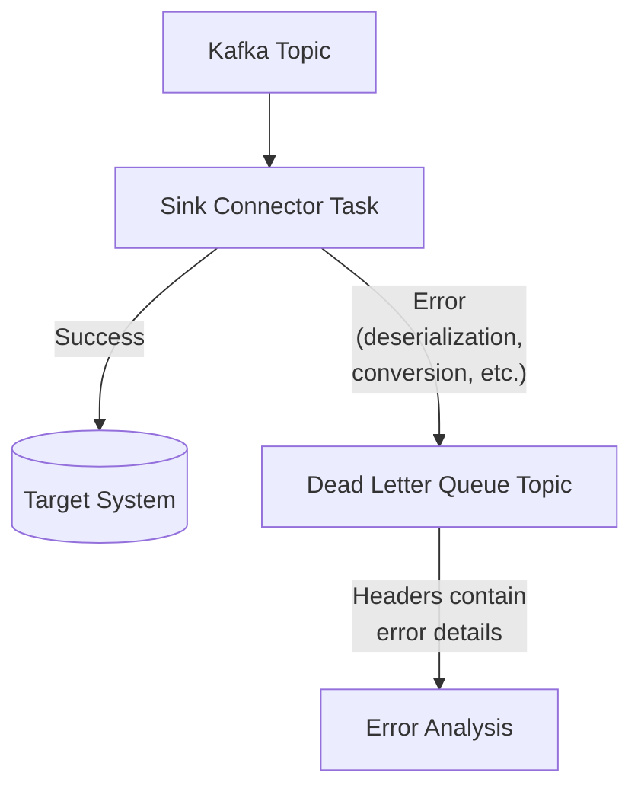

### DLQ Record Headers

When `errors.deadletterqueue.context.headers.enable=true`, the following headers are added:

| Header Key | Description |
|-----------|-------------|
| `__connect.errors.topic` | Original topic name |
| `__connect.errors.partition` | Original partition |
| `__connect.errors.offset` | Original offset |
| `__connect.errors.connector.name` | Connector name |
| `__connect.errors.task.id` | Task ID |
| `__connect.errors.stage` | Processing stage where error occurred |
| `__connect.errors.class.name` | Exception class |
| `__connect.errors.exception.message` | Error message |
| `__connect.errors.exception.stacktrace` | Full stack trace |

---

## 10. Connect Internal Topics

Kafka Connect uses **three internal topics** to store connector configurations, offsets, and status information.

| Topic | Purpose | Partitions | Cleanup Policy |
|-------|---------|------------|----------------|
| `config.storage.topic` | Stores connector and task configurations | **1** (must be exactly 1) | Compacted |
| `offset.storage.topic` | Stores connector offsets (source connector progress) | 25 (recommended) | Compacted |
| `status.storage.topic` | Stores connector and task status updates | 5 (recommended) | Compacted |

### Manual Creation Commands

```bash
# Config topic — MUST have exactly 1 partition
bin/kafka-topics.sh --create \
  --bootstrap-server localhost:9092 \
  --topic connect-configs \
  --replication-factor 3 \
  --partitions 1 \
  --config cleanup.policy=compact

# Offset topic
bin/kafka-topics.sh --create \
  --bootstrap-server localhost:9092 \
  --topic connect-offsets \
  --replication-factor 3 \
  --partitions 25 \
  --config cleanup.policy=compact

# Status topic
bin/kafka-topics.sh --create \
  --bootstrap-server localhost:9092 \
  --topic connect-status \
  --replication-factor 3 \
  --partitions 5 \
  --config cleanup.policy=compact
```

> **Critical Rules:**
> - All workers in the same cluster MUST use the same internal topic names
> - Different clusters MUST use different internal topic names
> - Simply changing `group.id` without changing internal topics does NOT create a new cluster
> - `config.storage.topic` must always have exactly **1 partition**

---

## 11. REST API Reference

The Connect REST API (default port `8083`) is the primary interface for managing connectors in distributed mode.

### Cluster Endpoints

| Method | Endpoint | Description |
|--------|----------|-------------|
| `GET` | `/` | Get Connect worker version and cluster info |

### Connector Management Endpoints

| Method | Endpoint | Description |
|--------|----------|-------------|
| `GET` | `/connectors` | List all active connectors |
| `GET` | `/connectors?expand=status` | List connectors with status details |
| `GET` | `/connectors?expand=info` | List connectors with config metadata |
| `POST` | `/connectors` | Create a new connector |
| `GET` | `/connectors/{name}` | Get connector info |
| `GET` | `/connectors/{name}/config` | Get connector config |
| `PUT` | `/connectors/{name}/config` | Create or update connector config |
| `GET` | `/connectors/{name}/status` | Get connector and task status |
| `POST` | `/connectors/{name}/restart` | Restart the connector |
| `PUT` | `/connectors/{name}/pause` | Pause the connector |
| `PUT` | `/connectors/{name}/resume` | Resume a paused connector |
| `PUT` | `/connectors/{name}/stop` | Stop connector (keeps config) |
| `DELETE` | `/connectors/{name}` | Delete connector entirely |

### Task Endpoints

| Method | Endpoint | Description |
|--------|----------|-------------|
| `GET` | `/connectors/{name}/tasks` | List tasks for a connector |
| `GET` | `/connectors/{name}/tasks/{id}/status` | Get task status |
| `POST` | `/connectors/{name}/tasks/{id}/restart` | Restart a specific task |

### Offset Endpoints

| Method | Endpoint | Description |
|--------|----------|-------------|
| `GET` | `/connectors/{name}/offsets` | Get current offsets |
| `PATCH` | `/connectors/{name}/offsets` | Alter offsets (connector must be stopped) |
| `DELETE` | `/connectors/{name}/offsets` | Reset offsets (connector must be stopped) |

### Plugin Endpoints

| Method | Endpoint | Description |
|--------|----------|-------------|
| `GET` | `/connector-plugins` | List installed connector plugins |
| `PUT` | `/connector-plugins/{name}/config/validate` | Validate connector config |

### REST API Usage Examples

```bash
# List all connectors
curl -s http://localhost:8083/connectors | jq

# Create a connector
curl -X POST http://localhost:8083/connectors \
  -H "Content-Type: application/json" \
  -d '{
    "name": "my-jdbc-source",
    "config": {
      "connector.class": "io.confluent.connect.jdbc.JdbcSourceConnector",
      "connection.url": "jdbc:mysql://mysql:3306/mydb",
      "connection.user": "root",
      "connection.password": "password",
      "table.whitelist": "orders",
      "mode": "incrementing",
      "incrementing.column.name": "id",
      "topic.prefix": "mysql-",
      "tasks.max": "1"
    }
  }'

# Get connector status
curl -s http://localhost:8083/connectors/my-jdbc-source/status | jq

# Update connector config
curl -X PUT http://localhost:8083/connectors/my-jdbc-source/config \
  -H "Content-Type: application/json" \
  -d '{
    "connector.class": "io.confluent.connect.jdbc.JdbcSourceConnector",
    "connection.url": "jdbc:mysql://mysql:3306/mydb",
    "tasks.max": "3"
  }'

# Restart a connector (including failed tasks)
curl -X POST "http://localhost:8083/connectors/my-jdbc-source/restart?includeTasks=true&onlyFailed=true"

# Pause a connector
curl -X PUT http://localhost:8083/connectors/my-jdbc-source/pause

# Resume a connector
curl -X PUT http://localhost:8083/connectors/my-jdbc-source/resume

# Delete a connector
curl -X DELETE http://localhost:8083/connectors/my-jdbc-source

# Validate connector configuration
curl -X PUT http://localhost:8083/connector-plugins/JdbcSourceConnector/config/validate \
  -H "Content-Type: application/json" \
  -d '{
    "connector.class": "io.confluent.connect.jdbc.JdbcSourceConnector",
    "tasks.max": "1"
  }'
```

---

## 12. Configuration Details

### Common Worker Configuration Properties

| Property | Description | Default |
|----------|-------------|---------|
| `bootstrap.servers` | Kafka broker addresses | — |
| `group.id` | Unique cluster identifier (distributed mode) | — |
| `key.converter` | Default key converter class | — |
| `value.converter` | Default value converter class | — |
| `header.converter` | Header converter class | `StringConverter` |
| `plugin.path` | Comma-separated plugin directories | — |
| `listeners` | REST API listener (e.g., `http://0.0.0.0:8083`) | — |
| `rest.advertised.host.name` | Hostname for REST API forwarding | — |
| `offset.flush.interval.ms` | Interval to flush source offsets | `60000` |
| `offset.flush.timeout.ms` | Timeout for flushing offsets | `5000` |
| `task.shutdown.graceful.timeout.ms` | Graceful shutdown timeout for tasks | `5000` |
| `topic.creation.enable` | Enable auto topic creation for source connectors | `true` |

### Distributed Worker Specific Properties

| Property | Description | Default |
|----------|-------------|---------|
| `config.storage.topic` | Topic for storing connector configs | — |
| `config.storage.replication.factor` | Replication factor for config topic | `3` |
| `offset.storage.topic` | Topic for storing offsets | — |
| `offset.storage.replication.factor` | Replication factor for offset topic | `3` |
| `offset.storage.partitions` | Partition count for offset topic | `25` |
| `status.storage.topic` | Topic for storing status | — |
| `status.storage.replication.factor` | Replication factor for status topic | `3` |
| `status.storage.partitions` | Partition count for status topic | `5` |
| `exactly.once.source.support` | Enable exactly-once for source connectors | `disabled` |
| `connect.protocol` | Rebalance protocol (`eager` or `compatible`) | `compatible` |

### Common Connector Configuration Properties

| Property | Description | Required |
|----------|-------------|----------|
| `name` | Globally unique connector name | Yes |
| `connector.class` | Full class name or alias of the connector | Yes |
| `tasks.max` | Maximum number of tasks for the connector | Yes |
| `topics` | Comma-separated list of topics (sink connectors) | Conditional |
| `topics.regex` | Regex for topic subscription (sink connectors) | Conditional |
| `key.converter` | Override worker-level key converter | No |
| `value.converter` | Override worker-level value converter | No |
| `transforms` | Comma-separated list of transform aliases | No |
| `predicates` | Comma-separated list of predicate aliases | No |
| `errors.tolerance` | Error tolerance level (`none` or `all`) | No |
| `errors.retry.delay.max.ms` | Max delay between retries | `60000` |
| `errors.retry.timeout` | Total retry timeout | `0` |

### Producer/Consumer Override Properties

```properties
# Worker-level producer override (applies to all source connectors)
producer.retries=5
producer.acks=all

# Worker-level consumer override (applies to all sink connectors)
consumer.max.partition.fetch.bytes=10485760

# Per-connector producer override
producer.override.acks=1
producer.override.compression.type=snappy

# Per-connector consumer override
consumer.override.max.poll.records=500
```

---

## 13. Setup Guide — Standalone Mode

### Step 1: Prerequisites

```bash
# Java 8+ required
java -version

# Download Kafka
wget https://downloads.apache.org/kafka/3.7.0/kafka_2.13-3.7.0.tgz
tar -xzf kafka_2.13-3.7.0.tgz
cd kafka_2.13-3.7.0
```

### Step 2: Start Kafka (KRaft mode)

```bash
# Generate cluster ID
KAFKA_CLUSTER_ID="$(bin/kafka-storage.sh random-uuid)"

# Format storage
bin/kafka-storage.sh format -t $KAFKA_CLUSTER_ID -c config/kraft/server.properties

# Start Kafka broker
bin/kafka-server-start.sh config/kraft/server.properties
```

### Step 3: Configure Standalone Worker

Create `connect-standalone.properties`:

```properties
bootstrap.servers=localhost:9092
key.converter=org.apache.kafka.connect.json.JsonConverter
value.converter=org.apache.kafka.connect.json.JsonConverter
key.converter.schemas.enable=false
value.converter.schemas.enable=false
offset.storage.file.filename=/tmp/connect.offsets
plugin.path=/path/to/plugins
listeners=http://localhost:8083
```

### Step 4: Configure a FileStream Source Connector

Create `file-source.properties`:

```properties
name=local-file-source
connector.class=org.apache.kafka.connect.file.FileStreamSourceConnector
tasks.max=1
file=/tmp/test-input.txt
topic=file-topic
```

### Step 5: Start Connect Standalone

```bash
# Create input file
echo "Hello Kafka Connect" > /tmp/test-input.txt

# Start Connect with the connector
bin/connect-standalone.sh connect-standalone.properties file-source.properties
```

### Step 6: Verify

```bash
# Consume from the topic
bin/kafka-console-consumer.sh --bootstrap-server localhost:9092 --topic file-topic --from-beginning
```

---

## 14. Setup Guide — Distributed Mode

### Step 1: Configure Distributed Worker

Create `connect-distributed.properties`:

```properties
bootstrap.servers=broker1:9092,broker2:9092,broker3:9092

group.id=connect-cluster

config.storage.topic=connect-configs
config.storage.replication.factor=3

offset.storage.topic=connect-offsets
offset.storage.replication.factor=3
offset.storage.partitions=25

status.storage.topic=connect-status
status.storage.replication.factor=3
status.storage.partitions=5

key.converter=org.apache.kafka.connect.json.JsonConverter
value.converter=org.apache.kafka.connect.json.JsonConverter

plugin.path=/usr/local/share/kafka/plugins
listeners=http://0.0.0.0:8083
```

### Step 2: Start Distributed Workers

```bash
# Start on each node
bin/connect-distributed.sh connect-distributed.properties
```

### Step 3: Deploy Connectors via REST API

```bash
# Create a source connector
curl -X POST http://localhost:8083/connectors \
  -H "Content-Type: application/json" \
  -d '{
    "name": "my-source-connector",
    "config": {
      "connector.class": "io.confluent.connect.jdbc.JdbcSourceConnector",
      "connection.url": "jdbc:postgresql://postgres:5432/mydb",
      "connection.user": "postgres",
      "connection.password": "secret",
      "table.whitelist": "users,orders",
      "mode": "timestamp+incrementing",
      "timestamp.column.name": "updated_at",
      "incrementing.column.name": "id",
      "topic.prefix": "pg-",
      "tasks.max": "2",
      "poll.interval.ms": "1000"
    }
  }'

# Verify status
curl -s http://localhost:8083/connectors/my-source-connector/status | jq
```

---

## 15. Docker Compose Setup

### Full Stack: Kafka + Schema Registry + Connect + MySQL + Elasticsearch

```yaml
version: '3.8'

services:
  broker:
    image: confluentinc/cp-kafka:7.6.0
    hostname: broker
    container_name: broker
    ports:
      - "9092:9092"
      - "9101:9101"
    environment:
      KAFKA_NODE_ID: 1
      KAFKA_LISTENER_SECURITY_PROTOCOL_MAP: 'CONTROLLER:PLAINTEXT,PLAINTEXT:PLAINTEXT,PLAINTEXT_HOST:PLAINTEXT'
      KAFKA_ADVERTISED_LISTENERS: 'PLAINTEXT://broker:29092,PLAINTEXT_HOST://localhost:9092'
      KAFKA_OFFSETS_TOPIC_REPLICATION_FACTOR: 1
      KAFKA_GROUP_INITIAL_REBALANCE_DELAY_MS: 0
      KAFKA_TRANSACTION_STATE_LOG_MIN_ISR: 1
      KAFKA_TRANSACTION_STATE_LOG_REPLICATION_FACTOR: 1
      KAFKA_PROCESS_ROLES: 'broker,controller'
      KAFKA_CONTROLLER_QUORUM_VOTERS: '1@broker:29093'
      KAFKA_LISTENERS: 'PLAINTEXT://broker:29092,CONTROLLER://broker:29093,PLAINTEXT_HOST://0.0.0.0:9092'
      KAFKA_INTER_BROKER_LISTENER_NAME: 'PLAINTEXT'
      KAFKA_CONTROLLER_LISTENER_NAMES: 'CONTROLLER'
      CLUSTER_ID: 'MkU3OEVBNTcwNTJENDM2Qk'

  schema-registry:
    image: confluentinc/cp-schema-registry:7.6.0
    hostname: schema-registry
    container_name: schema-registry
    depends_on:
      - broker
    ports:
      - "8081:8081"
    environment:
      SCHEMA_REGISTRY_HOST_NAME: schema-registry
      SCHEMA_REGISTRY_KAFKASTORE_BOOTSTRAP_SERVERS: 'broker:29092'
      SCHEMA_REGISTRY_LISTENERS: http://0.0.0.0:8081

  connect:
    image: confluentinc/cp-kafka-connect:7.6.0
    hostname: connect
    container_name: connect
    depends_on:
      - broker
      - schema-registry
    ports:
      - "8083:8083"
    environment:
      CONNECT_BOOTSTRAP_SERVERS: 'broker:29092'
      CONNECT_REST_ADVERTISED_HOST_NAME: connect
      CONNECT_GROUP_ID: compose-connect-group
      CONNECT_CONFIG_STORAGE_TOPIC: docker-connect-configs
      CONNECT_CONFIG_STORAGE_REPLICATION_FACTOR: 1
      CONNECT_OFFSET_FLUSH_INTERVAL_MS: 10000
      CONNECT_OFFSET_STORAGE_TOPIC: docker-connect-offsets
      CONNECT_OFFSET_STORAGE_REPLICATION_FACTOR: 1
      CONNECT_STATUS_STORAGE_TOPIC: docker-connect-status
      CONNECT_STATUS_STORAGE_REPLICATION_FACTOR: 1
      CONNECT_KEY_CONVERTER: io.confluent.connect.avro.AvroConverter
      CONNECT_KEY_CONVERTER_SCHEMA_REGISTRY_URL: http://schema-registry:8081
      CONNECT_VALUE_CONVERTER: io.confluent.connect.avro.AvroConverter
      CONNECT_VALUE_CONVERTER_SCHEMA_REGISTRY_URL: http://schema-registry:8081
      CONNECT_PLUGIN_PATH: "/usr/share/java,/usr/share/confluent-hub-components"
    command:
      - bash
      - -c
      - |
        # Install connectors
        confluent-hub install --no-prompt debezium/debezium-connector-mysql:latest
        confluent-hub install --no-prompt confluentinc/kafka-connect-elasticsearch:latest
        confluent-hub install --no-prompt confluentinc/kafka-connect-jdbc:latest
        # Start Connect
        /etc/confluent/docker/run

  mysql:
    image: mysql:8.0
    hostname: mysql
    container_name: mysql
    ports:
      - "3306:3306"
    environment:
      MYSQL_ROOT_PASSWORD: rootpass
      MYSQL_DATABASE: mydb
    command: --server-id=1 --log-bin=mysql-bin --binlog-format=ROW

  elasticsearch:
    image: docker.elastic.co/elasticsearch/elasticsearch:8.12.0
    hostname: elasticsearch
    container_name: elasticsearch
    ports:
      - "9200:9200"
    environment:
      discovery.type: single-node
      xpack.security.enabled: "false"
      ES_JAVA_OPTS: "-Xms512m -Xmx512m"
```

### Start and Test

```bash
# Start all services
docker-compose up -d

# Wait for Connect to be ready
curl -s http://localhost:8083/ | jq

# Deploy Debezium MySQL Source Connector
curl -X POST http://localhost:8083/connectors \
  -H "Content-Type: application/json" \
  -d '{
    "name": "mysql-source",
    "config": {
      "connector.class": "io.debezium.connector.mysql.MySqlConnector",
      "database.hostname": "mysql",
      "database.port": "3306",
      "database.user": "root",
      "database.password": "rootpass",
      "database.server.id": "184054",
      "topic.prefix": "dbserver1",
      "database.include.list": "mydb",
      "schema.history.internal.kafka.bootstrap.servers": "broker:29092",
      "schema.history.internal.kafka.topic": "schema-changes.mydb",
      "tasks.max": "1"
    }
  }'
```

---

## 16. Schema Registry Integration

Schema Registry provides centralized schema management for Kafka Connect, enabling **schema evolution** and **compatibility enforcement**.

### How It Works with Connect

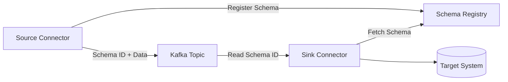

### Schema Compatibility Modes

| Mode | Description |
|------|-------------|
| `BACKWARD` | New schema can read data written with old schema |
| `FORWARD` | Old schema can read data written with new schema |
| `FULL` | Both backward and forward compatible |
| `NONE` | No compatibility checks |
| `BACKWARD_TRANSITIVE` | Backward compatible with ALL previous versions |
| `FORWARD_TRANSITIVE` | Forward compatible with ALL previous versions |
| `FULL_TRANSITIVE` | Both backward and forward with ALL versions |

### Configuration

```properties
# Worker-level Schema Registry config
key.converter=io.confluent.connect.avro.AvroConverter
key.converter.schema.registry.url=http://schema-registry:8081
value.converter=io.confluent.connect.avro.AvroConverter
value.converter.schema.registry.url=http://schema-registry:8081

# With authentication
key.converter.basic.auth.credentials.source=USER_INFO
key.converter.basic.auth.user.info=username:password
```

---

## 17. ConfigProvider & Secret Management

ConfigProvider allows you to externalize secrets from connector configurations.

### FileConfigProvider

Store secrets in a properties file accessible to all workers:

```properties
# /opt/connect-secrets.properties
db.url=jdbc:mysql://mysql:3306/mydb
db.user=admin
db.password=supersecret
```

**Worker configuration:**
```properties
config.providers=file
config.providers.file.class=org.apache.kafka.common.config.provider.FileConfigProvider
```

**Connector configuration using variables:**
```json
{
  "name": "secure-jdbc-source",
  "config": {
    "connector.class": "io.confluent.connect.jdbc.JdbcSourceConnector",
    "connection.url": "${file:/opt/connect-secrets.properties:db.url}",
    "connection.user": "${file:/opt/connect-secrets.properties:db.user}",
    "connection.password": "${file:/opt/connect-secrets.properties:db.password}",
    "tasks.max": "1"
  }
}
```

### EnvVarConfigProvider

Use environment variables for secrets:

**Worker configuration:**
```properties
config.providers=env
config.providers.env.class=org.apache.kafka.common.config.provider.EnvVarConfigProvider
# Optional: restrict to matching env vars
config.providers.env.param.allowlist.pattern=CONNECT_.*
```

**Connector configuration:**
```json
{
  "connection.url": "${env:DATABASE_URL}",
  "connection.user": "${env:DATABASE_USER}",
  "connection.password": "${env:DATABASE_PASSWORD}"
}
```

> **Security note:** Connector configurations are persisted and shared via the REST API with the **variables** (not resolved values). Secrets are only resolved transiently when the connector starts.

---

## 18. Auto Topic Creation for Source Connectors

Starting with Confluent Platform 6.0, Kafka Connect can automatically create topics for source connectors.

### Worker Property

```properties
topic.creation.enable=true  # default: true
```

### Source Connector Configuration

```json
{
  "name": "auto-topic-source",
  "config": {
    "connector.class": "io.confluent.connect.jdbc.JdbcSourceConnector",
    
    "topic.creation.default.replication.factor": 3,
    "topic.creation.default.partitions": 6,
    
    "topic.creation.groups": "compacted,high-throughput",

    "topic.creation.compacted.include": "configs.*,metadata.*",
    "topic.creation.compacted.cleanup.policy": "compact",
    "topic.creation.compacted.replication.factor": 3,
    "topic.creation.compacted.partitions": 1,

    "topic.creation.high-throughput.include": "events.*,logs.*",
    "topic.creation.high-throughput.partitions": 12,
    "topic.creation.high-throughput.retention.ms": 86400000
  }
}
```

> **Note:** This feature does NOT affect sink connectors. Any topic creation properties in sink connector configs will be ignored.

---

## 19. Monitoring & Metrics

### JMX Metrics

Kafka Connect exposes metrics via JMX. Key metric groups:

| Metric Group | Key Metrics |
|-------------|-------------|
| **Source Task Metrics** | `source-record-poll-rate`, `source-record-write-rate`, `poll-batch-avg-time-ms` |
| **Sink Task Metrics** | `sink-record-read-rate`, `sink-record-send-rate`, `put-batch-avg-time-ms`, `offset-commit-avg-time-ms` |
| **Task Error Metrics** | `total-errors-logged`, `total-records-errors`, `total-record-failures`, `total-records-skipped` |
| **Worker Metrics** | `connector-count`, `task-count`, `connector-startup-success-total`, `connector-startup-failure-total` |
| **Worker Rebalance** | `rebalance-avg-time-ms`, `rebalance-max-time-ms`, `completed-rebalances-total` |

### Enabling JMX

```bash
export KAFKA_JMX_OPTS="-Dcom.sun.management.jmxremote \
  -Dcom.sun.management.jmxremote.port=9999 \
  -Dcom.sun.management.jmxremote.authenticate=false \
  -Dcom.sun.management.jmxremote.ssl=false"

bin/connect-distributed.sh connect-distributed.properties
```

### Health Check Script

```bash
#!/bin/bash
# check-connectors.sh — Monitor all connector statuses

CONNECT_URL="http://localhost:8083"

for connector in $(curl -s "$CONNECT_URL/connectors" | jq -r '.[]'); do
  status=$(curl -s "$CONNECT_URL/connectors/$connector/status")
  connector_state=$(echo "$status" | jq -r '.connector.state')
  
  echo "=== $connector ==="
  echo "  Connector State: $connector_state"
  
  # Check each task
  echo "$status" | jq -r '.tasks[] | "  Task \(.id): \(.state)"'
  
  # Alert on failures
  if [ "$connector_state" == "FAILED" ]; then
    echo "  ⚠️  ALERT: Connector $connector is FAILED!"
    # Optionally auto-restart
    # curl -X POST "$CONNECT_URL/connectors/$connector/restart?includeTasks=true&onlyFailed=true"
  fi
  echo ""
done
```

### Connect Reporter (Confluent)

```json
{
  "reporter.bootstrap.servers": "localhost:9092",
  "reporter.result.topic.name": "success-responses",
  "reporter.result.topic.replication.factor": 3,
  "reporter.error.topic.name": "error-responses",
  "reporter.error.topic.replication.factor": 3
}
```

---

## 20. Error Handling & Fault Tolerance

### Error Handling Strategy

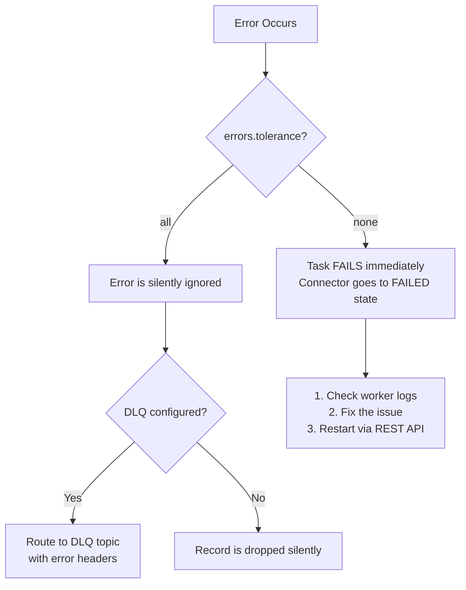

### Exactly-Once Semantics for Source Connectors

Available since Kafka 3.3 / Confluent Platform 7.3:

```properties
# Worker config
exactly.once.source.support=enabled

# Requires transactional producer settings
# Connect automatically configures:
# - producer transaction IDs per connector
# - Idempotent producer
# - Fenced zombie producers
```

### Fault Tolerance Mechanisms

| Mechanism | Description |
|-----------|-------------|
| **Offset tracking** | Source offsets stored in Kafka; sink offsets = consumer offsets |
| **Task rebalancing** | Automatic redistribution when workers fail |
| **At-least-once delivery** | Default guarantee — records may be duplicated |
| **Exactly-once delivery** | Available for source connectors with EOS enabled |
| **Graceful shutdown** | `kill <pid>` (never `kill -9`) — ensures logs are synced and leaders transfer |
| **Auto-restart** | Not built-in — use external orchestration (K8s, systemd) or monitoring scripts |

---

## 21. Security Configuration

### SSL/TLS Encryption

```properties
# Worker properties for SSL
security.protocol=SSL
ssl.truststore.location=/path/to/truststore.jks
ssl.truststore.password=truststore-password
ssl.keystore.location=/path/to/keystore.jks
ssl.keystore.password=keystore-password
ssl.key.password=key-password
```

### SASL Authentication

```properties
# SASL/PLAIN
security.protocol=SASL_SSL
sasl.mechanism=PLAIN
sasl.jaas.config=org.apache.kafka.common.security.plain.PlainLoginModule required \
  username="connect-user" \
  password="connect-password";
```

### Per-Connector Security (Separate Principals)

```json
{
  "name": "secure-connector",
  "config": {
    "connector.class": "...",
    "producer.override.security.protocol": "SASL_SSL",
    "producer.override.sasl.mechanism": "PLAIN",
    "producer.override.sasl.jaas.config": "org.apache.kafka.common.security.plain.PlainLoginModule required username=\"connector-user\" password=\"connector-password\";",
    
    "consumer.override.security.protocol": "SASL_SSL",
    "consumer.override.sasl.mechanism": "PLAIN",
    "consumer.override.sasl.jaas.config": "org.apache.kafka.common.security.plain.PlainLoginModule required username=\"connector-user\" password=\"connector-password\";"
  }
}
```

### ACL Requirements

| Principal | Resource | Operations |
|-----------|----------|------------|
| Connect worker | Internal topics | Read, Write, Create |
| Connect worker | Consumer groups (`connect-*`) | Read |
| Source connector | Output topics | Write, Create, Describe |
| Sink connector | Input topics | Read, Describe |
| Sink connector | Consumer group | Read |
| DLQ producer | DLQ topic | Write, Create, Describe |

---

## 22. Connect vs Kafka Streams vs Producer/Consumer API

| Feature | Kafka Connect | Kafka Streams | Producer/Consumer API |
|---------|--------------|---------------|----------------------|
| **Purpose** | Data integration (ETL) | Stream processing | Custom messaging |
| **Code Required** | Configuration only (JSON/properties) | Java/Scala application | Full application code |
| **Transformations** | Simple (SMTs) | Complex (joins, aggregations, windowing) | Custom logic |
| **State Management** | Handled by framework | Built-in state stores | Manual |
| **Scaling** | Add workers, increase `tasks.max` | Add instances | Manual partitioning |
| **Fault Tolerance** | Built-in (offset tracking, rebalancing) | Built-in (changelog topics) | Manual implementation |
| **Exactly-Once** | Supported (source connectors) | Supported | Manual with transactions |
| **Use Case** | Move data between systems | Transform/aggregate streams | Custom producers/consumers |
| **Deployment** | Standalone/distributed workers | Application instances | Application instances |

### When to Use What

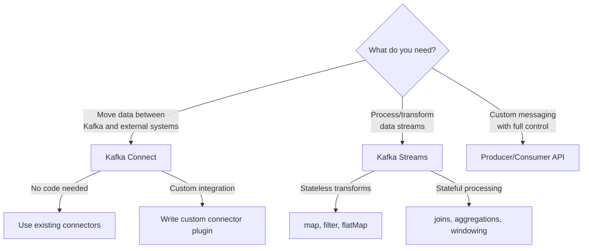

---

## 23. Best Practices

### Configuration Best Practices

1. **Use distributed mode in production** — standalone mode has no fault tolerance
2. **Set replication factor ≥ 3** for internal topics in production
3. **Use Avro/Protobuf** with Schema Registry for schema evolution
4. **Configure DLQ** for all sink connectors to capture failed records
5. **Use `tasks.max` wisely** — match it to the degree of parallelism needed (e.g., number of source table partitions, number of Kafka topic partitions)

### Operational Best Practices

6. **Monitor connector status** — use `GET /connectors?expand=status` regularly
7. **Never use `kill -9`** — always use `kill <pid>` for graceful shutdown
8. **Use ConfigProvider** for secrets — never put passwords in plaintext connector configs
9. **Set `errors.tolerance=all` with DLQ** rather than having connectors fail on bad records
10. **Use separate `group.id`** and internal topics for different environments (dev/staging/prod)

### Performance Best Practices

11. **Tune `offset.flush.interval.ms`** — lower values = more frequent offset commits = lower data loss risk but higher overhead
12. **Monitor JVM heap** — Connect workers are JVM processes; tune `-Xmx` based on workload
13. **Use compression** — set `producer.override.compression.type=snappy` for source connectors
14. **Separate heavy connectors** into dedicated Connect clusters to avoid resource contention
15. **Scale horizontally** — add more workers rather than scaling up single workers

### Connector Design Best Practices

16. **Use incremental/timestamp mode** for JDBC source instead of bulk mode
17. **Avoid wildcard topic subscriptions** in production sink connectors
18. **Set appropriate `poll.interval.ms`** for source connectors based on data freshness requirements
19. **Test SMT chains** thoroughly — incorrect transforms can cause data loss
20. **Version your connector configs** in Git for change tracking

---

## 24. Popular Connectors Reference

### Source Connectors

| Connector | Vendor | Description |
|-----------|--------|-------------|
| JDBC Source | Confluent | Stream data from any JDBC database |
| Debezium MySQL | Debezium | CDC via MySQL binlog |
| Debezium PostgreSQL | Debezium | CDC via PostgreSQL WAL |
| Debezium MongoDB | Debezium | CDC via MongoDB oplog/change streams |
| Debezium SQL Server | Debezium | CDC via SQL Server transaction log |
| Amazon S3 Source | Confluent | Read files from S3 |
| Google Cloud Storage Source | Confluent | Read files from GCS |
| Azure Blob Storage Source | Confluent | Read files from Azure Blob |
| Datagen | Confluent | Generate test/mock data |
| Salesforce Source | Confluent | Stream Salesforce objects |
| Splunk Source | Splunk | Stream from Splunk |

### Sink Connectors

| Connector | Vendor | Description |
|-----------|--------|-------------|
| JDBC Sink | Confluent | Write to any JDBC database |
| Elasticsearch Sink | Confluent | Index data in Elasticsearch |
| Amazon S3 Sink | Confluent | Write to S3 in Avro/JSON/Parquet |
| HDFS 3 Sink | Confluent | Write to HDFS |
| Google BigQuery Sink | Confluent | Load into BigQuery |
| Snowflake Sink | Snowflake | Load into Snowflake |
| Azure Blob Storage Sink | Confluent | Write to Azure Blob Storage |
| HTTP Sink | Confluent | POST/PUT data to REST APIs |
| Google Cloud Storage Sink | Confluent | Write to GCS |
| MongoDB Sink | MongoDB | Write to MongoDB |

---

## 25. Interview Questions & Answers

### Q1: What is Kafka Connect and why is it needed?

**Answer:** Kafka Connect is a framework for reliably streaming data between Apache Kafka and other systems. It's needed because:
- It eliminates the need to write custom producer/consumer code for data integration
- Provides built-in fault tolerance, offset management, and scalability
- Offers a declarative configuration approach (no coding required)
- Supports exactly-once delivery semantics
- Has a large ecosystem of pre-built connectors (200+)

---

### Q2: Explain the difference between standalone and distributed mode.

**Answer:**
- **Standalone mode:** Single worker process, offsets stored locally on disk, connectors configured via properties files. Used for development/testing.
- **Distributed mode:** Multiple workers forming a cluster via `group.id`, offsets and configs stored in Kafka topics, connectors managed via REST API. Provides automatic fault tolerance and scalability. Used in production.

Key difference: In distributed mode, if a worker fails, its tasks are automatically rebalanced to other workers. In standalone mode, there's no failover.

---

### Q3: What are the three internal topics in Kafka Connect? Why are they important?

**Answer:**
1. **`config.storage.topic`** — Stores connector and task configurations (MUST have 1 partition)
2. **`offset.storage.topic`** — Stores source connector offsets (tracks what data has been read)
3. **`status.storage.topic`** — Stores connector and task status updates

They're important because they enable distributed coordination, fault tolerance, and recovery. All workers in a cluster share these topics to coordinate work.

---

### Q4: What is a Converter in Kafka Connect? Name some common converters.

**Answer:** A Converter translates data between Connect's internal data format and the serialized format in Kafka. They are decoupled from connectors for reusability.

Common converters:
- `AvroConverter` — Uses Schema Registry, best for production
- `ProtobufConverter` — Uses Schema Registry, for Protobuf ecosystems
- `JsonSchemaConverter` — Uses Schema Registry, JSON with schema validation
- `JsonConverter` — Simple JSON without Schema Registry
- `StringConverter` — Simple string serialization
- `ByteArrayConverter` — Pass-through, no conversion

---

### Q5: What is a Dead Letter Queue (DLQ) in Kafka Connect?

**Answer:** A DLQ is a special Kafka topic where records that fail processing in a **sink connector** are routed. It's configured using:
- `errors.tolerance=all` — to not fail on errors
- `errors.deadletterqueue.topic.name` — the DLQ topic name
- `errors.deadletterqueue.context.headers.enable=true` — to include error details in headers

DLQs are only applicable for sink connectors, not source connectors.

---

### Q6: How does task rebalancing work in Kafka Connect?

**Answer:** When a connector is first submitted, workers rebalance all connectors and tasks so each worker has approximately equal work. Rebalancing also occurs when:
- Connector configuration changes
- A connector's task count changes
- A worker joins or leaves the cluster

**Important:** When a **task fails** (not a worker), no rebalance is triggered. Failed tasks must be manually restarted via the REST API.

---

### Q7: What are Single Message Transforms (SMTs)? Give examples.

**Answer:** SMTs are lightweight, per-record transformations applied as data flows through Connect. They can:
- **Add fields** (`InsertField`) — add timestamp, static values, or metadata
- **Remove/rename fields** (`ReplaceField`) — drop sensitive columns
- **Mask data** (`MaskField`) — mask PII like SSN, credit cards
- **Route topics** (`RegexRouter`, `TimestampRouter`) — modify destination topic names
- **Flatten structures** (`Flatten`) — unnest nested JSON/Avro
- **Extract fields** (`ExtractField`) — pull out a single field
- **Filter records** (`Filter` with `Predicate`) — conditionally drop records

Multiple SMTs can be chained in a pipeline.

---

### Q8: How do you handle schema evolution in Kafka Connect?

**Answer:** Schema evolution is handled via **Schema Registry** integration:
1. Use `AvroConverter`, `ProtobufConverter`, or `JsonSchemaConverter`
2. Configure Schema Registry URL in converter settings
3. Set compatibility mode (BACKWARD, FORWARD, FULL) on Schema Registry subjects
4. Source connectors register schemas; sink connectors fetch schemas
5. Schema Registry validates compatibility before allowing new schema versions

The `SetSchemaMetadata` SMT can be used to override schema name/version if needed.

---

### Q9: What is the Connect REST API? How do you deploy connectors?

**Answer:** The Connect REST API runs on port 8083 by default and is the primary interface for managing connectors in distributed mode. Key operations:
- `POST /connectors` — Create a new connector
- `GET /connectors/{name}/status` — Check connector/task status
- `PUT /connectors/{name}/config` — Update configuration
- `POST /connectors/{name}/restart?includeTasks=true&onlyFailed=true` — Restart failed components
- `DELETE /connectors/{name}` — Remove a connector

Any worker can accept REST requests and forwards them to the appropriate worker (or leader) as needed.

---

### Q10: Explain the difference between `errors.tolerance=none` and `errors.tolerance=all`.

**Answer:**
- **`errors.tolerance=none` (default):** Any error causes the task to fail immediately. The connector enters a FAILED state. You must examine logs, fix the issue, and restart.
- **`errors.tolerance=all`:** All errors are silently ignored and processing continues. Without a DLQ configured, failed records are dropped with no trace. With a DLQ, failed records are routed to the DLQ topic.

Best practice: Use `errors.tolerance=all` with a DLQ and `errors.log.enable=true` for production sink connectors.

---

### Q11: What is `exactly.once.source.support` in Kafka Connect?

**Answer:** Available since Kafka 3.3, this worker-level configuration enables exactly-once delivery semantics for source connectors. When enabled:
- Each source connector gets a unique transactional producer
- Offsets and records are written atomically in a Kafka transaction
- Zombie producers (from failed workers) are fenced automatically
- Ensures no duplicate records even during worker failures

Configuration: `exactly.once.source.support=enabled` in worker properties.

---

### Q12: How do you scale Kafka Connect?

**Answer:**
1. **Add more workers** — Start new workers with the same `group.id` and internal topics. Connectors/tasks are automatically rebalanced.
2. **Increase `tasks.max`** — Each connector can have multiple tasks running in parallel across workers.
3. **Separate heavy connectors** — Use dedicated Connect clusters for resource-intensive connectors.
4. **Optimize JVM settings** — Tune heap size, GC settings for worker processes.
5. **Use Kubernetes** — Deploy Connect as a StatefulSet with auto-scaling based on metrics.

---

### Q13: What is the ConfigProvider interface? Why is it important?

**Answer:** ConfigProvider allows externalizing sensitive values (passwords, API keys) from connector configurations. Instead of plain-text secrets:
- Use `FileConfigProvider` to read from local properties files
- Use `EnvVarConfigProvider` to read from environment variables
- Use `InternalSecretConfigProvider` (Confluent) for encrypted secret storage with RBAC

Variables in the form `${provider:path:key}` are resolved at connector startup. The configuration stored in Kafka's config topic contains the **variable references**, not the resolved values.

---

### Q14: How do you monitor Kafka Connect in production?

**Answer:**
1. **REST API polling** — Regularly check `GET /connectors?expand=status` for failed connectors/tasks
2. **JMX metrics** — Monitor `source-record-poll-rate`, `sink-record-send-rate`, `total-errors-logged`, rebalance metrics
3. **Connect Reporter** (Confluent) — Route success/error records to dedicated topics
4. **Logging** — Configure log levels via `PUT /admin/loggers/{logger}` REST endpoint
5. **External tools** — Prometheus + Grafana with JMX Exporter, Confluent Control Center
6. **Health check scripts** — Automate status checks and auto-restart of failed connectors

---

### Q15: What is the difference between Kafka Connect and Debezium?

**Answer:**
- **Kafka Connect** is the **framework** — it provides the runtime, REST API, distributed coordination, and plugin architecture.
- **Debezium** is a **set of source connector plugins** that run on top of Kafka Connect. Debezium specializes in CDC (Change Data Capture) from databases.

Debezium provides connectors for MySQL, PostgreSQL, MongoDB, SQL Server, Oracle, etc. These connectors are deployed as plugins in a Kafka Connect worker.

---

### Q16: What happens when you update a running connector's configuration?

**Answer:**
1. You send a `PUT` request to `/connectors/{name}/config`
2. Connect validates the new configuration
3. The connector's tasks are stopped
4. A task rebalance is triggered across the cluster
5. New tasks are started with the updated configuration
6. The new config is persisted in `config.storage.topic`

This is a zero-downtime operation in distributed mode, though there will be a brief pause during rebalancing.

---

### Q17: Explain the `plugin.path` configuration. Why is plugin isolation important?

**Answer:** `plugin.path` specifies directories where Connect searches for connector plugins (JARs). Plugin isolation is critical because:
- Different connectors may use different versions of the same library
- Without isolation, classpath conflicts can cause connector failures
- Each plugin gets its own classloader, preventing interference between plugins
- This allows mixing connectors from multiple vendors safely

Best practice: Place each connector plugin in its own subdirectory under `plugin.path`.

---

### Q18: What is auto topic creation in Kafka Connect? How does it work?

**Answer:** Since Confluent Platform 6.0, source connectors can auto-create topics if they don't exist. Configuration:
1. Worker: `topic.creation.enable=true`
2. Connector: Define `topic.creation.default.replication.factor` and `topic.creation.default.partitions`
3. Optionally define custom groups with include/exclude patterns for different topic configurations

Example: Logs topics get 12 partitions and 7-day retention; config topics get 1 partition with compaction. This only applies to source connectors; sink connector topic creation configs are ignored.

---

### Q19: How do you handle connector offset management?

**Answer:**
- **Source connectors:** Offsets are stored in `offset.storage.topic` (distributed) or a local file (standalone). They track the connector's read position in the source system.
- **Sink connectors:** Offsets are standard Kafka consumer offsets, committed to `__consumer_offsets`.

REST API offset management:
- `GET /connectors/{name}/offsets` — View current offsets
- `PATCH /connectors/{name}/offsets` — Alter offsets (connector must be stopped)
- `DELETE /connectors/{name}/offsets` — Reset offsets (connector must be stopped)

---

### Q20: What is the Connect Reporter? How does it differ from DLQ?

**Answer:**
- **Connect Reporter** (Confluent only) — Submits results of **every** sink operation (success AND failure) to dedicated topics. Provides audit trail for all records.
- **Dead Letter Queue (DLQ)** — Only captures **failed** records for sink connectors.

Configuration:
```properties
reporter.result.topic.name=success-responses    # All successful records
reporter.error.topic.name=error-responses        # All failed records
```

DLQ is part of Apache Kafka; Connect Reporter is a Confluent Platform feature.

---

## 26. Scenario-Based Questions

### Scenario 1: Connector keeps failing with serialization errors

**Problem:** Your Elasticsearch sink connector keeps failing with `org.apache.kafka.connect.errors.DataException: Failed to deserialize data`.

**Root Cause Analysis:**
- The source connector wrote data in JSON format, but the sink connector's converter is configured for Avro
- Or the topic has mixed-format data (some records JSON, some Avro)

**Solution:**
1. Check the converter configuration on both source and sink connectors
2. Ensure the sink connector uses the same converter as the source:
```json
{
  "value.converter": "org.apache.kafka.connect.json.JsonConverter",
  "value.converter.schemas.enable": false
}
```
3. If the damage is done, configure a DLQ to capture bad records and fix the source.

---

### Scenario 2: Tasks are rebalancing too frequently

**Problem:** Your Connect cluster experiences constant rebalancing, causing performance degradation.

**Diagnosis:**
- Check if workers are being killed/restarted by OOM killer or K8s
- Check `session.timeout.ms` and `heartbeat.interval.ms` settings
- Look for GC pauses causing worker timeouts

**Solution:**
1. Increase `session.timeout.ms` (default 10s → 30s) to tolerate longer pauses
2. Tune JVM heap size: `-Xmx4g -Xms4g`
3. Use `connect.protocol=compatible` for incremental cooperative rebalancing (less disruptive)
4. Ensure network stability between workers and Kafka brokers
5. Add more memory/CPU to worker nodes if resource-constrained

---

### Scenario 3: Source connector producing duplicate records

**Problem:** Your JDBC source connector produces duplicate records after a connector restart.

**Root Cause:** 
- JDBC source in `incrementing` mode and offset wasn't committed before crash
- At-least-once delivery means duplicates are possible

**Solution:**
1. Use `mode=timestamp+incrementing` for more precise tracking
2. Enable exactly-once: `exactly.once.source.support=enabled` in worker config
3. Make the sink idempotent (use upsert operations)
4. Reduce `offset.flush.interval.ms` to commit offsets more frequently (e.g., 5000ms instead of 60000ms)

---

### Scenario 4: Connector is running but not producing/consuming any records

**Problem:** Connector status shows `RUNNING` but no data is flowing.

**Diagnosis Steps:**
1. Check task status: `GET /connectors/{name}/tasks/0/status`
2. Check source system — does the table have new data?
3. Check Kafka topics — `kafka-console-consumer.sh --from-beginning`
4. Check connector config — is `table.whitelist` correct? Is `poll.interval.ms` too high?
5. Check logs: `docker logs connect | grep ERROR`

**Common Causes:**
- Source table has no new rows matching the query mode (e.g., no new incremented IDs)
- Wrong converter configured (data written but not readable)
- Network issues between Connect worker and source/sink system
- Missing permissions on source database

---

### Scenario 5: Need to migrate from standalone to distributed mode

**Problem:** You started with standalone mode for development and now need to move to production distributed mode.

**Solution:**
1. Create a distributed worker config with the same converters and plugin paths
2. Create internal topics (or let Connect auto-create them):
   ```bash
   kafka-topics.sh --create --topic connect-configs --partitions 1 --replication-factor 3
   kafka-topics.sh --create --topic connect-offsets --partitions 25 --replication-factor 3
   kafka-topics.sh --create --topic connect-status --partitions 5 --replication-factor 3
   ```
3. Start distributed workers on multiple nodes
4. Re-create connectors via REST API (standalone config files won't work)
5. **Note:** Standalone offsets (stored in file) are NOT automatically migrated to distributed offsets (stored in Kafka). You may need to manually set offsets.

---

### Scenario 6: How to handle schema evolution when source table changes

**Problem:** A new column is added to the source MySQL table. How does Kafka Connect handle this?

**Answer:**
1. If using **JDBC Source Connector** with `mode=incrementing` or `timestamp`, the connector automatically detects new columns on the next poll cycle
2. If using **Debezium CDC**, schema changes are captured as schema change events
3. If using **Avro + Schema Registry**:
   - A new schema version is registered automatically
   - BACKWARD compatibility (default) ensures existing consumers can still read the data
   - The new field will have a default value for older records
4. If using **JSON without schemas**: New fields appear automatically, old fields remain

**Important:** Dropping columns or changing data types may break compatibility. Always check Schema Registry compatibility settings.

---

### Scenario 7: Kafka Connect cluster is running out of memory

**Problem:** Workers are getting OOM killed, especially with large message volumes.

**Solution:**
1. Increase JVM heap: `KAFKA_HEAP_OPTS="-Xmx8g -Xms8g"`
2. Reduce `consumer.max.poll.records` for sink connectors
3. Enable producer compression: `producer.override.compression.type=snappy`
4. Reduce `tasks.max` if too many tasks are running on one worker
5. Check for large messages — if records are very large, consider using `ByteArrayConverter` or increasing buffer sizes
6. Distribute workload — add more workers or separate heavy connectors into dedicated clusters

---

### Scenario 8: Need to change the topic name a connector writes to

**Problem:** The JDBC source connector writes to `jdbc-orders` but you need it in `production-orders`.

**Solution:** Use the `RegexRouter` SMT:
```json
{
  "transforms": "renameTopic",
  "transforms.renameTopic.type": "org.apache.kafka.connect.transforms.RegexRouter",
  "transforms.renameTopic.regex": "jdbc-(.*)",
  "transforms.renameTopic.replacement": "production-$1"
}
```

This transforms the topic name from `jdbc-orders` to `production-orders` without changing the connector's base configuration.

---

### Scenario 9: Implementing a CDC pipeline with exactly-once delivery

**Problem:** Build a pipeline: MySQL → Kafka → Elasticsearch with no duplicates and no data loss.

**Solution Architecture:**

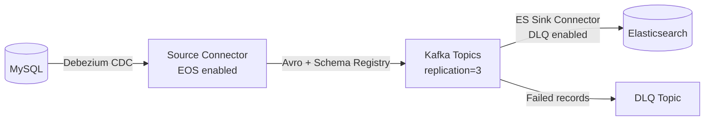

**Configuration:**
1. Worker: `exactly.once.source.support=enabled`
2. Debezium source: CDC with binlog for real-time capture
3. Avro converter with Schema Registry for schema evolution
4. ES Sink with DLQ for error handling
5. ES Sink uses document ID from Kafka record key → idempotent writes
6. Replication factor ≥ 3 for all topics

---

### Scenario 10: How to handle a connector that processes data too slowly

**Problem:** Sink connector can't keep up with the data rate; consumer lag is growing.

**Diagnosis:**
1. Check `sink-record-send-rate` JMX metric
2. Check consumer lag: `kafka-consumer-groups.sh --describe --group connect-{connector-name}`
3. Check target system latency (is Elasticsearch/DB slow?)

**Solutions:**
1. **Increase parallelism:** Increase `tasks.max` and ensure topic has enough partitions
2. **Batch optimization:** Tune `consumer.override.max.poll.records` and `consumer.override.fetch.max.bytes`
3. **Target system optimization:** Add indices to database, increase ES shard count
4. **Use compression:** Reduce network I/O with `consumer.override.fetch.max.bytes`
5. **Separate into multiple connectors:** Split topics across different connector instances
6. **Scale the cluster:** Add more Connect workers

---

## Quick Reference Card

```
┌─────────────────────────────────────────────────────────────────────┐
│                    KAFKA CONNECT CHEAT SHEET                        │
├─────────────────────────────────────────────────────────────────────┤
│                                                                     │
│  START STANDALONE:                                                  │
│    bin/connect-standalone.sh worker.properties connector.properties │
│                                                                     │
│  START DISTRIBUTED:                                                 │
│    bin/connect-distributed.sh worker.properties                     │
│                                                                     │
│  REST API (default port 8083):                                      │
│    GET    /connectors                    # List connectors          │
│    POST   /connectors                    # Create connector         │
│    GET    /connectors/{name}/status      # Check status             │
│    PUT    /connectors/{name}/config      # Update config            │
│    POST   /connectors/{name}/restart     # Restart connector        │
│    DELETE /connectors/{name}             # Delete connector         │
│    PUT    /connectors/{name}/pause       # Pause connector          │
│    PUT    /connectors/{name}/resume      # Resume connector         │
│                                                                     │
│  INTERNAL TOPICS:                                                   │
│    config.storage.topic  (1 partition, compacted)                   │
│    offset.storage.topic  (25 partitions, compacted)                 │
│    status.storage.topic  (5 partitions, compacted)                  │
│                                                                     │
│  CONVERTERS:                                                        │
│    AvroConverter         (+ Schema Registry)                        │
│    ProtobufConverter     (+ Schema Registry)                        │
│    JsonSchemaConverter   (+ Schema Registry)                        │
│    JsonConverter         (standalone)                                │
│    StringConverter       (simple strings)                            │
│    ByteArrayConverter    (pass-through)                              │
│                                                                     │
│  ERROR HANDLING:                                                    │
│    errors.tolerance=none|all                                        │
│    errors.deadletterqueue.topic.name=<dlq-topic>                   │
│    errors.deadletterqueue.context.headers.enable=true               │
│                                                                     │
│  GRACEFUL SHUTDOWN:                                                 │
│    kill <pid>  (NEVER kill -9)                                      │
│                                                                     │
└─────────────────────────────────────────────────────────────────────┘
```
