# Python Interview Notes — Comprehensive Reference

> Covers: OOP, Decorators, Multithreading, Async, Pydantic, APIs, FastAPI, Authentication, Pytest, Networking
> Includes: Code examples, Mermaid diagrams, Cross-questions, Industry interview questions

---

## 📚 Table of Contents

1. [OOP — What & Why](#1-oop--what--why)
2. [self — What & Why](#2-self--what--why)
3. [Constructors](#3-constructors)
4. [Encapsulation](#4-encapsulation)
5. [Access Modifiers](#5-access-modifiers)
6. [Types of Methods](#6-types-of-methods)
7. [Dunder / Magic Methods](#7-dunder--magic-methods)
8. [Inheritance](#8-inheritance)
9. [Polymorphism](#9-polymorphism)
10. [Abstraction](#10-abstraction)
11. [Decorators](#11-decorators)
12. [Multithreading](#12-multithreading)
13. [Async vs Sync](#13-async-vs-sync)
14. [Pydantic](#14-pydantic)
15. [APIs & REST](#15-apis--rest)
16. [FastAPI](#16-fastapi)
17. [Authentication](#17-authentication)
18. [Pytest](#18-pytest)
19. [Networking — Clients, Hosts, Ports](#19-networking--clients-hosts-ports)
20. [Query Parameters](#20-query-parameters)
21. [Industry Interview Questions Bank](#21-industry-interview-questions-bank)

---

## 1. OOP — What & Why

### What is OOP?

Object-Oriented Programming (OOP) is a paradigm that models real-world entities as **objects** bundling **data (attributes)** and **behavior (methods)** together inside **classes**.

```mermaid
mindmap
  root((OOP))
    Encapsulation
      Bundle data + methods
      Hide internals
      @property
    Inheritance
      Reuse parent code
      Single / Multi / Multilevel
      super()
    Polymorphism
      Same interface
      Different behavior
      Duck typing
    Abstraction
      Hide complexity
      ABC + abstractmethod
      Expose only what's needed
```

### Why is OOP Needed?

| Problem without OOP | OOP Solution |
|---|---|
| Repetitive code | Inheritance — reuse parent |
| No organization | Classes group related data + behavior |
| Hard to maintain | Encapsulation isolates change |
| Hard to extend | Polymorphism + abstraction |

```python
class Car:
    def __init__(self, brand, speed):
        self.brand = brand
        self.__speed = speed        # private

    def drive(self):
        print(f"{self.brand} driving at {self.__speed} km/h")

my_car = Car("Toyota", 120)
my_car.drive()   # Toyota driving at 120 km/h
```

### Cross-Questions

1. What are the 4 pillars of OOP? Explain each with a Python example.
2. What is the difference between a class and an object?
3. What is the difference between procedural and object-oriented programming?
4. How is Python OOP different from Java OOP? *(No strict access modifiers, duck typing, multiple inheritance)*
5. What is duck typing in Python?
6. When would you prefer OOP over functional programming?
7. Can a Python file have multiple classes?
8. What is the difference between a class variable and an instance variable?

---

## 2. self — What & Why

### What is `self`?

`self` is a reference to the **current instance** of the class. Python automatically passes the calling object as the first argument — by convention named `self`.

```python
class Dog:
    def __init__(self, name):
        self.name = name         # store on THIS object

    def bark(self):
        print(f"{self.name} says Woof!")

d1 = Dog("Rex")
d2 = Dog("Bruno")
d1.bark()   # Rex says Woof!
d2.bark()   # Bruno says Woof!

# d1.bark() is Python doing: Dog.bark(d1)
```

### `self` vs `cls` vs neither

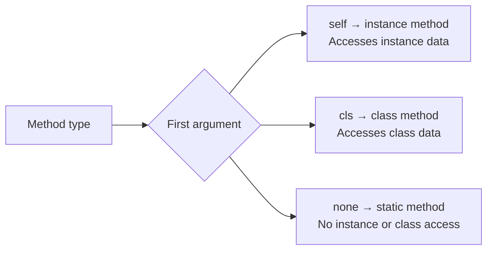

### Key Points

- `self` is a **convention**, not a keyword — you can name it anything (but never do)
- Forgetting `self` in a method signature is one of the most common Python bugs → `TypeError`
- `d1.bark()` translates internally to `Dog.bark(d1)`

### Cross-Questions

1. Is `self` a keyword in Python? *(No — convention only)*
2. What happens if you forget `self` in a method?
3. What is the difference between `self`, `cls`, and no first argument?
4. Can two instances of the same class have different attribute values? *(Yes — that's the point of `self`)*
5. What does `d1.bark()` translate to internally?

---

## 3. Constructors

### What is a Constructor?

A special method **called automatically** when an object is created. In Python it is `__init__`.

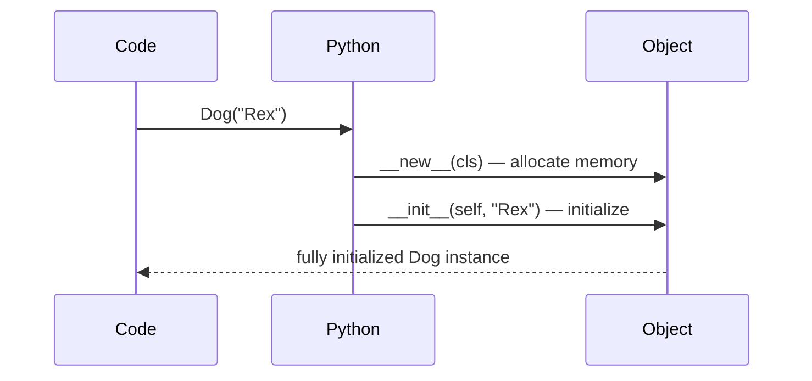

### Types of Constructors

```python
# 1. Default
class Dog:
    def __init__(self):
        self.name = "Unknown"

# 2. Parameterized
class Dog:
    def __init__(self, name, breed):
        self.name = name
        self.breed = breed

# 3. Default arguments (most flexible)
class Dog:
    def __init__(self, name, breed="Unknown"):
        self.name = name
        self.breed = breed
```

### `__init__` vs `__new__`

| | `__new__` | `__init__` |
|---|---|---|
| Purpose | Creates the object (allocates memory) | Initializes the object (sets attributes) |
| Called | Before `__init__` | After `__new__` |
| Returns | The new object | Nothing (`None`) |
| Override? | Rarely | Almost always |

```python
class Dog:
    def __new__(cls, name):
        print("__new__ — creating")
        return super().__new__(cls)

    def __init__(self, name):
        print("__init__ — initializing")
        self.name = name

d = Dog("Rex")
# __new__ — creating
# __init__ — initializing
```

### Constructor Chaining with `super()`

```python
class Animal:
    def __init__(self, name):
        self.name = name

class Dog(Animal):
    def __init__(self, name, breed):
        super().__init__(name)    # MUST call parent init
        self.breed = breed

d = Dog("Rex", "Labrador")
print(d.name, d.breed)   # Rex Labrador
```

> ⚠️ Python does **not** support constructor overloading — use default arguments instead.

### Cross-Questions

1. What is the difference between `__init__` and `__new__`?
2. Does Python support constructor overloading? *(No — use default args)*
3. What happens if you don't define `__init__`?
4. What does `super().__init__()` do and when should you use it?
5. Can `__init__` return a value? *(No — raises TypeError)*
6. What are dunder/magic methods? Name a few besides `__init__`.
7. How would you implement a Singleton using `__new__`?

---

## 4. Encapsulation

### What is Encapsulation?

Bundling **data + methods** inside a class and **restricting direct access** to internal data. Think of it as a medicine capsule — the contents are hidden, you interact with it only in the intended way.

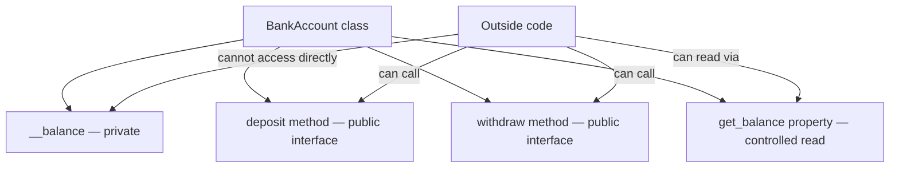

### Getter/Setter vs `@property`

```python
# Old style — explicit getters/setters
class BankAccount:
    def __init__(self, balance):
        self.__balance = balance

    def get_balance(self):
        return self.__balance

    def set_balance(self, amount):
        if amount >= 0:
            self.__balance = amount

# Pythonic style — @property (preferred)
class BankAccount:
    def __init__(self, balance):
        self.__balance = balance

    @property
    def balance(self):              # getter — acc.balance
        return self.__balance

    @balance.setter
    def balance(self, amount):      # setter — acc.balance = 5000
        if amount >= 0:
            self.__balance = amount
        else:
            raise ValueError("Balance can't be negative")

acc = BankAccount(5000)
print(acc.balance)      # 5000
acc.balance = 8000      # uses setter
acc.balance = -100      # ValueError
```

### Read-Only Property

```python
@property
def balance(self):
    return self.__balance
# No setter defined → acc.balance = 5000 raises AttributeError
```

### Cross-Questions

1. What is the Pythonic way to implement encapsulation? *(`@property`)*
2. What is name mangling? How does it work?
3. Can you access a `__private` variable from outside the class? *(Yes — via `_ClassName__var`)*
4. How would you make an attribute read-only?
5. What is the difference between a getter/setter method and `@property`?
6. Why use encapsulation if Python doesn't enforce it strictly?

---

## 5. Access Modifiers

### The 3 Levels

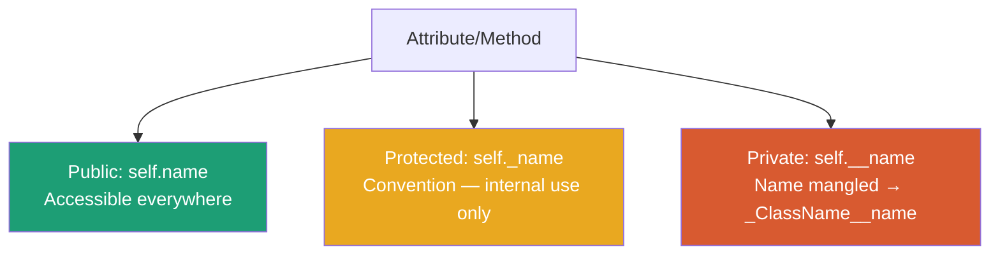

```python
class Employee:
    def __init__(self):
        self.name = "Hemant"          # Public     → accessible anywhere
        self._department = "Data"     # Protected  → convention, avoid outside
        self.__salary = 90000         # Private    → name mangled

emp = Employee()
print(emp.name)                       # ✅ works
print(emp._department)                # ⚠️ works but frowned upon
print(emp.__salary)                   # ❌ AttributeError
print(emp._Employee__salary)          # 90000 — bypass (never do this)
```

### Subclass Access

```python
class Animal:
    def __init__(self):
        self.__secret = "hidden"

class Dog(Animal):
    def reveal(self):
        print(self.__secret)   # ❌ AttributeError — even subclass can't access!
```

### `__dunder__` is NOT private

`__init__`, `__str__`, `__repr__` — double underscore on **both** sides = magic/special methods. Not private.

### Python vs Java

| | Python | Java |
|---|---|---|
| Access control | Convention-based | Compiler-enforced |
| Truly private? | No — name mangling bypass | Yes |
| Philosophy | "We're all consenting adults" | Strict enforcement |

### Cross-Questions

1. What is the difference between `_var`, `__var`, and `__var__`?
2. Is Python's private truly private? *(No — name mangling, bypass with `_Class__var`)*
3. Can a subclass access a parent's private attributes? *(No)*
4. What is `__dunder__` and is it private? *(No — magic method)*
5. Why does Python use conventions instead of strict access control?

---

## 6. Types of Methods

### Three Types

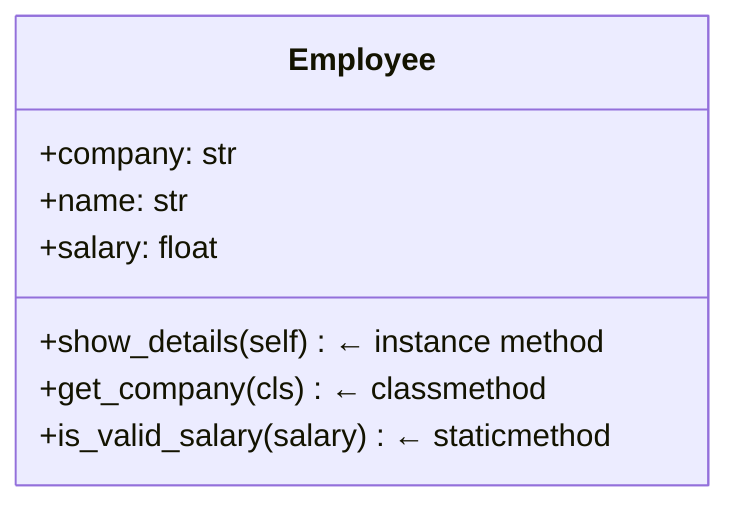

```python
class Employee:
    company = "TechCorp"                  # class variable

    def __init__(self, name, salary):
        self.name = name                  # instance variable
        self.salary = salary

    def show_details(self):               # instance method — accesses self
        print(f"{self.name} earns {self.salary}")

    @classmethod
    def get_company(cls):                 # class method — accesses cls
        return cls.company

    @classmethod
    def from_string(cls, data):           # factory method — alternative constructor
        name, salary = data.split("-")
        return cls(name, float(salary))

    @staticmethod
    def is_valid_salary(salary):          # static method — accesses neither
        return salary > 0

emp = Employee("Hemant", 90000)
emp.show_details()                        # Hemant earns 90000
print(Employee.get_company())            # TechCorp
emp2 = Employee.from_string("Ravi-70000")
print(Employee.is_valid_salary(90000))   # True
```

### Comparison Table

| | Instance method | Class method | Static method |
|---|---|---|---|
| First arg | `self` | `cls` | none |
| Decorator | none | `@classmethod` | `@staticmethod` |
| Accesses | instance data | class data | neither |
| Use case | object behavior | factory / class state | utility |

### Cross-Questions

1. What is the difference between `@classmethod` and `@staticmethod`?
2. When would you use a class method over an instance method?
3. What is a factory method? Write one.
4. Can you call a static method on an instance? *(Yes)*
5. Can a static method access class variables? *(Not directly — no `cls`; only via class name)*
6. What happens if you call an instance method on the class without passing `self`? → `TypeError`

---

## 7. Dunder / Magic Methods

### What are Dunder Methods?

Special methods with `__method__` pattern that Python calls **automatically** behind the scenes when you use built-in operations.

```python
result = a + b      # Python calls: a.__add__(b)
print(obj)          # Python calls: obj.__str__()
len(obj)            # Python calls: obj.__len__()
```

### Key Dunder Methods

```python
class Vector:
    def __init__(self, x, y):
        self.x = x
        self.y = y

    def __str__(self):                      # for humans — print()
        return f"Vector({self.x}, {self.y})"

    def __repr__(self):                     # for devs — repr(), logs
        return f"Vector(x={self.x}, y={self.y})"

    def __add__(self, other):               # v1 + v2
        return Vector(self.x + other.x, self.y + other.y)

    def __eq__(self, other):                # v1 == v2
        return self.x == other.x and self.y == other.y

    def __len__(self):                      # len(v)
        return int((self.x**2 + self.y**2) ** 0.5)

    def __call__(self, scalar):             # v(3) — callable object
        return Vector(self.x * scalar, self.y * scalar)

    def __getitem__(self, index):           # v[0], v[1]
        return [self.x, self.y][index]

    def __contains__(self, val):            # val in v
        return val in [self.x, self.y]
```

### Context Manager — `__enter__` and `__exit__`

```python
class FileManager:
    def __init__(self, filename):
        self.filename = filename

    def __enter__(self):
        self.file = open(self.filename, "w")
        return self.file

    def __exit__(self, exc_type, exc_val, exc_tb):
        self.file.close()

with FileManager("test.txt") as f:
    f.write("Hello!")
```

### Making a Class Iterable

```python
class CountUp:
    def __init__(self, limit):
        self.limit = limit
        self.current = 0

    def __iter__(self):
        return self

    def __next__(self):
        if self.current >= self.limit:
            raise StopIteration
        self.current += 1
        return self.current

for n in CountUp(5):
    print(n)    # 1 2 3 4 5
```

### Cheat Sheet

| Operation | Dunder |
|---|---|
| `obj + other` | `__add__` |
| `obj - other` | `__sub__` |
| `obj * other` | `__mul__` |
| `obj == other` | `__eq__` |
| `obj < other` | `__lt__` |
| `len(obj)` | `__len__` |
| `print(obj)` | `__str__` |
| `repr(obj)` | `__repr__` |
| `obj[key]` | `__getitem__` |
| `obj[key] = val` | `__setitem__` |
| `x in obj` | `__contains__` |
| `obj()` | `__call__` |
| `with obj` | `__enter__`, `__exit__` |
| `del obj` | `__del__` |
| `iter(obj)` | `__iter__` |
| `next(obj)` | `__next__` |

### Cross-Questions

1. What is the difference between `__str__` and `__repr__`?
2. What is operator overloading? Implement `+` for a custom class.
3. How do you make a class iterable? *(`__iter__` + `__next__`)*
4. What does `__call__` do? When would you use it?
5. How do you implement a context manager using dunder methods?
6. If only `__repr__` is defined, what does `print(obj)` use? *(`__repr__` as fallback)*
7. What is the difference between `__del__` and `__exit__`?
8. Name dunder methods used in NumPy or Pandas.

---

## 8. Inheritance

### What is Inheritance?

A child class **reuses** attributes and methods of a parent class, avoiding repetition and building logical hierarchies.

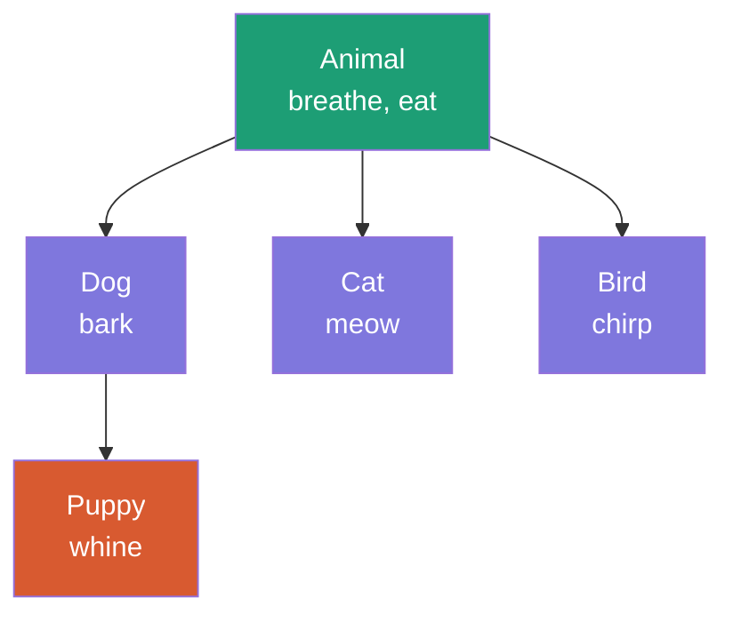

### Types of Inheritance

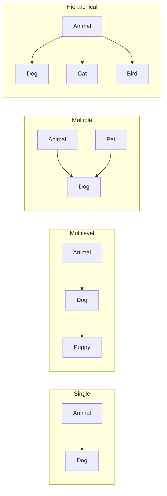

### Single Inheritance

```python
class Animal:
    def __init__(self, name):
        self.name = name

    def eat(self):
        print(f"{self.name} is eating")

class Dog(Animal):
    def bark(self):
        print(f"{self.name} says Woof!")

d = Dog("Rex")
d.eat()     # inherited from Animal
d.bark()    # Dog's own method
```

### Multilevel Inheritance

```python
class Animal:
    def breathe(self): print("Breathing")

class Dog(Animal):
    def bark(self): print("Woof!")

class Puppy(Dog):
    def whine(self): print("Whining...")

p = Puppy()
p.breathe()   # from Animal — 2 levels up
p.bark()      # from Dog — 1 level up
p.whine()     # own method
```

### Multiple Inheritance + Diamond Problem

```python
class A:
    def hello(self): print("Hello from A")

class B(A):
    def hello(self): print("Hello from B")

class C(A):
    def hello(self): print("Hello from C")

class D(B, C):   # Multiple inheritance
    pass

d = D()
d.hello()            # Hello from B  ← MRO decides
print(D.__mro__)
# (D, B, C, A, object) — C3 linearization
```

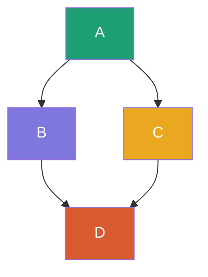

**MRO (Method Resolution Order)** — Python uses **C3 linearization**: left to right, depth first, no repeats. Always check `ClassName.__mro__`.

### `super()` in Multilevel

```python
class Animal:
    def __init__(self, name):
        self.name = name

class Dog(Animal):
    def __init__(self, name, breed):
        super().__init__(name)       # calls Animal.__init__
        self.breed = breed

class Puppy(Dog):
    def __init__(self, name, breed, age):
        super().__init__(name, breed)  # calls Dog.__init__
        self.age = age
```

### Cross-Questions

1. What are the types of inheritance in Python?
2. What is MRO? How does Python resolve method conflicts in multiple inheritance?
3. What is the diamond problem? How does Python handle it?
4. Why use `super()` instead of calling the parent class directly?
5. What happens if you don't call `super().__init__()`?
6. What is `isinstance()` and how does it relate to inheritance?
7. Can a child class override a parent method? *(Yes — method overriding)*

---

## 9. Polymorphism

### What is Polymorphism?

**Same method name, different behavior** depending on which class calls it.

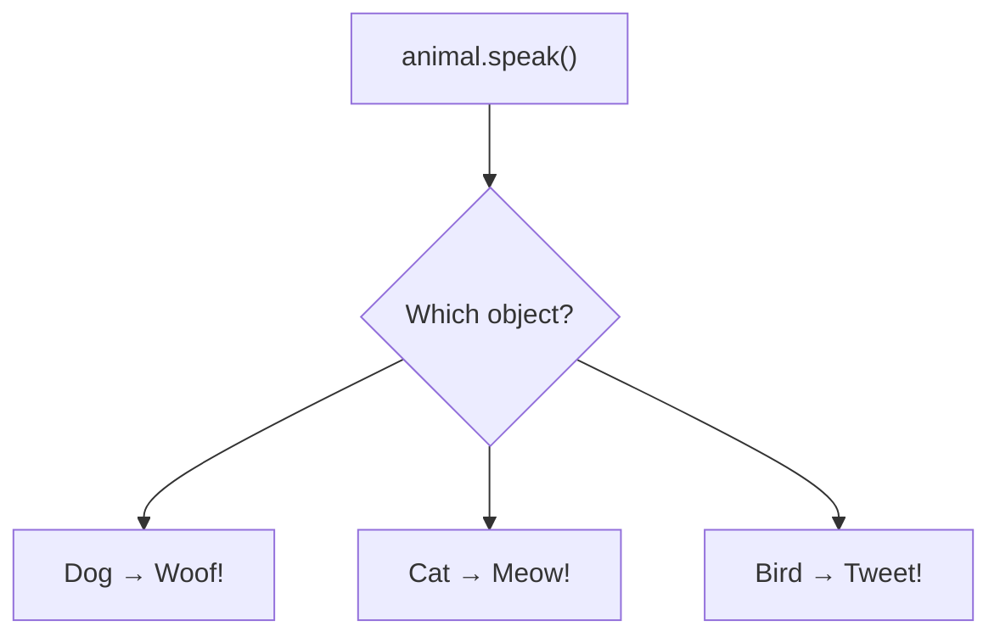

### Method Overriding

```python
class Animal:
    def speak(self): print("Some sound")

class Dog(Animal):
    def speak(self): print("Woof!")    # overrides parent

class Cat(Animal):
    def speak(self): print("Meow!")    # overrides parent

def make_sound(animal):
    animal.speak()                     # works for ANY animal

make_sound(Dog())    # Woof!
make_sound(Cat())    # Meow!
```

### Duck Typing

> "If it walks like a duck and quacks like a duck, it's a duck."

No inheritance needed — just needs the right method:

```python
class Dog:
    def speak(self): print("Woof!")

class Robot:                           # Not an Animal at all!
    def speak(self): print("Beep boop!")

def make_it_speak(thing):              # doesn't care about type
    thing.speak()

make_it_speak(Dog())      # Woof!
make_it_speak(Robot())    # Beep boop!
```

### Polymorphism + ABC (Best Pattern)

```python
from abc import ABC, abstractmethod

class Shape(ABC):
    @abstractmethod
    def area(self): pass              # every subclass MUST implement

class Circle(Shape):
    def __init__(self, r): self.r = r
    def area(self): return 3.14 * self.r ** 2

class Rectangle(Shape):
    def __init__(self, w, h): self.w = w; self.h = h
    def area(self): return self.w * self.h

shapes = [Circle(5), Rectangle(4, 6)]
for s in shapes:
    print(s.area())    # 78.5 / 24
```

### Operator Overloading

```python
print(1 + 2)        # 3      — int addition
print("a" + "b")    # ab     — string concat
print([1] + [2])    # [1, 2] — list merge
# Same `+` operator → 3 different behaviors = polymorphism
```

### Cross-Questions

1. What is the difference between method overriding and method overloading?
2. Does Python support method overloading? *(No — use default args)*
3. What is duck typing? How is it different from classical polymorphism?
4. How do `ABC` and `@abstractmethod` enforce polymorphism?
5. What is operator overloading? Give an example.
6. What is `isinstance()` vs `type()`?

---

## 10. Abstraction

### What is Abstraction?

**Hiding complexity**, exposing only what's necessary. You use a TV remote without knowing its internal circuit.

```python
from abc import ABC, abstractmethod

class DatabaseConnector(ABC):

    @abstractmethod
    def connect(self): pass          # must be implemented

    @abstractmethod
    def execute(self, query): pass   # must be implemented

    def log(self, msg):              # concrete method — shared
        print(f"[LOG] {msg}")

class SnowflakeConnector(DatabaseConnector):
    def connect(self):
        print("Connecting to Snowflake...")

    def execute(self, query):
        print(f"Executing on Snowflake: {query}")

class PostgresConnector(DatabaseConnector):
    def connect(self):
        print("Connecting to Postgres...")

    def execute(self, query):
        print(f"Executing on Postgres: {query}")

# DatabaseConnector()  → TypeError — can't instantiate abstract class
sf = SnowflakeConnector()
sf.connect()
sf.execute("SELECT * FROM orders")
```

### Abstraction vs Encapsulation

| | Abstraction | Encapsulation |
|---|---|---|
| What | Hide complexity | Hide data |
| How | ABC + abstractmethod | `_` and `__` + @property |
| Focus | Design / interface | Implementation / security |
| Example | `Shape.area()` is abstract | `__balance` is private |

### Cross-Questions

1. What is the difference between abstraction and encapsulation?
2. Can you instantiate an abstract class? *(No — TypeError)*
3. What happens if a subclass doesn't implement all abstract methods?
4. What is ABC in Python?
5. Can an abstract class have concrete methods? *(Yes)*

---

## 11. Decorators

### What is a Decorator?

A function that **wraps another function** to add behavior — without modifying the original.

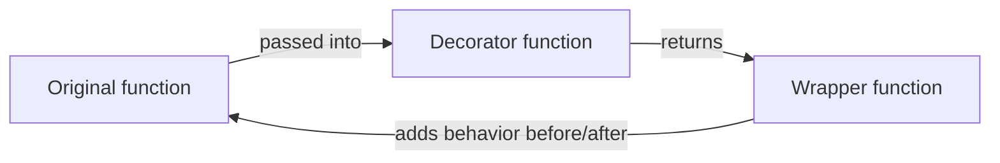

### Basic Decorator

```python
from functools import wraps

def logger(func):
    @wraps(func)                         # preserves function name & docstring
    def wrapper(*args, **kwargs):
        print(f"Calling {func.__name__} with {args}")
        result = func(*args, **kwargs)
        print(f"{func.__name__} returned {result}")
        return result
    return wrapper

@logger
def add(a, b):
    return a + b

add(3, 5)
# Calling add with (3, 5)
# add returned 8
```

`@logger` is syntactic sugar for `add = logger(add)`.

### Decorator with Parameters

```python
def repeat(n):                          # outer — takes decorator config
    def decorator(func):
        @wraps(func)
        def wrapper(*args, **kwargs):
            for _ in range(n):
                func(*args, **kwargs)
        return wrapper
    return decorator

@repeat(3)
def greet(name):
    print(f"Hello {name}!")

greet("Hemant")   # prints 3 times
```

### Stacking Decorators

```python
@timer
@logger
def process(): ...

# Applied bottom-up: logger wraps first, then timer wraps that
# Equivalent to: timer(logger(process))()
```

### Real-World Patterns

```python
import time
from functools import wraps

# Timer
def timer(func):
    @wraps(func)
    def wrapper(*args, **kwargs):
        start = time.time()
        result = func(*args, **kwargs)
        print(f"{func.__name__} took {time.time()-start:.4f}s")
        return result
    return wrapper

# Retry
def retry(times=3):
    def decorator(func):
        @wraps(func)
        def wrapper(*args, **kwargs):
            for attempt in range(times):
                try:
                    return func(*args, **kwargs)
                except Exception as e:
                    print(f"Attempt {attempt+1} failed: {e}")
            print("All attempts failed")
        return wrapper
    return decorator

# Access control
def login_required(func):
    @wraps(func)
    def wrapper(user, *args, **kwargs):
        if not user.get("is_logged_in"):
            print("Access denied")
            return
        return func(user, *args, **kwargs)
    return wrapper
```

### Cross-Questions

1. What is a decorator? How does it work internally?
2. What is `functools.wraps` and why is it important?
3. How do you write a decorator that accepts its own arguments?
4. What is the execution order when stacking multiple decorators? *(bottom-up)*
5. Where are decorators used in real projects? *(logging, auth, retry, caching)*
6. What is the difference between `@decorator` and `@decorator()`?
7. Can a class be used as a decorator? *(Yes — implement `__call__`)*

---

## 12. Multithreading

### What is Multithreading?

Running **multiple threads** concurrently within the same process, sharing memory.

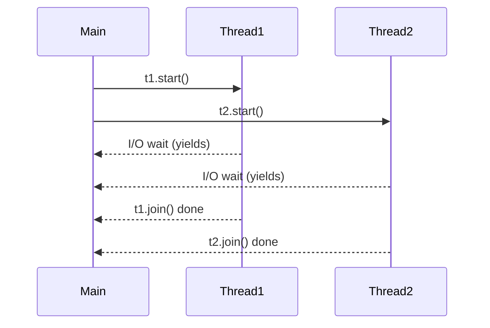

### The GIL — Most Important Concept

**Global Interpreter Lock** — allows only **one thread to execute Python bytecode at a time**.

```
GIL impact:
  CPU-bound tasks  → threading DOESN'T help (GIL blocks parallelism)
  I/O-bound tasks  → threading DOES help (threads release GIL while waiting)
```

### Basic Threading

```python
import threading, time

def download(file_name):
    print(f"Starting: {file_name}")
    time.sleep(2)
    print(f"Done: {file_name}")

t1 = threading.Thread(target=download, args=("file1.csv",))
t2 = threading.Thread(target=download, args=("file2.csv",))

t1.start(); t2.start()
t1.join();  t2.join()     # wait for both
print("All done")          # takes ~2s not 4s
```

### Race Condition + Lock

```python
import threading

counter = 0
lock = threading.Lock()

def increment():
    global counter
    for _ in range(100000):
        with lock:            # only one thread at a time
            counter += 1

t1 = threading.Thread(target=increment)
t2 = threading.Thread(target=increment)
t1.start(); t2.start()
t1.join();  t2.join()
print(counter)    # 200000 — correct with lock
```

### ThreadPoolExecutor (Modern, Preferred)

```python
from concurrent.futures import ThreadPoolExecutor, as_completed

def fetch_data(url):
    time.sleep(1)
    return f"Data from {url}"

urls = ["api/users", "api/orders", "api/products"]

with ThreadPoolExecutor(max_workers=3) as executor:
    futures = {executor.submit(fetch_data, url): url for url in urls}
    for future in as_completed(futures):
        print(f"{futures[future]} → {future.result()}")
```

### Cross-Questions

1. What is the GIL? How does it affect multithreading?
2. What is a race condition? How do you fix it?
3. What is the difference between `start()` and `run()`? *(`start()` creates new thread, `run()` runs in current)*
4. When would you use threading vs multiprocessing vs asyncio?
5. What is a deadlock? How do you avoid it?
6. What is `ThreadPoolExecutor` and why is it preferred?
7. What is a daemon thread?
8. What are `Lock`, `Semaphore`, and `Event` in threading?

---

## 13. Async vs Sync

### Concurrency Models Compared

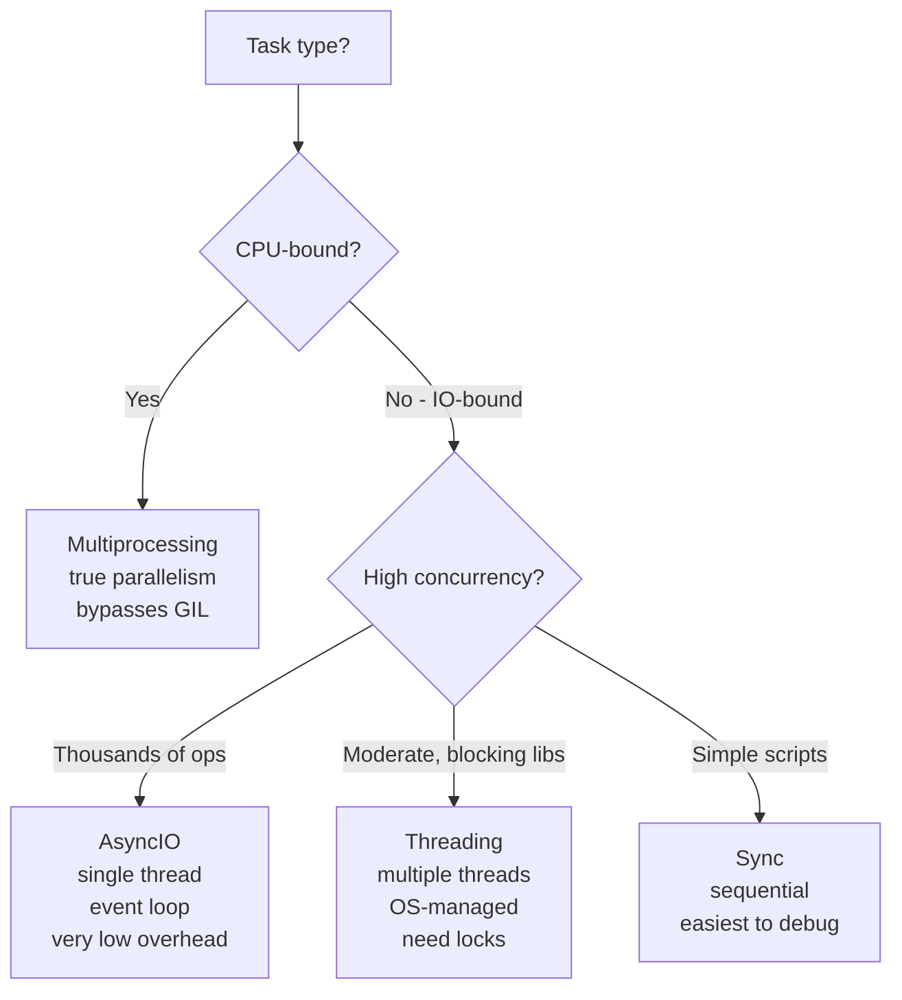

### Sync vs Async Code

```python
# SYNC — blocks for 4 seconds total
import time

def fetch_user():
    time.sleep(2)
    return "User"

def fetch_orders():
    time.sleep(2)
    return "Orders"

fetch_user()    # 2s
fetch_orders()  # 2s more

# ASYNC — both complete in ~2 seconds
import asyncio

async def fetch_user():
    await asyncio.sleep(2)      # yields to event loop
    return "User"

async def fetch_orders():
    await asyncio.sleep(2)
    return "Orders"

async def main():
    results = await asyncio.gather(fetch_user(), fetch_orders())
    print(results)   # ['User', 'Orders'] in ~2s

asyncio.run(main())
```

### Event Loop

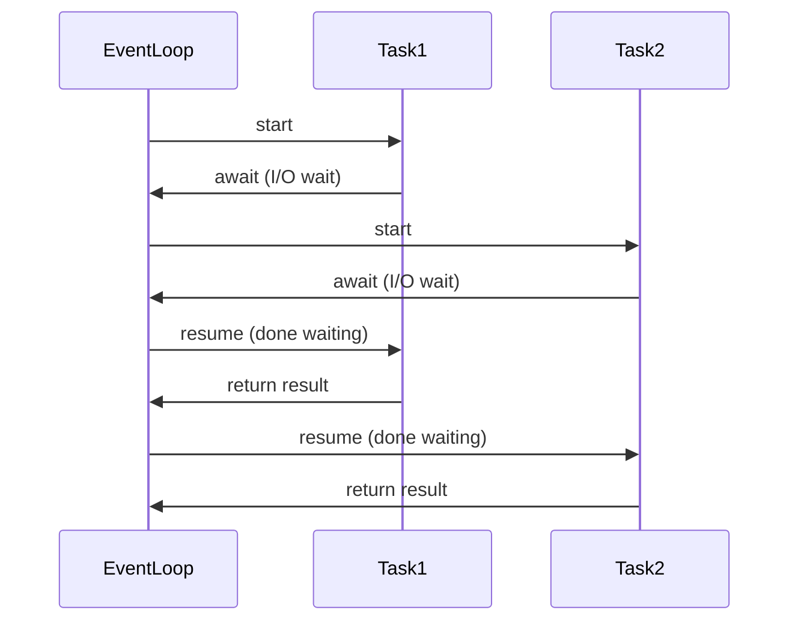

### `gather` vs `create_task`

```python
# gather — run all, wait for ALL
results = await asyncio.gather(task_a(), task_b(), task_c())

# create_task — schedule, do other work, collect later
t1 = asyncio.create_task(task_a())
t2 = asyncio.create_task(task_b())
print("doing other work...")
r1 = await t1
r2 = await t2
```

### Mixing Sync in Async — `run_in_executor`

```python
import asyncio

def blocking_call():
    time.sleep(2)
    return "result"

async def main():
    loop = asyncio.get_event_loop()
    result = await loop.run_in_executor(None, blocking_call)
    print(result)
```

### Threading vs Async

| | Threading | Async |
|---|---|---|
| Model | OS-managed threads | Event loop (single thread) |
| Switching | Preemptive (OS decides) | Cooperative (`await` decides) |
| Race conditions | Yes — need locks | Rarely — single thread |
| Overhead | Higher | Very low |
| Best for | I/O-bound, blocking libs | High concurrency I/O |

### Cross-Questions

1. What is the event loop in Python?
2. What is a coroutine? How is it different from a regular function?
3. What is the difference between `asyncio.sleep()` and `time.sleep()`?
4. What is the difference between `asyncio.gather()` and `asyncio.create_task()`?
5. How is async different from multithreading?
6. What is preemptive vs cooperative multitasking?
7. How do you use a blocking sync function inside async code? *(`run_in_executor`)*
8. Does async help with CPU-bound tasks? *(No — use multiprocessing)*
9. What are `async for` and `async with`?

---

## 14. Pydantic

### What is Pydantic?

A **data validation and settings management library** using Python type hints to validate data automatically.

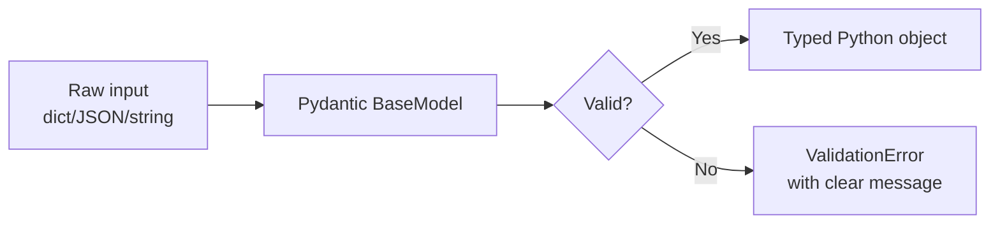

### Basic Model

```python
from pydantic import BaseModel, Field
from typing import Optional, List

class Employee(BaseModel):
    name: str = Field(min_length=2, max_length=50)
    age: int = Field(ge=18, le=65)
    salary: float = Field(gt=0)
    department: Optional[str] = None
    skills: List[str] = []

e = Employee(name="Hemant", age=28, salary=90000.0)
print(e.model_dump())
# {'name': 'Hemant', 'age': 28, 'salary': 90000.0, 'department': None, 'skills': []}
```

### Auto Type Coercion

```python
class Employee(BaseModel):
    age: int

e = Employee(age="28")      # "28" → coerced to int 28
print(type(e.age))           # <class 'int'>

e2 = Employee(age="abc")    # ValidationError — can't coerce
```

### Custom Validators

```python
from pydantic import BaseModel, field_validator

class Employee(BaseModel):
    name: str
    age: int

    @field_validator("age")
    @classmethod
    def age_must_be_adult(cls, v):
        if v < 18:
            raise ValueError("Must be at least 18")
        return v

    @field_validator("name")
    @classmethod
    def clean_name(cls, v):
        return v.strip().title()    # auto-clean
```

### Nested Models

```python
class Address(BaseModel):
    city: str
    country: str

class Employee(BaseModel):
    name: str
    address: Address            # nested model

e = Employee(
    name="Hemant",
    address={"city": "Hyderabad", "country": "India"}  # dict auto-converted
)
print(e.address.city)    # Hyderabad
```

### Pydantic v1 vs v2

| | Pydantic v1 | Pydantic v2 |
|---|---|---|
| Validator | `@validator` | `@field_validator` |
| Export dict | `.dict()` | `.model_dump()` |
| Export JSON | `.json()` | `.model_dump_json()` |
| Speed | Baseline | ~5-50x faster (Rust core) |

### Cross-Questions

1. What is Pydantic and why use it over plain dataclasses?
2. What is the difference between Pydantic v1 and v2?
3. How does Pydantic handle type coercion?
4. How do you write custom validators?
5. How does FastAPI use Pydantic?
6. What is `model_dump()` used for?
7. How do you make a field optional in Pydantic?
8. What is the `Field()` function used for?
9. Can Pydantic validate nested objects? *(Yes)*

---

## 15. APIs & REST

### What is an API?

An **Application Programming Interface** — a way for two systems to communicate using defined rules.

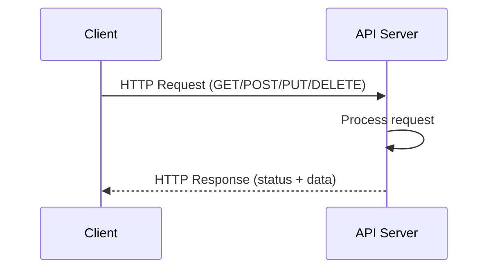

### HTTP Methods

| Method | Action | Example |
|---|---|---|
| GET | Read/fetch | Get all users |
| POST | Create | Create a user |
| PUT | Replace entirely | Replace user data |
| PATCH | Partial update | Update just email |
| DELETE | Delete | Delete a user |

### HTTP Status Codes

```
2xx — Success
  200 OK          → request succeeded
  201 Created     → resource created (POST)
  204 No Content  → success, no body (DELETE)

4xx — Client Error
  400 Bad Request     → invalid input
  401 Unauthorized    → not authenticated
  403 Forbidden       → authenticated but no permission
  404 Not Found       → resource doesn't exist
  422 Unprocessable   → validation failed (FastAPI default)

5xx — Server Error
  500 Internal Error  → server crashed
  503 Unavailable     → server overloaded
```

### Connectors as API Clients

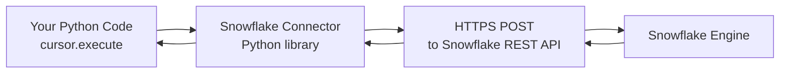

Every connector (Snowflake, boto3, BigQuery) is a polished API client making HTTP calls on your behalf.

### Cross-Questions

1. What is REST? What are the HTTP verbs?
2. What is the difference between PUT and PATCH?
3. What does status code 401 vs 403 mean?
4. What is the difference between an API and a library?
5. What is idempotency? Which HTTP methods are idempotent?

---

## 16. FastAPI

### What is FastAPI?

A modern, fast Python web framework built on **Starlette** (async), **Pydantic** (validation), and **Uvicorn** (ASGI server).

```bash
pip install fastapi uvicorn
uvicorn main:app --reload
```

### Path vs Query Parameters

```python
from fastapi import FastAPI, Query
from typing import Optional

app = FastAPI()

# Path param — identifies specific resource
@app.get("/users/{user_id}")
def get_user(user_id: int):
    return {"user_id": user_id}

# Query params — filter/paginate collection
@app.get("/users")
def list_users(
    page: int = Query(default=1, ge=1),
    limit: int = Query(default=10, ge=1, le=100),
    active: Optional[bool] = None
):
    return {"page": page, "limit": limit, "active": active}
```

### Request Body + Response Model

```python
from pydantic import BaseModel

class UserCreate(BaseModel):
    name: str
    age: int
    email: str

class UserResponse(BaseModel):
    id: int
    name: str
    email: str
    # notice: no age — filtered out by response_model

@app.post("/users", response_model=UserResponse, status_code=201)
def create_user(user: UserCreate):
    return {"id": 1, "name": user.name, "email": user.email}
```

### Dependency Injection

```python
from fastapi import Depends, HTTPException

def get_db():
    db = {"connected": True}
    try:
        yield db
    finally:
        pass   # close connection

def verify_token(token: str):
    if token != "secret":
        raise HTTPException(401, "Invalid token")
    return token

@app.get("/data")
def get_data(db=Depends(get_db), token=Depends(verify_token)):
    return {"status": db["connected"]}
```

### Middleware

```python
from fastapi import Request
import time

@app.middleware("http")
async def timer_middleware(request: Request, call_next):
    start = time.time()
    response = await call_next(request)
    response.headers["X-Process-Time"] = str(time.time() - start)
    return response
```

### Full CRUD Flow

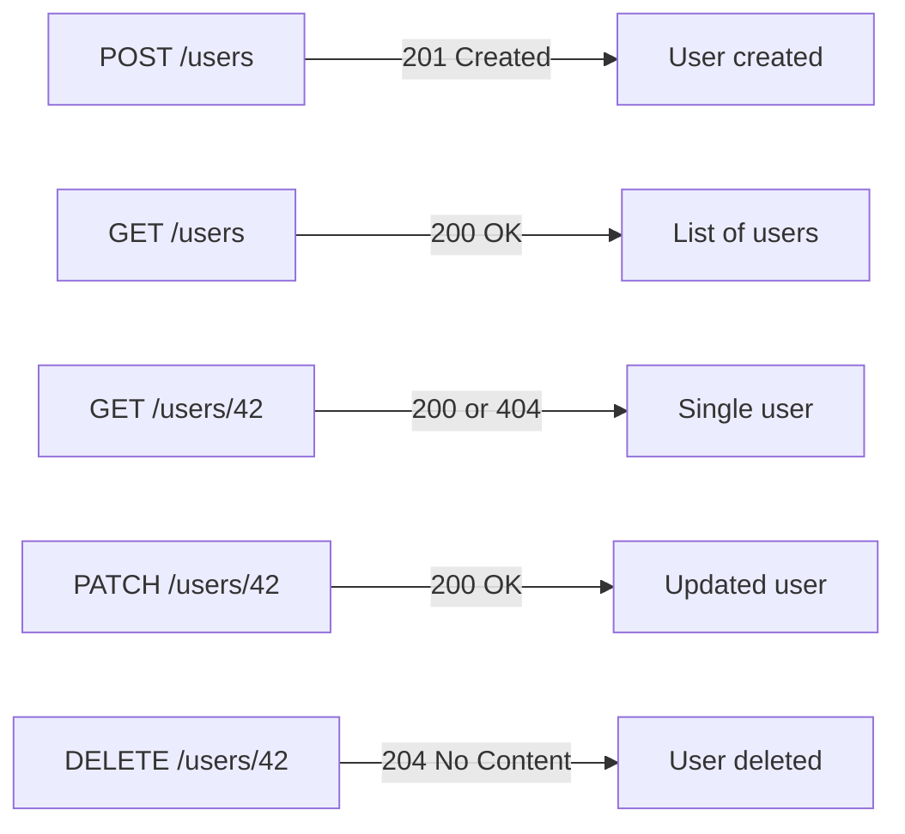

### Production Structure

```
project/
├── main.py
├── routers/
│   ├── users.py
│   └── orders.py
├── models/
│   └── user.py
├── services/
│   └── user_service.py
├── db/
│   └── database.py
└── config.py
```

### Auto Documentation

```
http://localhost:8000/docs       → Swagger UI (interactive)
http://localhost:8000/redoc      → ReDoc (readable)
http://localhost:8000/openapi.json → raw schema
```

### Cross-Questions

1. What is the difference between FastAPI and Flask?
2. What is `response_model` and why is it important?
3. What is dependency injection in FastAPI?
4. How does FastAPI handle async requests?
5. What is middleware? Where would you use it?
6. What are background tasks in FastAPI?
7. What HTTP status code does FastAPI return for validation errors? *(422)*
8. How do you structure a large FastAPI project?
9. What is `TestClient` in FastAPI testing?
10. What is the `lifespan` event used for?

---

## 17. Authentication

### Auth vs Authorization

```
Authentication → Who are you?    (identity check)
Authorization  → What can you do? (permission check)

401 Unauthorized → not authenticated
403 Forbidden    → authenticated but not allowed
```

### Authentication Types

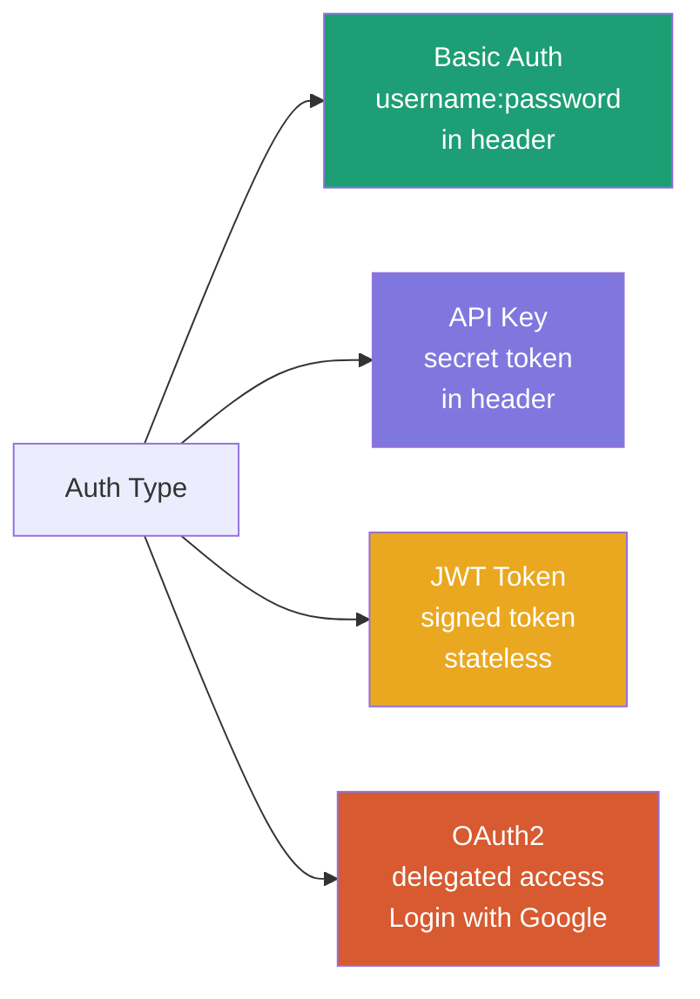

### JWT — Structure

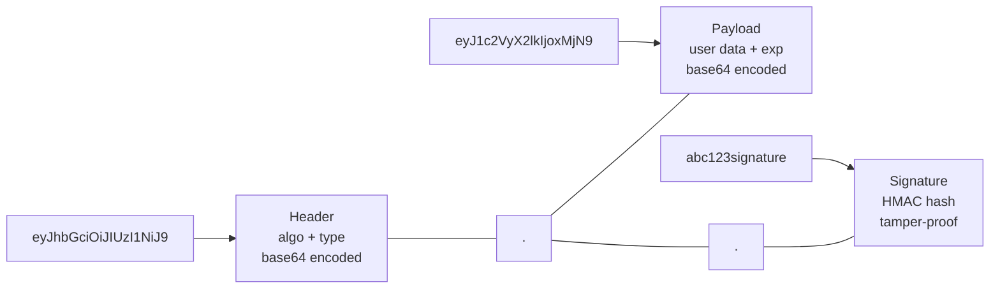

### JWT Flow

```mermaid
sequenceDiagram
    participant User
    participant Server
    User->>Server: POST /login {username, password}
    Server->>Server: verify credentials
    Server-->>User: JWT token
    User->>Server: GET /dashboard\nAuthorization: Bearer <token>
    Server->>Server: decode + verify JWT
    Server-->>User: 200 OK (if valid)\n401 (if expired/tampered)
```

### JWT in FastAPI

```python
from jose import jwt
from datetime import datetime, timedelta

SECRET_KEY = "keep-this-safe"
ALGORITHM = "HS256"

def create_access_token(data: dict):
    payload = data.copy()
    payload["exp"] = datetime.utcnow() + timedelta(minutes=30)
    return jwt.encode(payload, SECRET_KEY, algorithm=ALGORITHM)

def verify_token(token: str):
    payload = jwt.decode(token, SECRET_KEY, algorithms=[ALGORITHM])
    return payload.get("sub")
```

### Password Hashing

```python
from passlib.context import CryptContext

pwd_context = CryptContext(schemes=["bcrypt"], deprecated="auto")

hashed = pwd_context.hash("mypassword")     # always different (salt)
pwd_context.verify("mypassword", hashed)    # True
pwd_context.verify("wrong", hashed)         # False
```

### Refresh Token Pattern

```mermaid
sequenceDiagram
    participant Client
    participant Server
    Client->>Server: POST /login
    Server-->>Client: access_token (15min) + refresh_token (7days)
    Client->>Server: GET /data + access_token
    Server-->>Client: 200 OK
    Note over Client,Server: 15 minutes later...
    Client->>Server: GET /data + expired access_token
    Server-->>Client: 401 Token expired
    Client->>Server: POST /refresh + refresh_token
    Server-->>Client: new access_token
```

### Cross-Questions

1. What is the difference between authentication and authorization?
2. What is JWT? What are its three parts?
3. Is JWT encrypted? *(No — base64 encoded + signed, not encrypted)*
4. What is the difference between stateful and stateless authentication?
5. How do refresh tokens work?
6. Why should you never store passwords in plain text?
7. What is bcrypt? What is salting?
8. What is OAuth2? How is it different from Basic Auth?
9. What HTTP status code means unauthorized? *(401 vs 403 — know the difference)*
10. How does Snowflake handle authentication? *(password, key-pair, OAuth, SSO)*

---

## 18. Pytest

### What is Pytest?

Python's most popular **testing framework** — auto-discovers and runs tests, gives clear failure reports.

```bash
pip install pytest pytest-cov pytest-mock
pytest              # run all tests
pytest -v           # verbose
pytest -k "add"     # run tests matching keyword
pytest -m slow      # run tests with marker
pytest --cov=.      # with coverage
```

### Test Discovery Rules

```
Files:     test_*.py  or  *_test.py
Functions: test_*
Classes:   Test*
```

### AAA Pattern

```python
def test_clean_orders(raw_orders):
    # Arrange — setup (done by fixture here)

    # Act
    result = clean_orders(raw_orders)

    # Assert
    assert len(result) == 2
```

### Fixtures

```python
import pytest

@pytest.fixture(scope="function")      # default — new per test
def sample_user():
    return {"name": "Hemant", "age": 28}

@pytest.fixture(scope="session")       # shared for entire test run
def db_connection():
    conn = {"connected": True}
    yield conn                          # setup
    conn["connected"] = False           # teardown — runs after all tests

def test_user_name(sample_user):
    assert sample_user["name"] == "Hemant"
```

### Parametrize

```python
import pytest

@pytest.mark.parametrize("a, b, expected", [
    (1, 2, 3),
    (0, 0, 0),
    (-1, 1, 0),
    (100, -50, 50),
])
def test_add(a, b, expected):
    assert add(a, b) == expected
```

### Mocking

```python
def test_process_user(mocker):
    mocker.patch(
        "service.get_user_from_api",
        return_value={"id": 1, "name": "Hemant"}
    )
    result = process_user(1)
    assert result == "Processed: Hemant"
```

### FastAPI Testing

```python
from fastapi.testclient import TestClient
from main import app

client = TestClient(app)

def test_create_user():
    response = client.post("/users", json={"name": "Hemant", "age": 28})
    assert response.status_code == 201
    assert response.json()["name"] == "Hemant"

def test_user_not_found():
    response = client.get("/users/9999")
    assert response.status_code == 404
```

### Testing Data Transformations

```python
import pandas as pd

@pytest.fixture
def raw_orders():
    return pd.DataFrame({
        "order_id": [1, 2, None, 4],
        "amount":   [100, -50, 200, None],
    })

def test_nulls_dropped(raw_orders):
    result = clean_orders(raw_orders)
    assert result["order_id"].isna().sum() == 0

def test_negative_removed(raw_orders):
    result = clean_orders(raw_orders)
    assert (result["amount"] <= 0).sum() == 0
```

### conftest.py

```python
# conftest.py — shared fixtures, auto-loaded by pytest, no import needed
import pytest
from fastapi.testclient import TestClient
from main import app

@pytest.fixture(scope="session")
def client():
    return TestClient(app)

@pytest.fixture
def auth_headers():
    return {"Authorization": "Bearer test_token"}
```

### Test Markers

```python
@pytest.mark.slow
def test_heavy():  ...

@pytest.mark.skip(reason="Not implemented")
def test_future():  ...

@pytest.mark.xfail(reason="Known bug")
def test_bug():  ...
```

### Cross-Questions

1. What is pytest? How is it different from unittest?
2. What is a fixture? What is `scope` in a fixture?
3. What is `conftest.py` used for?
4. What is `@pytest.mark.parametrize`? When would you use it?
5. What is mocking? Why mock external dependencies?
6. What is the AAA pattern?
7. How do you test a FastAPI endpoint?
8. How do you test data transformations?
9. What is `yield` used for in a fixture? *(setup before, teardown after)*
10. How do you run only specific tests? *(`-k`, `-m` flags)*
11. What is `pytest-cov`? What is a good coverage target? *(80%+)*

---

## 19. Networking — Clients, Hosts, Ports

### Definitions

```mermaid
flowchart LR
    A[HOST\nany machine on a network\nwith an address] --> B[CLIENT\ninitiates requests\nyour Python script]
    A --> C[SERVER\nlistens and responds\nSnowflake, FastAPI on EC2]
```

### DNS — Hostname to IP

```mermaid
sequenceDiagram
    participant Code
    participant DNS
    participant Server
    Code->>DNS: What is xyz.snowflakecomputing.com?
    DNS-->>Code: 34.152.20.110
    Code->>Server: TCP connect to 34.152.20.110:443
    Server-->>Code: TLS handshake
    Code->>Server: HTTPS POST /queries/v1/query-request
    Server-->>Code: JSON result
```

### Ports — Common Reference

| Port | Service |
|---|---|
| 80 | HTTP |
| 443 | HTTPS |
| 22 | SSH |
| 5432 | PostgreSQL |
| 3306 | MySQL |
| 8000 | FastAPI (default dev) |
| 27017 | MongoDB |

### localhost vs 0.0.0.0

```
localhost / 127.0.0.1  → your own machine only
0.0.0.0                → all network interfaces (accessible from outside)

uvicorn main:app --host 0.0.0.0 --port 8000
# makes FastAPI accessible from other machines, not just your laptop
```

### Cross-Questions

1. What is the difference between a client and a server?
2. What is DNS and what does it do?
3. What is a port? Why does it matter?
4. What is `localhost`? What is `127.0.0.1`?
5. What is the difference between `localhost` and `0.0.0.0`?
6. What happens end-to-end when you connect to a database?
7. What is a socket?
8. What port does HTTPS run on? PostgreSQL?

---

## 20. Query Parameters

### What Are Query Parameters?

Key-value pairs **after `?` in a URL** — for filtering, sorting, pagination, searching.

```
https://api.example.com/users?page=2&limit=10&active=true
                               └─────────────────────────┘
                                    query parameters
```

### Path vs Query vs Body

```mermaid
flowchart TD
    A[Data to send] --> B{What is it?}
    B -->|Identify specific resource| C["Path param\n/users/42"]
    B -->|Filter/sort/paginate| D["Query param\n/users?page=2&active=true"]
    B -->|Create/update data| E["Request body\nPOST JSON payload"]
    B -->|Sensitive data| F["Request body\nNEVER in URL — logged!"]
```

### In FastAPI

```python
from fastapi import FastAPI, Query
from typing import Optional, List

app = FastAPI()

@app.get("/products")
def list_products(
    page: int = Query(default=1, ge=1),
    limit: int = Query(default=10, ge=1, le=100),
    category: Optional[str] = None,
    ids: List[int] = Query(default=[]),        # ?ids=1&ids=2&ids=3
    sort_by: str = Query(default="name", pattern="^(name|price|date)$")
):
    return {"page": page, "limit": limit}
```

### Sending Query Params as Client

```python
import requests

response = requests.get(
    "https://api.example.com/users",
    params={
        "page": 2,
        "limit": 10,
        "category": "data engineering"    # auto URL-encoded
    }
)
print(response.url)
# https://api.example.com/users?page=2&limit=10&category=data+engineering
```

### URL Encoding

```
space   → %20 or +
&       → %26
=       → %3D
?       → %3F
```

### Cross-Questions

1. What is a query parameter? How is it different from a path parameter?
2. When would you use a query param vs a request body?
3. Can you send sensitive data as a query param? *(No — visible in logs)*
4. How do you send a list as a query parameter? *(`?ids=1&ids=2&ids=3`)*
5. What is URL encoding? Why is it needed?
6. What does `Query(ge=1, le=100)` mean?
7. What is the `params` argument in the `requests` library?

---

## 21. Industry Interview Questions Bank

> Sourced from real interview platforms and job descriptions (2024–2026)

### OOP Deep Dive

1. Explain the SOLID principles. How do they relate to OOP in Python?
2. What is the difference between composition and inheritance? When would you use each?
3. What is method resolution order (MRO) and how does C3 linearization work?
4. Implement a Singleton pattern in Python using `__new__`.
5. What is monkey patching in Python?
6. What is the difference between `is` and `==`?
7. What is `__slots__` and when would you use it?
8. Explain the difference between shallow copy and deep copy.
9. What is a mixin in Python?
10. What is the difference between an abstract class and an interface?

### Python Internals

1. How is memory managed in Python? What is garbage collection?
2. What is the difference between mutable and immutable types?
3. What are generators? How are they different from regular functions?
4. What is `yield from` in Python?
5. What is a context manager? Implement one using both `__enter__/__exit__` and `contextlib.contextmanager`.
6. What is the difference between `*args` and `**kwargs`?
7. What are list comprehensions vs generator expressions?
8. What is `functools.lru_cache`? When would you use it?
9. What is the difference between `deepcopy` and `copy`?
10. What is `__all__` in a Python module?

### Concurrency

1. What is the GIL and how does it affect multithreading?
2. When would you use `asyncio` vs `threading` vs `multiprocessing`?
3. What is a deadlock? How do you prevent it?
4. What is a race condition? Show code that has one and fix it.
5. What is `ThreadPoolExecutor` vs `ProcessPoolExecutor`?
6. What are coroutines? How do you create one?
7. What is `asyncio.gather()` vs `asyncio.wait()`?
8. How does `run_in_executor` work?

### FastAPI + APIs

1. How does FastAPI achieve high performance? *(Starlette + async + Pydantic)*
2. What is dependency injection in FastAPI? Show an example.
3. How do you handle authentication in FastAPI?
4. How do you test async FastAPI endpoints? *(pytest-asyncio + TestClient)*
5. What is CORS and how do you enable it in FastAPI?
6. What is the difference between `sync` and `async` route handlers in FastAPI?
7. How do you add rate limiting to a FastAPI app?
8. How do you handle database connections in FastAPI? *(dependency injection + yield)*

### Pytest + Testing

1. What is the difference between `pytest` and `unittest`?
2. What is TDD (Test-Driven Development)?
3. How do you mock an external HTTP call in pytest?
4. What is `conftest.py`?
5. How do you test for exceptions in pytest? *(`pytest.raises`)*
6. What is the difference between `mock.patch` and dependency override in FastAPI?
7. What is code coverage? How do you measure it?
8. What is property-based testing? *(Hypothesis library)*

### Data Engineering Specific

1. How would you test a PySpark transformation in pytest?
2. How do you mock a Snowflake connection in tests?
3. How do you use Pydantic for pipeline config management?
4. How does async help with ingesting data from multiple APIs simultaneously?
5. How would you design a retry decorator for an unstable API call?
6. What is the difference between `requests` and `aiohttp`?
7. How would you structure a FastAPI service that exposes Snowflake data?
8. How do you handle authentication secrets in a data pipeline? *(env vars, secrets manager)*

---

## Quick Reference — Topic Summary

```mermaid
mindmap
  root((Python))
    OOP
      4 Pillars
      self / cls
      Constructors
      Dunder Methods
    Inheritance
      Single
      Multi / Multilevel
      MRO + Diamond
      super()
    Concurrency
      Sync
      Threading + GIL
      Async + EventLoop
      Multiprocessing
    Web
      REST APIs
      FastAPI
      Pydantic
      Auth / JWT
    Testing
      Pytest
      Fixtures
      Mocking
      Coverage
    Networking
      Client / Server / Host
      DNS + Ports
      Query Params
      URL Encoding
```

---

*Generated from conversation notes — May 2026*
*Topics: OOP, Decorators, Threading, Async, Pydantic, FastAPI, Auth, Pytest, Networking*
