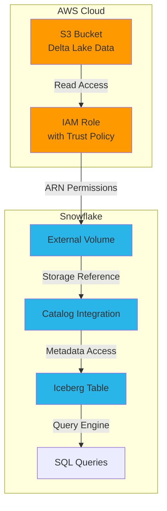
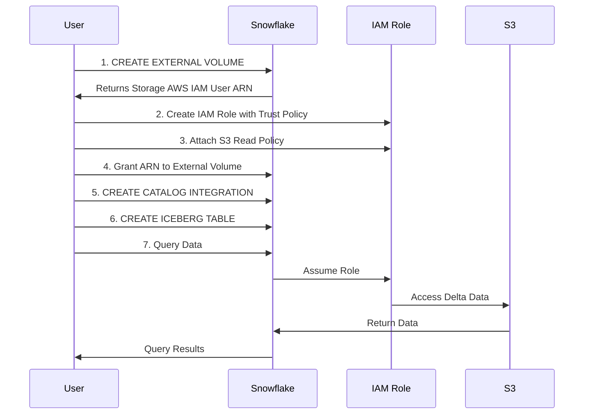
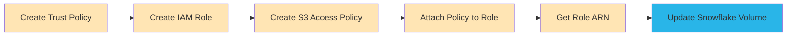
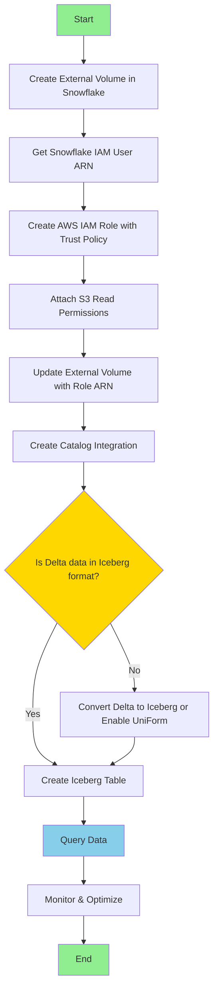

# Connecting S3 Delta Data to Snowflake using External Volumes & Iceberg Tables

## Table of Contents
1. [Overview](#overview)
2. [Architecture](#architecture)
3. [Prerequisites](#prerequisites)
4. [Step-by-Step Procedure](#step-by-step-procedure)
5. [IAM Configuration](#iam-configuration)
6. [Querying Delta Data](#querying-delta-data)
7. [Best Practices](#best-practices)
8. [Troubleshooting](#troubleshooting)
9. [Interview Questions](#interview-questions)

---

## Overview

### What is an External Volume?
An **External Volume** in Snowflake is a named object that references an external cloud storage location (S3, Azure Blob, GCS). It serves as an abstraction layer for accessing external data without copying it into Snowflake.

### What is Catalog Integration?
A **Catalog Integration** enables Snowflake to discover and manage external tables (like Iceberg) stored in external catalogs. It provides the authentication mechanism to access external data sources.

### Delta Lake to Iceberg
- **Delta Lake**: Open-source storage framework that provides ACID transactions on data lakes
- **Iceberg**: Table format that allows Snowflake to read external data
- Snowflake can read Delta Lake data through Iceberg table format using UniForm or conversion

---

## Architecture



### Data Flow Diagram



---

## Prerequisites

- Snowflake account with ACCOUNTADMIN privileges or appropriate grants
- AWS account with permissions to create IAM roles and policies
- S3 bucket with Delta Lake data
- Understanding of Snowflake External Tables and Iceberg format

**Required Privileges:**
```sql
-- Grant necessary privileges to your role
GRANT CREATE INTEGRATION ON ACCOUNT TO ROLE your_role;
GRANT CREATE EXTERNAL VOLUME ON ACCOUNT TO ROLE your_role;
GRANT CREATE TABLE ON SCHEMA your_schema TO ROLE your_role;
```

---

## Step-by-Step Procedure

### Step 1: Create External Volume in Snowflake

```sql
-- Use appropriate role
USE ROLE ACCOUNTADMIN;

-- Create or use a database
CREATE DATABASE IF NOT EXISTS delta_integration_db;
USE DATABASE delta_integration_db;

-- Create schema
CREATE SCHEMA IF NOT EXISTS external_data;
USE SCHEMA external_data;

-- Create External Volume
CREATE OR REPLACE EXTERNAL VOLUME s3_delta_volume
  STORAGE_LOCATIONS = (
    (
      NAME = 'my-s3-delta-location'
      STORAGE_PROVIDER = 'S3'
      STORAGE_BASE_URL = 's3://your-bucket-name/path/to/delta/data/'
      STORAGE_AWS_ROLE_ARN = 'arn:aws:iam::YOUR_AWS_ACCOUNT_ID:role/snowflake-s3-access-role'
      ENCRYPTION = (TYPE = 'AWS_SSE_S3')  -- or AWS_SSE_KMS for KMS encryption
    )
  );

-- Describe the external volume to get the Snowflake IAM User ARN
DESC EXTERNAL VOLUME s3_delta_volume;
```

**Important:** After running `DESC EXTERNAL VOLUME`, note down the following:
- `STORAGE_AWS_IAM_USER_ARN` - This is the Snowflake AWS user that needs access to your S3 bucket
- `STORAGE_AWS_EXTERNAL_ID` - External ID for trust policy

---

### Step 2: Create IAM Role in AWS

#### 2.1: Create Trust Policy JSON

Create a file named `trust-policy.json`:

```json
{
  "Version": "2012-10-17",
  "Statement": [
    {
      "Effect": "Allow",
      "Principal": {
        "AWS": "arn:aws:iam::SNOWFLAKE_ACCOUNT_ID:user/SNOWFLAKE_USER"
      },
      "Action": "sts:AssumeRole",
      "Condition": {
        "StringEquals": {
          "sts:ExternalId": "SNOWFLAKE_EXTERNAL_ID"
        }
      }
    }
  ]
}
```

Replace:
- `SNOWFLAKE_ACCOUNT_ID:user/SNOWFLAKE_USER` with the `STORAGE_AWS_IAM_USER_ARN` from Step 1
- `SNOWFLAKE_EXTERNAL_ID` with the external ID from Step 1

#### 2.2: Create IAM Role using AWS CLI

```bash
# Create the IAM role
aws iam create-role \
  --role-name snowflake-s3-access-role \
  --assume-role-policy-document file://trust-policy.json \
  --description "Role for Snowflake to access S3 Delta data"
```

#### 2.3: Create S3 Access Policy

Create a file named `s3-access-policy.json`:

```json
{
  "Version": "2012-10-17",
  "Statement": [
    {
      "Effect": "Allow",
      "Action": [
        "s3:GetObject",
        "s3:GetObjectVersion",
        "s3:ListBucket",
        "s3:GetBucketLocation"
      ],
      "Resource": [
        "arn:aws:s3:::your-bucket-name/*",
        "arn:aws:s3:::your-bucket-name"
      ]
    }
  ]
}
```

#### 2.4: Attach Policy to Role

```bash
# Create the policy
aws iam put-role-policy \
  --role-name snowflake-s3-access-role \
  --policy-name snowflake-s3-read-policy \
  --policy-document file://s3-access-policy.json

# Or attach an AWS managed policy
aws iam attach-role-policy \
  --role-name snowflake-s3-access-role \
  --policy-arn arn:aws:iam::aws:policy/AmazonS3ReadOnlyAccess
```

#### 2.5: Get Role ARN

```bash
# Get the role ARN (you'll need this for Snowflake)
aws iam get-role --role-name snowflake-s3-access-role --query 'Role.Arn' --output text
```

---

### Step 3: Update External Volume with IAM Role ARN

If you didn't include the ARN in Step 1, update the external volume:

```sql
-- Alter the external volume to update the IAM role ARN
ALTER EXTERNAL VOLUME s3_delta_volume
  SET STORAGE_LOCATIONS = (
    (
      NAME = 'my-s3-delta-location'
      STORAGE_PROVIDER = 'S3'
      STORAGE_BASE_URL = 's3://your-bucket-name/path/to/delta/data/'
      STORAGE_AWS_ROLE_ARN = 'arn:aws:iam::YOUR_AWS_ACCOUNT_ID:role/snowflake-s3-access-role'
      ENCRYPTION = (TYPE = 'AWS_SSE_S3')
    )
  );

-- Verify the configuration
DESC EXTERNAL VOLUME s3_delta_volume;
```

---

### Step 4: Create Catalog Integration

```sql
-- Create Catalog Integration for Iceberg
CREATE OR REPLACE CATALOG INTEGRATION delta_catalog_integration
  CATALOG_SOURCE = OBJECT_STORE
  TABLE_FORMAT = ICEBERG
  ENABLED = TRUE;

-- Grant usage on the catalog integration
GRANT USAGE ON INTEGRATION delta_catalog_integration TO ROLE your_role;

-- Verify catalog integration
DESC INTEGRATION delta_catalog_integration;
SHOW INTEGRATIONS;
```

**Note:** For Delta Lake data, you might need to convert Delta tables to Iceberg format or use Delta UniForm feature.

---

### Step 5: Create Iceberg Table

#### Option A: Create Iceberg Table from Existing Delta Metadata

```sql
-- Create Iceberg table pointing to Delta data
-- (Assumes Delta has been converted to Iceberg format or using UniForm)
CREATE OR REPLACE ICEBERG TABLE delta_customers
  EXTERNAL_VOLUME = 's3_delta_volume'
  CATALOG = 'delta_catalog_integration'
  METADATA_FILE_PATH = 'customers/metadata/v1.metadata.json';

-- Alternative: Specify base location
CREATE OR REPLACE ICEBERG TABLE delta_orders
  EXTERNAL_VOLUME = 's3_delta_volume'
  CATALOG = 'delta_catalog_integration'
  BASE_LOCATION = 'orders/';
```

#### Option B: Create Iceberg Table with Schema Definition

```sql
-- Create Iceberg table with explicit schema
CREATE OR REPLACE ICEBERG TABLE delta_products (
  product_id INT,
  product_name VARCHAR,
  category VARCHAR,
  price DECIMAL(10,2),
  created_at TIMESTAMP
)
  EXTERNAL_VOLUME = 's3_delta_volume'
  CATALOG = 'delta_catalog_integration'
  BASE_LOCATION = 'products/';
```

---

### Step 6: Query the Iceberg Table

```sql
-- Query the data
SELECT * FROM delta_customers LIMIT 10;

-- Verify table metadata
SHOW ICEBERG TABLES;

-- Get detailed table information
DESC ICEBERG TABLE delta_customers;

-- Check table metadata files
SELECT SYSTEM$GET_ICEBERG_TABLE_INFORMATION('delta_customers');

-- Query specific columns
SELECT 
  customer_id,
  customer_name,
  total_orders,
  created_date
FROM delta_customers
WHERE created_date >= '2024-01-01'
ORDER BY total_orders DESC;
```

---

## IAM Configuration

### Complete IAM Setup Diagram



### Required IAM Permissions Summary

| Action | Purpose | Required |
|--------|---------|----------|
| `s3:GetObject` | Read individual objects | Yes |
| `s3:GetObjectVersion` | Read specific versions | Yes |
| `s3:ListBucket` | List objects in bucket | Yes |
| `s3:GetBucketLocation` | Get bucket region | Yes |
| `s3:PutObject` | Write data (if needed) | No |
| `s3:DeleteObject` | Delete data (if needed) | No |

---

## Querying Delta Data

### Delta to Iceberg Conversion

**Important:** Snowflake reads Iceberg format, not Delta directly. You have two options:

#### Option 1: Use Delta UniForm
Enable UniForm on your Delta table to maintain Iceberg metadata:

```python
# In Databricks/PySpark
from delta.tables import DeltaTable

# Enable UniForm on existing Delta table
spark.sql("""
  ALTER TABLE delta.`s3://your-bucket/path/to/delta/`
  SET TBLPROPERTIES (
    'delta.universalFormat.enabledFormats' = 'iceberg'
  )
""")
```

#### Option 2: Convert Delta to Iceberg

```python
# Using Iceberg libraries to convert Delta to Iceberg
from pyspark.sql import SparkSession

spark = SparkSession.builder \
    .appName("Delta to Iceberg") \
    .getOrCreate()

# Read Delta table
delta_df = spark.read.format("delta").load("s3://bucket/delta-path/")

# Write as Iceberg
delta_df.write \
    .format("iceberg") \
    .mode("overwrite") \
    .save("s3://bucket/iceberg-path/")
```

### Query Patterns

```sql
-- Time travel queries (if Iceberg supports)
SELECT * FROM delta_customers 
FOR VERSION AS OF '2024-01-01 00:00:00';

-- Aggregation queries
SELECT 
  category,
  COUNT(*) as product_count,
  AVG(price) as avg_price,
  SUM(quantity) as total_quantity
FROM delta_products
GROUP BY category;

-- Join with Snowflake native tables
SELECT 
  d.customer_id,
  d.customer_name,
  s.order_total
FROM delta_customers d
JOIN snowflake_orders s ON d.customer_id = s.customer_id
WHERE s.order_date >= CURRENT_DATE - 30;

-- Complex filtering
SELECT * 
FROM delta_orders
WHERE order_status IN ('SHIPPED', 'DELIVERED')
  AND order_date BETWEEN '2024-01-01' AND '2024-12-31'
  AND total_amount > 1000;
```

---

## Best Practices

### 1. Security
- ✅ Use least privilege principle for IAM roles
- ✅ Enable S3 bucket versioning for data protection
- ✅ Use AWS KMS encryption for sensitive data
- ✅ Rotate IAM credentials regularly
- ✅ Enable CloudTrail logging for audit

```sql
-- Example: External volume with KMS encryption
CREATE EXTERNAL VOLUME s3_delta_volume_encrypted
  STORAGE_LOCATIONS = (
    (
      NAME = 'encrypted-location'
      STORAGE_PROVIDER = 'S3'
      STORAGE_BASE_URL = 's3://your-bucket/encrypted-data/'
      STORAGE_AWS_ROLE_ARN = 'arn:aws:iam::ACCOUNT:role/snowflake-role'
      ENCRYPTION = (
        TYPE = 'AWS_SSE_KMS'
        KMS_KEY_ID = 'arn:aws:kms:us-east-1:ACCOUNT:key/KEY_ID'
      )
    )
  );
```

### 2. Performance
- ✅ Partition your Delta data appropriately
- ✅ Use columnar formats (Parquet) for better compression
- ✅ Create clustering keys on frequently queried columns
- ✅ Monitor query performance and optimize

```sql
-- Create clustered Iceberg table
CREATE ICEBERG TABLE delta_sales (
  sale_id INT,
  customer_id INT,
  sale_date DATE,
  amount DECIMAL(10,2)
)
  CLUSTER BY (sale_date, customer_id)
  EXTERNAL_VOLUME = 's3_delta_volume'
  CATALOG = 'delta_catalog_integration'
  BASE_LOCATION = 'sales/';
```

### 3. Cost Optimization
- ✅ Use S3 lifecycle policies to archive old data
- ✅ Enable S3 Intelligent-Tiering
- ✅ Monitor data transfer costs between AWS regions
- ✅ Cache frequently accessed data

### 4. Monitoring & Maintenance

```sql
-- Monitor external table queries
SELECT 
  query_id,
  query_text,
  total_elapsed_time,
  bytes_scanned,
  rows_produced
FROM SNOWFLAKE.ACCOUNT_USAGE.QUERY_HISTORY
WHERE query_text ILIKE '%delta_customers%'
  AND start_time >= DATEADD(day, -7, CURRENT_TIMESTAMP())
ORDER BY start_time DESC;

-- Check external volume usage
SHOW EXTERNAL VOLUMES;
DESC EXTERNAL VOLUME s3_delta_volume;

-- Refresh metadata (if needed)
ALTER ICEBERG TABLE delta_customers REFRESH;
```

---

## Troubleshooting

### Common Issues and Solutions

| Issue | Possible Cause | Solution |
|-------|---------------|----------|
| "Access Denied" error | IAM role not configured correctly | Verify trust policy and S3 permissions |
| "Metadata file not found" | Incorrect path or missing Iceberg metadata | Check BASE_LOCATION and ensure Iceberg format |
| "External ID mismatch" | Wrong external ID in trust policy | Get correct external ID from DESC EXTERNAL VOLUME |
| "No data returned" | Wrong file path or partition | Verify S3 path and partition structure |
| "Slow queries" | No partitioning or clustering | Add clustering keys and partition data |

### Debugging Queries

```sql
-- Check external volume configuration
SELECT SYSTEM$GET_EXTERNAL_VOLUME_INFO('s3_delta_volume');

-- Verify catalog integration
SELECT SYSTEM$GET_CATALOG_INTEGRATION_INFO('delta_catalog_integration');

-- List files in external volume
LIST @s3_delta_volume/my-s3-delta-location/;

-- Test IAM role access
SELECT SYSTEM$VERIFY_EXTERNAL_VOLUME('s3_delta_volume');

-- View error logs
SELECT * 
FROM TABLE(INFORMATION_SCHEMA.TASK_HISTORY())
WHERE STATE = 'FAILED'
ORDER BY COMPLETED_TIME DESC;
```

### AWS CLI Troubleshooting

```bash
# Test S3 access with assumed role
aws sts assume-role \
  --role-arn arn:aws:iam::ACCOUNT:role/snowflake-s3-access-role \
  --role-session-name test-session

# List S3 bucket contents
aws s3 ls s3://your-bucket-name/path/to/delta/data/ --recursive

# Check IAM role policy
aws iam get-role-policy \
  --role-name snowflake-s3-access-role \
  --policy-name snowflake-s3-read-policy

# Validate trust policy
aws iam get-role \
  --role-name snowflake-s3-access-role \
  --query 'Role.AssumeRolePolicyDocument'
```

---

## Interview Questions

### Basic Level

1. **What is an External Volume in Snowflake?**
   - **Answer:** An External Volume is a named Snowflake object that references external cloud storage (S3, Azure, GCS). It acts as an abstraction layer for accessing data stored outside Snowflake without copying it into Snowflake tables.

2. **What is the difference between Delta Lake and Iceberg?**
   - **Answer:** 
     - **Delta Lake:** Open table format developed by Databricks, provides ACID transactions, time travel, and schema evolution
     - **Iceberg:** Open table format by Apache, designed for huge analytic datasets, supports schema evolution, partition evolution, and hidden partitioning
     - Snowflake natively supports Iceberg but requires conversion for Delta

3. **Why do we need a Catalog Integration?**
   - **Answer:** Catalog Integration enables Snowflake to discover and manage external tables. It provides authentication and authorization to access external catalogs and metadata stores.

4. **What IAM permissions are required for Snowflake to access S3?**
   - **Answer:** Minimum permissions: `s3:GetObject`, `s3:GetObjectVersion`, `s3:ListBucket`, `s3:GetBucketLocation`

### Intermediate Level

5. **Explain the trust relationship between Snowflake and AWS IAM.**
   - **Answer:** The trust relationship is established through an IAM trust policy that allows Snowflake's AWS IAM user (obtained from DESC EXTERNAL VOLUME) to assume an IAM role in your AWS account. The external ID acts as an additional security layer to prevent confused deputy attacks.

6. **Can Snowflake directly read Delta Lake format?**
   - **Answer:** No, Snowflake cannot directly read Delta Lake format. You need to either:
     - Enable Delta UniForm to maintain Iceberg metadata alongside Delta
     - Convert Delta tables to Iceberg format
     - Use a connector or integration tool

7. **What happens when you run ALTER ICEBERG TABLE REFRESH?**
   - **Answer:** It refreshes the table's metadata from the external catalog, syncing any changes made to the underlying data files or schema in the external storage.

8. **How do you handle schema evolution in external Iceberg tables?**
   - **Answer:** Iceberg supports schema evolution (add, drop, rename columns). After schema changes in the source, refresh the Snowflake Iceberg table using `ALTER ICEBERG TABLE REFRESH` to sync the changes.

### Advanced Level

9. **What are the performance implications of querying external Iceberg tables vs native Snowflake tables?**
   - **Answer:**
     - **External tables:** No data stored in Snowflake, queries require S3 reads, potential network latency, no automatic optimization
     - **Native tables:** Data cached in Snowflake, optimized storage, clustering, better query performance
     - **Tradeoff:** External tables save storage costs but may have slower query performance
     - **Solution:** Use external tables for exploratory queries, materialize frequently accessed data

10. **How would you implement incremental data loading from Delta to Snowflake?**
    - **Answer:**
      - **Option 1:** Use Delta UniForm with Iceberg, Snowflake reads latest metadata automatically
      - **Option 2:** Use COPY INTO with file notifications or Snowpipe
      - **Option 3:** Query external Iceberg table, insert into Snowflake table with time-based filtering
      - **Option 4:** Use Streams and Tasks for CDC pattern
      
    ```sql
    -- Example incremental load
    INSERT INTO snowflake_target_table
    SELECT * FROM delta_iceberg_table
    WHERE updated_at > (SELECT MAX(updated_at) FROM snowflake_target_table);
    ```

11. **Explain the security considerations when using External Volumes.**
    - **Answer:**
      - **IAM Security:** Principle of least privilege, use external IDs, restrict cross-account access
      - **Encryption:** Use SSE-S3 or SSE-KMS for data at rest
      - **Network:** Use VPC endpoints for private connectivity
      - **Audit:** Enable CloudTrail and Snowflake query history
      - **Access Control:** Use Snowflake RBAC to control who can query external data
      - **Data Masking:** Apply masking policies on external tables for PII

12. **How do you optimize costs when using external Iceberg tables?**
    - **Answer:**
      - Use S3 lifecycle policies to transition old data to cheaper storage classes
      - Implement partition pruning to reduce data scanned
      - Cache frequently accessed data in materialized views
      - Monitor S3 request costs and optimize query patterns
      - Use result caching in Snowflake
      - Consider data transfer costs across regions

13. **What is the difference between BASE_LOCATION and METADATA_FILE_PATH?**
    - **Answer:**
      - **BASE_LOCATION:** Points to the root directory containing Iceberg table data and metadata, Snowflake discovers metadata automatically
      - **METADATA_FILE_PATH:** Points to a specific Iceberg metadata JSON file, useful for version pinning or specific snapshots
      - Use BASE_LOCATION for dynamic tables, METADATA_FILE_PATH for point-in-time snapshots

14. **How would you migrate from a native Snowflake table to an external Iceberg table?**
    - **Answer:**
      ```sql
      -- Step 1: Unload Snowflake data to S3 in Parquet format
      COPY INTO @s3_stage/iceberg_data/
      FROM snowflake_table
      FILE_FORMAT = (TYPE = PARQUET)
      HEADER = TRUE;
      
      -- Step 2: Create Iceberg metadata using external tools (Spark/etc)
      
      -- Step 3: Create external Iceberg table in Snowflake
      CREATE ICEBERG TABLE external_table
        EXTERNAL_VOLUME = 's3_volume'
        CATALOG = 'catalog_integration'
        BASE_LOCATION = 'iceberg_data/';
      
      -- Step 4: Validate data and drop old table
      -- Step 5: Create view with original name for backward compatibility
      CREATE VIEW snowflake_table AS SELECT * FROM external_table;
      ```

15. **Explain how Snowflake handles concurrent reads/writes on external Iceberg tables.**
    - **Answer:**
      - **Reads:** Multiple concurrent reads are supported through Iceberg's snapshot isolation
      - **Writes:** Snowflake supports INSERT/UPDATE/DELETE on Iceberg tables, uses optimistic concurrency control
      - **Conflict Resolution:** Iceberg uses manifest files and snapshot commits for ACID guarantees
      - **Limitations:** Write operations may have higher latency compared to native tables
      - **Best Practice:** Use Snowflake tasks for scheduled writes, avoid concurrent writes from multiple sources

---

## Additional Resources

### Snowflake Documentation
- [External Volumes](https://docs.snowflake.com/en/user-guide/tables-external-intro)
- [Iceberg Tables](https://docs.snowflake.com/en/user-guide/tables-iceberg)
- [Catalog Integrations](https://docs.snowflake.com/en/sql-reference/sql/create-catalog-integration)

### Delta Lake Resources
- [Delta UniForm](https://docs.delta.io/latest/delta-uniform.html)
- [Delta to Iceberg Conversion](https://delta.io/blog/delta-lake-to-apache-iceberg/)

### AWS Documentation
- [IAM Roles for Cross-Account Access](https://docs.aws.amazon.com/IAM/latest/UserGuide/tutorial_cross-account-with-roles.html)
- [S3 Bucket Policies](https://docs.aws.amazon.com/AmazonS3/latest/userguide/bucket-policies.html)

---

## Summary Workflow



---

## Quick Reference Commands

```sql
-- 1. Create External Volume
CREATE EXTERNAL VOLUME s3_delta_volume
  STORAGE_LOCATIONS = (
    (NAME = 'loc1', STORAGE_PROVIDER = 'S3',
     STORAGE_BASE_URL = 's3://bucket/path/',
     STORAGE_AWS_ROLE_ARN = 'arn:aws:iam::ACCOUNT:role/ROLE')
  );

-- 2. Describe to get Snowflake ARN
DESC EXTERNAL VOLUME s3_delta_volume;

-- 3. Create Catalog Integration
CREATE CATALOG INTEGRATION delta_catalog
  CATALOG_SOURCE = OBJECT_STORE
  TABLE_FORMAT = ICEBERG
  ENABLED = TRUE;

-- 4. Create Iceberg Table
CREATE ICEBERG TABLE my_table
  EXTERNAL_VOLUME = 's3_delta_volume'
  CATALOG = 'delta_catalog'
  BASE_LOCATION = 'table_path/';

-- 5. Query
SELECT * FROM my_table;

-- 6. Refresh metadata
ALTER ICEBERG TABLE my_table REFRESH;
```

---

**Last Updated:** May 2026  
**Version:** 1.0
