# Apache Spark — Comprehensive Notes

> **Last Updated:** April 2026  
> **Scope:** Fundamentals, Architecture, Internals, Optimization, Debugging, Interview Q&A

---

## 📑 Index

1. [What is Apache Spark?](#1-what-is-apache-spark)
2. [Spark vs Hadoop MapReduce](#2-spark-vs-hadoop-mapreduce)
3. [Spark Architecture](#3-spark-architecture)
   - 3.1 [Cluster Manager](#31-cluster-manager)
   - 3.2 [Driver Program](#32-driver-program)
   - 3.3 [Executors](#33-executors)
   - 3.4 [SparkContext & SparkSession](#34-sparkcontext--sparksession)
4. [Spark Execution Model](#4-spark-execution-model)
   - 4.1 [Jobs, Stages, Tasks](#41-jobs-stages-tasks)
   - 4.2 [DAG Scheduler](#42-dag-scheduler)
   - 4.3 [Task Scheduler](#43-task-scheduler)
5. [Core Abstractions](#5-core-abstractions)
   - 5.1 [RDD (Resilient Distributed Dataset)](#51-rdd-resilient-distributed-dataset)
   - 5.2 [DataFrame](#52-dataframe)
   - 5.3 [Dataset](#53-dataset)
   - 5.4 [RDD vs DataFrame vs Dataset](#54-rdd-vs-dataframe-vs-dataset)
6. [Transformations & Actions](#6-transformations--actions)
   - 6.1 [Narrow vs Wide Transformations](#61-narrow-vs-wide-transformations)
   - 6.2 [Lazy Evaluation](#62-lazy-evaluation)
   - 6.3 [Common Transformations](#63-common-transformations)
   - 6.4 [Common Actions](#64-common-actions)
7. [Partitioning](#7-partitioning)
   - 7.1 [Default Partitioning](#71-default-partitioning)
   - 7.2 [Custom Partitioning](#72-custom-partitioning)
   - 7.3 [Partition Skew](#73-partition-skew)
8. [Shuffle & Spill](#8-shuffle--spill)
9. [Caching & Persistence](#9-caching--persistence)
10. [Spark SQL & Catalyst Optimizer](#10-spark-sql--catalyst-optimizer)
    - 10.1 [Catalyst Optimizer Pipeline](#101-catalyst-optimizer-pipeline)
    - 10.2 [Tungsten Execution Engine](#102-tungsten-execution-engine)
    - 10.3 [Adaptive Query Execution (AQE)](#103-adaptive-query-execution-aqe)
11. [Joins in Spark](#11-joins-in-spark)
    - 11.1 [Broadcast Hash Join](#111-broadcast-hash-join)
    - 11.2 [Sort Merge Join](#112-sort-merge-join)
    - 11.3 [Shuffle Hash Join](#113-shuffle-hash-join)
    - 11.4 [Choosing the Right Join](#114-choosing-the-right-join)
12. [Spark Memory Management](#12-spark-memory-management)
    - 12.1 [Unified Memory Model](#121-unified-memory-model)
    - 12.2 [Off-Heap Memory](#122-off-heap-memory)
13. [Fault Tolerance](#13-fault-tolerance)
14. [Spark Structured Streaming](#14-spark-structured-streaming)
15. [Optimization Techniques](#15-optimization-techniques)
    - 15.1 [Partitioning Strategies](#151-partitioning-strategies)
    - 15.2 [Broadcast Variables](#152-broadcast-variables)
    - 15.3 [Accumulators](#153-accumulators)
    - 15.4 [Avoiding Data Skew](#154-avoiding-data-skew)
    - 15.5 [Predicate Pushdown & Column Pruning](#155-predicate-pushdown--column-pruning)
    - 15.6 [Serialization](#156-serialization)
    - 15.7 [Tuning Configurations](#157-tuning-configurations)
16. [Debugging Spark Applications](#16-debugging-spark-applications)
    - 16.1 [Spark UI](#161-spark-ui)
    - 16.2 [Reading Execution Plans](#162-reading-execution-plans)
    - 16.3 [Common Errors & Fixes](#163-common-errors--fixes)
    - 16.4 [Logging](#164-logging)
17. [Interview Questions](#17-interview-questions)
    - 17.1 [Beginner](#171-beginner)
    - 17.2 [Intermediate](#172-intermediate)
    - 17.3 [Advanced](#173-advanced)
18. [Scenario-Based Interview Questions](#18-scenario-based-interview-questions)
    - 18.1 [Performance & Optimization Scenarios](#181-performance--optimization-scenarios)
    - 18.2 [Data Engineering Design Scenarios](#182-data-engineering-design-scenarios)
    - 18.3 [Fault Tolerance & Reliability Scenarios](#183-fault-tolerance--reliability-scenarios)
    - 18.4 [Architecture & Design Scenarios](#184-architecture--design-scenarios)
    - 18.5 [Scenario Quick-Fire Round](#185-scenario-quick-fire-round)

---

## 1. What is Apache Spark?

Apache Spark is an **open-source, distributed, in-memory data processing framework** designed for large-scale data analytics. It was originally developed at UC Berkeley's AMPLab in 2009 and donated to the Apache Software Foundation in 2013.

**Key characteristics:**
- **In-memory processing** — data is kept in RAM across the cluster, enabling up to 100× faster analytics than Hadoop MapReduce.
- **Unified engine** — supports batch processing, streaming, machine learning, and graph processing within a single framework.
- **Lazy evaluation** — transformations are not executed until an action is triggered, allowing the optimizer to build an efficient execution plan.
- **Fault tolerance** — automatically recovers lost partitions using lineage graphs (DAG).
- **Polyglot** — APIs available in Scala (native), Python (PySpark), Java, R, and SQL.

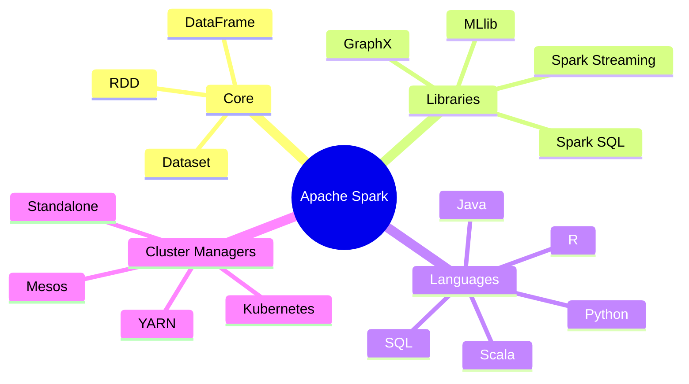

---

## 2. Spark vs Hadoop MapReduce

| Feature | Apache Spark | Hadoop MapReduce |
|---|---|---|
| Processing Speed | Up to 100× faster (in-memory) | Slow (disk I/O between each step) |
| Ease of Use | High-level APIs, SQL | Low-level, verbose Java code |
| Data Processing | Batch + Streaming + ML | Batch only |
| Fault Tolerance | Lineage (DAG) | Replication on HDFS |
| Language Support | Scala, Python, Java, R, SQL | Primarily Java |
| Intermediate Results | Stored in memory | Written to disk (HDFS) |
| Iterative Algorithms | Excellent (ML, Graph) | Poor (repeated disk reads) |
| Real-time Processing | Yes (Structured Streaming) | No |
| Resource Management | YARN / K8s / Standalone | YARN / Mesos |

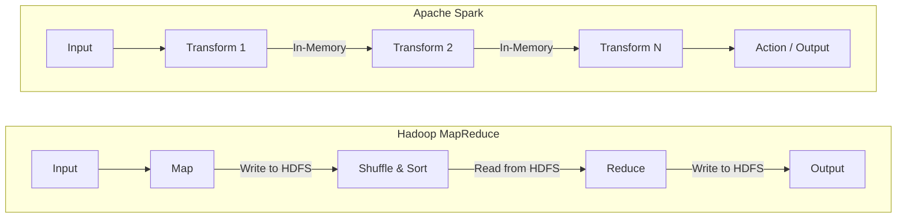

---

## 3. Spark Architecture

Spark follows a **master-worker architecture** with the concept of a Driver and multiple Executors coordinated through a Cluster Manager.

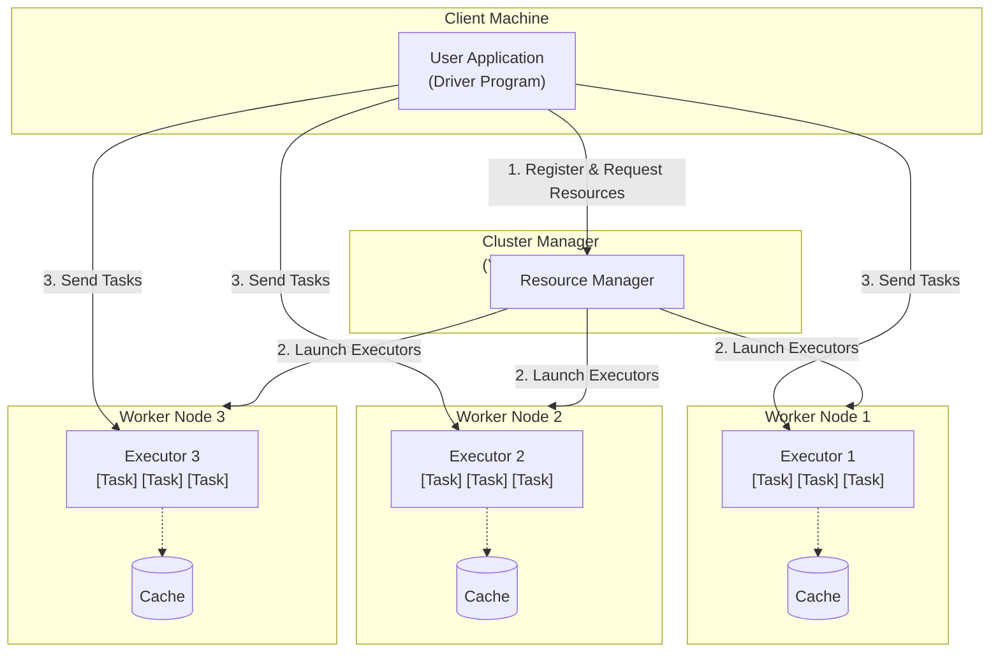

### 3.1 Cluster Manager

The Cluster Manager is responsible for **resource allocation** across the cluster. Spark supports:

- **Standalone** — Spark's own built-in cluster manager, simple to set up.
- **Apache YARN** — Hadoop's resource manager; widely used in enterprise.
- **Apache Mesos** — General-purpose cluster manager.
- **Kubernetes** — Cloud-native container orchestration; growing adoption.

### 3.2 Driver Program

The Driver is the JVM process that runs the **main()** function of the application. It is responsible for:

1. Creating the `SparkSession` / `SparkContext`.
2. Converting user code into a **DAG of tasks**.
3. Coordinating with the Cluster Manager for resources.
4. Scheduling tasks on Executors.
5. Collecting results back from Executors.

> **Important:** The Driver is a single point of failure. If it crashes, the entire application fails (though YARN HA and Kubernetes restart policies can mitigate this).

### 3.3 Executors

Executors are JVM processes launched on Worker nodes. Each Executor:
- Runs **tasks** assigned by the Driver.
- Stores data in **memory or disk** for caching.
- Reports task status back to the Driver.
- Stays alive for the entire application lifecycle (unlike MapReduce containers that die after each task).

**Key configs:**
```
spark.executor.instances    → number of executors
spark.executor.cores        → vCPUs per executor (tasks per executor)
spark.executor.memory       → heap memory per executor
```

### 3.4 SparkContext & SparkSession

| | SparkContext | SparkSession |
|---|---|---|
| Introduced | Spark 1.x | Spark 2.0+ |
| Purpose | Entry point for RDD API | Unified entry point for all APIs |
| Creates | RDDs | DataFrames, Datasets, SQL |
| Encapsulates | — | SparkContext, SQLContext, HiveContext |
| Current Usage | Low-level / legacy | **Preferred in modern Spark** |

```python
from pyspark.sql import SparkSession

spark = SparkSession.builder \
    .appName("MyApp") \
    .config("spark.executor.memory", "4g") \
    .config("spark.executor.cores", "2") \
    .getOrCreate()

# Access SparkContext via SparkSession
sc = spark.sparkContext
```

---

## 4. Spark Execution Model

### 4.1 Jobs, Stages, Tasks

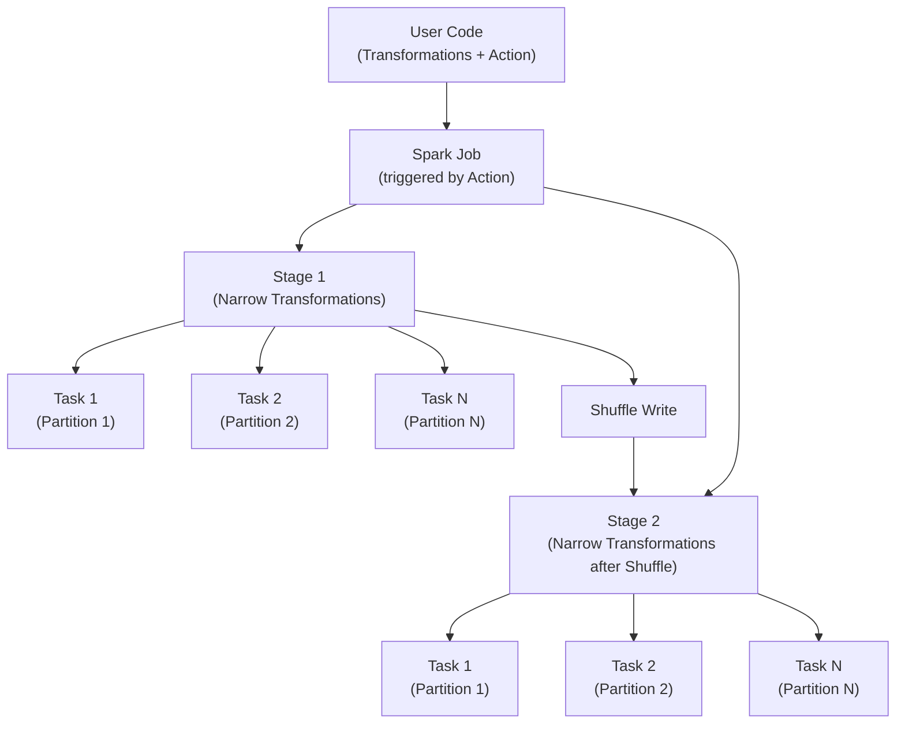

| Concept | Description |
|---|---|
| **Job** | A computation triggered by a Spark **action** (e.g., `count()`, `collect()`). One application can have many jobs. |
| **Stage** | A set of tasks that can run in parallel **without a shuffle**. Stage boundaries are created by wide transformations (shuffles). |
| **Task** | The smallest unit of execution. One task processes **one partition** of data. Tasks within a stage execute in parallel. |

**Example:**
```python
df = spark.read.parquet("s3://bucket/data/")   # No execution yet
df2 = df.filter(df.age > 25)                   # Narrow transform — no shuffle
df3 = df2.groupBy("city").count()              # Wide transform — creates shuffle boundary
df3.show()                                     # Action → triggers Job → 2 Stages
```

### 4.2 DAG Scheduler

The **DAG (Directed Acyclic Graph) Scheduler** converts the logical execution plan (RDD lineage) into a physical execution plan made of stages.

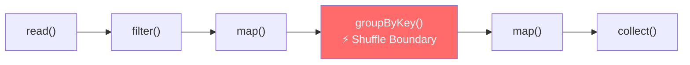

- Nodes = RDDs / DataFrames
- Edges = Transformations
- Cuts on shuffle boundaries = Stage splits

### 4.3 Task Scheduler

The **Task Scheduler** receives the set of stages from the DAG Scheduler and schedules individual tasks on Executors using **data locality** preferences:

| Locality Level | Meaning |
|---|---|
| `PROCESS_LOCAL` | Data is in the same JVM (best) |
| `NODE_LOCAL` | Data is on the same node but different process |
| `RACK_LOCAL` | Data is on the same rack |
| `ANY` | Data is on a remote node (worst) |

---

## 5. Core Abstractions

### 5.1 RDD (Resilient Distributed Dataset)

An RDD is the **fundamental, immutable, distributed data structure** in Spark. It represents a collection of elements partitioned across cluster nodes that can be operated on in parallel.

**Five key properties of an RDD:**
1. **List of partitions** — data split into chunks distributed across nodes.
2. **Compute function** — function to compute each partition.
3. **List of dependencies** — lineage (parent RDDs).
4. **Partitioner** (optional) — for key-value RDDs (hash or range).
5. **Preferred locations** (optional) — data locality hints.

```python
# Creating RDDs
sc = spark.sparkContext

# From collection
rdd = sc.parallelize([1, 2, 3, 4, 5], numSlices=3)

# From file
rdd = sc.textFile("hdfs://path/to/file.txt")

# From another RDD
rdd2 = rdd.map(lambda x: x * 2)

# RDD operations
print(rdd.getNumPartitions())   # 3
print(rdd.collect())            # [1, 2, 3, 4, 5]
```

**RDD Lineage (Fault Tolerance):**
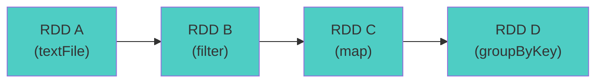
If partition of RDD C is lost, Spark recomputes it from RDD B (and recursively from A if needed) — no data replication required.

### 5.2 DataFrame

A DataFrame is a **distributed collection of data organized into named columns**, similar to a relational table or Pandas DataFrame. It is built on top of RDDs and provides:
- **Schema** — typed columns with data types.
- **Catalyst optimizer** — automatic query optimization.
- **Tungsten engine** — optimized in-memory binary format.

```python
# Creating DataFrames
from pyspark.sql.types import StructType, StructField, StringType, IntegerType

schema = StructType([
    StructField("name", StringType(), nullable=False),
    StructField("age",  IntegerType(), nullable=True),
    StructField("city", StringType(), nullable=True)
])

data = [("Alice", 30, "NYC"), ("Bob", 25, "LA"), ("Charlie", 35, "Chicago")]
df = spark.createDataFrame(data, schema=schema)

# Reading from files
df = spark.read \
    .option("header", "true") \
    .option("inferSchema", "true") \
    .csv("s3://bucket/employees.csv")

df.printSchema()
df.show(5)
df.describe().show()
```

### 5.3 Dataset

A Dataset is a **typed, object-oriented API** available in Scala and Java (not Python/R). It combines the benefits of RDDs (type safety, lambda functions) and DataFrames (optimized execution).

```scala
// Scala example
case class Employee(name: String, age: Int, city: String)

val ds: Dataset[Employee] = spark.read
  .option("header", "true")
  .csv("employees.csv")
  .as[Employee]

ds.filter(_.age > 25).show()
```

> **In PySpark:** DataFrame ≡ Dataset[Row]. Python's dynamic typing makes Datasets unnecessary.

### 5.4 RDD vs DataFrame vs Dataset

| Feature | RDD | DataFrame | Dataset |
|---|---|---|---|
| Type Safety | Yes (compile-time) | No (runtime) | Yes (compile-time) |
| Schema | No | Yes | Yes |
| Optimization | No Catalyst | Catalyst + Tungsten | Catalyst + Tungsten |
| Serialization | Java serialization (slow) | Tungsten binary (fast) | Tungsten binary (fast) |
| Performance | Lower | Higher | Higher |
| API Style | Functional | Declarative / SQL | OOP + Functional |
| Language Support | Scala, Java, Python, R | All | Scala, Java only |
| Use Case | Fine-grained control | ETL, Analytics, SQL | Type-safe transformations |
| When to Use | Custom partitioning, unstructured data | Most use cases | Scala/Java typed pipelines |

---

## 6. Transformations & Actions

### 6.1 Narrow vs Wide Transformations

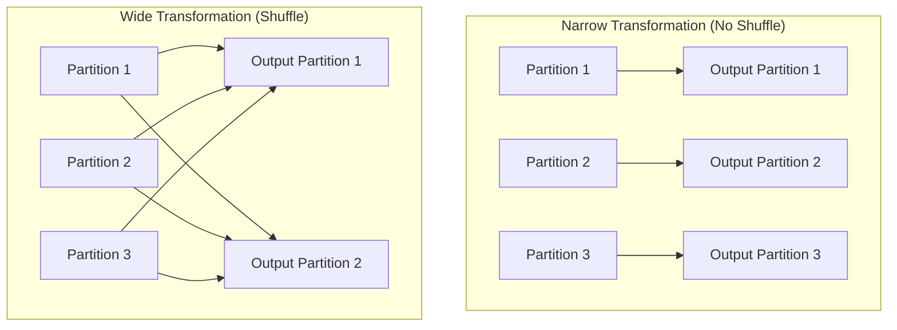

| Type | Description | Examples | Shuffle? |
|---|---|---|---|
| **Narrow** | Each output partition depends on **at most one** input partition | `map`, `filter`, `flatMap`, `union`, `sample` | No |
| **Wide** | Each output partition depends on **multiple** input partitions | `groupByKey`, `reduceByKey`, `join`, `distinct`, `repartition`, `sortBy` | **Yes** |

> Wide transformations create **stage boundaries** and involve expensive **shuffle operations**.

### 6.2 Lazy Evaluation

Spark does NOT execute transformations immediately. Instead it builds a **computation plan (DAG)** and only executes when an **action** is called.

**Benefits:**
- Allows Catalyst to optimize the whole pipeline end-to-end.
- Avoids unnecessary intermediate computations.
- Enables pipelining of narrow transformations without materializing intermediate results.

```python
# Nothing executes here:
df = spark.read.parquet("s3://data/")
df2 = df.filter(df.country == "US")
df3 = df2.select("name", "salary")
df4 = df3.withColumn("salary_usd", df3.salary * 1.0)

# Execution begins here:
df4.show()    # <-- Action triggers entire pipeline
```

### 6.3 Common Transformations

**DataFrame Transformations:**
```python
from pyspark.sql import functions as F

df = spark.read.parquet("s3://sales/")

# Filtering
df.filter(F.col("amount") > 1000)
df.where("status = 'ACTIVE'")

# Selecting / Projecting
df.select("id", "name", "amount")
df.selectExpr("id", "amount * 1.1 as amount_with_tax")

# Adding / Modifying Columns
df.withColumn("tax", F.col("amount") * 0.1)
df.withColumnRenamed("amount", "sale_amount")

# Dropping columns
df.drop("unnecessary_col")

# Aggregations
df.groupBy("region").agg(
    F.sum("amount").alias("total_sales"),
    F.avg("amount").alias("avg_sales"),
    F.count("*").alias("num_orders"),
    F.max("amount").alias("max_sale")
)

# Sorting
df.orderBy(F.col("amount").desc())
df.sort("region", F.col("amount").desc())

# Joins
df.join(df2, on="customer_id", how="left")
df.join(df2, df["id"] == df2["customer_id"], "inner")

# Window Functions
from pyspark.sql.window import Window
w = Window.partitionBy("region").orderBy(F.col("amount").desc())
df.withColumn("rank", F.rank().over(w))
df.withColumn("running_total", F.sum("amount").over(w.rowsBetween(Window.unboundedPreceding, 0)))

# Union
df1.union(df2)           # requires same schema
df1.unionByName(df2)     # matches by column name, not position

# Deduplication
df.distinct()
df.dropDuplicates(["customer_id", "product_id"])

# Null handling
df.na.drop()                         # drop rows with any null
df.na.fill({"age": 0, "name": "Unknown"})  # fill specific columns
df.na.replace(["N/A", "None"], None)

# String operations
df.withColumn("upper_name", F.upper(F.col("name")))
df.withColumn("trimmed", F.trim(F.col("name")))
df.filter(F.col("email").rlike(r"^[a-zA-Z0-9._%+\-]+@[a-zA-Z0-9.\-]+\.[a-zA-Z]{2,}$"))

# Date operations
df.withColumn("year", F.year(F.col("event_date")))
df.withColumn("date_diff", F.datediff(F.col("end_date"), F.col("start_date")))
df.withColumn("next_month", F.add_months(F.col("start_date"), 1))

# Pivoting
df.groupBy("region").pivot("year").sum("amount")

# Explode arrays
df.withColumn("tag", F.explode(F.col("tags")))

# UDFs (use sparingly)
from pyspark.sql.functions import udf
from pyspark.sql.types import StringType

@udf(returnType=StringType())
def categorize(amount):
    if amount > 10000: return "HIGH"
    elif amount > 1000: return "MEDIUM"
    return "LOW"

df.withColumn("category", categorize(F.col("amount")))
```

**RDD Transformations:**
```python
rdd = sc.parallelize(range(1, 11), 4)

rdd.map(lambda x: x * 2)
rdd.flatMap(lambda x: [x, x * 2])
rdd.filter(lambda x: x % 2 == 0)
rdd.mapPartitions(lambda it: (x * 2 for x in it))  # more efficient than map
rdd.mapPartitionsWithIndex(lambda idx, it: ((idx, x) for x in it))
rdd.sample(withReplacement=False, fraction=0.5)
rdd.union(rdd2)
rdd.intersection(rdd2)   # shuffle
rdd.distinct()            # shuffle
rdd.coalesce(2)           # reduce partitions (no full shuffle)
rdd.repartition(8)        # increase/decrease (full shuffle)

# Key-Value RDD
kv = rdd.map(lambda x: (x % 3, x))
kv.groupByKey()           # shuffle — avoid if possible
kv.reduceByKey(lambda a, b: a + b)   # more efficient
kv.aggregateByKey(0, lambda acc, v: acc + v, lambda a, b: a + b)
kv.combineByKey(lambda v: [v], lambda acc, v: acc + [v], lambda a, b: a + b)
kv.sortByKey(ascending=False)
kv.join(kv2)              # inner join
kv.leftOuterJoin(kv2)
kv.cogroup(kv2)
```

### 6.4 Common Actions

```python
# DataFrame Actions
df.show(n=20, truncate=False)
df.collect()               # Returns all rows to Driver — use carefully!
df.take(10)                # First 10 rows
df.first()                 # First row
df.count()                 # Number of rows
df.describe("salary").show()
df.summary().show()
df.toPandas()              # Collect to Pandas — use carefully!

# Write actions
df.write.parquet("s3://output/", mode="overwrite")
df.write.mode("append").partitionBy("year", "month").parquet("s3://output/")
df.coalesce(1).write.csv("s3://output/single_file/", header=True)

# RDD Actions
rdd.collect()
rdd.count()
rdd.first()
rdd.take(5)
rdd.top(5)
rdd.reduce(lambda a, b: a + b)
rdd.fold(0, lambda a, b: a + b)
rdd.aggregate(0, lambda acc, v: acc + v, lambda a, b: a + b)
rdd.foreach(lambda x: print(x))      # runs on executors
rdd.foreachPartition(lambda it: ...)  # runs once per partition
rdd.countByKey()
rdd.collectAsMap()
rdd.saveAsTextFile("hdfs://output/")
```

---

## 7. Partitioning

### 7.1 Default Partitioning

| Source | Default Partitions |
|---|---|
| `sc.parallelize(data)` | `sc.defaultParallelism` (usually 2× num cores) |
| HDFS / S3 file | One partition per HDFS block (128 MB) |
| After shuffle | `spark.sql.shuffle.partitions` (default: **200**) |
| `spark.read.*` | Based on file size / number of files |

```python
# Check partitions
df.rdd.getNumPartitions()

# Tune shuffle partitions (critical config!)
spark.conf.set("spark.sql.shuffle.partitions", "50")   # for small data
# or
spark.conf.set("spark.sql.shuffle.partitions", "2000") # for large data
```

### 7.2 Custom Partitioning

```python
# DataFrame
df.repartition(100)                          # random shuffle into 100 partitions
df.repartition(100, F.col("country"))        # hash partition by country
df.coalesce(10)                              # reduce partitions without full shuffle

# RDD with custom partitioner
from pyspark import HashPartitioner, RangePartitioner

kv_rdd = rdd.map(lambda x: (x % 5, x))
kv_rdd.partitionBy(5, HashPartitioner(5))    # hash partition by key
```

**Rule of thumb for partition count:**
$$\text{Partitions} = \frac{\text{Total Data Size}}{\text{Target Partition Size (128-256 MB)}}$$

Also: aim for **2-4 tasks per CPU core** in the cluster.

### 7.3 Partition Skew

**Data skew** occurs when some partitions have significantly more data than others, causing some tasks to take much longer.

```mermaid
gantt
    title Task Duration with Skewed Data
    dateFormat X
    axisFormat %s

    section Executor 1
    Task 1 (small partition) : 0, 5
    section Executor 2
    Task 2 (small partition) : 0, 6
    section Executor 3
    Task 3 (HUGE partition)  : 0, 120
```

**Detecting skew:**
```python
# Check partition sizes
df.rdd.mapPartitionsWithIndex(
    lambda idx, it: [(idx, sum(1 for _ in it))]
).toDF(["partition", "count"]).orderBy(F.col("count").desc()).show()
```

**Fixing skew** → See [Section 15.4](#154-avoiding-data-skew)

---

## 8. Shuffle & Spill

A **shuffle** is the process of redistributing data across partitions — it is the **most expensive operation** in Spark.

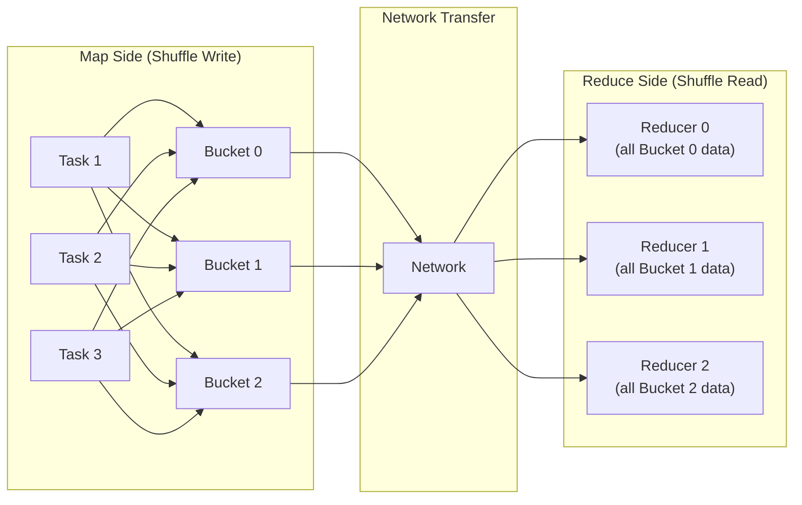

**Shuffle internals:**
1. **Map side** — each task writes its output into partitioned files (shuffle write).
2. **Network transfer** — data is fetched over the network.
3. **Reduce side** — each task reads its relevant shuffle files (shuffle read).

**Spill to disk:** When shuffle data doesn't fit in memory (`spark.shuffle.memoryFraction`), Spark spills to disk — significantly slowing down the job.

**Key shuffle configs:**
```
spark.shuffle.file.buffer           = 32k  (write buffer size)
spark.reducer.maxSizeInFlight       = 48m  (max data fetched per reduce task)
spark.shuffle.io.maxRetries         = 3
spark.shuffle.sort.bypassMergeThreshold = 200  (bypass sort for low-cardinality keys)
```

---

## 9. Caching & Persistence

Caching stores computed RDD/DataFrame data in memory so it can be **reused without recomputation**.

```python
# Mark for caching (lazy — only caches when action is called)
df.cache()                        # = persist(StorageLevel.MEMORY_AND_DISK)
df.persist()
df.persist(StorageLevel.MEMORY_ONLY)

# Unpersist when done
df.unpersist()

from pyspark import StorageLevel
rdd.persist(StorageLevel.MEMORY_AND_DISK_SER)
```

**Storage Levels:**

| Level | Description | Memory | Disk | CPU |
|---|---|---|---|---|
| `MEMORY_ONLY` | Store as JVM objects in memory | High | No | Low |
| `MEMORY_AND_DISK` | Spill to disk if no memory | Medium | Yes | Low |
| `MEMORY_ONLY_SER` | Serialized (compact) in memory | Low | No | High |
| `MEMORY_AND_DISK_SER` | Serialized, spill to disk | Low | Yes | High |
| `DISK_ONLY` | Store only on disk | None | Yes | High |
| `OFF_HEAP` | Store in Tungsten off-heap memory | Medium | No | Medium |

**When to cache:**
- A DataFrame is used **multiple times** in the application.
- Recomputation is expensive (complex aggregations, joins, ML iterations).
- Interactive/exploratory analysis.

**When NOT to cache:**
- DataFrame is used only once.
- DataFrame is very large and would evict other cached data.
- Reading from fast storage (SSD, in-cluster storage).

```python
# Example: Efficient reuse with caching
base_df = spark.read.parquet("s3://large-dataset/") \
               .filter(F.col("year") == 2024) \
               .cache()

# Both of these benefit from the cache:
result1 = base_df.groupBy("region").sum("revenue")
result2 = base_df.filter(F.col("category") == "Electronics").count()

base_df.unpersist()  # Free memory when done
```

---

## 10. Spark SQL & Catalyst Optimizer

### 10.1 Catalyst Optimizer Pipeline

Catalyst is Spark's **query optimization framework**. It transforms SQL/DataFrame queries into an optimized physical execution plan.

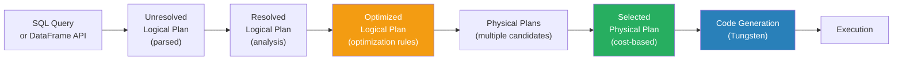

**Optimization rules applied by Catalyst:**
- **Predicate pushdown** — push `filter()` closer to the data source.
- **Column pruning** — eliminate unused columns early.
- **Constant folding** — evaluate constant expressions at compile time.
- **Join reordering** — reorder joins to minimize data movement.
- **Null propagation** — simplify null-related expressions.
- **Boolean simplification** — simplify boolean logic.

```python
# Using Spark SQL
spark.sql("""
    SELECT region, SUM(amount) as total
    FROM sales
    WHERE year = 2024
    GROUP BY region
    ORDER BY total DESC
""").show()

# Register DataFrame as temp view for SQL
df.createOrReplaceTempView("sales")
result = spark.sql("SELECT * FROM sales WHERE amount > 1000")

# See the execution plan
df.explain(mode="formatted")   # modes: simple, extended, codegen, cost, formatted
```

### 10.2 Tungsten Execution Engine

Tungsten is Spark's **physical execution engine** that focuses on CPU and memory efficiency:

- **Off-heap memory management** — avoids JVM GC overhead.
- **Cache-aware computation** — algorithms designed for CPU cache efficiency.
- **Whole-stage code generation (WSCG)** — generates JVM bytecode for entire pipeline stages, avoiding virtual function calls and enabling JIT compilation.
- **Binary data format** — stores data in compact binary format instead of Java objects.

### 10.3 Adaptive Query Execution (AQE)

AQE (Spark 3.0+) **re-optimizes query plans at runtime** based on actual data statistics observed during execution.

```python
# Enable AQE (default in Spark 3.2+)
spark.conf.set("spark.sql.adaptive.enabled", "true")
spark.conf.set("spark.sql.adaptive.coalescePartitions.enabled", "true")
spark.conf.set("spark.sql.adaptive.skewJoin.enabled", "true")
```

**AQE capabilities:**

| Feature | What it does |
|---|---|
| **Coalesce shuffle partitions** | Merges small post-shuffle partitions dynamically |
| **Switch join strategies** | Converts sort-merge join → broadcast join if one side is small |
| **Skew join optimization** | Splits skewed partitions and broadcasts the matching side |

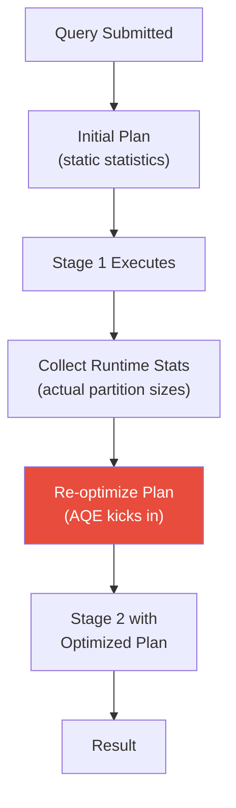

---

## 11. Joins in Spark

### 11.1 Broadcast Hash Join

Used when **one table is small enough** to be broadcast to all executors. No shuffle required — fastest join.

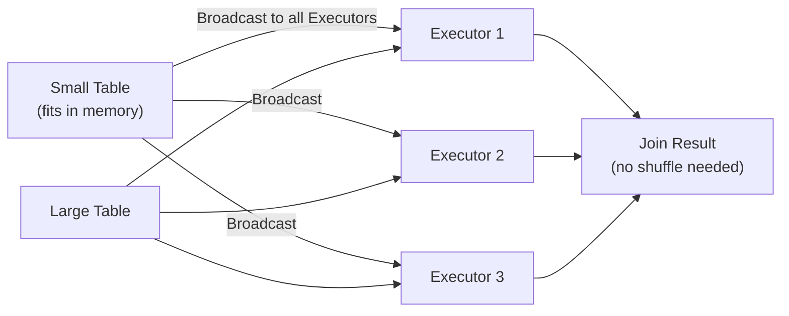

```python
from pyspark.sql.functions import broadcast

# Explicit broadcast hint
result = large_df.join(broadcast(small_df), on="product_id", how="inner")

# Configure auto-broadcast threshold
spark.conf.set("spark.sql.autoBroadcastJoinThreshold", "50m")  # default 10MB
# Disable auto-broadcast
spark.conf.set("spark.sql.autoBroadcastJoinThreshold", "-1")
```

### 11.2 Sort Merge Join

Default join for large tables. Both tables are **sorted** and **shuffled** by join key, then merged.

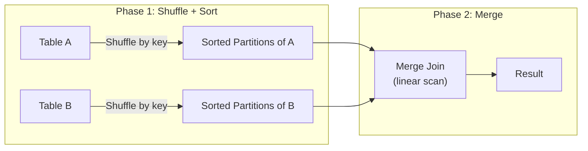

```python
# Force sort merge join
spark.conf.set("spark.sql.join.preferSortMergeJoin", "true")
```

### 11.3 Shuffle Hash Join

One side is **hashed** into a hash table, then the other side probes it. Used when one side is smaller but not small enough to broadcast, and the join key is not sortable.

```python
# Hint
large_df.hint("shuffle_hash").join(medium_df, on="id")
```

### 11.4 Choosing the Right Join

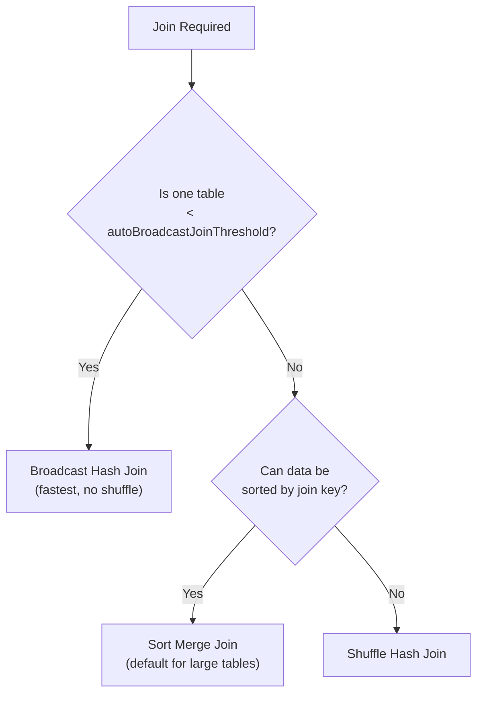

| Join Type | When | Shuffle? | Best For |
|---|---|---|---|
| Broadcast Hash | Small table (< 10MB default) | No | Dimension table lookups |
| Sort Merge | Both tables large + sortable key | Yes (both sides) | Large-large joins |
| Shuffle Hash | Medium + unsortable | Yes (one side) | Non-equi or complex keys |
| Cartesian | No join key | No (but huge output) | Very small tables only |

---

## 12. Spark Memory Management

### 12.1 Unified Memory Model

Spark 1.6+ uses a **unified memory model** where execution and storage share a common memory pool.

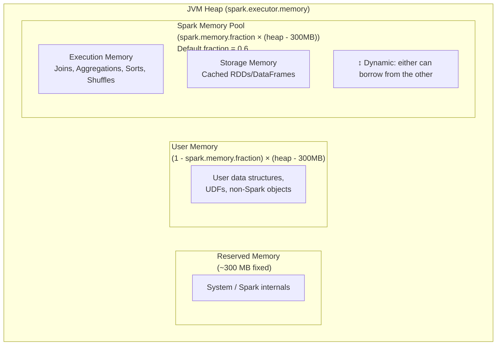

**Key configs:**
```
spark.executor.memory           = 8g     (total JVM heap)
spark.memory.fraction           = 0.6    (Spark memory pool ratio)
spark.memory.storageFraction    = 0.5    (storage portion within pool)
spark.executor.memoryOverhead   = 1g     (off-heap: native memory, Python workers, etc.)
```

**Total executor memory requested from cluster:**
$$\text{Total} = \texttt{spark.executor.memory} + \texttt{spark.executor.memoryOverhead}$$

### 12.2 Off-Heap Memory

```python
# Enable off-heap for Tungsten
spark.conf.set("spark.memory.offHeap.enabled", "true")
spark.conf.set("spark.memory.offHeap.size", "4g")
```

Benefits: Avoids JVM GC pauses. Useful for very large cached datasets.

---

## 13. Fault Tolerance

Spark achieves fault tolerance through **RDD lineage** (for RDDs) and **write-ahead logs + checkpointing** (for streaming).

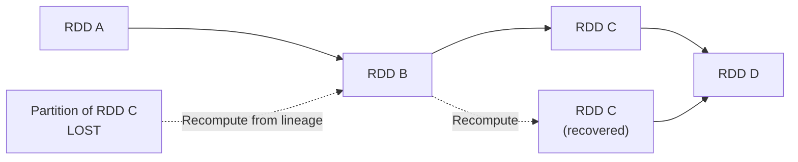

**Checkpointing** breaks the lineage chain and saves the RDD to reliable storage (HDFS/S3), useful for long lineages in iterative algorithms:

```python
sc.setCheckpointDir("hdfs://checkpoints/")

rdd = sc.parallelize(range(1000))
# ... many transformations ...
rdd.checkpoint()    # materializes and saves to HDFS
rdd.count()         # triggers checkpointing
```

For DataFrames:
```python
df.write.parquet("hdfs://checkpoints/df_checkpoint/")
df_restored = spark.read.parquet("hdfs://checkpoints/df_checkpoint/")
```

---

## 14. Spark Structured Streaming

Structured Streaming treats a **live data stream as an unbounded table** that is continuously appended to. Queries are expressed using the same DataFrame/SQL API.

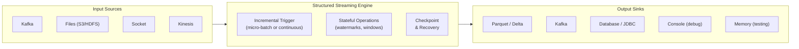

```python
# Read from Kafka
stream_df = spark.readStream \
    .format("kafka") \
    .option("kafka.bootstrap.servers", "broker:9092") \
    .option("subscribe", "orders-topic") \
    .load()

# Parse JSON
from pyspark.sql.types import StructType, StringType, DoubleType, TimestampType

schema = StructType() \
    .add("order_id", StringType()) \
    .add("amount", DoubleType()) \
    .add("event_time", TimestampType())

orders = stream_df.select(
    F.from_json(F.col("value").cast("string"), schema).alias("data")
).select("data.*")

# Windowed aggregation with watermark
result = orders \
    .withWatermark("event_time", "10 minutes") \
    .groupBy(
        F.window("event_time", "5 minutes"),
        F.col("region")
    ).agg(F.sum("amount").alias("total_sales"))

# Write to sink
query = result.writeStream \
    .format("parquet") \
    .option("checkpointLocation", "s3://checkpoints/orders/") \
    .option("path", "s3://output/orders_aggregated/") \
    .outputMode("append") \
    .trigger(processingTime="30 seconds") \
    .start()

query.awaitTermination()
```

**Output Modes:**

| Mode | Description | Use When |
|---|---|---|
| `append` | Only new rows since last trigger | No aggregations, or aggregations with watermark |
| `complete` | Entire result table | Aggregations (all groups rewritten) |
| `update` | Only changed rows | Aggregations (only updated rows) |

---

## 15. Optimization Techniques

### 15.1 Partitioning Strategies

```python
# 1. Set correct shuffle partitions for data size
# Rule: Target ~128MB per partition after shuffle
spark.conf.set("spark.sql.shuffle.partitions", "200")  # tune this!

# 2. Partition files on write for efficient reads
df.write \
    .partitionBy("year", "month", "country") \
    .parquet("s3://output/")

# 3. Repartition before expensive joins
df1 = df1.repartition(200, F.col("customer_id"))
df2 = df2.repartition(200, F.col("customer_id"))
result = df1.join(df2, "customer_id")  # now same partitioner — no shuffle!

# 4. Coalesce before writing (avoid many small files)
df.coalesce(10).write.parquet("s3://output/")

# 5. Bucket tables for repeated joins (Hive metastore / Delta)
df.write \
    .bucketBy(64, "customer_id") \
    .sortBy("customer_id") \
    .saveAsTable("bucketed_customers")
```

### 15.2 Broadcast Variables

Use when you need to share a **read-only lookup table** across all executors without re-sending it per task.

```python
# Without broadcast: the dict is serialized & sent with each task
lookup = {"US": "United States", "UK": "United Kingdom", "IN": "India"}

# With broadcast: sent once to each executor, cached in memory
broadcast_lookup = sc.broadcast(lookup)

rdd.map(lambda x: broadcast_lookup.value.get(x["country"], "Unknown"))

# DataFrame equivalent
country_df = spark.createDataFrame([("US", "United States"), ("UK", "United Kingdom")],
                                    ["code", "name"])
df.join(broadcast(country_df), df.country_code == country_df.code)
```

### 15.3 Accumulators

Accumulators are **write-only shared variables** updated by tasks and read only by the Driver. Used for counters and sums.

```python
# Built-in accumulator
error_count = sc.accumulator(0)

def process_row(row):
    global error_count
    if row["amount"] < 0:
        error_count += 1
    return row

rdd.foreach(process_row)
print(f"Total errors: {error_count.value}")

# Custom accumulator
from pyspark.accumulators import AccumulatorParam

class ListAccumulatorParam(AccumulatorParam):
    def zero(self, value): return []
    def addInPlace(self, v1, v2): return v1 + v2

list_acc = sc.accumulator([], ListAccumulatorParam())
```

> **Caution:** Accumulators can be double-counted if tasks are re-executed due to failures or speculative execution.

### 15.4 Avoiding Data Skew

**Technique 1: Salting (for joins)**
```python
import random

# Add random salt to skewed key
SALT_FACTOR = 10

df_large = df_large.withColumn(
    "salted_key",
    F.concat(F.col("skewed_key"), F.lit("_"), (F.rand() * SALT_FACTOR).cast("int"))
)

# Replicate small table with all salt values
from pyspark.sql.functions import array, explode, lit

df_small = df_small.withColumn(
    "salt_array",
    array([lit(i) for i in range(SALT_FACTOR)])
).withColumn("salt", explode("salt_array")) \
 .withColumn("salted_key", F.concat(F.col("original_key"), F.lit("_"), F.col("salt"))) \
 .drop("salt_array", "salt")

result = df_large.join(df_small, on="salted_key")
```

**Technique 2: AQE Skew Join (Spark 3.0+)**
```python
spark.conf.set("spark.sql.adaptive.enabled", "true")
spark.conf.set("spark.sql.adaptive.skewJoin.enabled", "true")
spark.conf.set("spark.sql.adaptive.skewJoin.skewedPartitionFactor", "5")
spark.conf.set("spark.sql.adaptive.skewJoin.skewedPartitionThresholdInBytes", "256m")
```

**Technique 3: Filter then process skewed key separately**
```python
# Isolate the skewed key
skewed_key_df = df.filter(F.col("key") == "HOT_KEY")
normal_df = df.filter(F.col("key") != "HOT_KEY")

result = normal_df.join(dim_df, "key") \
    .union(skewed_key_df.join(broadcast(dim_df), "key"))
```

### 15.5 Predicate Pushdown & Column Pruning

These are applied **automatically** by Catalyst but you can help:

```python
# GOOD: Filter early — Catalyst pushes this to file scan
df = spark.read.parquet("s3://data/") \
         .filter(F.col("year") == 2024) \
         .filter(F.col("country") == "US") \
         .select("customer_id", "amount")  # only read needed columns

# BAD: Computing everything then filtering
df = spark.read.parquet("s3://data/")
df = df.withColumn("complex_calc", F.expr("..."))
df = df.filter(F.col("year") == 2024)   # too late

# Verify pushdown is working
df.explain()   # look for "PushedFilters" in the scan node
```

**For Parquet — partition pruning (most powerful):**
```python
# Data stored as s3://data/year=2024/month=01/...
df = spark.read.parquet("s3://data/") \
         .filter(F.col("year") == 2024)   # Spark reads ONLY year=2024/ folder
```

### 15.6 Serialization

Use **Kryo serializer** instead of Java serializer for RDD operations (2–10× faster, more compact):

```python
spark = SparkSession.builder \
    .config("spark.serializer", "org.apache.spark.serializer.KryoSerializer") \
    .config("spark.kryo.registrationRequired", "false") \
    .getOrCreate()
```

> **DataFrames and Datasets use Tungsten binary format (not Kryo) — serializer only matters for RDDs.**

### 15.7 Tuning Configurations

```python
# ─── Parallelism ───
spark.conf.set("spark.default.parallelism", "200")           # RDD parallelism
spark.conf.set("spark.sql.shuffle.partitions", "200")        # DataFrame shuffle partitions

# ─── Memory ───
# Set in SparkSession builder (not at runtime):
# spark.executor.memory = 8g
# spark.executor.memoryOverhead = 1g
# spark.driver.memory = 4g
# spark.memory.fraction = 0.6
# spark.memory.storageFraction = 0.5

# ─── Dynamic Allocation ───
spark.conf.set("spark.dynamicAllocation.enabled", "true")
spark.conf.set("spark.dynamicAllocation.minExecutors", "2")
spark.conf.set("spark.dynamicAllocation.maxExecutors", "50")
spark.conf.set("spark.dynamicAllocation.initialExecutors", "5")

# ─── AQE (Spark 3+) ───
spark.conf.set("spark.sql.adaptive.enabled", "true")
spark.conf.set("spark.sql.adaptive.coalescePartitions.enabled", "true")
spark.conf.set("spark.sql.adaptive.coalescePartitions.minPartitionNum", "1")
spark.conf.set("spark.sql.adaptive.advisoryPartitionSizeInBytes", "128m")

# ─── Broadcast ───
spark.conf.set("spark.sql.autoBroadcastJoinThreshold", "50m")  # increase for larger dims

# ─── Speculation (re-run slow tasks) ───
spark.conf.set("spark.speculation", "true")
spark.conf.set("spark.speculation.multiplier", "1.5")

# ─── Network ───
spark.conf.set("spark.network.timeout", "800s")
spark.conf.set("spark.rpc.askTimeout", "600s")

# ─── Shuffle ───
spark.conf.set("spark.shuffle.file.buffer", "1m")
spark.conf.set("spark.reducer.maxSizeInFlight", "96m")
spark.conf.set("spark.shuffle.compress", "true")
spark.conf.set("spark.shuffle.spill.compress", "true")
```

**Executor sizing guide:**

| Cluster | Executor Config |
|---|---|
| Small (≤ 10 nodes, 16 cores each) | `--executor-cores 4 --executor-memory 8g --num-executors 8` |
| Medium (20-50 nodes) | `--executor-cores 5 --executor-memory 20g --num-executors 40` |
| Large (100+ nodes) | `--executor-cores 5 --executor-memory 20g` + dynamic allocation |

> **5 cores per executor** is widely recommended: enough parallelism, reasonable HDFS throughput, and avoids excessive GC.

---

## 16. Debugging Spark Applications

### 16.1 Spark UI

The Spark UI (default port **4040**) is the most powerful debugging tool available.

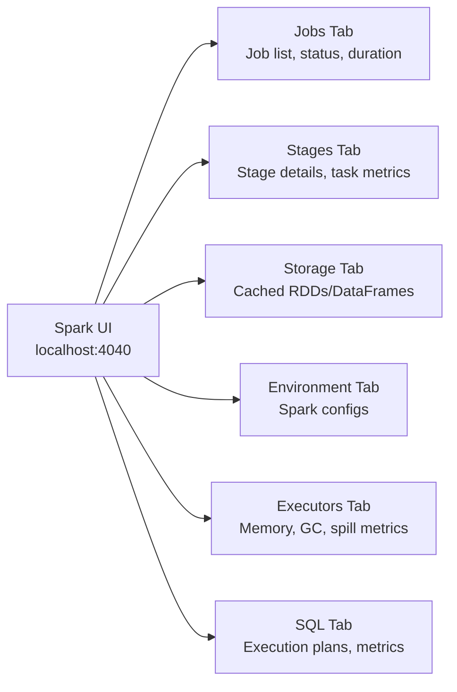

**What to look for:**

| Symptom | Tab | What to Check |
|---|---|---|
| Job takes too long | Stages | Stage with highest duration, skewed tasks |
| OOM errors | Executors | GC time > 10%, memory spill |
| Skewed data | Stages | Huge variance in task durations |
| Shuffle too large | Stages | Shuffle read/write bytes |
| Cache not helping | Storage | Cache fraction, evictions |
| Slow SQL query | SQL | DAG, unoptimized joins, missing pushdown |

### 16.2 Reading Execution Plans

```python
# Always check the plan before running heavy jobs
df.explain()                     # abbreviated physical plan
df.explain(True)                 # logical + physical plan
df.explain(mode="formatted")     # Spark 3+ rich format (RECOMMENDED)
df.explain(mode="cost")          # includes estimated statistics
df.explain(mode="codegen")       # generated JVM code

# Example output interpretation:
# == Physical Plan ==
# *(2) HashAggregate(keys=[region#10], functions=[sum(amount#11)])  ← aggregation
# +- Exchange hashpartitioning(region#10, 200)                      ← shuffle (expensive!)
#    +- *(1) HashAggregate(keys=[region#10], functions=[partial_sum(amount#11)])
#       +- *(1) Project [region#10, amount#11]                      ← column pruning
#          +- *(1) Filter (amount#11 > 1000.0)                      ← predicate pushdown
#             +- *(1) FileScan parquet [region#10,amount#11,...]     ← reads only needed cols
#                     PushedFilters: [IsNotNull(amount), GreaterThan(amount,1000.0)]
```

**Key markers in the plan:**
- `*(n)` — Whole-stage code generation enabled for this node (good).
- `Exchange` — Shuffle boundary.
- `PushedFilters` — Filters pushed to data source (good).
- `BroadcastHashJoin` — Efficient join strategy (good).
- `SortMergeJoin` — Both sides shuffled (costly for large tables).
- `BroadcastNestedLoopJoin` — Very slow, avoid.

### 16.3 Common Errors & Fixes

| Error | Cause | Fix |
|---|---|---|
| `OutOfMemoryError: Java heap space` | Executor heap too small or data skew | Increase `spark.executor.memory`, fix skew |
| `OutOfMemoryError: GC overhead limit exceeded` | Too many JVM objects | Use DataFrames instead of RDDs, reduce object creation |
| `Container killed by YARN for exceeding memory limits` | memoryOverhead too low | Increase `spark.executor.memoryOverhead` (Python especially) |
| `org.apache.spark.shuffle.FetchFailedException` | Executor died during shuffle | Increase `spark.network.timeout`, check executor stability |
| `Task not serializable` | Non-serializable object referenced in closure | Use broadcast variables, avoid capturing non-serializable objects |
| `AnalysisException: Resolved attribute(s) missing` | Column not in schema | Check `.printSchema()`, verify column names |
| `Job aborted due to stage failure` | Task failures exceeding retry limit | Check logs for root cause on executor |
| Slow job, all tasks finish fast except 1-2 | Data skew | Check partition size distribution, apply salting |

**Debugging closures (Task not serializable):**
```python
# BAD: captures a non-serializable object
class DataProcessor:
    def __init__(self):
        self.db_conn = create_connection()   # not serializable!
    
    def process(self, rdd):
        return rdd.map(lambda x: self.db_conn.lookup(x))  # fails!

# GOOD: create connection inside the function (per partition)
def process_partition(iterator):
    conn = create_connection()  # created fresh on each executor
    for row in iterator:
        yield conn.lookup(row)
    conn.close()

rdd.mapPartitions(process_partition)
```

### 16.4 Logging

```python
import logging

# Set log level in application
spark.sparkContext.setLogLevel("WARN")  # DEBUG, INFO, WARN, ERROR

# Application-level logging
log4j = spark.sparkContext._jvm.org.apache.log4j
logger = log4j.LogManager.getLogger("MyApp")
logger.info("Processing started")
logger.warn("Large partition detected")
logger.error("Failed to process record")

# Python logging
logging.basicConfig(level=logging.INFO)
logger = logging.getLogger(__name__)
logger.info("Step completed")

# Executor-side logging (appears in executor logs, not driver)
def process(x):
    import logging
    logging.warning(f"Processing: {x}")
    return x

rdd.map(process).collect()
```

**Accessing logs:**
- **Driver logs:** Console output or YARN/K8s logs for the Driver container.
- **Executor logs:** YARN ResourceManager UI → Application → Logs; or `yarn logs -applicationId <app_id>`.
- **Event logs:** Configured via `spark.eventLog.dir` — used by Spark History Server.

```bash
# Spark History Server (view completed applications)
$SPARK_HOME/sbin/start-history-server.sh
# Browse at http://master:18080
```

---

## 17. Interview Questions

### 17.1 Beginner

**Q1. What is Apache Spark and how does it differ from Hadoop MapReduce?**
> Spark is an in-memory distributed processing framework supporting batch, streaming, ML, and graph processing. Unlike MapReduce which writes intermediate results to HDFS between stages, Spark keeps data in memory, making it up to 100× faster for iterative algorithms.

**Q2. What is an RDD?**
> RDD (Resilient Distributed Dataset) is Spark's fundamental data abstraction — an immutable, fault-tolerant, distributed collection of objects partitioned across cluster nodes. Its 5 properties are: list of partitions, compute function, dependencies, optional partitioner, and preferred locations.

**Q3. What is lazy evaluation in Spark?**
> Transformations are not executed immediately; Spark builds a DAG of operations and only executes when an action is called. This allows Catalyst to optimize the entire pipeline before execution.

**Q4. What is the difference between transformation and action?**
> Transformations (e.g., `map`, `filter`, `groupBy`) are lazy and return new RDDs/DataFrames. Actions (e.g., `count`, `collect`, `show`) trigger execution and return results to the Driver or write to storage.

**Q5. What is the role of the Driver in Spark?**
> The Driver runs the application's `main()` function, converts user code into a DAG, coordinates with the Cluster Manager for resources, schedules tasks on Executors, and collects results.

**Q6. What is SparkSession?**
> SparkSession (Spark 2.0+) is the unified entry point for Spark applications that encapsulates SparkContext, SQLContext, and HiveContext, providing access to DataFrame, Dataset, and SQL APIs.

**Q7. What is a partition in Spark?**
> A partition is a chunk of data that can be processed by a single task on a single executor in parallel with other partitions.

**Q8. What is the difference between `cache()` and `persist()`?**
> `cache()` is equivalent to `persist(StorageLevel.MEMORY_AND_DISK)`. `persist()` allows specifying the storage level (MEMORY_ONLY, DISK_ONLY, etc.).

**Q9. What are narrow and wide transformations?**
> Narrow: each output partition depends on at most one input partition (no shuffle). Wide: output partitions depend on multiple input partitions (requires shuffle). Examples — narrow: `map`, `filter`; wide: `groupBy`, `join`.

**Q10. What is `coalesce()` vs `repartition()`?**
> `coalesce(n)` reduces partitions with minimal data movement (only merges existing partitions, no full shuffle). `repartition(n)` does a full shuffle and can both increase and decrease partition count, distributing data evenly.

---

### 17.2 Intermediate

**Q11. What is a DAG in Spark and how does it enable fault tolerance?**
> The DAG (Directed Acyclic Graph) represents the lineage of RDD transformations. When a partition is lost, Spark uses the DAG to recompute only the lost partition from its parent partitions, without needing data replication.

**Q12. Explain the difference between `reduceByKey` and `groupByKey`.**
> Both group values by key, but `reduceByKey` applies a reduce function on each partition before shuffling (partial aggregation / combining), greatly reducing shuffle data size. `groupByKey` shuffles all values to reducers without pre-aggregation. Always prefer `reduceByKey` (or `aggregateByKey` / `combineByKey`) over `groupByKey`.

**Q13. How does Spark handle data skew?**
> Techniques: (1) Salting — add random prefix to skewed keys to distribute load; (2) AQE skew join optimization (Spark 3+) — splits skewed partitions automatically; (3) Broadcast join — broadcast the smaller side to avoid join shuffle entirely; (4) Separate processing — handle the skewed key independently.

**Q14. What is the Catalyst Optimizer?**
> Catalyst is Spark SQL's query optimization framework that transforms logical plans into optimized physical plans through analysis, logical optimization (predicate pushdown, column pruning, constant folding), physical planning, and code generation.

**Q15. What is AQE (Adaptive Query Execution)?**
> AQE (Spark 3.0+) re-optimizes query plans at runtime based on actual statistics collected during execution. It can coalesce small shuffle partitions, switch sort-merge join to broadcast join, and handle skewed join partitions.

**Q16. How does Broadcast Join work and when should you use it?**
> The smaller table is serialized and sent to all executors once. Each executor then performs a local hash join with its partition of the large table — no shuffle required. Use when one side is < `spark.sql.autoBroadcastJoinThreshold` (default 10MB, can increase to 50-100MB).

**Q17. What is the difference between `repartition` and `partitionBy` (when writing)?**
> `repartition()` repartitions in-memory data (adds a shuffle). `partitionBy()` on a DataFrameWriter writes data into directory partitions by column values (e.g., `year=2024/month=01/`) — enables partition pruning on future reads.

**Q18. What causes OOM errors in Spark and how do you fix them?**
> Causes: data skew (one task holds too much data), too many cached objects, join with very large datasets, insufficient memory config. Fixes: fix skew, increase `spark.executor.memory`, increase `spark.executor.memoryOverhead` (for Python/native memory), use off-heap storage, avoid collecting large datasets to Driver.

**Q19. How do you read an execution plan (`explain`) output?**
> Read bottom-up: the bottom node is the data scan, going up through transformations. Look for: `Exchange` (shuffle — expensive), `BroadcastHashJoin` (efficient), `PushedFilters` (pushdown working), `*(n)` prefix (WSCG enabled). `SortMergeJoin` means both sides were shuffled.

**Q20. What is speculative execution in Spark?**
> When enabled (`spark.speculation=true`), Spark detects tasks running significantly slower than peers and launches duplicate copies on other executors. Whichever finishes first, its result is used and the other is killed. Useful for mitigating stragglers in heterogeneous clusters.

---

### 17.3 Advanced

**Q21. Explain the Spark memory model (Unified Memory Manager).**
> JVM heap is split into: Reserved (~300MB, Spark internals), User Memory (user objects, UDFs), and Spark Memory Pool (controlled by `spark.memory.fraction`, default 0.6). The pool is shared between Execution memory (joins, sorts, shuffles) and Storage memory (cache) — either can borrow from the other dynamically.

**Q22. What is Tungsten and what optimizations does it provide?**
> Tungsten is Spark's physical execution engine providing: (1) off-heap memory management to avoid GC, (2) cache-aware data structures, (3) whole-stage code generation (WSCG) that fuses operators into a single JVM function for JIT optimization, (4) compact binary data format (UnsafeRow).

**Q23. How does Whole-Stage Code Generation work?**
> WSCG fuses multiple operators (e.g., scan → filter → project → aggregate) into a single compiled Java function for an entire stage, eliminating virtual function dispatch overhead and enabling JIT compiler optimizations. The `*(n)` prefix in explain output indicates WSCG is active.

**Q24. What is bucketing in Spark and how does it help?**
> Bucketing pre-partitions and sorts data into a fixed number of files by a hash of a column. When both sides of a join are bucketed on the same column with the same number of buckets, Spark can avoid the shuffle entirely (both sides are already co-partitioned and sorted). Stored in Hive metastore / Delta Lake.

**Q25. How does Structured Streaming achieve exactly-once semantics?**
> Through the combination of: (1) idempotent sinks (writing with the same batch ID is safe), (2) transactional sinks (e.g., Delta Lake), (3) checkpointing (offset tracking to avoid re-reading), and (4) WAL (write-ahead logging). End-to-end exactly-once requires both the source and sink to support it.

**Q26. What is the difference between `mapPartitions` and `map`?**
> `map` creates one function call per element. `mapPartitions` calls the function once per partition with an iterator. `mapPartitions` is more efficient for expensive initializations (DB connections, ML model loading) that should happen once per partition, not per element.

**Q27. How do you handle schema evolution in Spark?**
> For Parquet: use `mergeSchema` option. For Delta Lake: `MERGE SCHEMA` option or `ALLOW_COLUMN_DEFAULTS`. Use `schema_of_json` / `from_json` for semi-structured data. Always validate schema explicitly rather than relying on `inferSchema` in production.

**Q28. What is the difference between `foreachBatch` and `foreach` in Structured Streaming?**
> `foreach` runs a custom function on each row — limited, no batch-level operations. `foreachBatch` provides access to the entire micro-batch as a DataFrame, enabling arbitrary DataFrame operations, multiple writes, and using non-streaming sinks. Preferred for most custom sink scenarios.

**Q29. What are accumulators and when can they be inaccurate?**
> Accumulators are write-only distributed counters/sums visible to the Driver. They can be inaccurate when: (1) tasks are re-executed due to failure (accumulator incremented twice), (2) speculative execution causes duplicate task runs. For reliable counting, use actions like `count()` or `agg()`.

**Q30. Explain checkpointing vs caching — when do you use each?**
> **Caching:** stores data in executor memory/disk for reuse within the same application. Lineage is preserved. Evicted when memory pressure is high. Use for frequently reused DataFrames.  
> **Checkpointing:** saves data to reliable storage (HDFS/S3), breaking the lineage. Survives application restarts. Necessary for: (1) iterative algorithms to truncate long lineage chains, (2) streaming state management, (3) recovering from executor failures in very long pipelines.

---

## Quick Reference Cheat Sheet

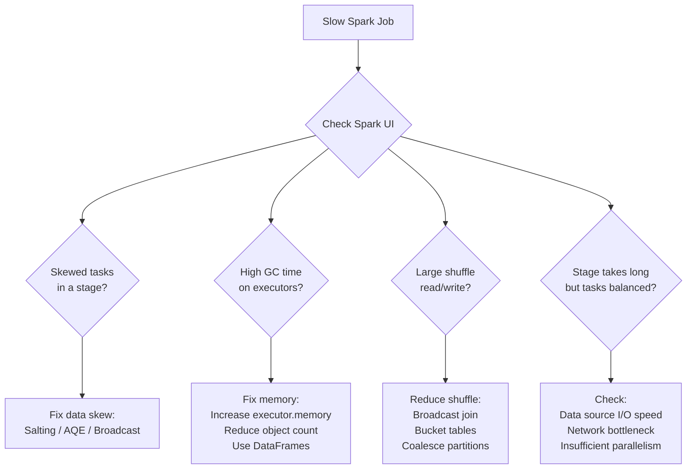

| Problem | Quick Fix |
|---|---|
| OOM on executor | Increase `spark.executor.memory`, fix skew |
| OOM on driver | Avoid `collect()`, use `take()`/`show()` |
| Too many small files | `coalesce()` before write |
| Slow joins | Use broadcast, check for skew, enable AQE |
| 200 shuffle partitions | Tune `spark.sql.shuffle.partitions` |
| Long GC pauses | Enable off-heap, use DataFrames |
| Task not serializable | Use broadcast, avoid closures over objects |
| Slow iterative algorithm | Checkpoint to break lineage |
| Skewed groupBy | Salt keys, use AQE |
```

---

## 18. Scenario-Based Interview Questions

> These questions are asked in senior/lead data engineering interviews. Each question describes a **real-world problem** — think through the cause, diagnosis, and solution before reading the answer.

---

### 18.1 Performance & Optimization Scenarios

---

**Scenario 1: Your Spark job runs fine on 10 GB of data, but hangs indefinitely on 1 TB. What do you investigate?**

**Answer:**

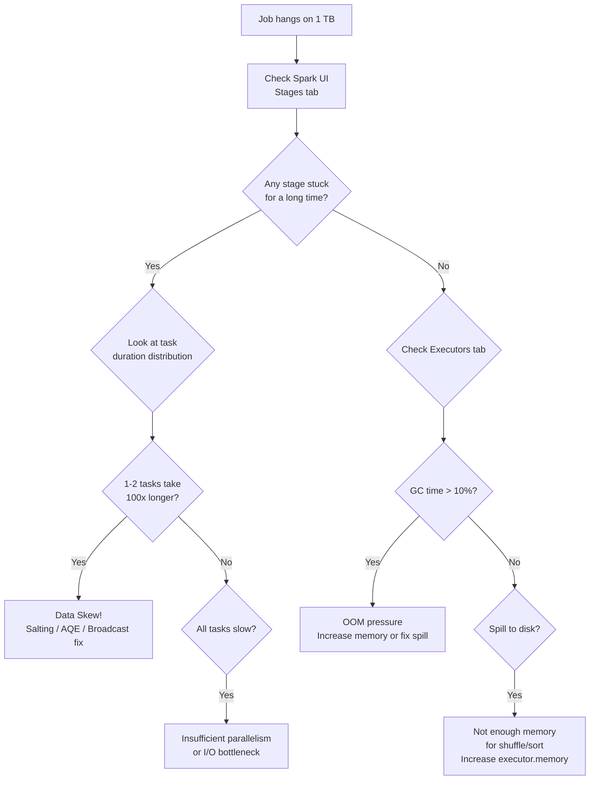

Investigation checklist:
1. **Spark UI → Stages**: Which stage is taking longest? Are tasks balanced?
2. **Data skew**: Check if a few tasks handle most data (`mapPartitionsWithIndex` to count per partition).
3. **`spark.sql.shuffle.partitions`**: Default 200 is too low for 1 TB — set to 2000+.
4. **Memory**: Is there shuffle spill? Increase `spark.executor.memory` and `memoryOverhead`.
5. **File skew**: Are source files even? One 500 GB file creates 1 huge partition.
6. **Network**: Check shuffle read/write bytes per stage.

```python
# Fix: scale shuffle partitions with data
# Rule of thumb: data_size_bytes / (128 * 1024 * 1024) = target partitions
spark.conf.set("spark.sql.shuffle.partitions", "2000")
spark.conf.set("spark.sql.adaptive.enabled", "true")       # let AQE coalesce if too many

# Fix: repartition large source files
df = spark.read.parquet("s3://data/").repartition(2000)
```

---

**Scenario 2: A Spark job joining two DataFrames is extremely slow. One is 2 TB and the other is 500 MB. How do you optimize it?**

**Answer:**

The 500 MB table is below the 10 MB auto-broadcast threshold, so it won't be broadcast automatically. The join defaults to a Sort Merge Join (double shuffle of 2.5 TB total).

**Solution — raise broadcast threshold and use broadcast hint:**

```python
# Option 1: Raise the threshold (safe up to available driver/executor memory)
spark.conf.set("spark.sql.autoBroadcastJoinThreshold", "600m")  # 600 MB

# Option 2: Explicit broadcast (more reliable)
from pyspark.sql.functions import broadcast

result = large_df.join(broadcast(medium_df), on="product_id", how="inner")
```

**Verification — check the plan:**
```python
result.explain(mode="formatted")
# Look for: BroadcastHashJoin instead of SortMergeJoin
```

**Impact:** Eliminates the shuffle of 2 TB + 500 MB. The 500 MB table is sent once to each executor — dramatically faster.

> **Gotcha:** Broadcasting 500 MB requires each executor to have at least 500 MB of free storage memory. If executors have 2 GB memory, this is usually fine.

---

**Scenario 3: You have a `groupBy("user_id").count()` on 500 million rows. A few `user_id` values (e.g., bots) account for 80% of the data. The job keeps failing. What do you do?**

**Answer:**

This is a classic **data skew** problem. The skewed keys cause a few tasks to process hundreds of millions of rows while others finish instantly.

```mermaid
flowchart LR
  subgraph Without_Salting["Without Salting"]
    A1["user_id=BOT1\n400M rows → Task 1\n(10 hrs)"]
    A2["user_id=abc\n1000 rows → Task 2\n(1 sec)"]
    A3["user_id=xyz\n800 rows → Task 3\n(1 sec)"]
  end
  subgraph With_Salting["With Salting (10 buckets)"]
    B1["user_id=BOT1_0\n40M rows → Task 1"]
    B2["user_id=BOT1_1\n40M rows → Task 2"]
    B3["..."]
    B4["user_id=BOT1_9\n40M rows → Task 10"]
  end
```

**Step 1: Detect skew**
```python
df.groupBy("user_id").count().orderBy(F.col("count").desc()).show(10)
# If top 5 keys = 80% of rows → severe skew
```

**Step 2: Option A — AQE (simplest, Spark 3+)**
```python
spark.conf.set("spark.sql.adaptive.enabled", "true")
spark.conf.set("spark.sql.adaptive.skewJoin.enabled", "true")
# For aggregations: AQE coalesces small partitions automatically
spark.conf.set("spark.sql.adaptive.coalescePartitions.enabled", "true")
```

**Step 3: Option B — Salting (manual, works in all Spark versions)**
```python
SALT_FACTOR = 10

# Phase 1: partial aggregation per salt bucket
salted = df.withColumn("salt", (F.rand() * SALT_FACTOR).cast("int")) \
           .withColumn("salted_key", F.concat_ws("_", F.col("user_id"), F.col("salt"))) \
           .groupBy("salted_key", "user_id") \
           .count() \
           .withColumnRenamed("count", "partial_count")

# Phase 2: merge partial counts
result = salted.groupBy("user_id").agg(F.sum("partial_count").alias("total_count"))
```

---

**Scenario 4: Your Spark executor is getting `Container killed by YARN for exceeding memory limits` even though `spark.executor.memory` is set to 8g. Why?**

**Answer:**

YARN kills the container when **total process memory** exceeds the container limit. Total memory = JVM heap + off-heap overhead. The JVM heap is `spark.executor.memory`, but the container also needs:

- **`spark.executor.memoryOverhead`** (native memory, Python workers, NIO buffers, etc.) — defaults to `max(384MB, 10% of executor.memory)`.
- PySpark adds a **Python worker process** per task, which lives outside the JVM heap.

```
Container memory limit (YARN) = spark.executor.memory + spark.executor.memoryOverhead
```

**Diagnosis:**
```bash
# In YARN logs:
# "Container [pid=xxxx, containerID=container_xxx] is running beyond physical memory limits.
#  Current usage: 9.5 GB of 9 GB physical memory used."
```

**Fix:**
```python
# For JVM-based workloads
spark.conf.set("spark.executor.memoryOverhead", "2g")   # increase from default

# For PySpark workloads (Python processes are heavier)
spark.conf.set("spark.executor.memoryOverhead", "3g")
# Or use pyspark-specific overhead config (Spark 3.2+):
spark.conf.set("spark.executor.pyspark.memory", "2g")
```

> **Rule of thumb:** Set `memoryOverhead` to at least 10-15% of executor memory for JVM, and 20-25%+ for PySpark.

---

**Scenario 5: A Spark job writing Parquet to S3 produces 50,000 small files (each ~1 MB). The next job reading these files is very slow. How do you fix both the write and read sides?**

**Answer:**

Small files are a classic Hadoop/Spark anti-pattern. Each file requires a metadata operation on S3 (LIST, GET), and each file maps to at least one task in the reading job — creating massive task scheduling overhead.

**Root cause:** Too many output partitions, each writing its own file.

**Fix — Write side:**
```python
# Option 1: Coalesce before writing (no shuffle — fast)
df.coalesce(50).write.parquet("s3://output/")

# Option 2: Repartition (full shuffle — even distribution)
df.repartition(50).write.parquet("s3://output/")

# Option 3: Partition by column + coalesce within each partition
df.repartition(50, F.col("country")) \
  .write \
  .partitionBy("country") \
  .parquet("s3://output/")

# Target: ~128-256 MB per output file
# num_files = total_output_size_bytes / (128 * 1024 * 1024)
```

**Fix — Read side (for existing small files):**
```python
# Option 1: Enable file merging for Parquet (merge small files into one split)
spark.conf.set("spark.sql.files.maxPartitionBytes", "268435456")   # 256 MB
spark.conf.set("spark.sql.files.openCostInBytes", "8388608")       # 8 MB open cost

# Option 2: Read + immediately re-write compacted
df = spark.read.parquet("s3://output/")
df.repartition(200).write.mode("overwrite").parquet("s3://output-compacted/")
```

**On Delta Lake (best solution):**
```python
# Delta OPTIMIZE command merges small files automatically
spark.sql("OPTIMIZE delta.`s3://output/`")
# With Z-ordering for better data skipping:
spark.sql("OPTIMIZE delta.`s3://output/` ZORDER BY (customer_id)")
```

---

**Scenario 6: You run `df.cache()` on a large DataFrame, but the Spark UI shows the cache fraction is only 60% and jobs are still slow. Why?**

**Answer:**

The cache is being **partially evicted** due to memory pressure. Spark's LRU eviction is dropping cached partitions to make room for execution memory (joins, shuffles, sorts).

**Diagnosis:**
```
Spark UI → Storage tab:
- Fraction Cached: 60%        ← only 60% of partitions in memory
- Size in Memory: 48 GB
- Size on Disk: 0 B           ← rest was evicted, not spilled to disk
```

**Root Causes:**
1. `StorageLevel.MEMORY_ONLY` (default) — evicted partitions are re-computed, not spilled.
2. Not enough executor memory allocated.
3. Other DataFrames competing for the same storage pool.

**Fixes:**
```python
# Option 1: Use MEMORY_AND_DISK so evicted partitions spill to disk instead of being dropped
from pyspark import StorageLevel
df.persist(StorageLevel.MEMORY_AND_DISK)

# Option 2: Increase storage fraction (give more memory to cache)
spark.conf.set("spark.memory.storageFraction", "0.6")   # default is 0.5

# Option 3: Increase executor memory
# --executor-memory 16g (instead of 8g)

# Option 4: Unpersist DataFrames you no longer need
old_df.unpersist()

# Option 5: Use off-heap for caching
spark.conf.set("spark.memory.offHeap.enabled", "true")
spark.conf.set("spark.memory.offHeap.size", "8g")
df.persist(StorageLevel.OFF_HEAP)
```

---

**Scenario 7: A Spark Streaming job is processing Kafka events. It works fine with low traffic, but during peak hours it starts falling behind (lag keeps growing). How do you diagnose and fix this?**

**Answer:**

**Diagnosis:**
```mermaid
flowchart TD
  A["Growing Kafka Lag"] --> B["Check processing time\nvs trigger interval"]
  B --> C{"Processing time\n> trigger interval?"}
  C -->|Yes| D["Job is backlogged\n— not enough throughput"]
  D --> E{"Where is time spent?"}
  E --> F["Check Spark UI Stages\nfor the streaming job"]
  F --> G{"Shuffle-heavy\noperations?"}
  G -->|Yes| H["Reduce shuffle partitions\nor use stateful ops carefully"]
  F --> I{"I/O bound?"}
  I -->|Yes| J["Increase Kafka\nconsumer parallelism\nor batch size"]
```

**Fixes:**
```python
# 1. Increase parallelism: more partitions = more tasks = more throughput
stream_df = spark.readStream \
    .format("kafka") \
    .option("kafka.bootstrap.servers", "broker:9092") \
    .option("subscribe", "orders-topic") \
    .option("startingOffsets", "latest") \
    .option("maxOffsetsPerTrigger", "500000")   # cap offsets per micro-batch
    .load()

# 2. Reduce shuffle partitions for streaming (streaming micro-batches are small)
spark.conf.set("spark.sql.shuffle.partitions", "50")   # much lower than batch default

# 3. Increase trigger interval to process larger batches (less overhead per record)
query = result.writeStream \
    .trigger(processingTime="2 minutes")   # instead of default 0 (as-fast-as-possible)
    .start()

# 4. Scale up: add more executor cores or executors
# spark.dynamicAllocation.enabled=true with kafka-aware scheduling

# 5. For stateful operations: tune state store
spark.conf.set("spark.sql.streaming.stateStore.providerClass",
               "org.apache.spark.sql.execution.streaming.state.RocksDBStateStoreProvider")
```

---

### 18.2 Data Engineering Design Scenarios

---

**Scenario 8: You need to join a 10 TB fact table with a 5 GB dimension table every hour. The join takes 45 minutes. How do you bring it under 10 minutes?**

**Answer:**

```mermaid
flowchart LR
  subgraph Current["Current (Sort Merge Join)"]
    F1["10 TB Fact"] -->|Shuffle 10 TB| SMJ["Sort Merge Join\n45 min"]
    D1["5 GB Dim"] -->|Shuffle 5 GB| SMJ
  end
  subgraph Optimized["Optimized"]
    F2["10 TB Fact\n(not shuffled)"] --> BHJ["Broadcast Hash Join\nDim sent once to each executor\n~8 min"]
    D2["5 GB Dim\n(broadcast)"] -->|Broadcast| BHJ
  end
```

**Step 1 — Broadcast the dimension table:**
```python
spark.conf.set("spark.sql.autoBroadcastJoinThreshold", "6g")  # raise to 6 GB
# or explicit:
result = fact_df.join(broadcast(dim_df), on="product_id")
```

**Step 2 — Partition prune the fact table:**
```python
# If data is partitioned by date:
fact_df = spark.read.parquet("s3://fact/") \
               .filter(F.col("date") == "2024-01-15")   # read only today's partition
```

**Step 3 — Bucket the fact table for future runs:**
```python
# Write once with bucketing (eliminates shuffle for all future joins):
fact_df.write \
    .bucketBy(512, "product_id") \
    .sortBy("product_id") \
    .saveAsTable("bucketed_fact")

dim_df.write \
    .bucketBy(512, "product_id") \
    .sortBy("product_id") \
    .saveAsTable("bucketed_dim")

# Future joins: NO shuffle at all
result = spark.table("bucketed_fact").join(spark.table("bucketed_dim"), "product_id")
```

**Step 4 — Cache the dimension if it's reused multiple times per job:**
```python
dim_df.cache()
dim_df.count()   # trigger caching eagerly
```

---

**Scenario 9: You are reading from a JDBC source (PostgreSQL). The job reads 1 billion rows, but only uses a single executor and takes 4 hours. How do you parallelize this?**

**Answer:**

By default, `spark.read.jdbc()` creates **a single partition** — one connection, one thread, 4 hours.

**Solution — partition the JDBC read:**
```python
# Option 1: Numeric column partitioning (most efficient)
df = spark.read \
    .jdbc(
        url="jdbc:postgresql://host:5432/db",
        table="orders",
        column="order_id",          # numeric column for partitioning
        lowerBound=1,
        upperBound=1_000_000_000,
        numPartitions=200,          # 200 parallel DB connections
        properties={"user": "user", "password": "pass", "driver": "org.postgresql.Driver"}
    )

# Option 2: Date column partitioning
df = spark.read \
    .jdbc(
        url="jdbc:postgresql://host:5432/db",
        table="(SELECT * FROM orders WHERE status='ACTIVE') AS t",
        column="created_date",
        lowerBound="2020-01-01",
        upperBound="2024-12-31",
        numPartitions=100,
        properties={"user": "user", "password": "pass"}
    )

# Option 3: Predicates (for non-numeric, non-date columns)
predicates = [
    "country = 'US'",
    "country = 'UK'",
    "country = 'IN'",
    "country NOT IN ('US', 'UK', 'IN')"
]
df = spark.read \
    .jdbc(url=url, table="orders", predicates=predicates, properties=props)
```

> **Warning:** `numPartitions` = number of concurrent DB connections. Too many can overwhelm the DB. Coordinate with the DBA. Use connection pooling (PgBouncer) if needed.

---

**Scenario 10: A critical nightly Spark job failed midway through writing 500 GB of Parquet files. When you re-run it, it processes everything again from scratch. How do you make it resumable?**

**Answer:**

Implement **checkpointing + idempotent writes** using Delta Lake or a custom checkpoint strategy.

**Option A — Delta Lake (recommended):**
```python
# Delta writes are ACID and transactional — partial writes are rolled back
df.write \
    .format("delta") \
    .mode("overwrite") \
    .save("s3://output/delta-table/")
# Re-running is safe: Delta's transaction log prevents double-writes
```

**Option B — Partition-based incremental processing:**
```python
from datetime import date

# Process one partition at a time, skip already-written partitions
import boto3
s3 = boto3.client("s3")

dates_to_process = ["2024-01-01", "2024-01-02", "2024-01-03"]

for process_date in dates_to_process:
    output_path = f"s3://output/date={process_date}/"
    
    # Check if partition already exists (idempotency check)
    response = s3.list_objects_v2(Bucket="output", Prefix=f"date={process_date}/")
    if response.get("KeyCount", 0) > 0:
        print(f"Skipping {process_date} — already written")
        continue
    
    df_partition = df.filter(F.col("date") == process_date)
    df_partition.write.parquet(output_path)
    print(f"Written {process_date}")
```

**Option C — Structured Streaming checkpointing:**
```python
# For streaming jobs, checkpointing handles exactly-once automatically:
query = df.writeStream \
    .option("checkpointLocation", "s3://checkpoints/job-x/") \
    .format("parquet") \
    .option("path", "s3://output/") \
    .start()
# On restart, Spark reads the checkpoint and resumes from the last committed offset
```

---

**Scenario 11: You have a Spark job that reads a JSON column containing variable-length arrays (e.g., list of products in an order). You need to compute per-product metrics. How do you approach this efficiently?**

**Answer:**

```python
from pyspark.sql import functions as F
from pyspark.sql.types import *

# Sample data: {"order_id": "1", "products": [{"id": "A", "qty": 2}, {"id": "B", "qty": 1}]}
df = spark.read.json("s3://orders/")

# Step 1: Define schema explicitly (DON'T use inferSchema in production — it scans all data)
product_schema = ArrayType(StructType([
    StructField("id", StringType()),
    StructField("qty", IntegerType()),
    StructField("price", DoubleType())
]))

# Step 2: Parse JSON column if it's stored as string
df = df.withColumn("products_parsed", F.from_json(F.col("products_json"), product_schema))

# Step 3: Explode the array — one row per product per order
df_exploded = df.select(
    F.col("order_id"),
    F.col("order_date"),
    F.explode(F.col("products_parsed")).alias("product")
).select(
    "order_id",
    "order_date",
    F.col("product.id").alias("product_id"),
    F.col("product.qty").alias("qty"),
    F.col("product.price").alias("price")
)

# Step 4: Compute metrics
product_metrics = df_exploded.groupBy("product_id").agg(
    F.sum(F.col("qty") * F.col("price")).alias("total_revenue"),
    F.sum("qty").alias("total_units_sold"),
    F.countDistinct("order_id").alias("num_orders")
)

product_metrics.show()
```

> **Performance tip:** `explode()` can dramatically increase row count. Cache the exploded DataFrame if reused, and filter before exploding where possible.

---

**Scenario 12: You need to compute a 7-day rolling average of sales per customer. The dataset has 500 million rows. How do you do this efficiently?**

**Answer:**

```python
from pyspark.sql import functions as F
from pyspark.sql.window import Window

# Window spec: per customer, ordered by date, rows in last 7 days
window_7d = Window \
    .partitionBy("customer_id") \
    .orderBy(F.col("sale_date").cast("timestamp").cast("long")) \
    .rangeBetween(-7 * 86400, 0)   # 7 days in seconds

df = spark.read.parquet("s3://sales/")

result = df.withColumn(
    "rolling_avg_7d",
    F.avg("amount").over(window_7d)
).withColumn(
    "rolling_sum_7d",
    F.sum("amount").over(window_7d)
).withColumn(
    "rolling_count_7d",
    F.count("*").over(window_7d)
)

result.write.parquet("s3://output/rolling_metrics/")
```

**Performance considerations:**
```python
# Window functions require sorting data per partition — this triggers a shuffle
# Partitioning by customer_id first reduces cross-partition shuffle:
df = df.repartition(500, F.col("customer_id"))  # co-locate same customer's data

# If customer_id has high cardinality (millions of customers), shuffle is expensive
# Consider: pre-sort and bucket by customer_id on disk to eliminate shuffle entirely
df.write \
    .bucketBy(200, "customer_id") \
    .sortBy("customer_id", "sale_date") \
    .saveAsTable("sales_bucketed")
```

---

**Scenario 13: You are building an ETL pipeline that processes 1 TB of raw data daily and produces a customer 360 view. The raw data has duplicate records. How do you handle deduplication efficiently at scale?**

**Answer:**

```python
from pyspark.sql import functions as F
from pyspark.sql.window import Window

df = spark.read.parquet("s3://raw/date=2024-01-15/")

# ── Strategy 1: dropDuplicates (for exact row deduplication) ──
df_deduped = df.dropDuplicates(["customer_id", "event_id"])

# ── Strategy 2: Keep latest record per key (for upsert-style deduplication) ──
w = Window.partitionBy("customer_id").orderBy(F.col("updated_at").desc())
df_deduped = df \
    .withColumn("rn", F.row_number().over(w)) \
    .filter(F.col("rn") == 1) \
    .drop("rn")

# ── Strategy 3: Delta Lake MERGE (for incremental + idempotent dedup) ──
from delta.tables import DeltaTable

target = DeltaTable.forPath(spark, "s3://output/customer360/")

target.alias("target").merge(
    df.alias("source"),
    "target.customer_id = source.customer_id"
).whenMatchedUpdateAll() \
 .whenNotMatchedInsertAll() \
 .execute()

# ── Performance tip: partition input data to reduce shuffle ──
df = df.repartition(500, F.col("customer_id"))  # ensures same customer in same partition
df_deduped = df.dropDuplicates(["customer_id", "event_id"])
```

---

**Scenario 14: Your data engineering team reports that after migrating from Spark 2.4 to Spark 3.x, some queries that used to produce correct results now return different outputs. What could cause this?**

**Answer:**

Several **breaking changes and behavior shifts** between Spark 2.x and 3.x:

| Change | Spark 2.x Behavior | Spark 3.x Behavior |
|---|---|---|
| Integer overflow | Silent overflow | `ArithmeticException` thrown |
| `timestamp` precision | Microseconds | Nanoseconds (3.0+) |
| `timestamp_ntz` | Didn't exist | New type in 3.0 |
| AQE | Disabled by default | Enabled by default (3.2+) — may change join strategy |
| `spark.sql.legacy.timeParserPolicy` | LEGACY | EXCEPTION (stricter date parsing) |
| `df.schema` for JSON | Inferred differently | May differ due to new inference logic |
| `ANSI SQL mode` | Disabled | Stricter NULL handling, type promotion |

**Common fix patterns:**
```python
# Fix date parsing issues (if dates were in non-standard formats)
spark.conf.set("spark.sql.legacy.timeParserPolicy", "LEGACY")

# Fix integer overflow silent failures (if you relied on wrapping behavior)
spark.conf.set("spark.sql.ansi.enabled", "false")

# Fix AQE changing join strategy unexpectedly
spark.conf.set("spark.sql.adaptive.enabled", "false")  # for debugging only

# Fix timestamp differences
spark.conf.set("spark.sql.session.timeZone", "UTC")  # be explicit about timezone
```

**Best practice:** Always run before/after data validation:
```python
# Count check
assert df_old.count() == df_new.count(), "Row count mismatch!"

# Hash check on key columns
df_old_hash = df_old.select(F.md5(F.concat_ws(",", *key_cols))).distinct()
df_new_hash = df_new.select(F.md5(F.concat_ws(",", *key_cols))).distinct()
assert df_old_hash.subtract(df_new_hash).count() == 0, "Data mismatch detected!"
```

---

**Scenario 15: You have a Spark job with 10 stages. Stages 1-9 complete in 2 minutes total. Stage 10 (final write to S3) takes 50 minutes. How do you debug and fix this?**

**Answer:**

A slow final write stage is usually caused by one of:

1. **Too many partitions → too many small S3 PUT requests:**
   ```python
   # Check number of output tasks in Stage 10 (Spark UI)
   # If 50,000 tasks → 50,000 files
   
   # Fix: coalesce before writing
   result.coalesce(100).write.parquet("s3://output/")
   ```

2. **Single large partition (skew in final stage):**
   ```python
   # Check task duration distribution in Stage 10
   # If 1 task runs for 48 minutes → data skew
   
   # Fix: repartition before write
   result.repartition(200).write.parquet("s3://output/")
   ```

3. **S3 committer inefficiency:**
   ```python
   # Default committer does rename operations which are slow on S3
   # Use S3A Magic Committer (Spark 3.x + hadoop-aws 3.x)
   spark.conf.set("spark.hadoop.fs.s3a.committer.name", "magic")
   spark.conf.set("spark.sql.sources.commitProtocolClass",
                  "org.apache.spark.internal.io.cloud.PathOutputCommitProtocol")
   ```

4. **Network bandwidth saturation:**
   ```python
   # Check if multiple jobs write to S3 simultaneously
   # Stagger job schedules or use different S3 prefixes to avoid throttling
   
   # Enable S3 multipart upload for large files
   spark.conf.set("spark.hadoop.fs.s3a.multipart.size", "128M")
   spark.conf.set("spark.hadoop.fs.s3a.fast.upload", "true")
   ```

---

### 18.3 Fault Tolerance & Reliability Scenarios

---

**Scenario 16: A task in your Spark job fails with `FetchFailedException`. You see this error sporadically — sometimes the job succeeds on retry, sometimes it keeps failing. What is happening?**

**Answer:**

`FetchFailedException` occurs when a **reducer task cannot fetch shuffle data** from the executor that was running the map task. The map-side executor either:
- Crashed (OOM, hardware failure).
- Was killed by YARN/K8s (memory exceeded container limits).
- Timed out due to network issues.

```mermaid
flowchart LR
  MapTask["Map Task\n(Executor 1)"] -->|Writes shuffle files| SH["Shuffle Service\nor Executor disk"]
  ReduceTask["Reduce Task\n(Executor 2)"] -->|Fetch shuffle data| SH
  SH -->|Executor 1 died!| ERR["FetchFailedException\non Executor 2"]
  ERR --> RETRY["Spark retries\nentire Stage"]
```

**Diagnosis:**
```bash
# Check YARN logs for executor exit reason
yarn logs -applicationId <app_id> | grep "FAILED\|killed\|OOM"
```

**Fixes:**
```python
# 1. Increase network/fetch timeouts
spark.conf.set("spark.network.timeout", "800s")
spark.conf.set("spark.rpc.askTimeout", "600s")
spark.conf.set("spark.shuffle.io.maxRetries", "10")
spark.conf.set("spark.shuffle.io.retryWait", "60s")

# 2. If executors are OOM-ing (causing crashes):
# Increase executor memory or fix skew
spark.conf.set("spark.executor.memory", "16g")
spark.conf.set("spark.executor.memoryOverhead", "3g")

# 3. Use External Shuffle Service (YARN) so shuffle data survives executor crashes
# Set in spark-defaults.conf or cluster config:
# spark.shuffle.service.enabled = true
# spark.dynamicAllocation.enabled = true

# 4. Reduce shuffle data size:
spark.conf.set("spark.sql.shuffle.partitions", "2000")  # more, smaller partitions
spark.conf.set("spark.shuffle.compress", "true")
```

---

**Scenario 17: You run `df.collect()` in production and the Driver crashes with OOM. What went wrong and how do you fix it?**

**Answer:**

`collect()` pulls **all data from all executors to the Driver** JVM. If the DataFrame has 100 GB of data and the Driver only has 4 GB of heap, the Driver crashes.

```mermaid
flowchart LR
  E1["Executor 1\n25 GB data"] --> D["Driver\n4 GB heap"]
  E2["Executor 2\n25 GB data"] --> D
  E3["Executor 3\n25 GB data"] --> D
  E4["Executor 4\n25 GB data"] --> D
  D --> OOM["💥 OOM!\nDriver crashed"]
```

**Never use `collect()` on large datasets in production.**

**Alternatives:**
```python
# 1. Only collect a sample for inspection
df.show(20)          # prints 20 rows — safe
df.take(100)         # returns 100 Row objects — safe
df.first()           # returns 1 row — safe
df.limit(1000).toPandas()  # collect small sample to Pandas

# 2. Write to storage instead of collecting
df.write.parquet("s3://output/")

# 3. For aggregation results (usually small):
# Aggregations reduce data volume — this is usually safe
summary = df.groupBy("region").agg(F.sum("amount")).collect()  # collect small agg result

# 4. If you must collect: increase Driver memory
# --driver-memory 32g

# 5. Use toLocalIterator() for row-by-row processing (streaming from executor to driver)
for row in df.toLocalIterator():    # fetches one partition at a time
    process(row)                    # lower peak driver memory
```

---

**Scenario 18: You are writing a PySpark job that uses a third-party Python library for ML inference inside a `map()` call. In local mode it works, but in cluster mode it fails. What is the issue?**

**Answer:**

In cluster mode, tasks run on **executor nodes**, not the driver. The third-party library must be installed on **every executor node**, not just the machine where the job was submitted.

**Diagnosis:**
```
ModuleNotFoundError: No module named 'my_ml_lib'
# Seen in executor logs, not driver logs
```

**Solutions:**
```python
# ── Option 1: Add Python dependencies as a zip or egg ──
# Package dependencies:
# pip install my_ml_lib -t ./deps/
# cd deps && zip -r ../deps.zip .

spark = SparkSession.builder \
    .config("spark.submit.pyFiles", "deps.zip") \
    .getOrCreate()

# ── Option 2: Use --py-files in spark-submit ──
# spark-submit --py-files deps.zip my_job.py

# ── Option 3: Use conda-pack or venv-pack ──
# conda install conda-pack
# conda pack -o environment.tar.gz
# spark-submit --archives environment.tar.gz#env \
#              --conf spark.pyspark.python=./env/bin/python \
#              my_job.py

# ── Option 4: Pre-install on cluster nodes (for frequently used libs) ──
# Use cluster bootstrap scripts (EMR bootstrap, Databricks init scripts)

# ── Option 5: Use mapPartitions for expensive model loading ──
def run_inference(iterator):
    import my_ml_lib   # imported inside — available on executor
    model = my_ml_lib.load_model("s3://models/my_model.pkl")
    for row in iterator:
        yield model.predict(row)

result = df.rdd.mapPartitions(run_inference).toDF()
```

---

### 18.4 Architecture & Design Scenarios

---

**Scenario 19: Design a Spark-based pipeline to process 10 TB of raw clickstream data daily into aggregated reports. What architecture would you choose?**

**Answer:**

```mermaid
flowchart TB
  subgraph Ingestion["Ingestion Layer"]
    K["Kafka\n(clickstream events)"]
    S3R["S3 Raw Zone\n(JSON, gz compressed)"]
  end

  subgraph Processing["Processing Layer (Spark on EMR/Databricks)"]
    CLEAN["Step 1: Cleansing & Validation\n- Schema enforcement\n- Deduplication\n- Null handling"]
    ENRICH["Step 2: Enrichment\n- Broadcast join with\n  user/product dimensions"]
    AGG["Step 3: Aggregation\n- Session metrics\n- Funnel analysis\n- Hourly/daily rollups"]
  end

  subgraph Storage["Storage Layer"]
    SILVER["Silver Zone\n(Delta Lake, Parquet)\npartitioned by date, country"]
    GOLD["Gold Zone\n(Delta Lake)\nAggregated fact tables"]
  end

  subgraph Serving["Serving Layer"]
    DW["Redshift / Snowflake\n(for BI tools)"]
    API["REST API\n(for dashboards)"]
  end

  K --> S3R
  S3R --> CLEAN --> ENRICH --> AGG
  CLEAN --> SILVER
  AGG --> GOLD
  GOLD --> DW --> API
```

**Key design decisions:**
```python
# 1. Partitioning strategy
df.write \
    .partitionBy("date", "country") \   # coarse for pruning
    .format("delta") \
    .save("s3://silver/clickstream/")

# 2. Optimize for daily batch
spark.conf.set("spark.sql.shuffle.partitions", "2000")   # 10 TB / 5 MB = 2000 partitions
spark.conf.set("spark.sql.adaptive.enabled", "true")

# 3. Z-ordering for common query patterns
spark.sql("OPTIMIZE delta.`s3://gold/session_metrics/` ZORDER BY (user_id, date)")

# 4. Compaction job (run after daily batch)
spark.sql("OPTIMIZE delta.`s3://silver/clickstream/` WHERE date = '2024-01-15'")
```

---

**Scenario 20: A data scientist asks you: "Why does my Spark job run fast the first time after I submit it, but the second run of the same job on the same data is equally slow? I thought caching should help." What do you explain?**

**Answer:**

Spark's in-memory cache is **scoped to the SparkSession / application lifecycle**. When the application terminates, all cached data is evicted.

```mermaid
flowchart LR
  subgraph Run1["First Spark Application (Job 1)"]
    A["spark.read.parquet()"] --> B["df.cache()"] --> C["df.show()\n← cache populated"] --> D["spark.stop()\n← CACHE EVICTED"]
  end
  subgraph Run2["Second Spark Application (Job 2) — New JVM"]
    E["spark.read.parquet()\n← reads from S3 again\n(cache is gone)"] --> F["..."]
  end
  D --> Run2
```

**Solutions depending on the use case:**

```python
# ── Option 1: Reuse same SparkSession (interactive notebooks / long-lived apps)
# Cache persists across cells/queries in the same session

# ── Option 2: Use Delta Lake caching (persists across sessions)
spark.conf.set("spark.databricks.io.cache.enabled", "true")    # Databricks delta cache
# Caches Parquet data on executor SSD — survives between jobs

# ── Option 3: Materialize to intermediate storage
df.write.parquet("s3://intermediate/precomputed/")
# Next job reads from intermediate (much faster than re-computing from raw)

# ── Option 4: Use Alluxio (distributed memory cache layer)
# Alluxio sits between S3 and Spark, caching hot datasets in memory across jobs
```

---

**Scenario 21: You need to process 1 million small JSON files (each ~10 KB) stored on S3. A naive `spark.read.json("s3://bucket/")` is extremely slow. Why and how do you fix it?**

**Answer:**

Each small file = one task = one S3 `GET` API call. With 1 million files:
- 1 million S3 LIST operations just to discover files.
- 1 million tasks, each starting, reading 10 KB, and finishing — massive scheduling overhead.
- Most task time is **JVM startup + S3 API overhead**, not actual data processing.

**Fixes:**

```python
# ── Option 1: Increase max bytes per partition (merge files into fewer partitions) ──
spark.conf.set("spark.sql.files.maxPartitionBytes", "134217728")  # 128 MB
spark.conf.set("spark.sql.files.openCostInBytes", "4194304")       # 4 MB open cost
# Spark groups small files together into fewer partitions

# ── Option 2: Use wholeTextFiles for very small files ──
rdd = sc.wholeTextFiles("s3://bucket/*.json")   # (filename, content) pairs
df = rdd.map(lambda x: json.loads(x[1])).toDF()

# ── Option 3: Compact first, then process ──
# Step 1: Read all files and immediately compact to fewer large Parquet files
raw = spark.read.json("s3://bucket/")
raw.repartition(200).write.parquet("s3://compacted/")

# Step 2: Process efficiently from Parquet
df = spark.read.parquet("s3://compacted/")

# ── Option 4: Use S3 Inventory + manifest for efficient listing ──
# Instead of LIST API (slow for millions of files), use S3 Inventory manifest CSV
manifest = spark.read.csv("s3://inventory/manifest.csv")
# Then read files in batches using foreachPartition

# ── Option 5: Parallel file listing ──
spark.conf.set("spark.sql.sources.parallelPartitionDiscovery.threshold", "32")
spark.conf.set("spark.sql.sources.parallelPartitionDiscovery.parallelism", "32")
```

---

### 18.5 Scenario Quick-Fire Round

| Scenario | Answer |
|---|---|
| Job uses `groupByKey` — how to optimize? | Replace with `reduceByKey` / `aggregateByKey` to enable pre-aggregation on map side, drastically reducing shuffle data |
| Two `df.count()` calls — will it re-scan data? | Yes! Cache the DataFrame between counts to avoid double scan |
| `df.filter(col > 10).count()` vs `df.count(col > 10)` — which is faster? | The `filter().count()` pattern — Catalyst pushes the filter to the scan, reading less data |
| Stage has 200 tasks but `spark.sql.shuffle.partitions = 200`. Data is 10 MB total. Problem? | 200 partitions of 50 KB each — massive overhead. Set `shuffle.partitions = 4` or enable AQE coalescing |
| Job reads same Parquet file 5 times in different transforms. Optimization? | `df = spark.read.parquet(...).cache()` — cache once, reuse 5 times |
| `df.write.partitionBy("country")` creates 250 countries × 100 tasks = 25,000 files. Fix? | `df.repartition(1, "country").write.partitionBy("country")` → 1 file per country (250 files total) |
| Executor logs show `GC overhead limit exceeded`. Fix? | Use DataFrames instead of RDDs (Tungsten avoids JVM objects), enable off-heap, increase executor memory |
| Task keeps retrying 3 times then job fails with `Stage failed after 4 attempts`. Root cause? | Executor instability — check for OOM, hardware issues, YARN preemption; check GC logs and executor exit codes |
| Broadcast join fails with `SparkException: Cannot broadcast the table that is larger than 8GB`. Fix? | `spark.sql.autoBroadcastJoinThreshold` has an 8 GB hard limit. Use Sort Merge Join or bucket both sides instead |
| `df.show()` hangs indefinitely. Why? | Most likely an upstream transformation with a dependency that is stuck (e.g., waiting for external resource, infinite loop in UDF, or deadlock in streaming) |
